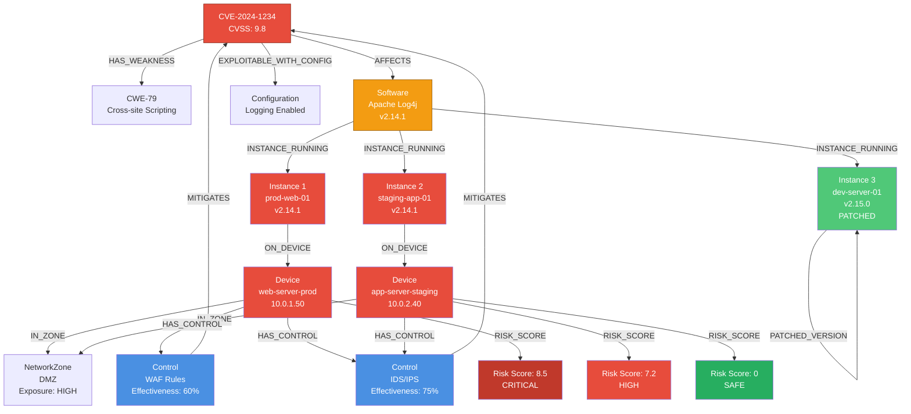
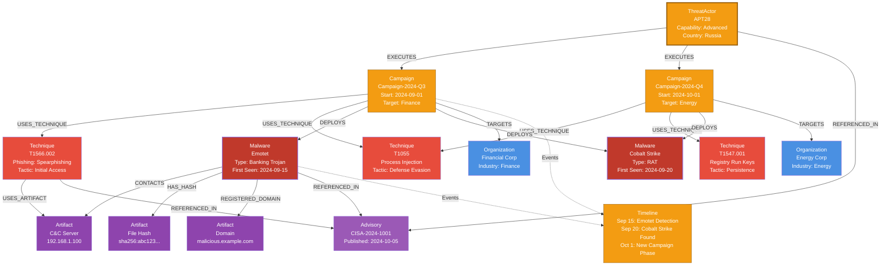
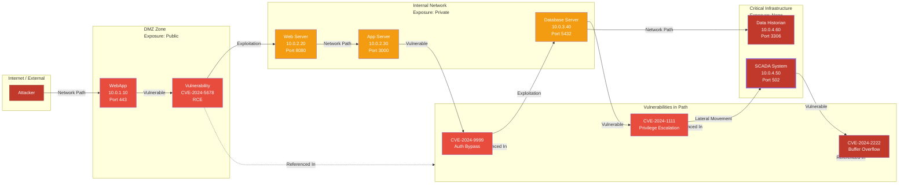
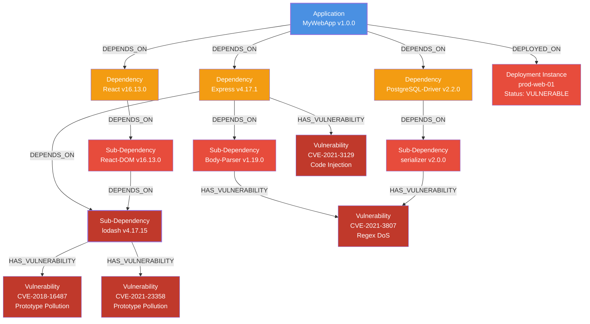
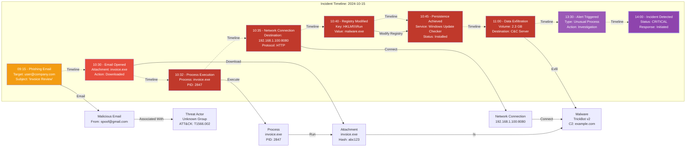
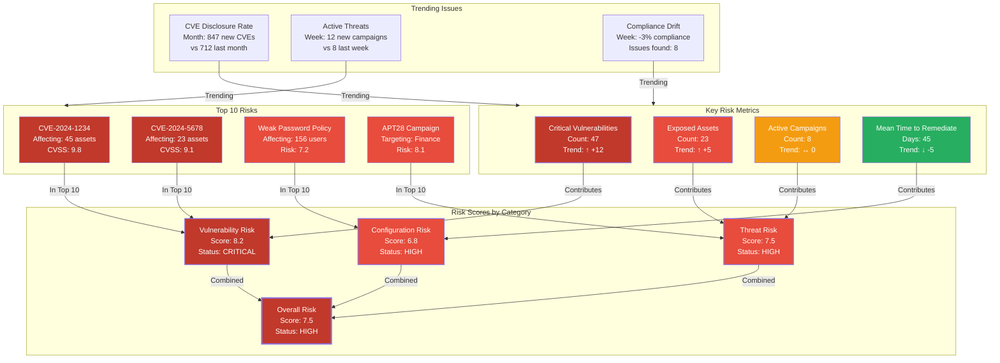

# Use Case Diagrams & Visualization Patterns

**Created:** 2025-10-29
**Purpose:** Visual documentation of the 7 primary use cases with graph patterns and data flows

---

## Use Case 1: Vulnerability Impact Assessment

**Objective:** Determine which assets are vulnerable to a specific CVE and calculate risk scores

### Graph Pattern



### Example Data Flow
```
MATCH (c:CVE {id: 'CVE-2024-1234'})
MATCH (s:Software)-[:HAS_VULNERABILITY]->(c)
MATCH (si:SoftwareInstance {version: '2.14.1'})-[:INSTANCE_OF]->(s)
MATCH (d:Device)<-[:ON_DEVICE]-(si)
OPTIONAL MATCH (c)<-[:MITIGATES]-(control:SecurityControl)
RETURN d.hostname, d.ip_address, c.cvss_score,
       count(control) as control_count
ORDER BY c.cvss_score DESC
```

### Risk Assessment Calculation
- **Base Risk**: CVSS Score (9.8)
- **Exposure**: Network Zone classification (DMZ = HIGH)
- **Mitigation**: Active controls effectiveness
- **Final Score**: 8.5 = 9.8 × (1 - 0.6) × 0.95 (DMZ multiplier)

---

## Use Case 2: Threat Actor Campaign Tracking

**Objective:** Track a threat actor's campaigns, techniques, and malware deployments

### Graph Pattern



### Example Query
```
MATCH (ta:ThreatActor {name: 'APT28'})
MATCH (ta)-[:EXECUTES]->(campaign:Campaign)
MATCH (campaign)-[:USES_TECHNIQUE]->(technique:Technique)
MATCH (campaign)-[:DEPLOYS]->(malware:Malware)
MATCH (malware)-[:HAS_ARTIFACT]->(artifact:Artifact)
RETURN
    campaign.name,
    collect(distinct technique.name) as techniques,
    collect(distinct malware.name) as malware_used,
    collect(distinct artifact.type) as artifacts,
    campaign.start_date
ORDER BY campaign.start_date DESC
```

### Timeline Analysis
- **Phase 1 (Sep 15)**: Initial access via phishing, Emotet deployment
- **Phase 2 (Sep 20)**: Lateral movement, Cobalt Strike for persistence
- **Phase 3 (Oct 1)**: New campaign phase targeting energy sector

---

## Use Case 3: Attack Path Discovery

**Objective:** Identify potential attack paths from internet-facing assets to critical infrastructure

### Graph Pattern



### Path Discovery Query
```
MATCH path = (start:Device {exposure: 'Public'})
-[*1..5]->(end:Device {critical: true})
WHERE all(node in nodes(path)
          WHERE (node)-[:HAS_VULNERABILITY]->())
RETURN
    [n in nodes(path) | n.hostname] as attack_path,
    length(path) as hop_count,
    reduce(risk=0, rel in relationships(path) | risk + rel.risk_score) as total_risk
ORDER BY total_risk DESC
```

### Risk Assessment
- **Exposure**: DMZ device exposed to internet
- **Entry Point**: RCE vulnerability (CVSS 9.8)
- **Lateral Movement**: Web → App → Database → SCADA
- **Impact**: Critical SCADA compromise
- **Risk Level**: CRITICAL

---

## Use Case 4: Asset Configuration Compliance

**Objective:** Verify that critical assets meet security configuration requirements

### Graph Pattern



```mermaid
graph TD
    subgraph Requirements["Security Requirements"]
        Req1["Requirement: TLS 1.2+<br/>Severity: HIGH"]
        Req2["Requirement: Firewall Rules<br/>Severity: HIGH"]
        Req3["Requirement: Log Aggregation<br/>Severity: MEDIUM"]
        Req4["Requirement: No Default Creds<br/>Severity: CRITICAL"]
    end

    subgraph Assets["Assets to Audit"]
        Device1["Device: web-prod<br/>Type: Web Server"]
        Device2["Device: db-prod<br/>Type: Database"]
        Device3["Device: app-staging<br/>Type: App Server"]
    end

    subgraph Configurations["Actual Configurations"]
        Config1["TLS 1.1<br/>Status: NON-COMPLIANT"]
        Config2["TLS 1.3<br/>Status: COMPLIANT"]
        Config3["Firewall Rules<br/>Status: COMPLIANT"]
        Config4["No Logging<br/>Status: NON-COMPLIANT"]
        Config5["Admin/Admin<br/>Status: CRITICAL"]
    end

    subgraph Results["Compliance Results"]
        Result1["Device: web-prod<br/>Compliance: 25%<br/>Status: CRITICAL"]
        Result2["Device: db-prod<br/>Compliance: 100%<br/>Status: COMPLIANT"]
        Result3["Device: app-staging<br/>Compliance: 50%<br/>Status: NON-COMPLIANT"]
    end

    Req1 -->|Check Configuration| Config1
    Req1 -->|Check Configuration| Config2
    Req2 -->|Check Configuration| Config3
    Req3 -->|Check Configuration| Config4
    Req4 -->|Check Configuration| Config5

    Device1 -->|Has Configuration| Config1
    Device1 -->|Has Configuration| Config4
    Device1 -->|Has Configuration| Config5
    Device2 -->|Has Configuration| Config2
    Device2 -->|Has Configuration| Config3
    Device3 -->|Has Configuration| Config1
    Device3 -->|Has Configuration| Config4

    Device1 -->|Audit Result| Result1
    Device2 -->|Audit Result| Result2
    Device3 -->|Audit Result| Result3

    style Req1 fill:#4A90E2,color:#fff
    style Req2 fill:#4A90E2,color:#fff
    style Req3 fill:#4A90E2,color:#fff
    style Req4 fill:#4A90E2,color:#fff
    style Config1 fill:#E74C3C,color:#fff
    style Config2 fill:#27AE60,color:#fff
    style Config3 fill:#27AE60,color:#fff
    style Config4 fill:#E74C3C,color:#fff
    style Config5 fill:#C0392B,color:#fff
    style Result1 fill:#C0392B,color:#fff
    style Result2 fill:#27AE60,color:#fff
    style Result3 fill:#E74C3C,color:#fff
```

### Compliance Query
```
MATCH (requirement:SecurityRequirement)
MATCH (device:Device)
OPTIONAL MATCH (device)-[:HAS_CONFIGURATION]->(config:Configuration)
WHERE config.name = requirement.name
WITH device, requirement, config,
     CASE WHEN config.status = 'COMPLIANT' THEN 1 ELSE 0 END as compliant
RETURN
    device.hostname,
    device.type,
    count(requirement) as total_requirements,
    sum(compliant) as compliant_count,
    round(100.0 * sum(compliant) / count(requirement), 2) as compliance_percentage,
    collect(requirement.name + ': ' + coalesce(config.status, 'MISSING')) as details
ORDER BY compliance_percentage
```

---

## Use Case 5: Software Bill of Materials (SBOM) Analysis

**Objective:** Track all software components and identify vulnerable dependencies

### Graph Pattern



### SBOM Query
```
MATCH (app:Application {name: 'MyWebApp'})
MATCH (dep:Dependency)-[*0..5]->(app)
OPTIONAL MATCH (dep)-[:HAS_VULNERABILITY]->(vuln:Vulnerability)
WITH dep, vuln, app
RETURN
    dep.name + '@' + dep.version as component,
    CASE WHEN vuln IS NOT NULL THEN 'VULNERABLE'
         ELSE 'SAFE' END as status,
    collect({
        id: vuln.id,
        cvss: vuln.cvss_score
    }) as vulnerabilities,
    dep.license
ORDER BY coalesce(vuln.cvss_score, 0) DESC
```

---

## Use Case 6: Incident Response Timeline

**Objective:** Reconstruct incident timeline using logs, alerts, and threat intelligence

### Graph Pattern



### Incident Timeline Query
```
MATCH (incident:Incident {id: 'INC-2024-1001'})
MATCH (incident)-[:CONTAINS_EVENT]->(event:Event)
WITH event
ORDER BY event.timestamp
MATCH (event)-[:INVOLVES]->(entity)
RETURN
    event.timestamp,
    event.type,
    event.description,
    collect(entity.name) as affected_entities,
    event.severity
ORDER BY event.timestamp
```

---

## Use Case 7: Executive Risk Dashboard

**Objective:** Provide high-level risk metrics and trends for executive reporting

### Graph Pattern



### Executive Dashboard Query
```
MATCH (org:Organization)
WITH org

// Critical vulnerabilities
MATCH (vuln:Vulnerability {severity: 'CRITICAL'})
MATCH (vuln)-[:AFFECTS]->(asset:Asset)-[:OWNED_BY]->(org)
WITH org, count(distinct vuln) as critical_vulns

// Exposed assets
MATCH (asset:Asset)-[:IN_ZONE]->(zone:NetworkZone {exposure: 'PUBLIC'})
MATCH (asset)-[:OWNED_BY]->(org)
WITH org, critical_vulns, count(distinct asset) as exposed_assets

// Active campaigns
MATCH (campaign:Campaign {status: 'ACTIVE'})
MATCH (campaign)-[:TARGETS]->(target)-[:OWNED_BY]->(org)
WITH org, critical_vulns, exposed_assets, count(distinct campaign) as campaigns

RETURN
    org.name,
    critical_vulns,
    exposed_assets,
    campaigns,
    (critical_vulns + exposed_assets * 0.5 + campaigns * 2) / 10 as risk_score
```

---

## Summary Table

| Use Case | Key Entities | Primary Query Type | Output |
|----------|--------------|-------------------|--------|
| Vulnerability Impact | CVE, Software, Device | Shortest path | Risk scores, affected assets |
| Campaign Tracking | ThreatActor, Campaign, Technique | Graph traversal | IOCs, timeline, targets |
| Attack Path | Device, Vulnerability, NetworkZone | Path finding | Attack chain, risk assessment |
| Compliance | Device, Configuration, Requirement | Pattern matching | Compliance percentage, gaps |
| SBOM Analysis | Application, Dependency, Vulnerability | Tree traversal | Component tree, vulnerable deps |
| Incident Timeline | Event, Entity, Timestamp | Chronological | Timeline reconstruction, root cause |
| Risk Dashboard | All entities | Aggregate functions | Metrics, scores, trends |
