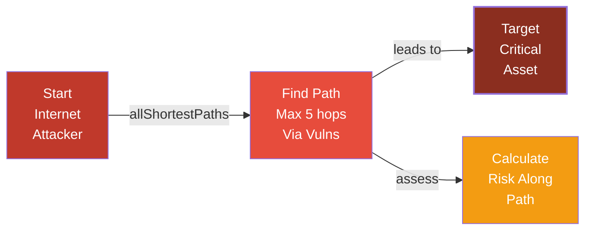
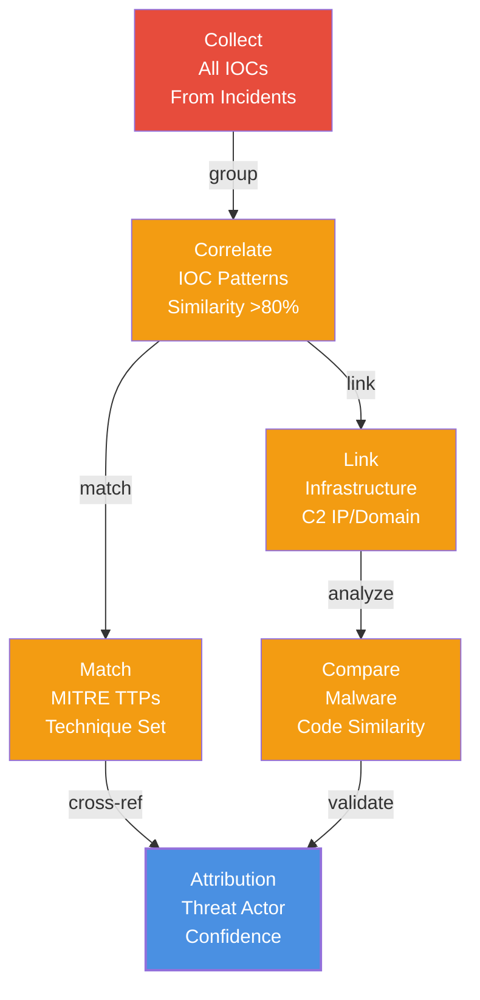
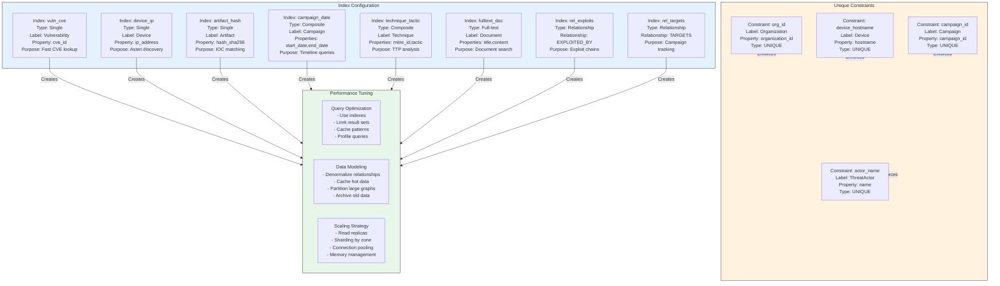
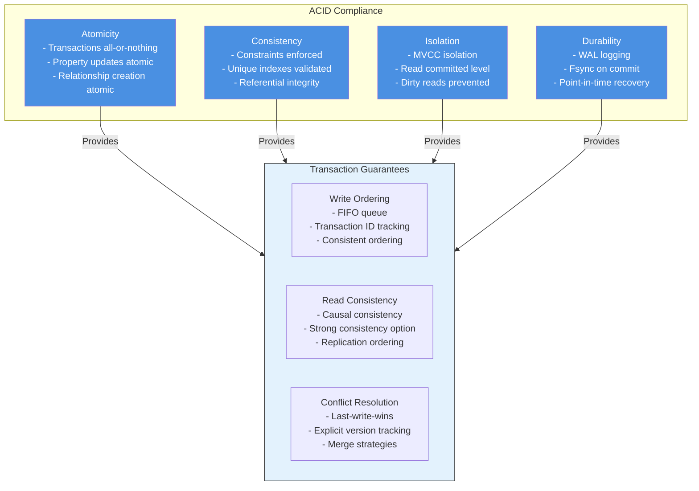
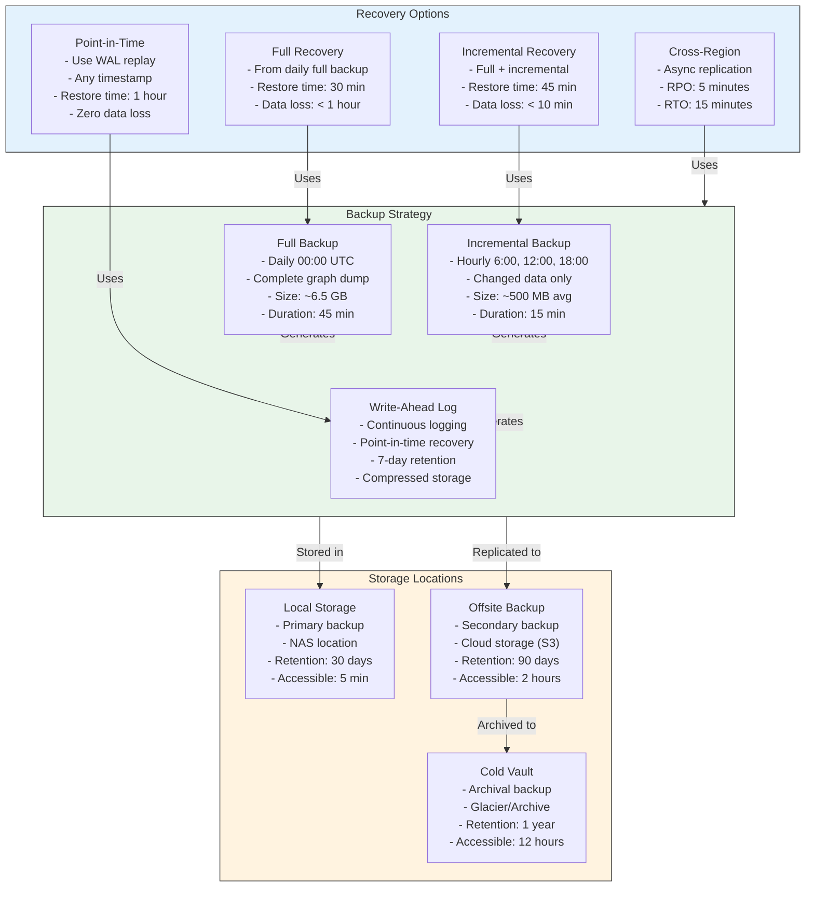

# Entity-Relationship Diagrams & Database Schema

**Created:** 2025-10-29
**Purpose:** Comprehensive ER diagrams showing Neo4j property graph schema and relationships

---

## 1. Complete Entity-Relationship Diagram

```mermaid
erDiagram
    ORGANIZATION ||--o{ SITE : operates
    SITE ||--o{ TRAIN : hosts
    TRAIN ||--o{ COMPONENT : has_component
    COMPONENT ||--o{ SOFTWARE_INSTANCE : runs
    SOFTWARE_INSTANCE ||--o{ SOFTWARE : instance_of

    SITE ||--o{ NETWORK_ZONE : contains
    NETWORK_ZONE ||--o{ DEVICE : has_device
    DEVICE ||--o{ NETWORK_INTERFACE : has_interface
    DEVICE ||--o{ SERVICE : runs_service
    SERVICE ||--o{ NETWORK_INTERFACE : on_interface

    SOFTWARE ||--o{ VULNERABILITY : has_vulnerability
    SOFTWARE ||--o{ WEAKNESS : has_weakness
    COMPONENT ||--o{ CONFIGURATION : has_configuration
    WEAKNESS ||--o{ VULNERABILITY : manifests_as

    VULNERABILITY ||--o{ TECHNIQUE : exploited_by
    VULNERABILITY ||--o{ MALWARE : exploited_by
    TECHNIQUE ||--o{ ARTIFACT : uses_artifact
    MALWARE ||--o{ ARTIFACT : creates_artifact

    THREAT_ACTOR ||--o{ CAMPAIGN : executes
    CAMPAIGN ||--o{ TECHNIQUE : uses_technique
    CAMPAIGN ||--o{ MALWARE : deploys_malware

    SECURITY_CONTROL ||--o{ VULNERABILITY : mitigates
    SECURITY_CONTROL ||--o{ WEAKNESS : mitigates
    SECURITY_CONTROL ||--o{ TECHNIQUE : mitigates
    DEVICE ||--o{ SECURITY_CONTROL : has_control

    VULNERABILITY ||--o{ ADVISORY : referenced_in
    VULNERABILITY ||--o{ REPORT : referenced_in
    MALWARE ||--o{ REPORT : referenced_in
    THREAT_ACTOR ||--o{ REPORT : referenced_in
    CAMPAIGN ||--o{ REPORT : referenced_in
    TECHNIQUE ||--o{ DOCUMENT : referenced_in
    ADVISORY ||--o{ SOFTWARE : about_product

    THREAT_ACTOR ||--o{ ORGANIZATION : targets
    CAMPAIGN ||--o{ SOFTWARE : targets_industry
    MALWARE ||--o{ DEVICE : affects
    TECHNIQUE ||--o{ SOFTWARE : affects_asset
    ARTIFACT ||--o{ DEVICE : found_on

    MALWARE ||--o{ ARTIFACT : has_ioc
    CAMPAIGN ||--o{ ARTIFACT : has_ioc

    ORGANIZATION : organization_id PK
    ORGANIZATION : name
    ORGANIZATION : type
    ORGANIZATION : founded_date
    ORGANIZATION : industry
    ORGANIZATION : size
    ORGANIZATION : location

    SITE : site_id PK
    SITE : name
    SITE : location
    SITE : classification
    SITE : criticality
    SITE : last_assessed

    TRAIN : train_id PK
    TRAIN : name
    TRAIN : description
    TRAIN : ics_category
    TRAIN : criticality_level

    COMPONENT : component_id PK
    COMPONENT : name
    COMPONENT : type
    COMPONENT : manufacturer
    COMPONENT : model
    COMPONENT : serial_number
    COMPONENT : installation_date

    SOFTWARE : software_id PK
    SOFTWARE : name
    SOFTWARE : vendor
    SOFTWARE : product_type
    SOFTWARE : release_date
    SOFTWARE : cpe

    SOFTWARE_INSTANCE : instance_id PK
    SOFTWARE_INSTANCE : version
    SOFTWARE_INSTANCE : install_date
    SOFTWARE_INSTANCE : patch_level
    SOFTWARE_INSTANCE : license_type

    NETWORK_ZONE : zone_id PK
    NETWORK_ZONE : name
    NETWORK_ZONE : cidr
    NETWORK_ZONE : security_level
    NETWORK_ZONE : classification

    DEVICE : device_id PK
    DEVICE : hostname
    DEVICE : ip_address
    DEVICE : mac_address
    DEVICE : device_type
    DEVICE : os
    DEVICE : criticality

    NETWORK_INTERFACE : interface_id PK
    NETWORK_INTERFACE : name
    NETWORK_INTERFACE : ip_address
    NETWORK_INTERFACE : port
    NETWORK_INTERFACE : protocol
    NETWORK_INTERFACE : bandwidth

    SERVICE : service_id PK
    SERVICE : name
    SERVICE : port
    SERVICE : protocol
    SERVICE : version
    SERVICE : status

    VULNERABILITY : vuln_id PK
    VULNERABILITY : cve_id
    VULNERABILITY : cvss_score
    VULNERABILITY : cvss_vector
    VULNERABILITY : published_date
    VULNERABILITY : cwe_ids
    VULNERABILITY : description

    WEAKNESS : weakness_id PK
    WEAKNESS : cwe_id
    WEAKNESS : name
    WEAKNESS : description
    WEAKNESS : severity
    WEAKNESS : category

    CONFIGURATION : config_id PK
    CONFIGURATION : name
    CONFIGURATION : value
    CONFIGURATION : security_impact
    CONFIGURATION : status
    CONFIGURATION : last_verified

    SECURITY_CONTROL : control_id PK
    SECURITY_CONTROL : name
    SECURITY_CONTROL : type
    SECURITY_CONTROL : status
    SECURITY_CONTROL : effectiveness_percentage
    SECURITY_CONTROL : implementation_date

    THREAT_ACTOR : actor_id PK
    THREAT_ACTOR : name
    THREAT_ACTOR : aliases
    THREAT_ACTOR : country
    THREAT_ACTOR : capability_level
    THREAT_ACTOR : motivation

    CAMPAIGN : campaign_id PK
    CAMPAIGN : name
    CAMPAIGN : description
    CAMPAIGN : start_date
    CAMPAIGN : end_date
    CAMPAIGN : target_industry
    CAMPAIGN : success_rate

    TECHNIQUE : technique_id PK
    TECHNIQUE : mitre_id
    TECHNIQUE : name
    TECHNIQUE : tactic
    TECHNIQUE : platform
    TECHNIQUE : description

    MALWARE : malware_id PK
    MALWARE : name
    MALWARE : type
    MALWARE : family
    MALWARE : hash_sha256
    MALWARE : first_seen
    MALWARE : last_seen

    ARTIFACT : artifact_id PK
    ARTIFACT : type
    ARTIFACT : value
    ARTIFACT : hash_sha256
    ARTIFACT : file_name
    ARTIFACT : size
    ARTIFACT : confidence

    DOCUMENT : doc_id PK
    DOCUMENT : title
    DOCUMENT : doc_type
    DOCUMENT : published_date
    DOCUMENT : source
    DOCUMENT : url

    ADVISORY : advisory_id PK
    ADVISORY : advisory_number
    ADVISORY : issued_date
    ADVISORY : updated_date
    ADVISORY : affected_products
    ADVISORY : description

    REPORT : report_id PK
    REPORT : report_type
    REPORT : title
    REPORT : author
    REPORT : publish_date
    REPORT : severity_level
```

---

## 2. Cypher Query Pattern Diagrams

### Pattern 1: Vulnerability Impact Path


```cypher
MATCH (vuln:Vulnerability {id: 'CVE-2024-1234'})
MATCH (soft:Software)-[:HAS_VULNERABILITY]->(vuln)
MATCH (inst:SoftwareInstance)-[:INSTANCE_OF]->(soft)
WHERE inst.version = '2.14.1'
MATCH (dev:Device)-[:RUNS_SOFTWARE]->(inst)
MATCH (dev)-[:IN_ZONE]->(zone:NetworkZone)
OPTIONAL MATCH (vuln)<-[:MITIGATES]-(ctrl:SecurityControl)<-[:HAS_CONTROL]-(dev)
WITH dev, vuln, zone,
     coalesce(sum(ctrl.effectiveness), 0) as mitigation
RETURN
    dev.hostname,
    dev.ip_address,
    dev.criticality,
    vuln.cvss_score,
    zone.security_level,
    vuln.cvss_score * (1 - mitigation/100) as risk_score
ORDER BY risk_score DESC
```

### Pattern 2: Attack Path Discovery



```cypher
MATCH (start:Device {exposure: 'PUBLIC'}),
      (target:Device {criticality: 'CRITICAL'})
CALL apoc.algo.allShortestPaths(start, target,
     'CONNECTED_TO|VULN_PATH', 5)
YIELD path
WITH path,
     reduce(risk = 0, rel in relationships(path) |
            risk + coalesce(rel.risk_score, 0)) as path_risk
WHERE path_risk > 0
RETURN
    [n in nodes(path) | n.hostname] as attack_path,
    length(path) as hops,
    path_risk,
    [r in relationships(path) | r.type] as attack_techniques
ORDER BY path_risk DESC
LIMIT 10
```

### Pattern 3: Campaign Attribution



```cypher
MATCH (campaign:Campaign)
MATCH (campaign)-[:HAS_ARTIFACT]->(artifact:Artifact)
MATCH (campaign)-[:USES_TECHNIQUE]->(technique:Technique)
MATCH (campaign)-[:DEPLOYS_MALWARE]->(malware:Malware)
WITH campaign,
     collect(DISTINCT artifact.value) as artifacts,
     collect(DISTINCT technique.mitre_id) as techniques,
     collect(DISTINCT malware.hash_sha256) as malware_hashes

MATCH (other_campaign:Campaign)
WHERE other_campaign <> campaign

// Calculate correlation score
WITH campaign, other_campaign,
     gds.similarity.jaccard(artifacts,
     [oc in (other_campaign)-[:HAS_ARTIFACT]->(a:Artifact) | a.value])
     as artifact_sim,
     gds.similarity.jaccard(techniques,
     [ot in (other_campaign)-[:USES_TECHNIQUE]->(t:Technique) | t.mitre_id])
     as technique_sim

WHERE (artifact_sim + technique_sim) / 2 > 0.80

RETURN campaign.name, other_campaign.name,
       round((artifact_sim + technique_sim) / 2, 2) as correlation_score
ORDER BY correlation_score DESC
```

---

## 3. Neo4j Index Strategy



**Cypher Index Creation:**

```cypher
-- Single Property Indexes
CREATE INDEX idx_vuln_cve FOR (v:Vulnerability) ON (v.cve_id);
CREATE INDEX idx_device_ip FOR (d:Device) ON (d.ip_address);
CREATE INDEX idx_artifact_hash FOR (a:Artifact) ON (a.hash_sha256);
CREATE INDEX idx_org_name FOR (o:Organization) ON (o.name);
CREATE INDEX idx_threat_actor FOR (t:ThreatActor) ON (t.name);

-- Composite Indexes
CREATE INDEX idx_campaign_date FOR (c:Campaign) ON (c.start_date, c.end_date);
CREATE INDEX idx_technique_tactic FOR (t:Technique) ON (t.mitre_id, t.tactic);
CREATE INDEX idx_device_zone FOR (d:Device) ON (d.ip_address, d.zone_id);

-- Full-text Index
CREATE INDEX idx_fulltext_document FOR (d:Document) ON EACH [d.title, d.content];

-- Unique Constraints
CREATE CONSTRAINT org_id_unique FOR (o:Organization) REQUIRE o.organization_id IS UNIQUE;
CREATE CONSTRAINT device_hostname_unique FOR (d:Device) REQUIRE d.hostname IS UNIQUE;
CREATE CONSTRAINT campaign_id_unique FOR (c:Campaign) REQUIRE c.campaign_id IS UNIQUE;
CREATE CONSTRAINT threat_actor_unique FOR (t:ThreatActor) REQUIRE t.name IS UNIQUE;
CREATE CONSTRAINT cve_id_unique FOR (v:Vulnerability) REQUIRE v.cve_id IS UNIQUE;

-- Relationship Indexes
CREATE INDEX idx_exploited_by FOR ()-[r:EXPLOITED_BY]->() ON (r.cvss_score);
CREATE INDEX idx_targets FOR ()-[r:TARGETS]->() ON (r.success_rate);
```

---

## 4. Data Volume & Storage Estimation

| Entity Type | Expected Count | Avg Properties | Storage (GB) |
|-------------|------------------|----------------|-------------|
| Organization | 5,000 | 8 | 0.05 |
| Site | 50,000 | 10 | 0.25 |
| Device | 500,000 | 15 | 1.5 |
| Software | 100,000 | 12 | 0.3 |
| SoftwareInstance | 1,500,000 | 10 | 3.0 |
| Vulnerability (CVE) | 200,000 | 20 | 1.0 |
| Malware | 50,000 | 18 | 0.3 |
| Technique (MITRE) | 600 | 12 | 0.01 |
| ThreatActor | 2,000 | 10 | 0.02 |
| Campaign | 5,000 | 15 | 0.05 |
| **Total Graph Storage** | | | **~6 GB** |
| Index Storage (15%) | | | **~0.9 GB** |
| Replication (3x) | | | **~20.7 GB** |
| **Total DB Size** | | | **~27 GB** |

---

## 5. Data Consistency & ACID Properties



---

## 6. Backup & Recovery Schema



---

## Summary: Database Architecture

### Key Characteristics
- **Graph Model:** Property graph with labeled nodes and relationships
- **Node Types:** 15 (Organization, Device, Vulnerability, Campaign, etc.)
- **Relationship Types:** 25+ (HAS_VULNERABILITY, EXPLOITED_BY, TARGETS, etc.)
- **Scale:** ~2-3M nodes, ~5-10M relationships
- **Storage:** ~27 GB with replication (3x primary)

### Performance Targets
- **Query latency:** <100ms for 95th percentile
- **Throughput:** 1000+ queries/second
- **Backup time:** 45 minutes (full)
- **Recovery time:** 30 minutes (full) to 2 hours (point-in-time)

### Reliability
- **Availability:** 99.95% uptime (4 hours/year)
- **Data durability:** 99.999% (RPO < 10 minutes)
- **Consistency:** Strong consistency guarantee
- **Failover:** Automatic (< 30 seconds)
