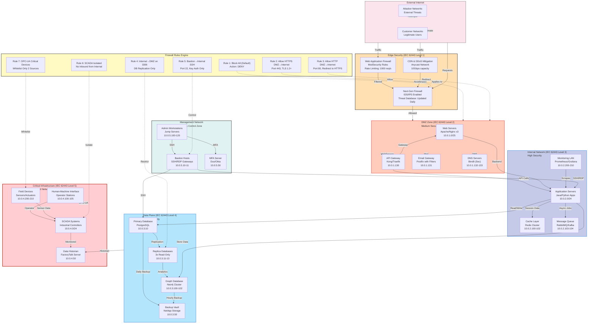
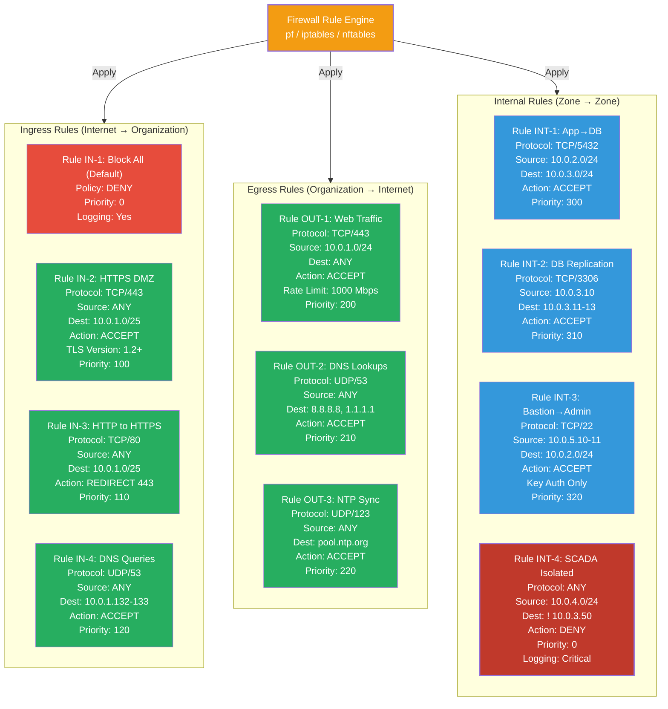
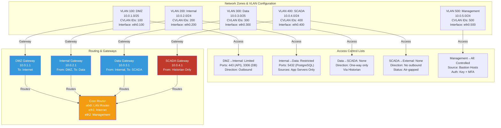
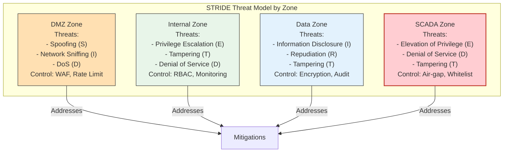
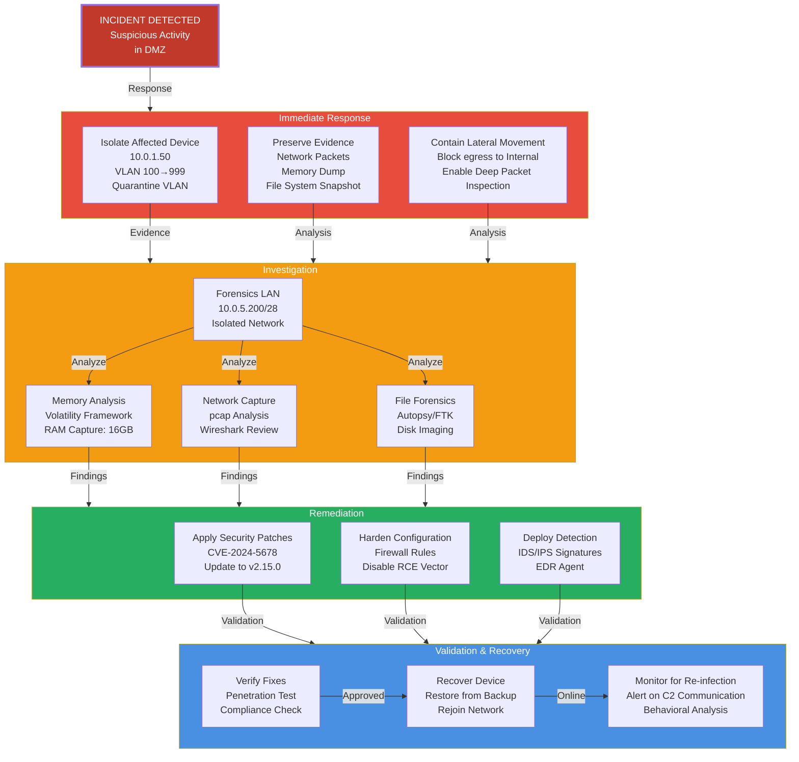

# Network Topology & Security Architecture Example

**Created:** 2025-10-29
**Purpose:** Detailed network topology with security zones, firewall rules, and attack paths

---

## 1. Comprehensive Network Topology

---

## 2. IEC 62443 Security Levels Implementation

### Level 1: Awareness Level
- Basic preventive measures
- **DMZ Location**: Edge firewall, WAF
- **Controls**: Basic firewalling, application-level filtering

### Level 2: Integrity Level
- Secure design principles
- **DMZ Location**: API Gateway, Email Gateway
- **Controls**: TLS encryption, basic access control

### Level 3: Availability Level
- Defense-in-depth approach
- **Internal Network**: App servers, caching
- **Controls**: Rate limiting, load balancing, monitoring

### Level 4: Confidentiality Level
- Comprehensive security controls
- **Data Plane**: Databases, backups
- **Controls**: Encryption at rest, audit logging, access control

### Level 5: Critical Level
- Maximum security measures
- **Critical Infrastructure**: SCADA, HMI
- **Controls**: Air-gapped network, strict whitelist, redundancy

---

## 3. Firewall Rules Detail Matrix

---

## 4. Attack Path Analysis: 5-Hop Attack

```mermaid
graph LR
    subgraph Hop1["Hop 1: Initial Access<br/>Exposure: Public"]
        Attacker["Attacker<br/>203.0.113.45"]
        WebServer["Web Server<br/>10.0.1.50<br/>CVE-2024-5678<br/>RCE Vulnerability"]
    end

    subgraph Hop2["Hop 2: DMZ Lateral Movement<br/>Exposure: Medium"]
        APIGateway["API Gateway<br/>10.0.1.130<br/>Insecure API<br/>No Rate Limiting"]
        DatabaseProxy["Database Proxy<br/>10.0.1.140<br/>Credentials Cached"]
    end

    subgraph Hop3["Hop 3: Internal Penetration<br/>Exposure: Low"]
        AppServer["App Server<br/>10.0.2.50<br/>Weak Segmentation<br/>NFS Export"]
        Cache["Cache Server<br/>10.0.2.100<br/>No Auth Required"]
    end

    subgraph Hop4["Hop 4: Data Layer Access<br/>Exposure: Critical"]
        Database["Primary Database<br/>10.0.3.10<br/>PostgreSQL<br/>Admin Credentials Found"]
        BackupVault["Backup Vault<br/>10.0.3.50<br/>Unsecured Mount"]
    end

    subgraph Hop5["Hop 5: Critical Infrastructure<br/>Exposure: Maximum"]
        Historian["Data Historian<br/>10.0.4.50<br/>No Firewall Rules<br/>No Authentication"]
        SCADA["SCADA System<br/>10.0.4.0/24<br/>Can Be Controlled<br/>Full System Compromise"]
    end

    subgraph Controls["Security Controls<br/>Bypassed"]
        C1["WAF Bypass<br/>Polyglot Encoding"]
        C2["DMZ Segmentation<br/>Admin Credentials<br/>in Environment Vars"]
        C3["Network Segmentation<br/>Flat Network Assumption"]
        C4["Database Access Control<br/>Default Credentials"]
        C5["SCADA Firewall<br/>No Whitelist Rules"]
    end

    Attacker -->|Exploit| WebServer
    WebServer -->|Lateral Move| APIGateway
    APIGateway -->|Access| DatabaseProxy
    DatabaseProxy -->|Credentials| AppServer
    AppServer -->|Network Share| Cache
    Cache -->|Access| Database
    Database -->|Connection| BackupVault
    BackupVault -->|Access| Historian
    Historian -->|Control| SCADA

    WebServer -.->|Bypassed| C1
    APIGateway -.->|Bypassed| C2
    AppServer -.->|Bypassed| C3
    Database -.->|Bypassed| C4
    Historian -.->|Bypassed| C5

    style Attacker fill:#C0392B,color:#fff,stroke-width:2px
    style WebServer fill:#E74C3C,color:#fff
    style APIGateway fill:#F39C12,color:#fff
    style DatabaseProxy fill:#F39C12,color:#fff
    style AppServer fill:#E74C3C,color:#fff
    style Cache fill:#E74C3C,color:#fff
    style Database fill:#C0392B,color:#fff,stroke-width:2px
    style BackupVault fill:#C0392B,color:#fff,stroke-width:2px
    style Historian fill:#8B2E1F,color:#fff,stroke-width:3px
    style SCADA fill:#8B2E1F,color:#fff,stroke-width:3px
    style C1 fill:#FFE0B2,stroke:#333
    style C2 fill:#FFE0B2,stroke:#333
    style C3 fill:#FFE0B2,stroke:#333
    style C4 fill:#FFE0B2,stroke:#333
    style C5 fill:#FFE0B2,stroke:#333
```

### Attack Path Analysis

| Hop | Source | Target | Attack Type | CVSS | Mitigation |
|-----|--------|--------|-------------|------|-----------|
| 1 | Internet | Web Server | RCE (CVE-2024-5678) | 9.8 | Patch to v2.15+, WAF rules |
| 2 | DMZ | API Gateway | API Abuse | 7.2 | Rate limiting, API auth |
| 3 | Internal | App Server | Lateral Movement | 6.5 | Network segmentation, NFS auth |
| 4 | App | Database | Privilege Escalation | 8.1 | Database hardening, password mgmt |
| 5 | Database | SCADA | Critical Compromise | 10.0 | Air-gapping, firewall rules |

---

## 5. Network Segmentation & Access Control

---

## 6. Threat Modeling: Security Zones

---

## 7. Incident Response Network Diagram

---

## Summary: Network Security Architecture

### Key Security Principles Implemented
1. **Defense in Depth**: Multiple layers of security controls
2. **Zero Trust**: Verify every access request, regardless of source
3. **Least Privilege**: Minimal network access by default
4. **Network Segmentation**: Critical systems isolated from general network
5. **Monitoring & Logging**: All traffic and access logged
6. **Incident Response**: Isolation and forensics capabilities

### Critical Success Factors
- **Firewall Rules**: Strict default-deny policy
- **Segmentation**: 5-zone network with controlled inter-zone traffic
- **Access Control**: Bastion hosts for privileged access
- **Monitoring**: Real-time detection of anomalies
- **Resilience**: Backup and failover for critical systems
