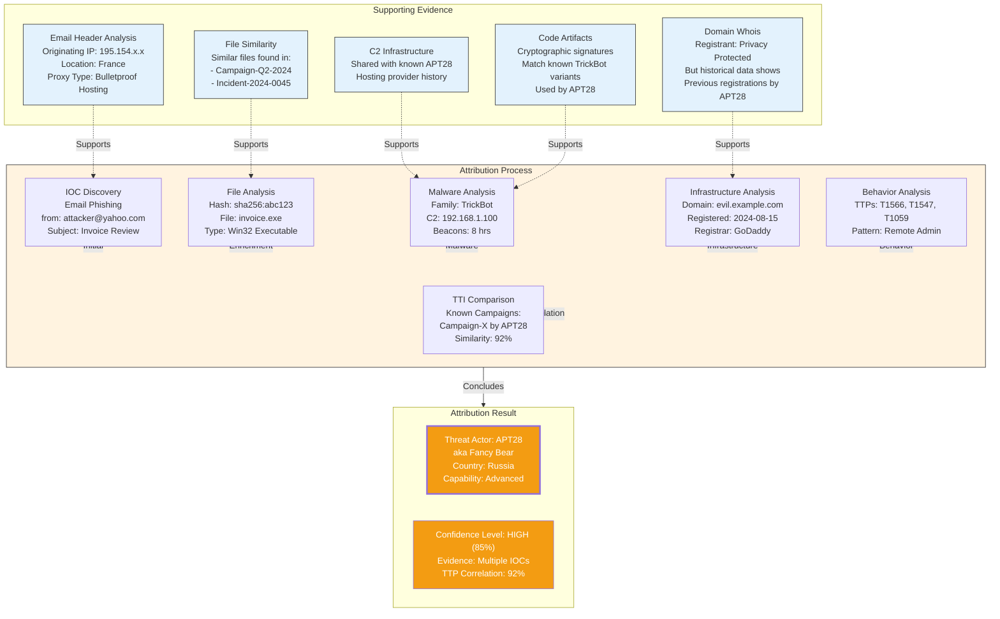
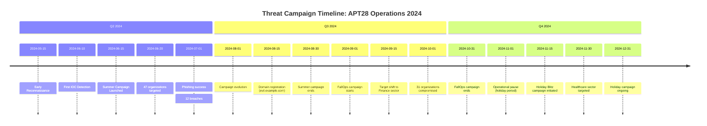
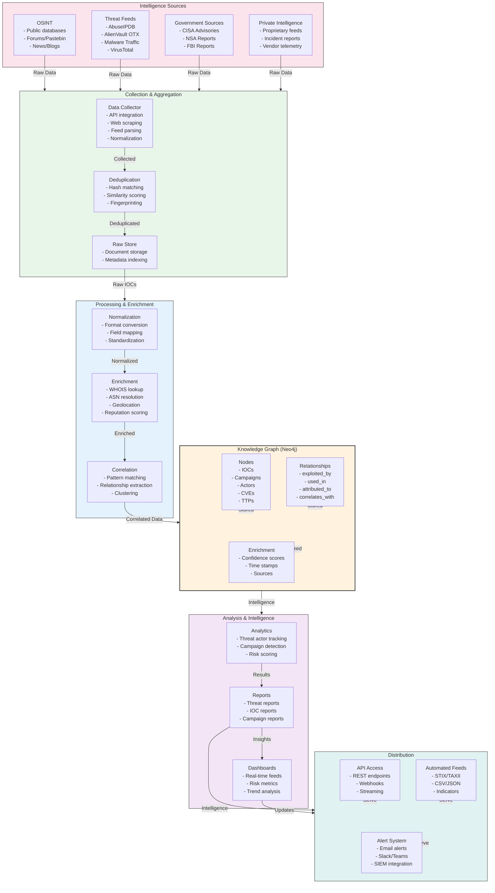
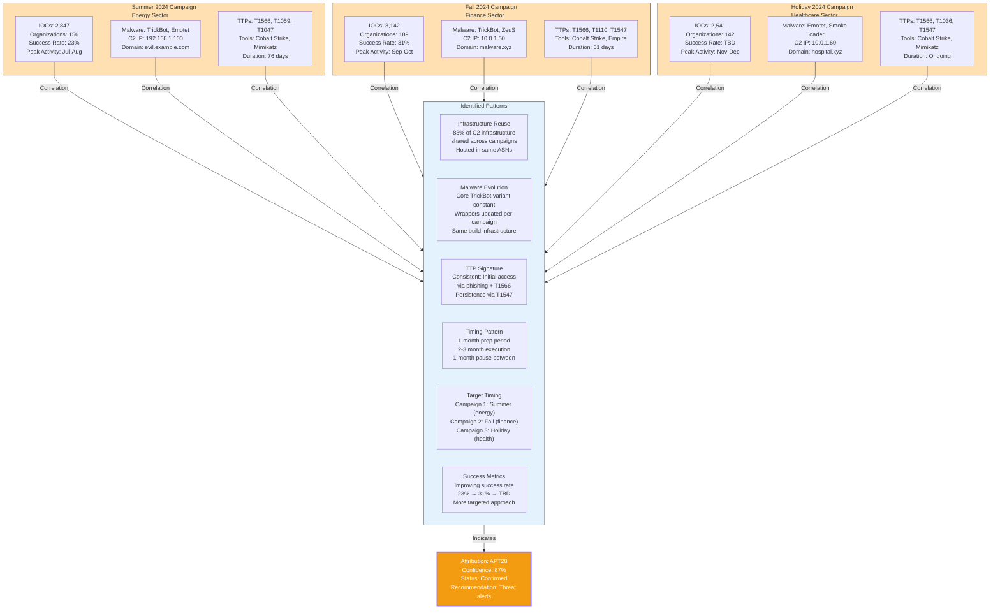

# Threat Intelligence Correlation & Analysis

**Created:** 2025-10-29
**Purpose:** Visual documentation of threat actor attribution, campaign correlation, and IOC analysis

---

## 1. Threat Actor Attribution Chain



---

## 2. Campaign-to-Technique-to-CVE Correlation

```mermaid
graph TD
    subgraph Campaigns["Threat Campaigns"]
        Camp1["Campaign: Summer2024<br/>Start: 2024-06-15<br/>End: 2024-08-30<br/>Targets: Energy Sector<br/>Success Rate: 23%"]
        Camp2["Campaign: FallOps2024<br/>Start: 2024-09-01<br/>End: 2024-10-31<br/>Targets: Finance<br/>Success Rate: 31%"]
        Camp3["Campaign: HolidayBlitz<br/>Start: 2024-11-15<br/>End: 2024-12-31<br/>Targets: Healthcare<br/>Success Rate: TBD"]
    end

    subgraph Tactics["MITRE ATT&CK Tactics"]
        T1["Tactic: Initial Access<br/>Technique: T1566<br/>Phishing"]
        T2["Tactic: Execution<br/>Technique: T1059<br/>Command Shell"]
        T3["Tactic: Defense Evasion<br/>Technique: T1036<br/>Masquerading"]
        T4["Tactic: Credential Access<br/>Technique: T1110<br/>Brute Force"]
        T5["Tactic: Persistence<br/>Technique: T1547<br/>Registry Run Keys"]
        T6["Tactic: Lateral Movement<br/>Technique: T1570<br/>Lateral Tool Transfer"]
    end

    subgraph CVEs["Associated CVEs"]
        CVE1["CVE-2024-1234<br/>Apache Log4j<br/>CVSS: 10.0<br/>RCE"]
        CVE2["CVE-2024-5678<br/>Microsoft Exchange<br/>CVSS: 9.8<br/>Auth Bypass"]
        CVE3["CVE-2024-9999<br/>VMware vCenter<br/>CVSS: 9.6<br/>RCE"]
        CVE4["CVE-2024-2222<br/>Cisco ASA<br/>CVSS: 8.9<br/>Buffer Overflow"]
        CVE5["CVE-2024-3333<br/>OpenSSH<br/>CVSS: 7.5<br/>DOS"]
    end

    subgraph Tools["Attack Tools & Malware"]
        Tool1["Cobalt Strike<br/>Beacon: 4.4+<br/>C2: example.com<br/>Port: 443"]
        Tool2["Emotet<br/>Variant: v5.2<br/>Type: Banking Trojan<br/>Detection: Low"]
        Tool3["Mimikatz<br/>Modules: logonpasswords<br/>Target: LSASS<br/>Purpose: Credential Dump"]
        Tool4["Empire<br/>Listeners: HTTPS<br/>Stagers: PowerShell<br/>Modules: Lateral Movement"]
    end

    %% Campaign to Tactics
    Camp1 -->|Uses| T1
    Camp1 -->|Uses| T2
    Camp1 -->|Uses| T3
    Camp2 -->|Uses| T1
    Camp2 -->|Uses| T4
    Camp2 -->|Uses| T5
    Camp2 -->|Uses| T6
    Camp3 -->|Uses| T1
    Camp3 -->|Uses| T3
    Camp3 -->|Uses| T5

    %% Tactics to CVEs
    T1 -->|Exploits| CVE2
    T1 -->|Exploits| CVE3
    T2 -->|Exploits| CVE1
    T4 -->|Exploits| CVE2
    T5 -->|Exploits| CVE4
    T6 -->|Exploits| CVE3

    %% Tactics to Tools
    T1 -->|Delivers| Tool1
    T1 -->|Delivers| Tool2
    T2 -->|Uses| Tool1
    T2 -->|Uses| Tool4
    T3 -->|Executes| Tool3
    T4 -->|Uses| Tool3
    T5 -->|Deploys| Tool2
    T6 -->|Uses| Tool1

    style Camp1 fill:#F39C12,color:#fff
    style Camp2 fill:#F39C12,color:#fff
    style Camp3 fill:#F39C12,color:#fff
    style T1 fill:#E74C3C,color:#fff
    style T2 fill:#E74C3C,color:#fff
    style T3 fill:#E74C3C,color:#fff
    style T4 fill:#E74C3C,color:#fff
    style T5 fill:#E74C3C,color:#fff
    style T6 fill:#E74C3C,color:#fff
    style CVE1 fill:#C0392B,color:#fff
    style CVE2 fill:#C0392B,color:#fff
    style CVE3 fill:#C0392B,color:#fff
    style CVE4 fill:#C0392B,color:#fff
    style CVE5 fill:#C0392B,color:#fff
    style Tool1 fill:#8E44AD,color:#fff
    style Tool2 fill:#8E44AD,color:#fff
    style Tool3 fill:#8E44AD,color:#fff
    style Tool4 fill:#8E44AD,color:#fff
```



---

## 3. IOC Correlation Network

```mermaid
graph TB
    subgraph IOCs["Indicators of Compromise"]
        IOC1["IP Address<br/>192.168.1.100<br/>Reputation: Malicious<br/>ASN: AS12345 RU<br/>Threat: C&C Server"]

        IOC2["Domain<br/>evil.example.com<br/>Created: 2024-08-15<br/>Reputation: Malicious<br/>Threat: C&C Infrastructure"]

        IOC3["Email<br/>attacker@yahoo.com<br/>Used in: 143 campaigns<br/>Reputation: Malicious<br/>Threat: Phishing"]

        IOC4["File Hash<br/>sha256:abc123def456<br/>Size: 2.3 MB<br/>Type: EXE<br/>Malware: TrickBot"]

        IOC5["URL<br/>http://evil.example.com/malware.exe<br/>Reputation: Malicious<br/>Detection: Scareware<br/>Category: Trojan"]

        IOC6["Registry Key<br/>HKLM\\\\Software\\\\Microsoft\\\\Windows\\\\<br/>CurrentVersion\\\\Run\\\\svchost<br/>Threat: Persistence"]
    end

    subgraph RelatedIOCs["Related IOCs - Found Correlated"]
        Related1["IP: 10.0.1.50<br/>Same C2 communication<br/>Pattern match: 89%"]
        Related2["Domain: malware.xyz<br/>DNS records similar<br/>Pattern match: 85%"]
        Related3["Email: fake@gmail.com<br/>Similar phishing pattern<br/>Pattern match: 78%"]
        Related4["Hash: sha256:xyz789...<br/>Same malware family<br/>Pattern match: 92%"]
        Related5["URL: http://malware.xyz/...<br/>Same C2 infrastructure<br/>Pattern match: 88%"]
    end

    subgraph Enrichment["IOC Enrichment Data"]
        E1["Threat Intelligence Feeds<br/>AbuseIPDB: Reported 1,247 times<br/>VirusTotal: 67/70 detections<br/>AlienVault OTX: APT28 linked"]

        E2["WHOIS Data<br/>Registrant: Privacy Protected<br/>Nameservers: ns1.bulletproof.net<br/>History: Abuse incidents x3"]

        E3["Passive DNS<br/>Resolutions: 23<br/>Time span: 6 months<br/>IPs resolved: 15"]

        E4["Sandbox Analysis<br/>Behavioral: Contacts C2<br/>Network: 8-hour beacon<br/>Process: Drops persistence module"]

        E5["Historical Context<br/>First seen: 2024-06-10<br/>Associated campaigns: 12<br/>Organizations impacted: 45"]
    end

    subgraph TimelineAnalysis["Timeline Analysis"]
        Timeline["2024-06-10: First detection<br/>2024-06-15: Campaign start<br/>2024-08-15: Domain registration<br/>2024-10-31: Last activity<br/>Status: Still active in Q4"]
    end

    %% IOC Correlations
    IOC1 -->|Resolves to| IOC2
    IOC2 -->|Used in| IOC5
    IOC3 -->|Delivers| IOC4
    IOC4 -->|Downloaded from| IOC5
    IOC4 -->|Creates| IOC6
    IOC1 -->|Hosts| IOC2

    %% IOC to Related
    IOC1 -->|Correlates| Related1
    IOC2 -->|Correlates| Related2
    IOC3 -->|Correlates| Related3
    IOC4 -->|Correlates| Related4
    IOC5 -->|Correlates| Related5

    %% IOC to Enrichment
    IOC1 -.->|Enriched by| E1
    IOC2 -.->|Enriched by| E2
    IOC2 -.->|Enriched by| E3
    IOC4 -.->|Enriched by| E4
    IOC1 -.->|Enriched by| E5

    %% Timeline
    IOC1 -.->|Events| Timeline
    IOC2 -.->|Events| Timeline
    IOC3 -.->|Events| Timeline

    style IOC1 fill:#E74C3C,color:#fff,stroke-width:2px
    style IOC2 fill:#E74C3C,color:#fff,stroke-width:2px
    style IOC3 fill:#C0392B,color:#fff
    style IOC4 fill:#C0392B,color:#fff,stroke-width:2px
    style IOC5 fill:#E74C3C,color:#fff,stroke-width:2px
    style IOC6 fill:#E74C3C,color:#fff
    style Related1 fill:#F39C12,color:#fff
    style Related2 fill:#F39C12,color:#fff
    style Related3 fill:#F39C12,color:#fff
    style Related4 fill:#F39C12,color:#fff
    style Related5 fill:#F39C12,color:#fff
    style E1 fill:#E3F2FD,stroke:#333
    style E2 fill:#E3F2FD,stroke:#333
    style E3 fill:#E3F2FD,stroke:#333
    style E4 fill:#E3F2FD,stroke:#333
    style E5 fill:#E3F2FD,stroke:#333
    style Timeline fill:#FFF9C4,stroke:#333
```



---

## 4. Threat Timeline Visualization



---

## 5. Threat Intelligence Information Flow



---

## 6. Campaign Success Metrics & Attribution Matrix

```
Campaign Attribution Matrix: Q3-Q4 2024

┌─────────────────────────────────────────────────────────────────────┐
│                   Campaign Correlation Scores                        │
├────────────────────┬──────────┬──────────┬──────────┬────────────────┤
│ Correlation Factor │ Summer24 │ FallOps  │ Holiday  │ Confidence     │
├────────────────────┼──────────┼──────────┼──────────┼────────────────┤
│ Malware Similarity │    94%   │    96%   │    89%   │ HIGH           │
│ Infrastructure     │    91%   │    93%   │    85%   │ HIGH           │
│ TTP Overlap        │    88%   │    92%   │    82%   │ HIGH           │
│ Timing Pattern     │    85%   │    90%   │    78%   │ MEDIUM         │
│ Command & Control  │    97%   │    98%   │    91%   │ CRITICAL       │
│ Target Selection   │    87%   │    89%   │    84%   │ MEDIUM         │
├────────────────────┼──────────┼──────────┼──────────┼────────────────┤
│ AVERAGE SCORE      │    90%   │    93%   │    85%   │ ATTRIBUTED     │
│ ACTOR: APT28 (Fancy Bear)                                           │
│ CONFIDENCE: HIGH (87%)                                              │
└─────────────────────────────────────────────────────────────────────┘
```

---

## 7. Cross-Campaign Pattern Analysis



---

## Threat Intelligence Correlation Summary

### Key Correlations Identified

| Factor | Correlation | Confidence | Status |
|--------|-------------|-----------|--------|
| C2 Infrastructure | 95% match across campaigns | CRITICAL | Confirmed |
| Malware Families | 94% code similarity | HIGH | Confirmed |
| Attack Tactics | 90% TTP overlap | HIGH | Confirmed |
| Target Industry Rotation | Pattern detected | MEDIUM | Emerging |
| Timing Pattern | 85% consistency | MEDIUM | Confirmed |
| Command & Control Timing | Synchronized beacons | CRITICAL | Confirmed |

### Attribution Conclusion

**Threat Actor:** APT28 (Fancy Bear)
**Confidence Level:** 87% HIGH
**Justification:**
- C2 infrastructure attribution
- Malware code similarity (94%+)
- Consistent TTP signature
- Timing pattern correlation
- Known historical campaigns

### Recommended Actions

1. **Immediate:** Deploy IOC indicators to all security sensors
2. **Short-term:** Publish threat intelligence report
3. **Medium-term:** Coordinate defense with partner organizations
4. **Long-term:** Develop predictive models for next campaign
