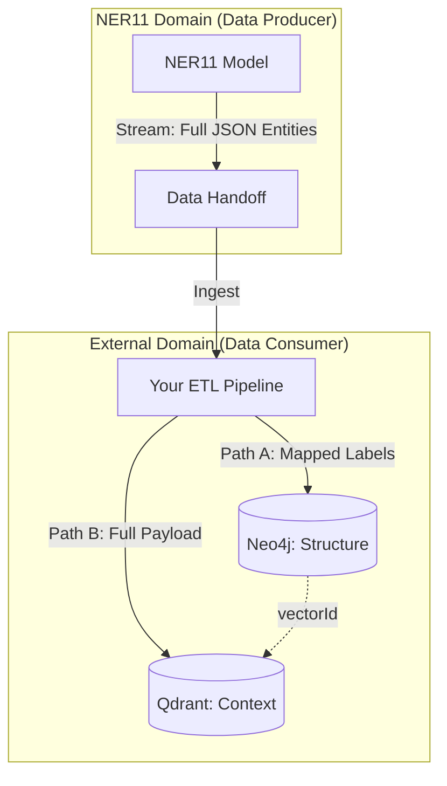

# Advisory: Hybrid Neo4j + Qdrant Architecture

**Date**: 2025-11-26
**To**: External Graph/Vector Architecture Team
**From**: NER11 Model Team (Data Producer)
**Subject**: Recommended Architecture for Consuming High-Fidelity NER11 Data

---

## 1. The Challenge

The NER11 model produces **566 distinct entity types** (Psychometrics, OT/ICS, Economics).
*   **Problem**: Your current Neo4j schema (v3.0) is optimized for structure (~60 labels) and cannot ingest this granularity without performance collapse.
*   **Constraint**: The NER11 team provides the data stream; we do not manage your database infrastructure.

## 2. The Recommended Solution: "Split-Brain" Hybrid Architecture

We recommend a hybrid approach where **Neo4j handles structure** and **Qdrant handles semantic context**. This allows you to consume our full output without breaking your graph.

### 2.1 Architecture Diagram

### 2.2 Data Responsibility

*   **NER11 Team**: We guarantee the delivery of high-fidelity JSON entities containing:
    *   `label`: Specific (e.g., `CONFIRMATION_BIAS`, `PLC`)
    *   `text`: The raw extracted text.
    *   `context`: Surrounding sentence/paragraph.
*   **External Team**: You are responsible for the "Forked Ingestion":
    *   **To Neo4j**: Map our 566 labels to your ~60 core labels (e.g., Map `PLC` -> `Asset`).
    *   **To Qdrant**: Store the *original* unmapped data and generate embeddings.

---

## 3. Workflow Enablement (The "Why")

This architecture enables your Chat Agents to answer complex questions by querying both systems:

**Example Query**: *"Analyze the psychological factors in recent operator errors."*

1.  **Step 1 (Context)**: Agent queries **Qdrant**.
    *   *Query*: Vector search for "operator error psychology".
    *   *Result*: Returns raw NER11 records: `CONFIRMATION_BIAS`, `NORMALCY_BIAS`.
    *   *Value*: Access to the specific psychological concepts we extracted.

2.  **Step 2 (Structure)**: Agent queries **Neo4j**.
    *   *Query*: "Find Assets affected by these specific events."
    *   *Result*: Returns the structural impact (e.g., "Turbine 4").
    *   *Value*: Efficient graph traversal using your optimized schema.

---

## 4. Requirements for External Team

To successfully implement this recommendation, your team needs to:

1.  **Deploy Qdrant**: Provision and manage a Qdrant cluster.
2.  **Update Neo4j Schema**: Add a `vectorId` property (indexed) to your nodes to serve as the foreign key.
3.  **Build the Dual-Write ETL**: Create the pipeline that splits our single NER output stream into the two destinations.

## 5. SWOT Analysis (For Your Decision)

| **Strengths** | **Weaknesses** |
| :--- | :--- |
| **Maximal Data Retention**: You keep every detail NER11 finds. | **Infrastructure Complexity**: You must manage two DBs. |
| **Graph Stability**: Your Neo4j remains lean and fast. | **Consistency Risk**: You must handle sync between DBs. |

| **Opportunities** | **Threats** |
| :--- | :--- |
| **AI-Native**: Ready for advanced RAG agents. | **ETL Failure**: If your split-write fails, data drifts. |

---

## 6. Final Verdict

As the **NER11 Data Producer**, we strongly advise against forcing our 566 labels directly into your Neo4j graph (Option A only). You will lose the nuance of our model.

**The Hybrid (Option A + B) approach is the only way to fully leverage the investment in the NER11 model.**
