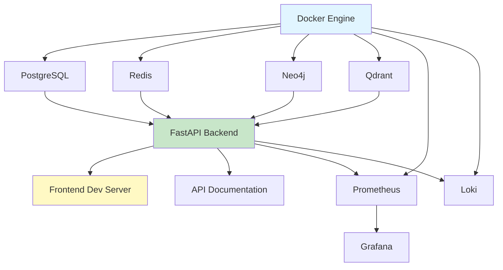

# AEON Digital Twin - Operational System Architecture and Team Coordination Model

**File:** OPERATIONAL_ARCHITECTURE_2025-12-04.md
**Created:** 2025-12-04 22:30:00 UTC
**Modified:** 2025-12-04 22:30:00 UTC
**Version:** v1.0.0
**Author:** System Architecture Designer
**Purpose:** Complete operational architecture and team coordination model for macOS development environment
**Status:** ACTIVE

---

## Executive Summary

This document defines the operational system architecture, team roles, daily workflows, and coordination protocols for the AEON Digital Twin macOS development environment. The architecture supports 315+ operational API endpoints across 11 production APIs, with Neo4j graph database (1.1M+ nodes), Qdrant vector database (670+ entities), and FastAPI backend.

**Key Metrics:**
- **Operational APIs:** 11 production APIs with 315+ endpoints
- **Database Scale:** 1.1M+ Neo4j nodes, 232K+ relationships
- **Performance:** <500ms complex queries, <150ms semantic search
- **Test Coverage:** 840+ passing tests across Phase B2-B5
- **Team Size:** 6 core roles, scalable to enterprise

---

## 1. OPERATIONAL ARCHITECTURE

### 1.1 Daily Development Workflow

#### Morning Startup Sequence (10 minutes)

```bash
#!/bin/bash
# File: scripts/morning-startup.sh
# Purpose: Start all AEON services in correct order

echo "🚀 AEON Digital Twin - Morning Startup"
echo "======================================"

# Step 1: Verify Docker (30 seconds)
echo "Step 1/6: Verifying Docker..."
docker info > /dev/null 2>&1 || { echo "❌ Docker not running"; exit 1; }
echo "✅ Docker operational"

# Step 2: Start Core Infrastructure (2 minutes)
echo "Step 2/6: Starting core infrastructure..."
cd /path/to/aeon-dt
docker-compose up -d neo4j qdrant postgres redis
sleep 30  # Wait for databases to initialize

# Verify Neo4j
docker exec openspg-neo4j cypher-shell -u neo4j -p "neo4j@openspg" "RETURN 1" > /dev/null 2>&1
if [ $? -eq 0 ]; then
    echo "✅ Neo4j operational (bolt://localhost:7687)"
else
    echo "❌ Neo4j failed to start"
    exit 1
fi

# Verify Qdrant
curl -s http://localhost:6333/collections > /dev/null 2>&1
if [ $? -eq 0 ]; then
    echo "✅ Qdrant operational (http://localhost:6333)"
else
    echo "❌ Qdrant failed to start"
    exit 1
fi

# Verify PostgreSQL
docker exec aeon-postgres pg_isready > /dev/null 2>&1
if [ $? -eq 0 ]; then
    echo "✅ PostgreSQL operational"
else
    echo "❌ PostgreSQL failed to start"
    exit 1
fi

# Step 3: Start Backend API (1 minute)
echo "Step 3/6: Starting FastAPI backend..."
cd /path/to/5_NER11_Gold_Model
source venv/bin/activate
uvicorn api.main:app --reload --port 8000 &
API_PID=$!
sleep 10

# Verify API health
curl -s http://localhost:8000/health > /dev/null 2>&1
if [ $? -eq 0 ]; then
    echo "✅ FastAPI operational (http://localhost:8000)"
else
    echo "❌ FastAPI failed to start"
    kill $API_PID
    exit 1
fi

# Step 4: Start Frontend Dev Server (1 minute)
echo "Step 4/6: Starting frontend development server..."
cd /path/to/frontend
npm run dev &
FRONTEND_PID=$!
sleep 10

# Verify frontend
curl -s http://localhost:3000 > /dev/null 2>&1
if [ $? -eq 0 ]; then
    echo "✅ Frontend operational (http://localhost:3000)"
else
    echo "❌ Frontend failed to start"
    kill $API_PID $FRONTEND_PID
    exit 1
fi

# Step 5: Start Monitoring Stack (1 minute)
echo "Step 5/6: Starting monitoring..."
docker-compose up -d prometheus grafana loki
sleep 15

echo "✅ Monitoring operational"
echo "   - Prometheus: http://localhost:9090"
echo "   - Grafana: http://localhost:3001"
echo "   - Loki: http://localhost:3100"

# Step 6: Verification Summary
echo ""
echo "Step 6/6: System verification..."
echo "======================================"
echo "✅ All services operational"
echo ""
echo "Service URLs:"
echo "  - API Docs: http://localhost:8000/docs"
echo "  - Neo4j Browser: http://localhost:7474"
echo "  - Qdrant UI: http://localhost:6333/dashboard"
echo "  - Frontend: http://localhost:3000"
echo "  - Grafana: http://localhost:3001"
echo ""
echo "Database Status:"
docker exec openspg-neo4j cypher-shell -u neo4j -p "neo4j@openspg" \
  "MATCH (n) RETURN count(n) as nodes, count{MATCH ()-[r]-()} as relationships"
echo ""
echo "🎉 AEON Digital Twin ready for development"
echo "PIDs: API=$API_PID Frontend=$FRONTEND_PID"
echo ""
echo "To shutdown: ./scripts/shutdown.sh"
```

#### Development Cycle (Code → Test → Deploy)

**Cycle Duration:** 15-30 minutes per feature iteration

```yaml
development_cycle:
  step_1_code_changes:
    duration: "10-15 minutes"
    actions:
      - Edit code in IDE (VS Code, Cursor, or preferred)
      - Save changes (triggers auto-reload in FastAPI)
      - Review linter warnings (flake8, mypy)

  step_2_local_testing:
    duration: "3-5 minutes"
    actions:
      - Run unit tests: pytest tests/api/test_[module].py
      - Run integration tests: pytest tests/integration/
      - Verify API in Swagger UI: http://localhost:8000/docs

  step_3_manual_verification:
    duration: "2-5 minutes"
    actions:
      - Test endpoints with curl or Postman
      - Verify database changes in Neo4j Browser
      - Check logs: docker logs -f openspg-neo4j

  step_4_commit_changes:
    duration: "2-3 minutes"
    actions:
      - git status
      - git add [files]
      - git commit -m "feat: [description]"
      - git push origin [feature-branch]

  step_5_continuous_integration:
    duration: "5-10 minutes (automated)"
    actions:
      - GitHub Actions run tests
      - Docker image build
      - Deploy to staging environment (optional)
```

### 1.2 Service Startup Sequence and Dependencies



**Startup Order (Critical Path):**
1. **Docker Engine** (prerequisite)
2. **Core Databases** (parallel): PostgreSQL, Redis, Neo4j, Qdrant
3. **Backend API** (requires databases)
4. **Frontend** (requires backend)
5. **Monitoring Stack** (optional, parallel with frontend)

**Startup Timeouts:**
- Database initialization: 30 seconds
- API startup: 10 seconds
- Frontend build: 15 seconds
- Total system startup: ~90 seconds

### 1.3 Network Topology and Service Communication

#### Service Communication Matrix

| Service | Port | Internal Network | External Access | Protocol | Security |
|---------|------|------------------|-----------------|----------|----------|
| **Neo4j Bolt** | 7687 | aeon-network | localhost only | Bolt | Auth required |
| **Neo4j Browser** | 7474 | aeon-network | localhost only | HTTP | Basic auth |
| **Qdrant** | 6333 | aeon-network | localhost only | HTTP/gRPC | API key |
| **PostgreSQL** | 5432 | aeon-network | localhost only | PostgreSQL | Password |
| **Redis** | 6379 | aeon-network | localhost only | Redis | Password |
| **FastAPI** | 8000 | aeon-network | localhost + LAN | HTTP | JWT + API key |
| **Frontend Dev** | 3000 | aeon-network | localhost + LAN | HTTP | None (dev) |
| **Prometheus** | 9090 | aeon-network | localhost only | HTTP | None |
| **Grafana** | 3001 | aeon-network | localhost only | HTTP | Admin auth |
| **Loki** | 3100 | aeon-network | localhost only | HTTP | None |

#### Docker Network Configuration

```yaml
# docker-compose.yml network section
networks:
  aeon-network:
    driver: bridge
    ipam:
      driver: default
      config:
        - subnet: 172.28.0.0/16
          gateway: 172.28.0.1

services:
  neo4j:
    networks:
      aeon-network:
        ipv4_address: 172.28.0.10

  qdrant:
    networks:
      aeon-network:
        ipv4_address: 172.28.0.11

  postgres:
    networks:
      aeon-network:
        ipv4_address: 172.28.0.12

  redis:
    networks:
      aeon-network:
        ipv4_address: 172.28.0.13

  api:
    networks:
      aeon-network:
        ipv4_address: 172.28.0.20
```

#### API Communication Flow

```
Frontend (localhost:3000)
    ↓ HTTP/REST
FastAPI Backend (localhost:8000)
    ↓
    ├─→ Neo4j (bolt://172.28.0.10:7687)      [Graph queries]
    ├─→ Qdrant (http://172.28.0.11:6333)     [Vector search]
    ├─→ PostgreSQL (172.28.0.12:5432)        [User/customer data]
    └─→ Redis (172.28.0.13:6379)             [Caching, sessions]
```

### 1.4 Persistent Volume Management and Backup Locations

#### Volume Mapping Strategy

```yaml
volumes:
  # Database Persistence
  neo4j_data:
    driver: local
    driver_opts:
      type: none
      o: bind
      device: /Users/[username]/aeon-data/neo4j

  qdrant_data:
    driver: local
    driver_opts:
      type: none
      o: bind
      device: /Users/[username]/aeon-data/qdrant

  postgres_data:
    driver: local
    driver_opts:
      type: none
      o: bind
      device: /Users/[username]/aeon-data/postgres

  redis_data:
    driver: local
    driver_opts:
      type: none
      o: bind
      device: /Users/[username]/aeon-data/redis

  # Monitoring Data
  prometheus_data:
    driver: local
    driver_opts:
      type: none
      o: bind
      device: /Users/[username]/aeon-data/prometheus

  grafana_data:
    driver: local
    driver_opts:
      type: none
      o: bind
      device: /Users/[username]/aeon-data/grafana

  loki_data:
    driver: local
    driver_opts:
      type: none
      o: bind
      device: /Users/[username]/aeon-data/loki
```

#### Backup Procedures

**Daily Automated Backups (Runs at 2:00 AM local time):**

```bash
#!/bin/bash
# File: scripts/daily-backup.sh
# Purpose: Automated daily backup of all AEON data

BACKUP_DATE=$(date +%Y-%m-%d)
BACKUP_DIR="/Users/[username]/aeon-backups/${BACKUP_DATE}"
mkdir -p "${BACKUP_DIR}"

echo "🔄 Starting AEON Digital Twin backup - ${BACKUP_DATE}"

# Backup Neo4j (using neo4j-admin dump)
echo "Backing up Neo4j..."
docker exec openspg-neo4j neo4j-admin database dump neo4j \
  --to-path=/backups/${BACKUP_DATE} \
  --overwrite-destination=true

docker cp openspg-neo4j:/backups/${BACKUP_DATE}/neo4j.dump \
  "${BACKUP_DIR}/neo4j.dump"
echo "✅ Neo4j backup complete ($(du -h ${BACKUP_DIR}/neo4j.dump | cut -f1))"

# Backup Qdrant (using collection snapshot)
echo "Backing up Qdrant..."
curl -X POST "http://localhost:6333/collections/ner11_entities/snapshots" \
  -H "Content-Type: application/json"
# Wait for snapshot creation
sleep 5
# Download snapshot
SNAPSHOT_NAME=$(curl -s http://localhost:6333/collections/ner11_entities/snapshots | \
  jq -r '.result[0].name')
curl "http://localhost:6333/collections/ner11_entities/snapshots/${SNAPSHOT_NAME}" \
  -o "${BACKUP_DIR}/qdrant_snapshot.snapshot"
echo "✅ Qdrant backup complete ($(du -h ${BACKUP_DIR}/qdrant_snapshot.snapshot | cut -f1))"

# Backup PostgreSQL
echo "Backing up PostgreSQL..."
docker exec aeon-postgres pg_dump -U aeon_user aeon_db \
  > "${BACKUP_DIR}/postgres.sql"
echo "✅ PostgreSQL backup complete ($(du -h ${BACKUP_DIR}/postgres.sql | cut -f1))"

# Backup Redis (RDB snapshot)
echo "Backing up Redis..."
docker exec aeon-redis redis-cli SAVE
docker cp aeon-redis:/data/dump.rdb "${BACKUP_DIR}/redis.rdb"
echo "✅ Redis backup complete ($(du -h ${BACKUP_DIR}/redis.rdb | cut -f1))"

# Backup API configuration
echo "Backing up API configuration..."
cp -r /path/to/5_NER11_Gold_Model/api/config "${BACKUP_DIR}/api_config"
echo "✅ API config backup complete"

# Create backup manifest
cat > "${BACKUP_DIR}/manifest.json" <<EOF
{
  "backup_date": "${BACKUP_DATE}",
  "timestamp": "$(date -u +%Y-%m-%dT%H:%M:%SZ)",
  "version": "1.0.0",
  "components": {
    "neo4j": {
      "file": "neo4j.dump",
      "size": "$(du -b ${BACKUP_DIR}/neo4j.dump | cut -f1)",
      "node_count": "$(docker exec openspg-neo4j cypher-shell -u neo4j -p 'neo4j@openspg' 'MATCH (n) RETURN count(n)' --format plain | tail -n 1)"
    },
    "qdrant": {
      "file": "qdrant_snapshot.snapshot",
      "size": "$(du -b ${BACKUP_DIR}/qdrant_snapshot.snapshot | cut -f1)"
    },
    "postgres": {
      "file": "postgres.sql",
      "size": "$(du -b ${BACKUP_DIR}/postgres.sql | cut -f1)"
    },
    "redis": {
      "file": "redis.rdb",
      "size": "$(du -b ${BACKUP_DIR}/redis.rdb | cut -f1)"
    }
  }
}
EOF

# Compress backup
echo "Compressing backup..."
tar -czf "${BACKUP_DIR}.tar.gz" -C /Users/[username]/aeon-backups ${BACKUP_DATE}
rm -rf "${BACKUP_DIR}"
echo "✅ Backup compressed ($(du -h ${BACKUP_DIR}.tar.gz | cut -f1))"

# Cleanup old backups (keep last 30 days)
find /Users/[username]/aeon-backups -name "*.tar.gz" -mtime +30 -delete

echo "🎉 Backup complete: ${BACKUP_DIR}.tar.gz"
```

**Backup Schedule:**
- **Daily:** Automated at 2:00 AM (cron: `0 2 * * * /path/to/scripts/daily-backup.sh`)
- **Weekly:** Full system snapshot (Sundays at 3:00 AM)
- **Monthly:** Archive to external storage (1st of month)

**Retention Policy:**
- Daily backups: 30 days
- Weekly backups: 12 weeks
- Monthly backups: 12 months

**Backup Storage Locations:**
1. **Local:** `/Users/[username]/aeon-backups/` (primary)
2. **External:** Time Machine backup (automatic)
3. **Cloud:** AWS S3 or Google Cloud Storage (optional, encrypted)

### 1.5 Monitoring and Alerting Infrastructure

#### Prometheus Configuration

```yaml
# prometheus.yml
global:
  scrape_interval: 15s
  evaluation_interval: 15s

alerting:
  alertmanagers:
    - static_configs:
        - targets: ['localhost:9093']

rule_files:
  - "alert_rules.yml"

scrape_configs:
  # FastAPI application metrics
  - job_name: 'aeon-api'
    static_configs:
      - targets: ['172.28.0.20:8000']
    metrics_path: '/metrics'

  # Neo4j database metrics
  - job_name: 'neo4j'
    static_configs:
      - targets: ['172.28.0.10:2004']

  # PostgreSQL metrics (via postgres_exporter)
  - job_name: 'postgres'
    static_configs:
      - targets: ['172.28.0.12:9187']

  # Redis metrics (via redis_exporter)
  - job_name: 'redis'
    static_configs:
      - targets: ['172.28.0.13:9121']

  # Docker container metrics
  - job_name: 'docker'
    static_configs:
      - targets: ['host.docker.internal:9323']
```

#### Alert Rules

```yaml
# alert_rules.yml
groups:
  - name: aeon_api_alerts
    interval: 30s
    rules:
      - alert: APIHighErrorRate
        expr: rate(http_requests_total{status=~"5.."}[5m]) > 0.05
        for: 2m
        labels:
          severity: critical
          component: api
        annotations:
          summary: "API error rate above 5%"
          description: "{{ $value }}% of requests are failing"

      - alert: APIHighLatency
        expr: histogram_quantile(0.95, rate(http_request_duration_seconds_bucket[5m])) > 2
        for: 3m
        labels:
          severity: warning
          component: api
        annotations:
          summary: "API p95 latency above 2s"
          description: "p95 latency: {{ $value }}s"

      - alert: APIDown
        expr: up{job="aeon-api"} == 0
        for: 1m
        labels:
          severity: critical
          component: api
        annotations:
          summary: "AEON API is down"
          description: "API has been unreachable for 1 minute"

  - name: database_alerts
    interval: 30s
    rules:
      - alert: Neo4jDown
        expr: up{job="neo4j"} == 0
        for: 1m
        labels:
          severity: critical
          component: database
        annotations:
          summary: "Neo4j database is down"

      - alert: Neo4jHighMemory
        expr: (neo4j_memory_heap_used / neo4j_memory_heap_max) > 0.9
        for: 5m
        labels:
          severity: warning
          component: database
        annotations:
          summary: "Neo4j heap usage above 90%"

      - alert: PostgreSQLDown
        expr: up{job="postgres"} == 0
        for: 1m
        labels:
          severity: critical
          component: database
        annotations:
          summary: "PostgreSQL is down"

      - alert: RedisDown
        expr: up{job="redis"} == 0
        for: 1m
        labels:
          severity: warning
          component: cache
        annotations:
          summary: "Redis cache is down"

  - name: system_alerts
    interval: 60s
    rules:
      - alert: DiskSpaceHigh
        expr: (1 - (node_filesystem_avail_bytes / node_filesystem_size_bytes)) > 0.85
        for: 5m
        labels:
          severity: warning
          component: system
        annotations:
          summary: "Disk space usage above 85%"
```

#### Grafana Dashboards

**Dashboard 1: API Performance Overview**
- Request rate (req/s)
- Error rate (%)
- Latency percentiles (p50, p95, p99)
- Active connections
- Endpoint breakdown

**Dashboard 2: Database Health**
- Neo4j query performance
- Connection pool usage
- Transaction rates
- Cache hit ratios
- Replication lag (if applicable)

**Dashboard 3: System Resources**
- CPU usage
- Memory usage
- Disk I/O
- Network throughput
- Container health

**Dashboard 4: Business Metrics**
- API endpoint usage by customer
- Search query volume
- Entity extraction requests
- Data ingestion rate

### 1.6 Log Aggregation and Analysis

#### Loki Configuration

```yaml
# loki-config.yml
auth_enabled: false

server:
  http_listen_port: 3100

ingester:
  lifecycler:
    ring:
      kvstore:
        store: inmemory
      replication_factor: 1
  chunk_idle_period: 15m
  chunk_retain_period: 30s

schema_config:
  configs:
    - from: 2024-01-01
      store: boltdb-shipper
      object_store: filesystem
      schema: v11
      index:
        prefix: index_
        period: 24h

storage_config:
  boltdb_shipper:
    active_index_directory: /loki/index
    cache_location: /loki/cache
    shared_store: filesystem
  filesystem:
    directory: /loki/chunks

limits_config:
  enforce_metric_name: false
  reject_old_samples: true
  reject_old_samples_max_age: 168h

chunk_store_config:
  max_look_back_period: 0s

table_manager:
  retention_deletes_enabled: true
  retention_period: 720h  # 30 days
```

#### Promtail Configuration (Log Shipping)

```yaml
# promtail-config.yml
server:
  http_listen_port: 9080

positions:
  filename: /tmp/positions.yaml

clients:
  - url: http://loki:3100/loki/api/v1/push

scrape_configs:
  # FastAPI application logs
  - job_name: aeon-api
    static_configs:
      - targets:
          - localhost
        labels:
          job: aeon-api
          __path__: /var/log/aeon/api/*.log

  # Neo4j logs
  - job_name: neo4j
    static_configs:
      - targets:
          - localhost
        labels:
          job: neo4j
          __path__: /Users/[username]/aeon-data/neo4j/logs/*.log

  # Docker container logs
  - job_name: docker
    docker_sd_configs:
      - host: unix:///var/run/docker.sock
    relabel_configs:
      - source_labels: ['__meta_docker_container_name']
        target_label: 'container'
```

#### Log Query Examples

```promql
# Search for API errors in last hour
{job="aeon-api"} |= "ERROR" |= "status=500"

# Track specific customer activity
{job="aeon-api"} |= "X-Customer-ID: demo" | json | line_format "{{.timestamp}} {{.endpoint}} {{.response_time}}"

# Monitor slow queries
{job="neo4j"} |= "Query took" | regexp "took (?P<duration>\\d+)ms" | duration > 1000

# Alert on authentication failures
{job="aeon-api"} |= "authentication failed" | count_over_time(5m) > 10
```

---

## 2. TEAM ROLE DEFINITION

### 2.1 Backend Development Role

**Primary Responsibilities:**
1. API endpoint development and maintenance (315+ endpoints)
2. Database schema evolution (Neo4j, PostgreSQL)
3. Integration with NER11 Gold Standard model
4. Performance optimization and query tuning
5. Security implementation (JWT, multi-tenant isolation)

**Daily Tasks:**
```yaml
morning_standup:
  time: "9:00 AM (15 minutes)"
  activities:
    - Review overnight test results
    - Check production error logs
    - Prioritize day's feature work
    - Identify blockers

feature_development:
  time: "9:30 AM - 12:30 PM (3 hours)"
  activities:
    - Implement new API endpoints
    - Write unit/integration tests
    - Update API documentation (OpenAPI specs)
    - Code review for team members

lunch_break:
  time: "12:30 PM - 1:30 PM"

bug_fixes_optimization:
  time: "1:30 PM - 3:30 PM (2 hours)"
  activities:
    - Address production bugs
    - Optimize slow queries
    - Database maintenance tasks
    - Performance profiling

code_review_collaboration:
  time: "3:30 PM - 5:00 PM (1.5 hours)"
  activities:
    - Review pull requests
    - Pair programming sessions
    - Documentation updates
    - Knowledge sharing

end_of_day:
  time: "5:00 PM - 5:30 PM"
  activities:
    - Commit work in progress
    - Update task tracking
    - Deploy to staging (if applicable)
    - Prepare notes for next day
```

**Required System Access:**
- Full read/write to Git repositories
- SSH access to development/staging servers
- Database admin credentials (dev/staging only)
- Docker container management
- Monitoring dashboards (Grafana, Prometheus)
- Log analysis tools (Loki, Kibana)

**Monitoring Dashboards:**
1. **API Performance Dashboard** (primary)
   - Request rate per endpoint
   - Error rates by status code
   - Latency percentiles
   - Database query performance

2. **Database Health Dashboard**
   - Neo4j transaction rates
   - Connection pool utilization
   - Query execution times
   - Cache hit ratios

3. **Development Metrics**
   - Test coverage trends
   - Build success rates
   - Deployment frequency
   - Code quality metrics

**Incident Escalation:**
- **P0 (Critical):** API down, data corruption → Escalate to DevOps immediately
- **P1 (High):** High error rate (>5%), slow response (>2s p95) → Escalate to Tech Lead within 30 min
- **P2 (Medium):** Individual endpoint failures, minor bugs → Document and fix within 24 hours
- **P3 (Low):** Documentation issues, minor performance degradation → Schedule for next sprint

### 2.2 Frontend Development Role

**Primary Responsibilities:**
1. UI/UX component development (React/TypeScript)
2. API integration and state management
3. Data visualization (D3.js, Chart.js)
4. Responsive design and accessibility
5. Frontend performance optimization

**Daily Tasks:**
```yaml
morning_review:
  time: "9:00 AM - 9:30 AM"
  activities:
    - Review API status from backend team
    - Check browser compatibility reports
    - Verify staging environment
    - Review user feedback/bug reports

component_development:
  time: "9:30 AM - 12:30 PM (3 hours)"
  activities:
    - Build new UI components
    - Integrate with API endpoints
    - Implement data visualizations
    - Write unit tests (Jest, React Testing Library)

lunch_break:
  time: "12:30 PM - 1:30 PM"

integration_testing:
  time: "1:30 PM - 3:30 PM (2 hours)"
  activities:
    - End-to-end testing
    - Cross-browser testing
    - Mobile responsiveness testing
    - Accessibility audits (WCAG 2.1)

ui_refinement:
  time: "3:30 PM - 5:00 PM (1.5 hours)"
  activities:
    - UI polish and animations
    - Performance optimization
    - Design system maintenance
    - Documentation updates

daily_wrap_up:
  time: "5:00 PM - 5:30 PM"
  activities:
    - Build production bundle
    - Update Storybook components
    - Commit and push changes
    - Sync with backend team on API changes
```

**Required System Access:**
- Git repository read/write
- Frontend dev server (localhost:3000)
- API staging environment access
- Design system (Figma, Storybook)
- Browser testing tools (BrowserStack)
- Analytics dashboards (Google Analytics, Mixpanel)

**Monitoring Dashboards:**
1. **Frontend Performance Dashboard**
   - Page load times
   - Time to interactive (TTI)
   - First contentful paint (FCP)
   - Core Web Vitals (LCP, FID, CLS)

2. **User Experience Dashboard**
   - Error tracking (Sentry)
   - User session recordings
   - Click heatmaps
   - Conversion funnels

3. **Build Metrics**
   - Bundle size trends
   - Build time
   - Dependency audit results
   - Lighthouse scores

**Incident Escalation:**
- **P0:** Complete UI failure, login broken → Escalate immediately
- **P1:** Major feature broken, significant UX degradation → Escalate within 1 hour
- **P2:** Minor bugs, visual glitches → Fix within 24 hours
- **P3:** Enhancement requests, minor improvements → Schedule for next sprint

### 2.3 DevOps Role

**Primary Responsibilities:**
1. Container orchestration and deployment automation
2. Infrastructure monitoring and alerting
3. CI/CD pipeline management
4. Database backup and disaster recovery
5. Security hardening and compliance

**Daily Tasks:**
```yaml
system_health_check:
  time: "8:30 AM - 9:30 AM (1 hour)"
  activities:
    - Review overnight alerts
    - Check backup completion
    - Verify service health (all green)
    - Analyze resource utilization trends

infrastructure_management:
  time: "9:30 AM - 12:30 PM (3 hours)"
  activities:
    - Deploy updates to staging/production
    - Infrastructure as code updates (Terraform)
    - Security patch management
    - Capacity planning analysis

lunch_break:
  time: "12:30 PM - 1:30 PM"

monitoring_optimization:
  time: "1:30 PM - 3:30 PM (2 hours)"
  activities:
    - Alert rule tuning
    - Dashboard creation/updates
    - Log analysis and optimization
    - Performance benchmarking

automation_security:
  time: "3:30 PM - 5:00 PM (1.5 hours)"
  activities:
    - CI/CD pipeline improvements
    - Security scanning and remediation
    - Documentation updates
    - On-call preparation (if rotation)

end_of_day_verification:
  time: "5:00 PM - 5:30 PM"
  activities:
    - Verify all systems stable
    - Document any changes made
    - Update runbooks
    - Prepare handoff notes for on-call
```

**Required System Access:**
- Full admin access to all infrastructure
- Cloud platform access (AWS, GCP, Azure)
- Docker registry management
- Kubernetes cluster admin (if applicable)
- Database admin credentials (all environments)
- Monitoring system admin (Prometheus, Grafana)
- Secret management (Vault, AWS Secrets Manager)

**Monitoring Dashboards:**
1. **Infrastructure Overview**
   - System resource utilization
   - Service availability (uptime)
   - Network throughput
   - Disk I/O and capacity

2. **Deployment Metrics**
   - Deployment frequency
   - Deployment success rate
   - Rollback frequency
   - Mean time to recovery (MTTR)

3. **Security Dashboard**
   - Failed authentication attempts
   - Vulnerability scan results
   - SSL certificate expiration
   - Firewall rule violations

**Incident Escalation:**
- **P0:** Infrastructure down, data loss risk → Page on-call immediately
- **P1:** Service degradation, backup failures → Escalate within 15 minutes
- **P2:** Resource constraints, non-critical alerts → Address within 4 hours
- **P3:** Documentation gaps, minor automation improvements → Schedule for next sprint

### 2.4 Data Science Role

**Primary Responsibilities:**
1. NER11 model training and optimization
2. Vector embedding quality assurance
3. Data pipeline management and validation
4. Predictive modeling (psychohistory functions)
5. Performance benchmarking and A/B testing

**Daily Tasks:**
```yaml
model_performance_review:
  time: "9:00 AM - 10:00 AM (1 hour)"
  activities:
    - Review model accuracy metrics
    - Analyze prediction errors
    - Check data quality reports
    - Monitor embedding drift

data_pipeline_management:
  time: "10:00 AM - 12:30 PM (2.5 hours)"
  activities:
    - Process new training data
    - Update entity embeddings
    - Validate data ingestion
    - Run quality assurance checks

lunch_break:
  time: "12:30 PM - 1:30 PM"

model_experimentation:
  time: "1:30 PM - 4:00 PM (2.5 hours)"
  activities:
    - Train experimental models
    - Hyperparameter tuning
    - Feature engineering
    - A/B test analysis

documentation_collaboration:
  time: "4:00 PM - 5:00 PM (1 hour)"
  activities:
    - Update model documentation
    - Collaborate with backend on integration
    - Review research papers
    - Knowledge sharing sessions

daily_summary:
  time: "5:00 PM - 5:30 PM"
  activities:
    - Document experimental results
    - Update model registry
    - Commit code and notebooks
    - Plan next day's experiments
```

**Required System Access:**
- GPU compute resources (if applicable)
- Jupyter notebook environment
- Training data repositories
- Model registry (MLflow, Weights & Biases)
- Qdrant vector database admin
- Neo4j read access for data analysis
- Experiment tracking tools

**Monitoring Dashboards:**
1. **Model Performance Dashboard**
   - Precision, recall, F1 scores
   - Entity extraction accuracy
   - Semantic search relevance
   - Inference latency

2. **Data Quality Dashboard**
   - Data completeness
   - Schema violations
   - Embedding quality metrics
   - Data freshness

3. **Training Metrics**
   - Training loss curves
   - Validation metrics
   - Resource utilization during training
   - Model version comparison

**Incident Escalation:**
- **P0:** Model serving failure, critical accuracy drop → Escalate immediately
- **P1:** Significant performance degradation → Escalate within 2 hours
- **P2:** Data quality issues, minor accuracy drop → Document and address within 24 hours
- **P3:** Experimental improvements, research opportunities → Schedule for next sprint

### 2.5 QA/Testing Role

**Primary Responsibilities:**
1. Test automation development and maintenance
2. API endpoint testing (315+ endpoints)
3. Performance validation and load testing
4. Security testing and penetration testing
5. Regression testing for releases

**Daily Tasks:**
```yaml
test_status_review:
  time: "9:00 AM - 9:30 AM"
  activities:
    - Review overnight CI/CD test results
    - Analyze test failure trends
    - Check test coverage metrics
    - Prioritize testing tasks

automated_testing:
  time: "9:30 AM - 12:30 PM (3 hours)"
  activities:
    - Write new automated tests (pytest, Jest)
    - Update existing test suites
    - API contract testing
    - Integration test development

lunch_break:
  time: "12:30 PM - 1:30 PM"

manual_exploratory_testing:
  time: "1:30 PM - 3:30 PM (2 hours)"
  activities:
    - Exploratory testing of new features
    - User acceptance testing (UAT)
    - Cross-browser/device testing
    - Accessibility testing

performance_security_testing:
  time: "3:30 PM - 5:00 PM (1.5 hours)"
  activities:
    - Load testing (Locust, JMeter)
    - Security scanning (OWASP ZAP)
    - Performance profiling
    - Test result documentation

test_reporting:
  time: "5:00 PM - 5:30 PM"
  activities:
    - Update test reports
    - File bug tickets
    - Update test documentation
    - Sync with dev team on fixes
```

**Required System Access:**
- Git repository read/write
- CI/CD pipeline access (GitHub Actions)
- Test environments (dev, staging, QA)
- Test management tools (TestRail, Zephyr)
- Performance testing tools
- Security scanning tools
- Bug tracking system (Jira)

**Monitoring Dashboards:**
1. **Test Execution Dashboard**
   - Test pass/fail rates
   - Test execution time trends
   - Flaky test identification
   - Coverage metrics (line, branch)

2. **Quality Metrics Dashboard**
   - Defect density
   - Defect detection rate
   - Mean time to detect (MTTD)
   - Regression test effectiveness

3. **Performance Testing Dashboard**
   - Load test results
   - Response time under load
   - Error rate under stress
   - Scalability metrics

**Incident Escalation:**
- **P0:** Critical test failures blocking release → Escalate immediately
- **P1:** High-priority bug discovered → Escalate within 1 hour
- **P2:** Medium-priority defects → Document and report within 4 hours
- **P3:** Minor issues, test improvements → Add to backlog

### 2.6 Project Management Role

**Primary Responsibilities:**
1. Sprint planning and backlog management
2. Cross-team coordination and communication
3. Documentation oversight and knowledge management
4. Stakeholder communication and reporting
5. Risk management and issue tracking

**Daily Tasks:**
```yaml
daily_standup_facilitation:
  time: "9:00 AM - 9:30 AM"
  activities:
    - Facilitate team standup
    - Track blockers and dependencies
    - Update sprint board
    - Note cross-team coordination needs

planning_coordination:
  time: "9:30 AM - 12:30 PM (3 hours)"
  activities:
    - Backlog refinement
    - Story estimation and breakdown
    - Dependency mapping
    - Stakeholder meetings

lunch_break:
  time: "12:30 PM - 1:30 PM"

documentation_reporting:
  time: "1:30 PM - 3:30 PM (2 hours)"
  activities:
    - Update project documentation
    - Generate status reports
    - Review technical documentation
    - Knowledge base maintenance

risk_management:
  time: "3:30 PM - 5:00 PM (1.5 hours)"
  activities:
    - Risk assessment and mitigation
    - Issue triage and prioritization
    - Resource allocation planning
    - Team retrospective preparation

end_of_day_summary:
  time: "5:00 PM - 5:30 PM"
  activities:
    - Send daily status update
    - Update project metrics
    - Prepare next day's agenda
    - Stakeholder communication
```

**Required System Access:**
- Project management tools (Jira, Asana)
- Documentation platforms (Confluence, Notion)
- Git repositories (read access)
- Communication tools (Slack, Teams)
- Monitoring dashboards (read-only)
- Analytics and reporting tools

**Monitoring Dashboards:**
1. **Project Health Dashboard**
   - Sprint burndown/burnup charts
   - Velocity trends
   - Story completion rate
   - Blocked item count

2. **Team Performance Dashboard**
   - Cycle time metrics
   - Lead time distribution
   - Work in progress (WIP) limits
   - Team capacity utilization

3. **Quality and Risk Dashboard**
   - Bug backlog trends
   - Technical debt tracking
   - Risk register status
   - Dependency health

**Incident Escalation:**
- **P0:** Project-blocking issues, major risks → Escalate to stakeholders immediately
- **P1:** Sprint goals at risk, resource conflicts → Escalate within 2 hours
- **P2:** Process improvements needed, minor delays → Address in daily standup
- **P3:** Documentation gaps, process optimization → Schedule for retrospective

---

## 3. ENVIRONMENT STAGING

### 3.1 Development Environment (localhost)

**Purpose:** Individual developer workstations for feature development and debugging

**Configuration:**
```yaml
environment: development
docker_compose_file: docker-compose.dev.yml
network: aeon-dev-network
subnet: 172.28.0.0/16

services:
  neo4j:
    image: neo4j:5.26-community
    ports:
      - "7474:7474"  # Browser
      - "7687:7687"  # Bolt
    environment:
      NEO4J_AUTH: neo4j/neo4j@openspg
      NEO4J_PLUGINS: '["apoc", "graph-data-science"]'
      NEO4J_dbms_memory_heap_max__size: 4G
      NEO4J_dbms_memory_pagecache_size: 2G
    volumes:
      - neo4j_dev_data:/data

  qdrant:
    image: qdrant/qdrant:latest
    ports:
      - "6333:6333"
      - "6334:6334"
    volumes:
      - qdrant_dev_data:/qdrant/storage

  postgres:
    image: postgres:16-alpine
    ports:
      - "5432:5432"
    environment:
      POSTGRES_USER: aeon_user
      POSTGRES_PASSWORD: dev_password_change_me
      POSTGRES_DB: aeon_db
    volumes:
      - postgres_dev_data:/var/lib/postgresql/data

  redis:
    image: redis:7-alpine
    ports:
      - "6379:6379"
    command: redis-server --requirepass dev_redis_password
    volumes:
      - redis_dev_data:/data

api_backend:
  host: localhost
  port: 8000
  reload: true  # Auto-reload on code changes
  log_level: DEBUG
  cors_origins:
    - "http://localhost:3000"
    - "http://localhost:3001"

frontend:
  host: localhost
  port: 3000
  proxy_api: "http://localhost:8000"
  hot_reload: true

data_seeding:
  sample_customers: 3
  sample_entities: 100
  sample_threats: 50
```

**Access Control:**
- No authentication required for localhost
- Default passwords (non-production)
- CORS enabled for frontend dev

**Data Management:**
- Sample/mock data only
- Database reset allowed
- No backup requirements

### 3.2 Testing Environment (staging servers)

**Purpose:** Pre-production validation, integration testing, QA workflows

**Configuration:**
```yaml
environment: staging
host: staging.aeon-dt.internal
network: aeon-staging-network

services:
  neo4j:
    image: neo4j:5.26-enterprise
    ports:
      - "7474:7474"
      - "7687:7687"
    environment:
      NEO4J_AUTH: neo4j/staging_secure_password
      NEO4J_ACCEPT_LICENSE_AGREEMENT: "yes"
      NEO4J_dbms_memory_heap_max__size: 8G
      NEO4J_dbms_memory_pagecache_size: 4G
    volumes:
      - /mnt/staging/neo4j:/data
    backup:
      enabled: true
      schedule: "0 */4 * * *"  # Every 4 hours

  qdrant:
    image: qdrant/qdrant:v1.7.0
    ports:
      - "6333:6333"
    environment:
      QDRANT_API_KEY: "${STAGING_QDRANT_API_KEY}"
    volumes:
      - /mnt/staging/qdrant:/qdrant/storage

  postgres:
    image: postgres:16
    environment:
      POSTGRES_USER: aeon_user
      POSTGRES_PASSWORD: "${STAGING_DB_PASSWORD}"
      POSTGRES_DB: aeon_staging
    volumes:
      - /mnt/staging/postgres:/var/lib/postgresql/data

  redis:
    image: redis:7-alpine
    command: redis-server --requirepass "${STAGING_REDIS_PASSWORD}"
    volumes:
      - /mnt/staging/redis:/data

api_backend:
  host: staging-api.aeon-dt.internal
  port: 443
  protocol: https
  ssl_cert: /etc/ssl/certs/staging.crt
  log_level: INFO
  auth_required: true
  rate_limiting:
    enabled: true
    requests_per_minute: 100

frontend:
  host: staging.aeon-dt.internal
  port: 443
  protocol: https
  cdn: enabled
  analytics: staging_mode

monitoring:
  prometheus: true
  grafana: true
  loki: true
  retention_days: 14
```

**Access Control:**
- API key authentication required
- Test user accounts only
- IP whitelist for internal network
- SSL/TLS encryption enforced

**Data Management:**
- Production-like data (anonymized)
- Nightly database refresh from production snapshot
- Retention: 14 days

### 3.3 Performance Validation Environment

**Purpose:** Load testing, performance benchmarking, scalability validation

**Configuration:**
```yaml
environment: performance
host: perf.aeon-dt.internal
network: aeon-perf-network

infrastructure:
  autoscaling:
    enabled: true
    min_instances: 2
    max_instances: 10
    cpu_threshold: 70
    memory_threshold: 80

  load_balancer:
    type: nginx
    algorithm: least_connections
    health_check:
      endpoint: /health
      interval: 10s
      timeout: 5s

services:
  neo4j:
    clustering:
      enabled: true
      core_servers: 3
      read_replicas: 2
    resources:
      memory: 16G
      cpus: 4

  api_backend:
    replicas: 4
    resources:
      memory: 4G
      cpus: 2
    health_check:
      liveness: /health
      readiness: /ready

load_testing:
  tools:
    - locust
    - jmeter
    - k6
  scenarios:
    - name: "baseline_load"
      users: 100
      spawn_rate: 10
      duration: 300s
    - name: "stress_test"
      users: 1000
      spawn_rate: 50
      duration: 600s
    - name: "spike_test"
      users: 500
      spike_to: 2000
      duration: 180s

performance_targets:
  api_latency_p95: 500ms
  api_latency_p99: 1000ms
  error_rate_max: 0.1%
  throughput_min: 1000 req/s
```

**Access Control:**
- Restricted to QA and DevOps teams
- Automated test runners only
- No manual data modification

**Data Management:**
- Synthetic data generators
- Production data snapshot (anonymized)
- Reset after each test run

### 3.4 Production Readiness Checklist

**Infrastructure:**
- [ ] All services deployed with production configuration
- [ ] SSL/TLS certificates installed and valid
- [ ] Firewall rules configured and tested
- [ ] Load balancer health checks passing
- [ ] Database replication verified (if applicable)
- [ ] Backup and restore tested successfully
- [ ] Monitoring and alerting operational
- [ ] Log aggregation configured

**Security:**
- [ ] Authentication and authorization tested
- [ ] API rate limiting configured
- [ ] Security headers implemented
- [ ] Dependency vulnerability scan passed
- [ ] Penetration testing completed
- [ ] Secrets management verified (no hardcoded secrets)
- [ ] CORS configuration validated
- [ ] DDoS protection enabled

**Performance:**
- [ ] Load testing passed (meets SLA targets)
- [ ] Database query optimization completed
- [ ] API endpoint latency < 500ms (p95)
- [ ] Cache hit ratio > 80%
- [ ] Resource utilization < 70% under normal load
- [ ] Auto-scaling tested and verified

**Quality:**
- [ ] Test coverage > 80%
- [ ] All critical path tests passing
- [ ] Integration tests validated
- [ ] Accessibility audit (WCAG 2.1 AA) passed
- [ ] Browser compatibility verified
- [ ] Mobile responsiveness tested

**Documentation:**
- [ ] API documentation up to date (OpenAPI/Swagger)
- [ ] Runbooks created for common operations
- [ ] Incident response procedures documented
- [ ] Architecture diagrams current
- [ ] Deployment guide validated
- [ ] User documentation complete

**Operations:**
- [ ] On-call rotation established
- [ ] Escalation procedures defined
- [ ] Rollback procedure tested
- [ ] Disaster recovery plan validated
- [ ] SLA/SLO defined and communicated
- [ ] Monitoring dashboards configured

**Compliance:**
- [ ] Data privacy requirements met (GDPR, CCPA)
- [ ] Audit logging enabled
- [ ] Data retention policies implemented
- [ ] Access control audited
- [ ] Third-party dependencies reviewed

---

## 4. COMMUNICATION AND HANDOFF

### 4.1 Daily Standup Procedures

**Schedule:** Every weekday at 9:00 AM (15 minutes)

**Agenda:**
```yaml
standup_format:
  duration: 15 minutes

  round_robin_updates:
    time: 10 minutes
    per_person:
      - "What did you complete yesterday?"
      - "What will you work on today?"
      - "Any blockers or dependencies?"

  blocker_discussion:
    time: 3 minutes
    - Quick triage of blockers
    - Assign owners to resolve
    - Schedule follow-up if needed

  daily_goals:
    time: 2 minutes
    - Team goal for the day
    - Important deadlines
    - Cross-team coordination

standup_rules:
  - Stand (if in-person) to keep it short
  - No detailed technical discussions (take offline)
  - Focus on progress and blockers only
  - Update task board in real-time
  - Start and end on time

async_standup_option:
  platform: Slack or Teams
  format:
    - Post updates by 9:00 AM in #daily-standup channel
    - Use template: "✅ Yesterday / 🎯 Today / 🚧 Blockers"
    - React to others' updates
    - DM for quick clarifications
```

**Information Sharing Channels:**

```yaml
communication_channels:
  slack_channels:
    general:
      - "#aeon-general" - Team-wide announcements
      - "#aeon-random" - Water cooler talk

    development:
      - "#aeon-backend" - Backend development
      - "#aeon-frontend" - Frontend development
      - "#aeon-devops" - Infrastructure and deployments
      - "#aeon-data-science" - Model training and experiments

    operations:
      - "#aeon-incidents" - Production issues
      - "#aeon-releases" - Deployment notifications
      - "#aeon-monitoring" - Alert notifications

    coordination:
      - "#daily-standup" - Async standup updates
      - "#code-reviews" - PR review requests
      - "#questions" - Technical Q&A

  meeting_cadence:
    daily:
      - Daily standup (9:00 AM, 15 min)

    weekly:
      - Sprint planning (Monday 10:00 AM, 2 hours)
      - Tech design review (Wednesday 2:00 PM, 1 hour)
      - Team retrospective (Friday 4:00 PM, 1 hour)

    biweekly:
      - Architecture review (Every other Thursday, 2 hours)
      - Stakeholder sync (Every other Friday, 1 hour)

    monthly:
      - All-hands meeting (First Monday, 1 hour)
      - Technical brown bag (Third Friday, 1 hour)

  documentation_hubs:
    technical:
      - Confluence: https://aeon.atlassian.net/wiki
      - GitHub Wiki: https://github.com/aeon-dt/wiki
      - API Docs: https://api.aeon-dt.com/docs

    project_management:
      - Jira: https://aeon.atlassian.net
      - Roadmap: https://aeon.atlassian.net/roadmap
      - Sprint Board: https://aeon.atlassian.net/board
```

### 4.2 Incident Communication Protocols

**Severity Levels and Response:**

```yaml
incident_severity:
  P0_critical:
    description: "Complete system outage, data loss, security breach"
    response_time: "Immediate (< 5 minutes)"
    communication:
      - Page on-call engineer immediately
      - Post in #aeon-incidents
      - Notify CTO and stakeholders
      - Create war room (Zoom bridge)
      - Update status page every 15 minutes
    escalation_path:
      - Level 1: On-call engineer
      - Level 2: Tech lead + DevOps lead
      - Level 3: CTO + Engineering VP

  P1_high:
    description: "Major feature broken, high error rate, significant degradation"
    response_time: "< 30 minutes"
    communication:
      - Post in #aeon-incidents
      - Notify tech lead
      - Update status page every 30 minutes
      - Send email to affected customers
    escalation_path:
      - Level 1: On-call engineer
      - Level 2: Tech lead
      - Level 3: Engineering manager

  P2_medium:
    description: "Minor feature issues, elevated error rate, individual endpoint failures"
    response_time: "< 4 hours"
    communication:
      - Post in #aeon-incidents
      - Create Jira ticket
      - Document in incident log
    escalation_path:
      - Level 1: Assigned developer
      - Level 2: Team lead

  P3_low:
    description: "Documentation issues, minor performance degradation, cosmetic bugs"
    response_time: "< 24 hours"
    communication:
      - Create Jira ticket
      - Discuss in daily standup
    escalation_path:
      - Level 1: Assigned developer

incident_response_template:
  initial_message:
    - "🚨 INCIDENT: [P0/P1/P2] [Brief description]"
    - "Detected: [timestamp]"
    - "Impact: [affected systems/users]"
    - "Status: INVESTIGATING"
    - "Incident Commander: [name]"
    - "War room: [Zoom link if P0/P1]"

  status_updates:
    - "⏱️ UPDATE [timestamp]:"
    - "Root cause: [what we've found]"
    - "Actions taken: [what we've done]"
    - "Next steps: [what we're doing next]"
    - "ETA to resolution: [estimate]"

  resolution_message:
    - "✅ RESOLVED [timestamp]"
    - "Root cause: [detailed explanation]"
    - "Resolution: [what fixed it]"
    - "Impact: [final impact assessment]"
    - "Follow-up actions: [preventive measures]"
    - "Postmortem: [link to document]"

postmortem_process:
  timeline: "Within 48 hours of resolution"
  participants:
    - Incident commander
    - All responders
    - Tech lead
    - Product manager

  template:
    - Title: "[Date] Postmortem: [Incident Summary]"
    - Timeline: Detailed chronology
    - Root cause analysis: 5 Whys method
    - Impact assessment: Users affected, duration, revenue impact
    - What went well: Effective actions
    - What went wrong: Failures and gaps
    - Action items: Preventive measures (with owners and deadlines)
```

**On-Call Rotation:**

```yaml
on_call_schedule:
  rotation: weekly
  schedule:
    - Week 1: Backend Engineer A
    - Week 2: Backend Engineer B
    - Week 3: DevOps Engineer A
    - Week 4: DevOps Engineer B

  responsibilities:
    - Monitor #aeon-monitoring and alert channels
    - Respond to P0/P1 incidents within SLA
    - Triage and escalate as needed
    - Update incident tracking
    - Document issues and resolutions

  compensation:
    - On-call stipend: $X per week
    - Overtime pay for incident response
    - Time off in lieu (TOIL) for after-hours work

  handoff_procedure:
    time: "Friday 4:00 PM"
    actions:
      - Review open incidents
      - Share known issues
      - Test on-call alerting (PagerDuty)
      - Verify access to all systems
      - Document any special considerations
```

### 4.3 Knowledge Transfer Procedures

**New Team Member Onboarding:**

```yaml
onboarding_timeline:
  day_1:
    - IT setup: laptop, accounts, access
    - Team introductions
    - Overview presentation
    - Assign onboarding buddy
    - Set up development environment

  week_1:
    - Complete security and compliance training
    - Read architecture documentation
    - Set up local development environment
    - Make first trivial code contribution
    - Shadow daily standup

  week_2:
    - Complete first feature ticket (with buddy)
    - Pair programming sessions
    - Review API documentation
    - Attend tech design review
    - Set up monitoring access

  week_3_4:
    - Independent feature development
    - Conduct first code review
    - Participate in on-call shadow
    - Present learnings to team
    - Complete onboarding checklist

onboarding_resources:
  documentation:
    - "AEON Architecture Overview"
    - "Development Environment Setup Guide"
    - "API Documentation (Swagger)"
    - "Database Schema Guide (Neo4j, PostgreSQL)"
    - "Coding Standards and Style Guide"
    - "Testing Best Practices"
    - "Deployment Procedures"

  training_modules:
    - Neo4j Cypher query language
    - FastAPI framework basics
    - React and TypeScript patterns
    - Docker and containerization
    - Monitoring and observability (Prometheus, Grafana)

  pair_programming:
    frequency: "Daily for first 2 weeks"
    topics:
      - API endpoint development
      - Database query optimization
      - Frontend component development
      - Debugging techniques
      - Code review practices

buddy_system:
  duration: "First 3 months"
  responsibilities:
    - Daily check-ins (15 minutes)
    - Answer questions and provide guidance
    - Pair programming sessions
    - Code review feedback
    - Cultural integration support
```

**Knowledge Sharing Sessions:**

```yaml
technical_brown_bags:
  frequency: "Third Friday of each month"
  duration: "1 hour"
  format:
    - Presentation: 30 minutes
    - Q&A and discussion: 20 minutes
    - Wrap-up and action items: 10 minutes

  topics:
    - New technology deep-dives
    - Architecture decision records (ADRs)
    - Production incident learnings
    - Best practices and patterns
    - External conference takeaways

  rotation:
    - Each team member presents once per quarter
    - Volunteer-based sign-up
    - Project manager coordinates schedule

documentation_standards:
  code_documentation:
    - Inline comments for complex logic
    - Docstrings for all functions (Google style)
    - README in each module
    - Architecture Decision Records (ADRs) for major decisions

  api_documentation:
    - OpenAPI/Swagger specifications (auto-generated)
    - Request/response examples
    - Error code catalog
    - Authentication guide
    - Rate limiting documentation

  operational_documentation:
    - Runbooks for common operations
    - Incident response procedures
    - Deployment checklists
    - Troubleshooting guides
    - FAQ for common issues

  documentation_reviews:
    frequency: "Monthly"
    process:
      - Rotate documentation ownership
      - Review for accuracy and completeness
      - Update for new features/changes
      - Archive obsolete documentation
```

### 4.4 Documentation Ownership and Update Responsibilities

**Documentation Matrix:**

```yaml
documentation_ownership:
  architecture_docs:
    owner: System Architect / Tech Lead
    reviewers: [Backend Lead, DevOps Lead]
    update_frequency: "On major changes"
    location: /docs/architecture/

  api_documentation:
    owner: Backend Team
    reviewers: [Frontend Team, QA Team]
    update_frequency: "With each API change"
    location: /docs/api/ + Swagger UI

  database_schema:
    owner: Backend Team + Data Science Team
    reviewers: [System Architect]
    update_frequency: "With each migration"
    location: /docs/database/

  deployment_procedures:
    owner: DevOps Team
    reviewers: [Tech Lead, Backend Lead]
    update_frequency: "With each infrastructure change"
    location: /docs/operations/

  frontend_components:
    owner: Frontend Team
    reviewers: [Design Team, Product Manager]
    update_frequency: "With each component addition"
    location: Storybook + /docs/frontend/

  testing_documentation:
    owner: QA Team
    reviewers: [Backend Team, Frontend Team]
    update_frequency: "With each test suite update"
    location: /docs/testing/

  user_documentation:
    owner: Product Manager
    reviewers: [Frontend Team, Support Team]
    update_frequency: "With each feature release"
    location: /docs/user-guides/

documentation_quality_gates:
  pull_request_requirements:
    - Code changes must include documentation updates
    - API changes require OpenAPI spec updates
    - Database changes require schema diagram updates
    - New features require user guide updates

  documentation_checklist:
    - [ ] Code comments added for complex logic
    - [ ] Function/class docstrings updated
    - [ ] README updated (if applicable)
    - [ ] API documentation updated (if API changed)
    - [ ] Database schema updated (if schema changed)
    - [ ] Deployment guide updated (if deployment changed)
    - [ ] User guide updated (if user-facing feature)
    - [ ] Changelog entry added

  review_process:
    - Documentation reviewed as part of code review
    - Technical writer review for user-facing docs (if applicable)
    - Approval required from documentation owner
    - Documentation tests pass (link checking, build validation)

documentation_tools:
  markdown_documentation:
    tool: "Markdown files in Git"
    linter: "markdownlint"
    link_checker: "markdown-link-check"

  api_documentation:
    tool: "FastAPI automatic Swagger generation"
    location: "http://localhost:8000/docs"
    validation: "OpenAPI 3.0 schema validation"

  architecture_diagrams:
    tool: "Mermaid (in Markdown) or Lucidchart"
    format: "Mermaid syntax or PNG/SVG exports"
    location: "/docs/diagrams/"

  component_documentation:
    tool: "Storybook for React components"
    location: "http://localhost:6006"
    deployment: "Deployed with each frontend release"
```

---

## 5. SUMMARY AND QUICK REFERENCE

### 5.1 Service URLs (Development Environment)

| Service | URL | Credentials | Purpose |
|---------|-----|-------------|---------|
| **FastAPI (Backend)** | http://localhost:8000 | N/A | Main API |
| **API Documentation** | http://localhost:8000/docs | N/A | Swagger UI |
| **Frontend Dev** | http://localhost:3000 | N/A | React app |
| **Neo4j Browser** | http://localhost:7474 | neo4j / neo4j@openspg | Graph database UI |
| **Neo4j Bolt** | bolt://localhost:7687 | neo4j / neo4j@openspg | Direct DB connection |
| **Qdrant API** | http://localhost:6333 | N/A | Vector database |
| **Qdrant Dashboard** | http://localhost:6333/dashboard | N/A | Vector DB UI |
| **PostgreSQL** | localhost:5432 | aeon_user / [password] | Relational DB |
| **Redis** | localhost:6379 | [password] | Cache/sessions |
| **Prometheus** | http://localhost:9090 | N/A | Metrics |
| **Grafana** | http://localhost:3001 | admin / admin | Dashboards |
| **Loki** | http://localhost:3100 | N/A | Logs |

### 5.2 Common Commands Quick Reference

```bash
# Startup
./scripts/morning-startup.sh

# Shutdown
./scripts/shutdown.sh

# Restart API only
docker-compose restart api

# View logs
docker-compose logs -f api
docker logs -f openspg-neo4j

# Database access
docker exec -it openspg-neo4j cypher-shell -u neo4j -p "neo4j@openspg"
docker exec -it aeon-postgres psql -U aeon_user -d aeon_db

# Run tests
pytest tests/
npm test  # Frontend tests

# Deploy to staging
./scripts/deploy-staging.sh

# Create backup
./scripts/daily-backup.sh

# Check service health
curl http://localhost:8000/health
```

### 5.3 Team Contact Matrix

```yaml
team_contacts:
  backend_lead:
    name: "[Name]"
    slack: "@backend-lead"
    email: "backend-lead@aeon-dt.com"
    on_call: "Week 1, 3"

  frontend_lead:
    name: "[Name]"
    slack: "@frontend-lead"
    email: "frontend-lead@aeon-dt.com"

  devops_lead:
    name: "[Name]"
    slack: "@devops-lead"
    email: "devops-lead@aeon-dt.com"
    on_call: "Week 2, 4"

  data_science_lead:
    name: "[Name]"
    slack: "@data-science-lead"
    email: "data-science-lead@aeon-dt.com"

  qa_lead:
    name: "[Name]"
    slack: "@qa-lead"
    email: "qa-lead@aeon-dt.com"

  project_manager:
    name: "[Name]"
    slack: "@project-manager"
    email: "pm@aeon-dt.com"

escalation_contacts:
  tech_lead:
    name: "[Name]"
    slack: "@tech-lead"
    phone: "+1-XXX-XXX-XXXX"

  engineering_manager:
    name: "[Name]"
    slack: "@eng-manager"
    phone: "+1-XXX-XXX-XXXX"

  cto:
    name: "[Name]"
    slack: "@cto"
    phone: "+1-XXX-XXX-XXXX"
```

---

## Version History

- **v1.0.0** (2025-12-04): Initial operational architecture design
  - Complete service startup sequence
  - Team role definitions with daily workflows
  - Environment staging configurations
  - Communication and handoff procedures
  - Monitoring and alerting infrastructure
  - Backup and disaster recovery procedures

---

**END OF OPERATIONAL ARCHITECTURE DOCUMENT**
