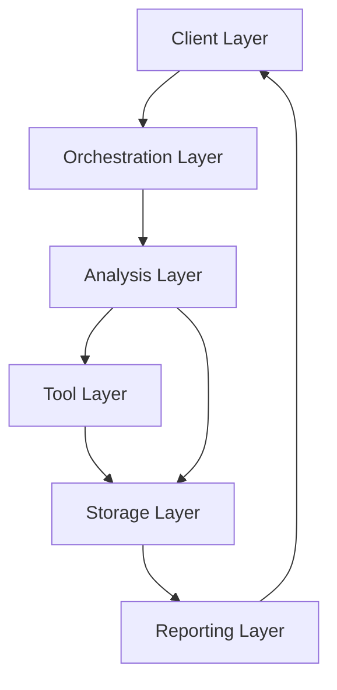
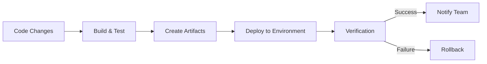
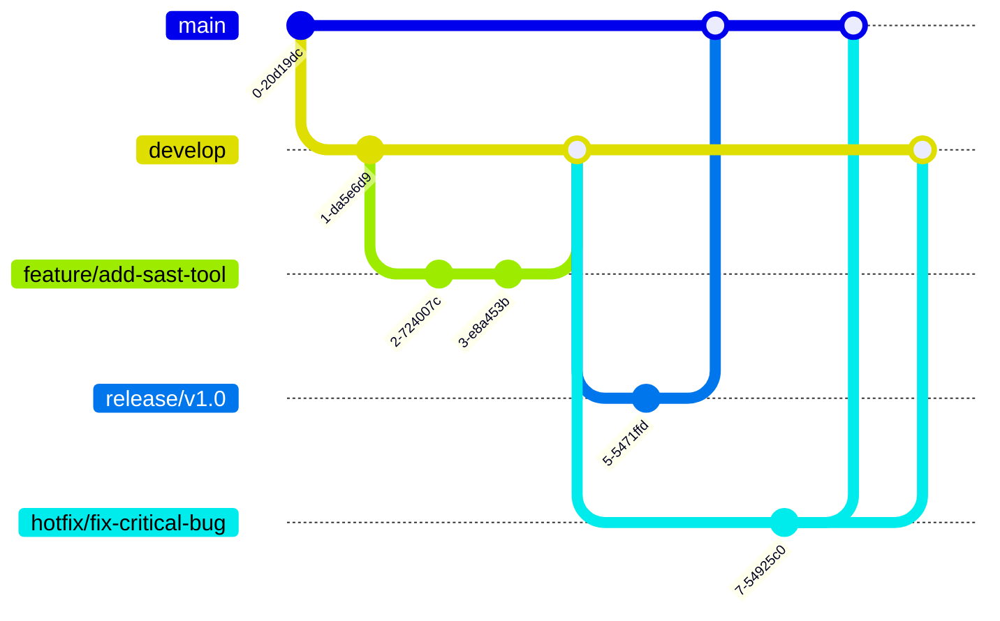

# Comprehensive Coding Standards for M&A Due Diligence Platform

## Table of Contents

1. [Project Overview](https://claude.ai/chat/0ebbdff0-4edd-4d47-ba31-1a7a51f3d2e0#1-project-overview)
2. [User Personas & Requirements](https://claude.ai/chat/0ebbdff0-4edd-4d47-ba31-1a7a51f3d2e0#2-user-personas--requirements)
3. [Core Architecture Standards](https://claude.ai/chat/0ebbdff0-4edd-4d47-ba31-1a7a51f3d2e0#3-core-architecture-standards)
4. [Python Development Standards](https://claude.ai/chat/0ebbdff0-4edd-4d47-ba31-1a7a51f3d2e0#4-python-development-standards)
5. [TypeScript & Type Safety](https://claude.ai/chat/0ebbdff0-4edd-4d47-ba31-1a7a51f3d2e0#5-typescript--type-safety)
6. [Database & Data Layer Standards](https://claude.ai/chat/0ebbdff0-4edd-4d47-ba31-1a7a51f3d2e0#6-database--data-layer-standards)
7. [React Component Standards](https://claude.ai/chat/0ebbdff0-4edd-4d47-ba31-1a7a51f3d2e0#7-react-component-standards)
8. [Docker Containerization Standards](https://claude.ai/chat/0ebbdff0-4edd-4d47-ba31-1a7a51f3d2e0#8-docker-containerization-standards)
9. [Security Tool Integration Standards](https://claude.ai/chat/0ebbdff0-4edd-4d47-ba31-1a7a51f3d2e0#9-security-tool-integration-standards)
10. [Error Handling & Logging](https://claude.ai/chat/0ebbdff0-4edd-4d47-ba31-1a7a51f3d2e0#10-error-handling--logging)
11. [API & Service Standards](https://claude.ai/chat/0ebbdff0-4edd-4d47-ba31-1a7a51f3d2e0#11-api--service-standards)
12. [Testing Standards](https://claude.ai/chat/0ebbdff0-4edd-4d47-ba31-1a7a51f3d2e0#12-testing-standards)
13. [Cross-Language Communication](https://claude.ai/chat/0ebbdff0-4edd-4d47-ba31-1a7a51f3d2e0#13-cross-language-communication)
14. [Documentation Standards](https://claude.ai/chat/0ebbdff0-4edd-4d47-ba31-1a7a51f3d2e0#14-documentation-standards)
15. [Performance Optimization](https://claude.ai/chat/0ebbdff0-4edd-4d47-ba31-1a7a51f3d2e0#15-performance-optimization)
16. [AI-Assisted Development Guidelines](https://claude.ai/chat/0ebbdff0-4edd-4d47-ba31-1a7a51f3d2e0#16-ai-assisted-development-guidelines)
17. [Environment Setup](https://claude.ai/chat/0ebbdff0-4edd-4d47-ba31-1a7a51f3d2e0#17-environment-setup)
18. [Deployment Pipeline](https://claude.ai/chat/0ebbdff0-4edd-4d47-ba31-1a7a51f3d2e0#18-deployment-pipeline)
19. [Version Control Practices](https://claude.ai/chat/0ebbdff0-4edd-4d47-ba31-1a7a51f3d2e0#19-version-control-practices)
20. [Design System & Asset Management](https://claude.ai/chat/0ebbdff0-4edd-4d47-ba31-1a7a51f3d2e0#20-design-system--asset-management)

## 1. Project Overview

### 1.1 Purpose & Objectives

The M&A Due Diligence Code Assessment Automation Platform automates the security assessment of software repositories during merger and acquisition processes. Its core objectives are:

- **Security Assessment Automation**: Analyze repositories using industry-standard security tools
- **Multi-Tool Integration**: Provide comprehensive analysis across multiple security dimensions
- **Standardized Reporting**: Generate consistent reports highlighting critical security findings
- **Executive Intelligence**: Deliver actionable insights supporting acquisition decisions
- **Scalability**: Support assessment of 29+ repositories with clear artifact separation

### 1.2 Architecture Overview



### 1.3 Key Components

- **Repository Manager**: Handles repository access and preparation
- **Tool Orchestrator**: Executes containerized security tools
- **Result Processor**: Normalizes and deduplicates findings
- **Vector Database**: Stores findings for AI analysis
- **Report Engine**: Generates customizable reports
- **Web Interface**: Provides assessment management and visualization

### 1.4 Security Assessment Activities

1. **SBOM Generation**: Create software bill of materials (Syft, SPDX-SBOM-Generator)
2. **SCA Analysis**: Identify vulnerabilities in dependencies (Grype, Trivy)
3. **SAST Analysis**: Detect security issues in code (Semgrep, FindSecBugs, etc.)
4. **License Analysis**: Evaluate license compliance (ScanCode, LicenseFinder)
5. **Provenance Analysis**: Verify supply chain integrity (Sigstore, in-toto)
6. **Malware Detection**: Identify suspicious code patterns (YARA, Capa)
7. **Compliance Assessment**: Validate regulatory compliance (OpenSCAP)

## 2. User Personas & Requirements

### 2.1 Primary User Personas

#### 2.1.1 Security Assessor

- **Role**: Technical expert conducting security assessments
- **Technical Proficiency**: High (security background)
- **Primary Goals**:
    - Configure and run assessments efficiently
    - Get detailed technical findings
    - Validate tool outputs for accuracy
- **Key Features Used**:
    - Repository management
    - Tool configuration
    - Detailed finding exploration
    - False positive management

#### 2.1.2 M&A Manager

- **Role**: Business stakeholder making acquisition decisions
- **Technical Proficiency**: Medium to low
- **Primary Goals**:
    - Get high-level risk overview
    - Understand potential deal-breakers
    - Compare security posture across targets
- **Key Features Used**:
    - Executive dashboard
    - Risk summary reports
    - Comparative visualizations
    - Remediation cost estimates

#### 2.1.3 Integration Engineer

- **Role**: Technical stakeholder planning integration
- **Technical Proficiency**: High
- **Primary Goals**:
    - Assess technical compatibility
    - Identify integration challenges
    - Estimate remediation effort
- **Key Features Used**:
    - SBOM analysis
    - Technology stack breakdown
    - Dependency evaluation
    - License compliance reports

#### 2.1.4 Compliance Officer

- **Role**: Ensures regulatory compliance
- **Technical Proficiency**: Medium
- **Primary Goals**:
    - Verify compliance with standards
    - Document due diligence process
    - Track remediation of critical issues
- **Key Features Used**:
    - Compliance mappings
    - Audit logging
    - Process documentation
    - Remediation tracking

### 2.2 Key User Requirements

|Requirement|Priority|User Persona|Technical Implications|
|---|---|---|---|
|Run assessments on multiple repositories simultaneously|High|Security Assessor|Docker orchestration, parallel processing|
|Generate executive summaries across repositories|High|M&A Manager|Cross-repository data aggregation, visualization|
|Identify critical security vulnerabilities|Critical|All|Tool integration, finding normalization, risk scoring|
|Track remediation progress|Medium|Compliance Officer|Finding versioning, delta analysis|
|Export findings for external review|Medium|M&A Manager|Report templating, multi-format export|
|Compare findings across multiple tools|High|Security Assessor|Deduplication, finding correlation|
|Visualize security posture|High|M&A Manager|Interactive dashboards, data visualization|

## 3. Core Architecture Standards

### 3.1 Project Structure

```
project-root/
├── docker/                  # Docker configuration files
│   ├── base/                # Base container definitions
│   ├── tools/               # Tool-specific containers
│   └── docker-compose.yml   # Orchestration definition
├── backend/                 # Python backend services
│   ├── core/                # Core functionality
│   ├── services/            # Service modules
│   ├── schemas/             # Data schemas
│   └── api/                 # API endpoints
├── frontend/                # React frontend
│   ├── src/
│   │   ├── components/      # UI components
│   │   ├── hooks/           # Custom React hooks
│   │   ├── services/        # Frontend services
│   │   └── utils/           # Utility functions
└── scripts/                 # Utility scripts
```

### 3.2 Progress Tracking

Every repository must maintain a `PROGRESS.md` file at the root level with this structure:

```markdown
# Development Progress

## Current Phase: [Phase Name]

### Completed Components
- [x] Component 1
- [x] Component 2

### In Progress
- [ ] Component 3 (75% complete)

### Pending
- [ ] Component 4
- [ ] Component 5

## Risk Register
| Risk | Impact | Mitigation | Status |
|------|--------|------------|--------|
| Risk 1 | High | Strategy | Active |
```

### 3.3 Naming Conventions

|Type|Convention|Example|
|---|---|---|
|Directories|kebab-case|`repository-manager/`|
|Python files|snake_case|`repository_manager.py`|
|Python classes|PascalCase|`RepositoryManager`|
|Python functions|snake_case|`clone_repository()`|
|TypeScript/JS files|PascalCase (components)<br>camelCase (utilities)|`DocumentExplorer.tsx`<br>`apiClient.ts`|
|React components|PascalCase|`RepositoryList`|
|Docker services|kebab-case|`sast-scanner`|
|API endpoints|kebab-case|`/api/repository-scan`|
|Database collections|snake_case|`assessment_results`|
|Environment variables|UPPER_SNAKE_CASE|`TOOL_API_KEY`|

## 4. Python Development Standards

### 4.1 Code Structure

```python
"""
Module docstring describing purpose and usage.

Progress Tracking:
- Phase: Integration Layer
- Progress: 2/7
- Validation: Pending
"""
import os
import json
from typing import Dict, List, Optional, Union

from .constants import DEFAULT_TIMEOUT
from .models import RepositoryMetadata


class RepositoryManager:
    """Repository management functionality for assessment process."""
    
    def __init__(self, base_path: str, timeout: int = DEFAULT_TIMEOUT):
        """
        Initialize the repository manager.
        
        Args:
            base_path: Base directory for repository operations
            timeout: Operation timeout in seconds
        """
        self.base_path = base_path
        self.timeout = timeout
    
    def clone_repository(self, url: str, branch: str = "main") -> Optional[str]:
        """
        Clone a repository from the provided URL.
        
        Args:
            url: Repository URL
            branch: Branch to checkout
            
        Returns:
            Path to cloned repository or None if failed
            
        Raises:
            RepositoryError: If cloning fails
        """
        try:
            # Implementation
            return repository_path
        except Exception as e:
            logger.error(f"Failed to clone repository: {e}")
            raise RepositoryError(f"Failed to clone repository: {str(e)}")
```

### 4.2 Type Hints

- Use type hints for all function parameters and return values
- Use `Optional[Type]` for parameters/returns that may be None
- Use `Union[Type1, Type2]` for multiple possible types
- Use type aliases to simplify complex types

```python
from typing import Dict, List, Optional, Union, TypedDict, Callable

# Type aliases
RepositoryDict = Dict[str, Union[str, int, bool]]
ScanResult = Dict[str, Union[str, List[Dict[str, str]]]]

# Complex types
class FindingData(TypedDict):
    severity: str
    location: str
    description: str
    remediation: Optional[str]

# Function with type hints
def process_findings(
    findings: List[FindingData], 
    filter_func: Optional[Callable[[FindingData], bool]] = None
) -> Dict[str, List[FindingData]]:
    """Process and categorize findings."""
    # Implementation
```

### 4.3 Error Handling

```python
def execute_tool(tool_name: str, args: List[str]) -> Dict[str, any]:
    """Execute a security tool and return results."""
    try:
        # Attempt operation
        result = run_command(tool_name, args, timeout=self.timeout)
        return {"success": True, "data": result}
    except TimeoutError:
        logger.error(f"Tool execution timed out: {tool_name}")
        return {
            "success": False, 
            "error": "execution_timeout",
            "message": f"Tool execution timed out after {self.timeout}s"
        }
    except CommandError as e:
        logger.error(f"Command execution failed: {e}")
        return {
            "success": False,
            "error": "command_failed",
            "message": str(e)
        }
    except Exception as e:
        logger.error(f"Unexpected error during tool execution: {e}")
        return {
            "success": False,
            "error": "unexpected_error",
            "message": f"An unexpected error occurred: {str(e)}"
        }
```

## 5. TypeScript & Type Safety

### 5.1 Interface Definitions

```typescript
/**
 * @interface Finding
 * @description Represents a security finding from an assessment tool
 */
export interface Finding {
  id: string;
  tool: string;
  repository_id: string;
  severity: 'critical' | 'high' | 'medium' | 'low' | 'info';
  title: string;
  description: string;
  location?: {
    file_path?: string;
    line_start?: number;
    line_end?: number;
  };
  metadata: Record<string, any>;
  remediation?: string;
  created_at: string;
}

/**
 * @interface Repository
 * @description Represents a code repository
 */
export interface Repository {
  id: string;
  name: string;
  url: string;
  description?: string;
  clone_path?: string;
  status: 'pending' | 'cloning' | 'ready' | 'failed';
  language_summary?: Record<string, number>;
  created_at: string;
  updated_at: string;
}
```

### 5.2 Type Guards

```typescript
/**
 * Type guard for Finding interface
 */
export function isFinding(obj: any): obj is Finding {
  return (
    obj &&
    typeof obj.id === 'string' &&
    typeof obj.tool === 'string' &&
    typeof obj.repository_id === 'string' &&
    typeof obj.severity === 'string' &&
    ['critical', 'high', 'medium', 'low', 'info'].includes(obj.severity) &&
    typeof obj.title === 'string' &&
    typeof obj.description === 'string'
  );
}

/**
 * Use type guards for safe type checking
 */
function processFinding(item: any): void {
  if (isFinding(item)) {
    // TypeScript knows item is a Finding here
    console.log(`Processing finding: ${item.title} (${item.severity})`);
  } else {
    console.error('Invalid finding object:', item);
  }
}
```

### 5.3 Generic Types

```typescript
/**
 * @type ApiResponse
 * @description Standard API response format
 */
export type ApiResponse<T> = {
  success: boolean;
  data?: T;
  error?: {
    code: string;
    message: string;
  };
};

/**
 * @type PaginatedResponse
 * @description Response with pagination
 */
export type PaginatedResponse<T> = {
  items: T[];
  total: number;
  page: number;
  page_size: number;
  total_pages: number;
};

/**
 * Generic fetch function with proper typing
 */
async function fetchData<T>(url: string): Promise<ApiResponse<T>> {
  try {
    const response = await fetch(url);
    if (!response.ok) {
      const errorText = await response.text();
      return { 
        success: false, 
        error: { 
          code: 'api_error', 
          message: errorText 
        } 
      };
    }
    const data = await response.json();
    return { success: true, data };
  } catch (error) {
    return { 
      success: false, 
      error: { 
        code: 'network_error', 
        message: error.message 
      } 
    };
  }
}
```

## 6. Database & Data Layer Standards

### 6.1 MongoDB Schema Conventions

```typescript
// MongoDB schema definition example
const FindingSchema = new Schema({
  tool: { type: String, required: true, index: true },
  repository_id: { type: String, required: true, index: true },
  severity: { 
    type: String, 
    enum: ['critical', 'high', 'medium', 'low', 'info'],
    required: true,
    index: true
  },
  title: { type: String, required: true },
  description: { type: String, required: true },
  location: {
    file_path: { type: String },
    line_start: { type: Number },
    line_end: { type: Number }
  },
  metadata: { type: Map, of: Schema.Types.Mixed },
  remediation: { type: String },
  created_at: { type: Date, default: Date.now, index: true },
  updated_at: { type: Date, default: Date.now }
});

// Add indexes for common queries
FindingSchema.index({ repository_id: 1, severity: 1 });
FindingSchema.index({ tool: 1, repository_id: 1 });
```

### 6.2 Vector Database Schema Conventions

```typescript
// Qdrant collection creation
async function createFindingsCollection() {
  const client = new QdrantClient(process.env.QDRANT_URL);
  
  await client.createCollection('findings', {
    vectors: {
      size: 1536,  // OpenAI embeddings dimension
      distance: 'Cosine'
    },
    // Define payload schema for filtering
    payload_schema: {
      repository_id: {
        type: 'keyword'
      },
      tool: {
        type: 'keyword'
      },
      severity: {
        type: 'keyword'
      },
      created_at: {
        type: 'datetime'
      }
    }
  });
}

// Adding findings to vector DB
async function addFindingToVectorDB(finding: Finding, embedding: number[]) {
  const client = new QdrantClient(process.env.QDRANT_URL);
  
  await client.upsert('findings', {
    points: [{
      id: finding.id,
      vector: embedding,
      payload: {
        repository_id: finding.repository_id,
        tool: finding.tool,
        severity: finding.severity,
        title: finding.title,
        description: finding.description,
        created_at: finding.created_at
      }
    }]
  });
}
```

### 6.3 Data Mapping Conventions

```typescript
/**
 * Data mapper from tool output to standardized finding
 */
export function mapToolOutputToFinding(
  tool: string, 
  repository_id: string,
  output: any
): Finding {
  // Generic mapper with tool-specific logic
  switch (tool) {
    case 'semgrep':
      return {
        id: generateId(),
        tool,
        repository_id,
        severity: mapSemgrepSeverity(output.severity),
        title: output.check_id,
        description: output.extra.message,
        location: {
          file_path: output.path,
          line_start: output.start.line,
          line_end: output.end.line
        },
        metadata: {
          rule_id: output.check_id,
          rule_metadata: output.extra.metadata
        },
        remediation: output.extra.fix,
        created_at: new Date().toISOString()
      };
    
    case 'grype':
      // Mapping for Grype
      break;
      
    // Other tools...
    
    default:
      throw new Error(`Unknown tool: ${tool}`);
  }
}

/**
 * Severity normalizer across tools
 */
function mapSemgrepSeverity(severity: string): Finding['severity'] {
  switch (severity.toLowerCase()) {
    case 'error':
      return 'critical';
    case 'warning':
      return 'high';
    case 'info':
      return 'medium';
    case 'none':
      return 'info';
    default:
      return 'medium';
  }
}
```

## 7. React Component Standards

### 7.1 Component Structure

```tsx
/**
 * @component RepositoryList
 * @description Displays a list of repositories with assessment status
 * 
 * Progress Tracking:
 * - Phase: Web Interface Layer
 * - Progress: 3/7
 * - Validation: Passed
 */
import React, { useState, useEffect } from 'react';
import { Repository } from '@/types/repository';
import { RepositoryService } from '@/services/repositoryService';
import { Card, CardContent, CardHeader } from '@/components/ui/card';
import { Badge } from '@/components/ui/badge';
import { Skeleton } from '@/components/ui/skeleton';

interface RepositoryListProps {
  onSelect?: (repository: Repository) => void;
  filter?: string;
}

export const RepositoryList: React.FC<RepositoryListProps> = ({
  onSelect,
  filter = 'all'
}) => {
  const [repositories, setRepositories] = useState<Repository[]>([]);
  const [loading, setLoading] = useState<boolean>(true);
  const [error, setError] = useState<string | null>(null);
  
  useEffect(() => {
    async function fetchRepositories() {
      try {
        setLoading(true);
        const response = await RepositoryService.getRepositories(filter);
        
        if (response.success) {
          setRepositories(response.data || []);
          setError(null);
        } else {
          setError(response.error?.message || 'Failed to load repositories');
        }
      } catch (err) {
        setError('An unexpected error occurred');
        console.error('Error loading repositories:', err);
      } finally {
        setLoading(false);
      }
    }
    
    fetchRepositories();
  }, [filter]);
  
  if (loading) {
    return <RepositoryListSkeleton />;
  }
  
  if (error) {
    return <div className="text-red-500">{error}</div>;
  }
  
  return (
    <div className="space-y-4">
      {repositories.length === 0 ? (
        <EmptyState message="No repositories found" />
      ) : (
        repositories.map(repo => (
          <Card 
            key={repo.id}
            className="cursor-pointer hover:border-primary/50 transition-colors"
            onClick={() => onSelect?.(repo)}
          >
            <CardHeader className="pb-2">
              <div className="flex justify-between items-center">
                <h3 className="font-medium">{repo.name}</h3>
                <StatusBadge status={repo.status} />
              </div>
            </CardHeader>
            <CardContent>
              <p className="text-sm text-gray-500">{repo.description || 'No description'}</p>
            </CardContent>
          </Card>
        ))
      )}
    </div>
  );
};

const StatusBadge: React.FC<{ status: Repository['status'] }> = ({ status }) => {
  const variants = {
    pending: 'bg-yellow-100 text-yellow-800',
    cloning: 'bg-blue-100 text-blue-800',
    ready: 'bg-green-100 text-green-800',
    failed: 'bg-red-100 text-red-800'
  };
  
  return (
    <Badge className={variants[status]}>
      {status}
    </Badge>
  );
};

const RepositoryListSkeleton: React.FC = () => (
  <div className="space-y-4">
    {[1, 2, 3].map(i => (
      <Card key={i}>
        <CardHeader className="pb-2">
          <Skeleton className="h-6 w-48" />
        </CardHeader>
        <CardContent>
          <Skeleton className="h-4 w-full" />
        </CardContent>
      </Card>
    ))}
  </div>
);

const EmptyState: React.FC<{ message: string }> = ({ message }) => (
  <div className="text-center py-8">
    <p className="text-gray-500">{message}</p>
  </div>
);

export default RepositoryList;
```

### 7.2 Tailwind CSS Organization

```tsx
// Organize Tailwind classes by category
<div 
  className={`
    /* Layout */
    flex flex-col gap-4 p-4
    /* Typography */
    text-base font-medium text-gray-800
    /* Visual */
    bg-white rounded-lg shadow-sm border border-gray-200
    /* States */
    hover:bg-gray-50
    /* Responsive */
    md:flex-row lg:p-6
  `}
>
  {/* Content */}
</div>
```

### 7.3 Custom Hooks

```typescript
/**
 * @hook useRepository
 * @description Hook for fetching and managing repository data
 */
export function useRepository(repositoryId: string | null) {
  const [repository, setRepository] = useState<Repository | null>(null);
  const [assessments, setAssessments] = useState<Assessment[]>([]);
  const [loading, setLoading] = useState<boolean>(true);
  const [error, setError] = useState<string | null>(null);

  useEffect(() => {
    if (!repositoryId) {
      setRepository(null);
      setAssessments([]);
      setLoading(false);
      return;
    }

    let isMounted = true;
    
    async function fetchData() {
      try {
        setLoading(true);
        
        // Fetch repository details
        const repoResponse = await RepositoryService.getRepositoryById(repositoryId);
        
        if (!isMounted) return;
        
        if (!repoResponse.success) {
          setError(repoResponse.error?.message || 'Failed to load repository');
          return;
        }
        
        setRepository(repoResponse.data || null);
        
        // Fetch assessments
        const assessmentsResponse = await AssessmentService.getAssessmentsForRepository(repositoryId);
        
        if (!isMounted) return;
        
        if (assessmentsResponse.success) {
          setAssessments(assessmentsResponse.data || []);
          setError(null);
        } else {
          setError(assessmentsResponse.error?.message || 'Failed to load assessments');
        }
      } catch (err) {
        if (isMounted) {
          setError('An unexpected error occurred');
          console.error('Error in useRepository hook:', err);
        }
      } finally {
        if (isMounted) {
          setLoading(false);
        }
      }
    }
    
    fetchData();
    
    return () => {
      isMounted = false;
    };
  }, [repositoryId]);

  const refreshData = useCallback(async () => {
    if (!repositoryId) return;
    // Re-fetch data implementation
  }, [repositoryId]);

  return { 
    repository, 
    assessments, 
    loading, 
    error, 
    refreshData 
  };
}
```

## 8. Docker Containerization Standards

### 8.1 Base Container Structure

```dockerfile
# Base container for Python tools
# Filename: docker/base/python-base.Dockerfile

FROM python:3.10-slim

# Set environment variables
ENV PYTHONDONTWRITEBYTECODE=1 \
    PYTHONUNBUFFERED=1 \
    PYTHONFAULTHANDLER=1 \
    PIP_NO_CACHE_DIR=off \
    PIP_DISABLE_PIP_VERSION_CHECK=on

# Create non-root user
RUN groupadd -r appuser && useradd -r -g appuser appuser

# Install common dependencies
RUN apt-get update && apt-get install -y --no-install-recommends \
    git \
    curl \
    ca-certificates \
    && apt-get clean \
    && rm -rf /var/lib/apt/lists/*

# Create working directory
WORKDIR /app

# Install base Python packages
COPY requirements-base.txt .
RUN pip install --no-cache-dir -r requirements-base.txt

# Set up health check
HEALTHCHECK --interval=30s --timeout=10s --start-period=5s --retries=3 \
    CMD curl -f http://localhost:8000/health || exit 1

# Switch to non-root user
USER appuser

# Command will be overridden by child containers
CMD ["python", "-m", "healthcheck"]
```

### 8.2 Tool Container Standards

```dockerfile
# Tool-specific container
# Filename: docker/tools/semgrep.Dockerfile

FROM python-base:latest

# Install tool-specific dependencies
RUN pip install --no-cache-dir semgrep==1.34.0

# Copy tool wrapper script
COPY tools/semgrep_wrapper.py /app/

# Set environment variables for tool configuration
ENV TOOL_NAME=semgrep \
    TOOL_VERSION=1.34.0 \
    DEFAULT_TIMEOUT=300

# Override health check for this specific tool
HEALTHCHECK --interval=30s --timeout=10s --start-period=5s --retries=3 \
    CMD python -m semgrep --version > /dev/null || exit 1

# Set the entrypoint to our wrapper script
ENTRYPOINT ["python", "/app/semgrep_wrapper.py"]
```

### 8.3 Docker Compose Configuration

```yaml
# docker-compose.yml

version: '3.8'

services:
  # Base services
  api:
    build:
      context: ./backend
      dockerfile: Dockerfile
    ports:
      - "8000:8000"
    volumes:
      - ./data:/data
    depends_on:
      - mongodb
      - vector-db
    environment:
      - MONGODB_URI=mongodb://mongodb:27017/assessment
      - VECTOR_DB_URI=http://vector-db:6333
      - LOG_LEVEL=info

  web:
    build:
      context: ./frontend
      dockerfile: Dockerfile
    ports:
      - "3000:3000"
    depends_on:
      - api
    environment:
      - API_URL=http://api:8000

  # Database services
  mongodb:
    image: mongo:latest
    volumes:
      - mongo-data:/data/db
    ports:
      - "27017:27017"

  vector-db:
    image: qdrant/qdrant:latest
    volumes:
      - vector-data:/qdrant/storage
    ports:
      - "6333:6333"

  # Security Tool services
  sbom-generator:
    build:
      context: ./docker/tools
      dockerfile: syft.Dockerfile
    volumes:
      - ./repositories:/repositories:ro
      - ./outputs:/outputs

  sca-scanner:
    build:
      context: ./docker/tools
      dockerfile: grype.Dockerfile
    volumes:
      - ./repositories:/repositories:ro
      - ./outputs:/outputs
    depends_on:
      - sbom-generator

  sast-scanner:
    build:
      context: ./docker/tools
      dockerfile: semgrep.Dockerfile
    volumes:
      - ./repositories:/repositories:ro
      - ./outputs:/outputs

  license-scanner:
    build:
      context: ./docker/tools
      dockerfile: scancode.Dockerfile
    volumes:
      - ./repositories:/repositories:ro
      - ./outputs:/outputs

volumes:
  mongo-data:
  vector-data:
```

### 8.4 Container Resource Management

```yaml
# Example resource constraints in docker-compose.yml

services:
  sast-scanner:
    build:
      context: ./docker/tools
      dockerfile: semgrep.Dockerfile
    volumes:
      - ./repositories:/repositories:ro
      - ./outputs:/outputs
    deploy:
      resources:
        limits:
          cpus: '2'
          memory: 4G
        reservations:
          cpus: '0.5'
          memory: 1G
    environment:
      - MAX_WORKERS=2
      - TIMEOUT=3600
```

## 9. Security Tool Integration Standards

### 9.1 Tool Wrapper Pattern

```python
#!/usr/bin/env python3
"""
Semgrep tool wrapper for standardized execution and output processing.

This wrapper handles:
1. Standardized input/output formats
2. Error handling and reporting
3. Timeout management
4. Resource limitation
"""
import argparse
import json
import os
import subprocess
import sys
import time
from typing import Dict, List, Optional, Union

# Constants
DEFAULT_TIMEOUT = int(os.environ.get("DEFAULT_TIMEOUT", "300"))
OUTPUT_FORMAT = "json"
DEFAULT_RULES = "p/security-audit"

def parse_args() -> argparse.Namespace:
    """Parse command line arguments."""
    parser = argparse.ArgumentParser(description="Semgrep wrapper")
    parser.add_argument("--repo-path", required=True, help="Path to repository")
    parser.add_argument("--output-path", required=True, help="Path for output file")
    parser.add_argument("--timeout", type=int, default=DEFAULT_TIMEOUT, 
                       help="Timeout in seconds")
    parser.add_argument("--rules", default=DEFAULT_RULES, 
                       help="Rules to use (default: p/security-audit)")
    return parser.parse_args()

def run_semgrep(repo_path: str, output_path: str, 
               timeout: int, rules: str) -> Dict[str, Union[bool, str, Dict]]:
    """Run semgrep scan on the repository."""
    try:
        # Prepare command
        cmd = [
            "semgrep",
            "--config", rules,
            "--json",
            repo_path
        ]
        
        # Run command with timeout
        start_time = time.time()
        process = subprocess.run(
            cmd,
            capture_output=True,
            text=True,
            timeout=timeout
        )
        duration = time.time() - start_time
        
        # Check return code
        if process.returncode != 0 and process.returncode != 1:
            # Note: semgrep returns 1 when it finds issues, which is expected
            return {
                "success": False,
                "error": "tool_error",
                "message": f"Semgrep failed with code {process.returncode}",
                "stderr": process.stderr
            }
        
        # Parse JSON output
        try:
            results = json.loads(process.stdout)
            
            # Add metadata
            results["metadata"] = {
                "tool": "semgrep",
                "version": os.environ.get("TOOL_VERSION", "unknown"),
                "execution_time": duration,
                "rules": rules,
                "timestamp": time.strftime("%Y-%m-%dT%H:%M:%SZ", time.gmtime())
            }
            
            # Write to output file
            with open(output_path, 'w') as f:
                json.dump(results, f, indent=2)
            
            return {
                "success": True,
                "output_path": output_path,
                "finding_count": len(results.get("results", [])),
                "execution_time": duration
            }
            
        except json.JSONDecodeError:
            return {
                "success": False,
                "error": "invalid_output",
                "message": "Failed to parse Semgrep output as JSON",
                "stderr": process.stderr,
                "stdout": process.stdout
            }
            
    except subprocess.TimeoutExpired:
        return {
            "success": False,
            "error": "timeout",
            "message": f"Semgrep scan timed out after {timeout} seconds"
        }
    except Exception as e:
        return {
            "success": False,
            "error": "unexpected_error",
            "message": str(e)
        }

def main():
    """Main function."""
    args = parse_args()
    
    # Ensure output directory exists
    os.makedirs(os.path.dirname(args.output_path), exist_ok=True)
    
    # Run the tool
    result = run_semgrep(
        args.repo_path,
        args.output_path,
        args.timeout,
        args.rules
    )
    
    # Print result as JSON to stdout
    print(json.dumps(result, indent=2))
    
    # Exit with appropriate code
    sys.exit(0 if result["success"] else 1)

if __name__ == "__main__":
    main()
```

### 9.2 Tool Output Schema

Each tool must produce output adhering to a standardized schema:

```json
{
  "metadata": {
    "tool": "semgrep",
    "version": "1.34.0",
    "execution_time": 12.5,
    "timestamp": "2025-05-08T14:30:00Z",
    "command": "semgrep --config p/security-audit --json /repositories/repo1"
  },
  "results": [
    {
      "check_id": "python.lang.security.injection.command.command-injection",
      "path": "app/utils/system.py",
      "start": {
        "line": 45,
        "col": 12
      },
      "end": {
        "line": 45,
        "col": 58
      },
      "severity": "ERROR",
      "message": "Command injection detected",
      "extra": {
        "lines": "subprocess.call(f'echo {user_input}', shell=True)",
        "metadata": {
          "cwe": "CWE-78",
          "owasp": "A1:2017-Injection"
        },
        "fix": "Use subprocess.call(['echo', user_input])"
      }
    }
  ],
  "errors": []
}
```

### 9.3 Tool Configuration Management

```yaml
# Tool configuration in yaml format
# config/tools/semgrep.yaml

tool:
  name: semgrep
  version: 1.34.0
  container: sast-scanner
  timeout: 600
  retries: 2
  configs:
    - name: security-audit
      description: "Standard security rules"
      args: "--config p/security-audit"
    - name: owasp-top-10
      description: "OWASP Top 10 rules"
      args: "--config p/owasp-top-10"
    - name: supply-chain
      description: "Supply chain specific rules"
      args: "--config p/supply-chain"
  resource_limits:
    cpu: 2
    memory: "4G"
  languages:
    - python
    - javascript
    - typescript
    - java
    - go
```

## 10. Error Handling & Logging

### 10.1 Error Categorization

```python
class AssessmentError(Exception):
    """Base class for assessment-related errors."""
    def __init__(self, message: str, error_code: str, details: Optional[Dict] = None):
        self.message = message
        self.error_code = error_code
        self.details = details or {}
        super().__init__(self.message)

class RepositoryError(AssessmentError):
    """Error related to repository operations."""
    def __init__(self, message: str, details: Optional[Dict] = None):
        super().__init__(message, "repository_error", details)

class ToolExecutionError(AssessmentError):
    """Error related to tool execution."""
    def __init__(self, message: str, tool: str, details: Optional[Dict] = None):
        tool_details = details or {}
        tool_details["tool"] = tool
        super().__init__(message, "tool_execution_error", tool_details)

class DataProcessingError(AssessmentError):
    """Error related to data processing."""
    def __init__(self, message: str, details: Optional[Dict] = None):
        super().__init__(message, "data_processing_error", details)
```

### 10.2 Logging Standards

```python
import logging
import json
import traceback
from datetime import datetime
from typing import Any, Dict, Optional

# Configure logger
logger = logging.getLogger("assessment")

class StructuredLogFormatter(logging.Formatter):
    """Formatter for structured JSON logs."""
    
    def format(self, record: logging.LogRecord) -> str:
        """Format the log record as JSON."""
        log_data = {
            "timestamp": datetime.utcnow().isoformat() + "Z",
            "level": record.levelname,
            "logger": record.name,
            "message": record.getMessage(),
            "module": record.module,
            "function": record.funcName,
            "line": record.lineno
        }
        
        # Add exception info if present
        if record.exc_info:
            log_data["exception"] = {
                "type": record.exc_info[0].__name__,
                "message": str(record.exc_info[1]),
                "traceback": traceback.format_exception(*record.exc_info)
            }
        
        # Add extra fields
        if hasattr(record, "extra"):
            log_data.update(record.extra)
        
        return json.dumps(log_data)

def setup_logging(level: str = "INFO") -> None:
    """Set up structured logging."""
    handler = logging.StreamHandler()
    handler.setFormatter(StructuredLogFormatter())
    
    logger.setLevel(getattr(logging, level.upper()))
    logger.addHandler(handler)
    logger.propagate = False

def log_with_context(
    level: str,
    message: str,
    repository_id: Optional[str] = None,
    tool: Optional[str] = None,
    extra: Optional[Dict[str, Any]] = None
) -> None:
    """Log with additional context."""
    log_extra = extra or {}
    
    if repository_id:
        log_extra["repository_id"] = repository_id
    
    if tool:
        log_extra["tool"] = tool
    
    getattr(logger, level.lower())(message, extra={"extra": log_extra})

# Usage examples
log_with_context("info", "Starting assessment", repository_id="repo-123")
log_with_context("error", "Tool execution failed", repository_id="repo-123", tool="semgrep", 
                extra={"error_code": "timeout", "duration": 305})
```

### 10.3 Error Recovery

```python
def execute_with_retry(
    func: Callable,
    args: tuple = (),
    kwargs: Dict = None,
    max_retries: int = 3,
    retry_delay: int = 5,
    retry_backoff: float = 2.0,
    retry_exceptions: tuple = (Exception,)
) -> Any:
    """
    Execute a function with retry logic.
    
    Args:
        func: Function to execute
        args: Positional arguments for the function
        kwargs: Keyword arguments for the function
        max_retries: Maximum number of retry attempts
        retry_delay: Initial delay between retries in seconds
        retry_backoff: Backoff multiplier for increasing delay
        retry_exceptions: Exceptions that should trigger a retry
        
    Returns:
        Result of the function
        
    Raises:
        Exception: Last exception if all retries fail
    """
    kwargs = kwargs or {}
    attempt = 0
    last_exception = None
    
    while attempt <= max_retries:
        try:
            return func(*args, **kwargs)
        except retry_exceptions as e:
            attempt += 1
            last_exception = e
            
            if attempt > max_retries:
                break
                
            # Calculate delay with exponential backoff
            delay = retry_delay * (retry_backoff ** (attempt - 1))
            
            log_with_context(
                "warning",
                f"Retry attempt {attempt}/{max_retries} after {delay:.1f}s",
                extra={
                    "function": func.__name__,
                    "exception": str(e),
                    "retry_delay": delay
                }
            )
            
            time.sleep(delay)
    
    # If we get here, all retries failed
    raise last_exception
```

## 11. API & Service Standards

### 11.1 API Endpoint Structure

```python
from fastapi import APIRouter, Depends, HTTPException, Query, Path, status
from typing import List, Optional

from models import Repository, Assessment, ApiResponse, PaginatedResponse
from services import repository_service
from auth import get_current_user

# Create router with prefix and tags
router = APIRouter(
    prefix="/api/repositories",
    tags=["repositories"]
)

@router.get("/", response_model=PaginatedResponse[Repository])
async def list_repositories(
    page: int = Query(1, ge=1, description="Page number"),
    page_size: int = Query(20, ge=1, le=100, description="Items per page"),
    status: Optional[str] = Query(None, description="Filter by status"),
    current_user = Depends(get_current_user)
):
    """
    Get a paginated list of repositories.
    
    Args:
        page: Page number (starts at 1)
        page_size: Number of items per page
        status: Optional status filter
    
    Returns:
        Paginated list of repositories
    """
    try:
        repositories = await repository_service.get_repositories(
            page=page,
            page_size=page_size,
            status=status
        )
        return repositories
    except Exception as e:
        raise HTTPException(
            status_code=status.HTTP_500_INTERNAL_SERVER_ERROR,
            detail=str(e)
        )

@router.get("/{repository_id}", response_model=ApiResponse[Repository])
async def get_repository(
    repository_id: str = Path(..., description="Repository ID"),
    current_user = Depends(get_current_user)
):
    """
    Get a repository by ID.
    
    Args:
        repository_id: Repository ID
    
    Returns:
        Repository details
    
    Raises:
        404: Repository not found
    """
    try:
        repository = await repository_service.get_repository_by_id(repository_id)
        
        if not repository:
            raise HTTPException(
                status_code=status.HTTP_404_NOT_FOUND,
                detail="Repository not found"
            )
            
        return {
            "success": True,
            "data": repository
        }
    except HTTPException:
        raise
    except Exception as e:
        raise HTTPException(
            status_code=status.HTTP_500_INTERNAL_SERVER_ERROR,
            detail=str(e)
        )
```

### 11.2 Service Layer Pattern

```python
from typing import Dict, List, Optional, Union

from database import mongo_db
from models import Repository, CreateRepositoryParams, RepositoryStatus
from utils.repository import clone_repository

class RepositoryService:
    """Service for repository management."""
    
    async def get_repositories(
        self,
        page: int = 1,
        page_size: int = 20,
        status: Optional[str] = None
    ) -> Dict[str, Union[List[Repository], int]]:
        """
        Get a paginated list of repositories.
        
        Args:
            page: Page number (starting from 1)
            page_size: Number of items per page
            status: Optional status filter
            
        Returns:
            Paginated response with repositories
        """
        # Calculate skip for pagination
        skip = (page - 1) * page_size
        
        # Build query
        query = {}
        if status:
            query["status"] = status
            
        # Execute query
        cursor = mongo_db.repositories.find(query)
        
        # Get total count
        total = await mongo_db.repositories.count_documents(query)
        
        # Apply pagination
        cursor = cursor.skip(skip).limit(page_size)
        
        # Convert to list
        repositories = [Repository(**doc) for doc in await cursor.to_list(length=page_size)]
        
        return {
            "items": repositories,
            "total": total,
            "page": page,
            "page_size": page_size,
            "total_pages": (total + page_size - 1) // page_size
        }
        
    async def get_repository_by_id(self, repository_id: str) -> Optional[Repository]:
        """
        Get a repository by ID.
        
        Args:
            repository_id: Repository ID
            
        Returns:
            Repository or None if not found
        """
        doc = await mongo_db.repositories.find_one({"_id": repository_id})
        return Repository(**doc) if doc else None
        
    async def create_repository(self, params: CreateRepositoryParams) -> Repository:
        """
        Create a new repository.
        
        Args:
            params: Repository creation parameters
            
        Returns:
            Created repository
        """
        # Create repository document
        repository = Repository(
            id=str(uuid.uuid4()),
            name=params.name,
            url=params.url,
            description=params.description,
            status=RepositoryStatus.PENDING,
            created_at=datetime.utcnow().isoformat(),
            updated_at=datetime.utcnow().isoformat()
        )
        
        # Insert into database
        await mongo_db.repositories.insert_one(repository.dict())
        
        # Start cloning process asynchronously
        asyncio.create_task(self._clone_repository(repository.id, params.url))
        
        return repository
        
    async def _clone_repository(self, repository_id: str, url: str) -> None:
        """
        Clone a repository.
        
        Args:
            repository_id: Repository ID
            url: Repository URL
        """
        try:
            # Update status to cloning
            await mongo_db.repositories.update_one(
                {"_id": repository_id},
                {"$set": {"status": RepositoryStatus.CLONING, "updated_at": datetime.utcnow().isoformat()}}
            )
            
            # Clone repository
            clone_path = await clone_repository(url)
            
            # Update with clone path and ready status
            await mongo_db.repositories.update_one(
                {"_id": repository_id},
                {
                    "$set": {
                        "clone_path": clone_path,
                        "status": RepositoryStatus.READY,
                        "updated_at": datetime.utcnow().isoformat()
                    }
                }
            )
        except Exception as e:
            # Update with failed status
            await mongo_db.repositories.update_one(
                {"_id": repository_id},
                {
                    "$set": {
                        "status": RepositoryStatus.FAILED,
                        "error": str(e),
                        "updated_at": datetime.utcnow().isoformat()
                    }
                }
            )
            # Log error
            logger.error(f"Failed to clone repository: {e}", extra={"repository_id": repository_id})

repository_service = RepositoryService()
```

## 12. Testing Standards

### 12.1 Python Unit Tests

```python
import unittest
from unittest.mock import patch, MagicMock
import json
import os
from datetime import datetime

from services.tool_service import ToolService
from models.tool import ToolConfig, ToolResult

class TestToolService(unittest.TestCase):
    """Test cases for ToolService."""
    
    def setUp(self):
        """Set up test environment."""
        self.tool_service = ToolService()
        self.tool_config = ToolConfig(
            name="semgrep",
            version="1.34.0",
            container="sast-scanner",
            timeout=300
        )
        self.repository_id = "repo-123"
        self.repository_path = "/repositories/repo-123"
    
    @patch("services.tool_service.docker_client")
    def test_execute_tool_success(self, mock_docker):
        """Test successful tool execution."""
        # Mock Docker container
        mock_container = MagicMock()
        mock_docker.containers.run.return_value = mock_container
        
        # Mock container logs
        success_result = {
            "success": True,
            "output_path": "/outputs/semgrep-repo-123.json",
            "finding_count": 5,
            "execution_time": 12.5
        }
        mock_container.logs.return_value = json.dumps(success_result).encode()
        
        # Mock output file
        mock_output = {
            "metadata": {
                "tool": "semgrep",
                "version": "1.34.0"
            },
            "results": [{"id": "finding-1"}, {"id": "finding-2"}]
        }
        
        with patch("builtins.open", unittest.mock.mock_open(read_data=json.dumps(mock_output))):
            with patch("os.path.exists", return_value=True):
                result = self.tool_service.execute_tool(
                    self.tool_config,
                    self.repository_id,
                    self.repository_path
                )
        
        # Verify Docker container was called correctly
        mock_docker.containers.run.assert_called_once_with(
            "sast-scanner",
            command=[
                "--repo-path", self.repository_path,
                "--output-path", f"/outputs/semgrep-{self.repository_id}.json",
                "--timeout", "300"
            ],
            volumes={
                self.repository_path: {"bind": self.repository_path, "mode": "ro"},
                "/outputs": {"bind": "/outputs", "mode": "rw"}
            },
            remove=True,
            detach=True
        )
        
        # Verify result
        self.assertTrue(result.success)
        self.assertEqual(result.finding_count, 5)
        self.assertEqual(result.execution_time, 12.5)
        self.assertEqual(len(result.findings), 2)
    
    @patch("services.tool_service.docker_client")
    def test_execute_tool_failure(self, mock_docker):
        """Test tool execution failure."""
        # Mock Docker container
        mock_container = MagicMock()
        mock_docker.containers.run.return_value = mock_container
        
        # Mock container logs with error
        error_result = {
            "success": False,
            "error": "timeout",
            "message": "Tool execution timed out after 300 seconds"
        }
        mock_container.logs.return_value = json.dumps(error_result).encode()
        
        result = self.tool_service.execute_tool(
            self.tool_config,
            self.repository_id,
            self.repository_path
        )
        
        # Verify result
        self.assertFalse(result.success)
        self.assertEqual(result.error, "timeout")
        self.assertEqual(result.message, "Tool execution timed out after 300 seconds")
```

### 12.2 TypeScript/React Tests

```typescript
import React from 'react';
import { render, screen, waitFor } from '@testing-library/react';
import userEvent from '@testing-library/user-event';
import { RepositoryList } from './RepositoryList';
import { RepositoryService } from '@/services/repositoryService';

// Mock the service
jest.mock('@/services/repositoryService');

describe('RepositoryList', () => {
  const mockRepositories = [
    { 
      id: 'repo-1', 
      name: 'Repository 1',
      url: 'https://github.com/org/repo1',
      status: 'ready',
      created_at: '2025-05-08T12:00:00Z',
      updated_at: '2025-05-08T12:00:00Z'
    },
    { 
      id: 'repo-2', 
      name: 'Repository 2',
      url: 'https://github.com/org/repo2',
      status: 'pending',
      created_at: '2025-05-08T12:00:00Z',
      updated_at: '2025-05-08T12:00:00Z'
    }
  ];

  beforeEach(() => {
    jest.resetAllMocks();
    
    // Mock the getRepositories method
    (RepositoryService.getRepositories as jest.Mock).mockResolvedValue({
      success: true,
      data: mockRepositories
    });
  });

  test('renders a list of repositories', async () => {
    render(<RepositoryList />);
    
    // Should show loading initially
    expect(screen.getByTestId('loading-skeleton')).toBeInTheDocument();
    
    // Wait for data to load
    await waitFor(() => {
      expect(screen.getByText('Repository 1')).toBeInTheDocument();
      expect(screen.getByText('Repository 2')).toBeInTheDocument();
    });
    
    // Verify service was called
    expect(RepositoryService.getRepositories).toHaveBeenCalledWith('all');
  });
  
  test('filters repositories by status', async () => {
    // Mock service to return filtered data
    (RepositoryService.getRepositories as jest.Mock).mockImplementation((filter) => {
      if (filter === 'ready') {
        return Promise.resolve({
          success: true,
          data: [mockRepositories[0]]
        });
      }
      return Promise.resolve({
        success: true,
        data: mockRepositories
      });
    });
    
    render(<RepositoryList />);
    
    // Wait for initial data to load
    await waitFor(() => {
      expect(screen.getByText('Repository 1')).toBeInTheDocument();
      expect(screen.getByText('Repository 2')).toBeInTheDocument();
    });
    
    // Change filter to "ready"
    const select = screen.getByLabelText('Filter by status');
    await userEvent.selectOptions(select, 'ready');
    
    // Should show only the ready repository
    await waitFor(() => {
      expect(screen.getByText('Repository 1')).toBeInTheDocument();
      expect(screen.queryByText('Repository 2')).not.toBeInTheDocument();
    });
    
    // Verify service was called with filter
    expect(RepositoryService.getRepositories).toHaveBeenCalledWith('ready');
  });
  
  test('handles error state', async () => {
    // Mock service to return error
    (RepositoryService.getRepositories as jest.Mock).mockResolvedValue({
      success: false,
      error: {
        code: 'server_error',
        message: 'Failed to load repositories'
      }
    });
    
    render(<RepositoryList />);
    
    // Wait for error to display
    await waitFor(() => {
      expect(screen.getByText('Failed to load repositories')).toBeInTheDocument();
    });
  });
});
```

## 13. Cross-Language Communication

### 13.1 JSON Schema for Data Exchange

```typescript
// Schema definition for tool configurations
export interface ToolSchema {
  // File: schemas/tool.schema.json
  "$schema": "http://json-schema.org/draft-07/schema#",
  "title": "Tool Configuration Schema",
  "type": "object",
  "required": ["name", "version", "container", "timeout"],
  "properties": {
    "name": {
      "type": "string",
      "description": "Tool identifier"
    },
    "version": {
      "type": "string",
      "description": "Tool version"
    },
    "container": {
      "type": "string",
      "description": "Docker container name"
    },
    "timeout": {
      "type": "integer",
      "minimum": 0,
      "description": "Timeout in seconds"
    },
    "configs": {
      "type": "array",
      "items": {
        "type": "object",
        "required": ["name", "description", "args"],
        "properties": {
          "name": {
            "type": "string"
          },
          "description": {
            "type": "string"
          },
          "args": {
            "type": "string"
          }
        }
      }
    },
    "resource_limits": {
      "type": "object",
      "properties": {
        "cpu": {
          "type": "number"
        },
        "memory": {
          "type": "string"
        }
      }
    },
    "languages": {
      "type": "array",
      "items": {
        "type": "string"
      }
    }
  }
}
```

### 13.2 Inter-Process Communication

```typescript
// TypeScript service for communicating with Python backend
export class PythonProcessService {
  /**
   * Execute a Python process and return the result.
   * 
   * @param scriptPath Path to Python script
   * @param args Arguments to pass to the script
   * @returns Promise that resolves with the result
   */
  static async executeProcess(
    scriptPath: string, 
    args: Record<string, any>
  ): Promise<any> {
    try {
      // Prepare request data
      const requestData = {
        script: scriptPath,
        args
      };
      
      // Call the API endpoint
      const response = await fetch('/api/python/execute', {
        method: 'POST',
        headers: {
          'Content-Type': 'application/json'
        },
        body: JSON.stringify(requestData)
      });
      
      if (!response.ok) {
        const errorText = await response.text();
        throw new Error(`Process execution failed: ${errorText}`);
      }
      
      return await response.json();
    } catch (error) {
      console.error('Python process execution failed:', error);
      throw error;
    }
  }
}

// Python API endpoint for process execution
@router.post("/api/python/execute")
async def execute_python_process(request: ExecuteProcessRequest) -> Dict:
    """Execute a Python process."""
    try:
        # Validate script path (security check)
        script_path = request.script
        if not os.path.exists(script_path):
            raise HTTPException(
                status_code=404,
                detail=f"Script not found: {script_path}"
            )
            
        # Check if script is in allowlist
        allowed_scripts = ["tools/analyze_repository.py", "tools/process_findings.py"]
        if not any(script_path.endswith(s) for s in allowed_scripts):
            raise HTTPException(
                status_code=403,
                detail="Script not in allowlist"
            )
            
        # Execute script
        cmd = [sys.executable, script_path]
        
        # Add arguments
        for key, value in request.args.items():
            cmd.extend([f"--{key}", str(value)])
            
        # Run process
        process = await asyncio.create_subprocess_exec(
            *cmd,
            stdout=asyncio.subprocess.PIPE,
            stderr=asyncio.subprocess.PIPE
        )
        
        stdout, stderr = await process.communicate()
        
        # Parse result
        if process.returncode != 0:
            return {
                "success": False,
                "error": "process_failed",
                "stderr": stderr.decode(),
                "returncode": process.returncode
            }
            
        # Parse JSON output
        try:
            result = json.loads(stdout.decode())
            return {"success": True, "data": result}
        except json.JSONDecodeError:
            return {
                "success": False,
                "error": "invalid_output",
                "stdout": stdout.decode()
            }
            
    except Exception as e:
        return {
            "success": False,
            "error": "unexpected_error",
            "message": str(e)
        }
```

## 14. Documentation Standards

### 14.1 Code Documentation

Every source file must include the following header:

```
/**
 * @file [filename]
 * @description [brief description]
 * @module [module name]
 * @phase [development phase]
 * @status [development status]
 * 
 * Progress Tracking:
 * - Phase: [current phase]
 * - Progress: [steps completed]/[total steps]
 * - Validation: [validation status]
 */
```

Every function must include the following documentation:

```
/**
 * [function description]
 * 
 * @param {Type} paramName - [parameter description]
 * @returns {Type} - [return value description]
 * @throws {ErrorType} - [description of when this error is thrown]
 * 
 * @example
 * // Example usage
 * const result = functionName(params);
 */
```

### 14.2 Component Documentation

```tsx
/**
 * @component FindingDetails
 * @description Displays detailed information about a security finding
 * 
 * @example
 * <FindingDetails
 *   finding={finding}
 *   onRemediate={() => handleRemediate(finding.id)}
 * />
 */
export const FindingDetails: React.FC<FindingDetailsProps> = ({
  finding,
  onRemediate
}) => {
  // Component implementation
};
```

### 14.3 API Documentation

```python
@router.post("/api/assessments/{repository_id}/start", response_model=ApiResponse[Assessment])
async def start_assessment(
    repository_id: str = Path(..., description="Repository ID"),
    params: StartAssessmentParams = Body(...),
    current_user = Depends(get_current_user)
):
    """
    Start a new assessment for a repository.
    
    This endpoint initiates a security assessment for the specified repository,
    using the provided configuration parameters.
    
    Args:
        repository_id: ID of the repository to assess
        params: Assessment configuration parameters
        current_user: Current authenticated user
        
    Returns:
        Assessment object with status and ID
        
    Raises:
        404: If repository not found
        400: If repository is not ready for assessment
        500: If assessment cannot be started
        
    Example:
        ```
        POST /api/assessments/repo-123/start
        {
            "tools": ["sast", "sca", "license"],
            "configuration": {
                "sast": {
                    "config": "security-audit"
                }
            }
        }
        ```
    """
```

## 15. Performance Optimization

### 15.1 Database Indexing

```typescript
// MongoDB indexes example
async function createIndexes() {
  // Repository collection indexes
  await db.collection('repositories').createIndexes([
    { key: { status: 1 }, name: 'status_index' },
    { key: { created_at: -1 }, name: 'created_at_index' },
    { key: { name: 1 }, name: 'name_index' }
  ]);
  
  // Findings collection indexes
  await db.collection('findings').createIndexes([
    { key: { repository_id: 1 }, name: 'repository_id_index' },
    { key: { tool: 1 }, name: 'tool_index' },
    { key: { severity: 1 }, name: 'severity_index' },
    { key: { repository_id: 1, severity: 1 }, name: 'repo_severity_index' },
    { key: { repository_id: 1, tool: 1 }, name: 'repo_tool_index' }
  ]);
  
  // Assessments collection indexes
  await db.collection('assessments').createIndexes([
    { key: { repository_id: 1 }, name: 'repository_id_index' },
    { key: { status: 1 }, name: 'status_index' },
    { key: { created_at: -1 }, name: 'created_at_index' }
  ]);
}
```

### 15.2 React Optimization

```typescript
// Memoize expensive components
const FindingCard = React.memo(function FindingCard({
  finding,
  onSelect
}: FindingCardProps) {
  return (
    <Card 
      onClick={() => onSelect(finding.id)}
      className="cursor-pointer hover:shadow-md transition-shadow"
    >
      {/* Card content */}
    </Card>
  );
});

// Virtualize long lists
import { FixedSizeList } from 'react-window';

function FindingList({ findings }: FindingListProps) {
  const Row = ({ index, style }: { index: number, style: React.CSSProperties }) => (
    <div style={style}>
      <FindingCard 
        finding={findings[index]} 
        onSelect={handleSelectFinding}
      />
    </div>
  );
  
  return (
    <FixedSizeList
      height={600}
      width="100%"
      itemCount={findings.length}
      itemSize={120}
    >
      {Row}
    </FixedSizeList>
  );
}
```

### 15.3 Docker Optimization

```dockerfile
# Layer optimization for Python tools
FROM python:3.10-slim AS base

# Install common dependencies
RUN apt-get update && apt-get install -y --no-install-recommends \
    git \
    curl \
    ca-certificates \
    && apt-get clean \
    && rm -rf /var/lib/apt/lists/*

# Create base image with common dependencies
FROM base AS semgrep-builder

# Install semgrep
RUN pip install --no-cache-dir semgrep==1.34.0

# Create final image
FROM base

# Copy only the installed packages from the builder
COPY --from=semgrep-builder /usr/local/lib/python3.10/site-packages /usr/local/lib/python3.10/site-packages
COPY --from=semgrep-builder /usr/local/bin/semgrep /usr/local/bin/semgrep

# Copy tool wrapper script
COPY tools/semgrep_wrapper.py /app/

# Set environment variables
ENV TOOL_NAME=semgrep \
    TOOL_VERSION=1.34.0 \
    DEFAULT_TIMEOUT=300

# Set working directory
WORKDIR /app

# Set entrypoint
ENTRYPOINT ["python", "/app/semgrep_wrapper.py"]
```

## 16. AI-Assisted Development Guidelines

### 16.1 Prompt Structures

When working with AI models (Roo Code, Gemini 2.5 Pro, or Claude 3.7), use these standardized prompt structures:

**Module Generation**

```
Generate a complete implementation of the [Module Name] module with the following requirements:
1. Purpose: [description]
2. Interfaces: [input/output interfaces]
3. Dependencies: [list of dependencies]
4. Error handling: [requirements]
5. Performance considerations: [description]

Follow the project standards:
- Python/TypeScript style from our coding standards
- Error handling patterns from section 8
- Documentation requirements from section 12

The module should interact with [related modules] in the following ways:
[description of interactions]
```

**Component Update**

```
Update the following [Component Name] to implement [new feature/fix]:

[existing code]

The component should now:
1. [requirement 1]
2. [requirement 2]
3. [requirement 3]

Ensure the component follows our project standards:
- Maintain the Progress Tracking header
- Use proper TypeScript typing
- Implement error handling per section 8
- Follow React patterns from section 5
```

### 16.2 Context Preservation

```
Continuing from our previous work on the [Component/Module], update it to:
1. [new requirements]

Keep in mind:
- Previous context: [key details from earlier conversation]
- Current phase: [development phase]
- Related components: [list of related components]

Remember that this component uses [specific patterns/dependencies] as established earlier.
```

### 16.3 Implementation Validation

For each AI-generated component, verify:

1. **Complete Headers**: Ensure Progress Tracking headers are present
2. **Type Safety**: Validate all TypeScript interfaces and Python type hints
3. **Error Handling**: Confirm error handling follows established patterns
4. **Documentation**: Check for proper documentation of functions and parameters
5. **Testing**: Ensure tests are included or specified for later implementation

## 17. Environment Setup

### 17.1 Development Environment Setup

```bash
# Clone the repository
git clone https://github.com/your-org/ma-due-diligence-platform.git
cd ma-due-diligence-platform

# Set up Docker environment
docker-compose -f docker-compose.dev.yml up -d

# Install backend dependencies
cd backend
python -m venv venv
source venv/bin/activate  # On Windows: venv\Scripts\activate
pip install -r requirements.txt
pip install -r requirements-dev.txt

# Install frontend dependencies
cd ../frontend
npm install

# Set up environment variables
cp .env.example .env
# Edit .env with your local configuration

# Start development servers
# In backend directory:
python -m uvicorn main:app --reload
# In frontend directory:
npm run dev
```

### 17.2 Development Tools Configuration

#### 17.2.1 VSCode Configuration

Create a `.vscode/settings.json` file:

```json
{
  "python.linting.enabled": true,
  "python.linting.flake8Enabled": true,
  "python.linting.mypyEnabled": true,
  "python.formatting.provider": "black",
  "python.formatting.blackArgs": ["--line-length", "88"],
  "editor.formatOnSave": true,
  "editor.codeActionsOnSave": {
    "source.organizeImports": true
  },
  "typescript.tsdk": "node_modules/typescript/lib",
  "eslint.validate": ["typescript", "typescriptreact"],
  "tailwindCSS.includeLanguages": {
    "typescript": "javascript",
    "typescriptreact": "javascript"
  },
  "tailwindCSS.experimental.classRegex": [
    ["className=\"([^\"]*)", "'([^']*)'"],
    ["className={`([^`]*)", "`([^`]*)`"]
  ]
}
```

#### 17.2.2 Pre-commit Hooks

Create a `.pre-commit-config.yaml` file:

```yaml
repos:
-   repo: https://github.com/pre-commit/pre-commit-hooks
    rev: v4.4.0
    hooks:
    -   id: trailing-whitespace
    -   id: end-of-file-fixer
    -   id: check-yaml
    -   id: check-added-large-files

-   repo: https://github.com/psf/black
    rev: 23.1.0
    hooks:
    -   id: black

-   repo: https://github.com/charliermarsh/ruff-pre-commit
    rev: v0.0.52
    hooks:
    -   id: ruff
        args: [--fix]

-   repo: https://github.com/pre-commit/mirrors-mypy
    rev: v1.0.1
    hooks:
    -   id: mypy
        additional_dependencies: [types-requests]

-   repo: local
    hooks:
    -   id: eslint
        name: eslint
        entry: bash -c 'cd frontend && npm run lint'
        language: system
        types: [file]
        files: \.(js|ts|tsx)$
```

### 17.3 Required Tools & Dependencies

|Category|Tool|Version|Purpose|
|---|---|---|---|
|**Development Environment**|Docker|20.10+|Container management|
||Docker Compose|2.0+|Multi-container orchestration|
||Python|3.10+|Backend development|
||Node.js|18+|Frontend development|
||npm|9+|Package management|
||Git|2.30+|Version control|
|**Code Quality**|Black|latest|Python formatting|
||ESLint|latest|TypeScript/JavaScript linting|
||Prettier|latest|Frontend code formatting|
||mypy|latest|Python type checking|
||pre-commit|latest|Git hooks management|
|**Database**|MongoDB|6.0+|Document storage|
||Qdrant|latest|Vector database|
|**Security Tools**|Syft|latest|SBOM generation|
||Grype|latest|Vulnerability scanning|
||Semgrep|latest|Static analysis|
||+ others as listed in PRD|||

## 18. Deployment Pipeline

### 18.1 Deployment Environments

|Environment|Purpose|Access|Update Frequency|
|---|---|---|---|
|Development|Feature development and testing|Developers only|Continuous|
|Staging|Integration testing and pre-production validation|Internal team|After PR approval|
|Production|Live system for actual assessments|Authorized users|Scheduled releases|

### 18.2 Deployment Process



### 18.3 Container Registry Structure

```
registry.example.com/ma-platform/
├── api:latest                # API server image
├── api:v1.2.3                # Versioned API server image
├── frontend:latest           # Frontend application image
├── frontend:v1.2.3           # Versioned frontend image
├── tools/
│   ├── syft:latest           # Tool containers
│   ├── grype:latest
│   └── semgrep:latest
└── base/
    ├── python:latest         # Base images
    └── node:latest
```

### 18.4 Deployment Manifest

```yaml
# kubernetes/production/deployment.yaml
apiVersion: apps/v1
kind: Deployment
metadata:
  name: ma-platform-api
  namespace: ma-platform
spec:
  replicas: 3
  selector:
    matchLabels:
      app: ma-platform-api
  template:
    metadata:
      labels:
        app: ma-platform-api
    spec:
      containers:
      - name: api
        image: registry.example.com/ma-platform/api:v1.2.3
        ports:
        - containerPort: 8000
        env:
        - name: MONGODB_URI
          valueFrom:
            secretKeyRef:
              name: ma-platform-secrets
              key: mongodb-uri
        - name: VECTOR_DB_URI
          valueFrom:
            secretKeyRef:
              name: ma-platform-secrets
              key: vector-db-uri
        resources:
          limits:
            cpu: "1"
            memory: "2Gi"
          requests:
            cpu: "500m"
            memory: "1Gi"
        livenessProbe:
          httpGet:
            path: /health
            port: 8000
          initialDelaySeconds: 30
          periodSeconds: 10
        readinessProbe:
          httpGet:
            path: /health
            port: 8000
          initialDelaySeconds: 5
          periodSeconds: 5
```

### 18.5 Continuous Integration Workflow

```yaml
# .github/workflows/ci.yml
name: CI

on:
  push:
    branches: [ main, develop ]
  pull_request:
    branches: [ main, develop ]

jobs:
  test:
    runs-on: ubuntu-latest
    steps:
    - uses: actions/checkout@v3
    
    - name: Set up Python
      uses: actions/setup-python@v4
      with:
        python-version: '3.10'
    
    - name: Install dependencies
      run: |
        python -m pip install --upgrade pip
        pip install -r backend/requirements.txt
        pip install -r backend/requirements-dev.txt
    
    - name: Run tests
      run: |
        cd backend
        pytest --cov=.
    
    - name: Set up Node.js
      uses: actions/setup-node@v3
      with:
        node-version: '18'
    
    - name: Install frontend dependencies
      run: |
        cd frontend
        npm ci
    
    - name: Run frontend tests
      run: |
        cd frontend
        npm test
    
    - name: Build Docker images
      run: |
        docker-compose build
```

## 19. Version Control Practices

### 19.1 Branching Strategy



- **main**: Production-ready code, tagged with version numbers
- **develop**: Integration branch for feature development
- **feature/[feature-name]**: Individual feature branches
- **release/[version]**: Release preparation branches
- **hotfix/[issue]**: Emergency fixes for production

### 19.2 Commit Message Convention

```
<type>(<scope>): <subject>

<body>

<footer>
```

- **Type**: feat, fix, docs, style, refactor, test, chore
- **Scope**: component affected (api, web, tool-integration, etc.)
- **Subject**: Short description in present tense
- **Body**: Detailed explanation if necessary
- **Footer**: References to issues, breaking changes

Examples:

```
feat(sast): add Semgrep integration for Python analysis

Implements Semgrep scanning for Python repositories with custom ruleset.
Includes result parsing and integration with finding normalization pipeline.

Closes #123
```

```
fix(api): correct repository status not updating after assessment

The repository status was not being updated to 'complete' after 
assessment due to a race condition in the status update logic.

Fixes #456
```

### 19.3 Pull Request Process

1. **Create**: Open PR from feature branch to develop
2. **Describe**: Fill out PR template with changes, screenshots, testing steps
3. **Review**: Require at least one reviewer approval
4. **CI**: Pass all CI checks (tests, linting, build)
5. **Merge**: Squash merge with descriptive commit message
6. **Cleanup**: Delete feature branch after merge

### 19.4 Pull Request Template

```markdown
## Description
[Describe the changes introduced by this PR]

## Related Issues
[Link to related issues, e.g., "Closes #123"]

## Type of Change
- [ ] Bug fix
- [ ] New feature
- [ ] Breaking change
- [ ] Documentation update
- [ ] Refactoring

## How Has This Been Tested?
[Describe testing approach and test cases]

## Screenshots (if applicable)
[Add screenshots showing UI changes]

## Checklist
- [ ] My code follows the project's coding standards
- [ ] I have added tests that prove my fix/feature works
- [ ] All new and existing tests pass
- [ ] I have updated documentation as needed
- [ ] I have added appropriate comments to my code
```

## 20. Design System & Asset Management

### 20.1 Color Palette

```typescript
// tokens/colors.ts
export const colors = {
  // Primary palette
  primary: {
    50: '#eef2ff',
    100: '#e0e7ff',
    200: '#c7d2fe',
    300: '#a5b4fc',
    400: '#818cf8',
    500: '#6366f1', // Primary brand color
    600: '#4f46e5',
    700: '#4338ca',
    800: '#3730a3',
    900: '#312e81',
    950: '#1e1b4b',
  },
  
  // Semantic colors
  semantic: {
    critical: '#ef4444', // Red-500
    high: '#f97316',     // Orange-500
    medium: '#eab308',   // Yellow-500
    low: '#22c55e',      // Green-500
    info: '#3b82f6',     // Blue-500
  },
  
  // Neutral palette
  neutral: {
    50: '#f9fafb',
    100: '#f3f4f6',
    200: '#e5e7eb',
    300: '#d1d5db',
    400: '#9ca3af',
    500: '#6b7280',
    600: '#4b5563',
    700: '#374151',
    800: '#1f2937',
    900: '#111827',
    950: '#030712',
  }
};
```

### 20.2 Typography

```typescript
// tokens/typography.ts
export const typography = {
  fontFamily: {
    sans: 'Inter, ui-sans-serif, system-ui, -apple-system, sans-serif',
    mono: 'JetBrains Mono, ui-monospace, monospace',
  },
  fontSize: {
    xs: '0.75rem',    // 12px
    sm: '0.875rem',   // 14px
    base: '1rem',     // 16px
    lg: '1.125rem',   // 18px
    xl: '1.25rem',    // 20px
    '2xl': '1.5rem',  // 24px
    '3xl': '1.875rem', // 30px
    '4xl': '2.25rem', // 36px
  },
  fontWeight: {
    normal: '400',
    medium: '500',
    semibold: '600',
    bold: '700',
  },
  lineHeight: {
    none: '1',
    tight: '1.25',
    snug: '1.375',
    normal: '1.5',
    relaxed: '1.625',
    loose: '2',
  },
};
```

### 20.3 Component Design Tokens

```typescript
// tokens/components.ts
import { colors } from './colors';
import { typography } from './typography';

export const components = {
  card: {
    background: colors.neutral[50],
    border: colors.neutral[200],
    borderRadius: '0.5rem',
    padding: {
      sm: '0.75rem',
      md: '1rem',
      lg: '1.5rem',
    },
    shadow: '0 1px 3px 0 rgb(0 0 0 / 0.1), 0 1px 2px -1px rgb(0 0 0 / 0.1)',
  },
  button: {
    primary: {
      background: colors.primary[500],
      text: colors.neutral[50],
      hover: colors.primary[600],
      active: colors.primary[700],
    },
    secondary: {
      background: colors.neutral[200],
      text: colors.neutral[900],
      hover: colors.neutral[300],
      active: colors.neutral[400],
    },
    danger: {
      background: colors.semantic.critical,
      text: colors.neutral[50],
      hover: '#dc2626', // Red-600
      active: '#b91c1c', // Red-700
    },
  },
  severity: {
    critical: {
      background: '#fee2e2', // Red-100
      text: colors.semantic.critical,
      border: '#fecaca', // Red-200
    },
    high: {
      background: '#ffedd5', // Orange-100
      text: colors.semantic.high,
      border: '#fed7aa', // Orange-200
    },
    medium: {
      background: '#fef9c3', // Yellow-100
      text: colors.semantic.medium,
      border: '#fef08a', // Yellow-200
    },
    low: {
      background: '#dcfce7', // Green-100
      text: colors.semantic.low,
      border: '#bbf7d0', // Green-200
    },
    info: {
      background: '#dbeafe', // Blue-100
      text: colors.semantic.info,
      border: '#bfdbfe', // Blue-200
    },
  },
};
```

### 20.4 Common UI Patterns

#### 20.4.1 Finding Severity Badge

```tsx
// components/SeverityBadge.tsx
import React from 'react';
import { Badge } from '@/components/ui/badge';
import { Finding } from '@/types';

const severityColors = {
  critical: 'bg-red-100 text-red-800 border-red-200',
  high: 'bg-orange-100 text-orange-800 border-orange-200',
  medium: 'bg-yellow-100 text-yellow-800 border-yellow-200',
  low: 'bg-green-100 text-green-800 border-green-200',
  info: 'bg-blue-100 text-blue-800 border-blue-200'
};

interface SeverityBadgeProps {
  severity: Finding['severity'];
}

export const SeverityBadge: React.FC<SeverityBadgeProps> = ({ severity }) => {
  return (
    <Badge className={`${severityColors[severity]} border`}>
      {severity.charAt(0).toUpperCase() + severity.slice(1)}
    </Badge>
  );
};
```

#### 20.4.2 Empty State Pattern

```tsx
// components/EmptyState.tsx
import React from 'react';
import { FolderIcon, AlertCircleIcon, SearchIcon } from 'lucide-react';
import { Button } from '@/components/ui/button';

type EmptyStateType = 'no-data' | 'no-results' | 'error';

interface EmptyStateProps {
  type: EmptyStateType;
  title: string;
  description: string;
  actionLabel?: string;
  onAction?: () => void;
}

export const EmptyState: React.FC<EmptyStateProps> = ({
  type,
  title,
  description,
  actionLabel,
  onAction
}) => {
  const icons = {
    'no-data': <FolderIcon className="w-12 h-12 text-gray-400" />,
    'no-results': <SearchIcon className="w-12 h-12 text-gray-400" />,
    'error': <AlertCircleIcon className="w-12 h-12 text-red-400" />
  };

  return (
    <div className="flex flex-col items-center justify-center py-12 px-4 text-center">
      <div className="mb-4">
        {icons[type]}
      </div>
      <h3 className="text-lg font-medium text-gray-900 mb-2">{title}</h3>
      <p className="text-sm text-gray-500 max-w-md mb-6">{description}</p>
      {actionLabel && onAction && (
        <Button onClick={onAction}>{actionLabel}</Button>
      )}
    </div>
  );
};
```

### 20.5 Design Asset Organization

Store all design assets in a versioned structure:

```
design/
├── tokens/
│   ├── colors.ts
│   ├── typography.ts
│   ├── spacing.ts
│   └── components.ts
├── icons/
│   ├── assessment.svg
│   ├── repository.svg
│   └── finding.svg
├── components/
│   ├── buttons.fig
│   ├── cards.fig
│   └── data-tables.fig
├── pages/
│   ├── dashboard.fig
│   ├── repository-details.fig
│   └── assessment-results.fig
└── README.md
```