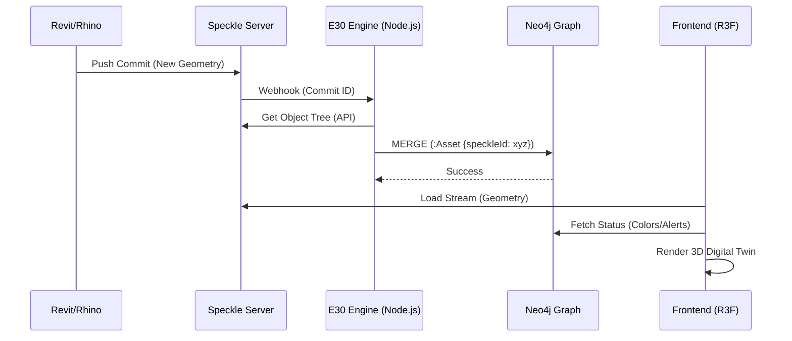

# AEON Digital Twin Architecture & Implementation Guide
## Module: Services_62443 (OT/ICS Security Compliance)

**Version:** 1.0.0
**Author:** Antigravity (Google DeepMind)
**Date:** December 11, 2025
**Safety Standard:** IEC 62443-3-3 (System Security Requirements)

---

## 1. Executive Summary
This document details the architectural blueprint for the **AEON Cyber Digital Twin**, specifically designed to support **Services_62443** (Object-Oriented Security Monitoring for Industrial Control Systems).

The system implements a **"Body & Brain"** architecture:
1.  **The Body**: High-fidelity 3D BIM data (Geometry/Physics) managed by **Speckle Systems**.
2.  **The Brain**: Contextual Knowledge Graph (Logic/Threats) managed by **Neo4j**.
3.  **The Interface**: Next-Gen "Diegetic" UI rendered via **React Three Fiber**.

This architecture allows operators to visualize IEC 62443 Zones & Conduits in real-time 3D, overlaying active threat telemetry onto physical assets.

---

## 2. Technology Stack & Citations

### 2.1 Core Rendering Engine
*   **Library**: `react-three-fiber` (v8+)
*   **Citation**: [GitHub - pmndrs/react-three-fiber](https://github.com/pmndrs/react-three-fiber)
*   **Role**: React renderer for Three.js. Enables declarative scene composition.
*   **Implementation**: Used for the main 3D Canvas in Next.js App Router (`app/page.tsx`).

### 2.2 Digital Twin Data Layer (The Body)
*   **Platform**: **Speckle Systems**
*   **Libraries**:
    *   `@speckle/viewer`: [npm](https://www.npmjs.com/package/@speckle/viewer)
    *   `@speckle/objectloader`: [npm](https://www.npmjs.com/package/@speckle/objectloader)
*   **Role**: Streaming large BIM models (Revit/Rhino) into the browser without heavy file processing.
*   **Pipeline**: `CAD -> Speckle Server -> Frontend Stream -> R3F Canvas`.

### 2.3 Knowledge Graph & Logic (The Brain)
*   **Database**: **Neo4j** (v5 Enterprise)
*   **Driver**: `neo4j-driver`
*   **Role**: Storing the "Digital Thread". Tracks relationships between Assets, Threats, and Vulnerabilities.
*   **Ontology**: Implements the **IEC 62443 Ontology** (Zone, Conduit, Level 0-4).

### 2.4 Diegetic User Interface
*   **Library**: `@pmndrs/uikit`
*   **Citation**: [GitHub - pmndrs/uikit](https://github.com/pmndrs/uikit)
*   **Role**: Rendering interactive UIs (Buttons, Panels) *inside* the 3D world (Spatial Computing).
*   **Why**: Traditional HTML overlays break immersion. Diegetic UI interacts with light/depth.

### 2.5 Data Visualization
*   **Library**: `nivo` (Built on D3.js)
*   **Citation**: [Nivo Rocks](https://nivo.rocks/)
*   **Role**: High-precision 2D charts (Bar, Line, Radar) rendered as **Textures** onto 3D panels.

---

## 3. Data Pipeline Architecture

### 3.1 The Synchronization Pipeline ("E30 Engine")
To ensure the "Body" (3D) matches the "Brain" (Graph), we use a webhook-driven sync.



### 3.2 Implementation Strategy (Services_62443)

#### Phase 1: The "Zone" Mapper
**Objective**: Visualize IEC 62443 Security Zones.
*   **Speckle**: Store "Room" or "Facility" geometry.
*   **Neo4j**: `(:Room)-[:HAS_SECURITY_LEVEL]->(:SL_Target {level: 3})`.
*   **Visualization**: Color code 3D Rooms based on their Security Level (SL-T).
    *   SL-1: Green
    *   SL-2: Yellow
    *   SL-3: Orange
    *   SL-4: Red (Critical)

#### Phase 2: The "Conduit" Tracer
**Objective**: Visualize Network Flows.
*   **Speckle**: Store "Cable Trays" or logical connections as Lines.
*   **Neo4j**: `(:Asset A)-[:COMMUNICATES_WITH]->(:Asset B)`.
*   **Visualization**: Animated "Data Particles" flowing along cables in 3D (using `MeshLineMaterial`).

---

## 4. Code Examples

### 4.1 Loading a Speckle Model in React Component

```tsx
import { Canvas } from '@react-three/fiber'
import { SpeckleLoader } from '@speckle/objectloader'
import { useLoader } from '@react-three/fiber'

function DigitalTwinModel({ streamId, objectId }) {
  // Load Geometry from Speckle Stream
  const data = useLoader(SpeckleLoader, `https://speckle.xyz/streams/${streamId}/objects/${objectId}`)
  
  return <primitive object={data} />
}
```

### 4.2 Querying the "Brain" (Neo4j)

```typescript
// services/graph.ts
import neo4j from 'neo4j-driver'

export async function getAssetHealth(speckleIds: string[]) {
  const driver = neo4j.driver(process.env.NEO4J_URI, neo4j.auth.basic(process.env.NEO4J_USER, process.env.NEO4J_PWD))
  const session = driver.session()
  
  try {
    const result = await session.run(
      `
      MATCH (a:Asset)
      WHERE a.speckleId IN $ids
      RETURN a.speckleId as id, a.healthScore as health, a.dissonance as dissonance
      `,
      { ids: speckleIds }
    )
    return result.records.map(r => r.toObject())
  } finally {
    await session.close()
  }
}
```

### 4.3 Diegetic UI Panel (Holographic)

```tsx
import { Root, Container, Text } from '@pmndrs/uikit'

function SecurityPanel({ assetName, securityLevel }) {
  return (
    <Root>
      <Container 
        backgroundColor="#00000088" 
        borderColor="#00ff00" 
        borderWidth={2}
        borderRadius={10}
        padding={20}
        flexDirection="column"
      >
        <Text fontSize={24} color="white">{assetName}</Text>
        <Text fontSize={16} color={securityLevel > 2 ? 'red' : 'green'}>
          IEC 62443 SL-T: {securityLevel}
        </Text>
      </Container>
    </Root>
  )
}
```

---

## 5. Deployment & pipelines

### 5.1 Docker Containerization
The entire frontend is containerized for "Write Once, Run Anywhere" deployment.
*   **Base Image**: `node:20-alpine` (Lightweight)
*   **Optimization**: Multi-stage build to remove devDependencies (`@types/*`, `eslint`).

### 5.2 CI/CD
*   **Lint**: `next lint` (Strict Mode)
*   **Test**: `vitest` (Unit tests for Psychometrics)
*   **Build**: `next build` (Static Generation where possible)

---

## 6. Conclusion
This architecture provides a scalable, industrial-grade foundation for the **AEON Cyber Digital Twin**. By decoupling the **Geometry ("Body")** from the **Logic ("Brain")**, we enable parallel evolution of the physical plant and the cyber-security capabilities, ensuring compliance with **IEC 62443** standards.
