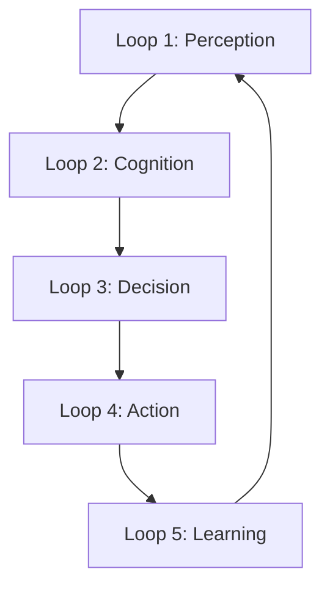

# The Neural Council & System Loops ("The Lops")

**Status**: ACTIVE
**Grade**: Project Grade A
**Context**: Advanced Agentic Governance & Feedback Systems

---

## 1. Executive Summary

The **Neural Council** represents the apex of agentic governance within the AEON Cyber Digital Twin. It is not merely a collection of agents, but a structured **deliberative body** that applies systems thinking to complex cybersecurity challenges.

The Council operates through **System Loops** (colloquially "The Lops")—continuous, self-correcting feedback cycles that ensure the system moves from Perception to Learning with mathematical precision. This architecture ensures that every action is coherent, well-thought-through, and aligned with the strategic objectives of the Digital Twin.

---

## 2. The Neural Council: Personas & Roles

The Council is composed of five distinct personas, each representing a critical mode of thinking. They do not just "execute tasks"; they debate, refine, and authorize actions.

### 🏛️ The Chairman (Orchestrator)
*   **Archetype**: The Strategist / CEO
*   **Responsibility**: Strategic alignment, conflict resolution, and final decision-making.
*   **Key Question**: *"Does this align with our core mission and risk appetite?"*
*   **Agentic Function**:
    *   Synthesizes inputs from all other council members.
    *   Holds the "Gavel" (final authorization token).
    *   Manages the global state and priority queue.

### 🔍 The Analyst (Researcher)
*   **Archetype**: The Detective / Data Scientist
*   **Responsibility**: Deep dive analysis, pattern recognition, and truth-seeking.
*   **Key Question**: *"What does the data actually say, and what are we missing?"*
*   **Agentic Function**:
    *   Ingests Level 5 (Real-time) and Level 6 (Predictive) data.
    *   Performs anomaly detection and correlation.
    *   Challenges assumptions with evidence.

### 📐 The Architect (Developer)
*   **Archetype**: The Engineer / Builder
*   **Responsibility**: Solution design, technical feasibility, and system integrity.
*   **Key Question**: *"How do we build this robustly, efficiently, and securely?"*
*   **Agentic Function**:
    *   Generates implementation plans and code specs.
    *   Simulates structural impacts of decisions.
    *   Ensures adherence to the 7-Layer Architecture.

### ⚡ The Operator (Executor)
*   **Archetype**: The Commander / Doer
*   **Responsibility**: Action execution, operational feedback, and tactical reality.
*   **Key Question**: *"Can we execute this now, and what are the immediate effects?"*
*   **Agentic Function**:
    *   Interfaces with the Docker Sandbox and external APIs.
    *   Reports on execution status (Success/Failure/Blockers).
    *   Provides "Ground Truth" feedback to the Council.

### ⚖️ The Critic (Ethicist/QA)
*   **Archetype**: The Auditor / Devil's Advocate
*   **Responsibility**: Risk assessment, ethical guardrails, and quality assurance.
*   **Key Question**: *"What could go wrong? Are we breaking any rules?"*
*   **Agentic Function**:
    *   Simulates "Red Team" scenarios against proposed plans.
    *   Validates compliance with safety protocols.
    *   Calculates the "Regret Score" of potential actions.

---

## 3. System Loops ("The Lops")

The Council operates within a defined 5-stage feedback loop. This is the "Heartbeat" of the agentic system.



### 🔄 Loop 1: Perception (Data Ingestion)
*   **Input**: Raw streams from Level 5 (Information Streams), Logs, Alerts.
*   **Process**: Noise filtering, normalization, and event tagging.
*   **Owner**: The Analyst.
*   **Output**: `StructuredEvent` object.

### 🧠 Loop 2: Cognition (Analysis & Prediction)
*   **Input**: `StructuredEvent`, Historical Data (Level 0-4).
*   **Process**:
    *   Apply Level 6 Prediction Models (NHITS, Prophet).
    *   Run McKenney Q7 (What will happen?).
    *   Identify potential anomalies.
*   **Owner**: The Analyst & The Architect.
*   **Output**: `IntelligenceBrief` (Context + Prediction).

### 🗣️ Loop 3: Decision (The Council Session)
*   **Input**: `IntelligenceBrief`.
*   **Process**:
    *   **Proposal**: Architect proposes a course of action.
    *   **Critique**: Critic challenges the proposal (Risk/Ethics).
    *   **Synthesis**: Chairman weighs the arguments.
    *   **Vote**: Council members vote (Consensus or Executive Override).
*   **Owner**: The Chairman (The Council).
*   **Output**: `AuthorizedMandate` (Plan + Auth Token).

### 🚀 Loop 4: Action (Execution)
*   **Input**: `AuthorizedMandate`.
*   **Process**:
    *   Operator executes the mandate in the Sandbox.
    *   Real-time monitoring of effects.
*   **Owner**: The Operator.
*   **Output**: `ExecutionResult` (Logs + Outcome).

### 🎓 Loop 5: Learning (Feedback & Update)
*   **Input**: `ExecutionResult`.
*   **Process**:
    *   Compare `ExecutionResult` vs `IntelligenceBrief` (Prediction vs Reality).
    *   Update Level 6 Models (Retraining).
    *   Update Knowledge Base (Long-term Memory).
*   **Owner**: The Analyst & The Architect.
*   **Output**: `SystemUpdate` (Improved Model/Rule).

---

## 4. Agentic Code Specification

This section details specifically what the agentic code *does* to implement this structure.

### Core Data Structures

```typescript
type Persona = 'CHAIRMAN' | 'ANALYST' | 'ARCHITECT' | 'OPERATOR' | 'CRITIC';

interface CouncilSession {
  sessionId: string;
  triggerEvent: StructuredEvent;
  state: 'DELIBERATING' | 'VOTING' | 'AUTHORIZED' | 'REJECTED';
  transcript: Message[];
  mandate?: AuthorizedMandate;
}

interface AuthorizedMandate {
  id: string;
  plan: ImplementationPlan;
  riskAssessment: RiskScore;
  authorizationToken: string; // Cryptographic proof of Council approval
  timestamp: number;
}
```

### The Council Loop Logic (Pseudocode)

```python
class NeuralCouncil:
    def convene_session(self, event):
        # Phase 1: Analyst Briefing
        brief = self.analyst.analyze(event)
        
        # Phase 2: Architect Proposal
        plan = self.architect.design_solution(brief)
        
        # Phase 3: Critic Review
        risks = self.critic.evaluate(plan)
        if risks.severity > CRITICAL_THRESHOLD:
            return self.architect.revise(plan, risks)
            
        # Phase 4: Chairman Decision
        decision = self.chairman.decide(plan, risks, brief)
        
        if decision.approved:
            return self.operator.execute(decision.mandate)
        else:
            return self.log_rejection(decision)

    def run_system_loop(self):
        while True:
            # Loop 1: Perception
            event = monitor.get_next_event()
            
            # Loop 2 & 3: Cognition & Decision
            result = self.convene_session(event)
            
            # Loop 4: Action (Handled by Operator in convene_session)
            
            # Loop 5: Learning
            self.memory.update(result)
```

### Integration Points
1.  **Level 6 Predictions**: The `Analyst` directly calls the Level 6 API to get `FutureThreat` probabilities during the Briefing phase.
2.  **Docker Sandbox**: The `Operator` is the *only* persona with write access to the Docker socket.
3.  **Memory Store**: All `CouncilSessions` are stored in the Vector Database (pgvector) for future retrieval (Case Law).
