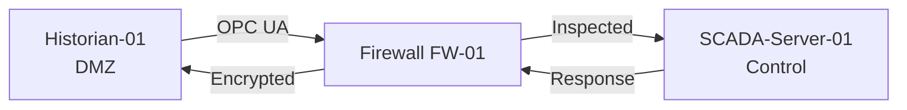

# IEC 62443 Zone and Conduit Visualization Guide

## Complete Guide to Creating ZCR Diagrams with draw.io and Obsidian Canvas

**Version 1.0**  
**Document Date: October 2025**

---

## Table of Contents

1. [Zone and Conduit Fundamentals](#fundamentals)
2. [Visualization Standards and Best Practices](#standards)
3. [draw.io for Zone/Conduit Diagrams](#drawio-guide)
4. [Obsidian Canvas for ZCR Documentation](#obsidian-guide)
5. [Integration with Asset Lists and SL Requirements](#integration)
6. [Complete Workflow and Templates](#workflow)
7. [Advanced Techniques](#advanced-techniques)

---

## 1. Zone and Conduit Fundamentals {#fundamentals}

### 1.1 Core Definitions

**Zone**: A grouping of cyber assets (physical or logical) that share the same cybersecurity requirements.

**Conduit**: A grouping of communication channels connecting two or more zones that share the same cybersecurity requirements.

**Critical Rules** (per ISAGCA guidance):

| Rule | Description | Visual Implication |
|------|-------------|-------------------|
| **Zone Sub-zones** | A zone **CAN** have sub-zones | Show hierarchical containment |
| **No Sub-conduits** | A conduit **CANNOT** have sub-conduits | No nesting for conduits |
| **Multiple Conduits** | A zone **CAN** have more than one conduit | Multiple paths in/out |
| **Conduit Traversal** | A conduit **CANNOT** traverse more than one zone | Direct zone-to-zone only |
| **Shared Conduits** | A conduit **CAN** connect two or more zones | Many-to-many allowed |

### 1.2 Zone Classification Framework

| Zone Type | Typical Components | Visual Color | SL-T Range | Purdue Level |
|-----------|-------------------|--------------|------------|--------------|
| **Corporate/Enterprise** | Business servers, workstations, ERP | Light Blue | SL 0-1 | Level 4-5 |
| **Industrial DMZ** | Historians, app servers, gateways | Orange | SL 2 | Level 3.5 |
| **Supervisory Control** | SCADA, HMI, engineering stations | Yellow | SL 2-3 | Level 3 |
| **Basic Process Control** | PLCs, DCS controllers, local HMIs | Green | SL 2-3 | Level 2 |
| **Safety Systems** | SIS, ESD, F&G systems | Red | SL 3-4 | Level 2 (separate) |
| **Field Devices** | Sensors, actuators, instruments | Light Green | SL 2 | Level 0-1 |
| **Remote Access** | VPN gateways, jump hosts | Purple | SL 2-3 | Cross-level |

### 1.3 Conduit Types and Notation

**Common Conduit Types**:

1. **Ethernet-based Industrial Networks** (OPC, Modbus TCP, EtherNet/IP)
2. **DCS Control Networks** (Proprietary protocols)
3. **Industrial Fieldbuses** (Profibus DP, DeviceNet, DNP3)
4. **Foundation Fieldbus / HART** 
5. **Wireless Networks** (ISA100, WirelessHART)
6. **Serial Connections** (RS-232/422/485)
7. **Remote Access VPNs**

**Data Flow Notation** (per ENISA Railway Guidance):

| Symbol | Meaning | Visual Representation |
|--------|---------|----------------------|
| **+** | Bidirectional data flow allowed | Double-headed arrow |
| **R** | Read-only / Unidirectional | Single-headed arrow or special marker |
| **-** | Prohibited / Blocked | X or blocked line |

### 1.4 Security Level Tagging

Each zone and conduit must be tagged with security level information:

**Required Tags**:
- **SL-T (Target)**: Desired security level
- **SL-A (Achieved)**: Current implemented level (once assessed)
- **SL-C (Capability)**: Maximum capability of components in zone

**Visual Format**: 
```
Zone Name
SL-T: 3 | SL-A: 2
```

---

## 2. Visualization Standards and Best Practices {#standards}

### 2.1 Standard Diagram Elements

#### Zone Representation

**Primary Shape**: Rounded rectangle with drop shadow

**Visual Attributes**:
- Border: 2-3pt solid line
- Fill: Semi-transparent (70-80% opacity) with zone-appropriate color
- Label: Top-left or centered
- Font: Bold, 12-14pt

**Required Information in Zone Box**:
```
ZONE-ID: DMZ-01
Zone Name: Industrial DMZ
SL-T: 2
━━━━━━━━━━━━━━━━
Key Assets:
• Data Historian
• App Server 01-02
• OPC Gateway
━━━━━━━━━━━━━━━━
Owner: IT/OT Team
```

#### Conduit Representation

**Primary Shape**: Thick line or pipe connecting zones

**Visual Attributes**:
- Line Style: 
  - Ethernet: Solid line (3-4pt)
  - Wireless: Dashed line
  - Serial: Thin line (1-2pt)
  - VPN/Tunnel: Double line
- Color: Match highest security level zone
- Arrowheads: 
  - Bidirectional: Both ends
  - Unidirectional: Single arrow
  - Read-only: Special arrow with "R"

**Required Information for Conduit Label**:
```
CONDUIT-C02
Protocol: OPC UA
SL-T: 2
Bandwidth: 1 Gbps
Security: Firewall + IPS
```

#### Security Boundary Representation

**Shape**: Dashed or dotted boundary line around zone perimeter

**Color**: Red or dark gray

**Purpose**: Emphasize security perimeter requiring protection

#### Security Device Symbols

| Device | Shape | Color | Notes |
|--------|-------|-------|-------|
| **Firewall** | Rectangle with flame icon | Red outline | Place at conduit intersections |
| **IPS/IDS** | Shield icon | Blue | Inline or monitoring |
| **Data Diode** | Triangle with blocked reverse | Green | Unidirectional only |
| **VPN Gateway** | Cloud with lock | Purple | Remote access points |
| **Jump Host** | Computer with key | Orange | Privileged access |

### 2.2 Layer Strategy for Complex Diagrams

**Recommended Layers** (draw.io):

1. **Background Layer**: Grid, titles, legends
2. **Zone Infrastructure Layer**: Zone boxes and boundaries
3. **Asset Layer**: Individual devices and systems
4. **Conduit Layer**: Communication paths
5. **Security Controls Layer**: Firewalls, IPS, monitoring points
6. **Annotation Layer**: Labels, SL tags, notes
7. **Data Flow Animation Layer**: Optional animated flows

**Layer Usage**:
- Show/hide layers for different audiences
- Lock layers to prevent accidental changes
- Use layers for "before/after" or "current/future" state views

### 2.3 Color Coding Standards

#### Zone Colors (Suggested Palette)

```
Corporate:     #E3F2FD (Light Blue)
DMZ:           #FFE0B2 (Light Orange)
Supervisory:   #FFF9C4 (Light Yellow)
Basic Control: #C8E6C9 (Light Green)
Safety:        #FFCDD2 (Light Red)
Field:         #F0F4C3 (Lime)
Remote:        #E1BEE7 (Light Purple)
```

#### Criticality Heat Map (Optional)

Use gradient fills to show relative criticality:
- **Low**: Cool colors (blue, light green)
- **Medium**: Warm colors (yellow, orange)
- **High**: Hot colors (red, dark orange)
- **Critical**: Deep red with pattern fill

### 2.4 Diagram Size and Scale

**Recommended Canvas Sizes**:

| Diagram Type | Width x Height | Format |
|--------------|----------------|--------|
| Overview (High-Level) | 1920x1080px | Landscape |
| Detailed Zone | 2560x1440px | Landscape |
| Vertical Stack (Purdue) | 1080x1920px | Portrait |
| Poster/Wall Display | 3840x2160px (4K) | Landscape |

**Export Formats**:
- **Working Document**: .drawio (editable)
- **Review**: .pdf (vector, scalable)
- **Presentation**: .png or .svg (high DPI)
- **Web/Portal**: .svg (interactive capability)

---

## 3. draw.io for Zone/Conduit Diagrams {#drawio-guide}

### 3.1 Setup and Configuration

#### Initial Setup

1. **Access draw.io**: 
   - Web: https://app.diagrams.net
   - Desktop: Download from https://www.diagrams.net
   - Integration: Confluence, Jira, VS Code, etc.

2. **Create New Diagram**:
   ```
   File → New → Blank Diagram
   Name: "Site_ZoneConduit_v1.0.drawio"
   ```

3. **Set Canvas Properties**:
   ```
   File → Properties
   - Paper Size: A3 Landscape (or custom)
   - Grid: 10px
   - Page View: Enabled
   - Mathematical Typesetting: Enabled (for formulas)
   ```

#### Enable Essential Libraries

Access shape libraries via **+More Shapes** (bottom left):

**Recommended Libraries for ICS Diagrams**:
- ☑ Networking (General)
- ☑ Network (Cisco icons)
- ☑ Azure (for cloud integration)
- ☑ AWS (for cloud integration)
- ☑ Arrows
- ☑ Basic Shapes
- ☑ Flowchart
- ☑ UML (for system boundaries)

**Industrial-Specific** (if available):
- Search for "Industrial" or "SCADA" community libraries
- Import custom libraries (see Section 3.4)

### 3.2 Creating Zone Boxes

#### Method 1: Using Containers

1. **Insert Container**:
   ```
   Arrange → Insert → Container
   ```

2. **Style Container as Zone**:
   ```
   Right-click container → Edit Style
   
   Style String:
   rounded=1;
   whiteSpace=wrap;
   html=1;
   fillColor=#E3F2FD;
   strokeColor=#1976D2;
   strokeWidth=3;
   shadow=1;
   fontSize=14;
   fontStyle=1
   ```

3. **Add Zone Label**:
   - Double-click container to add text
   - Format: Zone name at top
   - Use Alt+Enter for line breaks

#### Method 2: Using Swimlanes

For hierarchical zones with sub-zones:

1. **Insert Swimlane**:
   ```
   Arrange → Insert → Swimlane (Horizontal or Vertical)
   ```

2. **Configure Swimlanes**:
   - Each swimlane becomes a sub-zone
   - Parent container is the main zone
   - Easy to reorganize and resize

#### Method 3: Custom Zone Shape

**Create Reusable Zone Template**:

1. **Create Zone with All Elements**:
   - Rounded rectangle (outer boundary)
   - Text box (zone ID and name)
   - Table shape (asset list)
   - Small boxes (SL indicators)

2. **Group Elements**:
   ```
   Select all elements → Right-click → Group
   ```

3. **Save to Custom Library**:
   ```
   Drag grouped shape → File → New Library
   Name: "ICS_Zones.xml"
   ```

### 3.3 Creating Conduits and Connections

#### Basic Conduit Creation

1. **Draw Connection**:
   ```
   Select Connector tool (toolbar) OR
   Hover over zone → click green dot → drag to target zone
   ```

2. **Style Conduit**:
   ```
   Select connector → Format Panel (right side)
   
   Line:
   - Width: 3-4pt
   - Color: Based on protocol or SL
   - Pattern: Solid (Ethernet), Dashed (Wireless), etc.
   
   Arrows:
   - Start: None or classic
   - End: Classic (for directional) or both ends
   ```

3. **Add Conduit Label**:
   ```
   Double-click connector midpoint → Enter text
   
   Format:
   - Background: White with opacity
   - Border: Yes
   - Position: Middle or custom
   ```

#### Advanced Conduit Features

**Waypoints for Complex Routing**:
```
Select connector → Right-click → Edit Points
Drag yellow diamonds to create waypoints
Hold Alt while dragging to create orthogonal angles
```

**Curved vs Straight**:
```
Select connector → Format Panel → Line → Waypoints
Options:
- Straight: Direct line
- Curved: Bezier curve
- Orthogonal: Right angles only (best for technical diagrams)
```

### 3.4 Creating Custom ICS Shape Library

#### XML Structure for Custom Shapes

**Example: Firewall Shape**

```xml
<mxlibrary>[
{
  "xml": "<mxGraphModel><root><mxCell id=\"0\"/><mxCell id=\"1\" parent=\"0\"/><mxCell id=\"2\" value=\"Firewall\" style=\"rounded=0;whiteSpace=wrap;html=1;fillColor=#FF6B6B;strokeColor=#C92A2A;strokeWidth=3;\" vertex=\"1\" parent=\"1\"><mxGeometry width=\"120\" height=\"60\" as=\"geometry\"/></mxCell><mxCell id=\"3\" value=\"🔥\" style=\"text;html=1;strokeColor=none;fillColor=none;align=center;verticalAlign=middle;whiteSpace=wrap;rounded=0;fontSize=24;\" vertex=\"1\" parent=\"1\"><mxGeometry x=\"40\" y=\"15\" width=\"40\" height=\"30\" as=\"geometry\"/></mxCell></root></mxGraphModel>",
  "w": 120,
  "h": 60,
  "title": "Firewall"
},
{
  "xml": "<mxGraphModel><root><mxCell id=\"0\"/><mxCell id=\"1\" parent=\"0\"/><mxCell id=\"2\" value=\"IPS/IDS\" style=\"rounded=1;whiteSpace=wrap;html=1;fillColor=#4ECDC4;strokeColor=#1A535C;strokeWidth=2;\" vertex=\"1\" parent=\"1\"><mxGeometry width=\"120\" height=\"60\" as=\"geometry\"/></mxCell><mxCell id=\"3\" value=\"🛡️\" style=\"text;html=1;strokeColor=none;fillColor=none;align=center;verticalAlign=middle;whiteSpace=wrap;rounded=0;fontSize=20;\" vertex=\"1\" parent=\"1\"><mxGeometry x=\"40\" y=\"15\" width=\"40\" height=\"30\" as=\"geometry\"/></mxCell></root></mxGraphModel>",
  "w": 120,
  "h": 60,
  "title": "IPS/IDS"
}
]</mxlibrary>
```

**To Import**:
```
File → Open Library from → Device...
Select your .xml file
Library appears in left panel
```

#### Essential ICS Shapes to Create

1. **PLC Shape**:
   ```
   Rectangle with:
   - CPU indicator (small colored box)
   - I/O ports (numbered connection points)
   - Model label
   ```

2. **HMI Workstation**:
   ```
   Computer monitor icon with:
   - Screen representation
   - User role indicator
   - Network connection points
   ```

3. **Data Historian**:
   ```
   Database cylinder with:
   - Storage capacity indicator
   - Time series icon
   - Multiple input connections
   ```

4. **Safety PLC (SIS)**:
   ```
   Rectangle with:
   - Red border (3pt)
   - SIL level indicator
   - Separate channel indicators
   ```

### 3.5 Layer Management for ZCR

#### Layer Setup Workflow

**Step 1: Create Layer Structure**

```
View → Layers (Ctrl+Shift+L)

Click [+] to add layers in this order:
1. Background
2. Zones
3. Sub-zones (optional)
4. Assets
5. Conduits
6. Security_Devices
7. Labels
8. Annotations
```

**Step 2: Assign Elements to Layers**

```
Select shape(s) → Layers panel → Click "..." menu → Move to layer
```

**Step 3: Layer Visibility Controls**

```
Click eye icon to show/hide layer
Click lock icon to prevent editing
```

#### Use Cases for Layers

**Scenario 1: Progressive Disclosure**

Show complexity gradually:
1. Start with Zones only (hide Assets and Conduits)
2. Add Conduits for data flow understanding
3. Show Assets for detailed view
4. Overlay Security_Devices for protection view

**Scenario 2: Before/After Comparison**

Create duplicate layers:
- "Current_State_Zones"
- "Future_State_Zones"
- Toggle between to show improvements

**Scenario 3: Audience-Specific Views**

- **Executive View**: Zones + high-level conduits only
- **Technical View**: All layers visible
- **Security View**: Zones + Security_Devices + Conduits
- **Operations View**: Zones + Assets + key conduits

### 3.6 Adding Interactive Elements

#### Hyperlinks

Link zones to detailed documentation:

```
Select zone shape → Right-click → Edit Link
Enter URL: /wiki/Zone_DMZ-01_Details
Or file: file:///C:/ICS_Docs/Zone_DMZ-01.pdf
```

#### Tooltips

Add hover information:

```
Select shape → Format Panel → Properties
Add "tooltip" property:
Key: tooltip
Value: "DMZ Zone - Hosts data historians and application servers. SL-T: 2. Owner: IT/OT Team."
```

#### Collapsible Containers

For complex zones with many assets:

```
Select container → Right-click → Edit Tooltip
Check "Collapsible"
Container can now be collapsed/expanded
```

### 3.7 Templates and Examples

#### Template 1: Basic Zone Diagram

**Structure**:
```
[Corporate Zone] ←→ [DMZ] ←→ [Control Network] ←→ [Field Devices]
                                    ↕
                              [Safety Systems]
```

**Creation Steps**:
1. Create 5 zone boxes using containers
2. Position in Purdue Model hierarchy
3. Add conduits with appropriate styling
4. Place firewalls at each zone boundary
5. Add legend and title block
6. Save as template: `File → Save As Template`

#### Template 2: Detailed Single Zone

**Structure**:
```
┌──────────────────────────────────────┐
│ ZONE: Supervisory Control (SL-T: 3) │
├──────────────────────────────────────┤
│ Assets:                              │
│ ┌────────┐  ┌────────┐  ┌────────┐ │
│ │SCADA-01│  │HMI-01  │  │ENG-WS  │ │
│ └────────┘  └────────┘  └────────┘ │
│                                      │
│ Conduits:                            │
│ C-01: To DMZ (OPC UA)                │
│ C-02: To Control (Modbus TCP)        │
└──────────────────────────────────────┘
```

**Export Settings**:
```
File → Export As → PNG
- Border Width: 10px
- Transparent Background: No
- DPI: 300 (for print)
- Include: All layers OR selected layers
```

### 3.8 Best Practices for draw.io ZCR Diagrams

1. **Use Consistent Naming Convention**:
   ```
   Zones: ZONE-[Type]-[Number] (e.g., ZONE-DMZ-01)
   Conduits: C-[Number] (e.g., C-01, C-02)
   Assets: [Type]-[Number] (e.g., PLC-001, HMI-01)
   ```

2. **Maintain Alignment**:
   ```
   Select multiple shapes → Arrange → Align
   Use: Align Left, Distribute Horizontally, etc.
   Enable Grid Snap: View → Grid → Snap to Grid
   ```

3. **Use Connection Points**:
   ```
   Hover over shape → Green crosshairs appear
   Drag from green point to ensure proper connections
   Connections stay attached when moving shapes
   ```

4. **Version Control**:
   ```
   Save versions with date/version in filename:
   Site_ZC_v1.0_2025-10-21.drawio
   
   Use built-in revision history (desktop version)
   ```

5. **Documentation within Diagram**:
   ```
   Add text shape with:
   - Diagram title and version
   - Legend (zone colors, conduit types)
   - Author and date
   - Review/approval status
   ```

---

## 4. Obsidian Canvas for ZCR Documentation {#obsidian-guide}

### 4.1 Obsidian Canvas Overview

**Obsidian Canvas** is an infinite canvas for visual thinking, perfect for linking zone/conduit documentation with notes, assessments, and requirements.

**Key Advantages for IEC 62443**:
- Link canvas cards to markdown note files
- Embed entire documents or sections
- Create knowledge graphs connecting zones → assets → requirements
- Bidirectional linking with vault notes
- Export capabilities

### 4.2 Setting Up Obsidian for ZCR

#### Vault Structure

```
ICS_Cybersecurity_Vault/
├── 00_Canvas/
│   ├── Site_Overview.canvas
│   ├── Zone_Details.canvas
│   └── Conduit_Catalog.canvas
├── 01_Zones/
│   ├── ZONE-DMZ-01.md
│   ├── ZONE-CTRL-01.md
│   └── ZONE-SAFETY-01.md
├── 02_Conduits/
│   ├── C-01_DMZ_to_Control.md
│   ├── C-02_Control_to_Field.md
│   └── Conduit_Template.md
├── 03_Assets/
│   ├── Asset_Inventory.md
│   └── By_Zone/
│       ├── DMZ_Assets.md
│       └── Control_Assets.md
├── 04_Requirements/
│   ├── SL_Requirements_Matrix.md
│   ├── FR1_IAC_Requirements.md
│   └── ... (other FRs)
├── 05_Risk_Assessment/
│   ├── Risk_Register.md
│   ├── Threat_Catalog.md
│   └── Zone_Risk_Profiles/
└── 06_Templates/
    ├── Zone_Template.md
    ├── Asset_Template.md
    └── Conduit_Template.md
```

#### Essential Plugins

**Recommended Obsidian Plugins**:

1. **Advanced Canvas** (Developer-Mike)
   - Flowchart shapes (terminal, process, decision, etc.)
   - Better styling options
   - Read-only mode for presentations

2. **Dataview**
   - Query asset lists dynamically
   - Generate tables from frontmatter
   - Track SL compliance

3. **Kanban**
   - Track implementation progress
   - Manage security requirements by status

4. **Excalidraw** (optional)
   - Hand-drawn style diagrams
   - Can embed in canvas

5. **Table Extended**
   - Better table editing
   - Sort and filter

### 4.3 Creating Zone Documentation with Canvas

#### Canvas Node Types

Obsidian Canvas supports 4 node types:

1. **Text Nodes**: Free-form text directly on canvas
2. **File Nodes**: Embed markdown files from vault
3. **Web Nodes**: Embed web pages (URLs)
4. **Media Nodes**: Embed images, PDFs

#### Zone Canvas Layout Pattern

**Visual Structure**:

```
┌─────────────────────────────────────────────────────┐
│                  SITE OVERVIEW                      │
│                                                     │
│  ┌──────────┐    ┌──────────┐    ┌──────────┐    │
│  │Corporate │--->│   DMZ    │--->│ Control  │    │
│  │  Zone    │    │   Zone   │    │  Zone    │    │
│  └──────────┘    └──────────┘    └──────────┘    │
│       │               │                │           │
│       v               v                v           │
│  [Details]       [Details]        [Details]       │
│  [Assets]        [Assets]         [Assets]        │
│  [Risks]         [Risks]          [Risks]         │
└─────────────────────────────────────────────────────┘
```

**Implementation**:

1. **Create Canvas**:
   ```
   Right-click in file explorer → New Canvas
   Name: "Site_ZoneConduit_Overview.canvas"
   ```

2. **Add Zone Cards** (File Nodes):
   ```
   Drag markdown file from vault onto canvas
   OR
   Right-click canvas → Add note from vault
   Select: 01_Zones/ZONE-DMZ-01.md
   ```

3. **Style Zone Cards**:
   ```
   Select card → Color picker (top-right)
   Choose color matching zone type
   Resize card as needed
   ```

4. **Connect Zones** (Edges):
   ```
   Click edge of card → Drag to target card
   Release to create connection
   
   For styled connections:
   - Select edge → Right side menu
   - Choose line style: solid, dashed, dotted
   - Add arrow: none, one-way, two-way
   - Color: match conduit type
   ```

5. **Add Labels to Connections**:
   ```
   Double-click edge → Enter text
   Example: "C-01: OPC UA (SL-T: 2)"
   ```

#### Using Advanced Canvas Shapes

With **Advanced Canvas plugin**:

**Available Shapes**:
- Terminal (rounded rectangle)
- Process (rectangle)
- Decision (diamond)
- Input/Output (parallelogram)
- On-Page Reference (circle)
- Predefined Process (rectangle with bars)
- Document (rectangle with wave bottom)
- Database (cylinder)

**Apply Shape**:
```
Select text or file node
Command Palette (Ctrl/Cmd + P)
Type: "Advanced Canvas: Change node shape"
Select shape
```

**Use Cases**:
- **Database shape**: For historians, CMDB
- **Document shape**: For documentation nodes
- **Decision shape**: For security decision points
- **Process shape**: For control systems

### 4.4 Linking Canvas to Requirements

#### Creating Requirement Links

**Method 1: Inline Links in Node Text**

```markdown
# ZONE-DMZ-01: Industrial DMZ

**SL-T**: 2

**Applicable Requirements**:
- [[FR1_IAC_Requirements#SR 1.1|SR 1.1 - User Authentication]]
- [[FR2_UC_Requirements#SR 2.1|SR 2.1 - Authorization]]
- [[FR5_RDF_Requirements#SR 5.1|SR 5.1 - Network Segmentation]]

**Status**: 75% Compliant
```

**Method 2: Hover Previews**

Enable in Settings:
```
Settings → Core Plugins → Page Preview: ON
Hover over [[link]] to see preview
```

**Method 3: Dataview Queries**

In zone file, auto-generate requirement list:

```markdown
## Applicable SL-2 Requirements

```dataview
TABLE FR, SR_ID, SR_Name, Status
FROM "04_Requirements"
WHERE contains(SL_Level, "2")
SORT FR ASC
```
```

#### Asset Integration with Dataview

**Example: Auto-Generate Asset List per Zone**

In `ZONE-DMZ-01.md`:

```markdown
## Assets in This Zone

```dataview
TABLE 
  Asset_Type as "Type",
  Asset_Name as "Name", 
  IP_Address as "IP",
  SL_Capability as "SL-C"
FROM "03_Assets/By_Zone"
WHERE Zone = "DMZ-01"
SORT Asset_Type ASC
```
```

**Asset File Example** (`03_Assets/By_Zone/DMZ_Historian_01.md`):

```markdown
---
Asset_Type: Data Historian
Asset_Name: Historian-01
Zone: DMZ-01
IP_Address: 10.1.2.10
Vendor: OSIsoft
Model: PI Server 2023
SL_Capability: 2
Criticality: High
---

# Historian-01 Details

## Description
Primary site data historian storing process data for 90 days.

## Network Connections
- [[C-01_DMZ_to_Control|Conduit C-01]]: To Control Network (read process data)
- [[C-05_DMZ_to_Corporate|Conduit C-05]]: To Corporate (reporting queries)

## Security Configuration
- Authentication: [[FR1_IAC_Requirements#SR 1.1 RE(1)|Individual user accounts]] ✓
- Authorization: [[FR2_UC_Requirements#SR 2.1|Role-based access]] ✓
- Encryption: [[FR4_DC_Requirements#SR 4.1 RE(1)|TLS 1.3 for all connections]] ✓
```

### 4.5 Canvas Presentation Mode

**Creating Multi-View Presentations**:

1. **Create Multiple Canvases**:
   ```
   00_Canvas/
   ├── 01_Executive_Overview.canvas
   ├── 02_Technical_Detail.canvas
   ├── 03_Security_Controls.canvas
   └── 04_Implementation_Plan.canvas
   ```

2. **Link Between Canvases**:
   ```
   In canvas, add text node:
   "Next: [[02_Technical_Detail]]"
   
   Click link to navigate to next canvas
   ```

3. **Use Advanced Canvas Read-Only Mode**:
   ```
   Command Palette → "Advanced Canvas: Toggle read-only mode"
   
   In read-only mode:
   - No editing
   - Click through links
   - Present to stakeholders
   ```

### 4.6 Export and Sharing

#### Export Canvas as Image

**Using Community Plugin: "Canvas2PDF"**:

```
Install Canvas2PDF plugin
Open canvas
Command Palette → "Canvas2PDF: Export current canvas"
Choose format: PDF or PNG
```

**Manual Screenshot**:
```
Zoom canvas to fit view
Use OS screenshot tool
Captures visible portion
```

#### Share Canvas with Non-Obsidian Users

**Option 1: Obsidian Publish**
- Publish entire vault or selected files
- Canvases viewable in browser
- Subscription required

**Option 2: Export as PDF**
- Use Canvas2PDF
- Share PDF with stakeholders
- No interactivity but portable

**Option 3: Convert to Markdown Report**
- Manually create report from canvas structure
- Include embedded images
- Export using Pandoc to Word/PDF

### 4.7 Advanced Canvas Techniques

#### Technique 1: Color-Coded Zone Hierarchy

**Color Scheme**:
```
Level 5 (Enterprise): Blue
Level 4 (Site Business): Light Blue
Level 3 (Supervisory): Yellow
Level 2 (Control): Green
Level 1 (Field): Light Green
Level 0 (Process): Lime
Safety: Red
```

**Apply Consistently**:
- All cards for same level use same color
- Visual hierarchy immediately apparent
- Matches draw.io diagrams

#### Technique 2: Nested Canvases

**Embed Canvas in Canvas**:

```
1. Create detailed zone canvas: Zone_DMZ_Detailed.canvas
2. In overview canvas, add note from vault
3. Select Zone_DMZ_Detailed.canvas file
4. Canvas appears embedded with portal icon
5. Click portal to "zoom in" to detailed view
```

**Use Case**: 
- Overview shows all zones at high level
- Click zone to see detailed asset layout
- Click asset to see configuration details

#### Technique 3: Animated Data Flows

Using text nodes and connections:

```
1. Create zone cards
2. Add conduit connections with labels
3. Create separate text nodes along connection path:
   "Step 1: OPC Client Request"
   "Step 2: Firewall Inspection"
   "Step 3: OPC Server Response"
4. Color-code steps
5. Use in presentations to explain data flow sequence
```

---

## 5. Integration with Asset Lists and SL Requirements {#integration}

### 5.1 Master Integration Strategy

**Goal**: Link zones → conduits → assets → requirements → compliance status

**Architecture**:

```
┌─────────────┐
│   Zones     │ (Defined by risk assessment)
└──────┬──────┘
       │ contains
       v
┌─────────────┐
│   Assets    │ (Inventoried with attributes)
└──────┬──────┘
       │ has
       v
┌─────────────┐
│  SL-C/SL-A  │ (Capability/Achieved levels)
└──────┬──────┘
       │ compared to
       v
┌─────────────┐
│    SL-T     │ (Target level from risk)
└──────┬──────┘
       │ determines
       v
┌─────────────┐
│Requirements │ (FRs/SRs from IEC 62443-3-3)
└──────┬──────┘
       │ tracked for
       v
┌─────────────┐
│ Compliance  │ (Gap analysis and remediation)
└─────────────┘
```

### 5.2 Asset List Integration

#### Structured Asset Data Model

**Asset Frontmatter Template**:

```markdown
---
# Asset Identification
asset_id: "ASSET-001"
asset_name: "SCADA-Server-01"
asset_type: "Server"
asset_subtype: "SCADA Master"

# Location
zone_id: "ZONE-CTRL-01"
zone_name: "Supervisory Control"
physical_location: "Control Room A, Rack 3"
geographic_site: "Main Plant"

# Technical Specs
vendor: "Schneider Electric"
model: "ClearSCADA 2023"
os: "Windows Server 2022"
os_version: "21H2"
ip_primary: "10.2.1.50"
ip_secondary: null
mac_address: "00:1A:2B:3C:4D:5E"

# Security Attributes
sl_capability: 2
sl_target: 3
sl_achieved: 2
criticality: "High"
availability_requirement: "99.9%"

# Compliance
patch_status: "Current"
av_installed: true
fw_local: true
audit_logging: true

# Lifecycle
install_date: 2024-01-15
warranty_expiry: 2027-01-15
owner: "OT Team"
admin_contact: "admin@example.com"

# Connectivity
connected_zones:
  - "ZONE-DMZ-01"
  - "ZONE-CTRL-02"
conduits:
  - "C-01"
  - "C-03"
protocols:
  - "OPC DA"
  - "Modbus TCP"
  - "DNP3"

tags:
  - critical
  - scada
  - windows
  - sl2-capable
---

# Asset Details: SCADA-Server-01

[Content continues...]
```

#### Querying Assets by Zone

**Dataview Query Examples**:

**All Assets in Zone**:
```markdown
```dataview
TABLE 
  asset_name AS "Asset",
  asset_type AS "Type",
  ip_primary AS "IP",
  sl_capability AS "SL-C",
  sl_target AS "SL-T",
  sl_achieved AS "SL-A"
FROM "03_Assets"
WHERE zone_id = "ZONE-CTRL-01"
SORT asset_name ASC
```
```

**Assets with SL Gap**:
```markdown
```dataview
TABLE 
  asset_name AS "Asset",
  zone_name AS "Zone",
  sl_target AS "Target",
  sl_achieved AS "Current",
  (sl_target - sl_achieved) AS "Gap"
FROM "03_Assets"
WHERE sl_achieved < sl_target
SORT zone_id, (sl_target - sl_achieved) DESC
```
```

**Critical Assets by Zone**:
```markdown
```dataview
TABLE 
  asset_name, 
  asset_type,
  criticality,
  availability_requirement
FROM "03_Assets"
WHERE criticality = "High" OR criticality = "Critical"
GROUP BY zone_name
```
```

### 5.3 SL Requirements Mapping

#### Requirements Database Structure

**Requirement File Template** (`FR1_SR1.1_User_Authentication.md`):

```markdown
---
# Requirement Identification
fr: "FR 1"
fr_name: "Identification and Authentication Control"
sr_id: "SR 1.1"
sr_name: "Human user identification and authentication"
sr_type: "Base"
re_number: null

# Security Level Applicability
sl1: true
sl2: true
sl3: true
sl4: true

# IEC 62443 Reference
standard: "IEC 62443-3-3"
section: "5.1"
page: "45"

# Implementation Details
requirement_text: |
  The control system shall provide the capability to identify 
  and authenticate all human users.
  
rationale: |
  Individual accountability requires that each user be 
  uniquely identified and authenticated before access is granted.

implementation_guidance: |
  - User accounts must be individual
  - No shared accounts except break-glass emergency access
  - Authentication via password, biometric, or certificate
  - Minimum password complexity: 8 chars, mixed case, number, symbol

# Testing
test_method: |
  1. Attempt login without credentials - should fail
  2. Login with valid individual account - should succeed
  3. Verify authentication log entries created

verification_criteria: |
  - All users have individual accounts
  - Authentication required before any system access
  - Failed attempts logged

# Relationships
related_srs:
  - "SR 1.1 RE(1)"
  - "SR 1.5"
  - "SR 2.1"

applicable_zones:
  - "ZONE-CTRL-01"
  - "ZONE-CTRL-02"
  - "ZONE-DMZ-01"

# Compliance Tracking
priority: "High"
implementation_status: "Implemented"
compliance_date: 2024-06-15
evidence_location: "Audit_Logs/IAC_Testing_2024-06"
responsible_party: "Security Team"
notes: |
  Implemented via Active Directory integration.
  Break-glass account documented in emergency procedures.

tags:
  - authentication
  - FR1
  - base-requirement
  - all-SLs
---

# SR 1.1: Human User Identification and Authentication

[Detailed content...]

## Affected Assets

```dataview
TABLE 
  asset_name,
  zone_name,
  sl_target,
  implementation_status
FROM "03_Assets"
WHERE contains(applicable_srs, "SR 1.1")
```

## Related Requirements

- [[FR1_SR1.1_RE1_Unique_Authentication]]
- [[FR1_SR1.5_Authenticator_Management]]
- [[FR2_SR2.1_Authorization_Enforcement]]
```

#### SL Requirements Matrix

**Auto-Generated Matrix** (using Dataview):

```markdown
# Security Level Requirements Matrix

## SL 1 Requirements

```dataview
TABLE 
  sr_id AS "SR ID",
  sr_name AS "Requirement",
  implementation_status AS "Status",
  compliance_date AS "Date"
FROM "04_Requirements"
WHERE sl1 = true
SORT fr, sr_id
```

## SL 2 Requirements (Incremental)

```dataview
TABLE 
  sr_id AS "SR ID",
  sr_name AS "Requirement",
  implementation_status AS "Status",
  compliance_date AS "Date"
FROM "04_Requirements"
WHERE sl2 = true AND sl1 = false
SORT fr, sr_id
```

[Continue for SL 3 and SL 4...]
```

### 5.4 Zone-to-Requirement Mapping

#### Automated Zone Compliance Dashboard

**Query: Zone Compliance Summary**:

```markdown
# Zone Compliance Dashboard

```dataview
TABLE 
  zone_id AS "Zone",
  sl_target AS "SL-T",
  (length(filter(requirements, (r) => r.status = "Implemented"))) AS "✓ Implemented",
  (length(filter(requirements, (r) => r.status = "In Progress"))) AS "🔧 In Progress",
  (length(filter(requirements, (r) => r.status = "Planned"))) AS "📋 Planned",
  (length(filter(requirements, (r) => r.status = "Not Implemented"))) AS "❌ Gap"
FROM "01_Zones"
SORT sl_target DESC, zone_id ASC
```
```

**Note**: This requires proper data structure in zone files

#### Visual Compliance Heat Map

**In draw.io or Obsidian Canvas**:

1. **Color code zones by compliance percentage**:
   - Green: 90-100% compliant
   - Yellow: 70-89% compliant
   - Orange: 50-69% compliant
   - Red: <50% compliant

2. **Add compliance badge to zone card**:
   ```
   ┌──────────────────────┐
   │ ZONE-CTRL-01         │
   │ Supervisory Control  │
   │                      │
   │ SL-T: 3              │
   │ Compliance: 87% 🟨   │
   └──────────────────────┘
   ```

### 5.5 Conduit-to-Asset-to-Requirement Chain

#### Conduit Documentation with Asset Links

**Conduit File Structure** (`C-01_DMZ_to_Control.md`):

```markdown
---
# Conduit Identification
conduit_id: "C-01"
conduit_name: "DMZ to Supervisory Control"

# Connected Zones
zone_source: "ZONE-DMZ-01"
zone_destination: "ZONE-CTRL-01"
bidirectional: true

# Technical Details
protocols:
  - "OPC UA"
  - "HTTPS"
bandwidth: "1 Gbps"
media_type: "Ethernet Fiber"
redundancy: true

# Security
sl_target: 3
data_flow_restriction: "R"  # R=Read-only, +=Bidirectional, -=Blocked
encryption_required: true
encryption_method: "TLS 1.3"

# Security Controls
firewall: "FW-01"
firewall_rules: "Ruleset_C-01_v2.3"
ids_ips: "IPS-01"
data_diode: false

# Assets Connected to This Conduit
assets_source:
  - "[[Historian-01]]"
  - "[[AppServer-02]]"
assets_destination:
  - "[[SCADA-Server-01]]"
  - "[[HMI-01]]"

# Applicable Requirements
requirements:
  - "[[FR5_SR5.1_Network_Segmentation]]"
  - "[[FR5_SR5.2_Zone_Boundary_Protection]]"
  - "[[FR5_SR5.2_RE1_Deny_by_Default]]"
  - "[[FR4_SR4.1_RE1_Encryption_in_Transit]]"

# Compliance
implementation_status: "Operational"
last_review: 2024-09-15
next_review: 2025-03-15

tags:
  - conduit
  - sl3
  - critical-path
---

# Conduit C-01: DMZ to Supervisory Control

## Data Flow Diagram

[Embed draw.io diagram or Mermaid]



## Security Controls Detail

### Firewall Rules (FW-01)

| Rule | Source | Destination | Protocol | Port | Action | Logging |
|------|--------|-------------|----------|------|--------|---------|
| 1 | Historian-01 | SCADA-01 | TCP | 4840 | Allow | Yes |
| 2 | SCADA-01 | Historian-01 | TCP | 4840 | Allow | Yes |
| ... | ... | ... | ... | ... | ... | ... |
| Default | Any | Any | Any | Any | Deny | Yes |

## Connected Assets

### Source Zone Assets
```dataview
TABLE 
  asset_name,
  asset_type,
  ip_primary
FROM "03_Assets"
WHERE contains(conduits, "C-01") AND zone_id = "ZONE-DMZ-01"
```

### Destination Zone Assets
```dataview
TABLE 
  asset_name,
  asset_type,
  ip_primary
FROM "03_Assets"
WHERE contains(conduits, "C-01") AND zone_id = "ZONE-CTRL-01"
```

## Requirement Compliance

### FR 5: Restricted Data Flow
- [x] SR 5.1: Network Segmentation ([[FR5_SR5.1]])
- [x] SR 5.2: Zone Boundary Protection ([[FR5_SR5.2]])
- [x] SR 5.2 RE(1): Deny All, Permit by Exception ([[FR5_SR5.2_RE1]])

### FR 4: Data Confidentiality
- [x] SR 4.1 RE(1): Encryption in Transit ([[FR4_SR4.1_RE1]])
  - Method: TLS 1.3 for OPC UA
  - Certificate: Valid until 2026-01-15
```

---

## 6. Complete Workflow and Templates {#workflow}

### 6.1 End-to-End Documentation Workflow

**Phase 1: Initial Assessment and Inventory**

```
Week 1-2: Asset Discovery
├─ Run network scans
├─ Document all devices
├─ Create asset files in Obsidian
└─ Tag with preliminary zones

Week 3-4: Zone Definition
├─ Perform initial risk assessment
├─ Define proposed zones
├─ Create zone files
└─ Map assets to zones

Week 5-6: Conduit Identification
├─ Document communication paths
├─ Create conduit files
├─ Link to connected zones and assets
└─ Identify security controls
```

**Phase 2: Visual Documentation**

```
Week 7-8: draw.io Diagrams
├─ Create high-level zone diagram
├─ Create detailed zone diagrams per zone
├─ Add security controls
└─ Export and review

Week 9: Obsidian Canvas
├─ Create overview canvas
├─ Link zone files to canvas
├─ Add requirement connections
└─ Create navigation structure
```

**Phase 3: Requirements Mapping**

```
Week 10-12: SL-T Determination
├─ Perform detailed risk assessment per zone
├─ Assign SL-T to each zone and conduit
├─ Document in zone files
└─ Update diagrams with SL-T

Week 13-14: Requirements Documentation
├─ Create requirement files for applicable SLs
├─ Link requirements to zones
├─ Link requirements to assets
└─ Track implementation status
```

**Phase 4: Compliance Tracking**

```
Week 15-16: Gap Analysis
├─ Compare SL-T to current state
├─ Identify missing requirements
├─ Create remediation plans
└─ Track in project management

Ongoing: Maintenance
├─ Update diagrams with changes
├─ Keep asset inventory current
├─ Review and update risk assessments
└─ Track requirement compliance
```

### 6.2 Template Package

#### Template 1: Zone File

**File**: `06_Templates/Zone_Template.md`

```markdown
---
# Zone Identification
zone_id: "ZONE-XXX-##"
zone_name: "[Zone Name]"
zone_type: "[Corporate/DMZ/Supervisory/Control/Safety/Field/Remote]"
purdue_level: "[0-5]"

# Risk and Security
sl_target: [1-4]
sl_achieved: [1-4 or null]
criticality: "[Low/Medium/High/Critical]"
consequence_severity: "[Low/Medium/High/Severe]"
threat_likelihood: "[Unlikely/Possible/Likely]"

# Organization
owner: "[Team/Person]"
technical_poc: "[Name/Email]"
location: "[Physical Location]"

# Boundaries
connected_zones:
  - "[[ZONE-XXX-XX]]"
  - "[[ZONE-YYY-YY]]"
conduits:
  - "[[C-XX]]"
  - "[[C-YY]]"

# Controls
firewall: "[Device Name]"
ids_ips: "[Device Name]"
monitoring: "[Tool/System]"

# Documentation
diagram: "[[Site_ZC_Diagram.drawio]]"
risk_assessment: "[[Risk_Assessment_ZONE-XXX]]"
last_review: YYYY-MM-DD
next_review: YYYY-MM-DD

tags:
  - zone
  - sl[X]
  - [zone-type]
---

# [Zone Name]

## Overview

Brief description of zone purpose and scope.

## Assets in Zone

```dataview
TABLE 
  asset_name AS "Asset",
  asset_type AS "Type",
  sl_capability AS "SL-C",
  criticality AS "Criticality"
FROM "03_Assets"
WHERE zone_id = "ZONE-XXX-##"
SORT criticality DESC, asset_name ASC
```

## Zone Boundaries and Connections

[Embed diagram section]

### Ingress Points
- [[C-XX]]: From [[ZONE-YYY]]
- [[C-YY]]: From [[ZONE-ZZZ]]

### Egress Points
- [[C-XX]]: To [[ZONE-YYY]]
- [[C-YY]]: To [[ZONE-ZZZ]]

## Security Requirements

### Applicable Security Level: SL-[X]

#### FR 1: Identification and Authentication Control
- [ ] [[SR 1.1]]: Human user identification and authentication
- [ ] [[SR 1.2]]: Software process and device identification
- [ ] ...

#### FR 2: Use Control
- [ ] [[SR 2.1]]: Authorization enforcement
- [ ] ...

[Continue for all applicable FRs]

## Implementation Status

### Compliant Requirements
- Total: [X]
- [List key implemented requirements]

### Gaps
- Total: [Y]
- [List requirements not yet implemented]

### In Progress
- Total: [Z]
- [List requirements being implemented]

## Risk Profile

### Key Threats
1. [Threat 1]
2. [Threat 2]

### Vulnerabilities
1. [Vulnerability 1]
2. [Vulnerability 2]

### Mitigations
1. [Mitigation 1]
2. [Mitigation 2]

## Change Log

| Date | Change | Author |
|------|--------|--------|
| YYYY-MM-DD | Initial creation | [Name] |
```

#### Template 2: Conduit File

**File**: `06_Templates/Conduit_Template.md`

```markdown
---
# Conduit Identification
conduit_id: "C-XX"
conduit_name: "[Source Zone] to [Destination Zone]"

# Connected Zones
zone_a: "ZONE-XXX-XX"
zone_a_name: "[Zone A Name]"
zone_b: "ZONE-YYY-YY"
zone_b_name: "[Zone B Name]"

# Direction
bidirectional: [true/false]
primary_direction: "[A_to_B / B_to_A / Both]"
data_flow_type: "[+ / R / -]"

# Technical
protocols: ["Protocol1", "Protocol2"]
media: "[Ethernet/Fiber/Wireless/Serial]"
bandwidth: "[Speed]"
redundancy: [true/false]

# Security
sl_target: [Use highest SL-T of connected zones]
encryption_required: [true/false]
encryption_method: "[Method]"

# Security Controls
boundary_device: "[Firewall/Switch/Router]"
firewall: "[[Device-Name]]"
ids_ips: "[[Device-Name]]"
data_diode: [true/false]
unidirectional_gateway: [true/false]

# Assets
# List key assets using this conduit
assets_zone_a:
  - "[[Asset-1]]"
assets_zone_b:
  - "[[Asset-2]]"

# Requirements
# List applicable security requirements
requirements:
  - "[[FR5_SR5.1]]"
  - "[[FR5_SR5.2]]"

# Status
status: "[Planned/Implemented/Operational/Decommissioned]"
last_review: YYYY-MM-DD

tags:
  - conduit
  - sl[X]
  - [protocol-type]
---

# Conduit [C-XX]: [Name]

## Overview

Description of conduit purpose, data flows, and criticality.

## Connection Details

**Connects**:
- **Zone A**: [[ZONE-XXX-XX|Zone A Name]]
- **Zone B**: [[ZONE-YYY-YY|Zone B Name]]

**Data Flow**: [Describe direction and purpose]

## Technical Specifications

| Attribute | Value |
|-----------|-------|
| Protocol(s) | [List] |
| Physical Media | [Media type] |
| Bandwidth | [Speed] |
| Redundancy | [Yes/No] |
| Encryption | [Method] |

## Security Controls

### Boundary Protection Device: [Device Name]

**Type**: [Firewall/IPS/etc.]

**Configuration**:
- Ruleset Version: [Version]
- Default Action: Deny
- Logging: Enabled

**Firewall Rules Summary**:

| Priority | Source | Destination | Protocol | Port | Action |
|----------|--------|-------------|----------|------|--------|
| 10 | [Source] | [Dest] | [Proto] | [Port] | Allow |
| ... | ... | ... | ... | ... | ... |
| 999 | Any | Any | Any | Any | Deny |

[Link to full ruleset: [[Firewall_Rules_C-XX]]]

## Connected Assets

### Zone A Assets
```dataview
TABLE 
  asset_name,
  asset_type,
  ip_primary
FROM "03_Assets"
WHERE contains(conduits, "C-XX") AND zone_id = "ZONE-XXX-XX"
```

### Zone B Assets
```dataview
TABLE 
  asset_name,
  asset_type,
  ip_primary
FROM "03_Assets"
WHERE contains(conduits, "C-XX") AND zone_id = "ZONE-YYY-YY"
```

## Security Requirements

### Applicable Requirements for SL-[X]

- [ ] [[FR5_SR5.2]]: Zone boundary protection
- [ ] [[FR5_SR5.2_RE1]]: Deny all, permit by exception
- [ ] ...

[Continue with other applicable requirements]

## Monitoring and Alerting

**Monitored Parameters**:
- Traffic volume
- Failed connection attempts
- Firewall rule violations
- Encryption failures

**Alerting Thresholds**:
- [Define thresholds and actions]

## Maintenance

**Last Reviewed**: YYYY-MM-DD  
**Next Review**: YYYY-MM-DD  
**Review Frequency**: [Quarterly/Semi-annual/Annual]

## Change Log

| Date | Change | Author |
|------|--------|--------|
| YYYY-MM-DD | Initial creation | [Name] |
```

#### Template 3: Asset File

See Section 5.2 for complete asset template.

### 6.3 Draw.io Template Library

**Creating Template Package**:

1. **Create Master Template File**: `ICS_ZC_Templates.drawio`

2. **Include Multiple Pages**:
   - Page 1: High-Level Overview Template
   - Page 2: Detailed Zone Template
   - Page 3: Conduit Diagram Template
   - Page 4: Legend and Symbols
   - Page 5: Blank Canvas

3. **Save as Template**:
   ```
   File → Save As Template
   Name: "IEC 62443 Zone Conduit Templates"
   Category: "Industrial Control Systems"
   ```

4. **Export Template Library**:
   ```
   File → Export → Library
   Name: "ICS_Security_Shapes.xml"
   Include: Zone shapes, security device symbols, conduit styles
   ```

---

## 7. Advanced Techniques {#advanced-techniques}

### 7.1 Automated Diagram Generation

#### Using Python + diagrams Library

**Install**:
```bash
pip install diagrams
```

**Generate Zone Diagram from Data**:

```python
from diagrams import Diagram, Cluster, Edge
from diagrams.generic.network import Firewall, Router, Switch
from diagrams.generic.compute import Rack

# Define zones from data
zones = {
    "Corporate": ["Server-01", "Workstation-01"],
    "DMZ": ["Historian-01", "AppServer-01"],
    "Control": ["SCADA-01", "HMI-01", "PLC-01"]
}

with Diagram("Site Zone Architecture", show=False, direction="LR"):
    
    # Create clusters for zones
    with Cluster("Corporate Zone\nSL-T: 1"):
        corp = [Rack(asset) for asset in zones["Corporate"]]
    
    fw1 = Firewall("FW-01")
    
    with Cluster("DMZ Zone\nSL-T: 2"):
        dmz = [Rack(asset) for asset in zones["DMZ"]]
    
    fw2 = Firewall("FW-02")
    
    with Cluster("Control Zone\nSL-T: 3"):
        control = [Rack(asset) for asset in zones["Control"]]
    
    # Connect zones through firewalls
    corp >> Edge(label="C-01") >> fw1 >> Edge(label="OPC UA") >> dmz
    dmz >> Edge(label="C-02") >> fw2 >> Edge(label="Modbus TCP") >> control
```

**Output**: PNG diagram generated programmatically

**Integration**: Run script when asset data changes, auto-update diagrams

### 7.2 Dynamic Documentation with Obsidian Dataview

#### Real-Time Compliance Dashboard

**File**: `Compliance_Dashboard.md`

```markdown
# IEC 62443 Compliance Dashboard

_Last Updated: `= date(now)`_

## Overview Statistics

Total Zones: `= length(list(file.folder WHERE contains(file.folder, "01_Zones")))`
Total Assets: `= length(list(file.folder WHERE contains(file.folder, "03_Assets")))`
Total Conduits: `= length(list(file.folder WHERE contains(file.folder, "02_Conduits")))`

## Security Level Distribution

### Zones by SL-T

```dataview
TABLE 
  rows.file.link AS "Zones"
FROM "01_Zones"
GROUP BY sl_target AS "SL-T"
SORT sl_target DESC
```

### Assets by SL-C

```dataview
TABLE 
  rows.file.link AS "Assets"
FROM "03_Assets"
GROUP BY sl_capability AS "SL-C"
SORT sl_capability DESC
```

## Compliance Status

### Overall Requirement Status

```dataview
TABLE 
  count(rows) AS "Count",
  round(count(rows) / 82 * 100, 1) + "%" AS "Percentage"
FROM "04_Requirements"
GROUP BY implementation_status AS "Status"
SORT implementation_status ASC
```

_Note: 82 is total SRs for SL-4_

### Top Priority Gaps

```dataview
TABLE 
  sr_id AS "Requirement",
  sr_name AS "Name",
  priority AS "Priority",
  responsible_party AS "Owner"
FROM "04_Requirements"
WHERE implementation_status = "Not Implemented" OR implementation_status = "Planned"
WHERE priority = "High" OR priority = "Critical"
SORT priority DESC, fr ASC
LIMIT 10
```

## Zone Compliance Details

```dataview
TABLE 
  zone_name AS "Zone",
  sl_target AS "SL-T",
  sl_achieved AS "SL-A",
  (sl_target - sl_achieved) AS "Gap",
  last_review AS "Last Review"
FROM "01_Zones"
SORT (sl_target - sl_achieved) DESC, zone_id ASC
```

## Recent Updates

### Last 30 Days

```dataview
TABLE 
  file.mtime AS "Modified",
  file.name AS "File",
  file.folder AS "Type"
FROM ""
WHERE file.mtime >= date(today) - dur(30 days)
WHERE contains(file.folder, "Zones") OR contains(file.folder, "Assets") OR contains(file.folder, "Requirements")
SORT file.mtime DESC
LIMIT 20
```
```

### 7.3 Integration with External Tools

#### Export to Excel/CSV

**Obsidian Dataview to CSV**:

Using community plugin "Obsidian to Excel":
```
1. Install plugin
2. Configure export settings
3. Run export on dataview query
4. Opens in Excel for stakeholder review
```

**Manual CSV Export**:
```markdown
```dataview
TABLE asset_name, zone_name, sl_target, criticality
FROM "03_Assets"
```

Copy table → Paste into Excel → Save as CSV
```

#### Import from Network Discovery Tools

**From Nessus/Qualys Scan**:

```python
import csv
import yaml

# Read Nessus CSV export
with open('nessus_scan.csv', 'r') as f:
    reader = csv.DictReader(f)
    assets = list(reader)

# Generate Obsidian asset files
for asset in assets:
    frontmatter = {
        'asset_name': asset['Host'],
        'ip_primary': asset['IP'],
        'os': asset['Operating System'],
        'zone_id': 'ZONE-TBD',  # Assign manually
        'vulnerability_count': asset['Vulnerabilities']
    }
    
    filename = f"03_Assets/{asset['Host'].replace('.', '_')}.md"
    with open(filename, 'w') as f:
        f.write('---\n')
        yaml.dump(frontmatter, f)
        f.write('---\n\n')
        f.write(f"# Asset: {asset['Host']}\n\n")
        f.write(f"_Auto-generated from Nessus scan_\n")
```

#### Link to GRC Platforms

**Using REST APIs**:

Many GRC platforms (Archer, ServiceNow, etc.) provide APIs to:
- Export asset data
- Import compliance status
- Sync requirements

**Example ServiceNow Integration**:
```python
import requests

# Export from Obsidian
assets = get_assets_from_obsidian()

# Import to ServiceNow CMDB
for asset in assets:
    payload = {
        'name': asset['asset_name'],
        'asset_tag': asset['asset_id'],
        'u_zone': asset['zone_id'],
        'u_sl_target': asset['sl_target']
    }
    
    response = requests.post(
        'https://instance.service-now.com/api/now/table/cmdb_ci',
        auth=(username, password),
        json=payload
    )
```

### 7.4 Version Control and Collaboration

#### Git for Obsidian Vault

**Setup Git Tracking**:

```bash
cd /path/to/obsidian/vault
git init
git add .
git commit -m "Initial commit"
git remote add origin https://github.com/org/ics-security-vault.git
git push -u origin main
```

**Using Obsidian Git Plugin**:
```
Install: Obsidian Git plugin
Configure:
- Auto-commit interval: 30 minutes
- Auto-push: On commit
- Commit message template: "Auto-update: {{date}}"
```

**Benefits**:
- Full change history
- Collaboration via pull requests
- Rollback capability
- Backup to cloud

#### Draw.io with Version Control

**Saving to Git**:
```
Save as: .drawio format (XML-based, Git-friendly)
Avoid: Binary formats like .vsdx

Commit messages:
"Update zone diagram: Add new safety zone"
"Modify conduit C-03: Change to unidirectional"
```

**Viewing Diffs**:
```bash
# Install draw.io desktop
# File → Compare → Select two versions
# Visual diff of diagram changes
```

---

## Conclusion

This comprehensive guide provides everything needed to create professional, standards-compliant IEC 62443 zone and conduit documentation using draw.io and Obsidian Canvas.

**Key Takeaways**:

1. **Standardize Visual Language**: Use consistent colors, shapes, and labels across all diagrams
2. **Leverage Layers**: Use draw.io layers for complexity management and audience-specific views
3. **Link Everything**: In Obsidian, link zones → conduits → assets → requirements → compliance
4. **Automate Where Possible**: Use Dataview queries for dynamic reporting and compliance tracking
5. **Version Control**: Track all changes for audit trails and collaboration
6. **Integrate Tools**: Use best tool for each job, export/import between them
7. **Maintain Continuously**: Documentation is living - update regularly

**Next Steps**:

1. Set up Obsidian vault with recommended structure
2. Install draw.io and create custom shape library
3. Create template files for zones, conduits, assets
4. Document existing assets and zones
5. Generate initial diagrams
6. Link documentation together
7. Establish review and update schedule

**Resources**:

- draw.io Documentation: https://www.drawio.com/doc/
- Obsidian Dataview: https://blacksmithgu.github.io/obsidian-dataview/
- IEC 62443-3-2 Standard: https://webstore.iec.ch
- ISAGCA Resources: https://gca.isa.org

---

**Document Version**: 1.0  
**Last Updated**: October 2025  
**Maintained By**: ICS Cybersecurity Documentation Team

