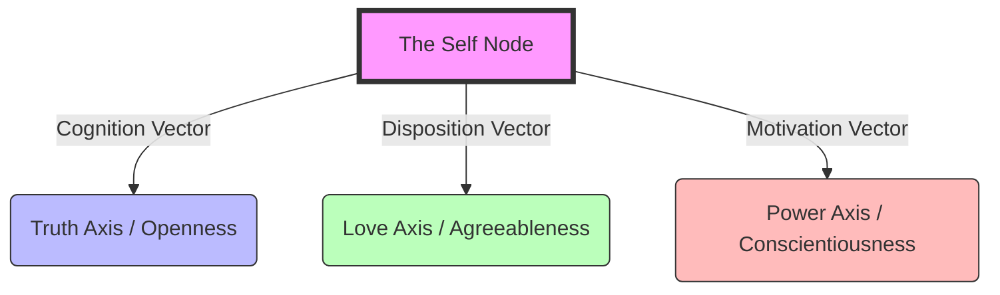
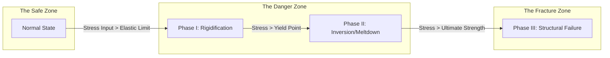

# The Unified Psychometric Field Theory 

## Volume 0: The Layman's Primer – A Guide to the Machine

**Author**: J. McKenney
**Version**: .8
**Date**: 2025-12-08
**Format**: Introduction & User Guide

---

# 1. Welcome to the Machine

You are about to enter a theoretical framework that combines **Psychoanalysis** (Freud/Lacan) with **Advanced Physics** (Thermodynamics/Quantum Mechanics) and **Artificial Intelligence** (Graph Neural Networks).

**Do not panic.**

The language is complex because the problem (Human Nature) is complex. But the core ideas are simple. This document is your "Rosetta Stone." It translates the high-level math into plain English concepts.

---

# 2. The Big Idea: "Social Physics"

Imagine if we could predict human behavior with the same accuracy that we predict the weather. We can't predict exactly where one raindrop will fall (Free Will), but we *can* predict the path of the storm (Social Dynamics).

The **Unified Psychometric Field Theory (UPFT)** treats humans not as "mystical spirits" but as **physical objects** subject to forces.

### Core Analogy 1: Gravity vs. Desire

* **Physics**: Gravity pulls objects together.
* **Psychology**: Desire pulls people together.
* **The Theory**: We model "Love" and "Obsession" as **Gravitational Fields**. If you are "attracted" to someone, it means you are caught in their gravity well. You have to burn energy (Willpower) to escape.

### Core Analogy 2: Heat vs. Anger

* **Physics**: Friction creates Heat. If a machine gets too hot, it breaks.
* **Psychology**: Conflict creates Emotional Heat. If a person gets too stressed, they snap.
* **The Theory**: We measure **"Social Temperature."** A calm office is "Cool." A riot is "Hot." We use thermodynamics to predict when the "Cool" crowd will turn into a "Hot" mob.

### Core Analogy 3: The Map vs. The Territory

* **Physics**: A map is a flat piece of paper. The earth is a curved sphere.
* **Psychology**: Your "Idea" of the world is flat. The "Real" world is curved.
* **The Theory**: We use **Geometry** to measure how much your personal bias "warps" your map. The more biased you are, the more curved your space is, and the harder it is for you to see the truth (which travels in a straight line).

---

# 3. Key Vocabulary (The Decoder Ring)

You will see these terms repeated throughout the 14 Volumes. Here is what they actually mean.

| Scary Term              | Plain English Translation                                                                                                   |
| :---------------------- | :-------------------------------------------------------------------------------------------------------------------------- |
| **The Real**      | **The Raw Truth.** The messy, painful reality that doesn't fit into your worldview (e.g., Death, Trauma).             |
| **The Symbolic**  | **The Story.** The words, laws, and titles we use to make sense of the Real. (e.g., "I am a CEO").                    |
| **The Imaginary** | **The Ego.** The image you see in the mirror. It brings you comfort but it's an illusion.                             |
| **Vector**        | **Direction.** You are moving somewhere. Are you moving towards Power ($\hat{k}$) or Love ($\hat{j}$)?            |
| **Tensor**        | **Internal Stress.** A Vector is an arrow. A Tensor is a twisted rubber band. It measures the tension *inside* you. |
| **Entropy**       | **Chaos.** Things naturally fall apart. You have to do Work to keep your room clean (or your company organized).      |
| **Graph**         | **Network.** A map of who knows whom. You are a "Node" (Dot). Your friendships are "Edges" (Lines).                   |
| **Bifurcation**   | **The Snap.** The exact moment a system breaks. The straw that breaks the camel's back.                               |

---

# 4. The Roadmap: How to Read the Corpus

The Theory is split into **14 Volumes**. You do not need to read them all. Choose your path.

### For the Curious Beginner (Start Here)

* **Volume 0 (This Document)**: The Introduction.
* **Volume XIV (Handbook)**: The Business Guide. How to run a company using these rules. **Read this if you are a CEO.**

### For the Psychologist (The Human Element)

* **Volume I (Foundations)**: What is Trauma? (Trauma = A Hole in the Map).
* **Volume VI (The Unconscious)**: How does the mind filter truth? (The "Gate" of the Mind).

### For the Physicist / Data Scientist (The Math)

* **Volume II (Kinematics)**: The Math of Stress (Tensors).
* **Volume III (Dynamics)**: The Math of Chaos (Oscillators).
* **Volume VII (Prediction)**: The Calculus of Future-Telling.
* **Appendix A (Math Codex)**: The cheat sheet for all the equations.

### For the AI Engineer (The Simulation)

* **Volume XII (Simulation)**: How to code a human personality.
* **Volume XIII (Digital Twin)**: How to build a simulation of a whole society.

---

# 5. Core Philosophy: Why do this?

We are not trying to reduce humans to robots.
We are trying to understand the **Physics of the Soul** so that we can stop crashing into each other.

* By understanding **Gravity** (Desire), we can build better relationships.
* By understanding **Heat** (Anger), we can prevent violence.
* By understanding **Entropy** (Chaos), we can build organizations that last.

Welcome to the Unified Field.

---

# 6. Visualizing the Theory

A picture is worth a thousand tensor equations. Below are the core topographic maps of the system.

### 6.1 The Vector Space (The Map)

This diagram shows how your personality is a single point in a 3D space defined by **Truth**, **Love**, and **Power**.

### 6.2 The Stress Cascade (The Process)

What happens when you get stressed? The system breaks in a predictable order.

---

# 7. Scaling the Engine: The Theory in Action

We don't just "talk" about this theory; we **run it** in a digital laboratory (Volume XV).
The Graph Neural Network (GNN) allows us to "zoom in" and "zoom out" of the social fractal. The physics works at every scale.

### Level 1: The Monad (The Individual)

* **The Problem**: "Why do I sabotage myself?"
* **The GNN Simulation**: **Harmonic Analysis**.
* **Persona: The Individual / Patient**.
  * **The Tech**: The Engine listens to your voice (or reads your journals) and performs a Fourier Transform on your semantics.
  * **The Insight**: It identifies your "Resonant Frequency." Are you vibrating with *Openness* ($f_O$) or *Neuroticism* ($f_N$)?
  * **The Fix**: We compose a "Counter-Melody" (Habit Structure) to cancel out the destructive waves.
* **Value**: **Mental Health precision engineering**.

### Level 2: The Dyad (The Pair)

* **The Problem**: "Will this Founder/Co-Founder partnership survive?"
* **The GNN Simulation**: **The M&A Algorithm**.
* **Persona: The Venture Capitalist**.
  * **The Tech**: We model the two founders as binary stars. We calculate the *Gravitational Bond Energy* vs. the *Centrifugal Force* of their egos.
  * **The Insight**: "Founder A is High Vision ($\hat{i}$), Founder B is High Order ($\hat{k}$). They have high binding energy ($E_b$). Prediction: Stable Orbit."
  * **The Failure Mode**: If both are High Vision and Low Order, they will spin out into the void (The "Idea" Trap).
* **Value**: **Risk-adjusted Investment**.

### Level 3: The Triad (The Squad) - "Moneyball Hiring"

* **The Problem**: "We need to innovate, but my team is too polite."
* **The GNN Simulation**: **Tensor Anisotropy Optimization**.
* **Persona: The Hiring Manager / HR**.
  * **The Tech**: We don't hire for "Culture Fit" (which breeds groupthink). We hire for **Tensor Balance**.
  * **The Insight**: "Your team is a perfect sphere (Isotropic). It rolls easily but has no traction. You need a 'Friction Agent'—someone High Neuroticism / High Disagreeableness—to create the spark."
  * **The Fix**: Determine the exact psychometric "Shape" needed to warp the team into a High-Performance Ellipsoid.
* **Value**: **High-Velocity Innovation Teams**.

### Level 4: The Organa (The Organization)

* **The Problem**: "My company is 500 people and nothing is getting done."
* **The GNN Simulation**: **Thermodynamic Regulation**.
* **Persona: The CEO**.
  * **The Tech**: We treat the company as a Heat Engine. We measure the **Social Temperature** ($T_{soc}$) and **Entropy Production** ($\dot{S}$).
  * **The Insight**: "Your temperature is too low ($T \to 0$). Bureaucracy has frozen the bonds. You need to inject Energy (a Crisis or a Moonshot) to melt the lattice and restore agility."
  * **The Prediction**: We simulate the "Re-Org" before you do it, predicting where the "Heat" (Resignations) will flare up.
* **Value**: **Change Management without the Chaos**.

### Level 5: The Population (The Market)

* **The Problem**: "Will this ad campaign go viral or get cancelled?"
* **The GNN Simulation**: **The Zeitgeist Sensor**.
* **Persona: The CMO / Marketer**.
  * **The Tech**: We model the entire target market as a **Scale-Free Network**. We identify the "Super-Hubs" (Influencers) and their "Susceptibility Thresholds" (Vol IV).
  * **The Insight**: "The market is currently in a 'Hysteric' Phase ($ Phase\ II $). They are reactive to 'Safety' signaling, not 'Aspiration' signaling. Pivot the message."
  * **The Fix**: Tune the "Semantic Payload" of the ad to resonate with the specific *Phase State* of the population's anxiety.
* **Value**: **Algorithmic Brand Resonance**.

---

For the full mathematical details of these simulations, including the PyTorch code for the GNNs, see **Volume XV: Advanced Simulations**.

---

# 8. The Friction of the Mind: Behavioral Economics & Applied Bias

*Reference: **Volume XVI: The Cognitive Bias Atlas** (Detailed catalog of 30+ Decision Nodes).*

In **Behavioral Economics** (Kahneman/Tversky), the mind has two modes:

* **System 1 (Fast)**: Automatic, Emotional, Biased. (The default for 95% of decisions).
* **System 2 (Slow)**: Logical, Calculating, Effortful. (Required for Engineering/Strategy).

**The Problem**: In business, we use System 1 to make System 2 decisions.
This creates **Cognitive Friction**—invisible drag on the organization's speed and IQ.

### 8.1 The "Dirty Dozen" (High-Impact Business Biases)

For Investors and Buyers, this friction manifests as "Slow Decisions," "Bad Bets," and "Security Holes."

| Bias Name                      | The Trap (System 1)          | The Business Cost                                                                 | The Mitigation (System 2)                                                  |
| :----------------------------- | :--------------------------- | :-------------------------------------------------------------------------------- | :------------------------------------------------------------------------- |
| **1. Sunk Cost Fallacy** | "We spent too much to quit." | **Zombie Projects**. Throwing good money after bad.                         | **Zero-Based Budgeting**. Rotate the Project Manager.                |
| **2. Groupthink**        | "I won't rock the boat."     | **Disaster**. The Board ignores a threat to maintain harmony (e.g., Enron). | **The Devil's Advocate**. Appoint a designated dissenter.            |
| **3. Normalcy Bias**     | "It hasn't happened yet."    | **Cyber Breach**. Refusing to patch because "we've never been hacked."      | **Black Swan Drills**. Simulate the crash.                           |
| **4. Confirmation Bias** | "I like him, so he's good."  | **Bad Due Diligence**. Investors ignore red flags in a founder.             | **Pre-Mortem**. "Assume this failed. Why?"                           |
| **5. Anchor Bias**       | "That price seems high."     | **Lost Negotiation**. The first number shouted sets the entire deal range.  | **Blind Valuation**. Value the asset *before* hearing the ask.     |
| **6. Authority Bias**    | "The Boss said so."          | **Silence**. Middle management hides critical warnings.                     | **Stop-Work Authority**. empower the janitor to pull the andon cord. |
| **7. Loss Aversion**     | "Losing\$1 hurts 2x more."   | **Stagnation**. Choosing "Safe Failure" over "Risky Success."               | **Reframe the Null**. "Doing nothing is the risky choice."           |
| **8. Halo Effect**       | "He looks confident."        | **Bad Hiring**. Hiring a narcissist instead of a builder.                   | **Blind Auditions**. Remove names/photos from resumes.               |
| **9. Present Bias**      | "I want the bonus now."      | **Tech Debt**. Sacrificing the future for Q3 numbers.                       | **Vesting Schedules**. Align rewards with long-term health.          |
| **10. Choice Paralysis** | "Too many options."          | **No Action**. The customer buys nothing because you offered 10 plans.      | **The Nudge**. Offer 3 choices. Highlight the "Best Value."          |

**The Bottom Line**:
Organizations don't die from lack of brains; they die from **Uncleared Caches** of System 1 thinking.
The **Psychohistory Engine** (Volume VII) is designed to be the "External System 2" for the organization—stripping the bias from the data before the decision is made.
