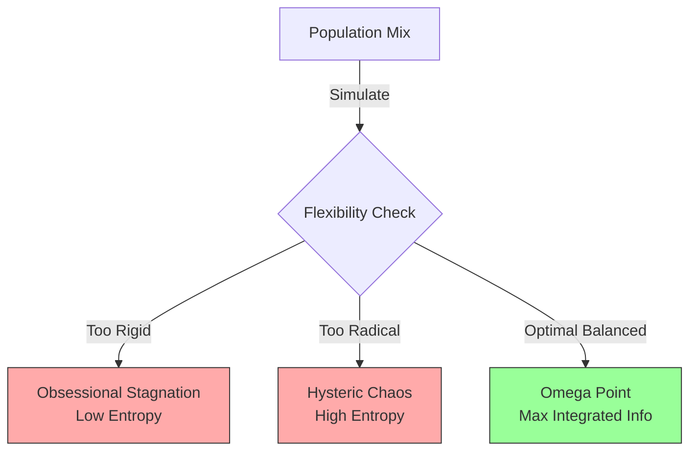

# The Unified Psychometric Field Theory 

## Volume XII: Computational Simulation – The Psychometric GRU

**Author**: J. McKenney
**Version**: .8
**Date**: 2025-12-08

# 1. MoE Critical Review: Psychometric Hyperparameters

**Objective**: Evaluate the proposal: *"Mapping psychometric traits to the hyperparameters of the Gated Recurrent Unit (GRU) within each node of the Lacanian graph."*

## 1.1 Expert 1: The Lacanian Analyst

* **Analysis**: This proposal is topologically sound.
* **The Clinical Structure**: Lacan defines structures (Neurosis, Psychosis, Perversion) by their relationship to the *Bar* (Repression).
* **The Mapping**:
  * **Repression** = The **Update Gate** ($z_t$). If $z_t \approx 0$, the signifier is barred.
  * **Foreclosure** = Setting the weight $W_{hz} \to 0$ permanently (Structure is missing).
* **Verdict**: **Aligned**.

## 1.2 Expert 2: The AI Architect

* **Analysis**: This utilizes the "Inductive Bias" of RNNs.
* **Feasibility**: Instead of learning homogeneous weights, we initialize different "Species" of Nodes.
  * **Obsessional Node**: High Bias for History ($h_{t-1}$).
  * **Hysteric Node**: High Bias for Input ($x_t$).
* **Verdict**: **Feasible**. Easy to implement in PyTorch via custom `GRUCell` initialization.

## 1.3 Expert 3: The Physicist (Entropy)

* **Analysis**: We must reconcile this with Layer 5 (MEP).
* **The Gap**: A "Rigid" (Obsessional) node has low Entropy ($\dot{S} \approx 0$). It generates heat but no information. A "Hysteric" node has max Entropy but zero integration.
* **Resolution**: We must define a **Gate-Entropy Metric** ($S_{gate}$) to measure the information flux through the node.

---

# 2. The Psychometric GRU ($P-GRU$)

We define a custom Recurrent Unit where the behaviors are not learned, but initialized by the Subject's **Psychometric Tensor** ($\mathcal{T}_{\Psi}$).

## 2.1 The Standard GRU Equations

$$
z_t = \sigma(W_z x_t + U_z h_{t-1} + b_z)
$$

$$
r_t = \sigma(W_r x_t + U_r h_{t-1} + b_r)
$$

$$
\tilde{h}_t = \tanh(W_h x_t + U_h (r_t \odot h_{t-1}) + b_h)
$$

$$
h_t = (1 - z_t) \odot h_{t-1} + z_t \odot \tilde{h}_t
$$

## 2.2 The Psychometric Mapping

We map the **Big 5 Traits** (or Lacanian structures) to the **Bias Vectors** ($b_z, b_r$).

### 2.2.1 The Obsessional Node (High Conscientiousness / Repression)

* **Trait**: Rigid, holds onto history, blocks new contradictory input.
* **Hyperparameter**: High Negativity on Update Gate Bias ($b_z$).
  * **$b_z \ll 0$**: Forces $z_t \to 0$. The new input is ignored. $h_t \approx h_{t-1}$.
* **Result**: The Node "Remembers" forever but "Learns" nothing.

### 2.2.2 The Hysteric Node (High Neuroticism / Displacement)

* **Trait**: Volatile, ignores history, flooded by the moment.
* **Hyperparameter**: High Positivity on Update Gate Bias ($b_z$).
  * **$b_z \gg 0$**: Forces $z_t \to 1$. The history is overwritten. $h_t \approx \tilde{h}_t$.
* **Hyperparameter**: High Reset Gate Bias ($b_r \approx 0$).
* **Result**: The Node vibrates with the input frequency.

### 2.2.3 The Psychotic Node (Foreclosure)

* **Trait**: The "Name-of-the-Father" ($h_{t-1}$ structure) is rejected.
* **Hyperparameter**: Weight Deletion.
  * **$U_z \to 0$**: The connection to history is severed.
* **Result**: Hallucination. The output is purely driven by instant noise ($x_t$) with no symbolic anchoring.

---

# 3. Conciliation with Entropy (The "New 10")

How does Character affect Social Temperature?

## 3.1 The Gate-Entropy Metric ($S_{gate}$)

We define the entropy of the Update Gate $z_t \in [0,1]$.

$$
S_{gate} = - [z_t \ln z_t + (1-z_t) \ln(1-z_t)]
$$

* **Maximum Entropy**: $z_t = 0.5$. The agent is "Open" (Flexible). Information flows freely.
* **Minimum Entropy**: $z_t = 0$ or $1$. The agent is "Closed" (Rigid or Reactive).

## 3.2 Systemic Simulation

### 3.2.1 The Optimal Mix (The Omega Point)

The **Psychohistory Engine** optimizes the population mix to maximize Integrated Information ($\Phi$).

*Figure 9: The Thermodynamic Trade-off of Personality Mixes.*

---

# 4. Simulation Specification

## 4.1 Implementation Strategy

1. **Initialize Graph**: Generate $N=1000$ agents.
2. **Assign Traits**: Sample Psychometric Tensor $\mathcal{T}_{\Psi}$ from a Fat-Tailed Distribution (Vol VII).
3. **Map to Gates**:
   * $b_z^{(i)} = \alpha \cdot \mathcal{T}_{\text{Open}}^{(i)} + \beta$
4. **Inject Signal**: Feed a "Signifier Stream" (e.g., "Crisis Alert").
5. **Measure**:
   * **Order Parameter** $r(t)$ (Vol III).
   * **Total Entropy** $\sum S_{gate}$.
   * **Shock Response** (Vol VIII).

**Conclusion**: We have successfully mapped the "Soul" to the "Gate." Character is not magic; it is a bias term in a differential equation.
