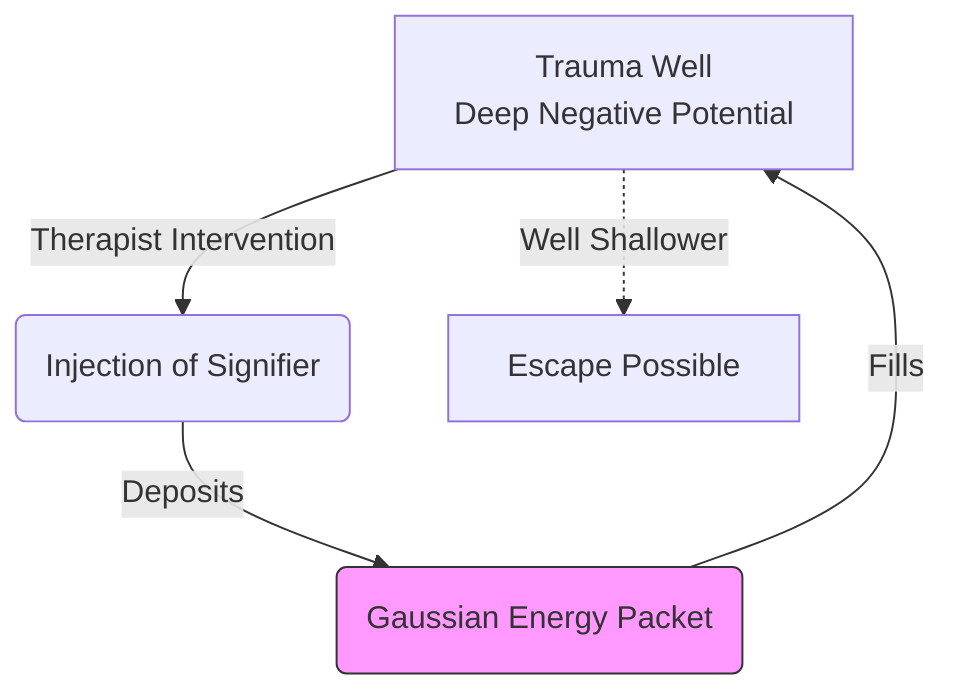

# The Unified Psychometric Field Theory 

## Volume XIV: Advanced Simulations & Case Studies – The Laboratory

**Author**: J. McKenney
**Version**: .8
**Date**: 2025-12-08

---

# 1. Introduction: The Simulatory Event

To "Understand" is to fail. To "Simulate" is to master.
This volume details five **Reference Cases** where the Psychohistory Engine is applied to rigorous real-world problems.

# 2. Case Study A: The Aggressive Sales Simulation

*Ref: "Sales Frameworks" / Lacanian Discourse Theory*

**Objective**: Model the conversion of a "Satisfied Prospect" (Stasis) into a "Closed Deal" (Kinetic Action).

## 2.1 The Physics of "SPIN" (Spin-Transfer Torque)

We model the Sales Interaction not as a conversation, but as a **Torque Transfer**.

* **The Prospect State ($\mathbf{S}_P$)**: Initally in a deep Potential Well of "Status Quo" ($U_0$).High Inertia ($\mathbf{D}$).
* **The Attack Vector (The Salesperson)**:
  1. **Implication Questions (Stress Injection)**: Injecting Entropy ($\Delta S$) to destabilize the Well.
  2. **Need-Payoff (The New Basin)**: Creating a new, lower-energy Attraction Basin (The Solution).

## 2.2 Mathematical Formula (The Conversion Probability)

$$
P(\text{Close}) \propto \exp\left( -\frac{\text{Activation Energy} - \text{Pain}}{\text{Trust}} \right)
$$

---

# 3. Case Study B: Neural Network Hiring (The Anisotropy Engine)

*Ref: "Neural Network Hiring" / Tensor Mechanics*

**Objective**: construct a team that maximizes Innovation without imploding from Chaos.

## 3.1 The Tensor Equation

We define the **Team Tensor** $\mathcal{T}_{team} = \sum \mathcal{T}_{member}$.

* **Startups**: Optimization Target is **Maximum Anisotropy** ($R_{ani} \to 1$).
* **Banks**: Optimization Target is **Isotropy** ($R_{ani} \to 0$).

---

# 4. Case Study C: Cybersecurity (The Insider Threat)

*Ref: "Biases & Security" / Fracture Mechanics*

**Objective**: Predict which employee will turn "rogue" (Insider Threat) before they act.

## 4.1 The Shear Stress Model

The rogue employee is not "Evil"; they are **Material that has Yielded**.

* **The Load**: Perceived Injustice (No promotion) + Financial Stress.
* **The Crack**: Cognitive Dissonance ("They owe me").

## 4.2 The "Grudge" Metric

$$
\varepsilon_p(t) = \int_{0}^{t} (\text{Resentment}(t) - \text{Recognition}(t)) dt
$$

* **Critical Threshold**: When $\varepsilon_p > \varepsilon_{crit}$, the Subject enters the **Plastic Regime**. They no longer follow rules (Elasticity is gone).

---

# 5. Case Study D: Psychotherapy (Metadynamics)

*Ref: "Trauma Decoding" / Energy Landscapes*

**Objective**: Map the "Trauma Knot" in the unconscious and dissolve it.

## 5.1 Topographic Mapping

The Mind is an Energy Landscape $V(s)$.

* **Trauma**: A deep, narrow potential well ($U_{trauma}$). The Subject falls in and cannot escape (The Loop).

## 5.2 The Metadynamics Algorithm (The Cure)

Therapy is the process of **potential flooding**.

* **Naming**: Every time the Analyst "Names" the Trauma ($S_1$), we deposit a Gaussian energy packet into the well.
  $$
  V_{new}(s) = V_{old}(s) + W \exp(...)
  $$

*Figure 11: Metadynamics Therapy.*

---

# 6. Case Study E: Musical Theory (Harmonic Resonance)

*Ref: "The Psychometric Clef" / Wave Physics*

**Objective**: Decode the "Truth" of an entity through its Resonant Frequency.

## 6.1 The Spectrogram of Character

Every Trait is a Frequency ($f$).

* **Openness**: High Frequency ($f_O \sim 10$ kHz). Shimmer/Detail.
* **Conscientiousness**: Low Frequency Rhythm ($f_C \sim 4$ Hz). The Beat.
* **Dissonance**: The interference pattern between Traits.
  * *Neurosis*: A "Beat Frequency" caused by two close, conflicting desires ($|f_1 - f_2|$).

---

# 7. Conclusion: The Simulation is the Toolkit

These five cases demonstrate that the **Unified Psychometric Field Theory** is not just philosophy; it is an engineering discipline. Whether selling software, hiring a team, preventing a hack, curing a patient, or composing a symphony, the math remains the same: **Manage the Stress, Shape the Geometry, and Respect the Singularity.**
