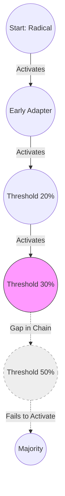

# The Unified Psychometric Field Theory 

## Volume IV: Network Physics – Connected Intelligence

**Author**: J. McKenney
**Version**: .8
**Date**: 2025-12-08

---

# 1. From Archetypes to Nodes

## 1.1 The Death of the "Hero"

In Network Physics, an individual is defined solely by their **Topological Position** in the graph $\mathcal{G}$.
Centrality is not Competence; it is position.

## 1.2 The Temporal Graph Network (TGN)

Static graphs ("Who reports to whom") are useless. We model the organization as a continuous stream of events:

$$
\mathcal{E} = \{ (u_i, u_j, t, \Delta \mathbf{S}) \}
$$

### 1.2.1 Memory Modules

Every node has a **Memory State** $h_i(t)$ that updates via a Recurrent Neural Network (GRU/LSTM):

$$
h_i(t) = \text{GRU}(\bar{m}_i(t), h_i(t^-))
$$

* **Psychometric Application**: This "Memory State" encodes the **History of Trust**.

---

# 2. Spectral Influence and Concept Modifiers

## 2.1 The Mathematics of Virality

How does an idea spread? It depends on the **Eigenvalues of the Graph Laplacian** ($\mathcal{L}$). [See Appendix A: Math Codex]

$$
\frac{dx}{dt} = - \beta \mathcal{L} x
$$

* **Spectral Radius ($\rho$)**: If $\rho(\text{Adjacency}) > \frac{\gamma}{\beta}$ (Epidemic Threshold), the idea goes viral.
* **The Fiedler Vector**: The eigenvector corresponding to the second smallest eigenvalue ($\lambda_2$). It partitions the graph. To split a group, you attack the Fiedler vector's node cuts.

## 2.2 Concept Modifiers ("Semantic Physics")

The signal transmitted is not just a weight $w_{ij}$. It is a semantic object modified by the edge.

$$
\text{Signal}_{out} = f(\mathbf{M}_{ij} \otimes \text{Signal}_{in})
$$

Where $\mathbf{M}_{ij}$ is a **Concept Modifier Tensor**:

* **Amplifier ("Very")**: Scales the magnitude of the signal vector.
* **Inverter ("Not")**: Rotates the signal vector by $\pi$ (Negation).
* **Attenuator ("Slightly")**: Damps the magnitude (Apathy).

### 2.2.1 Application: The "Fake News" Filter

To stop a viral lie, we do not need to delete the content. We inject **Inverter Edges** into the graph.

* *Strategy*: Identify the Hubs ($C_E$) and surround them with "Sceptic Nodes" (Attenuators). The viral energy dissipates into heat.

---

# 3. Granovetter Dynamics (Cascades)

## 3.1 The Threshold Model of Riots

Mark Granovetter (1978) showed that collective behavior is driven by **Threshold Distributions**. [See Appendix A: Math Codex]

* **Radiacals ($\tau=0$)**: Ignite the chain.
* **Conservatives ($\tau=1$)**: Only join if *everyone* joins.

### 3.1.1 Visualization of Threshold Cascades

*Figure 4: A Cascade Failure due to a Threshold Gap.*

## 3.2 The Cascade Equation

A "Viral Cascade" occurs when the distribution allows a chain reaction.

* **Condition for Criticality**: If there is a "gap" in the chain (e.g., no one with Threshold 20%), the cascade stops.
* **Adversarial Injection**: To kill a movement, **remove the bridge nodes** (Threshold 20-30%) that connect the Radicals to the Majority.

---

# 4. Link Prediction and Hiring

## 4.1 Hiring is Link Prediction

We redefine Hiring as **Predicting a Link** in a TGN.

$$
P(\text{Success}) = P(\text{Link}(u_{new}, u_{team}) \text{ persists for } t > T)
$$

## 4.2 Homophily vs. Heterophily

* **Homophily**: Stability.
* **Heterophily**: Innovation.
* **Optimization**: Maximize Heterophily subject to the **Linearity Horizon**. (Hire the most different person who *won't* break the team).

---

**Summary of Volume IV (v9.8)**:
We have integrated **Spectral Graph Theory** and **Cascades**.

* **Virality**: Defined by the Spectral Radius of $\mathcal{L}$.
* **Semantics**: Defined by **Concept Modifier Matrices**.
* **Cascades**: Defined by Granovetter Threshold topology.
  We are now ready for **Volume V** (Synthesis), where we model the Thermodynamics of this system using **Maximum Entropy Production**.
