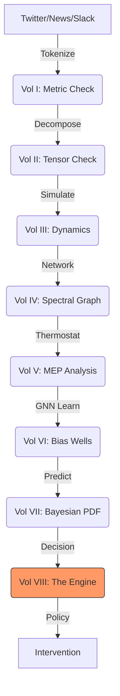

# The Unified Psychometric Field Theory 

## Volume VIII: The Psychohistory Engine – The Foundation Architecture

**Author**: J. McKenney
**Version**: .8
**Date**: 2025-12-08

---

# 1. The 8-Layer Synthesis (Physics Expanded)

We have constructed a vertical stack of social physics, moving from the Topological Monad to the Predictive Engine.

| Layer          | Component             | Mathematical Object                 | Physics / Mech                                  |
| :------------- | :-------------------- | :---------------------------------- | :---------------------------------------------- |
| **I**    | **Monad**       | Manifold$\mathcal{M}$             | Fechnerian Metric$g_{ij}$                     |
| **II**   | **Tensor**      | Rank-3 Tensor$\mathcal{T}_{\Psi}$ | Anisotropy$R_{ani}$                           |
| **III**  | **Dynamic**     | Quantum Oscillator$\Psi_t$        | Interaction Hamiltonian$H_I$                  |
| **IV**   | **Network**     | Spectral Graph$\mathcal{L}$       | Spectral Radius$\rho$                         |
| **V**    | **Thermo**      | Entropy Flux$\dot{S}$             | Max Entropy Production (MEP)                    |
| **VI**   | **Unconscious** | GNN with Metadynamics               | Potential Well$U_0$                           |
| **VII**  | **Bayesian**    | Prediction Integral                 | Sequential Monte Carlo                          |
| **VIII** | **Engine**      | **The Foundation**            | **Shock Response $\text{Re}(\lambda)$** |

## 1.1 The System Pipeline

*Figure 8: The Full Psychohistory Stack.*

---

# 2. The Psychometric Reynolds Number ($Re_{\Psi}$)

## 2.1 Definition

$$
Re_{\Psi} = \frac{\rho v L}{\mu}
$$

* **$\rho$ (Density)**: Population Density * Connectivity ($N \cdot k$).
* **$v$ (Velocity)**: Information Velocity ($T_{soc}$).
* **$L$ (Characteristic Length)**: Scale of the Master Signifier.
* **$\mu$ (Viscosity)**: Dispositional Stability (Social Damping).

## 2.2 The Critical Reynolds Number ($Re_{crit}$)

* **Laminar Flow**: Society is predictable. Linear Vectors apply.
* **Turbulent Flow**: Society is chaotic. Eddies, Vortices, and Phase Transitions dominate.

---

# 3. Shock Response and Resilience

Following the critique of the MoE Review, we formalize "Resilience."

## 3.1 Eigenvalue Analysis of the Jacobian

We analyze the stability of the equilibrium point $x^*$ by computing the eigenvalues $\lambda$ of the Jacobian Matrix $J$. [See Appendix A: Math Codex]

$$
\frac{dx}{dt} = \mathbf{J} (x - x^*)
$$

## 3.2 Classification of Social Response

We look at the Real Part of the eigenvalue $\sigma = \text{Re}(\lambda)$.

1. **Stable ($\sigma < 0$)**: The system recovers from the shock.
   * **Overdamped ($\text{Im}(\lambda) = 0$)**: Smooth recovery. The "Ideal Society."
   * **Underdamped ($\text{Im}(\lambda) \neq 0$)**: Oscillatory recovery. Waves of unrest ("Aftershocks") ripple through the TGN before fading.
2. **Unstable ($\sigma > 0$)**: The perturbation grows exponentially. **Revolution**.

## 3.3 Adaptive Social Protection (ASP)

The Engine recommends policies that increase the magnitude of negative $\sigma$ (Damping).

* **Strategy**: If $\sigma$ approaches 0 (Critical Slowing Down), inject "Viscosity" ($\mu$) into the network (e.g., slowing the news cycle, introducing calming Signifiers).

---

# 4. The Ethical Constitution (Hard Constraints)

## 4.1 The Anti-Tyranny Loss Function

The model's Objective Function $\mathcal{J}$ is modified:

$$
\mathcal{J} = \text{Maximize}(\Phi) - \lambda \cdot \text{Penalty}(Re_{sup})
$$

* **$Re_{sup}$ (Suppression Reynolds)**: Measures artificially suppressed $T_{soc}$ (Censorship).
* **Goal**: Maximize Integrated Information ($\Phi$), not just Stability.

**END OF THE UNIFIED THEORY (v9.8)**
