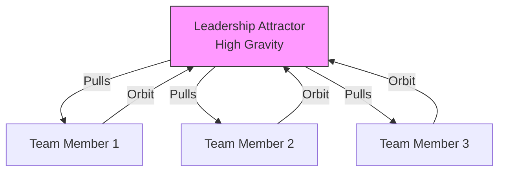

# The Unified Psychometric Field Theory 

## Volume XIII: Organizational Physics – The Handbook for Leaders

**Author**: J. McKenney
**Version**: .8
**Date**: 2025-12-08

# 1. Introduction: From Management to Mechanics

Traditional management literature treats organizations as "families" or "machines." This is a category error. An organization is a **Complex Adaptive System** governed by the laws of statistical physics.

**The Organizational Physics Proposition**:

* **Culture** is Thermodynamics ($T_{soc}$, Entropy).
* **Leadership** is Network Topology (Hub Centrality).
* **Performance** is Flow Dynamics (Reynolds Number).
* **Crisis** is Bifurcation Theory (Phase Transitions).

This handbook translates the rigorous mathematics of the Psychohistory Engine (Vol I-XIII) into actionable strategies for the C-Suite.

---

# 2. Leadership Physics: The Center of Mass

## 2.1 The Myth of the Org Chart

The "Org Chart" is a lie. It describes the *de jure* power. Real power follows the **Scale-Free Network** topology ($P(k) \sim k^{-\gamma}$).

* **The Hub ($S_1$)**: The person everyone turns to for truth. This is the **Master Signifier**.
* **Centrality Metric**: A leader's power is not their title; it is their **Eigenvector Centrality**.
  * *Advice*: If you fire the Hub, the network fragments into disconnected islands ($\beta_0 > 1$). You destroy the company's brain.

## 2.2 The Gravitational Mandate

A leader must act as the **Strange Attractor** described in Chaos Theory.

* **Function**: To bind the vectors of the team into a coherent orbit.
* **Mechanism**:
  1. **Mass (Competence)**: You must have enough $D$ (Dispositional weight) to hold the orbit.
  2. **Gravity (Vision)**: You must warp the metric space ($g_{ij}$) so that "Working Hard" feels like "Downhill" (Least Action Principle).

*Figure 10: The Leader as a Strange Attractor.*

---

# 3. Team Dynamics: Tensor Engineering

## 3.1 The Anisotropy Problem (Diversity)

Most hiring seeks "Culture Fit" (Isotropy). This is a mistake.

* **Isotropic Teams**: Everyone thinks alike. Tensor is spherical ($\lambda_1 \approx \lambda_2 \approx \lambda_3$).
  * *Result*: Zero internal friction, but **Total Blindness** to orthogonal threats.
* **Anisotropic Teams**: High variance in traits.
  * *Result*: High internal friction (Heat), but **Total Spherical Coverage**.
* **Strategy**: Hire for **Maximum Heterophily** subject to the **Linearity Horizon** (Don't hire someone who breaks the team).

## 3.2 Flow States (Super-Fluidity)

A "High Performance Team" is a **Super-Fluid** (Zero Viscosity).

* **The Condition**: $\text{Reynolds Number } Re_{\Psi} < Re_{crit}$.
* **How to achieve**:
  1. **Role Alignment**: Put the $High-\hat{i}$ (Innovator) in R&D. Put the $High-\hat{k}$ (Executer) in Ops.
  2. **Laminar Communication**: Remove "Eddies" (Gossip/Politicking). Gossip creates turbulence that dissipates energy as heat (Drama) instead of work.

---

# 4. Culture Design: Thermodynamic Regulation

## 4.1 Social Temperature ($T_{soc}$)

Culture is defined by the **Information Velocity**.

* **High Temp ($High-T$)**: Startup Mode. High chaos, high innovation, high burnout. Bonds break easily ($k_B T > E_{bond}$).
* **Low Temp ($Low-T$)**: Corporate Mode. Rigid structures, slow decisions, high stability. Bonds are frozen.
* **The Leader's Knob**: Your job is to regulate $T$.
  * *Crisis?* Lower $T$ (Structure, Routine).
  * *Stagnation?* Raise $T$ (Shake-up, Hackathon).

## 4.2 Entropy Management

The Second Law of Thermodynamics applies: **Organizational Entropy ($\Delta S$) always increases.**

* **The Cost of Order**: To maintain a "clean" culture, you must pump energy ($Work$) into the system to export entropy (fire bad actors, fix bad code).
* **Entropy Debt**: If you stop doing maintenance, entropy accumulates. Eventually, the system hits the **Critical Point** and collapses.

---

# 5. Crisis Management: Bifurcation Analysis

## 5.1 The Seldon Crisis (Hopf Bifurcation)

Organizations don't decline linearly; they collapse discontinuously.

* **The Signal**: Watch for **Critical Slowing Down**.
  * *Variance Spikes*: Are KPIs fluctuating wildly?
  * *Autocorrelation*: Is the bad mood lingering longer than usual?
* **The Pivot**: When you hit a Saddle Point (Bifurcation), you must jump to a new Equilibrium (New Business Model).
* **The Error**: Trying to "Linear Extrapolate" the old model. This leads to the cliff.

## 5.2 The "Psychological Safety" Equation

Safety is not "being nice." Safety is **Resilience** ($\text{Re}(\lambda) < 0$).

* **Mechanism**: A Resilient team is Overdamped. When a shock hits (Client fires us), they oscillate once ("Ouch") and act. They do not resonate into a Panic Loop.

---

# 6. Conclusion: The CEO as Physicist

The modern organization is too complex for "Soft Skills" alone. The leader must be an Engineer of Human Dynamics.

* **Measure** the Vectors (Psychometrics).
* **Balance** the Tensors (Team Composition).
* **Regulate** the Temperature (Culture).
* **Respect** the Physics.

**"We do not determine the outcome; we determine the geometry in which the outcome becomes inevitable."**
