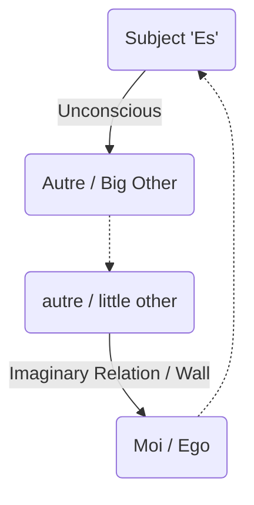

# Mathemes and Topology

> [!IMPORTANT]
> Lacan used "mathemes"—formalizations using small letters and symbols—to transmit psychoanalysis without the "leakage" of meaning found in speech.

## 1. Schema L (The Dialectic of the Subject)
Schema L describes the relationship between the Subject ($S$) and the Other ($A$).

*   **The Axis $a - a'$ (Imaginary):** This is the ego's relationship to the counterpart (the little other). It is the wall of language, misunderstanding, and "empty speech."
*   **The Axis $S - A$ (Symbolic):** The true axis of the subject. The subject ($S$) receives their message from the Big Other ($A$) in an inverted form.
*   **Goal of Analysis:** To cross the imaginary axis ($a-a'$) and attain "Full Speech" on the symbolic axis ($S-A$).

## 2. The Formula of Fantasy
$$ \$ \diamond a $$
*   **$** (Barred Subject): The split subject, emptied of being by language.
*   **$\diamond$** (Lozenge): Represents "desire for," "conjunction," and "disjunction." It is a cut.
*   **$a$** (Object *a*): The object cause of desire.
*   **Meaning:** The subject maintains themselves in reality by fixating on a specific object ($a$) that screens the horror of the Real.

## 3. The Formulas of Sexuation
These formulas (Seminar XX) describe the two structural positions of being-sexed (Masculine and Feminine), regardless of biology.

### Masculine Structure ("Tout" / Whole)
1.  **$\exists x \overline{\Phi x}$**: There exists an x that is NOT subject to the phallic function. (The Primal Father/Exception).
2.  **$\forall x \Phi x$**: Therefore, ALL x are subject to the phallic function. (Universality of men).

### Feminine Structure ("Pas-tout" / Not-Whole)
1.  **$\overline{\exists x} \overline{\Phi x}$**: There does NOT exist an x that is not subject to the phallic function. (No exception).
2.  **$\overline{\forall x} \Phi x$**: Not-All x are subject to the phallic function. (There is something in her that escapes the phallus).

## 4. The Graph of Desire (Simplified Levels)
A topological map of how desire is constructed in relation to the signifier.

### Level 1: The Elementary Cell
*   **Button Tie (Point de Capiton):** where the signifier stops the sliding of meaning.
*   A retro-active loop: The end of the sentence determines the meaning of the beginning.

### Level 2: The Complete Graph
Includes the upper level of **Jouissance** and **Drive**.
*   **Che Vuoi?**: "What do you want?" The question the subject asks the Other.
*   **$S(\cancel{A})$**: The signifier of the lack in the Other. The realization that the Other does not have the answer.

## 5. The Four Discourses
Mathematical structures of social bonds. Each has four positions:
*   **Agent:** Top Left
*   **Other:** Top Right
*   **Truth:** Bottom Left (Hidden)
*   **Production:** Bottom Right (Loss/Gain)

### Roles:
*   $S_1$: Master Signifier
*   $S_2$: Knowledge
*   $: Barred Subject
*   $a$: Surplus Enjoyment

#### Discourse of the Master
Governing.
Agent: $S_1$ --> Other: $S_2$
Truth: $   // Production: $a$

#### Discourse of the University
Educating.
Agent: $S_2$ --> Other: $a$
Truth: $S_1$ // Production: $

#### Discourse of the Hysteric
Challenging.
Agent: $ --> Other: $S_1$
Truth: $a$ // Production: $S_2$

#### Discourse of the Analyst
Subverting.
Agent: $a$ --> Other: $
Truth: $S_2$ // Production: $S_1$
