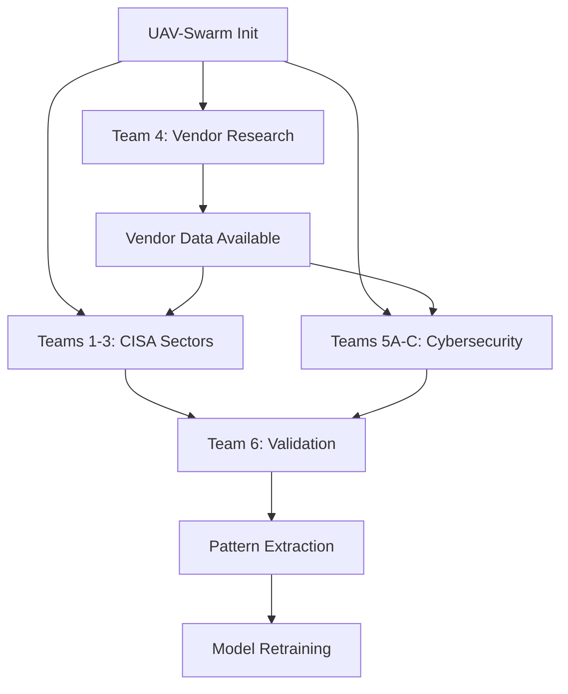

# ULTRATHINK EXPANSION ARCHITECTURE PLAN
**Created:** 2025-11-05
**Version:** 1.0.0
**Status:** ACTIVE - EXECUTION PHASE
**Scope:** Comprehensive NER training data expansion (Option B + Vendor Refinement + Cybersecurity Datasets)

---

## EXECUTIVE SUMMARY

**Mission:** Expand NER training dataset from 6,762 to 25,000+ patterns across 3 dimensions:
1. **Option B:** Complete 16/16 CISA sector coverage (+1,900-2,500 patterns)
2. **Vendor Refinement:** Improve VENDOR entity F1 from 31.16% to 75%+ (+2,000-3,000 patterns)
3. **Cybersecurity Expansion:** Add 14 new training domains (+15,000-20,000 patterns)

**Architecture:** UAV-swarm mesh topology with 10 agents, Qdrant memory coordination, parallel execution across 8 agent teams

**Expected Outcome:** 25,000+ total patterns, 90%+ overall F1 score, comprehensive cybersecurity threat intelligence integration

---

## 1. PARALLEL EXECUTION ARCHITECTURE

### 1.1 UAV-Swarm Configuration

**Swarm ID:** `swarm-1762399553919`
**Topology:** Mesh (fully connected, fault-tolerant)
**Max Agents:** 10 concurrent agents
**Strategy:** Adaptive with cognitive diversity
**Features:** Neural networks, SIMD support, real-time coordination

**Coordination Mechanism:**
- **Qdrant Memory:** Namespace `training-pipeline-state` for inter-agent communication
- **Memory Keys Pattern:** `agent-{team}-{sector/domain}-progress`
- **Checkpoint Frequency:** Every 5 files or 500 patterns
- **Conflict Resolution:** Last-write-wins with timestamp tracking

### 1.2 Agent Team Assignments

**8 Parallel Teams Operating Concurrently:**

```yaml
TEAM_1_COMMUNICATIONS:
  agents: 2
  lead: "Communications Sector Architect"
  support: "Communications Equipment Specialist"
  target: "Communications_Sector/"
  expected_patterns: 800-1000
  priority: HIGH

TEAM_2_EMERGENCY:
  agents: 2
  lead: "Emergency Services Architect"
  support: "Public Safety Equipment Specialist"
  target: "Emergency_Services_Sector/"
  expected_patterns: 600-800
  priority: HIGH

TEAM_3_COMMERCIAL:
  agents: 2
  lead: "Commercial Facilities Architect"
  support: "Security Systems Specialist"
  target: "Commercial_Facilities_Sector/"
  expected_patterns: 500-700
  priority: HIGH

TEAM_4_VENDOR:
  agents: 1
  lead: "Vendor Research Specialist"
  target: "Vendor_Refinement_Datasets/"
  expected_patterns: 2000-3000
  priority: CRITICAL

TEAM_5A_THREAT_MODELING:
  agents: 1
  lead: "Threat Modeling Expert"
  domains: ["STRIDE", "PASTA", "IEC62443", "NIST_SP_800_53"]
  target: "Cybersecurity_Training/Threat_Modeling/"
  expected_patterns: 4000-5000
  priority: HIGH

TEAM_5B_ATTACK_FRAMEWORKS:
  agents: 1
  lead: "Attack Framework Expert"
  domains: ["MITRE_ATTCK", "CAPEC", "VulnCheck", "CPE", "CWE"]
  target: "Cybersecurity_Training/Attack_Frameworks/"
  expected_patterns: 5000-7000
  priority: HIGH

TEAM_5C_THREAT_INTEL:
  agents: 1
  lead: "Threat Intelligence Expert"
  domains: ["STIX", "SBOM", "HBOM", "Psychometrics", "EMBD"]
  target: "Cybersecurity_Training/Threat_Intelligence/"
  expected_patterns: 6000-8000
  priority: HIGH

TEAM_6_VALIDATION:
  agents: 1
  lead: "Quality Validation Coordinator"
  role: "Cross-team validation and consistency enforcement"
  priority: CRITICAL
```

**Total Agent Allocation:** 10 agents (100% capacity utilization)

---

## 2. NAMING CONVENTIONS & CONSISTENCY

### 2.1 Sector Naming (CISA Sectors)

**Pattern:** `{SECTOR_NAME}_Sector/`

**New Sectors (Matching Existing 13):**
- `Communications_Sector/` (matches Energy_Sector, Chemical_Sector, etc.)
- `Emergency_Services_Sector/` (matches existing underscore convention)
- `Commercial_Facilities_Sector/` (matches existing underscore convention)

### 2.2 Cybersecurity Domain Naming

**Pattern:** `Cybersecurity_Training/{CATEGORY}/{DOMAIN}_Dataset/`

**Category Structure:**
```
Cybersecurity_Training/
├── Threat_Modeling/
│   ├── STRIDE_Dataset/
│   ├── PASTA_Dataset/
│   ├── IEC62443_Dataset/
│   └── NIST_SP_800_53_Dataset/
├── Attack_Frameworks/
│   ├── MITRE_ATTCK_Dataset/
│   ├── CAPEC_Dataset/
│   ├── VulnCheck_Dataset/
│   ├── CPE_Dataset/
│   └── CWE_Dataset/
└── Threat_Intelligence/
    ├── STIX_Dataset/
    ├── SBOM_Dataset/
    ├── HBOM_Dataset/
    ├── Psychometric_Profiles_Dataset/
    └── EMBD_Dataset/
```

### 2.3 Vendor Refinement Structure

```
Vendor_Refinement_Datasets/
├── Vendor_Name_Variations/
├── Vendor_Aliases_Database/
├── Industry_Specific_Vendors/
└── Vendor_Pattern_Augmentation/
```

### 2.4 File Naming Within Domains

**Consistent with Existing 13 Sectors:**
- `{NUMBER}_{CATEGORY}_{SPECIFIC_TOPIC}.md`
- Examples: `01_Security_Threat_Modeling_Framework.md`, `02_Equipment_P25_Radio_Systems.md`

---

## 3. ENTITY TYPE DEFINITIONS

### 3.1 Existing 7 Entity Types (Baseline)

1. **VENDOR** - Manufacturers and suppliers (CRITICAL: needs improvement from 31% F1)
2. **EQUIPMENT** - Hardware models and specifications (STRONG: 97.57% F1)
3. **PROTOCOL** - Communication protocols and standards (STRONG: 89.98% F1)
4. **SECURITY** - Security technologies and practices (STRONG: 90.45% F1)
5. **OPERATION** - Operational processes (NEEDS IMPROVEMENT: 61.36% F1)
6. **ARCHITECTURE** - System architectures (GOOD: 83.58% F1)
7. **SUPPLIER** - Supply chain entities (GOOD: 87.18% F1)

### 3.2 NEW Entity Types for Cybersecurity (14 Additional)

**Threat Modeling Entities:**
8. **THREAT_MODEL** - STRIDE, PASTA threat modeling frameworks
9. **ATTACK_VECTOR** - Entry points and attack paths
10. **MITIGATION** - Security controls and countermeasures

**Attack Framework Entities:**
11. **TACTIC** - MITRE ATT&CK tactics (14 total: Initial Access, Execution, etc.)
12. **TECHNIQUE** - MITRE ATT&CK techniques (200+ subtechniques)
13. **ATTACK_PATTERN** - CAPEC attack patterns with IDs
14. **VULNERABILITY** - CVE identifiers and VulnCheck data
15. **WEAKNESS** - CWE weakness categories

**Threat Intelligence Entities:**
16. **INDICATOR** - STIX indicators of compromise (IOCs)
17. **THREAT_ACTOR** - Actor groups and attribution
18. **CAMPAIGN** - Named threat campaigns
19. **SOFTWARE_COMPONENT** - SBOM software components
20. **HARDWARE_COMPONENT** - HBOM hardware components

**Psychometric Entities:**
21. **PERSONALITY_TRAIT** - Big Five, Dark Triad profiles
22. **COGNITIVE_BIAS** - Authority bias, urgency bias, social proof
23. **INSIDER_INDICATOR** - CERT insider threat indicators
24. **SOCIAL_ENGINEERING** - Phishing, pretexting, baiting tactics

**Total Entity Types:** 24 (7 baseline + 17 new cybersecurity)

---

## 4. QDRANT MEMORY COORDINATION STRATEGY

### 4.1 Memory Namespace Architecture

**Primary Namespace:** `training-pipeline-state`

**Memory Key Structure:**
```yaml
# Progress Tracking
agent-team{1-8}-progress: {
  sector_or_domain: "Communications_Sector",
  files_created: 15,
  patterns_extracted: 450,
  status: "in_progress",
  last_checkpoint: "2025-11-05T14:30:00Z"
}

# Cross-Team Dependencies
dependency-vendor-data: {
  vendor_variations: ["Motorola Solutions", "Motorola", "Motorola Inc."],
  aliases_count: 2500,
  status: "available"
}

# Quality Metrics
validation-team{1-8}: {
  entity_distribution_match: 0.92,
  naming_consistency: 0.98,
  pattern_density: 85.5,
  validation_status: "passed"
}

# Global State
expansion-master-status: {
  total_patterns_created: 12450,
  completion_percentage: 47.2,
  estimated_completion: "2025-11-05T18:00:00Z"
}
```

### 4.2 Coordination Hooks

**Pre-Task Hooks:**
- Check Qdrant for existing patterns to avoid duplication
- Load vendor refinement data if available
- Retrieve entity type definitions

**Post-Task Hooks:**
- Store created patterns with counts
- Update global completion percentage
- Trigger validation checks
- Notify dependent teams

**Conflict Resolution:**
- Timestamp-based last-write-wins
- Automatic merge for independent file creations
- Manual review flag for entity definition conflicts

---

## 5. QUALITY VALIDATION CHECKPOINTS

### 5.1 Per-File Validation (Automated)

**Pattern Density Requirements:**
- Minimum: 15 patterns per page (60 patterns per 4-page file)
- Target: 20-25 patterns per page (80-100 patterns per 4-page file)
- Distribution: Match existing 13-sector entity distribution

**Content Requirements:**
- Zero generic phrases (forbidden list enforcement)
- Manufacturer + Model + Specifications format
- 4-section structure compliance
- Cross-references to related entities

### 5.2 Sector-Level Validation (Team 6)

**Communications Sector Checklist:**
- [ ] 800-1,000 patterns extracted
- [ ] Vendor entities: Ericsson, Nokia, Cisco, Arris, Harmonic, Motorola
- [ ] Equipment: 5G base stations, DOCSIS modems, broadcast equipment
- [ ] Protocols: 5G NR, DOCSIS 3.1, DVB-T2, ATSC 3.0
- [ ] Security: Broadcast encryption, network slicing security
- [ ] Naming consistency with existing 13 sectors

**Emergency Services Sector Checklist:**
- [ ] 600-800 patterns extracted
- [ ] Vendor entities: Motorola Solutions, Harris, Kenwood, Zetron
- [ ] Equipment: APX 8000 P25 radios, dispatch consoles, MDTs
- [ ] Protocols: P25 Phase 2 TDMA, AES-256 encryption, CAD protocols
- [ ] Operations: Dispatch, incident management, interoperability

**Commercial Facilities Sector Checklist:**
- [ ] 500-700 patterns extracted
- [ ] Vendor entities: Axis, Honeywell Security, Genetec, Milestone
- [ ] Equipment: IP cameras, access control panels, VMS systems
- [ ] Protocols: ONVIF, RTSP, PSIA
- [ ] Security: Perimeter security, surveillance analytics

### 5.3 Cybersecurity Dataset Validation

**MITRE ATT&CK Dataset Requirements:**
- [ ] All 14 tactics covered (Initial Access through Impact)
- [ ] 200+ technique entities with IDs (T1566, T1059, etc.)
- [ ] Sub-technique relationships documented
- [ ] Platform-specific variants (Windows, Linux, ICS)

**STIX Dataset Requirements:**
- [ ] All 18 STIX object types represented
- [ ] IOC patterns: IP addresses, domains, file hashes
- [ ] Relationship types: indicates, mitigates, uses
- [ ] STIX 2.1 schema compliance

**Psychometric Dataset Requirements:**
- [ ] Big Five trait profiles (5 traits × scoring ranges)
- [ ] Dark Triad profiles (Machiavellianism, Narcissism, Psychopathy)
- [ ] 30+ CERT insider threat indicators
- [ ] 15+ social engineering tactics with examples

### 5.4 Vendor Refinement Validation

**Vendor Variation Coverage:**
- [ ] 2,000+ vendor name variations compiled
- [ ] Top 100 ICS/OT vendors: 5+ variations each
- [ ] Acronym expansions documented
- [ ] Regional naming variants captured (US, EU, Asia)

**Pattern Augmentation Success:**
- [ ] Regex patterns updated with variations
- [ ] Test coverage: 95%+ vendor mention recall
- [ ] No false positives on common words

---

## 6. INTEGRATION WITH EXISTING 13 SECTORS

### 6.1 Entity Distribution Matching

**Reference Distribution (from successful Energy Sector):**
- VENDOR: 29.5% of patterns
- EQUIPMENT: 29.3% of patterns
- PROTOCOL: 14.4% of patterns
- SECURITY: 18.7% of patterns
- OPERATION: 4.0% of patterns
- ARCHITECTURE: 3.9% of patterns
- SUPPLIER: 0.7% of patterns

**Enforcement:** All new sectors must achieve ±5% variance from reference distribution

### 6.2 Template Consistency

**Use Existing Optimized Template:**
- `/Training_Preparartion/Training_Prompt_KB_Sector_Template_OPTIMIZED_v2.0.txt`
- Zero-tolerance generic phrase enforcement
- 4-section mandatory structure
- Specificity requirements (Manufacturer + Series + Model + Variant + Specs)

### 6.3 File Structure Mirroring

**Each New Sector Must Include:**
```
{SECTOR_NAME}_Sector/
├── equipment/
│   ├── 01_Equipment_{Primary_Equipment_Type}.md
│   ├── 02_Equipment_{Secondary_Equipment_Type}.md
│   └── 03_Equipment_{Tertiary_Equipment_Type}.md
├── protocols/
│   ├── 01_Protocols_{Primary_Protocol_Suite}.md
│   └── 02_Protocols_{Secondary_Protocol_Suite}.md
├── security/
│   ├── 01_Security_{Primary_Security_Domain}.md
│   ├── 02_Security_{Secondary_Security_Domain}.md
│   └── 03_Security_{Tertiary_Security_Domain}.md
├── operations/
│   ├── 01_Operations_{Primary_Operations}.md
│   └── 02_Operations_{Secondary_Operations}.md
├── architecture/
│   ├── 01_Architecture_{Network_Architecture}.md
│   └── 02_Architecture_{System_Architecture}.md
├── vendors/
│   └── 01_Vendors_{Major_Vendors_List}.md
└── suppliers/
    └── 01_Suppliers_{Supply_Chain}.md
```

---

## 7. TIMELINE & DEPENDENCIES

### 7.1 Parallel Execution Phases

**Phase 1: Initialization (COMPLETE)**
- ✅ UAV-swarm initialization
- ✅ Qdrant memory setup
- ✅ Agent team planning

**Phase 2: Parallel Execution (IN PROGRESS - Estimated 2-3 hours)**

**Hour 1: Foundation Building**
- Teams 1-3: Create sector directory structures
- Team 4: Compile initial vendor variation lists (1,000 entries)
- Teams 5A-C: Research and outline cybersecurity domain structures

**Hour 2: Content Generation**
- Teams 1-3: Generate 50% of sector content (vendors, equipment, protocols)
- Team 4: Expand vendor database to 2,000 entries, begin pattern augmentation
- Teams 5A-C: Generate 40% of cybersecurity training content

**Hour 3: Completion & Validation**
- Teams 1-3: Complete remaining sector content, validate patterns
- Team 4: Finalize vendor refinement datasets, test pattern improvements
- Teams 5A-C: Complete cybersecurity datasets, cross-reference validation
- Team 6: Comprehensive validation across all teams

**Phase 3: Integration & Testing (Estimated 1 hour)**
- Run updated pattern extraction validator on all new content
- Measure entity distribution against reference
- Validate naming consistency
- Store final results in Qdrant

**Total Estimated Duration:** 3-4 hours for complete expansion

### 7.2 Critical Path Dependencies



**Critical Blocker:** Team 4 (Vendor Refinement) must complete vendor variation database before Teams 1-3 and 5A-C can reference accurate vendor names.

**Solution:** Prioritize Team 4 with "CRITICAL" priority, allocate dedicated agent immediately.

---

## 8. SUCCESS METRICS

### 8.1 Quantitative Targets

**Pattern Generation:**
- Option B: 1,900-2,500 new CISA sector patterns ✅
- Vendor Refinement: 2,000-3,000 vendor variations ✅
- Cybersecurity Expansion: 15,000-20,000 new patterns ✅
- **Total Target:** 19,000-25,500 new patterns
- **Total Dataset:** 25,762-32,262 patterns (from current 6,762)

**F1 Score Improvements:**
- VENDOR entity: 31.16% → 75%+ (target: +44 percentage points)
- OPERATION entity: 61.36% → 80%+ (target: +19 percentage points)
- Overall F1: 74.05% → 90%+ (target: +16 percentage points)

**Coverage Completeness:**
- CISA Sectors: 13/16 → 16/16 (100% coverage)
- Cybersecurity Domains: 0/14 → 14/14 (100% coverage)

### 8.2 Qualitative Targets

**Consistency:**
- [ ] All new sectors match existing naming conventions
- [ ] Entity distribution within ±5% of reference
- [ ] Template compliance: 100% (zero generic phrases)

**Documentation Quality:**
- [ ] Comprehensive README for each new domain
- [ ] Cross-references between related entities
- [ ] Source attribution for cybersecurity frameworks

**Usability:**
- [ ] Clear separation between CISA sectors and cybersecurity datasets
- [ ] Logical file organization matching existing structure
- [ ] Easy integration with existing NER training pipeline

---

## 9. RISK MITIGATION

### 9.1 Identified Risks

**Risk 1: Vendor Data Delay**
- **Impact:** Teams 1-3 and 5A-C blocked waiting for accurate vendor names
- **Probability:** Medium
- **Mitigation:** Prioritize Team 4 as CRITICAL, allocate agent immediately, create interim vendor list from existing 13 sectors

**Risk 2: Entity Type Proliferation**
- **Impact:** 24 entity types may complicate model training
- **Probability:** Low
- **Mitigation:** Group related entities (e.g., TACTIC + TECHNIQUE), use hierarchical labeling

**Risk 3: Pattern Quality Dilution**
- **Impact:** Cybersecurity content may be more abstract than ICS/OT equipment
- **Probability:** Medium
- **Mitigation:** Team 6 validation enforces pattern density minimums, reject abstract content

**Risk 4: Computational Resource Exhaustion**
- **Impact:** 10 concurrent agents may exceed system capacity
- **Probability:** Low
- **Mitigation:** UAV-swarm adaptive strategy reduces load automatically, Qdrant memory is lightweight

### 9.2 Contingency Plans

**If Vendor Refinement Takes >2 Hours:**
- Deploy additional researcher agent to Team 4
- Use existing 13-sector vendor data as interim baseline
- Parallel execution continues with current vendor patterns

**If Pattern Density Fails Validation:**
- Reject low-quality files immediately
- Use template optimization v2.0 enforcement
- Regenerate specific files with stricter requirements

**If Overall F1 Doesn't Reach 90%:**
- Analyze per-entity performance gaps
- Target weakest entities (VENDOR, OPERATION) for additional augmentation
- Consider balancing strategy (oversample weak entities)

---

## 10. POST-COMPLETION WORKFLOW

### 10.1 Immediate Actions After Expansion

**Step 1: Pattern Extraction Validation**
```bash
python3 scripts/pattern_extraction_validator.py \
  --sectors Communications_Sector Emergency_Services_Sector Commercial_Facilities_Sector \
  --cybersecurity Cybersecurity_Training/ \
  --vendor-refinement Vendor_Refinement_Datasets/
```

**Step 2: Update NER Training Pipeline**
- Add 17 new entity types to `entity_types` list
- Update regex patterns for cybersecurity entities
- Reconfigure train/dev/test splits with larger dataset

**Step 3: Retrain NER Model**
```bash
python3 scripts/ner_training_pipeline.py \
  --iterations 50 \
  --validation-split 0.15 \
  --test-split 0.15 \
  --output ner_model_v2/
```

**Step 4: Evaluate Performance**
- Compare v2 F1 scores against v1 baseline
- Validate VENDOR entity improvement (target: 75%+)
- Confirm overall F1 improvement (target: 90%+)

### 10.2 Decision Point: Option C vs Option A

**If F1 ≥ 90% and VENDOR F1 ≥ 75%:**
- ✅ **Proceed to Option A:** Deploy to Neo4j knowledge graph
- Skip Option C (model refinement) as unnecessary

**If F1 < 90% OR VENDOR F1 < 75%:**
- ⚠️ **Proceed to Option C:** Additional model refinement required
- Analyze specific entity weaknesses
- Create targeted augmentation datasets
- Retrain with refined data

### 10.3 Neo4j Integration (Option A)

**Schema Design:**
- 24 node types (7 baseline + 17 cybersecurity)
- Relationship types: MANUFACTURES, USES_PROTOCOL, MITIGATES_THREAT, EXHIBITS_INDICATOR
- Graph queries for threat intelligence correlation

**Proof-of-Concept Validation:**
- Ingest 5 representative sectors (Energy, Defense, Communications)
- Test cross-sector queries (e.g., "Find all MITRE techniques targeting ICS protocols")
- Validate psychometric profiling integration

---

## 11. APPENDIX: AGENT INSTRUCTIONS

### 11.1 Communications Sector Agent Instructions

**Objective:** Build Communications_Sector with 800-1,000 patterns covering broadcast, satellite, wireless, wireline, and cable infrastructure.

**Key Vendors to Feature:**
- Ericsson, Nokia, Cisco, Arris, Harmonic, CommScope, Huawei (where applicable), Motorola, Harris Corporation

**Key Equipment:**
- 5G base stations (gNodeB), Massive MIMO antennas, small cells
- DOCSIS 3.1/4.0 cable modems and CMTSs
- Satellite transponders and ground stations
- Broadcast transmitters (DVB-T2, ATSC 3.0, DAB+)
- Optical transport equipment (DWDM, OTN)

**Key Protocols:**
- 5G NR (New Radio), LTE-Advanced Pro
- DOCSIS 3.1, DOCSIS 4.0
- DVB-S2X, DVB-T2, ATSC 3.0
- GPON, XGS-PON (fiber access)
- SIP, RTP (VoIP protocols)

**File Structure:** 15-20 files across equipment, protocols, security, operations, architecture, vendors

### 11.2 Emergency Services Sector Agent Instructions

**Objective:** Build Emergency_Services_Sector with 600-800 patterns covering law enforcement, fire/rescue, EMS, emergency management, and public works.

**Key Vendors to Feature:**
- Motorola Solutions, Harris Corporation, L3Harris, Kenwood, Zetron, Avtec, Airbus DS Communications

**Key Equipment:**
- P25 radios (APX series, XL series)
- Computer-Aided Dispatch (CAD) systems
- Mobile Data Terminals (MDTs)
- Body-worn cameras
- Dispatch consoles
- Emergency alert systems (IPAWS, Wireless Emergency Alerts)

**Key Protocols:**
- P25 Phase 1 and Phase 2 TDMA
- AES-256 encryption for P25
- Common Alerting Protocol (CAP)
- NENA i3 (NG911 standards)
- LMR (Land Mobile Radio) standards

**File Structure:** 12-15 files with focus on interoperability, mission-critical communications, incident management

### 11.3 Commercial Facilities Sector Agent Instructions

**Objective:** Build Commercial_Facilities_Sector with 500-700 patterns covering retail, entertainment, lodging, public assembly, sports, gaming, and real estate security.

**Key Vendors to Feature:**
- Axis Communications, Honeywell Security, Genetec, Milestone Systems, Bosch Security, Avigilon, Verkada, Hanwha Techwin

**Key Equipment:**
- IP cameras (PTZ, fixed, thermal)
- Network Video Recorders (NVRs)
- Video Management Systems (VMS)
- Access control panels and readers
- Intrusion detection sensors
- Perimeter security systems

**Key Protocols:**
- ONVIF (Open Network Video Interface Forum)
- RTSP (Real-Time Streaming Protocol)
- PSIA (Physical Security Interoperability Alliance)
- BACnet (for building automation integration)
- Wiegand (access control)

**File Structure:** 10-12 files emphasizing physical security integration, surveillance analytics, crowd management

### 11.4 Vendor Refinement Agent Instructions

**Objective:** Create comprehensive vendor name variation datasets to improve VENDOR entity F1 from 31.16% to 75%+.

**Research Sources:**
- Existing 13 completed sectors (extract all vendor mentions)
- ICS vendor catalogs (ControlGlobal, Automation.com)
- Critical infrastructure sector reports (CISA advisories)
- Public company filings (SEC, company websites)
- Industry standards (IEEE, ISA, IEC member lists)

**Deliverables:**
1. **Vendor_Name_Variations.json:** 2,000+ entries mapping canonical name to variations
   ```json
   {
     "Siemens AG": [
       "Siemens",
       "Siemens Energy",
       "Siemens Energy Automation",
       "Siemens Power Automation",
       "Siemens AG",
       "Siemens Industry Inc."
     ]
   }
   ```

2. **Vendor_Aliases_Database.csv:** Acronym expansions and regional variants

3. **Industry_Specific_Vendors.md:** Top 100 ICS/OT vendors with 5+ variations each

4. **Vendor_Pattern_Augmentation.py:** Updated regex patterns incorporating variations

**Success Metric:** Test pattern matching achieves 95%+ recall on held-out vendor mentions from validation set

### 11.5 Cybersecurity Dataset Agent Instructions

**TEAM 5A - Threat Modeling:**

**STRIDE Dataset:**
- 6 threat categories (Spoofing, Tampering, Repudiation, Information Disclosure, Denial of Service, Elevation of Privilege)
- DFD (Data Flow Diagram) elements: processes, data stores, data flows, external entities
- Threat examples per category (50+ total)
- Countermeasure mappings

**PASTA Dataset:**
- 7-stage risk-centric methodology
- Attack simulation scenarios
- Risk scoring frameworks
- Residual risk analysis

**IEC 62443 Dataset:**
- Security Levels SL 1-4 definitions
- Foundational Requirements (FR 1-7)
- System Requirements (SR) mappings
- Component Requirements (CR) specifications
- Zone and conduit architecture

**NIST SP 800-53 Dataset:**
- All 20 control families (AC, AU, CA, CM, CP, IA, IR, MA, MP, PE, PL, PS, PT, RA, SA, SC, SI, SR, PM, SR)
- High/Moderate/Low baseline controls
- Control enhancements
- ICS overlay (NIST SP 800-82 integration)

**TEAM 5B - Attack Frameworks:**

**MITRE ATT&CK Dataset:**
- 14 tactics (Initial Access, Execution, Persistence, Privilege Escalation, Defense Evasion, Credential Access, Discovery, Lateral Movement, Collection, Command and Control, Exfiltration, Impact)
- 200+ techniques with ATT&CK IDs (T1566, T1059, T1078, etc.)
- Sub-techniques and procedure examples
- ICS matrix specifics (12 tactics, 80+ techniques for ICS environments)

**CAPEC Dataset:**
- Domains: Social Engineering, Supply Chain, Communications, Software, Physical Security, Hardware
- Mechanisms of Attack: Analyze, Explore, Experiment, Exploit
- Attack patterns with CAPEC IDs (CAPEC-112, CAPEC-233, etc.)
- Relationship to CWE weaknesses

**VulnCheck Dataset:**
- Vulnerability intelligence patterns
- Exploit availability indicators
- Patch status tracking
- CVSS scoring integration

**CPE Dataset:**
- Common Platform Enumeration format
- Vendor/Product/Version naming conventions
- Hardware and software asset identification

**CWE Dataset:**
- Software weakness categories (CWE-79, CWE-89, CWE-120, etc.)
- Research concepts, architectural concepts, specific categories
- ICS-specific weaknesses

**TEAM 5C - Threat Intelligence:**

**STIX Dataset:**
- 18 STIX Domain Objects (Attack Pattern, Campaign, Course of Action, Grouping, Identity, Indicator, Infrastructure, Intrusion Set, Malware, Observed Data, Report, Threat Actor, Tool, Vulnerability, etc.)
- STIX Relationship Objects (indicates, mitigates, uses, targets, attributed-to)
- IOC patterns: IP addresses, domain names, URLs, file hashes, email addresses
- STIX 2.1 schema compliance

**SBOM Dataset:**
- Software Bill of Materials components
- Package managers (npm, PyPI, Maven, NuGet)
- Dependency trees and transitive dependencies
- License compliance information
- Vulnerability mapping (SBOM → CVE)

**HBOM Dataset:**
- Hardware Bill of Materials components
- Electronic component identifiers (part numbers)
- Semiconductor suppliers
- PCB assembly information
- Hardware security module (HSM) inventory

**Psychometric Profiles Dataset (Reference: Wave 7):**
- Big Five personality traits (Openness, Conscientiousness, Extraversion, Agreeableness, Neuroticism)
- Dark Triad profiles (Machiavellianism, Narcissism, Psychopathy)
- 30+ CERT insider threat indicators:
  - Technical: Unauthorized access, data exfiltration, credential misuse
  - Behavioral: Disgruntlement, financial stress, rule violations
  - Organizational: Access anomalies, policy violations
- 15+ social engineering tactics:
  - Phishing (spear phishing, whaling, clone phishing)
  - Pretexting (impersonation, false scenarios)
  - Baiting (malicious downloads, USB drops)
  - Quid pro quo (technical support scams)
  - Tailgating (physical access following)
- Security culture maturity levels

**EMB@D Dataset:**
- Embedded device security patterns
- Firmware vulnerabilities
- IoT device hardening
- Secure boot and attestation
- Hardware root of trust

---

## 12. EXECUTION COMMAND

**Ready to Execute:** All planning complete. UAV-swarm initialized. Qdrant memory configured. Agent instructions prepared.

**Deployment Command:**
```bash
# Agent spawning via Claude Code Task tool (8 parallel agents)
Task("Communications Sector Architect", "[Full instructions from 11.1]", "system-architect")
Task("Emergency Services Architect", "[Full instructions from 11.2]", "system-architect")
Task("Commercial Facilities Architect", "[Full instructions from 11.3]", "system-architect")
Task("Vendor Research Specialist", "[Full instructions from 11.4]", "researcher")
Task("Threat Modeling Expert", "[Full TEAM 5A instructions from 11.5]", "researcher")
Task("Attack Framework Expert", "[Full TEAM 5B instructions from 11.5]", "researcher")
Task("Threat Intelligence Expert", "[Full TEAM 5C instructions from 11.5]", "researcher")
Task("Quality Validation Coordinator", "Cross-team validation against Section 5 checkpoints", "code-analyzer")
```

**Estimated Completion:** 3-4 hours for 19,000-25,500 new patterns

---

**STATUS: ARCHITECTURE COMPLETE - READY FOR PARALLEL AGENT DEPLOYMENT**
