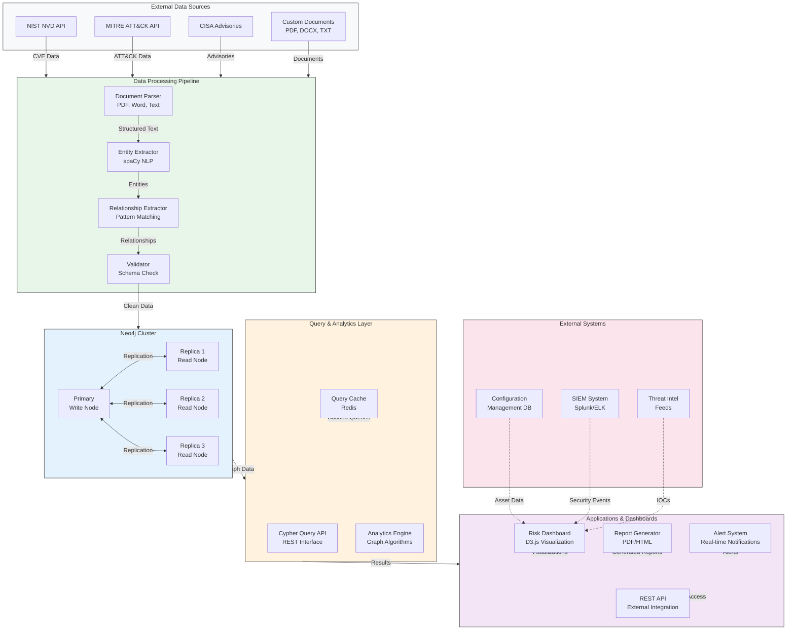
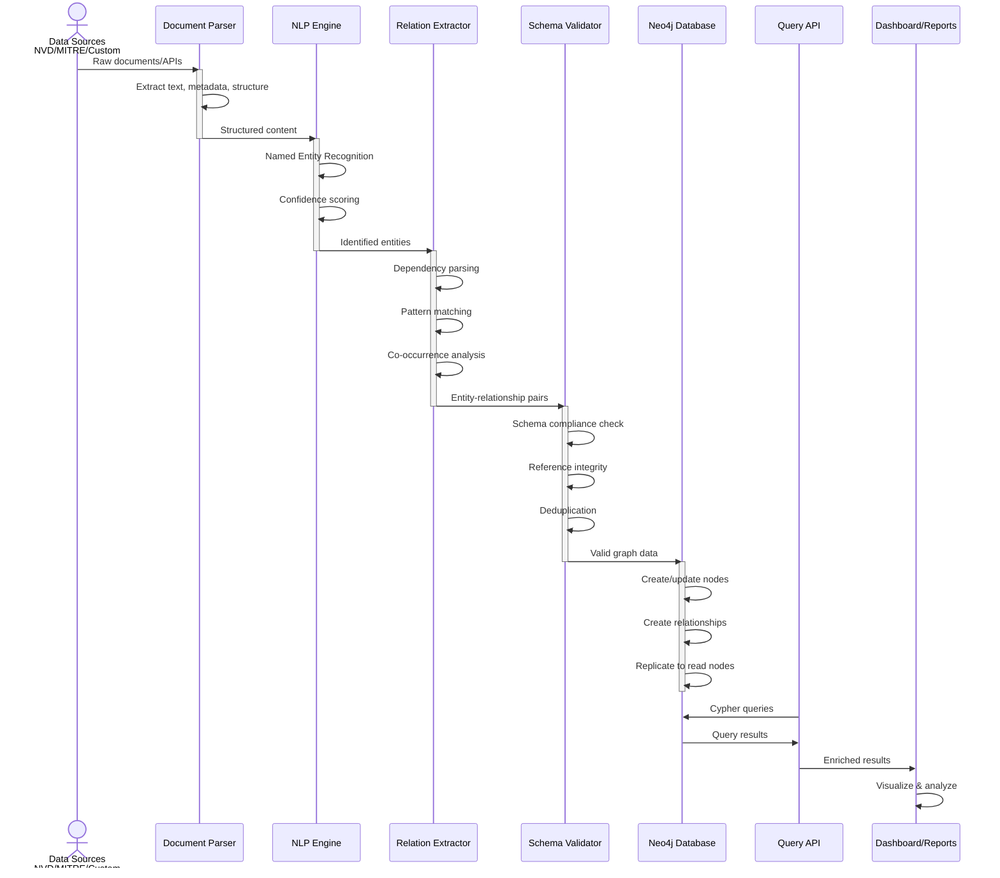
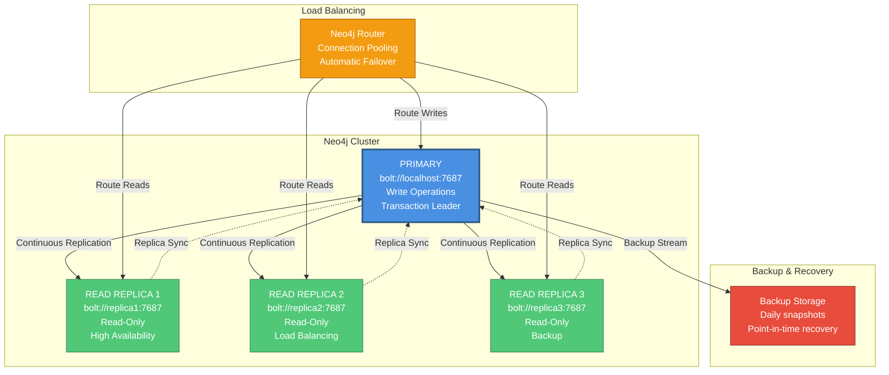
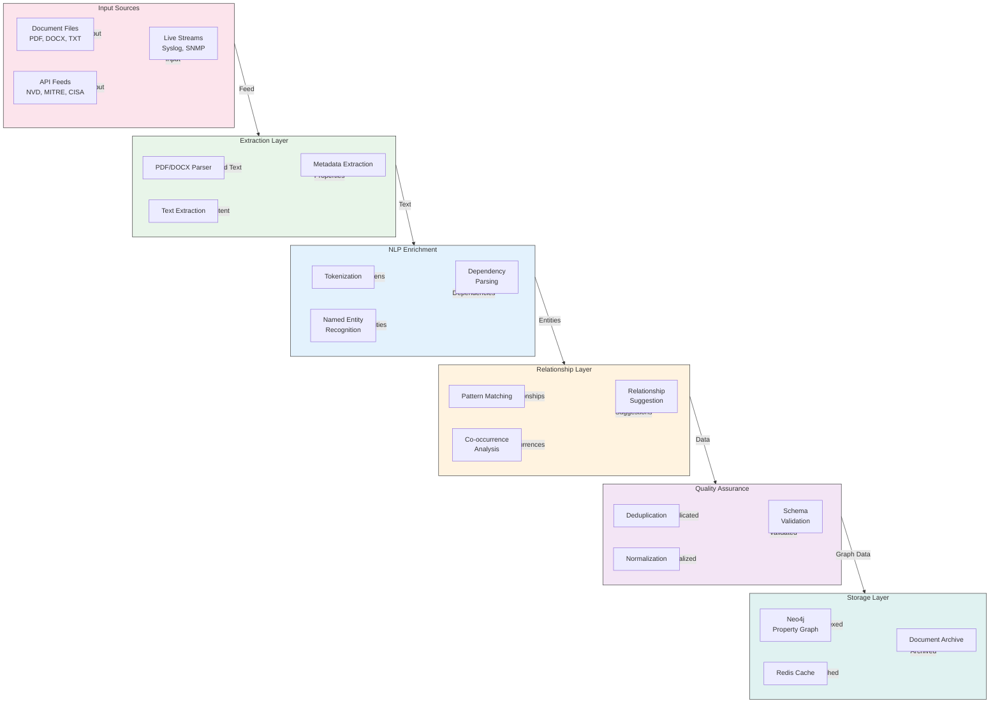
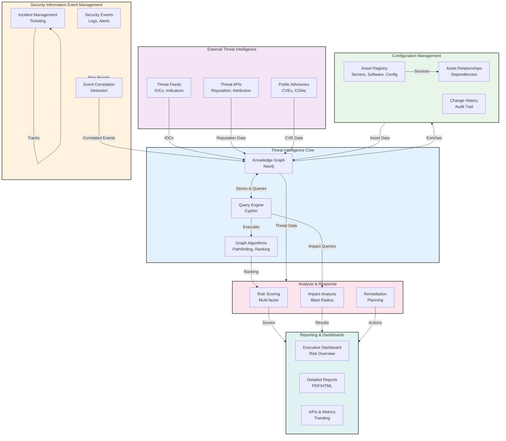
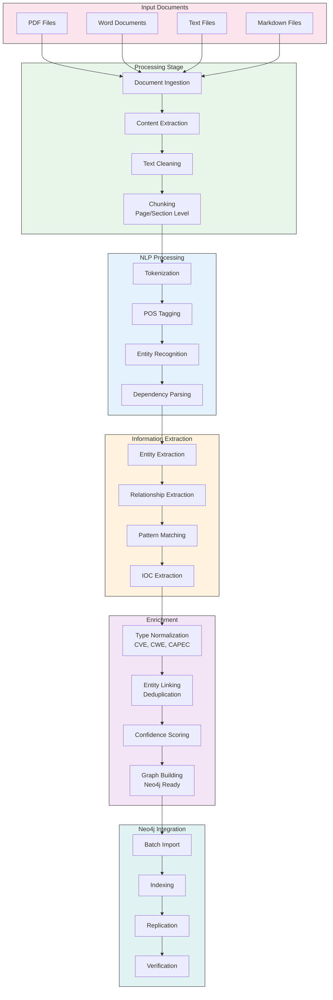

# System Architecture Overview

**Created:** 2025-10-29
**Purpose:** Comprehensive architecture documentation for AEON DT CyberSec Threat Intelligence system

## 1. System Architecture Diagram



## 2. Data Flow Architecture



## 3. Neo4j Cluster Architecture



## 4. Data Processing Pipeline



## 5. Integration Architecture



## 6. Deployment Architecture

```mermaid
graph TB
    subgraph K8s["Kubernetes Cluster"]
        subgraph NS1["threat-intelligence namespace"]
            Neo4jPod["Neo4j Primary Pod<br/>4 CPU, 8GB RAM<br/>100GB Storage"]
            ReplicaPods["Replica Pods x3<br/>2 CPU, 4GB RAM each<br/>50GB Storage each"]
            ParserPod["Parser Pod<br/>2 CPU, 4GB RAM<br/>10GB Temp"]
            NLPPod["NLP Pod<br/>4 CPU, 8GB RAM<br/>20GB Models"]
            APIPod["API Pod<br/>2 CPU, 2GB RAM<br/>Auto-scaled 1-3"]
        end

        subgraph NS2["monitoring namespace"]
            Prometheus["Prometheus<br/>Metrics Collection"]
            Grafana["Grafana<br/>Visualization"]
            ELK["ELK Stack<br/>Logging"]
        end

        subgraph Ingress["Ingress & Load Balancing"]
            LB["Load Balancer<br/>Layer 4 TCP"]
            Ingress["Nginx Ingress<br/>Layer 7 HTTP"]
        end
    end

    subgraph Storage["Persistent Storage"]
        PVC1["PVC: Neo4j Data<br/>100GB SSD"]
        PVC2["PVC: Archives<br/>500GB HDD"]
        PVC3["PVC: Backups<br/>1TB Archive"]
    end

    subgraph Cache["Caching Layer"]
        Redis["Redis Cache<br/>32GB<br/>Query Results"]
    end

    %% Pod connections
    Neo4jPod -->|Replicate| ReplicaPods
    ParserPod -->|Process| NLPPod
    NLPPod -->|Push Data| Neo4jPod
    APIPod -->|Query| Neo4jPod
    APIPod -->|Cache| Redis

    %% Storage
    Neo4jPod -->|Mount| PVC1
    NLPPod -->|Write| PVC2
    Neo4jPod -->|Backup| PVC3

    %% Monitoring
    Neo4jPod -->|Metrics| Prometheus
    ReplicaPods -->|Metrics| Prometheus
    APIPod -->|Metrics| Prometheus
    Prometheus -->|Dashboard| Grafana

    %% Logging
    Neo4jPod -->|Logs| ELK
    APIPod -->|Logs| ELK
    ParserPod -->|Logs| ELK

    %% Ingress
    LB -->|External| Ingress
    Ingress -->|Route| APIPod
    Ingress -->|Route| Grafana

    style K8s fill:#F5F5F5,stroke:#333,stroke-width:2px
    style NS1 fill:#E3F2FD,stroke:#333
    style NS2 fill:#E8F5E9,stroke:#333
    style Ingress fill:#FFF3E0,stroke:#333
    style Storage fill:#FCE4EC,stroke:#333
    style Cache fill:#E0F2F1,stroke:#333
```

## 7. Document Processing Workflow



## Key Architectural Principles

### 1. **Scalability**
- Horizontal scaling via Neo4j cluster read replicas
- Kubernetes auto-scaling for processing pods
- Redis caching for query optimization

### 2. **Reliability**
- Multi-node Neo4j cluster with automatic failover
- Point-in-time backup and recovery
- Health checks and monitoring

### 3. **Performance**
- Document chunking for context preservation
- Batch processing with parallel workers
- Query result caching with TTL

### 4. **Data Quality**
- Schema validation at ingestion
- Deduplication and normalization
- Confidence scoring for extracted entities

### 5. **Integration**
- RESTful API for external access
- CMDB integration for asset data
- SIEM integration for security events
- External threat feed integration

### 6. **Monitoring & Observability**
- Prometheus metrics collection
- Grafana visualization dashboards
- ELK stack for centralized logging
- Performance tracking and alerting

## Infrastructure Requirements

| Component | Resources | Storage | Network |
|-----------|-----------|---------|---------|
| Neo4j Primary | 4 CPU, 8GB RAM | 100GB SSD | Private |
| Read Replicas (x3) | 2 CPU, 4GB RAM | 50GB SSD | Private |
| Processing Pods | 2-4 CPU, 4-8GB RAM | 10-50GB Temp | Private |
| API Servers | 2 CPU, 2GB RAM | - | Public |
| Redis Cache | - | 32GB RAM | Private |
| Monitoring | 2 CPU, 4GB RAM | 50GB | Private |
| Backups | - | 1TB Archive | Offline |

## Security Considerations

1. **Network Isolation**: Neo4j cluster on private subnet
2. **Authentication**: Neo4j user/password authentication
3. **Encryption**: TLS for all external connections
4. **Access Control**: RBAC for Neo4j and Kubernetes
5. **Audit Logging**: All database operations logged
6. **Data Backup**: Encrypted backups with offsite replication
