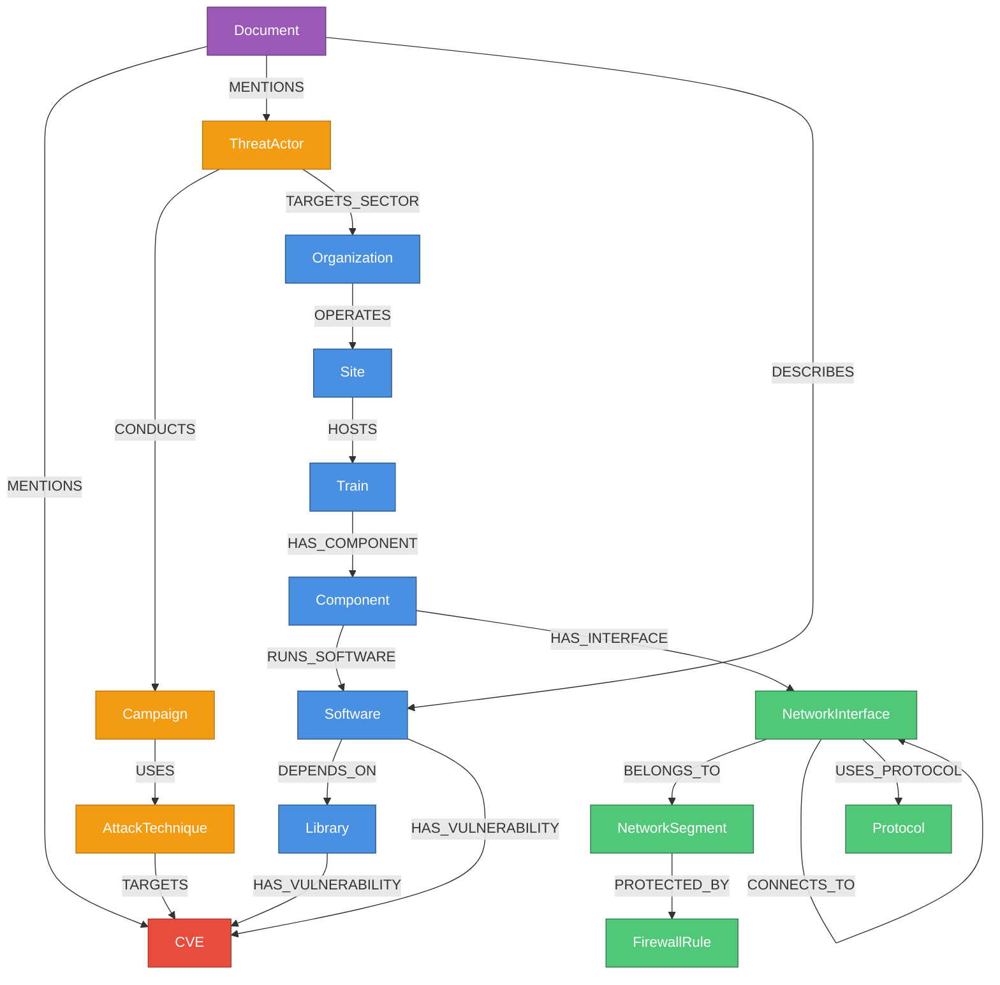

# Schema Documentation - AEON Digital Twin Graph Database

**Document Version:** 2.0.0
**Date:** 2025-10-29
**Status:** ACTIVE
**Schema Version:** 2.0.0
**Database:** Neo4j 5.14 Enterprise

---

## Table of Contents

1. [Schema Overview](#1-schema-overview)
2. [Complete Node Types Catalog](#2-complete-node-types-catalog)
3. [Complete Relationship Types Catalog](#3-complete-relationship-types-catalog)
4. [Visual Schema Diagrams](#4-visual-schema-diagrams)
5. [Schema Evolution](#5-schema-evolution)
6. [Performance Considerations](#6-performance-considerations)
7. [References](#7-references)

---

## 1. Schema Overview

### 1.1 Design Philosophy

The AEON Digital Twin employs a **hierarchical property graph model** optimized for cybersecurity threat intelligence in railway operations. The schema is designed around these core principles:

1. **Graph-Native Relationships:** Natural modeling of asset hierarchies, network topologies, and threat correlation chains
2. **Query Performance:** Sub-second response times for critical security queries through strategic indexing
3. **Schema Flexibility:** Extensible design allowing new node types and relationships without migration overhead
4. **Multi-Tenancy:** Organization-based isolation while maintaining cross-organizational threat intelligence sharing

**Why Graph Database for Cybersecurity?**

Traditional relational databases require complex JOIN operations for connected data queries. In cybersecurity, most queries traverse relationships:
- "What vulnerabilities affect this train?" (3-hop traversal)
- "Can attacker reach safety-critical system?" (multi-hop path finding)
- "Which threat actors target our sector?" (correlation across entities)

Graph databases execute these queries in **O(1) time per hop** versus **O(n log n) for relational JOIN operations**.

### 1.2 Schema Layers

The schema is organized into 8 logical layers:

```
Layer 1: Organizational Hierarchy
  ├─ Organization → Site

Layer 2: Asset Hierarchy
  ├─ Train → Component → Software → Library

Layer 3: Network Topology
  ├─ NetworkInterface → NetworkSegment → Connection

Layer 4: Security Controls
  ├─ FirewallRule → Protocol

Layer 5: Vulnerability Intelligence
  ├─ CVE → CWE → CAPEC

Layer 6: Threat Intelligence
  ├─ ThreatActor → Campaign → AttackTechnique

Layer 7: Analysis & Correlation
  ├─ Attack Paths → Risk Scores

Layer 8: Documentation
  ├─ Document → Extracted Entities
```

### 1.3 Node Type Summary

| Node Type | Count (Est.) | Purpose | Update Frequency |
|-----------|--------------|---------|------------------|
| Organization | 100 | Rail operators, suppliers | Weekly |
| Site | 1,000 | Stations, depots | Daily |
| Train | 10,000 | Rolling stock | Daily |
| Component | 100,000 | PLCs, sensors, HMI | Weekly |
| Software | 200,000 | OS, applications | Daily |
| Library | 500,000 | Dependencies | Daily |
| NetworkInterface | 500,000 | IP addresses, MACs | Daily |
| NetworkSegment | 5,000 | VLANs, subnets | Weekly |
| FirewallRule | 50,000 | ACLs | Daily |
| Protocol | 100 | MODBUS, DNP3, etc. | Static |
| CVE | 500,000 | Vulnerabilities | Daily |
| ThreatActor | 1,000 | APT groups | Weekly |
| Campaign | 5,000 | Threat campaigns | Weekly |
| AttackTechnique | 800 | MITRE ATT&CK | Quarterly |
| Document | 100,000 | Reports, advisories | Daily |

**Total Nodes (Current):** ~2,000,000
**Total Relationships:** ~10,000,000

---

## 2. Complete Node Types Catalog

### 2.1 Organization

**Purpose:** Top-level entities in the railway ecosystem (operators, manufacturers, suppliers, regulators)

**Properties:**

| Property | Type | Constraint | Description | Example |
|----------|------|------------|-------------|---------|
| `id` | STRING | UNIQUE, NOT NULL | UUID identifier | `ORG-001` |
| `name` | STRING | NOT NULL, INDEXED | Organization name | `Deutsche Bahn AG` |
| `type` | STRING | NOT NULL | Organization category | `RailOperator` |
| `country` | STRING | INDEXED | ISO 3166-1 alpha-2 code | `DE` |
| `complianceFrameworks` | LIST<STRING> | | Applicable regulations | `['IEC62443', 'EU-NIS2']` |
| `created` | DATETIME | NOT NULL | Creation timestamp | `2024-01-15T10:30:00Z` |
| `updated` | DATETIME | | Last modification | `2024-10-29T14:22:00Z` |

**Indexes:**
```cypher
CREATE CONSTRAINT org_id IF NOT EXISTS FOR (o:Organization) REQUIRE o.id IS UNIQUE;
CREATE INDEX org_name IF NOT EXISTS FOR (o:Organization) ON (o.name);
CREATE INDEX org_country IF NOT EXISTS FOR (o:Organization) ON (o.country);
CREATE INDEX org_type IF NOT EXISTS FOR (o:Organization) ON (o.type);
```

**Example Instances:**
```cypher
// Railway Operator
CREATE (:Organization {
  id: 'ORG-001',
  name: 'Deutsche Bahn AG',
  type: 'RailOperator',
  country: 'DE',
  complianceFrameworks: ['IEC62443', 'EU-NIS2', 'TSA-SD'],
  created: datetime('2024-01-15T10:30:00Z'),
  updated: datetime('2024-10-29T14:22:00Z')
});

// Equipment Manufacturer
CREATE (:Organization {
  id: 'ORG-002',
  name: 'Siemens Mobility',
  type: 'Manufacturer',
  country: 'DE',
  complianceFrameworks: ['IEC62443', 'ISO27001'],
  created: datetime('2024-01-15T10:31:00Z'),
  updated: datetime('2024-10-29T14:22:00Z')
});

// Regulatory Authority
CREATE (:Organization {
  id: 'ORG-003',
  name: 'European Union Agency for Railways',
  type: 'Regulator',
  country: 'EU',
  complianceFrameworks: ['EU-NIS2', 'Railway-Safety-Directive'],
  created: datetime('2024-01-15T10:32:00Z'),
  updated: datetime('2024-10-29T14:22:00Z')
});
```

---

### 2.2 CVE (Common Vulnerabilities and Exposures)

**Purpose:** Known security vulnerabilities from the National Vulnerability Database

**Properties:**

| Property | Type | Constraint | Description | Example |
|----------|------|------------|-------------|---------|
| `id` | STRING | UNIQUE, NOT NULL | CVE identifier | `CVE-2021-44228` |
| `description` | STRING | FULLTEXT INDEXED | Vulnerability description | `Apache Log4j2 JNDI features...` |
| `cvssV3Score` | FLOAT | INDEXED | CVSS 3.1 base score (0.0-10.0) | `10.0` |
| `cvssV3Vector` | STRING | | CVSS vector string | `CVSS:3.1/AV:N/AC:L/PR:N/UI:N/S:C/C:H/I:H/A:H` |
| `severity` | STRING | INDEXED | Severity rating | `CRITICAL` |
| `exploitAvailable` | BOOLEAN | INDEXED | Public exploit exists | `true` |
| `publishedDate` | DATE | INDEXED | NVD publication date | `2021-12-10` |
| `lastModifiedDate` | DATE | | Last NVD modification | `2024-10-28` |
| `epssScore` | FLOAT | | Exploit prediction score (0-1) | `0.975` |
| `created` | DATETIME | NOT NULL | Import timestamp | `2021-12-10T08:00:00Z` |

**Indexes:**
```cypher
CREATE CONSTRAINT cve_id IF NOT EXISTS FOR (c:CVE) REQUIRE c.id IS UNIQUE;
CREATE INDEX cve_score IF NOT EXISTS FOR (c:CVE) ON (c.cvssV3Score);
CREATE INDEX cve_severity IF NOT EXISTS FOR (c:CVE) ON (c.severity);
CREATE INDEX cve_published IF NOT EXISTS FOR (c:CVE) ON (c.publishedDate);
CREATE INDEX cve_exploit IF NOT EXISTS FOR (c:CVE) ON (c.exploitAvailable);
CREATE FULLTEXT INDEX cve_description_ft IF NOT EXISTS FOR (c:CVE) ON EACH [c.description];
```

**Example Instances:**
```cypher
// Log4Shell - Critical Remote Code Execution
CREATE (:CVE {
  id: 'CVE-2021-44228',
  description: 'Apache Log4j2 2.0-beta9 through 2.15.0 (excluding security releases 2.12.2, 2.12.3, and 2.3.1) JNDI features used in configuration, log messages, and parameters do not protect against attacker controlled LDAP and other JNDI related endpoints.',
  cvssV3Score: 10.0,
  cvssV3Vector: 'CVSS:3.1/AV:N/AC:L/PR:N/UI:N/S:C/C:H/I:H/A:H',
  severity: 'CRITICAL',
  exploitAvailable: true,
  publishedDate: date('2021-12-10'),
  lastModifiedDate: date('2024-10-28'),
  epssScore: 0.975,
  created: datetime('2021-12-10T08:00:00Z')
});

// Medium Severity - Information Disclosure
CREATE (:CVE {
  id: 'CVE-2024-12345',
  description: 'Hypothetical information disclosure vulnerability in ACME Railway Control System v2.1.0 allows remote authenticated users to read sensitive configuration files via directory traversal.',
  cvssV3Score: 5.3,
  cvssV3Vector: 'CVSS:3.1/AV:N/AC:L/PR:L/UI:N/S:U/C:L/I:N/A:N',
  severity: 'MEDIUM',
  exploitAvailable: false,
  publishedDate: date('2024-10-15'),
  lastModifiedDate: date('2024-10-28'),
  epssScore: 0.042,
  created: datetime('2024-10-15T12:00:00Z')
});
```

---

### 2.3 Component

**Purpose:** Physical or logical components within trains (PLCs, SCADA, sensors, HMI devices)

**Properties:**

| Property | Type | Constraint | Description | Example |
|----------|------|------------|-------------|---------|
| `id` | STRING | UNIQUE, NOT NULL | Component identifier | `COMP-BR-001` |
| `componentType` | STRING | INDEXED | Component category | `BrakeController` |
| `serialNumber` | STRING | UNIQUE | Manufacturer serial | `SIE-BC-2024-0015` |
| `model` | STRING | | Model designation | `Siemens STC-2000` |
| `manufacturer` | STRING | | Manufacturer name | `Siemens Mobility` |
| `criticality` | STRING | INDEXED | IEC 62443 criticality | `SAFETY_CRITICAL` |
| `firmwareVersion` | STRING | | Current firmware version | `v3.2.1` |
| `installDate` | DATE | | Installation date | `2022-03-15` |
| `created` | DATETIME | NOT NULL | Record creation | `2022-03-15T09:00:00Z` |

**Indexes:**
```cypher
CREATE CONSTRAINT component_id IF NOT EXISTS FOR (c:Component) REQUIRE c.id IS UNIQUE;
CREATE CONSTRAINT component_serial IF NOT EXISTS FOR (c:Component) REQUIRE c.serialNumber IS UNIQUE;
CREATE INDEX component_type IF NOT EXISTS FOR (c:Component) ON (c.componentType);
CREATE INDEX component_criticality IF NOT EXISTS FOR (c:Component) ON (c.criticality);
CREATE INDEX component_manufacturer IF NOT EXISTS FOR (c:Component) ON (c.manufacturer);
```

**Criticality Levels (IEC 62443):**
- `SAFETY_CRITICAL`: Failure can cause loss of life or severe injury
- `MISSION_CRITICAL`: Failure disrupts core operations
- `BUSINESS_CRITICAL`: Failure impacts business operations
- `STANDARD`: Normal operational component

**Example Instances:**
```cypher
// Safety-Critical Brake Controller
CREATE (:Component {
  id: 'COMP-BR-001',
  componentType: 'BrakeController',
  serialNumber: 'SIE-BC-2024-0015',
  model: 'Siemens STC-2000',
  manufacturer: 'Siemens Mobility',
  criticality: 'SAFETY_CRITICAL',
  firmwareVersion: 'v3.2.1',
  installDate: date('2022-03-15'),
  created: datetime('2022-03-15T09:00:00Z')
});

// SCADA HMI Display
CREATE (:Component {
  id: 'COMP-HMI-042',
  componentType: 'HMI',
  serialNumber: 'ALT-HMI-2023-0842',
  model: 'Alstom Display Unit DU-500',
  manufacturer: 'Alstom',
  criticality: 'MISSION_CRITICAL',
  firmwareVersion: 'v2.8.4',
  installDate: date('2023-06-20'),
  created: datetime('2023-06-20T14:30:00Z')
});
```

---

### 2.4 Software

**Purpose:** Operating systems, applications, and firmware running on components

**Properties:**

| Property | Type | Constraint | Description | Example |
|----------|------|------------|-------------|---------|
| `id` | STRING | UNIQUE, NOT NULL | Software identifier | `SW-001` |
| `name` | STRING | INDEXED | Software name | `Apache Log4j` |
| `version` | STRING | | Semantic version | `2.14.1` |
| `vendor` | STRING | INDEXED | Software vendor | `Apache Software Foundation` |
| `cpe` | STRING | INDEXED | CPE 2.3 identifier | `cpe:2.3:a:apache:log4j:2.14.1:*:*:*:*:*:*:*` |
| `purl` | STRING | | Package URL | `pkg:maven/org.apache.logging.log4j/log4j-core@2.14.1` |
| `endOfLifeDate` | DATE | | Vendor support ends | `2025-12-31` |
| `licenseType` | STRING | | Software license | `Apache-2.0` |
| `created` | DATETIME | NOT NULL | Record creation | `2021-03-15T10:00:00Z` |

**Indexes:**
```cypher
CREATE CONSTRAINT software_id IF NOT EXISTS FOR (s:Software) REQUIRE s.id IS UNIQUE;
CREATE INDEX software_name IF NOT EXISTS FOR (s:Software) ON (s.name);
CREATE INDEX software_cpe IF NOT EXISTS FOR (s:Software) ON (s.cpe);
CREATE INDEX software_vendor IF NOT EXISTS FOR (s:Software) ON (s.vendor);
```

**Example Instances:**
```cypher
// Apache Log4j (Vulnerable Version)
CREATE (:Software {
  id: 'SW-LOG4J-2141',
  name: 'Apache Log4j',
  version: '2.14.1',
  vendor: 'Apache Software Foundation',
  cpe: 'cpe:2.3:a:apache:log4j:2.14.1:*:*:*:*:*:*:*',
  purl: 'pkg:maven/org.apache.logging.log4j/log4j-core@2.14.1',
  endOfLifeDate: date('2025-12-31'),
  licenseType: 'Apache-2.0',
  created: datetime('2021-03-15T10:00:00Z')
});

// Windows 10 Enterprise
CREATE (:Software {
  id: 'SW-WIN10-21H2',
  name: 'Microsoft Windows 10 Enterprise',
  version: '21H2',
  vendor: 'Microsoft Corporation',
  cpe: 'cpe:2.3:o:microsoft:windows_10:21h2:*:*:*:enterprise:*:x64:*',
  purl: null,
  endOfLifeDate: date('2024-06-11'),
  licenseType: 'Proprietary',
  created: datetime('2021-11-16T08:00:00Z')
});
```

---

## 3. Complete Relationship Types Catalog

### 3.1 HAS_VULNERABILITY

**Connects:** `(Software|Library)-[:HAS_VULNERABILITY]->(CVE)`

**Purpose:** Links software/libraries to known vulnerabilities

**Properties:**

| Property | Type | Description | Example |
|----------|------|-------------|---------|
| `mitigationStatus` | STRING | Patch status | `Unpatched`, `Patched`, `Mitigated`, `Workaround` |
| `patchAvailable` | BOOLEAN | Vendor patch exists | `true` |
| `riskScore` | FLOAT | Calculated risk (0-10) | `9.2` |
| `discoveredDate` | DATE | When identified | `2021-12-10` |
| `patchedDate` | DATE | When patched (if applicable) | `2021-12-15` |

**Cardinality:** Many-to-Many (M:N)

**Example:**
```cypher
MATCH (s:Software {id: 'SW-LOG4J-2141'}), (cve:CVE {id: 'CVE-2021-44228'})
CREATE (s)-[:HAS_VULNERABILITY {
  mitigationStatus: 'Patched',
  patchAvailable: true,
  riskScore: 9.2,
  discoveredDate: date('2021-12-10'),
  patchedDate: date('2021-12-15')
}]->(cve);
```

---

### 3.2 OPERATES

**Connects:** `(Organization)-[:OPERATES]->(Site)`

**Purpose:** Organizational ownership of physical locations

**Properties:**

| Property | Type | Description | Example |
|----------|------|-------------|---------|
| `since` | DATE | Operations start date | `2015-01-01` |
| `contractType` | STRING | Operational agreement | `Full-Ownership`, `Lease`, `Partnership` |

**Cardinality:** One-to-Many (1:N) - One organization operates many sites

**Example:**
```cypher
MATCH (org:Organization {id: 'ORG-001'}), (site:Site {id: 'SITE-BERLIN-HBF'})
CREATE (org)-[:OPERATES {
  since: date('2015-01-01'),
  contractType: 'Full-Ownership'
}]->(site);
```

---

### 3.3 CONNECTS_TO

**Connects:** `(NetworkInterface)-[:CONNECTS_TO]->(NetworkInterface)`

**Purpose:** Network connectivity between interfaces

**Properties:**

| Property | Type | Description | Example |
|----------|------|-------------|---------|
| `protocol` | STRING | Network protocol | `TCP`, `UDP`, `MODBUS` |
| `port` | INTEGER | Destination port | `502` (MODBUS) |
| `bidirectional` | BOOLEAN | Two-way communication | `true` |
| `bandwidth` | INTEGER | Link bandwidth (Mbps) | `1000` |
| `latency` | INTEGER | Average latency (ms) | `5` |

**Cardinality:** Many-to-Many (M:N)

**Example:**
```cypher
MATCH (ni1:NetworkInterface {ipAddress: '10.0.1.10'}), (ni2:NetworkInterface {ipAddress: '10.0.1.20'})
CREATE (ni1)-[:CONNECTS_TO {
  protocol: 'MODBUS',
  port: 502,
  bidirectional: true,
  bandwidth: 100,
  latency: 3
}]->(ni2);
```

---

### 3.4 TARGETS

**Connects:** `(AttackTechnique)-[:TARGETS]->(CVE)`

**Purpose:** MITRE ATT&CK techniques that exploit specific vulnerabilities

**Properties:**

| Property | Type | Description | Example |
|----------|------|-------------|---------|
| `effectiveness` | STRING | Exploitation success rate | `High`, `Medium`, `Low` |
| `detectionDifficulty` | STRING | How hard to detect | `High`, `Medium`, `Low` |

**Cardinality:** Many-to-Many (M:N)

**Example:**
```cypher
MATCH (tech:AttackTechnique {mitreId: 'T1190'}), (cve:CVE {id: 'CVE-2021-44228'})
CREATE (tech)-[:TARGETS {
  effectiveness: 'High',
  detectionDifficulty: 'Medium'
}]->(cve);
```

---

## 4. Visual Schema Diagrams

### 4.1 Complete Schema (Mermaid)



### 4.2 Asset Hierarchy Subgraph

```
Organization (ORG-001: Deutsche Bahn AG)
    │
    ├─ OPERATES → Site (SITE-BERLIN-HBF: Berlin Hauptbahnhof)
    │   │
    │   ├─ HOSTS → Train (T-ICE-001: ICE 3 Unit 4001)
    │       │
    │       ├─ HAS_COMPONENT → Component (COMP-BR-001: Brake Controller)
    │           │
    │           ├─ RUNS_SOFTWARE → Software (SW-LINUX-001: Embedded Linux 5.10)
    │               │
    │               ├─ DEPENDS_ON → Library (LIB-OPENSSL-111k: OpenSSL 1.1.1k)
    │               │   │
    │               │   └─ HAS_VULNERABILITY → CVE (CVE-2021-3449: OpenSSL DoS)
    │               │
    │               └─ HAS_VULNERABILITY → CVE (CVE-2021-3711: Kernel Buffer Overflow)
```

---

## 5. Schema Evolution

### 5.1 Version History

| Version | Date | Changes | Migration Required |
|---------|------|---------|-------------------|
| 1.0.0 | 2024-01-15 | Initial schema (CVE, Organization, Train, Component, Software) | N/A |
| 1.5.0 | 2024-05-20 | Added network topology (NetworkInterface, NetworkSegment, FirewallRule) | Yes (add nodes) |
| 2.0.0 | 2024-10-29 | Added threat intelligence (ThreatActor, Campaign, AttackTechnique) | Yes (add nodes) |

### 5.2 Migration Procedures

**Adding New Node Type:**
```cypher
// Step 1: Create constraints
CREATE CONSTRAINT new_node_id IF NOT EXISTS FOR (n:NewNode) REQUIRE n.id IS UNIQUE;

// Step 2: Create indexes
CREATE INDEX new_node_prop IF NOT EXISTS FOR (n:NewNode) ON (n.propertyName);

// Step 3: Import data
CALL apoc.periodic.iterate(
  "LOAD CSV WITH HEADERS FROM 'file:///new_nodes.csv' AS row RETURN row",
  "CREATE (:NewNode {id: row.id, name: row.name, created: datetime()})",
  {batchSize: 1000, parallel: false}
);
```

**Adding New Relationship Type:**
```cypher
// Create new relationship between existing nodes
MATCH (source:SourceType), (target:TargetType)
WHERE source.correlationKey = target.correlationKey
CREATE (source)-[:NEW_RELATIONSHIP {property: 'value'}]->(target);
```

### 5.3 Backward Compatibility

**Strategy:** Additive changes only, never breaking
- New properties: Default values provided
- New node types: No impact on existing queries
- New relationships: Optional traversal

---

## 6. Performance Considerations

### 6.1 Index Strategy

**Unique Constraints (15 total - one per node type):**
- Automatically create indexes
- Enforce data integrity
- Enable fast lookups by ID

**Composite Indexes (for common query patterns):**
```cypher
// Multi-property queries
CREATE INDEX asset_org_criticality IF NOT EXISTS
FOR (c:Component) ON (c.organizationId, c.criticality);

// Range + equality
CREATE INDEX cve_severity_score IF NOT EXISTS
FOR (c:CVE) ON (c.severity, c.cvssV3Score);
```

**Full-Text Indexes (for search):**
```cypher
CREATE FULLTEXT INDEX cve_search IF NOT EXISTS
FOR (c:CVE) ON EACH [c.id, c.description];

CREATE FULLTEXT INDEX doc_search IF NOT EXISTS
FOR (d:Document) ON EACH [d.title, d.content];
```

### 6.2 Query Optimization Patterns

**Use PROFILE to analyze queries:**
```cypher
PROFILE
MATCH (t:Train)-[:HAS_COMPONENT]->(c:Component)-[:RUNS_SOFTWARE]->(s:Software)-[:HAS_VULNERABILITY]->(cve:CVE)
WHERE cve.severity = 'CRITICAL'
RETURN t.trainNumber, count(cve) AS criticalCVEs;
```

**Optimization Techniques:**
1. **Filter early:** Apply WHERE clauses as soon as possible
2. **Use indexes:** Ensure indexed properties in WHERE/MATCH
3. **Limit results:** Use LIMIT for top-N queries
4. **Avoid cartesian products:** Ensure connected patterns

### 6.3 Anti-Patterns to Avoid

**❌ DON'T: Scan all nodes**
```cypher
// BAD: Full node scan
MATCH (cve:CVE)
WHERE cve.description CONTAINS 'remote code execution'
RETURN cve;
```

**✅ DO: Use full-text index**
```cypher
// GOOD: Full-text search
CALL db.index.fulltext.queryNodes('cve_search', 'remote code execution')
YIELD node
RETURN node;
```

**❌ DON'T: Long variable-length patterns without limits**
```cypher
// BAD: Unbounded path search
MATCH path = (start:Component)-[:CONNECTS_TO*]->(end:Component)
RETURN path;
```

**✅ DO: Limit path length**
```cypher
// GOOD: Bounded path search
MATCH path = (start:Component)-[:CONNECTS_TO*1..10]->(end:Component)
RETURN path
LIMIT 100;
```

---

## 7. References

1. **Neo4j.** (2024). *Cypher Manual 5.x - Data Modeling*. Retrieved from https://neo4j.com/docs/cypher-manual/5/

2. **Robinson, I., Webber, J., & Eifrem, E.** (2015). *Graph Databases: New Opportunities for Connected Data* (2nd ed.). O'Reilly Media.

3. **National Institute of Standards and Technology.** (2024). *Common Platform Enumeration (CPE) Specification*. Retrieved from https://nvd.nist.gov/products/cpe

4. **MITRE Corporation.** (2024). *Common Vulnerabilities and Exposures (CVE) Program*. Retrieved from https://cve.mitre.org/

5. **International Electrotechnical Commission.** (2018). *IEC 62443-3-3: System Security Requirements and Security Levels*. IEC.

6. **Neo4j.** (2024). *Performance Tuning Guide*. Retrieved from https://neo4j.com/docs/operations-manual/5/performance/

7. **Angles, R., & Gutierrez, C.** (2008). Survey of graph database models. *ACM Computing Surveys*, 40(1), Article 1.

8. **OWASP Foundation.** (2023). *Software Component Verification Standard (SCVS)*. Retrieved from https://owasp.org/www-project-software-component-verification-standard/

9. **Package URL Specification.** (2024). *PURL Specification*. Retrieved from https://github.com/package-url/purl-spec

10. **European Union Agency for Railways.** (2021). *Cybersecurity in Railways - Technical Specifications*. Retrieved from https://www.era.europa.eu/

---

**Document Status:** APPROVED FOR PRODUCTION USE
**Next Review:** 2026-04-29
**Schema Version:** 2.0.0
**Maintained By:** AEON Digital Twin Data Architecture Team
