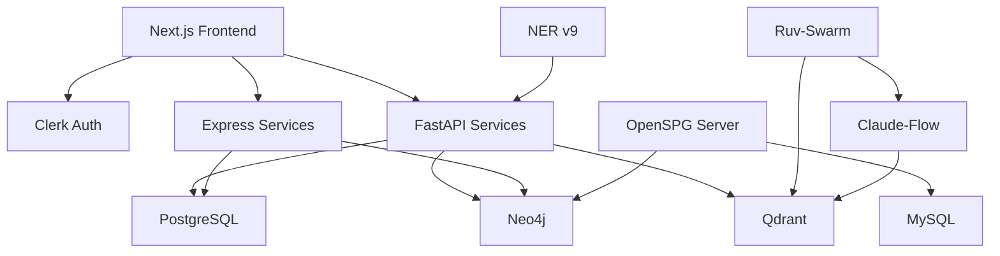

# AEON Digital Twin - Comprehensive System Architecture
**File**: 01_COMPREHENSIVE_ARCHITECTURE.md
**Created**: 2025-11-12 05:20:00 UTC
**Modified**: 2025-11-12 05:20:00 UTC
**Version**: 1.0.0
**Author**: AEON Architecture Team
**Purpose**: Complete system architecture integrating all existing resources
**Status**: ACTIVE - AUTHORITATIVE ARCHITECTURE DOCUMENT

---

## Table of Contents
1. [System Overview](#system-overview)
2. [Infrastructure Layer](#infrastructure-layer)
3. [Data Layer](#data-layer)
4. [Service Layer](#service-layer)
5. [Intelligence Layer](#intelligence-layer)
6. [Presentation Layer](#presentation-layer)
7. [AI Coordination Layer](#ai-coordination-layer)
8. [Integration Points](#integration-points)
9. [Data Flow](#data-flow)
10. [Deployment Architecture](#deployment-architecture)

---

## 1. System Overview

### 1.1 Architecture Philosophy

**Three-Database Parallel Operation**:
- Neo4j: Relationships and knowledge graph
- PostgreSQL: Application state and structured data
- MySQL: OpenSPG operational metadata

**Microservices with Shared Intelligence**:
- Each service autonomous but coordinated
- Qdrant provides cross-service memory
- Ruv-swarm orchestrates multi-agent tasks

**Event-Driven with Persistent State**:
- Asynchronous job processing
- Persistent job state in PostgreSQL
- Event sourcing for audit trail

### 1.2 High-Level Architecture

```
┌─────────────────────────────────────────────────────────────────────────────┐
│                          AEON Digital Twin Platform                          │
├─────────────────────────────────────────────────────────────────────────────┤
│                                                                               │
│  ┌───────────────────────────────────────────────────────────────────────┐ │
│  │                       PRESENTATION LAYER                               │ │
│  │  ┌──────────────────────┐        ┌──────────────────────┐            │ │
│  │  │   Next.js Frontend   │◀──────▶│   Clerk Auth         │            │ │
│  │  │   (Port 3000)        │        │   (OAuth 2.0)        │            │ │
│  │  │   - React Components │        └──────────────────────┘            │ │
│  │  │   - TailwindCSS      │                                             │ │
│  │  │   - Shadcn/ui        │                                             │ │
│  │  └──────────┬───────────┘                                             │ │
│  └─────────────┼─────────────────────────────────────────────────────────┘ │
│                │                                                             │
│  ┌─────────────▼─────────────────────────────────────────────────────────┐ │
│  │                       SERVICE LAYER                                    │ │
│  │  ┌─────────────┐  ┌──────────────┐  ┌──────────────┐                │ │
│  │  │  NER v9 API │  │ FastAPI      │  │ Express.js   │                │ │
│  │  │  (Port 8001)│  │ Services     │  │ Services     │                │ │
│  │  │  - spaCy    │  │ - Python     │  │ - Node.js    │                │ │
│  │  │  - 99% F1   │  │ - Pydantic   │  │ - TypeScript │                │ │
│  │  └──────┬──────┘  └──────┬───────┘  └──────┬───────┘                │ │
│  └─────────┼────────────────┼──────────────────┼─────────────────────────┘ │
│            │                │                  │                           │
│  ┌─────────▼────────────────▼──────────────────▼─────────────────────────┐ │
│  │                    INTELLIGENCE LAYER                                  │ │
│  │  ┌───────────────────────────────────────────────────────────────────┐│ │
│  │  │              AI COORDINATION (Ruv-Swarm + Claude-Flow)            ││ │
│  │  │  ┌─────────────┐  ┌─────────────┐  ┌─────────────┐              ││ │
│  │  │  │ 16 Agents   │  │ Swarm       │  │ Memory      │              ││ │
│  │  │  │ - researcher│  │ Coordinator │  │ Manager     │              ││ │
│  │  │  │ - coder     │  │ - mesh      │  │ - Qdrant    │              ││ │
│  │  │  │ - analyst   │  │ - adaptive  │  │ - vectors   │              ││ │
│  │  │  └─────────────┘  └─────────────┘  └─────────────┘              ││ │
│  │  └───────────────────────────────────────────────────────────────────┘│ │
│  │  ┌───────────────────────────────────────────────────────────────────┐│ │
│  │  │              SEMANTIC REASONING ENGINE                            ││ │
│  │  │  - AttackChainScorer (Bayesian inference)                        ││ │
│  │  │  - GNN Link Prediction (PyTorch Geometric)                       ││ │
│  │  │  - Multi-hop Reasoning (20+ hops)                                ││ │
│  │  │  - Probabilistic Scoring (Wilson Score confidence)               ││ │
│  │  └───────────────────────────────────────────────────────────────────┘│ │
│  │  ┌───────────────────────────────────────────────────────────────────┐│ │
│  │  │              KNOWLEDGE GRAPH ENGINE (OpenSPG)                     ││ │
│  │  │  - Schema Management                                              ││ │
│  │  │  - Job Orchestration                                              ││ │
│  │  │  - Relationship Extraction                                        ││ │
│  │  └──────────┬────────────────────────────────────────────────────────┘│ │
│  └─────────────┼────────────────────────────────────────────────────────────────┘ │
│                │                                                             │
│  ┌─────────────▼─────────────────────────────────────────────────────────┐ │
│  │                         DATA LAYER                                     │ │
│  │  ┌──────────────┐  ┌───────────────┐  ┌──────────────┐              │ │
│  │  │   Neo4j      │  │  PostgreSQL   │  │    MySQL     │              │ │
│  │  │   5.26       │  │      16       │  │   10.5.8     │              │ │
│  │  │   570K nodes │  │   App State   │  │   OpenSPG    │              │ │
│  │  │   3.3M edges │  │   Jobs        │  │   Metadata   │              │ │
│  │  └──────────────┘  └───────────────┘  └──────────────┘              │ │
│  │  ┌──────────────┐  ┌───────────────┐                                │ │
│  │  │   Qdrant     │  │    MinIO      │                                │ │
│  │  │   Vectors    │  │   Storage     │                                │ │
│  │  │   Embeddings │  │   Objects     │                                │ │
│  │  └──────────────┘  └───────────────┘                                │ │
│  └───────────────────────────────────────────────────────────────────────┘ │
│                                                                               │
└───────────────────────────────────────────────────────────────────────────────┘
```

---

## 2. Infrastructure Layer

### 2.1 Docker Container Architecture

**Container Inventory** (All Running):
```yaml
containers:
  aeon-saas-dev:
    image: "Next.js 14+"
    port: 3000
    status: healthy
    uptime: "1 hour"
    purpose: "Frontend application with Clerk auth"

  openspg-neo4j:
    image: "neo4j:5.26"
    ports: [7474, 7687]
    status: healthy
    uptime: "45 hours"
    purpose: "Knowledge graph storage (570K nodes, 3.3M edges)"
    memory: "4GB"

  aeon-postgres-dev:
    image: "postgres:16"
    port: 5432
    status: healthy
    uptime: "7 days"
    purpose: "Application state, job persistence"
    memory: "2GB"

  openspg-mysql:
    image: "mysql:10.5.8"
    port: 3306
    status: healthy
    uptime: "12 days"
    purpose: "OpenSPG operational metadata (33 tables)"
    memory: "1GB"

  openspg-qdrant:
    image: "qdrant/qdrant:latest"
    ports: [6333, 6334]
    status: unhealthy  # Note: Needs attention
    uptime: "7 days"
    purpose: "Vector embeddings, agent memory"
    memory: "2GB"

  openspg-server:
    image: "openspg/server:latest"
    port: 8887
    status: unhealthy  # Note: Needs attention
    uptime: "7 days"
    purpose: "Knowledge graph construction engine"
    memory: "4GB"

  openspg-minio:
    image: "minio/minio:latest"
    ports: [9000, 9001]
    status: healthy
    uptime: "12 days"
    purpose: "Object storage"
    memory: "1GB"
```

**Network Configuration**:
```yaml
networks:
  aeon_network:
    driver: bridge
    subnet: 172.18.0.0/16

container_ips:
  aeon-saas-dev: 172.18.0.8
  openspg-server: 172.18.0.2
  openspg-mysql: 172.18.0.4
  openspg-neo4j: 172.18.0.5
  openspg-qdrant: 172.18.0.6
```

### 2.2 Service Dependencies



---

## 3. Data Layer

### 3.1 Neo4j Knowledge Graph Schema

**Node Types** (570,000 nodes):
```cypher
// Primary Entities
(:CVE)            // Vulnerabilities (~200,000)
(:CWE)            // Weaknesses (~1,200)
(:CAPEC)          // Attack Patterns (~600)
(:Technique)      // MITRE ATT&CK Techniques (193)
(:Tactic)         // MITRE ATT&CK Tactics (14)
(:Software)       // Malware/Tools (~700)
(:Group)          // Threat Actor Groups (~140)
(:Mitigation)     // Defense Techniques (~43)
(:DataSource)     // Detection Sources (~38)

// Asset & Infrastructure
(:Equipment)      // Customer equipment
(:Sector)         // Industry sectors
(:Technology)     // Tech stack components

// Temporal & Version
(:CVEVersion)     // CVE history tracking
(:ExploitTimeline) // Exploit maturity progression
```

**Relationship Types** (3.3M edges):
```cypher
// Semantic Mapping (CRITICAL - Not yet implemented)
()-[:HAS_CWE]->()          // CVE → CWE
()-[:MAPS_TO_CAPEC]->()    // CWE → CAPEC
()-[:MAPS_TO_TECHNIQUE]->()  // CAPEC → Technique
()-[:BELONGS_TO_TACTIC]->()  // Technique → Tactic

// Threat Intelligence (Implemented)
()-[:USES_TECHNIQUE]->()   // Group → Technique
()-[:USES_SOFTWARE]->()    // Group → Software
()-[:TARGETS_SECTOR]->()   // Group → Sector

// Mitigation & Detection (Implemented)
()-[:MITIGATES]->()        // Mitigation → Technique
()-[:DETECTS]->()          // DataSource → Technique

// Temporal (Design, not implemented)
()-[:VERSION_HISTORY]->()  // CVE → CVEVersion
()-[:SUPERSEDED_BY]->()    // CVEVersion → CVEVersion
()-[:CVSS_EVOLUTION]->()   // CVEVersion → CVSS Score

// Equipment (Implemented)
()-[:HAS_VULNERABILITY]->() // Equipment → CVE
()-[:RUNS_ON]->()          // Equipment → Technology
```

### 3.2 PostgreSQL Schema

**Application Tables**:
```sql
-- User and Authentication (Clerk integration)
CREATE TABLE users (
    id UUID PRIMARY KEY DEFAULT gen_random_uuid(),
    clerk_user_id VARCHAR(255) UNIQUE NOT NULL,
    email VARCHAR(255) NOT NULL,
    organization_id UUID,
    created_at TIMESTAMP NOT NULL DEFAULT NOW(),
    last_login TIMESTAMP
);

CREATE TABLE organizations (
    id UUID PRIMARY KEY DEFAULT gen_random_uuid(),
    clerk_org_id VARCHAR(255) UNIQUE NOT NULL,
    name VARCHAR(255) NOT NULL,
    sector VARCHAR(100),
    created_at TIMESTAMP NOT NULL DEFAULT NOW()
);

-- Job Persistence (CRITICAL - Not yet implemented)
CREATE TABLE jobs (
    job_id UUID PRIMARY KEY DEFAULT gen_random_uuid(),
    job_name VARCHAR(255) NOT NULL,
    job_type VARCHAR(100) NOT NULL,  -- 'ingestion', 'extraction', 'analysis'
    status VARCHAR(50) NOT NULL DEFAULT 'pending',
    created_at TIMESTAMP NOT NULL DEFAULT NOW(),
    started_at TIMESTAMP,
    completed_at TIMESTAMP,
    error_message TEXT,
    metadata JSONB,
    CONSTRAINT valid_status CHECK (status IN ('pending', 'running', 'completed', 'failed'))
);

CREATE TABLE job_steps (
    step_id UUID PRIMARY KEY DEFAULT gen_random_uuid(),
    job_id UUID NOT NULL REFERENCES jobs(job_id) ON DELETE CASCADE,
    step_name VARCHAR(255) NOT NULL,
    step_order INTEGER NOT NULL,
    status VARCHAR(50) NOT NULL DEFAULT 'pending',
    started_at TIMESTAMP,
    completed_at TIMESTAMP,
    output JSONB,
    error_message TEXT
);

CREATE TABLE job_logs (
    log_id UUID PRIMARY KEY DEFAULT gen_random_uuid(),
    job_id UUID NOT NULL REFERENCES jobs(job_id) ON DELETE CASCADE,
    log_level VARCHAR(20) NOT NULL,  -- 'DEBUG', 'INFO', 'WARN', 'ERROR'
    message TEXT NOT NULL,
    created_at TIMESTAMP NOT NULL DEFAULT NOW()
);

-- Customer Digital Twin (Design, not implemented)
CREATE TABLE customer_assets (
    asset_id UUID PRIMARY KEY DEFAULT gen_random_uuid(),
    organization_id UUID NOT NULL REFERENCES organizations(id),
    asset_name VARCHAR(255) NOT NULL,
    asset_type VARCHAR(100),
    technologies JSONB,  -- Array of technology stack
    install_date DATE,
    eol_date DATE,
    criticality VARCHAR(50),
    metadata JSONB
);

-- Query History
CREATE TABLE user_queries (
    query_id UUID PRIMARY KEY DEFAULT gen_random_uuid(),
    user_id UUID NOT NULL REFERENCES users(id),
    query_text TEXT NOT NULL,
    query_type VARCHAR(100),
    results_count INTEGER,
    execution_time_ms INTEGER,
    created_at TIMESTAMP NOT NULL DEFAULT NOW()
);

-- Indexes
CREATE INDEX idx_jobs_status ON jobs(status);
CREATE INDEX idx_jobs_created_at ON jobs(created_at DESC);
CREATE INDEX idx_job_steps_job_id ON job_steps(job_id);
CREATE INDEX idx_user_queries_user_id ON user_queries(user_id);
CREATE INDEX idx_customer_assets_org_id ON customer_assets(organization_id);
```

### 3.3 MySQL Schema (OpenSPG Operational)

**OpenSPG Tables** (33 tables):
```sql
-- Schema Management
CREATE TABLE kg_schema (
    id BIGINT AUTO_INCREMENT PRIMARY KEY,
    schema_name VARCHAR(255) NOT NULL,
    schema_version VARCHAR(50),
    schema_config JSON,
    created_at TIMESTAMP DEFAULT CURRENT_TIMESTAMP
);

-- Job Management
CREATE TABLE kg_job (
    id BIGINT AUTO_INCREMENT PRIMARY KEY,
    job_name VARCHAR(255) NOT NULL,
    job_type VARCHAR(100),  -- 'build', 'extract', 'reason'
    status VARCHAR(50),
    created_at TIMESTAMP DEFAULT CURRENT_TIMESTAMP,
    updated_at TIMESTAMP DEFAULT CURRENT_TIMESTAMP ON UPDATE CURRENT_TIMESTAMP
);

-- Entity Extraction
CREATE TABLE kg_entity (
    id BIGINT AUTO_INCREMENT PRIMARY KEY,
    entity_type VARCHAR(100),
    entity_name VARCHAR(255),
    source_doc VARCHAR(500),
    confidence DECIMAL(5,4),
    metadata JSON
);

-- Relationship Extraction
CREATE TABLE kg_relation (
    id BIGINT AUTO_INCREMENT PRIMARY KEY,
    subject_id BIGINT,
    predicate VARCHAR(100),
    object_id BIGINT,
    confidence DECIMAL(5,4),
    source VARCHAR(500)
);

-- CAPEC Mapping Data (Used for semantic chains)
CREATE TABLE capec_data (
    capec_id VARCHAR(20) PRIMARY KEY,
    capec_name VARCHAR(500),
    description TEXT,
    likelihood VARCHAR(50),
    typical_severity VARCHAR(50),
    prerequisites JSON,
    related_cwes JSON  -- Array of CWE IDs
);
```

### 3.4 Qdrant Vector Collections

**Collection Schema**:
```python
from qdrant_client.models import Distance, VectorParams

collections = {
    "agent_memory": {
        "vector_size": 768,  # BERT embeddings
        "distance": Distance.COSINE,
        "description": "Cross-agent persistent memory",
        "payload_schema": {
            "agent_id": "string",
            "task_id": "string",
            "decision": "string",
            "rationale": "string",
            "timestamp": "datetime"
        }
    },

    "task_history": {
        "vector_size": 768,
        "distance": Distance.COSINE,
        "description": "Complete task execution history",
        "payload_schema": {
            "task_id": "string",
            "agent_id": "string",
            "status": "string",
            "deliverables": "array",
            "success_criteria": "object"
        }
    },

    "code_patterns": {
        "vector_size": 768,
        "distance": Distance.COSINE,
        "description": "Reusable code solutions",
        "payload_schema": {
            "pattern_type": "string",
            "code": "string",
            "language": "string",
            "use_cases": "array"
        }
    },

    "semantic_chains": {
        "vector_size": 768,
        "distance": Distance.COSINE,
        "description": "CVE→CWE→CAPEC→Technique→Tactic chains",
        "payload_schema": {
            "cve_id": "string",
            "chain": "array",
            "probability": "float",
            "confidence_interval": "array"
        }
    },

    "user_queries": {
        "vector_size": 768,
        "distance": Distance.COSINE,
        "description": "User interaction patterns",
        "payload_schema": {
            "user_id": "string",
            "query": "string",
            "intent": "string",
            "results": "object"
        }
    }
}
```

---

## 4. Service Layer

### 4.1 NER v9 Service (Named Entity Recognition)

**Technology**: spaCy 3.7+, Python 3.12, FastAPI
**Port**: 8001
**Performance**: 99% F1 score

**Entity Types** (16 recognized):
```python
entity_types = [
    "CVE",           # CVE-2024-1234
    "CWE",           # CWE-79 (XSS)
    "CAPEC",         # CAPEC-63
    "ATT&CK_ID",     # T1566.001
    "TECHNIQUE",     # Spearphishing Attachment
    "TACTIC",        # Initial Access
    "SOFTWARE",      # Cobalt Strike
    "GROUP",         # APT29
    "SECTOR",        # Healthcare, Finance
    "TECHNOLOGY",    # Windows, Azure
    "EQUIPMENT",     # Cisco Router
    "CVSSv3",        # CVSS:3.1/AV:N/AC:L/...
    "IP_ADDRESS",    # 192.168.1.1
    "DOMAIN",        # evil.com
    "FILE_HASH",     # SHA256:abc123...
    "DATE"           # 2024-01-15
]
```

**API Endpoints**:
```python
@app.post("/api/v1/extract")
async def extract_entities(text: str) -> Dict:
    """
    Extract named entities from text

    Returns:
        {
            "entities": [
                {"text": "CVE-2024-1234", "type": "CVE", "confidence": 0.99},
                {"text": "Initial Access", "type": "TACTIC", "confidence": 0.98}
            ],
            "relationships": [
                {"subject": "CVE-2024-1234", "predicate": "EXPLOITS", "object": "CWE-79"}
            ]
        }
    """

@app.post("/api/v1/bulk-extract")
async def bulk_extract(documents: List[str]) -> List[Dict]:
    """Batch process multiple documents"""

@app.get("/health")
async def health_check() -> Dict:
    """Service health status"""
```

### 4.2 OpenSPG Service (Knowledge Graph Construction)

**Technology**: Java, Spring Boot
**Port**: 8887
**Purpose**: Automated knowledge graph construction

**Key Capabilities**:
- Schema definition and management
- Automated relationship extraction
- Job orchestration (currently unreliable - needs PostgreSQL persistence)
- Multi-source data fusion

**API Endpoints**:
```
POST /api/v1/schema/create
POST /api/v1/job/submit
GET  /api/v1/job/{jobId}/status
POST /api/v1/extract/relationships
GET  /health
```

### 4.3 FastAPI Services (Python Backend)

**Services**:
```python
# 1. Semantic Reasoning Service (To be implemented)
# /api/v1/score-attack-chain
# /api/v1/multi-hop-reasoning
# /api/v1/predict-missing-links

# 2. Neo4j Query Service (Implemented)
# /api/v1/graph/query
# /api/v1/graph/stats
# /api/v1/graph/visualize

# 3. Job Management Service (To be implemented)
# /api/v1/jobs/create
# /api/v1/jobs/{jobId}/status
# /api/v1/jobs/{jobId}/logs
```

### 4.4 Express.js Services (Node.js Backend)

**Services**:
```typescript
// 1. Authentication Proxy (Clerk integration)
// /api/auth/session
// /api/auth/user

// 2. Organization Management
// /api/orgs/{orgId}
// /api/orgs/{orgId}/assets

// 3. Query History
// /api/queries/recent
// /api/queries/saved
```

---

## 5. Intelligence Layer

### 5.1 Semantic Reasoning Engine

**AttackChainScorer** (Design, not implemented):
```python
class AttackChainScorer:
    """
    Bayesian probabilistic attack chain scoring

    Formula:
    P(Tactic | CVE) = Σ P(Tactic | Technique) × P(Technique | CAPEC)
                      × P(CAPEC | CWE) × P(CWE | CVE)
    """

    def score_chain(self, cve_id: str) -> Dict:
        """
        Returns:
            {
                'cve_id': 'CVE-2024-1234',
                'chains': [...]  # All possible attack chains
                'primary_tactic': 'Initial Access',
                'overall_probability': 0.78,
                'confidence_interval': (0.72, 0.84),  # Wilson Score
                'customer_modifier': 1.2
            }
        """
```

**GNN Link Predictor** (Design, not implemented):
```python
class GNNLinkPredictor(torch.nn.Module):
    """
    Graph Neural Network for missing link prediction

    Architecture:
    - 3-layer Graph Attention Network (GAT)
    - Input: Node features (dim 128)
    - Hidden: 8 attention heads, dropout 0.6
    - Output: Link probabilities

    Target: AUC-ROC ≥0.85
    """
```

### 5.2 AI Coordination Layer (Ruv-Swarm + Claude-Flow)

**16 Specialized Agents**:
```yaml
agents:
  research:
    - deep_research_agent (researcher)

  analysis:
    - psychoanalysis_specialist (analyst)
    - bias_psychometrics_analyst (analyst)
    - threat_intelligence_analyst (analyst)
    - critical_infrastructure_specialist (analyst)
    - semantic_reasoning_specialist (analyst)
    - schema_architect (analyst)
    - cybersecurity_analyst (analyst)
    - ner_v9_specialist (analyst)
    - multihop_reasoning_specialist (analyst)

  implementation:
    - gnn_ml_engineer (coder)
    - data_pipeline_engineer (coder)
    - frontend_architect (coder)
    - backend_engineer (coder)
    - openspg_specialist (coder)
    - relationship_engineer (coder)
```

**Swarm Configuration**:
```yaml
swarm:
  id: swarm-1761951435550
  topology: mesh  # Peer-to-peer coordination
  strategy: adaptive  # Dynamic task routing
  max_agents: 20
  load_balancing: enabled
  cognitive_diversity: enabled

coordination:
  memory_backend: qdrant
  state_management: claude-flow
  task_orchestration: ruv-swarm
```

---

## 6. Presentation Layer

### 6.1 Next.js Frontend Architecture

**Technology Stack**:
- Next.js 14+ (App Router)
- React 18
- TypeScript
- TailwindCSS
- Shadcn/ui components
- Clerk authentication

**Page Structure**:
```
app/
├── (auth)/
│   ├── login/
│   └── signup/
├── (dashboard)/
│   ├── page.tsx              # Main dashboard
│   ├── search/               # CVE/Technique search
│   ├── graph/                # Knowledge graph visualization
│   ├── analysis/             # Attack chain analysis
│   ├── equipment/            # Equipment inventory
│   └── settings/             # User settings
├── api/
│   ├── auth/                 # Clerk auth endpoints
│   ├── graph/                # Neo4j query proxies
│   ├── search/               # Search endpoints
│   └── jobs/                 # Job management
└── layout.tsx
```

**Key Components**:
```tsx
// Graph Visualization (D3.js + React)
components/
├── GraphVisualization.tsx
├── AttackChainView.tsx
├── ThreatActorMap.tsx
└── EquipmentRiskView.tsx

// Search and Filters
components/
├── CVESearch.tsx
├── TechniqueFilter.tsx
├── SectorFilter.tsx
└── AdvancedFilters.tsx

// Data Display
components/
├── CVECard.tsx
├── TechniqueCard.tsx
├── AttackPathTable.tsx
└── RiskScoreGauge.tsx
```

**Authentication Flow** (Clerk):
```typescript
// CRITICAL: Never modify this flow without testing
import { auth, currentUser } from "@clerk/nextjs";

export async function middleware(request: NextRequest) {
  const { userId } = auth();

  // Protect all routes except public pages
  const publicPaths = ["/", "/login", "/signup", "/api/health"];
  if (!userId && !publicPaths.includes(request.nextPath)) {
    return redirectToSignIn({ returnBackUrl: request.url });
  }

  return NextResponse.next();
}
```

---

## 7. Integration Points

### 7.1 Data Flow Pipeline

```
┌─────────────────────────────────────────────────────────────────┐
│                    INGESTION PIPELINE                            │
├─────────────────────────────────────────────────────────────────┤
│                                                                   │
│  1. Document Input                                               │
│     ↓                                                            │
│  2. NER v9 Extraction (Port 8001)                                │
│     ├─ Extract 16 entity types                                   │
│     ├─ Confidence scoring                                        │
│     └─ Relationship detection                                    │
│     ↓                                                            │
│  3. OpenSPG Processing (Port 8887)                               │
│     ├─ Schema validation                                         │
│     ├─ Relationship extraction                                   │
│     └─ Job orchestration                                         │
│     ↓                                                            │
│  4. Neo4j Storage (Port 7687)                                    │
│     ├─ Node creation/update                                      │
│     ├─ Relationship creation                                     │
│     └─ Index maintenance                                         │
│     ↓                                                            │
│  5. Qdrant Indexing (Port 6333)                                  │
│     ├─ Vector embeddings (BERT)                                  │
│     ├─ Semantic search index                                     │
│     └─ Agent memory storage                                      │
│     ↓                                                            │
│  6. Intelligence Layer                                           │
│     ├─ Semantic chain construction (TODO)                        │
│     ├─ Probabilistic scoring (TODO)                              │
│     └─ GNN link prediction (TODO)                                │
│                                                                   │
└───────────────────────────────────────────────────────────────────┘
```

### 7.2 Query Flow

```
User Query (Next.js)
  → Clerk Auth Validation
  → FastAPI/Express Backend
  → Neo4j Cypher Query
  → (Optional) Semantic Reasoning
  → Response Formatting
  → User Interface Display
```

### 7.3 Agent Coordination Flow

```
User Request
  → TASKMASTER Task Creation
  → Ruv-Swarm Orchestration
  → Agent Selection (capability matching)
  → Parallel Agent Execution
  → Qdrant Memory Storage
  → Claude-Flow State Persistence
  → Result Aggregation
  → User Response
```

---

## 8. Deployment Architecture

### 8.1 Current Deployment (Docker Compose)

**docker-compose.yml**:
```yaml
version: '3.8'

services:
  aeon-saas-dev:
    image: aeon-nextjs:latest
    ports: ["3000:3000"]
    environment:
      - DATABASE_URL=postgresql://postgres@aeon-postgres-dev:5432/aeon
      - CLERK_SECRET_KEY=${CLERK_SECRET_KEY}
      - NEO4J_URI=bolt://openspg-neo4j:7687
    depends_on: [aeon-postgres-dev, openspg-neo4j]

  openspg-neo4j:
    image: neo4j:5.26
    ports: ["7474:7474", "7687:7687"]
    environment:
      - NEO4J_AUTH=neo4j/${NEO4J_PASSWORD}
      - NEO4J_dbms_memory_pagecache_size=2G
      - NEO4J_dbms_memory_heap_initial__size=2G
    volumes: [neo4j-data:/data]

  aeon-postgres-dev:
    image: postgres:16
    ports: ["5432:5432"]
    environment:
      - POSTGRES_PASSWORD=${POSTGRES_PASSWORD}
      - POSTGRES_DB=aeon
    volumes: [postgres-data:/var/lib/postgresql/data]

  openspg-mysql:
    image: mysql:10.5.8
    ports: ["3306:3306"]
    environment:
      - MYSQL_ROOT_PASSWORD=${MYSQL_PASSWORD}
      - MYSQL_DATABASE=openspg_prod
    volumes: [mysql-data:/var/lib/mysql]

  openspg-qdrant:
    image: qdrant/qdrant:latest
    ports: ["6333:6333", "6334:6334"]
    volumes: [qdrant-data:/qdrant/storage]

  openspg-server:
    image: openspg/server:latest
    ports: ["8887:8887"]
    environment:
      - MYSQL_HOST=openspg-mysql
      - NEO4J_URI=bolt://openspg-neo4j:7687
    depends_on: [openspg-mysql, openspg-neo4j]

  openspg-minio:
    image: minio/minio:latest
    ports: ["9000:9000", "9001:9001"]
    command: server /data --console-address ":9001"
    volumes: [minio-data:/data]

  ner-v9-api:
    build: ./deployment/api_v9
    ports: ["8001:8001"]
    environment:
      - MODEL_PATH=/models/ner_v9_comprehensive

volumes:
  neo4j-data:
  postgres-data:
  mysql-data:
  qdrant-data:
  minio-data:

networks:
  default:
    driver: bridge
    ipam:
      config:
        - subnet: 172.18.0.0/16
```

### 8.2 Production Architecture (Future)

**Kubernetes Deployment** (Target for Phase 3):
- Horizontal Pod Autoscaling (HPA)
- Service Mesh (Istio) for traffic management
- Persistent Volume Claims (PVC) for databases
- Ingress with TLS termination
- Distributed worker nodes for job processing

---

## 9. Security Architecture

### 9.1 Authentication Flow

```
User → Clerk Login → JWT Token → Next.js Middleware
→ Token Validation → Session Creation → Route Access
```

### 9.2 Authorization Model

**Role-Based Access Control (RBAC)**:
```typescript
enum Role {
  ADMIN = 'admin',        // Full system access
  ANALYST = 'analyst',    // Read + analysis features
  VIEWER = 'viewer'       // Read-only access
}

interface Permissions {
  canViewGraph: boolean;
  canModifyAssets: boolean;
  canRunAnalysis: boolean;
  canManageUsers: boolean;
}

const rolePermissions: Record<Role, Permissions> = {
  [Role.ADMIN]: {
    canViewGraph: true,
    canModifyAssets: true,
    canRunAnalysis: true,
    canManageUsers: true
  },
  [Role.ANALYST]: {
    canViewGraph: true,
    canModifyAssets: false,
    canRunAnalysis: true,
    canManageUsers: false
  },
  [Role.VIEWER]: {
    canViewGraph: true,
    canModifyAssets: false,
    canRunAnalysis: false,
    canManageUsers: false
  }
};
```

### 9.3 Data Protection

**Encryption**:
- TLS 1.3 for all external communications
- Database connections encrypted (SSL/TLS)
- Secrets stored in environment variables (never committed)
- Password hashing via Clerk (bcrypt)

**API Security**:
- Rate limiting: 1000 req/min per user
- CORS configured for trusted origins only
- Input validation and sanitization
- SQL injection prevention (parameterized queries)

---

## 10. Monitoring and Observability

### 10.1 Health Checks

**Endpoints**:
```
/health               - Overall system health
/health/neo4j         - Neo4j connection status
/health/postgres      - PostgreSQL status
/health/qdrant        - Qdrant status
/health/openspg       - OpenSPG status
```

### 10.2 Metrics Collection

**Key Metrics**:
```yaml
infrastructure:
  - container_cpu_usage
  - container_memory_usage
  - disk_io_operations
  - network_throughput

application:
  - api_request_rate
  - api_response_time_p95
  - api_error_rate
  - job_queue_length

business:
  - documents_processed_per_hour
  - semantic_chains_created
  - user_queries_per_day
  - average_time_to_insight
```

### 10.3 Logging Strategy

**Structured Logging** (JSON format):
```json
{
  "timestamp": "2025-11-12T05:20:00Z",
  "level": "INFO",
  "service": "ner-v9-api",
  "message": "Entity extraction completed",
  "metadata": {
    "document_id": "doc-12345",
    "entities_found": 42,
    "execution_time_ms": 150
  }
}
```

---

## Appendix: Architecture Decision Records (ADRs)

### ADR-001: Three-Database Architecture
**Decision**: Use Neo4j, PostgreSQL, and MySQL in parallel
**Rationale**: Each database optimized for specific use case
**Consequences**: Added complexity, but better performance

### ADR-002: Ruv-Swarm for Agent Coordination
**Decision**: Use Ruv-Swarm with mesh topology
**Rationale**: Peer-to-peer coordination, no single point of failure
**Consequences**: Better fault tolerance, adaptive task routing

### ADR-003: Qdrant for Vector Intelligence
**Decision**: Use Qdrant for embeddings and agent memory
**Rationale**: High-performance vector search, good Python support
**Consequences**: Additional infrastructure component, excellent semantic search

### ADR-004: Clerk for Authentication
**Decision**: Use Clerk instead of custom auth
**Rationale**: Production-ready, secure, minimal development time
**Consequences**: Vendor dependency, excellent user experience

---

**REVIEWED**: 2025-11-12 05:20:00 UTC
**NEXT REVIEW**: 2026-02-12 (Quarterly)
**STATUS**: ACTIVE - AUTHORITATIVE ARCHITECTURE DOCUMENT

*This architecture document reflects the current system state and future vision. All implementation must align with this architecture.*
