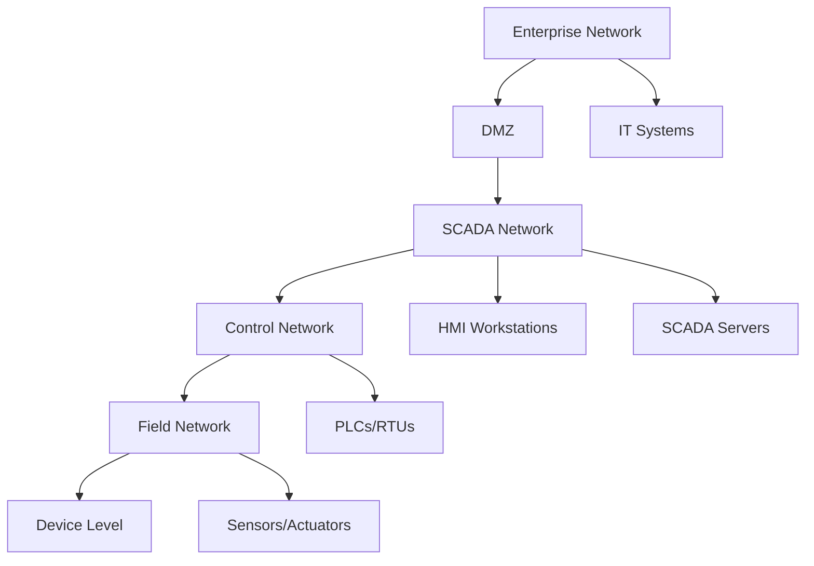
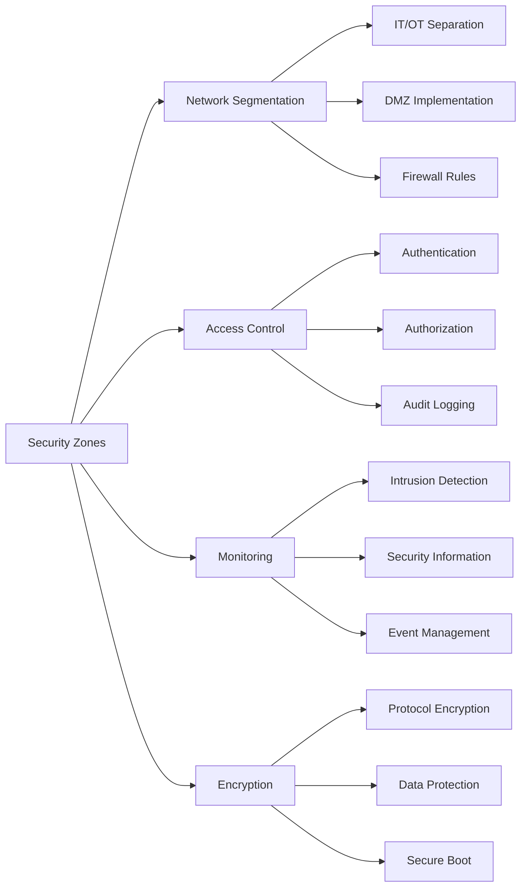

## Summary
Dam control system architecture represents a complex cyber-physical system that integrates mechanical, electrical, and control systems to manage water resources, generate power, and ensure public safety. Modern dam control systems employ hierarchical architectures with multiple layers of control and monitoring.

## Key Information
- **System Type**: Cyber-Physical System (CPS)
- **Control Hierarchy**: Typically 3-4 layer architecture
- **Communication Protocols**: Modbus, DNP3, IEC 61850, OPC UA
- **Redundancy**: N+1 redundancy for critical components
- **Security Zones**: IT/OT separation with demilitarized zones

## Technical Details
### Hierarchical Architecture

#### Level 1: Enterprise/Corporate Layer
- **Function**: Business operations, data analytics, reporting
- **Systems**: ERP, SCADA historian, enterprise databases
- **Network**: Corporate IT network
- **Security**: Enterprise firewalls, identity management
- **Protocols**: HTTP/HTTPS, SQL, REST APIs

#### Level 2: Supervisory Control Layer
- **Function**: Centralized monitoring and control
- **Systems**: Main SCADA servers, HMI workstations
- **Network**: Control network segment
- **Security**: Industrial firewalls, access control
- **Protocols**: Modbus TCP, DNP3, IEC 60870-5-104

#### Level 3: Field Control Layer
- **Function**: Local control and automation
- **Systems**: PLCs, RTUs, local control panels
- **Network**: Fieldbus network
- **Security**: Network segmentation, protocol filtering
- **Protocols**: Modbus RTU/TCP, Profibus, CAN bus

#### Level 4: Device Layer
- **Function**: Physical device control and sensing
- **Systems**: Sensors, actuators, motor control centers
- **Network**: Device-level networks
- **Security**: Device authentication, encryption
- **Protocols**: HART, Foundation Fieldbus, DeviceNet

### Network Architecture

### Communication Protocols
#### Industrial Control Protocols
- **Modbus**: Most widely used protocol in dam control systems
  - RTU (Serial) and TCP (Ethernet) variants
  - Master-slave architecture
  - Simple, reliable, but limited security

- **DNP3**: Common in utility and dam applications
  - Layered architecture (application, transport, data link)
  - Built-in security options (authentication)
  - Designed for harsh environments

- **IEC 61850**: International standard for substation automation
  - Object-oriented modeling
  - Built-in security (GOOSE, SV)
  - Complex but robust

- **OPC UA**: Modern industrial communication standard
  - Platform-independent
  - Built-in security (authentication, encryption)
  - Pub/sub and client-server models

### Control System Components
#### Hardware Components
- **PLCs (Programmable Logic Controllers)**: Main control processors
  - Redundant CPU modules
  - Hot-standby configurations
  - Industrial-grade environmental ratings

- **RTUs (Remote Terminal Units)**: Field data collection
  - Multiple communication ports
  - Edge processing capabilities
  - Ruggedized enclosures

- **HMIs (Human-Machine Interfaces)**: Operator interfaces
  - Touchscreen displays
  - Redundant workstations
  - Alarm management systems

- **Network Equipment**: Industrial networking
  - Managed switches
  - Industrial routers
  - Media converters

#### Software Components
- **SCADA Systems**: Supervisory control and data acquisition
  - Real-time monitoring
  - Alarm management
  - Historical data logging

- **Control Software**: Logic and automation
  - PLC programming (IEC 61131-3)
  - Sequence control
  - Interlock logic

- **Database Systems**: Data storage and management
  - Time-series databases
  - Relational databases
  - Data historians

## Integration/Usage
### Large-Scale Dam Operations
For multiple dam systems, architecture considerations include:

#### Centralized vs Distributed Control
- **Centralized**: Single control center for multiple dams
  - Pros: Consistent operations, centralized expertise
  - Cons: Single point of failure, communication dependencies

- **Distributed**: Local control at each dam
  - Pros: Resilience, local decision making
  - Cons: Inconsistent operations, higher complexity

#### Redundancy Strategies
- **N+1 Redundancy**: One extra component for each critical system
- **Dual Redundancy**: Complete backup systems
- **Geographic Distribution**: Physical separation of redundant systems

### Cybersecurity Integration
Security must be integrated at all architecture levels:

## Security Considerations
### Network Security
- **Segmentation**: Strict separation between IT and OT networks
- **Firewalls**: Industrial firewalls with protocol awareness
- **Intrusion Detection**: IDS/IPS systems for industrial protocols
- **Access Control**: Network-level access restrictions

### System Security
- **Patch Management**: Regular security updates
- **Configuration Security**: Secure baselines and change management
- **Privilege Management**: Principle of least privilege
- **Monitoring**: Continuous security monitoring

### Physical Security
- **Environmental Controls**: Temperature, humidity, power conditioning
- **Access Control**: Physical access to control rooms and equipment
- **Surveillance**: CCTV monitoring of critical areas
- **Emergency Power**: Uninterruptible power supplies and generators

## Vendors/Suppliers
- **Primary Control Systems**: Siemens, Rockwell Automation, Schneider Electric
- **PLCs**: ABB, Mitsubishi, Omron
- **SCADA**: GE Digital, ABB, Schneider Electric
- **Network Equipment**: Cisco, Moxa, Hirschmann
- **Security Solutions: Palo Alto Networks, Dragos, Tenable

## Related Topics
- [kb/sectors/dams/protocols/protocol-modbus-20250102-05.md](protocol-modbus-20250102-05.md)
- [kb/sectors/dams/protocols/protocol-dnp3-20250102-05.md](protocol-dnp3-20250102-05.md)
- [kb/sectors/dams/equipment/device-plc-20250102-05.md](device-plc-20250102-05.md)
- [kb/sectors/dams/security/dam-vulnerabilities-20250102-05.md](dam-vulnerabilities-20250102-05.md)

## References
- NIST SP 800-82: https://csrc.nist.gov/publications/detail/sp/800-82/final - Guide to ICS Security
- ISA-62443: https://www.isa.org/standards-and-publications/isa-standards/isa-62443/ - Industrial Automation Security
- IEC 62443: https://webstore.iec.ch/publication/63147 - Industrial communication networks
- Modbus Organization: https://www.modbus.org/ - Modbus protocol specification
- DNP3 Users Group: https://www.dnp.org/ - DNP3 protocol information

## Metadata
- Last Updated: 2025-01-02 05:14:31
- Research Session: 489461
- Completeness: 85%
- Next Actions: Investigate specific vendor implementations, explore protocol security details