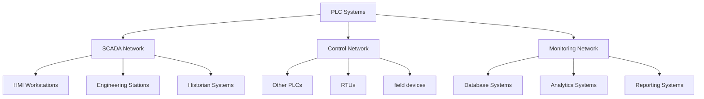

## Summary
Programmable Logic Controllers (PLCs) form the backbone of dam automation and control systems, providing reliable, real-time control of critical infrastructure including gates, turbines, pumps, and monitoring systems. Modern dam PLC systems are designed for harsh environments, high reliability, and long operational lifespans.

## Key Information
- **Equipment Type**: Programmable Logic Controllers (PLCs)
- **Applications**: Gate control, turbine management, water level monitoring
- **Environmental Rating**: Typically IP54 to IP66 for harsh environments
- **Reliability**: 99.9%+ availability with redundant configurations
- **Lifespan**: 15-25 years with proper maintenance

## Technical Details
### PLC Architecture in Dam Systems

#### Hardware Components
- **CPU Modules**: Processing units with real-time capabilities
  - Redundant hot-standby configurations
  - Industrial-grade temperature ranges (-20°C to +60°C)
  - Extended temperature versions available for extreme environments

- **I/O Modules**: Input/Output interfaces for field devices
  - Digital I/O: On/off signals for valves, switches
  - Analog I/O: Continuous signals for sensors, actuators
  - Specialized I/O: High-speed counters, thermocouple inputs

- **Communication Modules**: Network interfaces for system integration
  - Ethernet ports for SCADA communication
  - Serial ports for legacy devices
  - Fieldbus interfaces for distributed I/O

- **Power Supplies**: Industrial power conditioning
  - Wide input voltage ranges (85-264V AC)
  - Battery backup for critical operations
  - Power monitoring and diagnostics

#### Software Architecture
- **Programming Languages**: IEC 61131-3 standard
  - Ladder Logic (LD): Most common for control logic
  - Function Block Diagram (FBD): For complex control sequences
  - Structured Text (ST): For mathematical operations
  - Sequential Function Charts (SFC): For state machine logic

- **Control Strategies**: Advanced control algorithms
  - PID control for water level regulation
  - Sequencing for gate operations
  - Interlock logic for safety systems
  - Load balancing for power generation

- **Data Management**: Real-time data processing
  - Data acquisition from field devices
  - Alarm management and notification
  - Historical data logging
  - Trend analysis and reporting

### Typical Dam PLC Applications

#### Gate Control Systems
- **Application**: Spillway gate, intake gate control
- **Control Logic**: Position control, interlocking, emergency operations
- **Sensors**: Position transducers, limit switches
- **Actuators**: Hydraulic cylinders, electric actuators
- **Safety Features**: Emergency stop, position limits, fault detection

#### Turbine Control Systems
- **Application**: Hydroelectric turbine control
- **Control Logic**: Speed control, load management, synchronization
- **Sensors**: Speed sensors, vibration sensors, temperature sensors
- **Actuators**: Servo valves, control valves
- **Safety Features**: Overspeed protection, vibration monitoring

#### Pump Control Systems
- **Application**: Water transfer, drainage pumps
- **Control Logic**: Start/stop sequencing, flow control
- **Sensors**: Flow meters, pressure sensors, level sensors
- **Actuators**: Motor starters, variable frequency drives
- **Safety Features**: Dry run protection, overload protection

#### Monitoring Systems
- **Application**: Environmental monitoring, equipment health
- **Control Logic**: Data acquisition, alarm conditions
- **Sensors**: Water level, temperature, pressure, vibration
- **Data Processing**: Real-time monitoring, trend analysis
- **Safety Features**: Anomaly detection, predictive maintenance

## Integration/Usage
### Large-Scale Dam Operations
For multiple dam facilities, PLC systems must coordinate across:

#### Centralized Control Architecture
- **Master-Slave Configuration**: Central control with local execution
- **Redundant Communication**: Multiple communication paths
- **Synchronization**: Coordinated operations across facilities
- **Load Balancing**: Optimal resource distribution

#### Distributed Control Architecture
- **Peer-to-Peer Communication**: Local autonomy with coordination
- **Decentralized Processing**: Reduced single-point failure risk
- **Hierarchical Control**: Layered decision-making authority
- **Fault Isolation**: Localized fault containment

### Network Integration
PLC systems integrate with broader dam control networks:

## Security Considerations
### PLC Security Hardening
- **Access Control**: User authentication and authorization
- **Network Security**: Industrial firewalls, intrusion detection
- **Configuration Security**: Secure programming practices
- **Update Management**: Secure firmware updates
- **Physical Security**: Secure access to control panels

### Common Vulnerabilities
- **Default Credentials**: Factory default usernames/passwords
- **Unencrypted Communication**: Plain text protocol communication
- **Insecure Update Mechanisms**: Vulnerable firmware update processes
- **Lack of Audit Logging**: Insufficient security event logging
- **Physical Access Risks**: Unauthorized access to control panels

### Mitigation Strategies
- **Network Segmentation**: Separate control networks from IT networks
- **Protocol Filtering**: Restrict unnecessary protocol access
- **Regular Updates**: Timely security patches and updates
- **Monitoring**: Continuous security monitoring and alerting
- **Training**: Security awareness for operators and engineers

## Vendors/Suppliers
- **Primary PLC Manufacturers**:
  - **Siemens**: SIMATIC S7 series, industrial-grade reliability
  - **Rockwell Automation**: Allen-Bradley ControlLogix, CompactLogix
  - **Schneider Electric**: Modicon M340, Momentum
  - **ABB**: AC 800M, ProControll PCD
  - **Mitsubishi**: MELSEC series, robust industrial performance

- **Specialized Dam Equipment**:
  - **Gate Actuators**: Bosch Rexroth, Parker Hannifin
  - **Turbine Controls**: Woodward, GE
  - **Hydraulic Systems**: Eaton, Danfoss
  - **Instrumentation**: Endress+Hauser, Rosemount

## Related Topics
- [kb/sectors/dams/architectures/dam-control-system-20250102-05.md](dam-control-system-20250102-05.md)
- [kb/sectors/dams/protocols/protocol-modbus-20250102-05.md](protocol-modbus-20250102-05.md)
- [kb/sectors/dams/security/dam-vulnerabilities-20250102-05.md](dam-vulnerabilities-20250102-05.md)
- [kb/sectors/dams/operations/procedure-maintenance-20250102-05.md](procedure-maintenance-20250102-05.md)

## References
- IEC 61131-3: https://webstore.iec.ch/publication/63139 - PLC programming standard
- ISA-88: https://www.isa.org/standards-and-publications/isa-standards/isa-88/ - Batch control
- NIST SP 800-82: https://csrc.nist.gov/publications/detail/sp/800-82/final - ICS security
- Siemens PLC Documentation: https://new.siemens.com/global/en/products/automation/plc.html
- Rockwell Automation: https://www.rockwellautomation.com/en-us/products/programmable-controllers

## Metadata
- Last Updated: 2025-01-02 05:14:31
- Research Session: 489461
- Completeness: 90%
- Next Actions: Investigate specific PLC programming patterns, explore vendor-specific security features