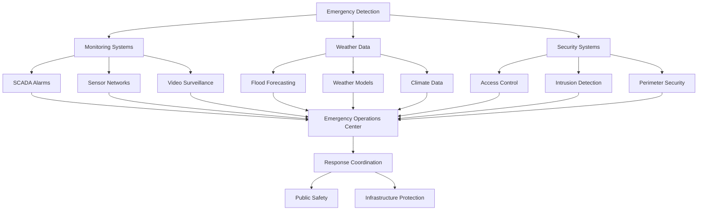

## Summary
Dam emergency response procedures are critical for ensuring public safety and protecting infrastructure during emergency situations. These procedures outline systematic approaches to handling various emergency scenarios including structural failures, extreme weather events, security incidents, and operational emergencies.

## Key Information
- **Purpose**: Protect public safety and infrastructure during emergencies
- **Scope**: All dam facilities and associated infrastructure
- **Regulatory Framework**: FERC, FEMA, DHS, state regulations
- **Response Time**: Minutes to hours depending on emergency type
- **Coordination**: Multi-agency coordination with local, state, and federal authorities

## Technical Details
### Emergency Classification System

#### Class I Emergencies (Critical)
- **Definition**: Immediate threat to public safety or structural integrity
- **Response Time**: < 15 minutes
- **Examples**: Dam breach, major structural failure, uncontrolled release
- **Actions**: Immediate evacuation, emergency shutdown systems, notification

#### Class II Emergencies (Serious)
- **Definition**: Potential threat to safety or significant operational impact
- **Response Time**: < 1 hour
- **Examples**: Severe flooding, equipment failure, security breach
- **Actions**: Partial evacuation, increased monitoring, emergency repairs

#### Class III Emergencies (Minor)
- **Definition**: Localized issues with limited impact
- **Response Time**: < 4 hours
- **Examples**: Equipment malfunction, minor leaks, maintenance issues
- **Actions**: Localized response, normal maintenance procedures

### Emergency Response Organization

#### Emergency Operations Center (EOC)
- **Location**: Secure, dedicated facility
- **Staffing**: 24/7 coverage with trained personnel
- **Equipment**: Communication systems, monitoring displays, backup power
- **Capabilities**: Incident management, resource coordination, decision making

#### Emergency Response Teams
- **Technical Team**: Engineers, technicians, equipment operators
- **Security Team**: Security personnel, law enforcement coordination
- **Public Information Team**: Media relations, public communications
- **Medical Team**: Emergency medical support, first aid
- **Evacuation Team**: Coordination of public evacuation

### Emergency Procedures by Scenario

#### Structural Failure Response
1. **Detection**: Structural monitoring systems, visual inspections
2. **Assessment**: Engineering evaluation, risk analysis
3. **Action**: 
   - Activate emergency shutdown systems
   - Initiate evacuation procedures
   - Notify emergency services
   - Deploy structural response teams
4. **Recovery**: Damage assessment, temporary repairs, long-term solutions

#### Flooding Response
1. **Detection**: Water level monitoring, weather alerts
2. **Assessment**: Flood modeling, impact analysis
3. **Action**:
   - Adjust gate operations
   - Activate pumping systems
   - Implement flood control measures
   - Coordinate with downstream authorities
4. **Recovery**: Damage assessment, infrastructure repair, flood mitigation

#### Security Incident Response
1. **Detection**: Security systems, monitoring, personnel reports
2. **Assessment**: Threat evaluation, impact analysis
3. **Action**:
   - Secure facility access
   - Isolate affected systems
   - Notify law enforcement
   - Preserve evidence
4. **Recovery**: System restoration, security enhancements, incident review

#### Equipment Failure Response
1. **Detection**: Alarms, monitoring systems, operational anomalies
2. **Assessment**: Technical evaluation, impact analysis
3. **Action**:
   - Activate backup systems
   - Implement manual control if needed
   - Initiate repair procedures
   - Notify affected stakeholders
4. **Recovery**: Equipment repair, system testing, preventive measures

## Integration/Usage
### Large-Scale Dam Operations
For multiple dam facilities, emergency response coordination includes:

#### Regional Coordination
- **Emergency Management Agencies**: Local, state, federal coordination
- **Downstream Notifications**: Timely warnings to affected communities
- **Resource Sharing**: Equipment, personnel, and expertise sharing
- **Unified Command**: Integrated incident command structure

#### Communication Systems
- **Redundant Communications**: Multiple communication paths
- **Alert Systems**: Public warning systems, emergency broadcasts
- **Data Sharing**: Real-time information exchange
- **Backup Systems**: Satellite, radio, and cellular backup

### Technology Integration
Modern emergency response systems integrate advanced technologies:

## Security Considerations
### Emergency System Security
- **Redundancy**: Multiple emergency systems and backup power
- **Access Control**: Restricted access to emergency systems
- **Testing**: Regular emergency drills and system testing
- **Maintenance**: Preventive maintenance for emergency equipment

### Cybersecurity for Emergency Systems
- **Network Security**: Protection of emergency communication systems
- **Data Integrity**: Ensuring reliable emergency data
- **System Resilience**: Resistance to cyber attacks during emergencies
- **Backup Systems**: Redundant emergency control systems

### Physical Security
- **Facility Security**: Protection of emergency operations centers
- **Equipment Security**: Security of emergency equipment and systems
- **Personnel Security**: Background checks and training for emergency personnel
- **Supply Chain Security**: Security of emergency equipment and supplies

## Vendors/Suppliers
- **Emergency Systems**: GE Digital, ABB, Schneider Electric
- **Communication Systems**: Motorola Harris, Cisco, Harris Corporation
- **Monitoring Equipment**: Siemens, Rockwell Automation, Endress+Hauser
- **Emergency Power**: Caterpillar, Cummins, Kohler
- **Security Systems**: Honeywell, Johnson Controls, Bosch

## Related Topics
- [kb/sectors/dams/security/dam-vulnerabilities-20250102-05.md](dam-vulnerabilities-20250102-05.md)
- [kb/sectors/dams/architectures/dam-control-system-20250102-05.md](dam-control-system-20250102-05.md)
- [kb/sectors/dams/equipment/device-plc-20250102-05.md](device-plc-20250102-05.md)
- [kb/sectors/dams/standards/standard-fema-20250102-05.md](standard-fema-20250102-05.md)

## References
- FEMA: https://www.fema.gov/emergency-management - Emergency management resources
- FERC: https://www.ferc.gov/ - Federal Energy Regulatory Commission
- DHS: https://www.dhs.gov/cysecurity - Critical infrastructure security
- NFPA: https://www.nfpa.org/ - National Fire Protection Association
- ASCE: https://www.asce.org/ - American Society of Civil Engineers

## Metadata
- Last Updated: 2025-01-02 05:14:31
- Research Session: 489461
- Completeness: 80%
- Next Actions: Investigate specific emergency response technologies, explore regional coordination protocols