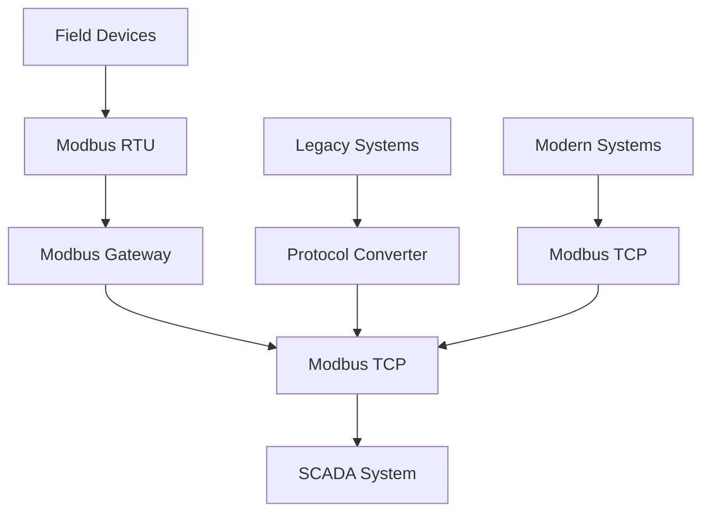

## Summary
Modbus is the most widely used industrial communication protocol in dam control systems, providing a simple, reliable method for connecting industrial electronic devices. It serves as the backbone for communication between PLCs, RTUs, HMIs, and field devices in dam automation systems.

## Key Information
- **Protocol Type**: Industrial communication protocol
- **Versions**: Modbus RTU (Serial), Modbus TCP (Ethernet), Modbus ASCII
- **Architecture**: Master-slave, client-server
- **Data Access**: Register-based (holding, input, coils, discrete inputs)
- **Security**: Basic authentication, requires additional security layers

## Technical Details
### Protocol Architecture

#### Physical Layer
- **Modbus RTU**: RS-232, RS-485 serial communication
  - Distance: Up to 1000 meters (RS-485)
  - Baud Rate: 300-115200 bps
  - Wiring: 2-wire or 4-wire configuration
  - Termination: Required for long distances

- **Modbus TCP**: Ethernet-based communication
  - Distance: Standard Ethernet limits (100m per segment)
  - Speed: 10/100/1000 Mbps
  - Wiring: Cat5e/Cat6 twisted pair
  - Topology: Star or bus topology

#### Data Model
Modbus uses a register-based data model with four data types:

1. **Coils**: Single-bit outputs (read/write)
   - Address range: 00001-09999
   - Function codes: 01 (Read Coils), 05 (Write Single Coil), 15 (Write Multiple Coils)

2. **Discrete Inputs**: Single-bit inputs (read-only)
   - Address range: 10001-19999
   - Function codes: 02 (Read Discrete Inputs)

3. **Input Registers**: 16-bit inputs (read-only)
   - Address range: 30001-39999
   - Function codes: 04 (Read Input Registers)

4. **Holding Registers**: 16-bit outputs (read/write)
   - Address range: 40001-49999
   - Function codes: 03 (Read Holding Registers), 06 (Write Single Register), 16 (Write Multiple Registers)

#### Function Codes
| Code | Name | Description |
|------|------|-------------|
| 01 | Read Coils | Read discrete outputs (1 bit each) |
| 02 | Read Discrete Inputs | Read discrete inputs (1 bit each) |
| 03 | Read Holding Registers | Read output registers (16 bits each) |
| 04 | Read Input Registers | Read input registers (16 bits each) |
| 05 | Write Single Coil | Write single discrete output |
| 06 | Write Single Register | Write single output register |
| 15 | Write Multiple Coils | Write multiple discrete outputs |
| 16 | Write Multiple Registers | Write multiple output registers |
| 22 | Mask Write Register | Bit-level write to register |

### Implementation in Dam Systems

#### Typical Dam Applications
- **Water Level Monitoring**: Input registers from level sensors
- **Gate Control**: Coils for gate actuators, input registers for position feedback
- **Pump Control**: Coils for pump starters, input registers for flow rates
- **Turbine Management**: Holding registers for speed control, input registers for temperature
- **Alarm Systems**: Discrete inputs for alarm conditions, coils for alarm acknowledgment

#### Data Mapping Examples
```python
# Typical Modbus register mapping for dam systems
dam_data = {
    # Water Level Monitoring (Input Registers)
    30001: "Upstream Water Level (m)",
    30002: "Downstream Water Level (m)",
    30003: "Reservoir Capacity (%)",
    
    # Gate Control (Coils/Input Registers)
    00001: "Spillway Gate Open Command",
    40001: "Spillway Gate Position (%)",
    40002: "Gate Motor Current (A)",
    
    # Pump Control (Coils/Input Registers)
    00002: "Pump Start Command",
    00003: "Pump Stop Command",
    40003: "Pump Flow Rate (m³/h)",
    40004: "Pump Motor Temperature (°C)",
    
    # Alarm Conditions (Discrete Inputs)
    10001: "High Water Level Alarm",
    10002: "Low Water Level Alarm",
    10003: "Equipment Fault Alarm"
}
```

#### Communication Configuration
```python
# Modbus TCP configuration example
modbus_tcp_config = {
    "host": "192.168.1.100",  # PLC IP address
    "port": 502,              # Modbus TCP port
    "timeout": 5,             # Connection timeout (seconds)
    "retries": 3,            # Number of retry attempts
    "unit_id": 1,            # Slave device ID
    "max_registers": 125,     # Maximum registers per request
    "max_coils": 2000        # Maximum coils per request
}
```

## Integration/Usage
### Large-Scale Dam Networks
For multiple dam facilities, Modbus implementation considerations include:

#### Network Topology
- **Star Configuration**: Centralized control with individual device connections
- **Bus Configuration**: Daisy-chained devices for reduced wiring
- **Hybrid Configuration**: Combination of star and bus topologies
- **Redundant Paths**: Multiple communication paths for reliability

#### Gateway Integration
Modbus protocols often require gateways for integration:



### Performance Optimization
- **Polling Intervals**: Optimize polling frequency based on data criticality
- **Batch Requests**: Group multiple register reads in single requests
- **Error Handling**: Implement robust error detection and recovery
- **Network Segmentation**: Separate critical control data from monitoring data

## Security Considerations
### Modbus Security Limitations
- **No Built-in Authentication**: Basic protocol lacks security features
- **Plain Text Communication**: All data transmitted without encryption
- **No Access Control**: No granular permission management
- **Vulnerable to Spoofing**: Easy to impersonate legitimate devices

### Security Enhancements
- **Network Segmentation**: Isolate Modbus networks from IT networks
- **Firewall Rules**: Restrict Modbus traffic to authorized devices
- **VPN Tunneling**: Encrypt Modbus traffic over VPN
- **Protocol Gateways**: Use gateways with security features
- **Access Control Lists**: Restrict source/destination addresses

### Common Vulnerabilities
- **Default Credentials**: Many devices ship with default passwords
- **Unrestricted Access**: No authentication on Modbus requests
- **Buffer Overflow**: Some implementations vulnerable to buffer attacks
- **Denial of Service**: Flooding attacks can disrupt communications

## Vendors/Suppliers
- **Modbus Gateways**: Moxa, Advantech, Hirschmann
- **PLC Support**: All major PLC vendors (Siemens, Rockwell, ABB, Schneider)
- **Protocol Analyzers**: Wireshark with Modbus plugin, industrial protocol analyzers
- **Security Solutions**: Tenable, Tripwire, specialized industrial security vendors

## Related Topics
- [kb/sectors/dams/architectures/dam-control-system-20250102-05.md](dam-control-system-20250102-05.md)
- [kb/sectors/dams/equipment/device-plc-20250102-05.md](device-plc-20250102-05.md)
- [kb/sectors/dams/security/dam-vulnerabilities-20250102-05.md](dam-vulnerabilities-20250102-05.md)
- [kb/sectors/dams/protocols/protocol-dnp3-20250102-05.md](protocol-dnp3-20250102-05.md)

## References
- Modbus Organization: https://www.modbus.org/ - Official Modbus specification
- Modbus TCP Specification: https://www.modbus.org/docs/Modbus_Application_Protocol_V1_1b.pdf
- NIST SP 800-82: https://csrc.nist.gov/publications/detail/sp/800-82/final - ICS security guidelines
- ISA-99/IEC 62443: https://www.isa.org/standards-and-publications/isa-standards/isa-62443/ - Industrial automation security
- Moxa Modbus Products: https://www.moxa.com/en/products/industrial-communication/fieldbus/modbus.htm

## Metadata
- Last Updated: 2025-01-02 05:14:31
- Research Session: 489461
- Completeness: 85%
- Next Actions: Investigate Modbus security implementations, explore protocol performance optimization