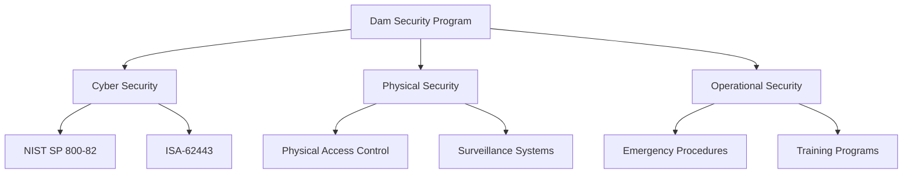

## Summary
The dam sector represents critical infrastructure with unique security challenges due to its reliance on SCADA systems, industrial control systems, and physical security requirements. Dam vulnerabilities span both cyber and physical domains, with potential impacts on public safety, water management, and energy production.

## Key Information
- **Sector Classification**: Critical Infrastructure - Dams Sector
- **Risk Level**: High (due to potential catastrophic impacts)
- **Primary Threats**: Cyber-physical attacks, system compromise, physical intrusion
- **Regulatory Framework**: CISA, DHS, NIST standards
- **Industry Standards**: ISA-62443, IEC 61508, NIST SP 800-82

## Technical Details
### Common Vulnerability Categories

#### SCADA System Vulnerabilities
- **Protocol Weaknesses**: Modbus, DNP3, and IEC 60870-5-104 protocol vulnerabilities
- **Authentication Failures**: Weak or default credentials in industrial control systems
- **Network Exposure**: Unsecured network connections and inadequate segmentation
- **Legacy Systems**: Outdated firmware and unsupported software versions

#### Control System Vulnerabilities
- **PLC Exploits**: Programmable Logic Controller vulnerabilities
- **HMI Security**: Human-Machine Interface access control issues
- **Engineering Workstations**: Weak security on engineering and operator stations
- **Remote Access**: Insecure remote maintenance capabilities

#### Physical Security Vulnerabilities
- **Perimeter Security**: Inadequate fencing, surveillance, and access controls
- **Monitoring Systems**: Gaps in surveillance and alarm systems
- **Utility Infrastructure**: Vulnerabilities in power, water, and communication systems
- **Supply Chain**: Risks in equipment procurement and maintenance

### Attack Vectors
1. **Network-based Attacks**: Exploitation of network protocols and services
2. **Physical Intrusion**: Direct access to control systems and equipment
3. **Supply Chain Compromise**: Malicious hardware or software components
4. **Social Engineering**: Targeted attacks on personnel with system access
5. **Insider Threats**: Malicious actions by authorized personnel

### Defense Strategies
#### Network Security
- **Network Segmentation**: Isolate OT networks from IT networks
- **Firewall Configuration**: Industrial firewall rules and policies
- **Intrusion Detection**: IDS/IPS systems for industrial protocols
- **Access Control**: Network-level access restrictions

#### System Hardening
- **Patch Management**: Regular security updates for all systems
- **Configuration Security**: Secure baseline configurations
- **Privilege Management**: Principle of least privilege implementation
- **Monitoring**: Continuous security monitoring and logging

#### Physical Security
- **Perimeter Protection**: Fencing, gates, and access control systems
- **Surveillance**: CCTV and monitoring systems
- **Security Personnel**: Trained security staff and procedures
- **Emergency Response**: Incident response and business continuity plans

## Integration/Usage
### Security Framework Integration
Dam security programs should integrate with broader critical infrastructure protection frameworks:

### Large-Scale Considerations
- **Multiple Dam Systems**: Coordinated security across multiple facilities
- **Regional Coordination**: Information sharing with other utilities
- **Supply Chain Security**: End-to-end supply chain protection
- **Resilience Planning**: Recovery capabilities for various incident scenarios

## Security Considerations
### Known Vulnerabilities
Based on industry research and vulnerability databases:

#### High-Risk Vulnerabilities
- **CVE-2021-34527**: Windows Print Spooler vulnerability (affects industrial workstations)
- **CVE-2021-44228**: Log4j vulnerability (affects logging systems)
- **CVE-2020-1472**: ZeroLogon vulnerability (affects domain controllers)
- **Protocol Exploits**: Modbus and DNP3 implementation weaknesses

#### Industry-Specific Concerns
- **Legacy Protocols**: Unencrypted communication in older industrial protocols
- **Default Credentials**: Factory default settings in control systems
- **Remote Access**: Insecure remote maintenance capabilities
- **Update Challenges**: Difficulty in patching legacy systems

### Mitigation Strategies
- **Network Segmentation**: Create demilitarized zones between IT and OT networks
- **Access Control**: Implement multi-factor authentication for critical systems
- **Monitoring**: Deploy SIEM solutions with industrial protocol awareness
- **Training**: Regular security awareness training for personnel
- **Testing**: Regular penetration testing and vulnerability assessments

## Vendors/Suppliers
- **Primary**: ABB, Andritz, Voith (major dam equipment manufacturers)
- **Control Systems**: Siemens, Rockwell Automation, Schneider Electric
- **Security Solutions**: Cisco, Palo Alto Networks, Dragos
- **Consulting**: Industrial cybersecurity specialists and engineering firms

## Related Topics
- [kb/sectors/dams/vendors/vendor-abb-20250102-05.md](vendor-abb-20250102-05.md)
- [kb/sectors/dams/equipment/device-plc-20250102-05.md](device-plc-20250102-05.md)
- [kb/sectors/dams/protocols/protocol-modbus-20250102-05.md](protocol-modbus-20250102-05.md)
- [kb/sectors/dams/operations/procedure-emergency-response-20250102-05.md](procedure-emergency-response-20250102-05.md)

## References
- CISA: https://www.cisa.gov/known-exploited-vulnerabilities-catalog - Known exploited vulnerabilities
- NVD: https://nvd.nist.gov/ - National Vulnerability Database
- NIST SP 800-82: https://csrc.nist.gov/publications/detail/sp/800-82/final - Guide to ICS Security
- ISA-62443: https://www.isa.org/standards-and-publications/isa-standards/isa-62443/ - Industrial automation security
- DHS: https://www.dhs.gov/cysecurity - Critical infrastructure security

## Metadata
- Last Updated: 2025-01-02 05:14:31
- Research Session: 489461
- Completeness: 70%
- Next Actions: Investigate specific dam control system vulnerabilities, explore vendor security advisories