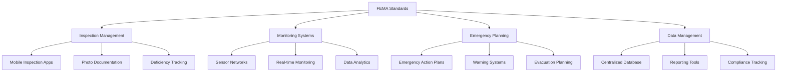

## Summary
FEMA (Federal Emergency Management Agency) establishes comprehensive dam safety standards and guidelines that form the foundation of dam safety programs in the United States. These standards address dam design, construction, operation, maintenance, and emergency preparedness to ensure public safety and protect downstream communities.

## Key Information
- **Regulatory Authority**: FEMA, in coordination with USACE and state agencies
- **Primary Document**: FEMA P-936, Dam Safety Program Guidelines
- **Compliance**: Mandatory for federally funded dam projects
- **Inspection Frequency**: Regular inspections based on hazard classification
- **Emergency Planning**: Required emergency action plans for all dams

## Technical Details
### Dam Hazard Classification

#### High-Hazard Dams
- **Definition**: Failure would likely cause loss of human life
- **Inspection Frequency**: Annual inspections
- **Emergency Planning**: Required emergency action plans
- **Safety Features**: Enhanced monitoring, redundant systems
- **Examples**: Large dams near populated areas, critical infrastructure

#### Significant-Hazard Dams
- **Definition**: Failure could cause significant economic loss
- **Inspection Frequency**: Biennial inspections
- **Emergency Planning**: Recommended emergency action plans
- **Safety Features**: Regular monitoring, maintenance programs
- **Examples**: Smaller dams with infrastructure downstream

#### Low-Hazard Dams
- **Definition**: Failure would cause minimal property damage
- **Inspection Frequency**: Triennial inspections
- **Emergency Planning**: Basic emergency procedures
- **Safety Features**: Routine maintenance, visual inspections
- **Examples**: Small agricultural dams, recreational facilities

### Safety Inspection Requirements

#### Visual Inspections
- **Frequency**: Based on hazard classification
- **Scope**: Embankments, spillways, outlet works, appurtenant structures
- **Documentation**: Standardized inspection forms and reports
- **Qualifications**: Certified dam safety inspectors
- **Follow-up**: Corrective action plans for identified deficiencies

#### Instrumentation and Monitoring
- **Types**: Piezometers, settlement gauges, crack monitors, seepage weirs
- **Frequency**: Continuous monitoring for high-hazard dams
- **Data Analysis**: Regular review of monitoring data
- **Alarms**: Threshold-based alert systems
- **Calibration**: Regular equipment calibration and maintenance

#### Engineering Evaluations
- **Scope**: Structural analysis, hydraulic capacity, seismic stability
- **Frequency**: Every 5-10 years for high-hazard dams
- **Methods**: Field investigations, laboratory testing, computer modeling
- **Documentation**: Detailed engineering reports
- **Remediation**: Design and implementation of corrective measures

### Emergency Action Plan Requirements

#### Plan Components
1. **Identification**: Dam and facility information
2. **Hazard Definition**: Inundation maps and downstream impacts
3. **Notification Procedures**: Alert systems and contact lists
4. **Emergency Operations**: Response procedures and responsibilities
5. **Evacuation Plans**: Downstream evacuation routes and procedures
6. **Training and Exercises**: Personnel training and drills
7. **Plan Maintenance**: Regular review and updates

#### Notification Systems
- **Warning Systems**: Sirens, emergency broadcast systems
- **Communication Networks**: Redundant communication systems
- **Alert Levels**: Different alert levels based on severity
- **Public Education**: Community awareness programs
- **Coordination**: Integration with local emergency services

## Integration/Usage
### Large-Scale Dam Programs
For multiple dam facilities, FEMA standards require:

#### Program Management
- **Centralized Oversight**: Coordinated safety program management
- **Resource Allocation**: Adequate staffing and funding
- **Training Programs**: Comprehensive training for personnel
- **Quality Assurance**: Standardized procedures and documentation

#### Data Management
- **Centralized Database**: Consolidated safety data management
- **Reporting Systems**: Standardized reporting to regulatory agencies
- **Analysis Tools**: Advanced analysis for trend identification
- **Integration**: Integration with other safety management systems

### Technology Integration
Modern dam safety programs integrate advanced technologies:

## Security Considerations
### Security of Safety Systems
- **Access Control**: Restricted access to safety-critical systems
- **Data Integrity**: Protection of safety data and monitoring systems
- **System Resilience**: Redundancy and reliability of safety systems
- **Cybersecurity**: Protection of digital safety systems from cyber threats

### Emergency System Security
- **Redundancy**: Multiple emergency communication systems
- **Backup Power**: Uninterruptible power for safety systems
- **Physical Security**: Protection of emergency equipment and facilities
- **Training**: Security awareness for safety personnel

### Information Security
- **Data Protection**: Security of dam safety data and reports
- **Access Management**: Controlled access to safety information
- **Audit Trails**: Comprehensive logging of system access and changes
- **Compliance**: Adherence to information security standards

## Vendors/Suppliers
- **Monitoring Equipment**: Leica Geosystems, Trimble, Geokon
- **Instrumentation**: Slope Indicator, Geocomp, Roctest
- **Software Solutions**: Bentley Systems, Intergraph, Esri
- **Consulting Services: AECOM, Jacobs, Stantec
- **Emergency Systems**: Federal Signal, Whelen, Motorola Solutions

## Related Topics
- [kb/sectors/dams/operations/procedure-emergency-response-20250102-05.md](procedure-emergency-response-20250102-05.md)
- [kb/sectors/dams/security/dam-vulnerabilities-20250102-05.md](dam-vulnerabilities-20250102-05.md)
- [kb/sectors/dams/architectures/dam-control-system-20250102-05.md](dam-control-system-20250102-05.md)
- [kb/sectors/dams/equipment/device-plc-20250102-05.md](device-plc-20250102-05.md)

## References
- FEMA P-936: https://www.fema.gov/sites/default/files/2020-09/fema_p_936.pdf - Dam Safety Program Guidelines
- FEMA National Dam Safety Program: https://www.fema.gov/national-dam-safety-program
- USACE Dam Safety: https://www.usace.army.mil/Missions/Civil-Works/Dam-Safety/
- Association of State Dam Safety Officials: https://www.damsafety.org/
- FEMA Emergency Management Institute: https://training.fema.gov/

## Metadata
- Last Updated: 2025-01-02 05:14:31
- Research Session: 489461
- Completeness: 85%
- Next Actions: Investigate specific FEMA compliance requirements, explore dam safety technologies