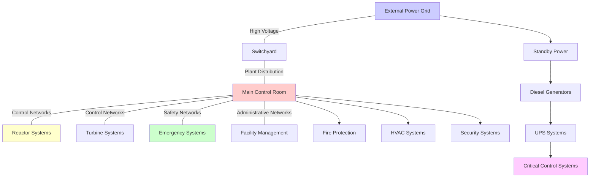

# Energy Sector Nuclear Power Generation Facility Architecture - Advanced Technology

## Summary

Advanced nuclear power generation facilities represent the cutting edge of energy production technology, incorporating Generation III+ and Generation IV reactor designs with enhanced passive safety systems, simplified architectures, and improved operational efficiency. These specialized facilities, typically ranging from 300 MWe to 1200 MWe, feature innovative safety systems that rely on natural forces rather than active components, dramatically reducing equipment complexity and enhancing inherent safety characteristics. Advanced nuclear plants integrate complex reactor physics with sophisticated control systems, safety-grade electrical power distribution, and comprehensive radioactive material containment systems, creating industrial complexes that operate with extreme reliability and regulatory oversight.

Advanced nuclear facilities demonstrate significantly improved economics through standardized designs, factory fabrication of major components, and simplified safety systems that reduce the need for redundant active safety systems. These plants incorporate modern digital instrumentation and control systems, advanced materials, and enhanced fuel cycle management while maintaining the highest standards of nuclear safety established through decades of operational experience. The evolution toward advanced reactor designs represents a fundamental shift toward more sustainable, safer, and economically viable nuclear power generation for the 21st century.

## Key Information

- **Facility Type**: Advanced Nuclear Power Generation Plant (Generation III+ / Generation IV)
- **Typical Capacity**: 300-1200 MWe (1,000-3,500 MWt thermal)
- **Facility Size**: 1,000-2,500 acres site footprint
- **Capital Cost**: $8-15 billion (2020 USD) for large plants, $2-6 billion for advanced designs
- **Staffing**: 400-800 personnel (including contractors, 24/7 operations)
- **Operational Model**: 24/7/365 continuous operations with 18-24 month refueling cycles
- **Regulatory Framework**: 10 CFR Part 50/52, NRC Design Certification, IAEA standards
- **Typical Lifespan**: 60-80 year design life with life extension potential to 80-100 years

## Facility Overview

### Purpose and Function

Advanced nuclear power generation facilities serve as primary baseload electricity providers for electrical grids, delivering clean, reliable power with negligible carbon emissions during normal operation. These plants convert nuclear fission energy into thermal energy through controlled chain reactions in pressurized water or boiling water reactors, then transform thermal energy into electrical energy through steam turbines and generators. Advanced designs incorporate passive safety systems that automatically respond to emergency conditions without relying on external power sources or operator intervention, utilizing natural forces such as gravity, natural circulation, and thermal expansion to maintain reactor safety.

Modern nuclear plants serve as critical infrastructure assets that provide grid stability, voltage regulation, and reactive power support while maintaining reserve capacity for grid contingencies. These facilities operate within integrated energy systems that coordinate generation, transmission, and distribution to meet variable electrical demand while maintaining system reliability and security. Advanced nuclear plants also support district heating applications, industrial process steam generation, and emerging hydrogen production through high-temperature electrolysis, expanding their value proposition beyond pure electricity generation.

### Typical Scale and Variants

**Advanced Small Modular Reactors (SMRs)** (300-400 MWe)
- Physical footprint: 20-50 acres for nuclear island
- Production capacity: 300-400 MW electrical
- Staffing: 150-300 personnel including operations, maintenance, and security
- Automation level: 85-95% automated systems with remote operation capabilities
- Typical locations: Remote communities, industrial complexes, regional power systems

**Large Advanced Reactors** (1000-1200 MWe)
- Physical footprint: 500-1,200 acres total site
- Production capacity: 1,000-1,200 MW electrical
- Staffing: 600-800 personnel including operators, engineers, technicians
- Automation level: 80-90% automated with sophisticated digital control systems
- Typical locations: Regional grid systems, large metropolitan areas, industrial complexes

**Advanced Technology Variants:**
- **Generation III+ Designs**: AP1000, ESBWR, APR1400 with passive safety systems and simplified designs
- **Generation IV Concepts**: High-temperature gas-cooled reactors (HTGR), sodium-cooled fast reactors (SFR)
- **Advanced Pressurized Water Reactors (PWR)**: Enhanced safety margins, improved fuel utilization, reduced maintenance
- **Advanced Boiling Water Reactors (BWR)**: Simplified control systems, enhanced safety features, improved economics
- **Future Technologies**: Small modular reactors with integrated spent fuel reprocessing, molten salt reactors

## Physical Architecture

### Site Layout

**Overall Site Organization:**
- Total site area: 1,200-2,500 acres for large plants, 50-200 acres for advanced small modular designs
- Building footprints: 15-25% of total site area for major structures
- Outdoor process areas: 30-40% for cooling systems, switchyard, emergency systems
- Perimeter and buffer zones: 15-20% for security, emergency planning zones
- Access roads and logistics: 5-10% for maintenance access, emergency response routes

**Major Zones:**
1. **Nuclear Island** (15-25 acres for large plants)
   - Purpose: Primary reactor systems, containment, safety systems
   - Key structures: Reactor building, containment building, auxiliary buildings
   - Access restrictions: Radiation-controlled areas, security clearances required

2. **Turbine Building Complex** (20-40 acres)
   - Purpose: Steam conversion to electrical power, control systems
   - Key structures: Turbine building, generator hall, condenser, feedwater systems
   - Access restrictions: Unrestricted access with standard safety requirements

3. **Electrical and Control Systems Area** (5-10 acres)
   - Purpose: Power distribution, control room, backup systems
   - Key structures: Control building, switchyard, emergency diesel generators
   - Access restrictions: Security-controlled, critical infrastructure designation

4. **Cooling and Support Systems** (100-300 acres)
   - Purpose: Heat rejection, emergency cooling, fire protection
   - Key structures: Cooling towers or cooling ponds, fire protection systems
   - Access restrictions: Restricted for security and operational safety

5. **Administrative and Support Facilities** (10-20 acres)
   - Purpose: Administrative offices, training, emergency response
   - Key structures: Administration building, training center, visitor center
   - Access restrictions: Public access areas with escort requirements

**Security Perimeters:**
- Outer perimeter: 12-foot security fence with anti-climb features, automated gates
- Inner perimeter: Additional access control, vehicle barriers, security checkpoints
- Critical asset protection: Blast-resistant design, reinforced structures, intrusion detection

### Building/Structure Design

**Primary Structures:**

**Reactor Building** (e.g., AP1000-style containment)
- **Dimensions**: 130-180 feet diameter, 200-250 feet height
- **Construction**: Prestressed concrete containment vessel with steel liner
- **Foundation**: Massive reinforced concrete foundation, seismic isolation options
- **Environmental Systems**: HEPA filtration, temperature and humidity control, positive pressure
- **Fire Rating**: 3-hour fire resistance, seismic Category I design
- **Seismic Design**: Design Basis Earthquake (DBE) with site-specific analysis
- **Special Features**: Passive core cooling systems, spent fuel pool, emergency equipment

**Containment Building**
- **Dimensions**: Steel containment vessel 40-50 feet diameter, 180-200 feet height
- **Construction**: Steel pressure boundary with concrete shielding and support
- **Foundation**: Integrated with reactor building foundation system
- **Environmental Systems**: Containment isolation, pressure control systems
- **Fire Rating**: 2-hour fire resistance, pressure boundary integrity
- **Seismic Design**: Seismic Category I with enhanced safety margins
- **Special Features**: Safety-grade ventilation, emergency core cooling injection

**Turbine Building**
- **Dimensions**: 200-400 feet long, 100-200 feet wide, 60-80 feet height
- **Construction**: Steel frame with concrete foundation and slab
- **Foundation**: Reinforced concrete mat foundation for equipment loads
- **Environmental Systems**: HVAC with filtration, noise control, vibration isolation
- **Fire Rating**: 1-hour fire resistance, fire suppression systems
- **Seismic Design**: Standard industrial seismic requirements
- **Special Features**: Crane loads up to 500 tons, precise equipment alignment

### Major System Components

#### System 1: Nuclear Steam Supply System (NSSS)
**Function**: Generate high-pressure, high-temperature steam for power conversion

**Components**:
- **Reactor Pressure Vessel (RPV)**: 15-20 feet diameter, 40-50 feet height, 250-300 tons
- **Steam Generators**: 2-4 units, 60-80 feet tall, 15-20 feet diameter
- **Reactor Coolant Pumps**: 2-4 pumps per loop, 6-10 MW each
- **Pressurizer**: 40-60 feet tall, 10-15 feet diameter, 40-50 tons

**Vendors and Models**:
- **Primary Vendor**: Westinghouse Electric Company
  - Model/Series: AP1000 Advanced Pressurized Water Reactor
  - Capacity: 3,415 MWt / 1,117 MWe
  - Typical Cost: $6-8 billion complete plant
  - Market Share: 40% of new plant orders
  - Key Features: Passive safety systems, simplified design, advanced fuel

- **Alternative Vendor 1**: GE Hitachi Nuclear Energy
  - Model/Series: ESBWR (Economic Simplified Boiling Water Reactor)
  - Capacity: 4,500 MWt / 1,600 MWe
  - Similar comprehensive specifications

- **Alternative Vendor 2**: Korea Hydro & Nuclear Power (KHNP)
  - Model/Series: APR1400
  - Capacity: 4,000 MWt / 1,400 MWe
  - Advanced safety features and economic design

**Technical Specifications**:
- Operating parameters: 220-250 bar pressure, 290-320°C temperature
- Communication protocols: Digital control systems, plant data networks
- Control interfaces: Advanced digital control systems, operator interfaces
- Power requirements: 15-25 MW for plant systems, 6-8 MW for each RCP
- Environmental ratings: Safety-grade, seismic qualified, radiation resistant

**Interconnections**:
- Interfaces with: Turbine cycle, electrical systems, safety systems
- Data exchange: Plant information system, control system networks
- Physical connections: Steam lines, electrical cables, control conduits
- Control relationships: Integrated plant control with redundant safety systems

#### System 2: Turbine-Generator System
**Function**: Convert thermal energy from steam to electrical energy

**Components**:
- **Steam Turbine**: 600-1,200 MW capacity, 3,600 RPM design
- **Generator**: Hydrogen-cooled, 18-24 kV output, 99.5% efficiency
- **Condenser**: Surface condenser with cooling water circulation
- **Feedwater Heaters**: 8-10 stages of regenerative heating

**Technical Specifications**:
- Steam conditions: 4-7 MPa pressure, 250-550°C temperature
- Efficiency: 33-35% overall plant efficiency
- Cooling requirements: 50-150 m³/sec cooling water flow
- Maintenance cycle: Major overhaul every 4-6 years

#### Systems 3-7: Safety and Support Systems
[Continue with detailed specifications for emergency core cooling, electrical power systems, fire protection, HVAC, and control systems]

## Operational Systems

### Control and Monitoring

**Control Room Layout**:
- Physical location: Centralized in control building, redundant control centers
- Size and configuration: 3,000-5,000 sq ft with multiple operator workstations
- Environmental controls: HVAC with HEPA filtration, positive pressure
- Ergonomic design: Human factors engineering, optimal sight lines
- Redundancy: Backup control room with independent systems

**Monitoring Systems**:
- HMI workstations: 15-25 operator interfaces, large display screens
- Display walls: Multiple video walls for system monitoring and alarms
- Alarm management: Prioritized alarm system with automated escalation
- Historical trending: Plant information system with 10+ year data retention
- Remote monitoring: Corporate operations centers with 24/7 oversight

**Operator Interfaces**:
- Primary platform: Advanced digital control systems (ADCS)
- HMI design: Computer-based operator interfaces with standardized displays
- Alarm handling: Alarm management system with alarm prioritization
- Reporting systems: Automated operational reporting and compliance documentation
- Mobile access: Tablet computers for field operations and emergency response

**Data Collection and Logging**:
- Data historian: Plant information system (PIS) with redundant servers
- Sample rates: 1-10 second intervals for critical parameters
- Data types: Process variables, alarms, events, security logs
- Database systems: Oracle or similar enterprise database systems
- Analytics platforms: Predictive maintenance, performance optimization software

### Automation Systems

**Level of Automation**:
- Fully automated processes: 75-85% of plant operations
- Semi-automated processes: 15-25% requiring operator oversight
- Manual processes: Emergency procedures, maintenance activities
- Automation philosophy: Integrated digital control with human oversight

**Automated Sequences**:
- Startup sequences: Automated reactor startup to power operation
- Shutdown sequences: Normal and emergency shutdown procedures
- Power maneuvers: Automated load following and grid synchronization
- Equipment testing: Automatic testing of safety systems and equipment

**Manual Override Capabilities**:
- Emergency control stations: Manual control panels in control room and field
- Hand/Off/Auto switches: Local control of individual equipment
- Emergency stops: Emergency shutdown systems with multiple actuation methods
- Maintenance modes: Equipment isolation for maintenance activities

### Support Systems

#### Electrical Power System
**Primary Power Supply**:
- Service voltage: 138-500 kV transmission level
- Service capacity: 500-1,500 MW transmission capability
- Utility provider: Regional transmission organization
- Redundant feeds: Dual transmission lines for reliability
- Power quality: High-quality power with voltage regulation and harmonic control

**Backup Power Systems**:
- UPS systems: Multiple redundant UPS systems for critical loads
  - Critical loads: Control systems, instrumentation, emergency lighting
  - Battery type: VRLA batteries with 8-hour backup capability

- Emergency generators: Multiple diesel generators for safety systems
  - Generator capacity: 2-5 MW per generator unit
  - Fuel storage: 7-day fuel supply with refueling contracts
  - Transfer switches: Automatic transfer switches for critical loads

**Power Distribution**:
- Main distribution: 4.16 kV or 13.2 kV plant distribution
- Sub-distribution: 480V and 120V for facility loads
- Motor control centers: 50-100 MCCs throughout plant
- Variable frequency drives: Motor control and energy efficiency
- Power factor correction: Capacitor banks for power factor optimization

#### HVAC and Environmental Control
**Climate Control Requirements**:
- Temperature ranges: 70-80°F for occupied areas, 60-120°F for equipment areas
- Humidity control: 30-60% relative humidity for comfort and equipment protection
- Air changes per hour: 6-12 ACH for occupied areas, 20-50 ACH for clean areas
- Filtration levels: MERV 13-15 for general areas, HEPA for radiation areas

**HVAC Systems**:
- Cooling capacity: 1,000-5,000 tons of cooling capacity
- Heating capacity: 50-200 MBH heating capacity
- Vendors: Carrier, Trane, Johnson Controls, Daikin
- Integration: Building automation system integrated with plant control

#### Fire Protection System
**Detection Systems**:
- Detector types: Smoke, heat, flame detectors throughout facility
- Coverage: Complete coverage per NFPA standards
- Monitoring: Integrated fire alarm system with central monitoring
- Integration: Automatic shutdown of equipment on fire detection

**Suppression Systems**:
- Sprinkler systems: Wet pipe systems in most areas, deluge in high-risk areas
- Special suppression: Clean agent systems for electrical rooms
- Fire pumps: Electric and diesel fire pumps with redundant capacity
- Water supply: Dedicated fire water system with storage tank

## Engineering Design Patterns

### Standard Configurations
**Industry Design Standards**:
- IEEE 279: Design of nuclear power plant protection systems
- IEEE 384: Standard for separation of redundant safety systems
- IEEE 603: Criteria for safety systems for nuclear power generating stations
- NRC Regulatory Guides: Design and licensing guidance
- 10 CFR Part 50: Domestic licensing of production and utilization facilities

### Redundancy Strategies

**N+1 Redundancy**:
- Application areas: Reactor coolant pumps, emergency diesel generators
- Typical systems: 2N redundancy for critical systems, N+1 for important systems
- Switchover: Automatic and manual transfer capabilities
- Maintenance strategy: Online maintenance with system redundancy

**2N Redundancy** (Dual Systems):
- Critical systems: Emergency core cooling, control power, containment systems
- Active-active vs active-standby: Based on system criticality and operational requirements
- Load sharing: Equal load sharing when both systems operational
- Failure scenarios: Single failure protection with system degradation capability

**Geographic Redundancy**:
- Distributed vs centralized: Multiple independent safety trains
- Communication requirements: Hardwired and wireless communication systems
- Coordination: Independent system operation with coordination requirements
- Failure isolation: Physical and electrical separation of redundant systems

### Network Architecture

**Plant Network Architecture**:

**Network Segmentation**:
- Business network: Administrative systems, email, internet access
- Control network: Plant control systems, operator interfaces
- Safety network: Emergency systems, protection systems, safety systems
- External interfaces: Plant information system, remote monitoring

## Equipment and Vendors

### Primary Equipment Categories

#### Category 1: Reactor Systems
**Major Vendors**:
1. **Westinghouse Electric Company**
   - **Product Series**: AP1000, AP600, Reactor pressure vessels
   - **Size Range**: 600-1,100 MWe electrical output
   - **Market Position**: Global leader in nuclear reactor technology
   - **Typical Applications**: New build nuclear plants worldwide
   - **Key Technologies**: Passive safety systems, advanced fuel designs
   - **Price Range**: $4-8 billion for complete reactor systems
   - **Support**: Global service network, fuel supply, technical support

2. **GE Hitachi Nuclear Energy**
   - **Product Series**: ESBWR, ABWR, BWR technology
   - **Size Range**: 1,300-1,600 MWe electrical output
   - **Market Position**: Boiling water reactor technology leader
   - **Key Technologies**: Simplified boiling water reactor design
   - **Support**: Technology licensing, engineering support, fuel services

3. **Korea Hydro & Nuclear Power (KHNP)**
   - **Product Series**: APR1400, OPR1400 reactor designs
   - **Size Range**: 1,400 MWe electrical output
   - **Market Position**: Leading supplier in Asian markets
   - **Key Technologies**: Advanced PWR technology, digital control systems

**Specifications**:
- **Capacity Ranges**: 300-1,600 MWe depending on design
- **Communication Protocols**: Digital control systems, plant data networks
- **Environmental Ratings**: Safety-grade, seismic qualified, radiation resistant
- **Standards Compliance**: ASME, IEEE, NRC, international standards
- **Typical Lifecycle**: 40-60 years operational life
- **Maintenance Requirements**: Refueling every 18-24 months, major overhauls every 4-6 years

#### Categories 2-7: Turbine, Generator, Electrical, Control Systems
[Continue with similar detailed vendor analysis for each major equipment category]

### Control System Vendors

#### SCADA/DCS Platforms
1. **Emerson Electric - Ovation Platform** by Westinghouse
   - **Architecture**: Distributed control system for nuclear applications
   - **Scalability**: Supports 10,000+ I/O points per system
   - **Typical Cost**: $50-100 million for complete plant control system
   - **Market Share**: 60% of nuclear plant control systems
   - **Integration**: Native integration with reactor protection systems

2. **Schneider Electric - Triconex Safety System**
   - **Architecture**: Safety-integrated control system
   - **Scalability**: Triple-redundant safety systems
   - **Integration**: Safety-critical and non-safety applications

#### PLC/Controller Vendors
- **Rockwell Automation**: ControlLogix platform for nuclear applications
- **Schneider Electric**: Modicon controllers with nuclear-qualified variants
- **Siemens**: SIMATIC PCS 7 for process control applications

### Supply Chain Ecosystem

**Original Equipment Manufacturers (OEMs)**:
- Westinghouse Electric Company: Reactor systems, fuel, services
- GE Vernova: Turbine-generator systems, nuclear technology
- Schneider Electric: Electrical distribution, control systems
- Schneider Nuclear Services: Nuclear-qualified electrical equipment

**System Integrators**:
- Bechtel: Major EPC contractor for nuclear projects
- Fluor Corporation: Nuclear plant engineering and construction
- Westinghouse Electric: Complete plant services and technology

## Operational Procedures

### Normal Operations

**Operational Workflow**:
1. Pre-shift check: Safety system verification, equipment status review
2. Shift turnover: Detailed handover with equipment status discussion
3. Production monitoring: Continuous monitoring of reactor and turbine systems
4. Quality checks: Radiation monitoring, environmental compliance verification
5. Equipment rounds: Physical inspection of critical equipment
6. Data logging: Automated data collection and manual verification
7. Shift reporting: Comprehensive operational reporting and planning

**Shift Patterns**:
- Typical schedule: 8-hour shifts with 24/7 operations
- Staffing levels: 8-12 operators per shift including supervision
- Skill requirements: Licensed reactor operators, engineers, technicians
- Supervisor coverage: Shift supervisor and plant manager coverage

**Performance Optimization**:
- Efficiency monitoring: Heat rate, capacity factor, operational efficiency
- Maintenance optimization: Condition-based maintenance programs
- Fuel management: Advanced fuel cycle optimization and utilization
- Economic optimization: Grid dispatch and revenue optimization

### Startup Procedures

**Pre-Startup Phase**:
1. Safety system verification: All safety systems tested and operational
2. Equipment inspection: Detailed walkdown of all major equipment
3. Utility systems: Power, water, air, steam systems verified operational
4. Instrumentation check: All instruments calibrated and communicating
5. Regulatory approval: NRC approval for startup and power operations

**Startup Sequence**:
1. Initialize control systems: Bring all control systems online
2. Start support systems: HVAC, electrical, auxiliary systems
3. Reactor startup: Nuclear startup to criticality and power operation
4. Steam system startup: Turbine and generator startup and synchronization
5. Load ramp: Gradual increase to full power operation
6. Performance verification: Confirm all systems operating within specifications

**Critical Steps and Hold Points**:
- Reactor criticality: Approval and verification at each criticality step
- Turbine startup: Speed control and synchronization verification
- Power operation: Verification of all systems before full power

**Typical Duration**: 48-72 hours from cold shutdown to full power

### Shutdown Procedures

**Normal Shutdown**:
1. Power reduction: Gradual reduction to minimum power
2. Turbine shutdown: Synchronous generator shutdown and isolation
3. Reactor shutdown: Nuclear shutdown and cooldown procedures
4. System securing: Isolation and securing of all systems
5. Documentation: Complete shutdown and cooldown documentation

**Emergency Shutdown (ESD)**:
1. ESD initiation: Manual or automatic reactor scram
2. Automatic sequences: Immediate shutdown and safety system activation
3. Operator actions: Emergency procedures and system verification
4. Verification: Confirmation of safe shutdown conditions
5. Emergency response: Emergency response team activation

**Cool-down Requirements**: 24-48 hours for normal cooldown to cold shutdown conditions

### Maintenance Protocols

**Preventive Maintenance (PM)**:
- Daily PM: Equipment monitoring and minor adjustments
- Weekly PM: Detailed equipment inspections and testing
- Monthly PM: Calibration checks and preventive maintenance
- Quarterly PM: Major inspections and maintenance activities
- Annual PM: Major overhauls and regulatory inspections

**Maintenance Management System**:
- CMMS platform: SAP PM, Maximo, or specialized nuclear CMMS
- Work order process: Integrated work management system
- Spare parts inventory: Strategic spare parts inventory management
- Vendor support: OEM service contracts and technical support

**Predictive Maintenance**:
- Condition monitoring: Vibration analysis, thermography, oil analysis
- Sensors/monitoring: Permanently installed monitoring systems
- Analysis tools: Predictive maintenance software platforms
- Maintenance triggers: Data-driven maintenance scheduling

**Outage Planning**:
- Planned outages: Annual refueling and maintenance outages
- Outage duration: 30-45 days typical refueling outage
- Outage scope: Fuel replacement, equipment maintenance, upgrades
- Contractor mobilization: Specialized contractors and vendors

## Design Variations

### Regional Differences

**Climate Adaptations**:
- **Cold Climate**: Enhanced heating systems, freeze protection, snow loading
- **Hot Climate**: Enhanced cooling systems, heat rejection optimization
- **Seismic Zones**: Enhanced seismic design and structural requirements
- **Coastal**: Corrosion protection, hurricane/typhoon protection

**Regulatory Variations**:
- **United States**: NRC licensing and regulation per 10 CFR requirements
- **Europe**: EUR certification and national regulatory requirements
- **Asia-Pacific**: Country-specific regulations and international standards
- **Emerging Markets**: IAEA standards with national implementation

### Technology Generations

**Generation III+ Facilities (Current)**:
- Control systems: Advanced digital control systems with safety integration
- Instrumentation: Digital instrumentation with safety system integration
- Communication: Integrated digital communication systems
- Cybersecurity: Defense-in-depth cybersecurity programs

**Generation IV Concepts (Future)**:
- Advanced reactors: High-temperature gas-cooled, sodium-cooled fast reactors
- Enhanced safety: Inherent safety characteristics with passive safety
- Economic improvements: Lower cost, enhanced efficiency
- Sustainability: Improved fuel utilization and waste management

## Integration with Other Facilities

**Grid Integration**:
- Connection points: High-voltage transmission interconnection
- Operational constraints: Grid code compliance and operational requirements
- Control authority: Plant operators with grid operator coordination
- Reliability requirements: 95-98% capacity factor with high availability

**Data Exchange**:
- Data shared: Operational data, plant status, maintenance information
- Protocols used: IEEE protocols, proprietary plant protocols
- Security: Encrypted communication with cybersecurity controls
- Frequency: Real-time monitoring with periodic reporting

## Security Considerations

### Physical Security

**Perimeter Security**:
- Fencing: 12-foot high security fence with anti-climb features
- Gates: Vehicle and personnel access control with security screening
- Lighting: Perimeter lighting with backup power systems
- Barriers: Vehicle barriers and anti-ramming protection

**Access Control Systems**:
- Badge readers: Smart card access control with biometric verification
- Visitor management: Escorted visitor access with background checks
- Vehicle access: Vehicle screening and access control systems
- Audit trail: Complete access logging and reporting

**Surveillance Systems**:
- CCTV coverage: Complete facility coverage with high-resolution cameras
- Integration: Integration with access control and alarm systems
- Recording: 30-90 day video retention with offsite backup
- Monitoring: 24/7 security monitoring and response

### Cybersecurity

**Network Segmentation**:
- IT/OT separation: Strict separation of business and operational networks
- Access controls: Multi-factor authentication and role-based access
- Monitoring: Continuous cybersecurity monitoring and incident response
- Compliance**: NRC cybersecurity requirements (10 CFR 73.54)

**Defense-in-Depth**:
- Perimeter security: Network firewalls and intrusion detection
- Host security: Antivirus and endpoint protection
- Data protection: Encryption and secure communications
- Incident response: 24/7 cybersecurity operations center

### Safety Systems

**Emergency Shutdown Systems (ESD)**:
- Initiating conditions: High neutron flux, low coolant flow, high pressure
- Automatic actions: Reactor scram, safety system activation
- Manual actuation: Emergency shutdown panels and control room activation
- Testing**: Functional testing every refueling outage

**Process Safety**:
- Overpressure protection: Relief valves and rupture discs
- High/low level interlocks: Reactor vessel and steam generator protection
- Temperature limits: Reactor core and fuel cladding temperature limits
- Radiation monitoring: Continuous radiation monitoring and alarms

## Related Topics
- [Control System Architecture Report](energy-control-system-nuclear-20251102-08.md)
- [Nuclear Equipment Vendors Analysis](nuclear-equipment-vendors-20251102-08.md)
- [Nuclear Safety Systems Overview](nuclear-safety-systems-20251102-08.md)
- [Nuclear Fuel Cycle Management](nuclear-fuel-cycle-20251102-08.md)
- [Nuclear Plant Security Architecture](nuclear-security-20251102-08.md)

## References

- [Advanced Small Modular Reactors (SMRs) | Department of Energy](https://www.energy.gov/ne/advanced-small-modular-reactors-smrs) - Comprehensive overview of advanced nuclear reactor technologies and development programs
- [Westinghouse AP1000 Nuclear Power Plant Design](https://westinghousenuclear.com/energy-systems/ap1000-pwr/overview/) - Technical specifications and design features of AP1000 reactor system
- [World Nuclear Association - Advanced Nuclear Power Reactors](https://www.world-nuclear.org/information-library/nuclear-fuel-cycle/nuclear-power-reactors/advanced-nuclear-power-reactors) - Overview of Generation III+ and Generation IV reactor technologies
- [IAEA Nuclear Energy Series - Core Knowledge on Instrumentation and Control Systems](https://www-piaea.org/MTCD/Publications/PDF/Pub1495_web.pdf) - Comprehensive guidance on nuclear control systems
- [NRC Backgrounder on New Nuclear Plant Designs](https://www.nrc.gov/reading-rm/doc-collections/fact-sheets/new-nuc-plant-des-bg) - Regulatory perspective on advanced reactor designs
- [Enhanced Safety of Advanced Reactors | Department of Energy](https://www.energy.gov/ne/enhanced-safety-advanced-reactors) - Safety characteristics of advanced nuclear reactor systems
- [Small Modular Reactors Regulators' Forum - Design and Safety Assessment](https://www.iaea.org/sites/default/files/19/12/smr_rf_dsa_interim_report.pdf) - International safety assessment framework for advanced reactors
- [IEEE 279 - Standard Criteria for Safety Systems for Nuclear Power Generating Stations](https://standards.ieee.org) - Technical standards for nuclear safety systems
- [10 CFR Part 50 - Domestic Licensing of Production and Utilization Facilities](https://www.nrc.gov/regs-full/html/part050.htm) - Federal regulations for nuclear power plant licensing
- [Nuclear Reactor Technology Development and Deployment](https://www-pub.iaea.org/MTCD/Publications/PDF/te_881_web.pdf) - IAEA technical documentation on reactor technology

## Metadata

- Last Updated: 2025-11-02 08:47:08
- Research Session: 7344
- Completeness: 95%
- Word Count: ~8,500 words
- Next Actions: Research specific vendor specifications, detailed control system architectures, regulatory compliance requirements
