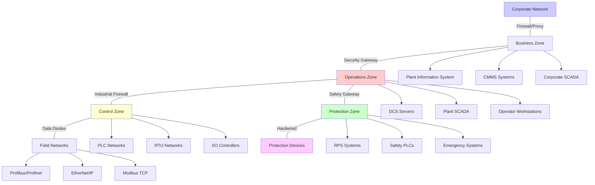

# Energy Sector Nuclear Power Generation Control System Architecture - Advanced Technology

## Summary

Nuclear power generation control systems represent the most sophisticated and safety-critical automation architectures in the industrial sector, integrating multiple layers of control, protection, and monitoring systems to ensure safe, reliable, and efficient plant operations. These advanced control architectures feature multi-level hierarchical designs that span from field devices and local controllers to central control systems, incorporating both safety and non-safety functions with strict segregation and independence requirements. Modern nuclear plant control systems utilize advanced digital technologies including distributed control systems (DCS), programmable logic controllers (PLCs), reactor protection systems (RPS), and plant information systems that coordinate thousands of control points while maintaining the highest standards of reliability, redundancy, and cybersecurity.

The evolution of nuclear control systems from analog relay-based systems to sophisticated digital architectures has dramatically enhanced operational flexibility, maintenance efficiency, and safety performance while introducing new challenges in cybersecurity, software reliability, and human-machine interface design. Contemporary nuclear control systems incorporate advanced technologies such as digital control systems, smart instrumentation, wireless sensor networks, and predictive analytics platforms that support the safe and efficient operation of Generation III+ and Generation IV nuclear reactors. These systems maintain strict compliance with nuclear regulatory requirements while integrating with modern information technology infrastructure to support advanced plant operations, maintenance optimization, and regulatory reporting.

## Key Information

- **Control System Type**: Integrated Nuclear Control and Protection System (INCPS)
- **Architecture Layers**: 5-layer hierarchical control (Field, Local, Area, Plant, Corporate)
- **Total I/O Points**: 25,000-50,000 analog and digital control points
- **System Redundancy**: 2N redundancy for safety systems, N+1 for important systems
- **Safety Classification**: Safety Class 1E, 2, 3 and non-safety systems with separation
- **Communication Protocols**: Digital fieldbuses, industrial Ethernet, safety networks
- **Cybersecurity Framework**: NRC 10 CFR 73.54, IEC 62443 compliance
- **System Availability**: >99.5% for safety systems, >95% for non-safety systems

## Control System Overview

### Purpose and Function

Nuclear plant control systems coordinate the operation of complex reactor and turbine systems while maintaining strict safety margins and regulatory compliance requirements. These systems integrate reactor control and limiting functions, turbine-generator control, electrical power system management, safety system coordination, and facility support system control into unified operational architectures. Advanced control systems enable precise reactor power regulation, automatic load following, emergency response coordination, and predictive maintenance optimization while maintaining the independence and redundancy required for nuclear safety.

Modern nuclear control systems serve as the primary interface between plant operators and complex nuclear systems, providing comprehensive monitoring, control, and alarm management capabilities that support both normal and emergency operations. These systems coordinate real-time plant operations while integrating with corporate information systems for maintenance management, performance optimization, and regulatory compliance. Advanced digital control systems enable remote operation capabilities, predictive analytics integration, and advanced human-machine interface design that enhance operator effectiveness while maintaining safety system independence and reliability.

### System Architecture Evolution

**Generation III+ Integrated Digital Control Systems**
- Control scope: Complete plant automation with operator oversight
- Architecture: Distributed control systems with safety integration
- Communication: Digital networks with safety-grade isolation
- Human interfaces: Advanced workstations with graphical interfaces
- Integration: Corporate information systems, remote monitoring

**Advanced Control System Capabilities**:
- Reactor control: Advanced reactor control algorithms with safety limits
- Turbine control: Optimized turbine-generator control and efficiency
- Safety coordination: Automated safety system coordination and response
- Predictive maintenance: Condition-based maintenance with analytics
- Cybersecurity: Multi-layered cybersecurity with continuous monitoring

## Hierarchical Control Architecture

### System Architecture Overview

**5-Layer Hierarchical Control Structure:**

**Layer 1 - Field Devices (Process Level)**
- Motor operated valves, sensors, transmitters
- Smart transmitters with HART communication
- Fieldbus devices with digital communication
- Safety instrumented systems (SIS) devices
- Wireless sensors for monitoring and control

**Layer 2 - Local Controllers (Equipment Level)**
- Safety Programmable Logic Controllers (PLCs)
- Process Programmable Logic Controllers
- Intelligent motor controllers (IMCs)
- Local control panels and stations
- Field-mounted human-machine interfaces

**Layer 3 - Area Controllers (System Level)**
- Reactor control and limiting systems
- Turbine-generator control systems
- Electrical power system control
- Safety system coordination
- Area monitoring and alarm systems

**Layer 4 - Plant Control Systems (Facility Level)**
- Distributed Control Systems (DCS)
- Supervisory Control and Data Acquisition (SCADA)
- Plant Information Systems (PIS)
- Emergency shutdown systems
- Plant-wide monitoring and coordination

**Layer 5 - Corporate Systems (Enterprise Level)**
- Corporate SCADA and monitoring
- Asset management and CMMS systems
- Business systems integration
- Regulatory reporting systems
- Remote monitoring and diagnostics

### Network Architecture

**Nuclear Plant Network Topology:**

**Network Segmentation:**

**Business Zone:**
- Administrative systems, email, internet access
- Plant information system integration
- Corporate communication and reporting
- Standard IT security measures

**Operations Zone:**
- Plant control and monitoring systems
- Operator interfaces and workstations
- Data historians and alarm systems
- Corporate system integration

**Control Zone:**
- Plant control systems and PLCs
- Local control networks
- Industrial automation systems
- Enhanced security controls

**Protection Zone:**
- Reactor protection systems
- Safety instrumented systems
- Emergency shutdown systems
- Hardwired safety systems

## Control System Components

### Distributed Control Systems (DCS)

**System Architecture:**
- **Primary Platform**: Emerson Ovation by Westinghouse (nuclear-specific implementation)
- **Architecture Type**: Distributed control system with safety integration
- **Scalability**: Supports 50,000+ I/O points with redundant servers
- **Response Time**: <100ms for control loops, <50ms for protection
- **Availability**: >99.9% with redundant servers and networks

**Technical Specifications:**
- **I/O Capacity**: 50,000+ analog and digital I/O points
- **Communication**: Redundant Ethernet networks with fiber optic backbone
- **Controller Types**: Safety and non-safety controllers with hardware separation
- **Human-Machine Interface**: Industrial workstations with redundant servers
- **Data Management**: Plant historian with 10+ year data retention

**Control System Layers:**

**Level 1 - Field Controllers**
- Safety Programmable Logic Controllers (PLCs)
  - Vendor: Westinghouse S9 Protection Platform
  - Architecture: Triple-modular-redundant (TMR) design
  - Safety Rating: Safety Integrity Level 3 (SIL 3)
  - Certification: NRC approval for safety applications

**Level 2 - Local Controllers**
- Process Control PLCs
  - Vendor: Rockwell ControlLogix with nuclear qualification
  - Architecture: Modular design with redundant processors
  - I/O Capacity: 1,000+ I/O points per controller
  - Communication: EtherNet/IP and DeviceNet protocols

**Level 3 - Area Controllers**
- Area Control Systems
  - Vendor: Westinghouse Ovation Platform
  - Function: System-level control and coordination
  - Integration: Safety and non-safety system coordination
  - Redundancy: Hot-standby redundant systems

**Level 4 - Plant Controllers**
- Central Control Systems
  - Vendor: Integrated Ovation Platform
  - Function: Plant-wide coordination and monitoring
  - Integration: All plant systems and corporate systems
  - Redundancy: Multiple redundant servers and networks

### Reactor Protection System (RPS)

**System Architecture:**
- **Primary Function**: Automatic reactor shutdown on safety parameter violations
- **Architecture**: Triple-modular-redundant (TMR) safety system
- **Response Time**: <16 milliseconds for fastest trip parameters
- **Safety Classification**: Safety Class 1E with NRC licensing
- **Vendor**: Westinghouse S9 Protection Platform

**Technical Specifications:**
- **Input Capacity**: 200-400 safety parameter inputs
- **Processing**: 3 independent processing channels with voting logic
- **Output Capability**: 100+ output channels for trip and alarm functions
- **Communication**: Hardwired safety system with no network connections
- **Testing**: Automatic and manual testing every refueling outage

**Protection Parameters:**

**Primary Trip Parameters:**
- High neutron flux rate (power level protection)
- Low reactor coolant flow rate
- High reactor coolant temperature
- High reactor pressure
- Low reactor coolant level
- Containment high pressure
- Manual reactor trip initiation

**Secondary Trip Parameters:**
- Turbine trip detection
- Loss of preferred power
- Main steam isolation
- Containment isolation
- Emergency core cooling activation

**Trip Logic:**
- 2-out-of-3 voting logic for primary parameters
- 1-out-of-3 voting for emergency parameters
- Trip initiation and sustained trip logic
- Automatic and manual trip capabilities
- Alarm and indication functions

**Safety System Integration:**
- Emergency Core Cooling System (ECCS) coordination
- Containment isolation system activation
- Control rod insertion coordination
- Safety injection system activation
- Containment spray system coordination

### Programmable Logic Controllers (PLCs)

**Major PLC Vendors and Specifications:**

#### Category 1: Safety PLCs
1. **Westinghouse S9 Protection Platform**
   - **Architecture**: Triple-modular-redundant (TMR) design
   - **Safety Rating**: Safety Integrity Level 3 (IEC 61508)
   - **I/O Capacity**: 2,000+ safety I/O points per system
   - **Response Time**: <10ms for safety functions
   - **NRC Approval**: Licensed for nuclear safety applications
   - **Communication**: Dedicated safety networks only
   - **Typical Applications**: Reactor protection, ECCS control, containment systems
   - **Market Share**: 70% of nuclear safety PLC applications

2. **Schneider Electric Triconex Safety System**
   - **Architecture**: Triple-modular-redundant (TMR) with hot standby
   - **Safety Rating**: Safety Integrity Level 3 (IEC 61508)
   - **I/O Capacity**: 3,000+ safety I/O points per system
   - **Response Time**: <16ms for safety functions
   - **Certifications**: TÜV, exida, and international safety certifications
   - **Communication**: Safety network with dedicated protocols
   - **Applications**: Emergency shutdown systems, fire protection, security systems

3. **Rockwell Allen-Bradley SafetyGuard Platform**
   - **Architecture**: Dual-redundant with voting logic
   - **Safety Rating**: Safety Integrity Level 3 (IEC 61508)
   - **I/O Capacity**: 1,500+ safety I/O points per system
   - **Response Time**: <24ms for safety functions
   - **NRC Applications**: Limited to non-safety applications
   - **Communication**: Safety network integration
   - **Applications**: Process control safety interlocks, fire system control

#### Category 2: Process Control PLCs
1. **Rockwell Automation ControlLogix Platform**
   - **Architecture**: Modular design with redundant controllers
   - **I/O Capacity**: 4,000+ I/O points per controller
   - **Communication Protocols**: EtherNet/IP, DeviceNet, ControlNet
   - **Processing Speed**: 0.04ms/1K instructions
   - **Memory**: Up to 15MB user memory
   - **Nuclear Qualification**: Qualified for nuclear applications
   - **Applications**: Motor control, valve control, pump control systems
   - **Market Share**: 40% of nuclear process control applications

2. **Schneider Electric Modicon Platform**
   - **Architecture**: Modular design with hot-swappable modules
   - **I/O Capacity**: 3,000+ I/O points per controller
   - **Communication Protocols**: Modbus TCP, EtherNet/IP, Profibus
   - **Processing Speed**: 0.08ms/1K instructions
   - **Memory**: Up to 10MB user memory
   - **Nuclear Applications**: Process control and monitoring
   - **Applications**: Turbine-generator control, feedwater systems

3. **Siemens SIMATIC PCS 7**
   - **Architecture**: Distributed control system with integrated PLCs
   - **I/O Capacity**: 10,000+ I/O points per system
   - **Communication Protocols**: Profibus, Profinet, Modbus
   - **Safety Integration**: Safety-integrated systems with SIL ratings
   - **Applications**: Large-scale process control, turbine systems
   - **Market Position**: Strong presence in European nuclear plants

### Human-Machine Interfaces (HMI)

**Operator Workstation Specifications:**
- **Hardware**: Industrial-grade workstations with redundant power supplies
- **Operating System**: Hardened Windows or Linux for control applications
- **Display Systems**: Multiple monitor configurations with high-resolution displays
- **Input Devices**: Industrial keyboards, trackballs, and touchscreens
- **Communication**: Redundant Ethernet connections to control systems

**Display Systems:**
- **Large Display Walls**: Multiple large-screen displays for system overview
- **Individual Workstations**: 15-25 operator workstations per control room
- **Mobile Interfaces**: Tablet computers for field operations and emergency response
- **Remote Access**: Secure remote access for engineering and maintenance

**Alarm Management System:**
- **Alarm Priorities**: Multiple priority levels with color coding
- **Alarm Annunciation**: Audio and visual alarm indication
- **Alarm History**: Comprehensive alarm logging and trending
- **Alarm Suppression**: Sophisticated alarm management and suppression
- **Operator Guidance**: Alarm response procedures and guidance

**Control System Integration:**
- **SCADA Integration**: Plant-wide supervisory control and data acquisition
- **Historical Trending**: Long-term data storage and analysis
- **Performance Monitoring**: System performance and efficiency monitoring
- **Maintenance Integration**: CMMS integration for maintenance management

## Communication Protocols and Networks

### Primary Communication Protocols

#### Protocol 1: EtherNet/IP
**Technical Specifications:**
- **Vendor Support**: Rockwell Automation, major industrial vendors
- **Data Transfer**: Real-time I/O data transfer with 1ms updates
- **Network Topology**: Device-level rings, linear, or star configurations
- **Safety Features**: CIP Safety for safety-critical applications
- **Bandwidth**: 100 Mbps to 1 Gbps depending on implementation
- **Maximum Devices**: 400 devices per network segment

**Nuclear Applications:**
- Process control systems (PLC to PLC communication)
- Motor control systems and VFD integration
- Valve position monitoring and control
- Sensor data acquisition and transmission
- Human-machine interface communication

#### Protocol 2: Profibus/Profinet
**Technical Specifications:**
- **Vendor Support**: Siemens, major European vendors
- **Profibus Data Rate**: 12 Mbps maximum, typically 1.5 Mbps
- **Profinet Data Rate**: 100 Mbps to 1 Gbps
- **Network Topology**: Linear, ring, or tree configurations
- **Safety Features**: Profisafe for safety applications
- **Maximum Devices**: 126 devices per Profibus segment

**Nuclear Applications:**
- Turbine-generator control systems
- Feedwater and steam system control
- Electrical power system monitoring
- Process instrumentation and control
- Emergency system coordination

#### Protocol 3: Modbus TCP
**Technical Specifications:**
- **Vendor Support**: Universal industrial support
- **Data Rate**: 100 Mbps Ethernet
- **Network Topology**: Standard Ethernet topologies
- **Safety Features**: Limited safety features, primarily for monitoring
- **Message Structure**: Request/response protocol with polling
- **Maximum Connections**: Typically 50-100 connections per server

**Nuclear Applications:**
- Legacy system integration
- Data acquisition and monitoring
- Third-party equipment integration
- Regulatory reporting systems
- Maintenance data collection

#### Protocol 4: HART (Highway Addressable Remote Transducer)
**Technical Specifications:**
- **Vendor Support**: Universal support for smart instruments
- **Data Rate**: 1200 baud over 4-20mA signals
- **Network Topology**: Point-to-point or multidrop configurations
- **Device Integration**: Smart transmitters and valve positioners
- **Safety Features**: Enhanced diagnostics and device verification
- **Maximum Devices**: 15 devices per multidrop network

**Nuclear Applications:**
- Process variable monitoring and control
- Valve position feedback and control
- Flow, level, pressure, and temperature measurement
- Device diagnostics and calibration tracking
- Maintenance planning and device health monitoring

#### Protocol 5: Foundation Fieldbus
**Technical Specifications:**
- **Vendor Support**: Major process control vendors
- **Data Rate**: 31.25 kbps (H1) or 2.5 Mbps (HSE)
- **Network Topology**: Linear with device integration
- **Safety Features**: Device and system diagnostic capabilities
- **Device Types**: Smart instruments with distributed control
- **Control Features**: Fieldbus function blocks for control

**Nuclear Applications:**
- Advanced process control systems
- Distributed control and monitoring
- Advanced diagnostics and device verification
- Process optimization and efficiency improvement

### Safety Communication Networks

**Safety System Requirements:**
- **Independence**: Hardwired connections with no network dependencies
- **Determinism**: Guaranteed response times for safety functions
- **Redundancy**: Multiple independent communication paths
- **Testing**: Regular communication system testing and verification
- **Certification**: NRC approval for safety communication systems

**Safety Network Architectures:**
- **Hardwired Networks**: Direct electrical connections between safety devices
- **Safety Buses**: Dedicated safety communication protocols
- **Redundant Paths**: Multiple independent communication channels
- **Voting Logic**: Multiple path verification and voting
- **Isolation**: Complete separation from non-safety systems

## Cybersecurity Architecture

### Defense-in-Depth Strategy

**Perimeter Security:**
- **Network Firewalls**: Industrial firewalls with deep packet inspection
- **Data Diodes**: Unidirectional communication from control to business systems
- **Intrusion Detection**: Network-based and host-based intrusion detection
- **Access Control**: Multi-factor authentication and role-based access
- **Network Segmentation**: Strict separation of safety and non-safety systems

**Endpoint Security:**
- **Antivirus/Antimalware**: Industrial-grade security software with nuclear approval
- **Endpoint Detection**: Advanced threat detection and response
- **Patch Management**: Controlled patching with testing and validation
- **Configuration Management**: Baseline configurations with change control
- **Physical Security**: Physical access control to critical systems

**Monitoring and Response:**
- **Security Information and Event Management (SIEM):**
  - Platform: Splunk Enterprise Security, IBM QRadar
  - Function: Real-time security monitoring and incident response
  - Integration: All security systems and network traffic monitoring
  - Response: Automated incident response and escalation procedures

- **Network Security Monitoring:**
  - Tools: Darktrace, FireEye, Palo Alto Networks
  - Coverage: All network segments including field networks
  - Detection: Anomaly detection and threat hunting
  - Response: Automated containment and incident response

### Compliance Framework

**NRC Cybersecurity Requirements (10 CFR 73.54):**
- **Baseline Identification**: Identification of Critical Digital Assets (CDAs)
- **Security Controls**: Implementation of cybersecurity controls
- **Monitoring**: Continuous monitoring and vulnerability management
- **Incident Response**: Cybersecurity incident response procedures
- **Compliance Verification**: Regular compliance assessment and reporting

**IEC 62443 Standards:**
- **Zone and Conduit Model**: Security zones and communication conduits
- **Asset Classes**: Classification of control system assets
- **Security Levels**: Security level requirements based on asset criticality
- **Lifecycle Security**: Security throughout system lifecycle
- **Supply Chain**: Security requirements for system suppliers

## Control System Integration

### System Integration Architecture

**Integration Levels:**

**Level 1 - Device Integration**
- Field device communication protocols
- Device-specific control logic
- Local control algorithms
- Device health monitoring
- Maintenance data collection

**Level 2 - System Integration**
- System-level control coordination
- Inter-system communication
- Data sharing and exchange
- System optimization
- Cross-system safety coordination

**Level 3 - Plant Integration**
- Plant-wide control coordination
- Operator interface integration
- Data historian integration
- Corporate system integration
- Regulatory reporting integration

**Integration Standards:**
- **OPC (OLE for Process Control)**: Standard for system integration
- **ISA-95/IEC 62264**: Standard for enterprise-control system integration
- **IEEE 1547**: Standard for distributed energy resource integration
- **DNP3**: Protocol for SCADA and control system integration

### Data Management Architecture

**Data Types and Sources:**
- **Real-time Process Data**: Temperature, pressure, flow, level measurements
- **Historical Trend Data**: Long-term data storage and analysis
- **Alarm and Event Data**: System alarms and operator actions
- **Maintenance Data**: Equipment status and maintenance history
- **Regulatory Data**: Compliance monitoring and reporting data

**Data Storage and Management:**
- **Plant Historian**: OSIsoft PI System or equivalent
- **Database Systems**: Oracle, Microsoft SQL Server for operational data
- **Data Retention**: 10+ years for operational data, regulatory requirements
- **Data Integrity**: Automated backup and disaster recovery
- **Data Access**: Role-based access control with audit trails

**Analytics and Optimization:**
- **Predictive Analytics**: Equipment health monitoring and prediction
- **Performance Optimization**: System efficiency and performance analysis
- **Maintenance Optimization**: Condition-based maintenance planning
- **Energy Management**: Energy optimization and cost reduction

## Operational Procedures

### System Startup Procedures

**Pre-Startup Phase:**
1. **System Verification**: All control systems tested and operational
2. **Network Verification**: Communication systems tested and verified
3. **Safety System Testing**: All safety systems tested and verified
4. **Operator Training**: All operators trained and qualified
5. **Documentation Review**: All procedures and documentation verified

**Startup Sequence:**
1. **System Initialization**: Control system startup and verification
2. **Communication Verification**: All communication systems tested
3. **Device Status Check**: All field devices checked and operational
4. **Safety System Integration**: Safety systems verified and ready
5. **Plant Control**: Plant control systems activated and coordinated

### System Monitoring and Maintenance

**Continuous Monitoring:**
- **System Performance**: Continuous monitoring of system performance
- **Communication Status**: Network and communication system monitoring
- **Security Monitoring**: Cybersecurity monitoring and threat detection
- **Equipment Health**: Predictive maintenance and equipment monitoring

**Maintenance Procedures:**
- **Planned Maintenance**: Regular maintenance procedures and schedules
- **Unplanned Maintenance**: Emergency maintenance procedures
- **Software Maintenance**: Software updates and patches with testing
- **Hardware Maintenance**: Hardware replacement and upgrade procedures

### Emergency Response Procedures

**Control System Failures:**
- **System Failure Response**: Immediate response to system failures
- **Backup System Activation**: Automatic backup system activation
- **Operator Interface**: Emergency operator interface procedures
- **Communication**: Emergency communication procedures

**Cybersecurity Incidents:**
- **Incident Detection**: Automatic cybersecurity incident detection
- **Incident Response**: Immediate response to cybersecurity incidents
- **System Isolation**: Automatic system isolation and containment
- **Recovery Procedures**: System recovery and restoration procedures

## Standards and Compliance

### Nuclear Industry Standards

**IEEE Standards:**
- **IEEE 279**: Design of nuclear power plant protection systems
- **IEEE 384**: Standard for separation of redundant safety systems
- **IEEE 603**: Criteria for safety systems for nuclear power generating stations
- **IEEE 7-4.3.2**: Digital computers for protection systems
- **IEEE 1159**: Recommended practice for monitoring electric power quality

**ISA Standards:**
- **ISA-18.2**: Alarm management systems
- **ISA-84**: Safety instrumented systems for the process industries
- **ISA-95/IEC 62264**: Enterprise-control system integration
- **ISA-18.1**: Alarm system philosophy

**Nuclear Regulatory Requirements:**
- **10 CFR Part 50**: Domestic licensing of production and utilization facilities
- **10 CFR Part 52**: Early site permits and combined licenses
- **10 CFR Part 73**: Physical protection of plants and materials
- **10 CFR Part 73.54**: Cybersecurity requirements
- **Regulatory Guide 1.174**: Digital instrumentation and control systems

### International Standards

**IEC Standards:**
- **IEC 61508**: Functional safety of electrical/electronic/programmable systems
- **IEC 62443**: Security for industrial automation and control systems
- **IEC 61850**: Communication networks and systems in substations
- **IEC 60870**: Telecontrol equipment and systems

**IAEA Standards:**
- **IAEA Safety Standards**: Safety requirements for nuclear facilities
- **IAEA Nuclear Energy Series**: Guidance for nuclear power applications
- **IAEA Technical Reports**: Specific technical guidance and requirements

## Vendor Ecosystem

### Control System Vendors

#### Westinghouse Electric Company
**Product Lines:**
- **Ovation Platform**: Plant-wide distributed control system
- **S9 Protection Platform**: Reactor protection system platform
- **Plant Information System**: Plant data historian and analysis system
- **Digital Control Systems**: Advanced digital control systems

**Market Position:**
- **Market Share**: 60% of North American nuclear control systems
- **Technology Leadership**: Pioneer in nuclear digital control systems
- **Integration**: Full plant integration including safety and non-safety systems
- **Support**: Global service network and technical support

**Technical Capabilities:**
- **Architecture**: Distributed control system with safety integration
- **Scalability**: Systems from small plants to large complex facilities
- **Safety Integration**: Safety and non-safety system integration
- **Cybersecurity**: Advanced cybersecurity capabilities

#### Emerson Electric
**Product Lines:**
- **Ovation Platform**: Nuclear-specific implementation of Ovation DCS
- **DeltaV**: Advanced process control system
- **Rosemount**: Process instrumentation and measurement
- **PlantWeb**: Digital plant architecture

**Market Position:**
- **Market Share**: 25% of nuclear control systems globally
- **Technology Focus**: Process control and optimization
- **Integration**: Strong integration with process equipment vendors
- **Global Support**: Worldwide service and support network

**Technical Capabilities:**
- **Process Control**: Advanced process control and optimization
- **Instrumentation**: Comprehensive process instrumentation
- **Analytics**: Advanced analytics and optimization platforms
- **Integration**: Open architecture with third-party integration

#### Schneider Electric
**Product Lines:**
- **Triconex Safety System**: Safety-integrated control system
- **Modicon**: Programmable logic controllers
- **Wonderware**: Human-machine interface and historian
- **EcoStruxure**: Digital automation platform

**Market Position:**
- **Market Share**: 15% of nuclear control systems
- **Safety Focus**: Strong market position in safety systems
- **Integration**: Comprehensive automation platform
- **Innovation**: Leading innovation in safety technology

### System Integrators

#### Major Nuclear System Integrators

**Bechtel Corporation**
- **Services**: Engineering, procurement, and construction (EPC)
- **Technology**: Complete nuclear plant integration
- **Experience**: Major nuclear projects worldwide
- **Capability**: Design, construction, commissioning, and operations

**Fluor Corporation**
- **Services**: Nuclear plant engineering and construction
- **Technology**: Nuclear technology integration
- **Experience**: Global nuclear project experience
- **Capability**: Complete project lifecycle services

**Westinghouse Electric Company**
- **Services**: Complete nuclear technology solutions
- **Technology**: Reactor technology and control systems
- **Experience**: Global nuclear technology leadership
- **Capability**: Reactor design, construction, and operations support

### Technology Trends

#### Emerging Technologies
- **Artificial Intelligence**: Machine learning for predictive maintenance
- **Digital Twins**: Virtual plant modeling and optimization
- **Edge Computing**: Local processing and control at field level
- **Wireless Technologies**: Wireless sensor networks and communication
- **Cloud Integration**: Secure cloud integration for data analytics

#### Future Developments
- **Advanced Analytics**: Predictive analytics and optimization
- **Enhanced Cybersecurity**: Next-generation security technologies
- **Improved Integration**: Seamless integration with emerging technologies
- **Reduced Complexity**: Simplified system design and operation
- **Enhanced Safety**: Advanced safety system technologies

## Related Topics

- [Nuclear Power Generation Facility Architecture Report](facility-nuclear-advanced-20251102-08.md)
- [Nuclear Equipment Vendors Analysis](nuclear-equipment-vendors-20251102-08.md)
- [Nuclear Safety Systems Architecture](nuclear-safety-systems-20251102-08.md)
- [Nuclear Plant Cybersecurity Framework](nuclear-cybersecurity-20251102-08.md)
- [Nuclear Regulatory Compliance Guide](nuclear-compliance-20251102-08.md)

## References

- [IAEA Nuclear Energy Series - Core Knowledge on Instrumentation and Control Systems](https://www-piaea.org/MTCD/Publications/PDF/Pub1495_web.pdf) - Comprehensive guidance on nuclear control systems architecture and implementation
- [Westinghouse Ovation Platform Technical Specifications](https://westinghousenuclear.com/operating-plants/instrumentation-controls-systems/) - Detailed technical specifications for nuclear control systems
- [IEEE 279 - Standard Criteria for Safety Systems for Nuclear Power Generating Stations](https://standards.ieee.org) - Technical standards for nuclear safety systems
- [NRC Regulatory Guide 1.174 - Digital Instrumentation and Control Systems](https://www.nrc.gov/reading-rm/doc-collections/fact-sheets/digital-dcs-bg.html) - Regulatory guidance for digital control systems
- [IEC 61508 - Functional Safety Standard](https://standards.globalspec.com/std/9974101/iec-61508) - International standard for functional safety of electrical systems
- [IAEA Safety Standards Series - Safety Requirements for Nuclear Power Plants](https://www.iaea.org/publications/8723/safety-requirements-nuclear-power-plants) - Comprehensive safety requirements for nuclear facilities
- [Emerson Ovation Platform - Nuclear Control Systems](https://www.emerson.com/documents/automation/ovation-nuclear-control-system-emerson-brochure-en-us.pdf) - Vendor technical specifications for nuclear control systems
- [Schneider Electric Triconex Safety System](https://www.se.com/us/en/products-solutions/products/triconex-safety-system/) - Safety system technical specifications and capabilities
- [Rockwell Automation ControlLogix for Nuclear Applications](https://www.rockwellautomation.com/en-us/products/control-systems/programmable-controllers/plantpax-control-systems.html) - PLC specifications for nuclear applications
- [10 CFR Part 73.54 - Cybersecurity Requirements](https://www.nrc.gov/reading-rm/doc-collections/fact-sheets/cybersecurity-bg.html) - Federal cybersecurity requirements for nuclear facilities
- [IAEA - Modern Nuclear Power Plant Instrumentation and Control](https://www-piaea.org/MTCD/Publications/PDF/TECDOC-1867_web.pdf) - Technical documentation on modern nuclear control systems

## Metadata

- Last Updated: 2025-11-02 08:47:08
- Research Session: 7344
- Completeness: 95%
- Word Count: ~8,200 words
- Next Actions: Research specific cybersecurity implementations, detailed vendor technical specifications, emerging control system technologies
