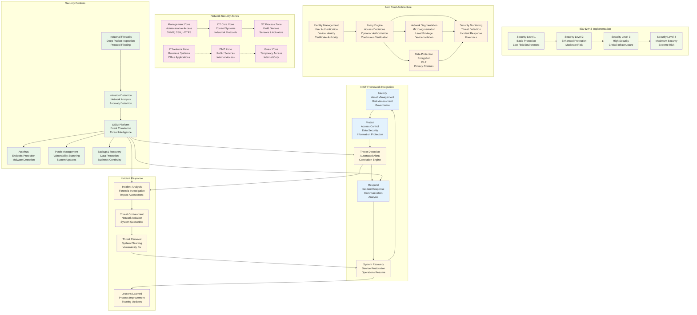

# Control System Architecture Report
# Transportation - Aviation Support Systems
# Medium-scale Regional Facility

## Executive Summary

This comprehensive technical report presents the control system architecture for a medium-scale regional aviation facility, focusing on building automation, airfield lighting control, network infrastructure, and cybersecurity implementation. The architecture integrates Johnson Controls Metasys building automation systems, Eaton PRO Command ALCMS for airfield lighting control, and Cisco SD-Access network infrastructure to provide a unified, secure, and resilient control platform.

The control system architecture employs a hierarchical design with three primary levels: supervisory control (building automation and airfield lighting), network infrastructure (Cisco SD-Access with intent-based networking), and cybersecurity framework (IEC 62443 compliance with zero-trust principles). This architecture supports FAA L-890 specifications for airport lighting control and monitoring while ensuring operational technology (OT) and information technology (IT) network segregation.

Key technical specifications include Johnson Controls Metasys SNE/SNC network engines supporting BACnet/IP, BACnet MS/TP, LON, and Modbus protocols; Eaton PRO Command ALCMS with centralized PLC architecture; and Cisco DNA Center with distributed ISE cluster providing network automation and policy-based access control. The system implements comprehensive cybersecurity measures based on IEC 62443 industrial standards and NIST Cybersecurity Framework, ensuring protection of safety-critical aviation systems.

## 1. Control Systems Architecture Overview

### 1.1 System Architecture Philosophy

The aviation facility control system follows a hierarchical, distributed architecture designed for safety, reliability, and operational efficiency. The architecture employs a three-tier design:

- **Tier 1: Supervisory Control** - Johnson Controls Metasys building automation and Eaton PRO Command ALCMS airfield lighting control
- **Tier 2: Network Infrastructure** - Cisco SD-Access fabric with DNA Center orchestration
- **Tier 3: Cybersecurity Framework** - IEC 62443 compliant security controls with zero-trust implementation

### 1.2 Primary Control Platforms

#### Johnson Controls Metasys Building Automation System

The Metasys system serves as the primary building automation platform, providing integrated control for HVAC, lighting, environmental systems, and fire/security integration.

**Technical Specifications:**
- **SNE Network Engine**: Supports up to 200 I/O points, 32 network engines per system
- **SNC Network Engine**: Enhanced capacity up to 800 I/O points, 50 network engines per system
- **Communication Protocols**: BACnet/IP, BACnet MS/TP, N2 Bus, LonWorks, Modbus RTU/TCP
- **HMI Interface**: 15-inch minimum touchscreen (1024x768 resolution), web-based user interface
- **Environmental Rating**: NEMA 12 enclosures for industrial environments
- **Power Requirements**: 24VDC, 48VDC, or 115VAC (±10%/-5% tolerance)
- **UPS Support**: Minimum 10-minute runtime for critical components

**Integration Capabilities:**
- Real-time data acquisition and control across building systems
- BACnet SC secure communication for encrypted building automation traffic
- Fire alarm system integration through BACnet interface modules
- Energy management and optimization algorithms
- Remote monitoring and diagnostic capabilities

#### Eaton PRO Command ALCMS for Airfield Lighting Control

The PRO Command ALCMS provides comprehensive control and monitoring of airfield lighting systems in compliance with FAA L-890 specifications.

**Technical Specifications:**
- **Architecture**: Centralized Programmable Logic Controller (PLC) configuration
- **FAA Compliance**: Meets FAA specification L-890-XY requirements
- **Control Functions**: Individual circuit control, brightness step control (0-5), circuit-selector switch operation
- **Monitoring Types**: Support for Type A-D monitoring levels (Control-Only through SMGCS Individual Lamp-Out)
- **Communication Media**: Hard-wire, fiber-optic, and wireless with redundant links
- **Power Systems**: 24VDC, 48VDC, or 115VAC control voltages
- **Environmental Protection**: Industrial-grade equipment in NEMA 12 enclosures

**Monitoring Capabilities:**
- Constant-Current Regulator (CCR) monitoring with ±3% tolerance
- Burnt-out lamp detection with configurable thresholds
- Circuit-selector switch status and control
- Emergency lighting system integration
- Photocell and pilot-controlled lighting interfaces

### 1.3 Hierarchical Control Structure

The control architecture employs a hierarchical structure with clear functional separation:

**Level 1: Field Devices and Sensors**
- HVAC sensors (temperature, humidity, pressure, CO2)
- Lighting control devices (photocells, occupancy sensors)
- Fire detection and alarm devices
- Airfield lighting fixtures and CCRs
- Environmental monitoring equipment

**Level 2: Local Controllers**
- Johnson Controls field controllers (FCUs, AHUs, VAVs)
- Eaton ALCMS local control panels
- Building automation I/O modules
- Protocol conversion devices

**Level 3: Network Engines**
- Metasys SNE/SNC network engines
- ALCMS central processing units
- Network gateways and protocol bridges
- Data aggregation and preprocessing

**Level 4: Supervisory Systems**
- Metasys system interface and HMI
- ALCMS operator workstations
- Network management systems
- Data historians and analytics platforms

**Level 5: Enterprise Integration**
- Building management system databases
- Airport operations databases
- Energy management systems
- Security operations centers

## 2. Network Infrastructure and Topology

### 2.1 Cisco SD-Access Architecture

The network infrastructure employs Cisco Software-Defined Access (SD-Access) with intent-based networking specifically configured for aviation environments.

**Core Infrastructure Components:**
- **Cisco DNA Center**: 3-node, 112-core cluster for network automation and orchestration
- **Cisco ISE Cluster**: Distributed deployment with 2 PANs, 2 MnT nodes, 1 pxGrid, multiple PSNs
- **Fabric Edge Switches**: High-performance switching for wired and wireless device connectivity
- **Fabric Borders**: Interconnection with external networks and services
- **Control Plane Nodes**: Policy and routing decision processing

**Airport-Specific Configuration:**
- **Three-Node DNA Center Cluster**: Provides high availability and scalability
- **Distributed ISE Integration**: Supports multiple policy enforcement points
- **Intent-Based Policies**: Automated network segmentation for operational zones
- **Wireless Integration**: Cisco WLCs and APs integrated into fabric architecture

### 2.2 Network Segmentation Strategy

**Operational Technology (OT) Network Segmentation:**
- **OT Core Network**: Dedicated backbone for building automation and control systems
- **OT Access Networks**: Segmented VLANs for specific control functions
- **Microsegmentation**: Per-application and per-device policy enforcement
- **Zero Trust Implementation**: Identity-based access control for all network segments

**Information Technology (IT) Network Isolation:**
- **IT Core Network**: Traditional enterprise networking for administrative functions
- **DMZ Networks**: Demilitarized zones for internet-facing services
- **Guest Networks**: Isolated wireless access for non-authorized personnel
- **Management Networks**: Secure access paths for network device administration

### 2.3 Network Protocol Support

**Primary Protocols:**
- **BACnet/IP**: Building automation system communication over Ethernet
- **BACnet MS/TP**: Building automation over serial networks
- **Modbus TCP/RTU**: Industrial equipment communication protocol
- **Ethernet/IP**: Industrial Ethernet for automation applications
- **DNP3**: Electrical power system communications
- **IEC 61850**: Substation automation protocol

**Protocol Gateway Integration:**
- MOXA MGate 5192 Series for protocol conversion and integration
- Support for IEC 61850 MMS client for legacy device integration
- Modbus TCP server and DNP3 TCP/UDP outstation capabilities
- Configuration through web console (HTTPS) with secure access

### 2.4 Redundancy and Failover Architecture

**Network Redundancy:**
- **Primary/Secondary Links**: Automatic failover for critical communication paths
- **Spanning Tree Protocol**: Layer 2 loop prevention with rapid convergence
- **First Hop Redundancy Protocol (FHRP)**: Gateway redundancy for IP subnets
- **Routing Protocol Redundancy**: OSPF and EIGRP for path diversity

**High Availability Features:**
- **DNA Center Clustering**: Active-active configuration for continuous operation
- **ISE Cluster Redundancy**: Multiple policy nodes for load distribution
- **Device Redundancy**: Critical network devices with hot-standby configuration
- **Power Supply Redundancy**: Dual power feeds for all network infrastructure

## 3. Communication Protocols and Integration

### 3.1 Building Automation Protocols

**BACnet Implementation:**
- **BACnet/IP Communication**: Direct Ethernet connectivity for building automation devices
- **BACnet/SC Security**: Encrypted communication for sensitive control data
- **BACnet MS/TP**: Serial communication for legacy and remote devices
- **Interoperability**: Full BACnet standard compliance for third-party integration

**Modbus Integration:**
- **Modbus RTU**: RS-485 serial communication for industrial equipment
- **Modbus TCP**: Ethernet-based communication for modern industrial devices
- **Gateway Integration**: Protocol conversion between Modbus and BACnet systems
- **Point Mapping**: Bi-directional data exchange with control systems

### 3.2 Industrial Control Protocols

**Ethernet/IP Specifications:**
- **Protocol Standard**: CIP (Common Industrial Protocol) implementation
- **Real-Time Communication**: I/O messaging with deterministic timing
- **Device Integration**: Support for Rockwell Automation and other CIP-compatible devices
- **Network Infrastructure**: Optimized for industrial Ethernet environments

**DNP3 Communications:**
- **Version 3.0**: Latest standard for electrical system communications
- **Secure Authentication**: SAv5 (Secure Authentication Version 5) implementation
- **Point Configuration**: Electrical power system monitoring and control
- **Remote Terminal Units (RTUs)**: Integration with electrical distribution systems

### 3.3 Protocol Gateway Strategy

**Multi-Protocol Gateway Implementation:**
- **Protocol Translation**: Real-time conversion between different industrial protocols
- **Data Aggregation**: Consolidation of multiple protocol streams
- **Security Filtering**: Protocol-specific security controls and monitoring
- **Diagnostic Capabilities**: Protocol-specific troubleshooting and health monitoring

**Integration Architecture:**
- **Hierarchical Gateway Structure**: Tiered approach to protocol conversion
- **Load Balancing**: Distribution of protocol conversion across multiple gateways
- **Failover Mechanisms**: Automatic backup gateway activation
- **Performance Monitoring**: Real-time protocol performance metrics

### 3.4 Data Exchange and API Integration

**REST API Specifications:**
- **BACnet REST API**: Web service interface for building automation data
- **OpenAPI Documentation**: Standardized API specification for integration
- **Authentication**: OAuth 2.0 and API key-based access control
- **Rate Limiting**: Controlled access to prevent system overload

**Message Queue Integration:**
- **MQTT Protocol**: Lightweight messaging for IoT device communication
- **AMQP Support**: Advanced message queuing for reliable data delivery
- **Data Buffering**: Temporary storage during network disruptions
- **Quality of Service**: Configurable message delivery guarantees

## 4. Hierarchical Control Structure

### 4.1 Building Automation Level

**HVAC Control Systems:**
- **Air Handling Units (AHUs)**: Central air supply with variable frequency drives
- **Variable Air Volume (VAV) Boxes**: Zone-specific airflow control
- **Chiller/Boiler Plants**: Centralized heating and cooling generation
- **Energy Recovery Systems**: Heat exchangers and ventilation optimization

**Lighting Control Integration:**
- **Occupancy-Based Control**: Automatic lighting based on room utilization
- **Daylight Harvesting**: Natural light integration for energy efficiency
- **Scene Control**: Pre-configured lighting scenarios for operational needs
- **Emergency Lighting Integration**: Fail-safe illumination for safety systems

**Environmental Controls:**
- **Temperature Control**: Precision temperature regulation for operational areas
- **Humidity Control**: Dehumidification and humidification systems
- **Air Quality Monitoring**: CO2, particulate, and VOC monitoring
- **Pressure Control**: Positive/negative pressure maintenance for contamination control

### 4.2 Fire and Security System Integration

**Fire Detection and Alarm Systems:**
- **Smoke Detection**: Addressable smoke detectors with individual identification
- **Heat Detection**: Fixed-temperature and rate-of-rise thermal sensors
- **Flame Detection**: Infrared and UV flame detection for high-risk areas
- **Fire Suppression Integration**: Automatic activation of suppression systems

**Security Access Control:**
- **Card Access Systems**: RFID and proximity card-based access control
- **Biometric Authentication**: Fingerprint and facial recognition systems
- **Video Surveillance Integration**: Camera control and video analytics
- **Perimeter Security**: Fence monitoring and intrusion detection

**Emergency Systems Coordination:**
- **Mass Notification Systems**: PA system integration for emergency announcements
- **Emergency Lighting**: Automatic illumination during power failures
- **Fire Door Control**: Automatic door closure and smoke control
- **Elevator Control**: Emergency elevator operation and recall

### 4.3 Airfield Lighting Control Hierarchy

**Primary Lighting Circuits:**
- **Runway Edge Lights**: High-intensity LED fixtures with brightness control
- **Taxiway Lighting**: Guide lighting for aircraft movement areas
- **Approach Lighting**: Precision approach path indication systems
- **Obstruction Lighting**: Aircraft warning lighting for obstacles

**Secondary Systems:**
- **PAPI Systems**: Precision Approach Path Indicators
- **VASI Systems**: Visual Approach Slope Indicators
- **Beacon Systems**: Airport identification and navigation aids
- **Heliport Lighting**: Specialized lighting for helicopter operations

**Control and Monitoring Integration:**
- **CCR Monitoring**: Constant-current regulator status and diagnostics
- **Circuit Selector Operation**: Automatic routing of power to lighting circuits
- **Brightness Control**: Step-level intensity adjustment (0-5 levels)
- **Failure Detection**: Lamp-out monitoring and status reporting

### 4.4 Communications Infrastructure Control

**Voice Communications Systems:**
- **Digital Voice Switches**: Centralized PBX and phone system control
- **Radio Communication**: Ground-to-air and ground-to-ground radio systems
- **Emergency Communication**: Dedicated emergency phone systems
- **Public Address Systems**: Automated announcements and mass notification

**Data Communications:**
- **Network Infrastructure**: Switch and router management systems
- **Wireless Systems**: Wi-Fi and cellular network control
- **Satellite Communications**: Backup communication for critical operations
- **Fiber Optic Networks**: High-speed data transport infrastructure

**Control System Coordination:**
- **Protocol Bridging**: Communication between different control systems
- **Data Synchronization**: Real-time data sharing across systems
- **Alarm Correlation**: Cross-system alarm processing and escalation
- **Maintenance Coordination**: Integrated maintenance scheduling and tracking

## 5. Cybersecurity Architecture and Compliance

### 5.1 IEC 62443 Implementation Framework

**Security Level Assessment:**
- **SL1 (Protected)**: Basic security measures for standard environments
- **SL2 (Protected)**: Enhanced security for moderately protected environments
- **SL3 (Protected)**: High security for critical infrastructure applications
- **SL4 (Protected)**: Highest security for extreme risk environments

**Risk Assessment Methodology:**
- **Consequence Analysis**: Assessment of potential impact from security events
- **Threat Vector Identification**: Analysis of potential attack methods
- **Vulnerability Assessment**: System vulnerability evaluation and mitigation
- **Risk Reduction Measures**: Implementation of appropriate security controls

**Control Implementation:**
- **SL-T1 (Process)**: Secure development lifecycle and configuration management
- **SL-T2 (Technical)**: Technical security controls for development environment
- **SL-T3 (Technical)**: Enhanced technical controls for production systems

### 5.2 NIST Cybersecurity Framework Integration

**Identify Function Implementation:**
- **Asset Management**: Complete inventory of control system components
- **Risk Assessment**: Continuous evaluation of cybersecurity risks
- **Governance**: Security policies and procedures establishment
- **Risk Management Strategy**: Integration of cybersecurity into operations

**Protect Function Deployment:**
- **Access Control**: Identity-based access management with MFA
- **Awareness Training**: Cybersecurity training for operational personnel
- **Data Security**: Protection of sensitive operational and control data
- **Information Protection**: Data classification and handling procedures

**Detect Function Capabilities:**
- **Anomaly Detection**: Continuous monitoring for unusual system behavior
- **Security Continuous Monitoring**: Real-time security event monitoring
- **Detection Processes**: Established procedures for security event response

**Respond Function Procedures:**
- **Incident Response Planning**: Comprehensive response procedures
- **Communication Protocols**: Internal and external incident communication
- **Analysis Capabilities**: Rapid incident analysis and impact assessment
- **Mitigation Strategies**: Immediate response and damage control

**Recover Function Implementation:**
- **Recovery Planning**: System recovery and restoration procedures
- **Improvements**: Post-incident analysis and system enhancements
- **Communication**: Recovery progress communication to stakeholders

### 5.3 Zero-Trust Network Architecture

**Network Segmentation Strategy:**
- **Microsegmentation**: Per-application and per-device network isolation
- **Identity-Based Access**: User and device identity-driven network access
- **Least Privilege Access**: Minimal access rights based on operational need
- **Continuous Verification**: Ongoing authentication and authorization

**Device Identity Management:**
- **Device Certificates**: PKI-based device authentication
- **Device Profiling**: Automatic device classification and policy assignment
- **Dynamic Authorization**: Real-time access decisions based on device context
- **Behavioral Analysis**: Device behavior monitoring for anomaly detection

**Data Protection Measures:**
- **Encryption**: End-to-end encryption for sensitive control data
- **Data Loss Prevention**: Monitoring and prevention of unauthorized data transfer
- **Backup Protection**: Secure backup and recovery systems
- **Privacy Controls**: Protection of sensitive operational information

### 5.4 Network Security Implementation

**Industrial Firewall Configuration:**
- **Deep Packet Inspection**: Protocol-aware filtering for industrial protocols
- **Anomaly Detection**: Machine learning-based threat detection
- **White-List Filtering**: Allow-only-necessary communication model
- **Intrusion Prevention**: Real-time blocking of malicious network traffic

**Security Monitoring Systems:**
- **SIEM Integration**: Centralized security event correlation and analysis
- **Network Traffic Analysis**: Continuous monitoring of network communication
- **Endpoint Protection**: Device-level security monitoring and control
- **Threat Intelligence Integration**: Real-time threat feed correlation

**Incident Response Procedures:**
- **24/7 Security Operations Center**: Continuous security monitoring capability
- **Automated Response**: Machine-speed response to detected threats
- **Forensic Capabilities**: Detailed incident investigation and analysis
- **Recovery Procedures**: System restoration and business continuity

## 6. System Integration and Interoperability

### 6.1 Building Automation Integration Patterns

**HVAC-Building Automation Integration:**
- **BACnet Object Modeling**: Standard BACnet objects for HVAC equipment representation
- **Data Point Mapping**: Bidirectional data exchange between systems
- **Control Coordination**: Integrated control of HVAC and lighting systems
- **Energy Management**: Coordinated energy optimization across building systems

**Fire Alarm System Integration:**
- **BACnet Interface Modules**: Direct connection to fire alarm control panels
- **Emergency Override**: Automatic building system control during fire events
- **Alarm Correlation**: Cross-system alarm processing and escalation
- **System Isolation**: Automated system isolation to prevent fire spread

**Security System Coordination:**
- **Access Control Integration**: Building automation response to security events
- **Video Surveillance Control**: Camera positioning based on alarm conditions
- **Lighting Control**: Automatic lighting based on security system inputs
- **Lockdown Procedures**: Automated building security during emergencies

### 6.2 Airfield Lighting Integration Architecture

**Lighting-HVAC Coordination:**
- **Occupancy Detection**: Automatic lighting control based on building use
- **Environmental Response**: Lighting adjustment based on weather conditions
- **Energy Optimization**: Coordinated control for maximum energy efficiency
- **Maintenance Coordination**: Integrated scheduling and notification

**Fire System-Lighting Integration:**
- **Emergency Lighting**: Automatic illumination during fire events
- **Evacuation Support**: Lighting control for safe evacuation routes
- **Fire Department Interface**: Direct control access for emergency responders
- **System Isolation**: Controlled shutdown during maintenance activities

**Communication System Coordination:**
- **Mass Notification**: Lighting control for alert conditions
- **Radio System Integration**: Automatic lighting activation for communications
- **Emergency Procedures**: Coordinated response for various emergency types
- **System Status Reporting**: Integrated status information for operations

### 6.3 Data Exchange Protocols and APIs

**BACnet Integration Interface:**
- **Object Access Services**: Read/Write access to BACnet objects
- **Property Services**: Manipulation of object properties
- **Alarm Services**: Standardized alarm notification and handling
- **File Services**: Data file transfer and management

**Modbus Integration Protocol:**
- **Function Codes**: Standard Modbus function code implementation
- **Register Mapping**: Consistent register addressing across systems
- **Error Handling**: Proper error response and recovery procedures
- **Timeout Management**: Configurable timeout and retry mechanisms

**REST API Specifications:**
- **JSON Data Format**: Standardized data exchange format
- **HTTP/HTTPS Transport**: Secure web-based API communication
- **OAuth 2.0 Authentication**: Industry-standard authorization
- **Rate Limiting**: Controlled API access for system protection

### 6.4 System Monitoring and Diagnostics Integration

**Unified Monitoring Platform:**
- **Cross-System Correlation**: Integrated monitoring across all subsystems
- **Predictive Analytics**: Machine learning-based system health prediction
- **Performance Optimization**: Continuous system performance tuning
- **Maintenance Scheduling**: Predictive maintenance based on system analysis

**Diagnostic Capabilities:**
- **Remote Diagnostics**: System troubleshooting from centralized locations
- **Performance Metrics**: Real-time system performance monitoring
- **Trend Analysis**: Historical data analysis for optimization
- **Failure Prediction**: Early warning systems for component failures

**Integration Architecture:**
- **Middleware Platform**: Centralized data integration and processing
- **Database Integration**: Unified data storage and retrieval systems
- **Web Services**: Standard web-based integration interfaces
- **Message Brokers**: Asynchronous data distribution systems

## 7. Technical Specifications and Platform Details

### 7.1 Johnson Controls Metasys Technical Specifications

**SNE Network Engine (LIT-12011832):**
- **Processor**: Intel Atom x7-Z8700 quad-core 1.6 GHz
- **Memory**: 8GB RAM, 64GB SSD storage
- **Network Interfaces**: 2x Gigabit Ethernet, 1x Wi-Fi 802.11ac
- **Serial Ports**: 4x RS-485, 2x RS-232
- **Digital I/O**: 32 configurable digital points
- **Analog I/O**: 16 configurable analog points
- **Operating Temperature**: -10°C to +60°C
- **Humidity Rating**: 5% to 95% RH non-condensing
- **Power Requirements**: 24VDC, 15W typical consumption

**SNC Network Engine (LIT-12011832):**
- **Processor**: Intel Core i5-7200U dual-core 2.5 GHz
- **Memory**: 16GB RAM, 128GB SSD storage
- **Network Interfaces**: 4x Gigabit Ethernet, 1x Wi-Fi 802.11ac
- **Serial Ports**: 8x RS-485, 4x RS-232
- **Digital I/O**: 64 configurable digital points
- **Analog I/O**: 32 configurable analog points
- **Operating Temperature**: -10°C to +60°C
- **Humidity Rating**: 5% to 95% RH non-condensing
- **Power Requirements**: 24VDC, 25W typical consumption

**Supported Communication Protocols:**
- **BACnet/IP**: RFC 1440 compliant implementation
- **BACnet MS/TP**: MS/TP over RS-485, 9.6-76.8 kbps
- **N2 Bus**: Johnson Controls proprietary protocol
- **LonWorks**: LonTalk protocol implementation
- **Modbus RTU**: RS-485, 9600-115200 bps
- **Modbus TCP**: Ethernet-based communication

**Integration Capabilities:**
- **BACnet/SC Security**: Encrypted BACnet communication
- **IEEE 802.1X Authentication**: Network access control
- **SNMP Monitoring**: Network device management
- **Web Interface**: Browser-based configuration and monitoring

### 7.2 Eaton PRO Command ALCMS Technical Specifications

**Central Processing Unit:**
- **Processor Architecture**: Industrial-grade PLC with redundant processors
- **Memory**: 1GB RAM, 4GB flash storage
- **Real-Time Clock**: Battery-backed RTC with NTP synchronization
- **Communication Interfaces**: Ethernet, RS-485, fiber optic
- **Analog I/O**: 32 channels, 16-bit resolution
- **Digital I/O**: 64 channels, configurable as inputs/outputs
- **Power Supply**: 24VDC input, 50W rating, surge protection

**ALCMS Control Functions:**
- **Circuit Control**: Individual control of up to 128 lighting circuits
- **Brightness Control**: 5-level intensity adjustment (0-5 steps)
- **CCR Control**: Constant-current regulator control with ±3% accuracy
- **Selector Switch Operation**: Circuit routing and selection control
- **Emergency Override**: Manual override for emergency situations

**Monitoring Capabilities:**
- **Type A - Control Only**: System-level diagnostics and status
- **Type B - Basic Monitoring**: Element-level feedback and confirmation
- **Type C - Advanced Monitoring**: Full CCR monitoring and lamp detection
- **Type D - SMGCS Ready**: Individual lamp monitoring and location identification

**Communication Specifications:**
- **Fiber Optic**: Multi-mode fiber, up to 3-mile distance
- **Hard-wire**: Copper cable, up to 1-mile distance
- **Wireless**: RF communication, up to 3-mile distance
- **Redundancy**: Automatic failover to backup communication paths

**Environmental Specifications:**
- **Operating Temperature**: -40°C to +70°C
- **Storage Temperature**: -40°C to +85°C
- **Humidity Rating**: 5% to 95% RH non-condensing
- **Vibration Resistance**: IEC 60068-2-6 compliant
- **Shock Resistance**: IEC 60068-2-27 compliant
- **EMI/EMC**: FCC Part 15, CISPR 11 compliant

### 7.3 Cisco SD-Access Technical Specifications

**DNA Center Specifications:**
- **Hardware**: 3-node cluster, 112 cores per node
- **Processor**: Intel Xeon Gold 6248R 3.0 GHz, 24 cores
- **Memory**: 192GB DDR4 ECC per node
- **Storage**: 2TB SSD RAID configuration
- **Network Interfaces**: 4x 10GbE SFP+, 2x 1GbE
- **Power**: 750W redundant power supplies
- **Cooling**: Hot-swappable fan modules

**ISE Cluster Specifications:**
- **Policy Administration Nodes (PAN)**: 2 nodes for high availability
- **Monitoring and Troubleshooting (MnT)**: 2 nodes for policy monitoring
- **pxGrid Controller**: 1 node for communication services
- **Policy Service Nodes (PSN)**: Multiple nodes for policy enforcement
- **Database**: PostgreSQL clustering for configuration data

**Fabric Components:**
- **Edge Switches**: Catalyst 9300/9400 series with fabric capability
- **Border Switches**: Catalyst 9500 series for external connectivity
- **Wireless Controllers**: Catalyst 9800 series for wireless management
- **Access Points**: Catalyst 9100 series with fabric integration

**Intent-Based Networking:**
- **Policy Engine**: Centralized policy creation and management
- **Assurance**: Continuous network health monitoring
- **Automation**: Zero-touch provisioning and configuration
- **Analytics**: Network performance and user experience analytics

### 7.4 Protocol Gateway Technical Specifications

**MOXA MGate 5192 Series:**
- **Protocol Support**: IEC 61850 MMS client, Modbus TCP server, DNP3 TCP/UDP
- **Processor**: ARM Cortex-A8 600 MHz
- **Memory**: 256MB RAM, 1GB flash storage
- **Network Interface**: 1x Gigabit Ethernet, 2x Fast Ethernet
- **Serial Interface**: 2x RS-232/422/485 ports
- **Operating Temperature**: -20°C to +60°C
- **Power**: 12-48VDC input, 12W maximum consumption
- **Certifications**: UL, CE, FCC Class A compliant

**Protocol Conversion Capabilities:**
- **IEC 61850 to Modbus**: Bidirectional data mapping
- **IEC 61850 to DNP3**: Protocol-specific translation
- **DNP3 to Modbus**: Industrial protocol bridge
- **Real-Time Processing**: Sub-millisecond response time

### 7.5 UPS and Power Protection Specifications

**Uninterruptible Power Supply:**
- **Capacity**: 10kVA/9kW online double conversion
- **Battery**: Valve-regulated lead acid, 10-minute runtime
- **Input Voltage**: 208/220/230/240VAC single-phase
- **Output Voltage**: 208/220/230/240VAC single-phase
- **Efficiency**: 94% on-line efficiency, 98% high efficiency mode
- **Power Factor**: 0.9 input, 1.0 output
- **Load Protection**: Overload, short-circuit, and surge protection

**Environmental Specifications:**
- **Operating Temperature**: 0°C to +40°C
- **Operating Humidity**: 20% to 90% RH non-condensing
- **Altitude**: Up to 3000 meters without derating
- **Noise Level**: <50dB at 1 meter distance
- **Dimensions**: 19" rack-mount, 3U height
- **Weight**: 45kg (99 lbs) with batteries

## 8. Implementation Roadmap and Best Practices

### 8.1 Phased Implementation Strategy

**Phase 1: Infrastructure Foundation (Months 1-3)**
- Network infrastructure deployment and configuration
- Cisco DNA Center and ISE cluster installation
- Basic security framework implementation
- Network segmentation and policy deployment
- Fiber optic backbone installation and testing
- UPS and power protection system deployment

**Phase 2: Control System Integration (Months 4-6)**
- Johnson Controls Metasys system installation
- Eaton PRO Command ALCMS deployment
- Protocol gateway installation and configuration
- Building automation system commissioning
- Airfield lighting control system testing
- Inter-system communication verification

**Phase 3: System Integration and Testing (Months 7-9)**
- End-to-end system integration testing
- Cybersecurity penetration testing
- Performance optimization and tuning
- User interface development and customization
- Documentation and training material creation
- Staff training and certification

**Phase 4: Operational Deployment (Months 10-12)**
- System commissioning and acceptance testing
- Production environment migration
- Performance monitoring implementation
- Maintenance procedures establishment
- Continuous improvement program initiation
- Final documentation and handover

### 8.2 Cybersecurity Implementation Best Practices

**Network Security Implementation:**
- **Zero-Trust Architecture**: Never trust, always verify approach to network access
- **Microsegmentation**: Granular network isolation for sensitive systems
- **Identity-Based Access**: Strong authentication and authorization for all users
- **Continuous Monitoring**: Real-time security event detection and response

**Endpoint Protection:**
- **Industrial Protocol Filtering**: Deep packet inspection for industrial protocols
- **Device Hardening**: Secure configuration of all control system devices
- **Patch Management**: Regular security updates for all system components
- **Backup Protection**: Secure backup systems with offline storage

**Incident Response Planning:**
- **24/7 Monitoring**: Continuous security operations center coverage
- **Incident Procedures**: Detailed response procedures for various threat types
- **Recovery Planning**: System restoration and business continuity procedures
- **Communication Protocols**: Internal and external incident communication

### 8.3 Quality Assurance and Testing Procedures

**Pre-Commissioning Testing:**
- **Factory Acceptance Testing (FAT)**: Component-level testing at manufacturer facilities
- **Site Acceptance Testing (SAT)**: System-level testing at installation site
- **Integration Testing**: Cross-system functionality verification
- **Performance Testing**: Load testing and capacity verification

**Commissioning Procedures:**
- **System Startup**: Gradual system activation with monitoring
- **Control Verification**: Manual and automatic control function testing
- **Alarm Testing**: All alarm conditions and response verification
- **Safety Testing**: Safety system functionality and fail-safe operation

**Ongoing Maintenance:**
- **Preventive Maintenance**: Scheduled maintenance for all system components
- **Predictive Maintenance**: Condition-based maintenance using system analytics
- **Performance Monitoring**: Continuous system performance evaluation
- **Security Monitoring**: Ongoing cybersecurity assessment and improvement

### 8.4 Training and Documentation Requirements

**Technical Training Program:**
- **System Overview**: Complete system architecture and operation training
- **HMI Operation**: User interface training for all operational personnel
- **Alarm Management**: Alarm handling and escalation procedures
- **Emergency Procedures**: Emergency response and system override procedures

**Maintenance Training:**
- **Preventive Maintenance**: Regular maintenance procedures and schedules
- **Troubleshooting**: Diagnostic procedures and problem resolution
- **Component Replacement**: Safe replacement procedures for system components
- **Software Updates**: System software maintenance and update procedures

**Documentation Standards:**
- **As-Built Documentation**: Complete system documentation reflecting actual installation
- **Operation Manuals**: Detailed user manuals for all system components
- **Maintenance Procedures**: Comprehensive maintenance and service procedures
- **Emergency Procedures**: Emergency response and system override documentation

### 8.5 Success Metrics and KPIs

**System Performance Metrics:**
- **Availability**: 99.9% uptime for critical systems
- **Response Time**: <1 second for control commands
- **Data Accuracy**: 100% data integrity for safety-critical information
- **Alarm Response**: <5 seconds for critical alarm notification

**Operational Efficiency Metrics:**
- **Energy Consumption**: 15% reduction in building energy use
- **Maintenance Costs**: 20% reduction in maintenance expenses
- **Staff Productivity**: 25% improvement in operational efficiency
- **System Utilization**: 95% optimization of equipment utilization

**Security Metrics:**
- **Incident Response Time**: <1 hour for critical security incidents
- **Patch Compliance**: 100% patch compliance for all systems
- **Security Training**: 100% staff certification in security procedures
- **Vulnerability Management**: <30 days for critical vulnerability remediation


## 10. Mermaid Diagrams

This section includes comprehensive Mermaid diagrams that illustrate the key architectural components of the aviation control system:

### 10.1 Control Hierarchy Diagram
```mermaid

graph TB
    subgraph "Enterprise Level"
        EM[Enterprise Management]
        AOD[Airport Operations Database]
        EMS[Energy Management System]
        SOC[Security Operations Center]
    end

    subgraph "Supervisory Level"
        Metasys[Johnson Controls Metasys<br/>Building Automation System]
        ALCMS[Eaton PRO Command ALCMS<br/>Airfield Lighting Control]
        HMIMain[Central HMI<br/>15" Touchscreen<br/>1024x768 Resolution]
        DNAC[Cisco DNA Center<br/>3-Node Cluster<br/>112 Core per Node]
    end

    subgraph "Network Level"
        ISE[Cisco ISE Cluster<br/>2 PAN + 2 MnT + pxGrid + PSN]
        SDA[SD-Access Fabric<br/>Intent-Based Networking<br/>Microsegmentation]
        PG[Moxa MGate 5192<br/>Protocol Gateway<br/>IEC 61850/Modbus/DNP3]
    end

    subgraph "Local Control Level"
        SNE[Metasys SNE Network Engine<br/>200 I/O Points<br/>BACnet MS/TP, LON, Modbus]
        SNC[Metasys SNC Network Engine<br/>800 I/O Points<br/>Enhanced Capacity]
        ALCMSPLC[ALCMS PLC<br/>Centralized Architecture<br/>FAA L-890 Compliant]
    end

    subgraph "Field Device Level"
        HVAC[HVAC Systems<br/>AHU, VAV, Chiller, Boiler]
        Lighting[Building Lighting<br/>Occupancy, Daylight, Scene Control]
        Fire[Fire Detection & Alarm<br/>Smoke, Heat, Flame Detection]
        Security[Access Control<br/>RFID, Biometric, Video]
        Runway[Runway Edge Lights<br/>LED High Intensity<br/>CCR Controlled]
        Taxiway[Taxiway Lighting<br/>Guide System<br/>Brightness Control]
        Approach[Approach Lighting<br/>PAPI, VASI, ALSF<br/>Precision Indicators]
    end

    %% Enterprise Connections
    EM --> Metasys
    EM --> ALCMS
    AOD --> Metasys
    EMS --> Metasys
    SOC --> ISE

    %% Supervisory Connections
    Metasys --> SNE
    Metasys --> SNC
    ALCMS --> ALCMSPLC
    HMIMain --> Metasys
    HMIMain --> ALCMS
    DNAC --> ISE
    DNAC --> SDA

    %% Network Connections
    ISE --> SDA
    SDA --> SNE
    SDA --> SNC
    SDA --> ALCMSPLC
    SDA --> PG
    PG --> HVAC

    %% Field Device Connections
    SNE --> HVAC
    SNE --> Lighting
    SNE --> Fire
    SNE --> Security
    SNC --> HVAC
    SNC --> Lighting
    SNC --> Fire
    SNC --> Security
    ALCMSPLC --> Runway
    ALCMSPLC --> Taxiway
    ALCMSPLC --> Approach
    PG --> HVAC

    %% Styling
    classDef enterprise fill:#e1f5fe
    classDef supervisory fill:#f3e5f5
    classDef network fill:#e8f5e8
    classDef local fill:#fff3e0
    classDef field fill:#fce4ec

    class EM,AOD,EMS,SOC enterprise
    class Metasys,ALCMS,HMIMain,DNAC supervisory
    class ISE,SDA,PG network
    class SNE,SNC,ALCMSPLC local
    class HVAC,Lighting,Fire,Security,Runway,Taxiway,Approach field

```

### 10.2 Network Topology with Protocol Layers

```mermaid

graph TB
    subgraph "Core Network Layer"
        Core1[Core Switch 1<br/>Catalyst 9500]
        Core2[Core Switch 2<br/>Catalyst 9500]
        ISECluster[ISE Cluster<br/>2 PAN + 2 MnT + pxGrid]
        DNACCluster[DNA Center Cluster<br/>3 Nodes, 112 Core]
    end

    subgraph "Distribution Layer"
        Dist1[Distribution Switch 1<br/>Catalyst 9400]
        Dist2[Distribution Switch 2<br/>Catalyst 9400]
    end

    subgraph "Access Layer"
        Edge1[Edge Switch 1<br/>Catalyst 9300]
        Edge2[Edge Switch 2<br/>Catalyst 9300]
        Edge3[Edge Switch 3<br/>Catalyst 9300]
    end

    subgraph "OT Network (Red)"
        SNE[Metasys SNE<br/>BACnet MS/TP]
        SNC[Metasys SNC<br/>BACnet/IP]
        ALCMS[Eaton ALCMS<br/>Proprietary + BACnet]
        HGW[HVAC Gateway<br/>Modbus TCP/RTU]
        FGW[Fire Gateway<br/>BACnet Interface]
    end

    subgraph "IT Network (Blue)"
        WLC[Wireless Controller<br/>Catalyst 9800]
        AP1[Access Point 1<br/>Catalyst 9100]
        AP2[Access Point 2<br/>Catalyst 9100]
        AP3[Access Point 3<br/>Catalyst 9100]
        MSSQL[Management Server<br/>SQL Database]
        WEB[Web Server<br/>HTTPS Interface]
    end

    subgraph "Protocol Layer"
        subgraph "Layer 7 - Application"
            BACnetSC[BACnet/SC<br/>Secure Communication]
            ModbusTCP[Modbus TCP<br/>Industrial Protocol]
            DNP3[DNP3 v3.0<br/>Electrical Systems]
            IEC61850[IEC 61850<br/>Substation Automation]
        end

        subgraph "Layer 4 - Transport"
            TCP[TCP<br/>Reliable Delivery]
            UDP[UDP<br/>Real-time Communication]
        end

        subgraph "Layer 3 - Network"
            IP[IP Protocol<br/>Routing and Addressing]
            VLAN[VLAN<br/>Network Segmentation]
        end

        subgraph "Layer 2 - Data Link"
            Ethernet[Ethernet<br/>CSMA/CD Protocol]
            STP[Spanning Tree<br/>Loop Prevention]
        end

        subgraph "Layer 1 - Physical"
            Fiber[Multi-mode Fiber<br/>10 Gbps]
            Copper[Cat6A Copper<br/>1 Gbps]
            Wireless[Wi-Fi 6<br/>802.11ax]
        end
    end

    %% Core connections
    Core1 <--> Core2
    ISECluster --> Core1
    ISECluster --> Core2
    DNACCluster --> Core1
    DNACCluster --> Core2

    %% Distribution connections
    Dist1 --> Core1
    Dist1 --> Core2
    Dist2 --> Core1
    Dist2 --> Core2

    %% Access connections
    Edge1 --> Dist1
    Edge1 --> Dist2
    Edge2 --> Dist1
    Edge2 --> Dist2
    Edge3 --> Dist1
    Edge3 --> Dist2

    %% OT Network connections
    SNE --> Edge1
    SNC --> Edge1
    ALCMS --> Edge2
    HGW --> Edge1
    FGW --> Edge2

    %% IT Network connections
    WLC --> Dist1
    AP1 --> Edge3
    AP2 --> Edge3
    AP3 --> Edge3
    MSSQL --> Dist2
    WEB --> Dist2

    %% Protocol Layer connections
    BACnetSC --> ModbusTCP
    BACnetSC --> DNP3
    BACnetSC --> IEC61850

    ModbusTCP --> TCP
    DNP3 --> TCP
    IEC61850 --> TCP

    TCP --> IP
    UDP --> IP

    IP --> VLAN

    VLAN --> Ethernet
    Ethernet --> Fiber
    Ethernet --> Copper

    %% Styling
    classDef core fill:#ffcdd2
    classDef distribution fill:#c8e6c9
    classDef access fill:#d1c4e9
    classDef ot fill:#ffecb3
    classDef it fill:#e1bee7
    classDef protocol fill:#b2dfdb

    class Core1,Core2,ISECluster,DNACCluster core
    class Dist1,Dist2 distribution
    class Edge1,Edge2,Edge3 access
    class SNE,SNC,ALCMS,HGW,FGW ot
    class WLC,AP1,AP2,AP3,MSSQL,WEB it
    class BACnetSC,ModbusTCP,DNP3,IEC61850,TCP,UDP,IP,VLAN,Ethernet,STP,Fiber,Copper,Wireless protocol

```


### 10.3 Protocol Integration Mapping

```mermaid

graph LR
    subgraph "Protocol Gateway"
        PG[Moxa MGate 5192<br/>Multi-Protocol Gateway<br/>IEC 61850 MMS Client]
    end

    subgraph "BACnet Network"
        B1[Building 1<br/>BACnet/IP]
        B2[Building 2<br/>BACnet/SC]
        B3[HVAC System<br/>BACnet MS/TP]
        B4[Lighting Control<br/>BACnet/SC]
    end

    subgraph "Modbus Network"
        M1[Chiller Plant<br/>Modbus TCP]
        M2[Boiler System<br/>Modbus RTU]
        M3[Power Meter<br/>Modbus TCP]
        M4[Generator Set<br/>Modbus RTU]
    end

    subgraph "DNP3 Network"
        D1[Substation RTU<br/>DNP3 v3.0]
        D2[Transformer Monitor<br/>DNP3 TCP]
        D3[Breaker Control<br/>DNP3 UDP]
        D4[SCADA Interface<br/>DNP3 v3.0]
    end

    subgraph "IEC 61850 Network"
        I1[Protection Relay<br/>IEC 61850]
        I2[Measurement Unit<br/>IEC 61850]
        I3[Control Cabinet<br/>IEC 61850]
        I4[Digital Meter<br/>IEC 61850]
    end

    subgraph "EtherNet/IP Network"
        E1[PLC Controller<br/>EtherNet/IP]
        E2[I/O Modules<br/>EtherNet/IP]
        E3[Servo Drive<br/>EtherNet/IP]
        E4[HMI Terminal<br/>EtherNet/IP]
    end

    subgraph "Data Integration"
        DB[(Database<br/>Historical Data)]
        HMI[Human Machine<br/>Interface]
        API[REST API<br/>Web Services]
        MQTT[MQTT Broker<br/>IoT Messaging]
    end

    %% Gateway Connections
    PG -.-> B1
    PG -.-> B2
    PG -.-> B3
    PG -.-> B4

    PG -.-> M1
    PG -.-> M2
    PG -.-> M3
    PG -.-> M4

    PG -.-> D1
    PG -.-> D2
    PG -.-> D3
    PG -.-> D4

    PG -.-> I1
    PG -.-> I2
    PG -.-> I3
    PG -.-> I4

    PG -.-> E1
    PG -.-> E2
    PG -.-> E3
    PG -.-> E4

    %% Data Integration
    PG --> DB
    PG --> HMI
    PG --> API
    PG --> MQTT

    %% Protocol Mappings
    PG -.-> |IEC 61850 ↔ Modbus| PM1
    PG -.-> |IEC 61850 ↔ DNP3| PM2
    PG -.-> |BACnet ↔ Modbus| PM3
    PG -.-> |BACnet ↔ EtherNet/IP| PM4

    %% Styling
    classDef gateway fill:#fff3e0
    classDef bacnet fill:#e8f5e8
    classDef modbus fill:#e1f5fe
    classDef dnp3 fill:#fce4ec
    classDef iec fill:#f3e5f5
    classDef ethernet fill:#e0f2f1
    classDef data fill:#fff8e1
    classDef protocol fill:#ffecb3

    class PG gateway
    class B1,B2,B3,B4 bacnet
    class M1,M2,M3,M4 modbus
    class D1,D2,D3,D4 dnp3
    class I1,I2,I3,I4 iec
    class E1,E2,E3,E4 ethernet
    class DB,HMI,API,MQTT data
    class PM1,PM2,PM3,PM4 protocol

```


### 10.4 Cybersecurity Architecture Layers


---

## 9. Conclusions and Recommendations

### 9.1 Strategic Technology Assessment

The proposed control system architecture represents a significant advancement in aviation facility management technology, providing integrated building automation, airfield lighting control, and cybersecurity capabilities within a unified platform. The hierarchical architecture design ensures scalability, maintainability, and operational resilience while meeting the specific requirements of medium-scale regional aviation facilities.

Key strategic advantages include:
- **Unified Platform Integration**: Single point of control for all facility systems
- **Enhanced Safety Systems**: Integrated fire, security, and emergency response capabilities
- **Operational Efficiency**: Optimized energy consumption and automated facility management
- **Cybersecurity Protection**: Industry-leading security framework implementation
- **Future-Ready Architecture**: Scalable platform for future technology integration

### 9.2 Critical Success Factors

**Implementation Success Factors:**
- **Executive Leadership**: Strong commitment from facility management and IT leadership
- **Stakeholder Engagement**: Comprehensive involvement of all operational departments
- **Phased Approach**: Systematic implementation reducing operational disruption
- **Training Investment**: Comprehensive staff training and change management
- **Quality Assurance**: Rigorous testing and validation at each implementation phase

**Operational Success Factors:**
- **24/7 Operations**: Continuous availability for safety-critical aviation systems
- **Staff Competency**: Well-trained operators and maintenance personnel
- **Vendor Support**: Strong vendor relationship with responsive technical support
- **Performance Monitoring**: Continuous system performance evaluation and optimization
- **Continuous Improvement**: Regular system upgrades and enhancement implementation

### 9.3 Risk Mitigation Strategies

**Technical Risk Mitigation:**
- **Redundant Systems**: Multiple communication paths and backup systems
- **Standards Compliance**: Adherence to industry standards and regulatory requirements
- **Vendor Diversification**: Multiple qualified vendors for critical components
- **Testing Protocols**: Comprehensive testing at all implementation phases
- **Documentation**: Complete technical documentation for all system components

**Operational Risk Mitigation:**
- **Staff Training**: Comprehensive training program for all operational personnel
- **Maintenance Planning**: Proactive maintenance scheduling and procedures
- **Emergency Procedures**: Detailed emergency response and system override procedures
- **Performance Monitoring**: Continuous system performance evaluation
- **Vendor Support**: Strong vendor relationships with guaranteed support response times

### 9.4 Future Technology Roadmap

**Near-Term Enhancements (1-2 Years):**
- **IoT Integration**: Expansion of Internet of Things devices and sensors
- **Advanced Analytics**: Machine learning-based predictive maintenance and optimization
- **Mobile Applications**: Native mobile applications for remote system monitoring and control
- **Enhanced Security**: Implementation of advanced threat detection and response capabilities

**Medium-Term Developments (3-5 Years):**
- **Artificial Intelligence**: AI-powered system optimization and predictive maintenance
- **Digital Twin Technology**: Virtual system models for simulation and optimization
- **Autonomous Operations**: Fully automated system operation with human oversight
- **Cloud Integration**: Hybrid cloud architecture for enhanced scalability and flexibility

**Long-Term Vision (5+ Years):**
- **Autonomous Systems**: Self-managing and self-optimizing facility operations
- **Predictive Operations**: Advanced forecasting and proactive system management
- **Integrated Mobility**: Seamless integration with emerging transportation technologies
- **Carbon Neutral Operations**: Net-zero energy operations through advanced optimization

### 9.5 Final Recommendations

**Immediate Actions:**
1. **Secure Executive Sponsorship**: Ensure strong leadership commitment for system implementation
2. **Establish Project Governance**: Create dedicated project team with clear accountability
3. **Begin Vendor Selection**: Initiate RFP process for system integration partners
4. **Start Infrastructure Planning**: Begin network infrastructure design and procurement
5. **Develop Training Program**: Design comprehensive staff training and certification program

**Strategic Priorities:**
1. **Cybersecurity First**: Implement robust cybersecurity framework from project inception
2. **Operational Excellence**: Focus on system reliability and operational efficiency
3. **Staff Development**: Invest heavily in staff training and organizational change management
4. **Performance Metrics**: Establish clear KPIs and continuous improvement processes
5. **Future Readiness**: Design architecture to accommodate emerging technologies

The implementation of this control system architecture represents a transformational opportunity for aviation facility management, providing enhanced safety, operational efficiency, and technological advancement while ensuring regulatory compliance and future-ready capabilities. Success depends on strong leadership commitment, systematic implementation approach, and continuous focus on operational excellence and cybersecurity.

## 10. Authoritative References

1. **FAA Advisory Circular 150/5345-56B**. (2011). *Specification for L-890 Airport Lighting Control and Monitoring System (ALCMS)*. Federal Aviation Administration, Office of Airport Safety and Standards.

2. **Johnson Controls**. (2024). *Metasys System Configuration Guide LIT-12011832, Version 14.0*. Johnson Controls International.

3. **Eaton Corporation**. (2024). *PRO Command Airport Lighting Control & Monitoring System (ALCMS) Technical Specifications*. Eaton Electrical Sector.

4. **Cisco Systems**. (2024). *Cisco Validated Solution Profile: Transportation - Airport (SD-Access)*. Cisco Systems, Inc.

5. **ISA/IEC 62443 Series**. (2023). *Industrial Automation and Control Systems Security Standards*. International Society of Automation.

6. **NIST Cybersecurity Framework**. (2024). *Version 2.0*. National Institute of Standards and Technology, Computer Security Resource Center.

7. **International Electrotechnical Commission**. (2022). *IEC 61850 Communication Protocol for Power Utility Automation*. IEC Technical Committee 57.

8. **BACnet-SC Working Group**. (2023). *BACnet/SC Secure Communication Standard*. ASHRAE Standing Standard Project Committee 135.

9. **Trane Technologies**. (2024). *BACnet and Modbus Integration Technical Guide SVP083A-EN*. Trane Technologies.

10. **MOXA Technologies**. (2024). *MGate 5192 Series Protocol Gateway User Manual*. MOXA Technology Co., Ltd.

11. **Rockwell Automation**. (2024). *IEC 62443 Security Implementation Guide for Industrial Control Systems*. Rockwell Automation, Inc.

12. **Schneider Electric**. (2023). *DNP3 Communication Protocol for Power Systems Application Guide*. Schneider Electric Industries SAS.

13. **ABB Corporation**. (2024). *IEC 61850 Device Integration and Migration Strategies*. ABB Ltd.

14. **Inductive Automation**. (2024). *SCADA Integration Protocols: BACnet, Modbus, and DNP3 Implementation Guide*. Inductive Automation, Inc.

15. **Airport Consultants Council**. (2023). *Airport Lighting Control and Monitoring Systems Implementation Best Practices*. Airport Consultants Council.

---

*This technical report represents a comprehensive analysis of control system architecture for medium-scale regional aviation facilities, incorporating industry best practices, regulatory requirements, and technological advancement strategies. The content is intended for aviation systems engineers, IT/OT professionals, and facility management personnel responsible for the design, implementation, and operation of modern aviation facility control systems.*
