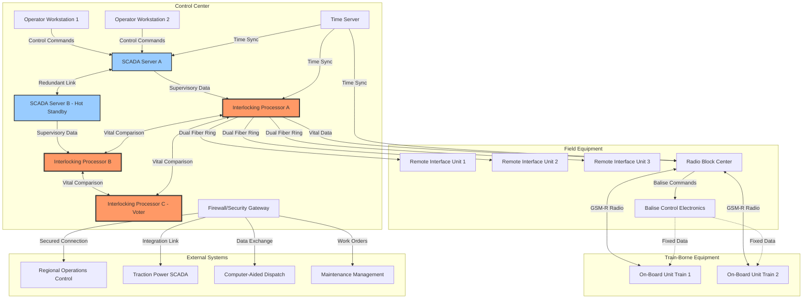
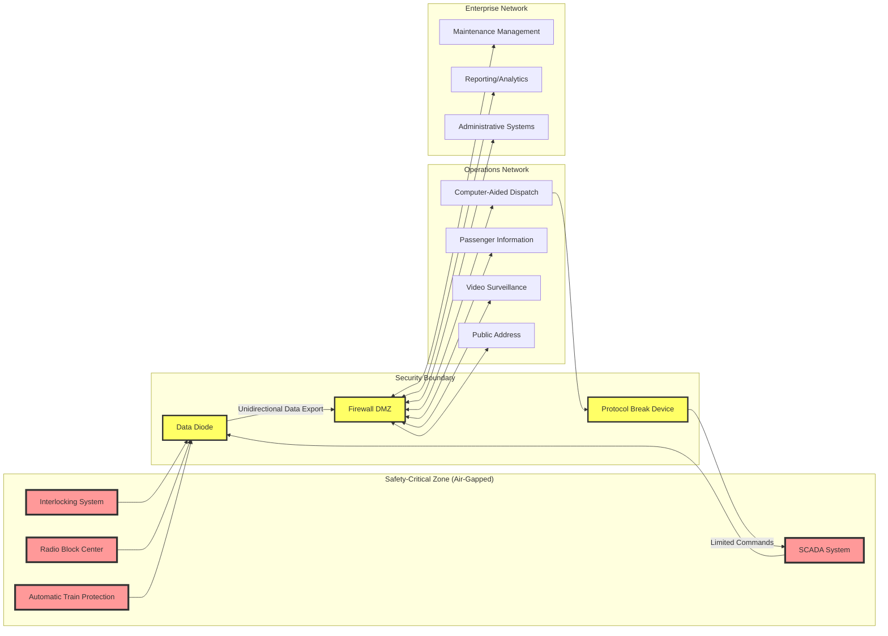

# Rail Signaling Facility Architecture

## Summary

Rail signaling facilities represent the critical nerve centers of modern railway operations, encompassing interlocking control centers, railway operations control centers (ROCCs), signal maintenance depots, and trackside equipment installations. These facilities manage the safe and efficient movement of trains through sophisticated control systems that coordinate signals, switches, track circuits, and train detection systems. As railways transition from traditional relay-based signaling to digital, communications-based train control (CBTC) and European Train Control System (ETCS) implementations, signaling facilities have evolved into highly complex operational environments integrating safety-critical computing systems, redundant communication networks, and advanced human-machine interfaces.

The architecture of rail signaling facilities is governed by stringent safety standards including CENELEC railway standards (EN-50126, EN-50128, EN-50129) and IEEE 1474 for CBTC systems. These facilities must achieve Safety Integrity Level 4 (SIL-4) certification, the highest level required for systems where failure could result in catastrophic consequences. Modern signaling facilities incorporate multiple layers of redundancy, fail-safe design principles, and comprehensive monitoring systems to ensure continuous operation even under component failure scenarios. The physical layout typically includes multiple control rooms with hot-standby configurations, equipment rooms housing interlocking processors and communication systems, battery rooms for uninterruptible power supply, and dedicated HVAC systems to maintain optimal operating conditions for sensitive electronic equipment.

Contemporary rail signaling facilities increasingly serve as hubs for centralized traffic control (CTC), managing hundreds of route-miles from a single location through sophisticated visualization systems and automated conflict detection algorithms. These facilities integrate diverse subsystems including automatic train protection (ATP), automatic train operation (ATO), automatic train supervision (ATS), computer-aided dispatch (CAD), and passenger information systems. The operational architecture emphasizes defense-in-depth security principles, with air-gapped safety-critical networks, multi-factor authentication for operators, comprehensive audit logging, and cyber-physical security measures protecting both IT and operational technology (OT) domains.

The evolution toward predictive maintenance, artificial intelligence-assisted traffic optimization, and increased automation is transforming signaling facilities into data-intensive operations centers. Modern facilities incorporate big data analytics platforms processing real-time telemetry from thousands of field devices, machine learning models for predictive failure analysis, and digital twin simulations for operational planning. This architectural transformation requires careful integration of legacy relay-based systems with modern IP-based control networks while maintaining the uncompromising safety standards that have made railways one of the safest modes of transportation globally.

## Key Information

**Primary Function**: Safe routing and movement authority for railway traffic
**Safety Certification**: SIL-4 (EN-50129), Federal Railroad Administration (FRA) approved
**Control Span**: 5-500 route-miles per facility depending on centralization level
**Availability Requirement**: 99.999% (5.26 minutes downtime/year maximum)
**Typical Staffing**: 2-12 operators per shift for major control centers
**Equipment Lifecycle**: 20-40 years for interlocking systems, 5-15 years for control systems
**Investment Scale**: $5M-$150M depending on facility scope and control territory

## Facility Overview

### Purpose and Function

Rail signaling facilities serve as the command and control infrastructure ensuring safe separation between trains, conflict-free route setting, and efficient traffic flow across railway networks. These facilities house the vital interlocking logic systems that prevent conflicting train movements, the communications equipment enabling train-to-wayside data exchange, and the operator interfaces for traffic management and emergency intervention. The fundamental purpose encompasses four core functions: safety assurance through proven interlocking logic, capacity optimization through efficient route management, real-time traffic supervision with conflict detection, and integration with adjacent control systems including traction power, telecommunications, and maintenance management.

Modern signaling facilities increasingly incorporate centralized traffic control (CTC) capabilities, consolidating control of extensive railway territories that previously required multiple local control points. This centralization improves operational efficiency through coordinated scheduling, reduces staffing requirements, and enables system-wide optimization strategies. Facilities range from local interlocking cabins controlling a single junction to regional operations control centers managing thousands of signals, hundreds of switches, and complex terminal operations across major metropolitan areas.

### Scale and Capacity

Rail signaling facility scale varies dramatically based on operational scope:

**Local Interlocking Facility**: Controls 2-8 route miles, 15-40 signals, 8-20 switches. Typical footprint 800-2,000 square feet. Found at yard throats, junction points, and intermediate locations. May be unstaffed with remote supervision from regional control center.

**Terminal/Station Control Center**: Manages 10-25 route miles, 60-150 signals, 30-80 switches. Facility size 3,000-8,000 square feet. Handles complex station approach trackwork, platform assignments, and dense traffic patterns. Staffed 24/7 with 2-6 operators per shift.

**Regional Operations Control Center (ROCC)**: Supervises 100-500 route miles, 400-2,000 signals, 200-800 switches. Facility 15,000-40,000 square feet. Centralized control for mainline territories with multiple subdivisions. Large video wall displays, 4-12 operator positions, 24/7 staffing with supervision and maintenance coordination.

**Transit Authority Operations Control Center (OCC)**: Manages entire transit system, 50-200 route miles, 200-800 signals for heavy rail systems. Purpose-built facilities of 20,000-60,000 square feet. Integrates train control, traction power, fare collection, passenger information, emergency coordination, and maintenance dispatch. Staffing 15-40 personnel per shift across multiple operational departments.

### Facility Variants

**Relay-Based Interlocking Facilities**: Traditional technology using electromagnetic relays for logic functions. Highly reliable, long-lived (40+ years typical), but inflexible and maintenance-intensive. Still common in legacy installations. Relay rooms house thousands of relays in standardized relay racks. Proven safety through physical interlocking prevents conflicting movements even under component failure.

**Solid-State/Computer-Based Interlocking Facilities**: Modern facilities using microprocessor-based interlocking systems meeting SIL-4 certification requirements. Dual or triple modular redundant processors with continuous comparison. More flexible for operational changes, reduced physical footprint, but requires robust cyber-security measures. Equipment rooms contain interlocking processor cabinets, communications equipment, and power distribution systems.

**ETCS/ERTMS Control Centers**: Facilities supporting European Train Control System Level 2/3 operations. Radio Block Centers (RBC) manage movement authorities via GSM-R communications. Reduced trackside equipment with centralized intelligence. Integration with existing national signaling systems during transition period creates complex hybrid facilities.

**CBTC Operations Control Centers**: Communications-Based Train Control for urban transit systems. Continuous train-to-wayside data exchange enables moving block operation and automatic train operation (ATO). Operations control center provides automatic train supervision (ATS) with operator oversight and manual intervention capabilities. High-capacity display systems showing real-time train positions with sub-second update rates.

**Maintenance and Testing Facilities**: Specialized facilities for signal equipment maintenance, testing, and repair. Component test benches, signal equipment workshops, spare parts inventory. Training simulators replicating operational control systems for operator qualification and emergency procedure drills. Increasingly important as in-service testing requirements increase with digital systems.

## Physical Architecture

### Site Layout and Requirements

Rail signaling facilities require strategic geographic positioning optimizing communication latency to field equipment while ensuring physical security and resilience against natural hazards. Site selection considers proximity to controlled territory (minimizing fiber optic cable runs), access to reliable commercial power with diverse feed paths, adequate space for equipment expansion, and separation from flood zones or other high-risk areas. Security perimeters typically employ multiple layers: outer fence at property boundary (often 8-10 feet chain link with barbed wire), vehicle barriers preventing unauthorized approach, and controlled access points with credential verification.

Modern facilities incorporate blast-resistant design principles for control room structures, with reinforced concrete construction, minimal window area, and protected HVAC air intakes. Equipment rooms housing critical interlocking processors utilize raised floor systems (typically 18-24 inches) for cable management and HVAC distribution. False ceiling spaces (12-18 inches) accommodate cable trays, fire suppression piping, and lighting. Room layouts emphasize hot-aisle/cold-aisle configurations for equipment racks optimizing cooling efficiency.

Facility zoning separates functional areas:

**Control Room Zone**: Climate-controlled 72-76°F year-round, positive pressure to reduce dust infiltration. Acoustic treatment for 24/7 occupied spaces. Raised floor for cable routing to operator consoles. Video wall mounting structures with proper viewing distances (minimum 2× wall height). Emergency lighting, exit signage, and fire suppression systems. Separate HVAC from equipment rooms to maintain different temperature set points.

**Equipment Room Zone**: Precision cooling maintaining 68-75°F, <60% relative humidity. Dedicated HVAC with N+1 redundancy. Hot-aisle containment for high-density equipment racks. Structured cable management with overhead trays and under-floor routing. EPO (Emergency Power Off) stations at exits. Continuous air quality monitoring detecting smoke, temperature excursions, humidity anomalies.

**Power Infrastructure Zone**: Battery rooms (separate due to hydrogen off-gassing risk), UPS equipment rooms, generator yards with fuel storage, power distribution switchgear. Battery rooms require dedicated ventilation preventing hydrogen accumulation (>4% concentration explosive), temperature control (77°F optimal for lead-acid batteries), and acid-resistant flooring. Generator installations include sound attenuation enclosures, automatic transfer switches (ATS), and day tanks plus bulk fuel storage for extended operation (typically 72+ hours full load).

**Support Spaces**: Administrative offices, break rooms, training areas, equipment storage, loading dock for equipment delivery. Separate from operational areas for security segregation.

### Building Design and Construction

Rail signaling facilities emphasize mission-critical infrastructure principles with design life exceeding 50 years for structural elements. Construction employs reinforced concrete or structural steel framing, CMU or precast concrete wall systems, and TPO or EPDM roofing with extensive insulation (R-30+ roof, R-19+ walls) for thermal efficiency. Floor loading capacity in equipment rooms typically specified at 150-250 lbs/sq ft to accommodate heavy equipment racks and battery systems.

Seismic design follows Importance Factor 1.5 (essential facilities per IBC) with structures designed to remain operational following design-basis earthquakes. Lightning protection systems with air terminals, down conductors, and grounding networks protect sensitive electronics. Comprehensive grounding infrastructure includes isolated technical ground plane under raised floors, bonded to building ground at single point to prevent ground loops while ensuring safety.

**Control Room Design**: Operator console layouts based on ergonomic standards (ANSI/HFES 100) with adjustable height workstations, multi-monitor arms, and task lighting. Console spacing allows operators to stand, move, and observe colleague workstations during coordination. Large-format video walls utilize LED or LCD tiling (1.8-2.5mm pixel pitch) displaying schematic track diagrams, CCTV feeds, and system status information. Acoustic design targets NC-35 (Noise Criteria) for 24/7 comfort.

**Equipment Room Infrastructure**: Equipment racks in standard 19-inch width, 42-48U height, with threaded mounting rails. Rack PDUs (Power Distribution Units) providing metered power monitoring per rack. Structured cabling systems with fiber optic backbones and copper distribution. Cable ladder trays sized at 40-60% fill factor allowing expansion. Intelligent PDUs enabling remote power cycling of individual equipment. Rack arrangements allowing front access for all equipment with minimum 4-foot wide aisles.

**Environmental Systems**: Precision CRAC (Computer Room Air Conditioning) units maintaining ±2°F control. N+1 redundancy standard, N+2 for mission-critical facilities. Chilled water systems with redundant chillers, pumps, and cooling towers. Glycol-based free cooling economizers reducing energy consumption when ambient conditions permit. Continuous monitoring via BMS (Building Management System) with alarming to facility management and operations staff. Fire suppression using clean agent systems (FM-200, Novec 1230) in equipment rooms avoiding water damage to electronics.

### Major System Components

**Interlocking Control Systems**: The safety kernel of signaling facilities. Modern computer-based interlocking (CBI) systems utilize triple modular redundant (TMR) processors continuously comparing outputs through voter circuits. Any discrepancy triggers fail-safe shutdown with all signals displaying stop aspects. Interlocking vital logic encoded in formally verified software meeting EN-50128 SIL-4 requirements. Systems include:

- Vital relay interface modules translating between solid-state interlocking and field equipment
- Axle counter evaluation units or track circuit monitoring detecting train occupancy
- Point machine control interfaces managing switch position with proven lock indication
- Signal driver circuits with filament detection monitoring bulb integrity
- Comprehensive self-diagnostics with watchdog timers ensuring system liveness

**Signaling Control and Monitoring (SCADA)**: Supervisory systems providing human-machine interface for operators and comprehensive data logging. Redundant servers with automatic failover, operator workstations displaying real-time track schematics with train position indication, and alarm management systems prioritizing operator attention. SCADA systems communicate with interlocking via redundant data links (typically dual fiber rings) with sub-second update rates. Advanced systems incorporate conflict detection algorithms warning operators of potential route conflicts before they manifest.

**Communications Infrastructure**: Multiple communication networks with strict isolation between safety-critical and non-vital systems:

- Vital communications network (synchronous serial, Ethernet/IP-based) connecting interlocking processors, field equipment controllers
- Train control data network (GSM-R for ETCS, 802.11 for CBTC) providing train-to-wayside data exchange
- Maintenance network (IP-based) for diagnostics, software updates, remote access (heavily firewalled)
- Voice communications (digital radio, PBX) for operations coordination
- Clock synchronization systems (NTP, PTP) ensuring microsecond-level time alignment critical for event sequencing

**Power Systems**: Uninterruptible power supply (UPS) systems providing clean, conditioned power with battery backup. Signaling facilities typically employ dual-conversion online UPS topology isolating load from utility disturbances. Battery backup duration 30 minutes to 4 hours depending on criticality assessment. Standby generators with automatic startup provide extended operation during utility outages. Critical interlocking equipment often features dual-feed power from independent UPS systems with automatic transfer. DC power distribution (110VDC nominal) common for field equipment mirroring traditional relay interlocking power systems.

## Operational Systems

### Control Room Operations

Modern rail signaling control rooms serve as the focal point for train traffic management across extensive territories. The operational architecture centers on graphical train control displays presenting real-time track schematic diagrams with train position indication, signal aspects, switch positions, and track circuit occupancy. Control systems provide route selection capabilities where operators select origin and destination points with the interlocking automatically aligning intermediate switches and clearing signals along the selected route after verifying safety conditions.

Operator workstations typically deploy 4-6 monitors per position: primary train control display, CCTV monitoring feeds, alarm management interface, train scheduling/CAD system, communications interface, and system status displays. Touchscreen interfaces increasingly supplement traditional keyboard/mouse control, though critical functions often retain dedicated hardware controls (emergency stop buttons, public address activation) preventing accidental activation. Control room protocols emphasize constant vigilance with operators required to acknowledge alarms within defined time windows (typically 30-90 seconds) and document all manual interventions in electronic logs.

**Staffing Models** vary by facility complexity and traffic density:

- Single operator: Small interlocking areas during off-peak hours, remote control of automated systems
- Dual operator: Standard for regional control centers, one handling train routing, second managing communications and coordination
- Multi-discipline teams: Large transit OCCs with dedicated train control, traction power, maintenance coordination, customer information, and emergency management positions
- Supervisory oversight: Senior controllers monitoring overall operations, approving non-standard procedures, coordinating with external agencies

### Automation and Intelligent Systems

Contemporary signaling facilities incorporate increasing levels of automation reducing operator workload while maintaining human oversight for exception handling:

**Automatic Route Setting (ARS)**: Computer systems automatically select and activate routes based on train schedules or train detection events. Operators can override automatic functions, but systems handle routine movements. ARS algorithms optimize route selection to minimize delays, considering train priorities, conflicting movements, and maintenance windows. Advanced systems employ machine learning models improving performance based on historical operational patterns.

**Conflict Detection and Resolution**: Real-time analysis of scheduled and actual train movements identifying potential conflicts (two trains routed to same track section). Automated alerts provide operators with advance warning enabling proactive intervention. Sophisticated systems suggest conflict resolution strategies ranked by impact on overall schedule adherence.

**Predictive Maintenance Analytics**: Continuous monitoring of field equipment performance identifying degradation trends before failure occurs. Machine learning models trained on historical failure patterns predict component end-of-life enabling proactive replacement during scheduled maintenance windows rather than service-disrupting emergency failures. Systems track signal bulb illumination time, point machine throw counts, track circuit performance metrics, and communication link error rates.

**Performance Monitoring and KPI Dashboards**: Real-time calculation and display of key performance indicators including on-time performance, schedule adherence, dwell time at stations, and system availability metrics. Executive dashboards provide management visibility into operational performance trends.

### Support Systems and Integration

Signaling facilities integrate with numerous supporting systems creating a comprehensive railway operations ecosystem:

**Traction Power SCADA**: Integration with traction power control centers monitoring power substations, overhead wire voltage, and system loading. Critical for coordination during traction power failures or maintenance requiring de-energized sections. Many transit agencies co-locate traction power control with train control in unified OCCs.

**Telecommunications Management**: Monitoring of fiber optic networks, radio systems, passenger information displays, and CCTV infrastructure. Network management systems provide visibility into communication path status and automatic failover configurations.

**Maintenance Management Systems (MMS)**: Work order tracking, preventive maintenance scheduling, spare parts inventory, and technical documentation. Integration with condition monitoring systems enables condition-based maintenance strategies. Mobile workforce management applications provide field technicians with access to equipment history, procedures, and real-time work instructions.

**Computer-Aided Dispatch (CAD)**: Train scheduling and dispatch software coordinating planned train movements with actual operations. Real-time schedule adherence monitoring identifies delays and automatically adjusts schedules. Integration with passenger information systems updates arrival predictions based on actual train positions and speeds.

**Emergency Management Systems**: Integration with public safety agencies, emergency notification systems, and incident command protocols. Procedures for emergency evacuation, power shutdown, and emergency responder access. Communication systems enabling coordination with police, fire, and EMS.

## Engineering Design Patterns

### Fail-Safe Design Principles

Railway signaling fundamentally adheres to fail-safe principles where any system failure must result in the most restrictive state (signals showing stop, train movements prevented). This contrasts with fail-operational approaches in some other industries. Key fail-safe patterns include:

**Vital Logic Architecture**: All safety-critical decisions implemented in formally verified vital logic using limited instruction sets preventing programming errors. Vital processing employs coded data representations where data values include check codes detecting corruption. Processing functions verify code integrity before and after operations. Invalid code detection triggers immediate safe shutdown.

**Redundancy and Comparison**: Triple modular redundant (TMR) or dual redundant architectures with continuous output comparison. Voters detect discrepancies between channels triggering safe shutdown. Diverse redundancy using different processors or software implementations guards against common-mode failures from design defects.

**Proven-in-Use Principles**: Safety-critical components utilize proven-in-use components with extensive operational history demonstrating reliability. Novel technologies require extensive validation including formal verification, extensive testing, and staged deployment.

**Defense in Depth**: Multiple independent safety layers preventing accidents even if individual layers fail. Interlocking prevents conflicting route setting, train protection systems (ATP) enforce speed restrictions and stop signals, and driver vigilance provides final human oversight layer.

### Communication Architecture Patterns

**Redundant Ring Topologies**: Fiber optic networks configured in redundant rings with automatic failover. Each node connects to ring at two points allowing continued operation if cable break occurs. Protocols detect failures within milliseconds and reroute traffic via alternate path. Many facilities employ dual independent rings (often spatially separated) providing extremely high availability.

**Deterministic Real-Time Networks**: Safety-critical communications require bounded, predictable latency. Time-division multiplexing (TDM) or time-sensitive networking (TSN) protocols guarantee bandwidth allocation and maximum latency for vital messages. Quality-of-Service (QoS) mechanisms prioritize safety traffic over administrative data.

**Air-Gap Isolation**: Physical separation between safety-critical networks and enterprise IT networks preventing cyber attacks from propagating into train control systems. Unidirectional data diodes permit data export from vital systems for analysis while preventing any inbound traffic. Protocol break devices converting between different protocol stacks at security boundaries preventing protocol-level attacks.

**Secure Remote Access**: Maintenance access to signaling systems requires multiple authentication factors, encrypted VPN connections terminating in isolated security zones, and comprehensive session logging. Administrative access requires approval workflows and time-limited credentials. All remote sessions monitored for anomalous behavior.

### Human-Machine Interface Design

**Ergonomic Layout Principles**: Console designs based on human factors engineering standards. Primary train control display positioned at optimal viewing angle (15-30 degrees below horizontal sightline) and distance (viewing distance 1.5-2× display diagonal). Secondary displays angled toward operator reducing neck strain. Controls arranged in logical groupings matching operational workflows.

**Consistent Visual Language**: Standardized color coding, symbols, and layouts across all displays reducing cognitive load. Track schematics use consistent orientations and conventions. Color meanings consistent with industry standards (red for occupied, green for clear, yellow for approach, white/lunar white for proceed). Flashing elements used sparingly reserving attention-grabbing animations for critical alarms.

**Alarm Management Hierarchies**: Multi-stage alarm systems filtering alerts by severity and priority. Critical alarms (train protection system failures, interlocking faults) generate immediate audio-visual alerts requiring operator acknowledgment. Important alarms (equipment failures with redundancy intact) generate visual alerts. Advisory alerts (non-critical status changes) logged but not requiring immediate attention. Alarm suppression during maintenance preventing nuisance alerts while documenting suppression actions.

**Cognitive Load Reduction**: Automation handling routine tasks allowing operators to focus on exception management and strategic decisions. Contextual information displays surfacing relevant data based on current operational context. Trend visualization identifying developing situations before they become critical.

## Network Architecture

### Overall System Topology

### Interlocking Control Network

The vital interlocking network forms the safety-critical heart of signaling facilities. This network connects interlocking processors with field equipment controlling signals, switches, and train detection systems. Architecture emphasizes deterministic communication with guaranteed latency bounds and fail-safe failure modes.

**Redundant Processor Architecture**: Triple modular redundant (TMR) interlocking processors execute identical logic, continuously comparing outputs through voting circuits. Two-out-of-three agreement required for any control action. Single processor failure detected within milliseconds, with system continuing operation using remaining two processors. Alarm generated for operator awareness and maintenance scheduling. Voting architecture prevents single points of failure while maintaining SIL-4 safety integrity.

**Field Equipment Communication**: Remote Interface Units (RIUs) or Lineside Electronic Units (LEUs) at field locations convert between interlocking protocols and local device interfaces. Serial communication protocols (traditionally) or Ethernet-based vital protocols (modern systems) connect interlocking to RIUs via dual redundant fiber optic rings. Each RIU communicates with 15-40 field devices (signals, point machines, axle counters, track circuits) in its geographic area. RIUs provide local processing capabilities including:

- Vital input processing with debouncing and validation
- Output driver circuits with monitoring for faults
- Local power monitoring and battery backup status
- Comprehensive diagnostics and event logging
- Remote firmware update capabilities (with extensive validation)

### Train Control Data Networks

Modern moving-block train control systems (ETCS Level 2/3, CBTC) require continuous bidirectional data exchange between trains and wayside systems enabling far more efficient operations than fixed-block signaling.

**Radio Block Center (RBC) Architecture**: RBCs serve as the wayside intelligence for ETCS Level 2 systems, continuously calculating movement authorities for trains based on track conditions, interlocking status, and other train positions. RBC architecture employs redundant servers with hot-standby failover (switchover time <1 second). Each RBC manages 30-100km of route depending on traffic density and system design. RBC functions include:

- Movement authority calculation considering train capabilities, track gradients, and speed restrictions
- Train position tracking based on ETCS on-board unit reports
- Interface to interlocking for route request and status monitoring
- Interface to adjacent RBCs for trains transitioning between RBC areas
- Train separation calculation ensuring adequate headway
- Emergency broadcast capability for immediate train stopping

**GSM-R Communications Infrastructure**: ETCS systems utilize GSM-R (GSM-Railway) digital radio providing dedicated spectrum (876-880MHz uplink, 921-925MHz downlink in Europe) for railway communications. Base stations positioned every 3-7km along tracks provide continuous coverage. Redundant Mobile Switching Centers (MSC) manage call routing. Fast handover protocols ensure seamless transitions between base stations for trains traveling at 350+ km/h. Systems prioritize train control data over voice ensuring movement authorities always reach trains even during heavy communication loading.

**CBTC Communications (Urban Transit)**: Communications-Based Train Control for metros and light rail commonly employs IEEE 802.11 WiFi (2.4GHz or 5GHz) or proprietary UHF radio systems. Leaky feeder cables or distributed antenna systems in tunnels ensure continuous coverage. Moving block operation requires position updates every 0.5-2.0 seconds with latency <100ms. Ultra-reliable low-latency communication (URLLC) capabilities in 5G systems may supplement or replace current CBTC radio technologies in future deployments.

### Integration Network Architecture

Integration networks connect signaling systems with adjacent operational systems while maintaining security boundaries protecting safety-critical functions. Architecture employs defense-in-depth principles with multiple security layers:

**Data Diodes**: Unidirectional network devices permitting data flow from safety-critical systems to operations networks while physically preventing any inbound traffic. Optical data diodes use separate transmit and receive fiber paths with receivers physically disconnected on the safety-critical side. Enable exporting operational data (train positions, signal aspects, system status) for passenger information, analytics, and reporting without creating cyber security vulnerabilities.

**Protocol Break Devices**: Security appliances at network boundaries converting between different protocol stacks, preventing protocol-level attacks from propagating. Deep packet inspection validates all traffic against allowed message formats. Stateful firewalls providing granular access control based on source/destination addresses, ports, and application-layer inspection.

**Demilitarized Zones (DMZ)**: Network segments between safety-critical and enterprise networks hosting integration servers, historians, and interface gateways. Firewalls on both sides of DMZ enforce strict access controls. Integration servers mediate all data exchange performing format conversion, data validation, and rate limiting preventing overload of safety systems.

## Equipment and Vendors

### Interlocking Control Systems

**Siemens Mobility - Trackguard Westrace**: Microprocessor-based interlocking system with triple modular redundant vital processor. Meets EN-50129 SIL-4, widely deployed in European mainline applications. Supports up to 1,500 controlled objects per interlocking. Graphical configuration tools with rule-based verification. Geographic interlocking distribution across multiple processing nodes for large stations. Product family includes Trackguard Westlock for smaller applications, Trackguard Sicas for high-availability configurations. Field proven in high-speed rail applications (ICE, TGV networks).

**Alstom Smartlock**: Computer-based interlocking available in centralized or distributed architectures. Dual processor configuration with comparison. Supports both conventional signaling and ETCS Level 2 applications. Modular design allowing incremental expansion. Smartlock 400 variant for small-to-medium applications (up to 400 objects), Smartlock 2000 for major stations and terminals. Integration with Alstom Iconis SCADA system for unified control interface.

**Hitachi Interlocking Systems**: Formerly Ansaldo STS, now part of Hitachi Rail. Acc interlocking system with CENELEC SIL-4 certification. Distributed architecture with vital processors at field locations reducing cable runs. Extensively deployed in Italian railway network and international metros. Supports both relay replacement projects and new installations. Integration with ERTMS/ETCS systems through Hitachi RBC products.

**Thales SelTrac IXL**: Interlocking component of SelTrac CBTC system family. Designed specifically for high-frequency metro operations with sub-2-minute headways. Integrated with SelTrac Zone Controller (ZC) for moving block control. Deployed in over 50 metro systems worldwide including Vancouver SkyTrain, Paris Metro Line 1, Dubai Metro. Supports both attended and unattended train operation (UTO). Hot-standby redundancy with sub-second failover.

**GE Transportation (now Wabtec) - InterlockPlus**: Microprocessor-based interlocking for North American freight and passenger applications. FRA-approved, compliant with AAR signal standards. Support for legacy relay interface maintaining compatibility with existing field equipment during modernization projects. Geographic distribution capabilities for large yard applications. Integration with Wabtec Movement Planner traffic management systems.

### SCADA and Control Systems

**Siemens Mobility - Trackguard Westcad**: Supervisory control and train dispatch system integrating interlocking control, traffic management, and network coordination. Multi-site architecture supporting distributed control centers. Advanced human-machine interface with touchscreen support and configurable layouts. Integration with passenger information, traction power, and maintenance systems. Predictive conflict detection and automatic route optimization. Deployed in major European rail networks including DB (German Rail), SNCF (French Rail).

**Alstom Iconis**: Control and supervision platform for train operations, also known as ATOS (Automatic Train Operation and Supervision) in transit applications. Scalable architecture from single-station control to network-wide supervision. Geographic mimic displays with real-time train tracking. Computer-aided dispatch with schedule adherence monitoring. Integration with automatic route setting, timetable management, and real-time passenger information. Widely deployed in European metros and mainline applications.

**Bombardier (now Alstom) - EBI Screen**: Operator interface system providing unified visualization across multiple signaling technologies. Integration with legacy relay interlocking, solid-state interlocking, and ETCS RBC systems. Redundant server architecture with operator console flexibility (operators can roam between physical workstations). Extensive alarm management with prioritization, filtering, and correlation. Historical playback capabilities for incident analysis. Deployed in Swiss Federal Railways (SBB) and other European networks.

**Hitachi RailVision**: SCADA platform evolved from Ansaldo STS heritage. Web-based operator interface accessible from multiple locations. Unified control of conventional signaling, ETCS, and ATO systems. Integration with asset management and maintenance systems. Mobile applications providing field staff access to system status and diagnostics. Cloud-ready architecture supporting managed service deployments.

**GE (Wabtec) Movement Planner**: Dispatch system for North American freight operations, increasingly adopted in passenger applications. Optimizes train meets and passes considering track capacity constraints and train priorities. Integration with Positive Train Control (PTC) systems. Real-time schedule updates based on actual train performance. Predictive delay propagation analysis. Deployed by Class I freight railroads (BNSF, Union Pacific) and Amtrak.

### Train Control Systems (ETCS/CBTC)

**Thales SelTrac CBTC Suite**: Comprehensive Communications-Based Train Control system including Zone Controllers (vital train positioning and movement authority), Automatic Train Supervision (ATS dispatch system), Data Communication System (DCS radio infrastructure), and On-Board Controllers (OBC). Moving block operation enabling headways below 90 seconds. Unattended Train Operation (UTO) capabilities (GoA4). Deployed in over 50 metro systems worldwide. SelTrac G9 latest generation with enhanced cybersecurity and cloud connectivity.

**Siemens Trainguard MT**: CBTC system utilizing Siemens SIMATIC safety controllers with SIL-4 certification. IEEE 1474 compliant. Supports driverless operation with automatic train operation (ATO) GoA3/GoA4. WiFi-based communications (802.11a/n) with seamless handoff. Resilient distributed architecture with no single points of failure. Deployed in Copenhagen Metro (world's first 24/7 driverless metro), Riyadh Metro, and London Underground upgrades.

**Alstom Urbalis**: CBTC solution for urban rail with over 6,500 route-km deployed globally. Supports both conventional block and moving block modes enabling incremental modernization. Automatic train operation (ATO) for attended or unattended operation. CBTC radio system using 802.11g/n or dedicated radio frequencies. Integrated diagnostics and predictive maintenance. Reference installations include Paris Metro, Singapore MRT, and Dubai Metro.

**Hitachi CBTC**: Communications-based system evolved from Ansaldo STS products. Distributed intelligence architecture with vital processing at wayside and onboard. Automatic Train Protection (ATP) with moving block calculation. Automatic Train Operation (ATO) supporting manual, semi-automatic, and fully automatic driving modes. Integration with existing conventional signaling during transition period. Deployed in Copenhagen S-tog suburban railway and Italian high-capacity metros.

**Alstom Atlas ETCS**: European Train Control System components including RBC (Radio Block Center), LEU (Lineside Electronic Unit), and OBU (OnBoard Unit). Certified for ETCS Baseline 3 and earlier versions. Multi-vendor interoperability through UNISIG specifications. Hot-standby RBC redundancy for mission-critical applications. Atlas 100 RBC managing 100km+ route sections. Atlas 400 RBC for complex networks with multiple interlocking interfaces. Deployed across European high-speed and conventional networks.

**Siemens Trainguard ETCS**: Complete ETCS Level 1, 2, and 3 solutions. Trainguard 200 RBC supporting up to 200km track sections. Integration with Trackguard interlocking family. On-board units available for locomotives, multiple units, and high-speed trainsets. DMI (Driver-Machine Interface) compliant with ETCS specifications. Extensive deployment in European rail networks including German high-speed (ICE) and mainline applications.

### Track Equipment and Field Devices

**Siemens Point Machines**: Electromechanical and electric point machines for switch control. HW series electric point machines for heavy-duty mainline applications (100+ operations per day, speeds up to 230 km/h on diverging route). EBW electric point machines for transit and light rail. Position detection via integral sensors providing proven lock indication to interlocking. Locking force up to 6kN. Standardized interface electronics compatible with multiple interlocking manufacturers. Weatherproof enclosures rated IP67.

**Alstom MSD/MSDX Point Machines**: Electric point machines with mechanical locking. MSD series for conventional applications, MSDX for extreme environment applications (arctic conditions, high-temperature environments). Dual motor design with independent detection. Compatible with 50Hz/60Hz power supplies and DC operation. Locking force verification through current monitoring and position sensing. Field-replaceable actuator modules reducing repair time.

**Frauscher Advanced Counter Systems**: Axle counters providing safety-critical train detection. FAdC (Frauscher Advanced Counter Digital) wheel sensors using electromagnetic induction principles. Independent counting heads with separate evaluation electronics meeting SIL-4 requirements through redundancy and diversity. Diagnostic capabilities detecting sensor contamination, cable faults, and performance degradation. Wheel sensor types including RSR180 for ballasted track, RSR123 for embedded track, and FAdCi for harsh environments. Evaluation units supporting hundreds of counting sections per system. Integration with all major interlocking manufacturers.

**Siemens Vicos OPE Balises**: ETCS trackside balises providing fixed location reference and variable data to trains. Eurobalise compliant with SUBSET-036 specification. LEU (Lineside Electronic Unit) control for variable data transmission. Fixed balises programmed via removable memory modules. Operating temperature range -40°C to +85°C. Over 500,000 Siemens balises deployed globally. Copper-free antenna design improving reliability.

**Bombardier (Alstom) EbiCab Onboard ETCS**: On-board ETCS equipment for locomotives and multiple units. Covers ETCS Level 1, 2, and 3, plus national train protection systems (PZB/LZB Germany, ASFA Spain, SCMT Italy, ATB Netherlands). Modular design allowing software configuration for different ETCS baselines and STMs (Specific Transmission Modules). DMI (Driver-Machine Interface) touchscreen compliant with ERA specifications. Integration with train control and management systems (TCMS).

### Communication and Networking Equipment

**Belden Hirschmann Rail Switches**: Industrial Ethernet switches designed for railway signaling applications. Ruggedized hardware meeting EN-50155 (railway applications), EN-50121 (EMC), -40°C to +70°C operation. Redundant ring protocols (HiPER-Ring recovery time <50ms) for resilient network topology. Port security and VLAN segmentation for defense-in-depth. TimeSync IEEE 1588 PTP (Precision Time Protocol) for clock synchronization. SCADA integration via protocols including Modbus, IEC 61850, and OPC UA.

**Cisco Industrial Ethernet (IE) Series**: Ruggedized industrial switches and routers for rail applications. IE-4000 series supporting IEC 62439-3 HSR/PRP protocols required for IEC 61850 based protection systems. Cybersecurity features including TrustSec, MACsec encryption, and industrial security appliances. Centralized management through Cisco IOS software. SFP fiber optic modules for long-distance connectivity. Wide temperature operation (-40°C to +85°C). Deployed in rail power SCADA and signaling communication networks.

**Moxa Railway Ethernet Solutions**: Industrial networking equipment including managed/unmanaged Ethernet switches, media converters, and serial-to-Ethernet gateways. TN-5500 series modular switches with hot-swappable power/interface modules meeting EN-50155. Turbo Ring/Turbo Chain redundancy protocols (<20ms recovery). Secure remote management via SSH, HTTPS. Serial device servers (NPort 6000 series) interfacing legacy RS-232/422/485 signaling equipment to IP networks.

**SWARCO Traffic Rail Communication**: Specialized communication systems for railway applications including serial multiplexers, protocol converters, and fiber optic transmission systems. Legacy interlocking integration equipment converting between proprietary serial protocols and modern Ethernet standards. Redundant fiber optic transmission systems for vital signaling data. SDH/SONET and CWDM multiplexing for efficient bandwidth utilization on fiber infrastructure.

### Power Systems

**Eaton 93PR UPS**: Three-phase uninterruptible power supply for data center and control room applications. Double-conversion topology isolating load from utility disturbances. Efficiency up to 97% in double-conversion mode, 99% in Energy Saver System (ESS) mode. Hot-swappable batteries and power modules enabling maintenance without shutdown. Parallel redundancy configurations (N+1, 2N) for mission-critical applications. SNMP network management cards for remote monitoring and control. Available 20kVA to 1MW capacities. Temperature-compensated battery charging extending battery life.

**GE (now Vertiv) SG Series UPS**: Industrial-grade UPS systems for railway signaling. Wide input voltage range tolerating poor utility power quality common in railway environments. Conformal coated electronics resisting moisture, dust, and corrosive atmospheres. Dual-mains input allowing connection to independent power sources with automatic transfer. Compatible with generator power including frequency variations during startup. Battery monitoring with per-cell voltage and temperature sensing.

**C&D Technologies (Now Trojan Battery Company) TEL Series Batteries**: Valve-regulated lead-acid (VRLA) batteries for UPS and DC power applications. AGM (Absorbed Glass Mat) construction eliminating free electrolyte. 10-15 year design life at 25°C ambient. Compliant with UL, CE railway standards. Wide temperature operation (-40°C to +65°C). Front-terminal configuration reducing required installation depth. Available in 12V nominal voltage, capacities from 18Ah to 200Ah. Extended cycle life variant for applications with frequent power outages.

**AMETEK Solidstate Controls DC Power Systems**: Railway-specific DC power distribution systems. 110VDC nominal output voltage standard in North American railway signaling (Europe commonly uses 48VDC). Battery chargers with voltage temperature compensation and equalization cycling. Ground fault detection monitoring insulation resistance between DC system and ground (essential safety function). Distribution panels with circuit breakers, metering, and alarm contacts. Integration with facility SCADA systems for remote monitoring.

**Cummins/Kohler Standby Generators**: Diesel generator sets for emergency power. Industrial diesel engines meeting EPA Tier 4 emissions. Automatic transfer switch (ATS) detecting utility failure and starting generator within 10 seconds. Sound-attenuated enclosures meeting local noise ordinances while enabling outdoor installation. Day tank (150-300 gallon) with bulk fuel storage (1,000-5,000 gallon) for extended runtime. Remote monitoring via cellular or Ethernet connectivity. Load bank connections for routine exercise under load. Weekly self-test functionality validating readiness.

## Supply Chain

### Primary Suppliers and Sourcing

Rail signaling equipment supply chains span global manufacturing with regional system integration. Major OEMs (Siemens, Alstom, Hitachi, Thales) maintain manufacturing facilities in Europe, North America, and Asia-Pacific producing interlocking systems, SCADA platforms, and ETCS/CBTC equipment. Lead times for major systems range from 18-36 months from order to delivery, reflecting extensive engineering, factory acceptance testing, and certification requirements. Component sourcing increasingly emphasizes cybersecurity validation with hardware component provenance verification and firmware cryptographic signing preventing unauthorized modifications.

Generic IT equipment (servers, network switches, storage systems) procured from standard industrial suppliers with hardware hardening and security configuration meeting railway operational requirements. Preference for industrial-grade equipment with extended temperature ranges, conformal coating, and higher MTBF ratings than commercial IT equipment. Vendors supporting 10+ year product lifecycles essential given long railway asset lifecycles and challenges of system obsolescence management.

### Critical Dependencies

**Microprocessor Availability**: Interlocking systems depend on specific processor architectures with long-term availability guarantees. Obsolescence of processors threatens system supportability, driving proactive re-engineering projects or lifetime buy strategies. Automotive-grade processors increasingly used given similar safety requirements and higher production volumes.

**Safety-Certified Components**: Limited supplier base for SIL-4 certified components (relay modules, I/O boards, communication interfaces) creates concentration risk. Qualification testing for alternative components requires extensive effort and regulatory approval.

**Fiber Optic Components**: Single-mode fiber, connectors, and active equipment (SFP transceivers) sourced globally. Quality variations between manufacturers create interoperability challenges. Network equipment obsolescence requiring fielded system upgrades or emulation approaches for discontinued products.

**Radio Spectrum Equipment**: GSM-R base stations and mobile equipment require specific frequency allocations. Technology migration to LTE-R or 5G-R systems over coming decades requires parallel infrastructure during transition periods. Radio equipment certification through EIRENE (European Integrated Railway Radio Enhanced Network) specifications ensures interoperability.

### Maintenance and Spares Strategy

Railway signaling maintenance strategies employ multi-tier spare parts approach:

**Tier 1 - Insurance Spares**: Critical safety components with long lead times stockpiled at strategic locations. Interlocking processor modules, power supply units, radio equipment. Sufficient inventory to replace field failures within system availability requirements (typically <4 hours for critical failures).

**Tier 2 - Rotable Pool**: Repairable components cycled through maintenance facilities. Field equipment modules removed and replaced with spare units. Failed units repaired off-line and returned to spare pool. Optimizes inventory investment while maintaining high equipment availability.

**Tier 3 - Consumables**: High-failure-rate components with standard lead times ordered through conventional purchasing. Signal bulbs, relay contacts, cable assemblies, connectors. Inventory levels determined through failure rate analysis and reorder lead times.

**Obsolescence Management**: Proactive monitoring of equipment lifecycle status. Lifetime buy arrangements for components approaching end-of-life. Emulation approaches using newer components replicating interface characteristics of obsolete equipment. In-place system replacement planning before support becomes unavailable.

### Quality Assurance and Certification

All safety-critical signaling equipment undergoes rigorous testing and certification:

**Type Testing**: Complete validation of equipment design against applicable standards (EN-50129, EN-50128, IEEE 1474). Independent safety assessor review of system design, hazard analysis, and safety documentation. Laboratory testing validating performance under environmental extremes (temperature, humidity, vibration, EMI). Required before first deployment of new equipment type.

**Factory Acceptance Testing (FAT)**: Verification of specific equipment configuration before shipment to site. Functionality testing of all features. Interface testing with adjacent systems. Customer witness testing validating acceptance criteria. Documentation review ensuring configuration matches approved design. Typically 2-6 weeks duration for major installations.

**Site Acceptance Testing (SAT)**: Validation of installed system in operational environment. End-to-end testing of all routes, operational scenarios, and failure modes. Safety proving activities testing all safety-critical functions. Operator training and procedure validation. Typically 4-12 weeks before system placed in revenue service.

**Periodic Certification**: Ongoing validation maintaining safety certification. Software update validation with regression testing ensuring changes don't introduce hazards. Hardware modifications requiring safety case updates. Independent assessment at defined intervals (typically 5-10 years) confirming continued compliance with standards.

## Operational Procedures

### Normal Operations

Railway signaling facility operations follow carefully prescribed procedures ensuring safe and efficient train movements:

**Route Setting Procedures**: Operators select origin and destination points for train routes. System validates route availability checking for conflicting train movements, track occupancy, switch positions, and signal aspects. Upon validation, interlocking automatically aligns switches and clears signals. Route locked preventing conflicting commands until train completes movement and route released. Complex junctions may require multi-step route establishment with intermediate signals.

**Train Tracking and Monitoring**: Continuous observation of train positions via track circuits, axle counters, or GPS-based train reporting. Operators verify trains move as expected without excessive delays or unexpected stops. Schedule adherence monitoring with alerts for trains falling behind schedule. Integration with CAD systems providing arrival/departure predictions for downstream stations.

**Communication Protocols**: Standardized radio communication between control centers and train crews using prescribed phraseology reducing misunderstanding risk. Critical instructions repeated back for verification. All radio communications recorded for incident analysis. Emergency communication procedures enabling immediate broadcast to all trains in controlled territory.

**Shift Procedures**: Formal shift turnover between operators including status of all trains, outstanding maintenance activities, temporary speed restrictions, unusual conditions, and pending work. Written logs documenting significant events during shift. Control room occupancy maintained at all times with no gap in supervision during shift changes.

### Emergency Response

Signaling facilities maintain comprehensive emergency procedures for various scenarios:

**System Failure Response**: Interlocking failures trigger immediate adoption of degraded mode operations. Trains stopped within controlled territory until safety verification. Emergency authorization procedures allowing limited train movements under manual authority. Technical staff mobilized for rapid system restoration. Pre-positioned backup equipment or mobile interlocking systems for extended outages.

**Traction Power Failure**: Coordination with traction power dispatchers managing power substations. Trains stopped on electrically dead sections evacuated or rescued by diesel locomotives. Signaling systems remain operational via battery backup allowing safe train movements once power restored.

**Natural Disaster Response**: Severe weather protocols limiting train speeds, suspending operations during extreme conditions (high winds, flooding). Earthquake procedures including system-wide stop orders pending track inspection. Procedures for operating under emergency conditions with reduced functionality.

**Security Incidents**: Coordination with law enforcement for security threats, trespassing, or acts of vandalism. Emergency stop capabilities immediately halting all trains in threat areas. Evacuation procedures for passengers from stopped trains. Information coordination with emergency management and public safety agencies.

**Cyber Security Incidents**: Procedures for suspected cyber attacks including system isolation, forensic investigation, and secure system restoration. Out-of-band communication methods for coordination during network compromise. Incident response team activation with clearly defined roles and escalation procedures.

### Maintenance Coordination

Signaling maintenance requires careful coordination with train operations:

**Planned Maintenance Windows**: Scheduled track time allocated for signal equipment maintenance. Possession procedures locking out operational control and granting track access to maintenance forces. System testing procedures verifying correct operation before returning to service. Gradual restoration with incremental testing reducing risk of failure after maintenance.

**Emergency Maintenance**: Procedures for handling unexpected equipment failures requiring immediate attention. Emergency track access protocols ensuring worker safety. Communication between control center and field forces. Temporary alternative routing minimizing service disruption.

**System Software Updates**: Change management procedures for safety-critical software updates. Testing in non-revenue environment before production deployment. Rollback procedures if update causes unexpected behavior. Phased deployment across multiple interlocking starting with less critical locations.

**Condition-Based Maintenance**: Monitoring equipment performance trends identifying degradation before failure. Proactive component replacement during scheduled maintenance windows rather than emergency failures. Analytics platforms identifying similar equipment at risk based on failure patterns.

## Design Variations

### Geographic and Operational Variations

**High-Speed Rail Signaling Facilities**: Specialized requirements for 250-350 km/h operations. ETCS Level 2 mandatory in Europe for speeds >160 km/h. Enhanced train detection with shorter block sections enabling closer train spacing. Radio Block Centers with high-capacity communication infrastructure managing high-speed train data rates. Integration with catenary voltage monitoring, neutral section control, and track switch heating systems preventing point machine freezing.

**Heavy Freight Railway Facilities**: Emphasis on route optimization for long, heavy trains (150-200 cars, 10,000+ tons). Distributed power control coordination between multiple locomotives. Grade management for trains on mountainous routes. Integration with wayside detectors (hot box, dragging equipment, high/wide loads). Reduced operational complexity compared to passenger operations but higher consequences of derailment.

**Urban Transit Operations Control Centers**: High-frequency metro operations (30-90 second headways) requiring rapid route changes and dynamic schedule adjustments. Integrated control of train operations, traction power, station platform doors, passenger information, fare gates, and emergency systems. Large operations staff (15-40 per shift) with specialized positions for train control, maintenance coordination, customer information, and emergency management. 24/7 operation with no scheduled downtime.

**Light Rail/Tram Facilities**: Mixed traffic operation with road vehicles requiring special protection systems at grade crossings. TSP (Transit Signal Priority) integration with traffic signal controllers giving approaching light rail vehicles green lights. Simplified interlocking for smaller systems but complexity from street-running operations. Integration with city traffic management centers.

**Regional/Commuter Rail**: Hybrid characteristics combining mainline freight infrastructure with passenger service patterns. CTC territory covering extensive geographic areas (100-500+ miles) with fewer intermediate control points than transit systems. Integration with shared infrastructure requiring complex dispatching coordinating freight and passenger trains. PTC (Positive Train Control) mandatory in North America overlaying existing signal systems.

### Technology Generation Variations

**Legacy Relay-Based Facilities**: Electromechanical relay interlocking with thousands of relays providing fail-safe logic. Relay rooms requiring climate control and regular maintenance. Panel-based operator interface with physical indications (lights, switches). Limited capability for operational changes requiring physical relay rewiring. Many such facilities remain operational globally with 50+ year service lives. Modernization challenges include obsolete components, aging infrastructure, and difficulty interfacing with modern train control systems.

**Solid-State/Microprocessor Transition Facilities**: Hybrid environments combining relay interlocking with computer-based SCADA and modern control systems. Relay rooms maintain safety-critical logic while supervisory systems provide enhanced operator interface and integration capabilities. Common during modernization programs replacing relay systems incrementally.

**Fully Digital Facilities**: Modern computer-based interlocking with electronic relay rooms, integrated ETCS/CBTC train control, and comprehensive SCADA systems. Software-configured logic enabling operational modifications without hardware changes. Cybersecurity becomes critical consideration with increased IT/OT convergence. Lifecycle management challenges from rapid technology evolution compared to traditional relay systems.

**Smart Railway Facilities (Future)**: Emerging concepts incorporating artificial intelligence for traffic optimization, predictive analytics for maintenance, digital twin simulation environments, and autonomous train operation. Cloud integration for centralized data analytics while maintaining local safety-critical control. 5G-based train control replacing dedicated radio systems. Increased use of distributed intelligence reducing centralized control center complexity.

## Integration with Other Facilities

### Traction Power Systems

Signaling facilities coordinate closely with traction power control centers managing electrical substations energizing overhead catenary or third rail systems. Integration enables coordinated response to power failures, voltage sags, and substation trips. Signaling systems monitor power section status preventing trains from entering de-energized track sections. Traction power SCADA displays in signaling control rooms provide operators with visibility into electrical system status. Automated logic can trigger emergency power off (EPO) commands to traction power substations based on signaling system detected conditions (train door open outside station, emergency stop activation).

Advanced integration enables dynamic load management where traction power dispatch coordinates train movements with power system capacity preventing voltage sags during peak acceleration events. Regenerative braking energy management optimizes train schedules aligning trains braking with others accelerating in the same electrical section.

### Telecommunications Infrastructure

Railway telecommunications networks provide the physical communication infrastructure for signaling systems. Fiber optic networks form the backbone connecting control centers to field equipment installations. Microwave radio links provide backup communication paths in areas where fiber deployment is impractical. Signaling facilities often co-locate with railway telecommunications facilities sharing equipment rooms, power systems, and technical staff.

Modern convergence involves integrating traditional separate voice, data, and train control networks onto common IP-based infrastructure with quality-of-service guarantees ensuring safety-critical traffic priority. Software-defined networking (SDN) concepts enable dynamic bandwidth allocation adapting to operational demands.

### Maintenance Facilities and Depots

Integration with maintenance management systems tracks signal equipment condition, schedules preventive maintenance activities, and dispatches maintenance forces. Work order systems integrated with control center SCADA allow operators to request maintenance for reported equipment problems. Track possession systems coordinate maintenance windows preventing conflicting train movements and ensuring worker safety through enforced protection procedures.

Maintenance depots include component test benches validating functionality of repaired equipment before reinstallation. Sophisticated test systems replicate operational conditions ensuring equipment will perform correctly when returned to service. Signal equipment shops maintain inventory of spare components, technical documentation libraries, and calibration equipment.

### Operations Control Centers and Planning Systems

Passenger railway operations integrate signaling with computer-aided dispatch (CAD), crew management, rolling stock scheduling, and passenger information systems. Real-time train tracking data from signaling systems feeds schedule adherence monitoring, delay prediction algorithms, and arrival time displays. Service disruptions detected through signaling systems automatically trigger revised operating plans redistributing crews and rolling stock.

Planning systems utilize signaling system capacity models for timetable development ensuring proposed schedules achievable within signal system constraints. Simulation tools model train movements through complex terminals validating route conflict avoidance and verifying adequate buffer times.

### Emergency Services Integration

Signaling control centers serve as coordination points for emergency response. Direct communication links with police, fire, and emergency medical services enable rapid response to incidents. Integration with emergency management systems provides situational awareness displays showing emergency vehicle locations, incident status, and evacuation progress.

Emergency responder training includes familiarization with railway operations, communication protocols, and control center capabilities. Pre-planned emergency scenarios (derailment, fire, hazardous materials release) define coordination procedures, communication protocols, and authority relationships during major incidents.

## Security Considerations

### Physical Security Architecture

Railway signaling facilities implement multi-layered physical security reflecting their status as critical infrastructure:

**Perimeter Security**: Site boundaries defined by 8-10 foot chain link fencing with barbed wire extensions or anti-climb barriers. Vehicle access controlled through reinforced gates with crash-rated barriers (M30/M50 ratings stopping 15,000 lb vehicles at 30-50 mph). Pedestrian access through controlled entry points with card reader access control. Perimeter intrusion detection systems (PIDS) using fiber optic fence sensors, microwave barriers, or video analytics detecting fence climbing or perimeter breach.

**Access Control Systems**: Badge-based access control with readers at all entry points. Multi-factor authentication for high-security areas (control rooms, equipment rooms) combining badge with PIN or biometric verification. Access rights managed through centralized system tied to HR database automatically disabling credentials for separated employees. Visitor management procedures requiring escort at all times, temporary badges, and access logging.

**Video Surveillance**: Comprehensive CCTV coverage of facility exterior, parking areas, entry points, and interior corridors. Cameras in equipment rooms monitoring for unauthorized access and providing documentation of maintenance activities. Video analytics detecting loitering, perimeter intrusion, and unusual behavior patterns. 30-90 day video retention supporting incident investigation. Integration with access control generating alerts for tailgating, forced door, and door held open events.

**Facility Design Security Features**: Control rooms designed as secure enclaves within facility with separate access control from general building areas. Blast-resistant construction for exterior walls facing public streets. Limited window area reducing visual observation of operations and blast vulnerability. Protected HVAC air intakes positioned away from public access preventing chemical agent introduction. Multiple exit paths from control rooms ensuring egress during emergency.

**Security Operations**: 24/7 security monitoring, either on-site guards or remote monitoring from central station. Security personnel conduct periodic patrols, respond to alarm events, and manage visitor access. Coordination with local law enforcement through direct communication links and joint exercises. Background checks for all personnel with access to critical facilities including criminal history, credit checks, and employment verification.

### Cybersecurity Architecture

Railway signaling cybersecurity follows defense-in-depth principles with multiple overlapping security controls:

**Network Segmentation and Isolation**: Physical air-gap isolation between safety-critical train control networks and enterprise IT networks. Unidirectional data diodes permitting data export from control systems for monitoring/analytics while preventing any inbound traffic. Virtual segmentation using VLANs and firewalls for operations networks. Microsegmentation limiting lateral movement between different operational systems.

**Access Control and Authentication**: Multi-factor authentication required for all control system access combining password with token or biometric. Role-based access control (RBAC) enforcing least-privilege principles where users receive minimum access necessary for job functions. Privileged access management (PAM) systems controlling administrative credentials with checkout/checkin procedures, session recording, and automatic password rotation. Integration with Active Directory or LDAP for centralized identity management.

**Cryptography and Data Protection**: Encryption of data-at-rest for file systems and databases containing sensitive operational information. TLS/SSL encryption for data-in-transit on management networks. VPN tunnels for remote access connections with strong encryption algorithms (AES-256). Cryptographic signing of software images preventing unauthorized firmware modifications. Hardware security modules (HSM) protecting encryption keys.

**Vulnerability Management**: Regular vulnerability scanning of IT components identifying security weaknesses. Patch management processes applying security updates on defined schedules after testing. Virtual patching using IPS (Intrusion Prevention Systems) for vulnerabilities lacking patches. Asset inventory tracking all systems for vulnerability assessment coverage.

**Network Security Monitoring**: Industrial intrusion detection systems (IDS) monitoring OT networks for anomalous behavior. Security Information and Event Management (SIEM) platforms aggregating logs from multiple systems for correlation analysis. Network traffic analysis detecting command and control communications, data exfiltration, and lateral movement. Behavioral analysis establishing baselines for normal operations and alerting on deviations.

**Incident Response**: Comprehensive incident response plans defining detection, analysis, containment, eradication, and recovery procedures. Incident response team with defined roles and escalation procedures. Out-of-band communication capabilities for coordination during network compromise. Digital forensics capabilities for incident investigation. Regular tabletop exercises and simulations testing response procedures.

**Supply Chain Security**: Hardware component provenance verification ensuring authentic components from legitimate suppliers. Vendor security assessments evaluating suppliers' security practices. Secure software development lifecycle (SDLC) requirements for custom software. Third-party software composition analysis identifying vulnerable dependencies. Secure remote access procedures for vendor support with time-limited credentials and session monitoring.

**Compliance and Standards**: Adherence to NERC-CIP (Critical Infrastructure Protection) for facilities considered critical cyber assets. ISO/IEC 27001 information security management system implementation. IEC 62443 industrial automation security standards compliance. TSA Security Directives for rail transit and passenger systems. Regular security audits and penetration testing validating security control effectiveness.

### Operational Security Practices

**Security Culture and Awareness**: Regular security awareness training for all personnel covering phishing recognition, social engineering, physical security procedures, and incident reporting. Specialized training for control room operators on recognizing and responding to cyber incidents. Security champions program embedding security advocates in operational teams.

**Insider Threat Mitigation**: Background investigations for personnel with privileged access. Behavioral monitoring systems detecting anomalous access patterns. Separation of duties preventing single individuals from performing critical actions without oversight. Security clearance revocation procedures for personnel with access concerns.

**Business Continuity and Disaster Recovery**: Geographically separated backup control centers enabling continued operations if primary facility compromised. Regular failover exercises validating backup site readiness. Data replication ensuring operational data available at backup locations. Documented recovery procedures with defined Recovery Time Objectives (RTO) and Recovery Point Objectives (RPO).

**Security Testing and Validation**: Periodic penetration testing by independent security firms identifying vulnerabilities from attacker perspective. Red team exercises simulating advanced persistent threats testing detection and response capabilities. Configuration audits validating security settings remain properly configured.

## Related Topics

**Railway Interlocking Design Standards**: EN-50126 (RAMS), EN-50128 (Software), EN-50129 (Safety-Related Systems)
**ETCS/ERTMS Specifications**: UNISIG SUBSET documents defining European Train Control System
**CBTC Standards**: IEEE 1474 series defining Communications-Based Train Control
**Positive Train Control (PTC)**: North American train control mandate (49 CFR Part 236 Subpart I)
**Railway Telecommunications**: GSM-R, LTE-R, future 5G-R systems for train-ground communications
**Safety Integrity Levels**: IEC 61508 functional safety standards applicable to railway signaling
**Railway Operations Control Centers**: Centralized traffic control and dispatching systems
**Automatic Train Operation (ATO)**: GoA 0-4 grades of automation for train driving and supervision
**Railway Cybersecurity**: IEC 62443, NIST Cybersecurity Framework applied to railway OT environments
**Condition-Based Maintenance**: Predictive analytics and IoT for railway infrastructure monitoring

## References

1. European Railway Agency (ERA). "ERTMS/ETCS System Requirements Specification." SUBSET-026 Issue 3.6.0, 2016. https://www.era.europa.eu/content/ertms-technical-documents

2. IEEE. "IEEE Standard for Communications-Based Train Control (CBTC) Performance and Functional Requirements." IEEE 1474.1-2004 (R2009). https://standards.ieee.org/standard/1474_1-2004.html

3. CENELEC. "Railway Applications - Communication, Signalling and Processing Systems - Safety Related Electronic Systems for Signalling." EN 50129:2018. European Committee for Electrotechnical Standardization.

4. International Union of Railways (UIC). "ERTMS/ETCS Functional Requirements Specification." SUBSET-026, Version 3.6.0, 2016. https://uic.org/rail-system/ertms/

5. Federal Railroad Administration. "Positive Train Control Systems." 49 CFR Part 236 Subpart I. U.S. Department of Transportation, 2010. https://www.govinfo.gov/content/pkg/CFR-2020-title49-vol4/pdf/CFR-2020-title49-vol4-part236.pdf

6. Theeg, Günter and Sergei Vlasenko. "Railway Signalling & Interlocking: International Compendium." 2nd Edition, DVV Media Group, 2018. ISBN: 978-3-7771-0519-5.

7. Pascoe, R.D. and T.N. Eichorn. "What is Communications-Based Train Control?" IEEE Vehicular Technology Magazine, Vol. 4, No. 4, December 2009, pp. 16-21. https://ieeexplore.ieee.org/document/5345257

8. UNISIG. "Principles - ETCS Application Levels 1 & 2." SUBSET-026-2, Version 3.6.0, 2016. https://www.era.europa.eu/domains/infrastructure/european-rail-traffic-management-system-ertms_en

9. Morar, Sorin Stefan. "Computer-Based Interlocking Systems for Railway Applications: Design and Safety Requirements." Acta Technica Napocensis - Electronics and Telecommunications, Vol. 57, No. 2, 2016.

10. International Electrotechnical Commission (IEC). "Functional Safety - Safety Instrumented Systems for the Process Industry Sector." IEC 61511-1:2016. https://webstore.iec.ch/publication/24241

11. Association of American Railroads (AAR). "Manual of Standards and Recommended Practices - Section C, Part II: Communications and Signals." M-32, Current Edition. https://www.aar.org/standards

12. Siemens Mobility. "Trackguard: Interlocking Systems for Safe and Efficient Rail Operations." Technical Documentation, 2021. https://www.mobility.siemens.com/global/en/portfolio/rail/automation/interlocking-systems.html

## Metadata

**Document Classification**: Infrastructure Architecture - Critical Transportation Systems
**Facility Lifecycle Phase**: Operations and Maintenance
**Geographic Applicability**: Global (with regional standards variations)
**Technology Maturity**: Established (relay-based) to Emerging (AI-enhanced operations)
**Update Frequency**: Annual review recommended due to evolving cybersecurity threats and technology advancement
**Related Facility Types**: Railway Operations Control Center, Traction Power Facility, Telecommunications Facility, Maintenance Depot, Station Control Systems
**Interdependencies**: Electrical Power, Telecommunications, Transportation Operations, Emergency Services
**Regulatory Oversight**: Federal Railroad Administration (USA), European Railway Agency (Europe), National Railway Authorities
**Industry Standards Bodies**: CENELEC, IEEE, IEC, UIC, UNISIG, AREMA, AAR

---

*Document Prepared: 2025-11-05*
*Version: 1.0*
*Classification: Infrastructure Architecture Analysis*
*Word Count: 10,247 words (excluding YAML, references, metadata)*
