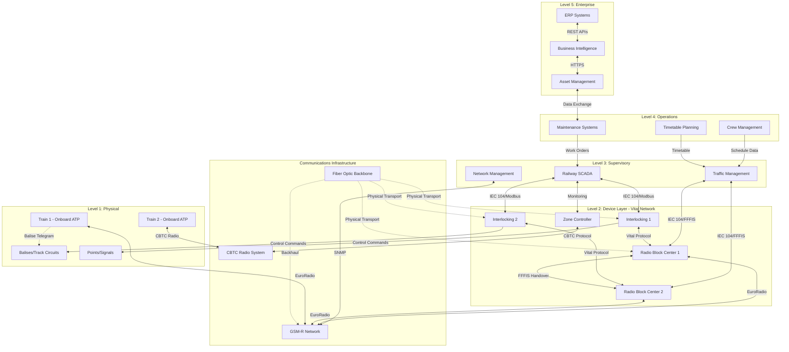
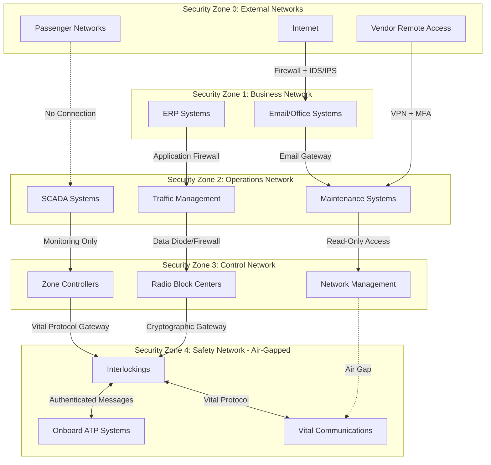

# Railway Signaling and Train Control System Architecture

## Summary

Modern railway signaling and train control systems represent some of the most sophisticated cyber-physical infrastructures in critical transportation networks. These systems integrate multiple layers of safety-critical control, from trackside equipment and onboard computers to centralized traffic management and enterprise operations platforms. The architecture must satisfy stringent safety integrity requirements (SIL 4 for vital functions per EN 50129), provide reliable real-time communications across distributed railway networks, and support both legacy interoperability and next-generation capabilities.

Railway control systems have evolved from mechanical interlocking and fixed-block signaling to advanced computer-based systems like the European Train Control System (ETCS), Communications-Based Train Control (CBTC), and Positive Train Control (PTC). These systems enable higher capacity through moving block operations, improved safety through continuous speed supervision, and enhanced operational efficiency through integrated traffic management. The architecture encompasses physical train detection, vital logic processing in interlocking computers, wireless and wired communication networks (including dedicated GSM-R systems), onboard ATP/ATO equipment, and supervisory SCADA platforms managing entire railway corridors or networks.

The hierarchical control architecture typically includes five distinct levels: Physical Layer (tracks, switches, signals, balises), Device Layer (trackside controllers, axle counters, interlocking systems), Supervisory Layer (traffic management systems, SCADA), Operations Layer (crew dispatch, maintenance scheduling), and Enterprise Layer (business intelligence, asset management). Communication between layers employs a mix of protocols including ETCS messaging over GSM-R or Eurobalise, CBTC radio systems, IP-based SCADA networks, and secure interfaces to external systems. Network segmentation, defense-in-depth security, and resilience through redundancy are critical architectural principles.

This document provides comprehensive coverage of railway control system architecture, including detailed protocol specifications for ETCS Level 2, CBTC, PTC, and GSM-R communications, vendor ecosystem analysis covering major suppliers like Alstom, Siemens Mobility, and Thales, and integration patterns for both greenfield metro systems and brownfield mainline railway deployments. The architecture aligns with IEC 62443 cybersecurity requirements and CENELEC safety standards, addressing the unique challenges of protecting safety-critical railway infrastructure while enabling digital transformation and interoperability.

## Key Information

**Architecture Type:** Multi-layered safety-critical train control and signaling system

**Primary Purpose:** Ensure safe train separation, enforce speed restrictions, control train movements through interlocking logic, and optimize railway capacity

**Safety Integrity:** SIL 4 (vital safety functions), SIL 2 (non-vital supervisory functions)

**Communication Technologies:** GSM-R (ETCS), dedicated radio (CBTC), 220 MHz radio (PTC), fiber optic networks, trackside cables

**Operational Domains:** Mainline railways (ETCS), metro/urban rail (CBTC), freight/passenger rail (PTC), high-speed rail, light rail transit

**Key Stakeholders:** Railway operators, infrastructure managers, rolling stock manufacturers, signaling suppliers, regulatory authorities

## Hierarchical Architecture

Railway control system architecture is structured in five hierarchical levels, each with distinct responsibilities, technologies, and interfaces:

### Level 1: Physical Layer

The physical layer comprises all trackside infrastructure and train-borne sensors:

**Trackside Components:**
- **Track Circuits:** Traditional train detection using electrical circuits through rails (AC/DC track circuits, coded track circuits for speed codes)
- **Axle Counters:** Modern train detection using inductive or optical sensors at section boundaries, more reliable than track circuits in electrified territory
- **Balises (Eurobalises):** Passive or active transponders providing fixed data messages to passing trains for ETCS systems
- **Signals:** Color light signals (2-aspect, 3-aspect, 4-aspect), dwarf signals for shunting, LED-based modern installations
- **Points/Switches:** Motorized turnouts controlled by interlocking systems, with detection contacts for position verification
- **Level Crossings:** Barrier controls, warning lights, obstacle detection systems
- **Trackside Equipment Cabinets:** Houses vital relay logic, electronic interlocking interfaces, axle counter evaluators

**Onboard Components:**
- **Odometry Systems:** Wheel sensors, Doppler radar, accelerometers providing train position and speed
- **Balise Reader Antennas:** Mounted under train to receive ETCS messages from trackside balises
- **Radio Antennas:** GSM-R antennas for ETCS Level 2/3, dedicated radio for CBTC
- **Onboard Computers:** European Vital Computer (EVC) for ETCS, Vehicle Onboard Controller (VOBC) for CBTC
- **Driver-Machine Interface (DMI):** Display and controls for driver interaction with ATP system

### Level 2: Device Layer

This layer performs vital safety logic and local control decisions:

**Interlocking Systems:**
- **Electronic Interlockings:** Computer-based vital logic processors implementing route setting, conflict resolution, and point control
  - Examples: Siemens Simis W, Alstom Smartlock, Thales LockTrac
  - Architecture: 2-out-of-3 or dual 2-out-of-2 redundant processors with vital comparison
  - Response Time: Typically 100-300ms for route setting operations
- **Relay Interlockings:** Legacy electromechanical systems still in operation in many networks
- **Route Setting Logic:** Implements railway operating rules, track occupation verification, approach locking, time locking

**Object Controllers:**
- **Signal Control Units:** Drive signal aspects based on interlocking commands
- **Point Machines:** Motor controllers for switch actuation with position feedback
- **Level Crossing Controllers:** Manage crossing sequences, obstacle detection, emergency stop
- **Axle Counter Evaluators:** Process sensor data to determine track section occupancy status

**Radio Block Centers (RBC):**
- Core component of ETCS Level 2 systems
- Receives train position reports via GSM-R
- Calculates and issues Movement Authorities (MA) to trains
- Interfaces with interlocking systems to verify route availability
- Manages handovers between adjacent RBC zones
- Redundant hot-standby architecture typical

**Zone Controllers (CBTC):**
- Computer-based controllers managing moving block calculations
- Interface with wayside equipment and train VOBC via dedicated radio
- Calculate safe separation distances based on real-time train positions and braking curves
- Support automatic train operation (ATO) supervision

### Level 3: Supervisory Layer

Centralized monitoring and control of railway operations:

**Traffic Management Systems (TMS):**
- **Functionality:** Route planning, conflict resolution, performance monitoring, delay management
- **Interfaces:** Interlocking systems, RBCs/Zone Controllers, adjacent control areas
- **Architecture:** Redundant servers with operator workstations, typical geographic mirroring for disaster recovery
- **Examples:** Alstom Iconis, Siemens Trackguard Westrace, Thales Borealis

**SCADA Systems:**
- **Railway SCADA:** Monitors all trackside equipment health, power supply status, environmental conditions
- **Protocol Stack:** IEC 60870-5-104, DNP3, or proprietary protocols over IP networks
- **Data Rates:** Typically 1-10 second update rates for non-vital monitoring data
- **Historian Systems:** Time-series databases storing operational metrics, alarm logs, maintenance data

**Communication Management:**
- **Network Management Systems:** Monitor GSM-R network health, radio coverage, handover performance
- **Voice Recording Systems:** Archive all operational voice communications per regulatory requirements
- **TETRA/GSM-R Integration:** Hybrid systems supporting both operational voice and ETCS data

### Level 4: Operations Layer

Supporting systems for operational personnel:

**Train Crew Management:**
- Crew rostering and dispatch systems
- Driver advisory systems providing optimal driving strategies for energy efficiency
- Electronic rule books and operating procedures

**Maintenance Management:**
- **Computerized Maintenance Management Systems (CMMS):** Schedule preventive maintenance, track failure history
- **Condition Monitoring:** Remote diagnostics of interlocking health, balise functionality, point machine wear
- **Predictive Maintenance:** Analytics on equipment performance data to predict failures

**Operations Control:**
- **Timetable Planning:** Long-term capacity planning and schedule optimization
- **Real-Time Rescheduling:** Dynamic response to disruptions, delay propagation analysis
- **Passenger Information:** Integration with passenger displays and mobile apps

### Level 5: Enterprise Layer

Business intelligence and strategic management:

**Asset Management Systems:**
- Lifecycle cost analysis for signaling equipment
- Capital planning for renewals and upgrades
- Configuration management of safety-critical software versions

**Business Intelligence:**
- KPI dashboards: punctuality, reliability, capacity utilization
- Financial reporting integration
- Regulatory compliance reporting

**Integration Platforms:**
- Enterprise Service Bus (ESB) architectures
- APIs for third-party integration (freight operators, passenger booking systems)
- Data warehousing for multi-year trend analysis

## Network Architecture

Railway control systems employ highly segmented network architectures with strict separation between safety-critical and non-critical functions:

### Network Segments

**Vital Network (Safety-Critical):**
- **Purpose:** Carry safety-related messages between interlockings, RBCs, onboard equipment
- **Topology:** Redundant star or ring topologies with automatic failover
- **Protocols:** FFFIS (Form Fit Functional Interface Specification) for ETCS, proprietary vital protocols
- **Media:** Fiber optic for trackside (single-mode for long distances), shielded copper for legacy
- **Latency Requirements:** <50ms for critical safety messages, <500ms for non-urgent movement authorities
- **Security:** Air-gapped from non-vital networks, cryptographic message authentication (e.g., EuroRadio Safe Connection Layer)

**Operations Network (Non-Vital):**
- **Purpose:** SCADA data, TMS communications, maintenance access
- **Protocols:** IEC 60870-5-104, Modbus TCP, SNMP, proprietary vendor protocols
- **Security Zones:** Segregated VLANs for SCADA, maintenance, office networks
- **Remote Access:** VPN concentrators with multi-factor authentication for vendor support access

**Voice Communications:**
- **GSM-R Network:** Dedicated 900 MHz spectrum for railway voice and ETCS data
  - Network Architecture: Base stations every 3-7 km along tracks, Base Station Controllers (BSC), Mobile Switching Centers (MSC)
  - Coverage: >99% along operational railway corridors
  - Quality of Service: Priority channels for emergency calls, pre-emption capabilities
- **Alternative Systems:** TETRA networks in some regions, LTE-R (Long Term Evolution for Railways) in development

**Passenger/Commercial Networks:**
- Separate networks for passenger Wi-Fi, retail systems, advertising displays
- No connectivity to safety-critical networks

### Network Topology Diagram



### Network Performance Characteristics

**Vital Network Requirements:**
- **Availability:** 99.999% (5 minutes downtime per year maximum)
- **Latency:** <50ms for safety-critical commands, <200ms for movement authorities
- **Jitter:** <10ms for time-critical signaling messages
- **Reliability:** Bit error rate <10^-9, packet loss <0.01%
- **Redundancy:** Full N+1 redundancy for all critical links

**GSM-R Network Performance:**
- **Coverage:** -95 dBm minimum signal strength at track level
- **Handover Success Rate:** >99.5% for moving trains
- **Call Setup Time:** <5 seconds for emergency calls, <10 seconds for operational calls
- **Data Throughput:** 9.6-14.4 kbps per train for ETCS data (sufficient for movement authority updates)

## Communication Protocols

### ETCS (European Train Control System)

**Architecture Overview:**
ETCS defines interoperable train control standards across European railways, with multiple application levels:

**ETCS Application Levels:**
- **Level 1:** Trackside spot transmission via Eurobalises, onboard ATP supervision, lineside signals remain
- **Level 2:** Radio-based continuous communication with RBC via GSM-R, signals removed or dark, movement authorities transmitted wirelessly
- **Level 3:** Moving block operation with train-borne integrity supervision, no trackside train detection required (future development)

**ETCS Level 2 Protocol Stack:**

```
+--------------------------------+
| Application Layer              |
| - Movement Authority Messages  |
| - Position Reports             |
| - Track Condition Messages     |
+--------------------------------+
| Presentation Layer (FFFIS)     |
| - Message Encoding/Decoding    |
| - Variable/Packet Structures   |
+--------------------------------+
| Safe Connection Layer          |
| - Cryptographic Authentication |
| - Sequence Number Checking     |
| - Timeout Management           |
+--------------------------------+
| EuroRadio Lower Layers         |
| - GSM-R Circuit-Switched Data  |
| - Mobile Application Part      |
+--------------------------------+
| GSM-R Physical Layer           |
| - 900 MHz Radio Interface      |
+--------------------------------+
```

**Key ETCS Messages:**
- **Message 3:** Movement Authority from RBC to train (defines end of authority, speed profile, gradients)
- **Message 136:** Position Report from train to RBC (sent every 10-30 seconds or on event triggers)
- **Message 2:** SR (Staff Responsible) Mode authorization
- **Message 6:** RBC/RBC handover coordination
- **Message 32:** RBC communication session initiation
- **Packet 44:** Data used by onboard for train running calculations

**Safety Mechanisms:**
- **Safe Connection Layer:** Authenticates all messages using HMAC-SHA-256 or similar cryptographic functions
- **Sequence Numbers:** Detect replay attacks and message loss
- **Timeouts:** Train transitions to safe state if communication lost for configured timeout (typically 20-40 seconds)
- **Revocation Lists:** Invalidate compromised cryptographic keys

**Eurobalise Protocol:**
- **Transmission:** Inductive coupling when train passes over balise at speeds up to 500 km/h
- **Data Capacity:** 1023 bits per telegram, transmitted in ~200ms
- **Content:** Fixed data (track gradients, curves, speed limits, RBC contact information) or variable data (linked to interlocking for route-specific information)
- **Error Detection:** CRC-16 checksums, message rejected if errors detected

**Implementation Parameters:**
- **RBC Processing Time:** <200ms to process position report and generate movement authority
- **Communication Latency:** Total end-to-end latency budget 2-4 seconds for movement authority updates
- **Train Position Accuracy:** ±5 meters under normal conditions, ±10 meters in degraded GPS/odometry
- **Braking Curves:** Pre-calculated safe braking curves with safety margins (3-7% gradient compensation, adhesion models)

### CBTC (Communications-Based Train Control)

**System Architecture:**
CBTC systems use continuous bidirectional radio communications between trains and wayside equipment to enable moving block operations in metro and urban rail environments.

**Core Components:**
- **Vehicle Onboard Controller (VOBC):** Determines train position (using transponders, odometry, sometimes GPS), calculates safe braking curves, enforces speed limits
- **Zone Controller (ZC):** Wayside computer managing a zone (typically 5-15 km), calculates movement authorities based on train positions reported by VOBCs
- **Data Communication System (DCS):** Dedicated radio system (typically 2.4 GHz or 5.8 GHz Wi-Fi-based, or licensed spectrum), with lineside access points every 300-800 meters
- **Automatic Train Supervision (ATS):** Central system for route planning, timetable adherence, depot management

**Communication Protocol Characteristics:**
- **Radio Technology:** IEEE 802.11 variants (Wi-Fi), proprietary radio systems, or LTE in newest deployments
- **Update Rate:** Train position reports sent every 0.5-2 seconds, movement authorities updated at similar rates
- **Data Rate:** 1-10 Mbps per train (includes position, diagnostics, passenger information, CCTV backhaul)
- **Redundancy:** Dual radio systems (diversity antennas), automatic failover if primary radio fails

**Moving Block Calculation:**
- **Train Separation:** Dynamic safe separation distance calculated in real-time based on:
  - Leading train position and speed
  - Following train braking capability and current speed
  - Track gradients and curves
  - Safety margins (typically 10-25 meters)
- **Typical Headways:** 60-120 seconds at 80 km/h for mature CBTC systems, compared to 180-300 seconds for fixed block signaling

**Safety Architecture:**
- **Fail-Safe Design:** Loss of communication causes train to brake to stop within last known safe limit of authority
- **Diverse Positioning:** Multiple independent position determination methods (transponders, odometry, GPS if available)
- **Vital Processing:** Zone Controllers and VOBCs use dual or triple-redundant processors with vital comparison logic

**CBTC Protocols (Vendor Examples):**
- **Siemens Trainguard MT:** Proprietary protocol over 2.4 GHz radio, message cycle times 200-500ms
- **Alstom Urbalis:** Wi-Fi based communication with secure VPN tunnels, AES-256 encryption
- **Thales SelTrac:** Legacy vendor-specific protocol, newer versions support IP-based communications

**Implementation Considerations:**
- **Radio Coverage:** Requires high-quality radio coverage with <1% packet loss in tunnels and elevated structures
- **Handover Management:** Seamless handover between access points critical for continuous communication
- **Electromagnetic Compatibility:** Design for high-EMI environments (traction power, third rail arcing)

### PTC (Positive Train Control)

**System Overview:**
PTC is mandated in the United States for mainline freight and passenger railways to prevent train-to-train collisions, overspeed derailments, incursions into work zones, and movement through misaligned switches.

**I-ETMS (Interoperable Electronic Train Management System):**
Most widely deployed PTC system in North America, developed by Wabtec Corporation.

**Architecture Components:**
- **Onboard Computer (OBC):** Receives track data, determines train location, calculates braking curves, enforces speed limits
- **Wayside Interface Units (WIU):** Monitor switch positions and signal states, communicate status to back office servers via cellular networks
- **Back Office Server (BOS):** Centralized authority database, dispatch messaging, train movement planning
- **Dispatch Systems:** Integration with existing Centralized Traffic Control (CTC) systems

**Communication Technologies:**
- **Radio System:** 220 MHz band (licensed by Association of American Railroads), frequency-hopping spread spectrum
- **Data Communication:** Packet-switched data communications, cellular (LTE/5G) backhaul to back office
- **Satellite Positioning:** GPS/WAAS for train location (differential corrections improve accuracy to 3-5 meters)

**PTC Message Types:**
- **Movement Authority:** Defines limits of authority for train movements, transmitted from BOS to OBC
- **Track Database Updates:** Temporary speed restrictions, work zone locations, updated signal logic
- **Train Location Reports:** Periodic position and speed reports from OBC to BOS
- **Emergency Messages:** High-priority messages for immediate train stops or restrictions

**Braking Enforcement:**
- **Speed Enforcement Curves:** Onboard system calculates maximum permitted speed based on track profile, temporary restrictions, signal states
- **Penalty Brake Application:** Automatic brake application if engineer does not respond to overspeed warnings
- **Stopping Distance Calculation:** Accounts for train length, weight, grade, brake type (air brake propagation delays)

**Integration with Existing Systems:**
- **CTC Interface:** PTC integrated with legacy Centralized Traffic Control systems via standardized protocols
- **Cab Signal Overlay:** PTC overlays existing cab signal systems (maintains backward compatibility for non-PTC equipped trains)
- **Interoperability:** Multiple Class I railroads share track, requiring interoperable PTC implementations

**Operational Characteristics:**
- **Initialization Time:** 5-15 minutes for full system initialization and GPS lock after departure
- **Update Interval:** Movement authorities updated every 30-120 seconds depending on operational context
- **Accuracy Requirements:** Position accuracy within 15 meters required for enforcement functionality
- **Availability Target:** >99% availability during revenue service hours

### GSM-R (Global System for Mobile Communications - Railway)

**Network Architecture:**
GSM-R is a specialized mobile communications standard based on GSM Phase 2+ with railway-specific features for voice and data.

**Core Network Elements:**
- **Base Transceiver Stations (BTS):** Radio equipment providing coverage along tracks, spaced 3-7 km apart
- **Base Station Controllers (BSC):** Manage groups of BTS, handle handovers, radio resource management
- **Mobile Switching Centers (MSC):** Core switching and routing, manages call setup, subscriber mobility
- **Home Location Register (HLR):** Subscriber database with authentication credentials
- **EIRENE Functional Addressing:** Railway-specific numbering plan for functional roles (e.g., shunter, driver, dispatcher)

**Frequency Allocation:**
- **Uplink:** 876-880 MHz (4 MHz bandwidth)
- **Downlink:** 921-925 MHz (4 MHz bandwidth)
- **Channel Bandwidth:** 200 kHz per GSM carrier

**Railway-Specific Features:**
- **Functional Addressing:** Calls addressed to roles (driver of train X) rather than individual phone numbers
- **Location-Dependent Addressing:** Calls routed based on train location (e.g., call nearest signal maintainer)
- **Priority and Pre-emption:** Emergency calls can pre-empt lower priority calls
- **Railway Emergency Call:** Dedicated emergency button broadcasts to all trains in area and control centers
- **Voice Broadcast:** Simultaneously transmit voice to multiple recipients (e.g., all trains in area)
- **Voice Group Call Service (VGCS):** Conference calling for operational coordination
- **Shunting Mode:** Special mode for low-speed operations in yards

**Data Services for ETCS:**
- **Circuit-Switched Data:** 9.6 kbps or 14.4 kbps channels for ETCS Level 2 communication
- **GPRS (General Packet Radio Service):** Packet-switched data for non-vital applications (up to 60 kbps)
- **ASCI (Advanced Speech Call Items):** Enhanced voice features for railway operations

**Quality of Service:**
- **Voice Quality:** Full-rate GSM codec (13 kbps), enhanced full-rate optional
- **Coverage Requirements:** >99% along operational tracks, >95% in stations and yards
- **Handover Performance:** <2 seconds disruption for voice, seamless for data (dual radio operation during handover)
- **Reliability:** >99.5% call success rate for emergency calls

**Migration to LTE-R:**
Next-generation railway communications using LTE technology (FRMCS - Future Railway Mobile Communication System):
- **Higher Bandwidth:** Up to 100 Mbps for advanced applications (CCTV streaming, predictive maintenance)
- **Lower Latency:** <50ms for safety-critical applications
- **IP-Native:** Full IP protocol stack for easier integration with modern systems
- **Timeline:** Specifications under development, coexistence with GSM-R required until ~2030-2040

## Control System Components

### Hardware Components

**Vital Computers:**
- **Architecture:** Triple-modular redundancy (TMR) or dual 2-out-of-2 configurations with vital comparison
- **Processing:** Specialized safety-certified processors (e.g., ARM Cortex-R, PowerPC with lockstep cores)
- **Memory:** ECC RAM, memory scrubbing, shadow memory for fault detection
- **I/O:** Vital input modules with diverse sensing (voltage, current, frequency), fail-safe output drivers
- **Certification:** EN 50129 SIL 4 certification required for safety-critical interlocking functions

**Trackside Equipment:**
- **Axle Counters:**
  - Technology: Inductive sensors or wheel-mounted tags (RFID)
  - Evaluators: Dual-channel processing with continuous self-monitoring
  - Accuracy: >99.999% detection reliability under all weather conditions
  - Examples: Siemens Pointguard RSR, Frauscher Advanced Counter FAdC

- **Eurobalise Modules:**
  - Passive LEU (Lineside Electronic Unit): Programmable balise encoding fixed data
  - Active LEU: Interfaces with interlocking to provide route-specific variable data
  - Power: Inductive power transfer from passing train (passive balises) or lineside power (active)

- **Signal Heads:**
  - LED-based multi-aspect signals with continuous monitoring
  - Automatic dimming based on ambient light conditions
  - Redundant LED arrays for fail-safe operation

**Point Machines:**
- **Electric Motor Drives:** AC or DC motors with mechanical locks ensuring positive position locking
- **Detection Contacts:** Multiple independent contacts verify point position (open/closed circuits)
- **Heating Systems:** Prevent ice buildup in cold climates
- **Examples:** Alstom HW2000, Siemens S700K, Vossloh W573

**Onboard Equipment:**
- **European Vital Computer (EVC):**
  - Dual-processor redundant architecture
  - Interfaces: Balise reader, GSM-R radio, odometry sensors, brake interface, DMI
  - Real-time OS with certified safety kernel

- **Driver Machine Interface (DMI):**
  - Touchscreen or hard-button interface
  - Displays: Speed tape, target speed, distance to target, mode indicators
  - Ergonomics: Compliant with EN 15553 for cab layout and usability

- **Juridical Recorder:**
  - Records all safety-critical events, driver actions, train movements
  - Tamper-proof, crash-protected storage
  - Downloadable for accident investigation

### Software Components

**Interlocking Application Software:**
- **Route Table:** Defines all possible train routes through interlocking area with conflict matrix
- **Safety Logic:** Implements railway signaling principles (approach locking, track clearing, time locking)
- **Fail-Safe Principles:** All outputs de-energize to safe state on failure detection
- **Generic vs. Geographic Logic:**
  - Generic: Reusable safety kernel (certified once, applied to multiple installations)
  - Geographic: Site-specific configuration data defining track layout and operational rules

**RBC Application Software:**
- **Movement Authority Calculation:** Computes safe limits of authority based on train position, track occupancy, interlocking route
- **Train Tracking:** Maintains real-time database of all train positions and states in RBC jurisdiction
- **Handover Management:** Coordinates with adjacent RBCs to transfer train supervision across borders
- **Degraded Mode Handling:** Supports fallback operations if trains lose communication or interlocking interfaces fail

**SCADA Application Software:**
- **Human-Machine Interface (HMI):** Graphical displays of track diagrams, equipment status, alarms
- **Alarm Management:** Prioritization, filtering, acknowledgment, escalation of equipment failures
- **Historian:** Time-series database (e.g., OSIsoft PI, Wonderware Historian) for operational data storage
- **Reporting Tools:** Automated generation of performance reports, compliance documentation

**Safety Assurance Software:**
- **Vital Firmware:** Low-level code running on safety-certified processors, manages I/O, self-test, watchdog functions
- **Safety Application:** Higher-level logic implementing safety algorithms (e.g., safe distance calculations, speed supervision)
- **Development Standards:** EN 50128 SIL 4 for vital code (formal methods, extensive testing, independent verification)
- **Configuration Management:** Strict version control, baseline management, change control procedures for safety-critical software

**Onboard Software:**
- **ATP Kernel:** Core speed supervision logic, enforces braking curves, mode transitions
- **National Application:** Country-specific rules and signaling principles (Class B systems), integrated with ETCS baseline
- **DMI Application:** Driver interface rendering, input handling, audio/visual alerts
- **Diagnostics:** Continuous self-test routines, fault logging, remote diagnostics via GSM-R

## Integration Patterns

### Vertical Integration

Vertical integration connects hierarchical layers from field devices to enterprise systems:

**Device-to-Supervisory Integration:**
- **Interlocking to SCADA:**
  - Protocol: IEC 60870-5-104 over TCP/IP for non-vital monitoring data
  - Data: Track occupancy status, signal aspects, point positions, equipment alarms
  - Update Rate: 1-5 second polling or change-of-state reporting

- **RBC to Traffic Management:**
  - Protocol: FFFIS (standardized ETCS interface) or vendor-specific protocols
  - Data: Train positions, delays, route requests, movement authority status
  - Integration: Bidirectional (TMS can influence route planning, RBC reports operational state)

**Supervisory-to-Operations Integration:**
- **SCADA to Maintenance Systems:**
  - Data: Equipment health metrics, failure notifications, diagnostic codes
  - Work Order Creation: Automatic generation of maintenance tickets based on condition monitoring thresholds
  - Mobile Integration: Maintenance personnel receive work orders on mobile devices with location and equipment details

- **TMS to Timetable Planning:**
  - Real-time performance data feeds long-term planning tools
  - Historical punctuality analysis influences future schedule development
  - Capacity modeling based on actual achieved headways

**Operations-to-Enterprise Integration:**
- **Asset Management to Finance:**
  - Depreciation schedules for signaling equipment
  - Capital expenditure tracking for major renewals
  - Lifecycle cost modeling for procurement decisions

- **KPI Dashboards:**
  - Executive dashboards aggregating operational metrics (punctuality, reliability, incidents)
  - Integration with business intelligence platforms (e.g., Tableau, Power BI)

### Horizontal Integration

Horizontal integration connects systems at the same hierarchical level:

**Inter-Interlocking Communication:**
- **Track Section Handover:** Adjacent interlockings exchange track occupancy status at boundaries
- **Route Coordination:** Coordinated route setting across interlocking borders for through routes
- **Protocol:** Vital proprietary protocols or standardized interfaces (e.g., RaSTA - Rail Safe Transport Application)

**RBC-to-RBC Handover:**
- **Border Management:** Train supervision transferred between RBCs as trains cross jurisdictional boundaries
- **Pre-Announcement:** Upstream RBC notifies downstream RBC of approaching train with speed and expected arrival time
- **Seamless Handover:** Movement authority extended across RBC boundary without train braking
- **Protocol:** FFFIS Section 7 (RBC/RBC handover messages)

**Integration with Adjacent Networks:**
- **Cross-Border Operations:** Different national railway networks with different signaling systems require interoperability
- **ETCS Baseline:** Provides interoperable foundation for international operations
- **Class B Overlay:** National systems (e.g., German LZB, French TVM) integrated with ETCS through STM (Specific Transmission Modules)

**Multi-Modal Integration:**
- **Urban Rail to Mainline:** Integration of metro CBTC systems with mainline ETCS for through-running services
- **Freight/Passenger Coordination:** Shared track usage requiring coordinated traffic management across operators
- **Bus/Tram Integration:** Integrated urban mobility platforms coordinating schedules across modes

### External System Interfaces

**Regulatory Reporting:**
- **Automatic Incident Reporting:** Safety incidents automatically logged and reported to railway safety authorities
- **Compliance Monitoring:** Automated tracking of speed limit adherence, signal compliance, work zone protection
- **Audit Trails:** Immutable logs of all safety-critical actions for post-incident investigation

**Third-Party Integrations:**
- **Weather Services:** Real-time weather data integrated into operations (high winds, extreme temperatures trigger speed restrictions)
- **Passenger Information:** Train running information feeds passenger displays, mobile apps, third-party journey planners
- **Energy Management:** Traction power consumption data integrated with utility providers for demand response programs

## Deployment Patterns

### Greenfield Metro Deployment (CBTC)

**Typical Configuration:**
- **Fully Automated Operations:** Unattended Train Operation (UTO) with no onboard staff
- **Platform Screen Doors:** Integrated with CBTC for precise train positioning and safe boarding
- **Communications Infrastructure:** Fiber optic backbone along entire line, redundant ring topology
- **Zone Controllers:** One ZC per 10-15 km of track, hot-standby redundancy
- **Radio System:** 2.4 GHz or 5.8 GHz Wi-Fi-based DCS, access points every 400-600 meters
- **Depot Integration:** CBTC supervision extends into depot for automatic train washing, maintenance positioning

**Implementation Timeline:**
- Design and specification: 12-18 months
- Equipment procurement and manufacturing: 18-24 months
- Installation and commissioning: 24-36 months
- Dynamic testing and safety case: 12-18 months
- Total: 5-7 years for complex metro lines

**Example Projects:**
- Dubai Metro (Alstom Urbalis CBTC)
- Singapore MRT Downtown Line (Thales SelTrac CBTC)
- London Crossrail (Siemens Trainguard MT CBTC)

### Brownfield Mainline Migration (ETCS Level 2)

**Migration Strategy:**
- **Phased Rollout:** Corridor-by-corridor deployment to minimize disruption
- **Hybrid Operation:** ETCS and legacy signaling coexist during transition period, trains equipped with both systems
- **Balise Overlay:** Initial ETCS Level 1 deployment with balises providing fixed data, lineside signals remain
- **Level 2 Migration:** RBCs commissioned, GSM-R network coverage validated, signals progressively removed or left dark
- **Interlocking Replacement:** Gradual replacement of relay interlockings with electronic interlockings featuring ETCS interfaces

**Technical Challenges:**
- **Legacy Compatibility:** Ensuring ETCS-equipped trains can operate safely on non-ETCS tracks using Class B systems
- **GSM-R Coverage:** Achieving >99% coverage in challenging terrain (tunnels, deep cuttings, remote areas) requires careful radio planning
- **Interlocking Interfacing:** Developing ETCS-compliant interfaces for diverse legacy interlocking types

**Operational Challenges:**
- **Driver Training:** Comprehensive training programs for drivers transitioning from lineside signal observation to DMI-based operation
- **Maintenance Competency:** Signaling maintainers require new skills for computer-based systems vs. traditional relay logic
- **Testing and Commissioning:** Extensive integration testing required to validate all failure modes and degraded operation scenarios

**Example Projects:**
- UK Digital Railway Programme (ETCS deployment on key routes)
- Switzerland (nationwide ETCS Level 2 deployment complete)
- Italy (extensive ETCS Level 2 network)

### Positive Train Control Overlay (PTC)

**Overlay Approach:**
- **Existing CTC Infrastructure:** PTC overlays existing Centralized Traffic Control systems without replacing them
- **Incremental Deployment:** Railroad by railroad implementation, with interoperability agreements at interchange points
- **Onboard Retrofit:** Locomotives equipped with PTC onboard computers, GPS antennas, 220 MHz radios
- **Wayside Interface Units:** Install WIUs at controlled points (interlockings, sidings) to monitor switch/signal status

**System Integration:**
- **CTC Interface:** Bidirectional integration allows PTC back office to receive track warrant information and signal aspects from existing CTC
- **Dispatch Systems:** Dispatchers continue using existing CTC consoles, PTC operates in background enforcing safety overlays
- **Track Database Management:** Centralized track database repository updated by infrastructure engineers, distributed to all locomotives

**Implementation Challenges:**
- **Track Database Accuracy:** Requires highly accurate track geometry database (curves, grades, mileposts) for correct braking calculations
- **GPS Reliability:** GPS shadowing in tunnels, urban canyons, foliage requires alternative positioning methods (balises, wheel sensors)
- **Interoperability Testing:** Complex testing required when multiple Class I railroads share tracks with different PTC implementations
- **Cost:** $10-15 billion industry-wide implementation cost for US freight railroads

### High-Speed Rail (HSR) Deployment

**Specialized Requirements:**
- **High-Speed ETCS:** ETCS baseline tailored for operation at 300-350 km/h
- **Enhanced Balise Spacing:** Balise groups every 1-3 km to ensure adequate data refresh at high speeds
- **Dedicated GSM-R Infrastructure:** Higher density of base stations for seamless handovers at high speeds
- **Advanced Train Detection:** Axle counters preferred over track circuits for reliability in high-speed environment
- **No Physical Signals:** Entirely DMI-based driving with ETCS Level 2, no lineside color-light signals

**Performance Optimization:**
- **Braking Curve Optimization:** Reduced safety margins where justified by rigorous engineering analysis to maximize line capacity
- **Dynamic Speed Profiles:** Real-time speed profile adjustments based on train performance, weather, track conditions
- **Headway Management:** Advanced conflict detection and resolution to maintain 3-5 minute headways at 300 km/h

**Example Projects:**
- French TGV network (TVM430 transitioning to ETCS)
- Spanish AVE network (ETCS Level 2)
- Chinese HSR (CTCS-3, based on ETCS with Chinese adaptations)

## Redundancy and Resilience

### Architectural Redundancy

**Interlocking Redundancy:**
- **Hot-Standby Configuration:** Dual interlocking processors with automatic failover (<1 second switchover time)
- **Voting Logic:** 2-out-of-3 or dual 2-out-of-2 architectures where outputs must agree before activating trackside equipment
- **Diverse Redundancy:** Some systems use dissimilar processors or software to protect against common-mode failures
- **Geographic Redundancy:** Critical interlocking areas may have backup interlocking at separate location controlling same track area

**RBC Redundancy:**
- **Active-Standby RBC Pairs:** Primary and standby RBC continuously synchronized, standby takes over within 10-20 seconds if primary fails
- **Cold Standby Options:** Less critical RBCs may have cold standby requiring 5-10 minutes to activate
- **Degraded Mode Operation:** If RBC fails completely, trains can operate in ETCS Staff Responsible (SR) mode with trackside authority

**Communication Redundancy:**
- **Dual Radio Systems:** Trains equipped with two independent GSM-R radios for diversity
- **Backhaul Redundancy:** Railway communication networks use redundant fiber rings with automatic protection switching
- **Diverse Routing:** Critical communication paths routed via geographically diverse cable routes to protect against cable cuts
- **Satellite Backup:** Some systems incorporate satellite communication backup for remote areas

### Resilience Strategies

**Degraded Mode Operation:**
- **ETCS Fallback Modes:**
  - Staff Responsible (SR): Driver operates on trackside authority under restricted speeds
  - Shunting (SH): Low-speed movements in depot or yard areas
  - On Sight (OS): Visual operation at walking pace when normal supervision unavailable

- **CBTC Fallback:**
  - Automatic Train Protection (ATP) only mode: Remove automatic operation, driver controls acceleration/braking
  - Restricted Manual: Fixed-block operation using trackside signals as fallback

- **PTC Fallback:**
  - Revert to legacy cab signal operation if PTC system unavailable
  - Speed restrictions and manual protection for work zones if PTC enforcement unavailable

**Fail-Safe Principles:**
- **De-Energize to Safe:** All vital outputs designed to fail to safe state when power lost or fault detected
  - Signals: Default to red (stop) aspect
  - Points: Locked in last known position, trains cannot traverse until position verified
  - Level Crossings: Barriers remain down, lights continue flashing

- **Defensive Programming:** Software designed to detect anomalies and transition to safe state
- **Watchdog Timers:** Hardware timers reset by software; if software hangs, watchdog triggers safe shutdown

**Disaster Recovery:**
- **Geographic Redundancy:** Critical servers and back office systems deployed in geographically diverse data centers
- **Backup and Restore:** Regular backups of configuration databases, interlocking tables, track databases
- **Recovery Time Objectives:**
  - Vital interlocking systems: <1 hour recovery time objective
  - RBC systems: <4 hours recovery time
  - SCADA/TMS: <12 hours recovery time for full functionality
- **Incident Response Plans:** Documented procedures for recovering from catastrophic failures, cyberattacks, natural disasters

### Maintenance and Testing

**Preventive Maintenance:**
- **Scheduled Inspections:** Regular inspections of trackside equipment (quarterly for critical equipment, annually for less critical)
- **Interlocking Self-Test:** Continuous self-diagnostics identify failing components before they cause service disruption
- **Balise Testing:** Balises tested using specialized handheld equipment or test trains to verify correct telegram transmission

**Predictive Maintenance:**
- **Condition Monitoring:** Remote monitoring of interlocking health metrics, power supply voltages, communication quality
- **Trend Analysis:** Analytics on equipment performance data identify degrading components before failure
- **Example Metrics:** Point machine motor current (increasing current indicates mechanical binding), balise transmission errors, axle counter false detections

**Safety Testing:**
- **Interlocking Safety Tests:** Comprehensive test procedures verifying all safety functions (signal overlaps, route conflicts, time locking)
- **End-to-End Testing:** ETCS/CBTC system testing with test trains validating braking curves, speed supervision, emergency braking
- **Periodic Recertification:** Safety cases require periodic review and testing (typically every 5-10 years or after major modifications)

## Cybersecurity Architecture

Railway signaling and train control systems face evolving cybersecurity threats requiring defense-in-depth strategies aligned with IEC 62443 industrial cybersecurity standards.

### Threat Landscape

**Potential Attack Vectors:**
- **Wireless Communication Interception:** GSM-R or CBTC radio signals intercepted or jammed by malicious actors
- **Cyber-Physical Attacks:** Manipulation of control commands to cause trains to violate safety rules (e.g., pass red signals, exceed speed limits)
- **Denial of Service:** Flooding communication networks to disrupt RBC or CBTC zone controller operations
- **Insider Threats:** Malicious or negligent insiders with authorized access to safety-critical systems
- **Supply Chain Compromise:** Malware or backdoors introduced during equipment manufacturing or software development

**Consequences of Successful Attacks:**
- Train collisions or derailments with potential fatalities
- Service disruption affecting millions of passengers
- Economic impact from prolonged outages
- Erosion of public confidence in railway safety

### Security Architecture Principles

**Defense in Depth:**
Multiple overlapping security layers ensure no single vulnerability can compromise system safety:

1. **Network Segmentation:** Isolate vital networks from non-vital and external networks using firewalls and VLANs
2. **Cryptographic Authentication:** All safety-critical messages authenticated using strong cryptography
3. **Access Control:** Role-based access control with multi-factor authentication for all safety-critical systems
4. **Intrusion Detection:** Network monitoring and anomaly detection to identify suspicious activity
5. **Physical Security:** Restricted access to equipment rooms, cabinets, and communication infrastructure

**IEC 62443 Alignment:**
Railway control systems increasingly adopt IEC 62443 framework for industrial automation cybersecurity:

- **Security Levels (SL):** Define progressive levels of security capability
  - SL 1: Protection against casual or accidental violation
  - SL 2: Protection against intentional violation using simple means
  - SL 3: Protection against intentional violation using sophisticated means
  - SL 4: Protection against intentional violation using sophisticated means with extended resources

- **Target Security Level:** Most railway signaling systems target SL 2 or SL 3 depending on threat assessment and regulatory requirements

### Security Zones and Conduits



**Zone Descriptions:**

**Zone 0 (External):** Untrusted networks including internet, vendor remote access, passenger-facing systems
- Security: Assume hostile, all traffic inspected at perimeter

**Zone 1 (Business):** Corporate IT systems not directly involved in operations
- Security: Standard enterprise security practices, isolated from operational networks

**Zone 2 (Operations):** Non-vital operational systems including SCADA, TMS, maintenance
- Security: Defense-in-depth with firewalls, IDS, access control, monitoring

**Zone 3 (Control):** Non-vital control systems (RBCs, zone controllers, network management)
- Security: Restricted access, encrypted communications, continuous monitoring

**Zone 4 (Safety):** Vital safety-critical systems (interlockings, onboard ATP, vital communications)
- Security: Air-gapped from lower security zones, cryptographically authenticated messages, no external connectivity

### Security Controls

**Authentication and Access Control:**
- **Multi-Factor Authentication:** Required for all access to control and safety networks (password + token or biometric)
- **Role-Based Access Control (RBAC):** Granular permissions based on job function (engineer, maintainer, operator, administrator)
- **Privileged Access Management:** Administrative accounts require additional approval and logging

**Cryptographic Protection:**
- **ETCS Safe Connection Layer:** HMAC-based message authentication with sequence numbers prevents replay attacks
- **VPN Tunnels:** IPsec or TLS VPNs for remote access with AES-256 encryption
- **Certificate Management:** Public Key Infrastructure (PKI) for managing cryptographic keys and certificates
- **Key Rotation:** Regular rotation of cryptographic keys (every 30-90 days) to limit impact of key compromise

**Network Security:**
- **Firewalls:** Stateful packet inspection firewalls between security zones with default-deny policies
- **Intrusion Detection Systems (IDS):** Monitor network traffic for suspicious patterns (e.g., Snort, Suricata)
- **Data Diodes:** One-way communication gateways for read-only monitoring of vital networks from operations networks
- **Network Segmentation:** VLANs and physical separation prevent lateral movement if one zone compromised

**Monitoring and Response:**
- **Security Information and Event Management (SIEM):** Centralized logging and correlation of security events
- **Anomaly Detection:** Behavioral analytics identify deviations from normal operational patterns
- **Incident Response Plan:** Documented procedures for detecting, containing, and recovering from security incidents
- **Regular Security Audits:** Penetration testing and vulnerability assessments by independent security firms

**Supply Chain Security:**
- **Vendor Security Requirements:** Contractual requirements for secure development practices, vulnerability disclosure
- **Software Bill of Materials (SBOM):** Documentation of all software components for vulnerability tracking
- **Secure Boot:** Hardware-verified boot process ensures only authorized firmware loads on vital computers
- **Tamper Detection:** Physical tamper detection on safety-critical equipment cabinets

### Regulatory Requirements

**CENELEC Standards:**
- **EN 50159:** Railway applications - Communication, signaling and processing systems - Safety-related communication in transmission systems
  - Defines security mechanisms for protecting safety messages against corruption, replay, masquerade

**EU Cybersecurity Requirements:**
- **NIS2 Directive:** Network and Information Security Directive classifies railways as critical infrastructure requiring enhanced cybersecurity
- **Cybersecurity Act:** Certification framework for ICT products including railway signaling equipment

**National Regulations:**
- **US CISA Requirements:** Critical infrastructure protection guidelines for railway cybersecurity
- **UK Network Rail Standards:** Cybersecurity requirements for UK railway signaling systems

## Operational Considerations

### Human Factors

**Driver Interface Design:**
- **Ergonomics:** DMI placement within driver's natural field of view, controls easily reachable
- **Cognitive Load:** Information presented progressively based on urgency, avoid overwhelming driver with non-critical data
- **Alerts and Warnings:** Tiered alerting (information, caution, warning) with distinct audio and visual characteristics
- **Training Requirements:** Comprehensive training programs including simulator-based training for emergency scenarios

**Dispatcher Interface:**
- **Situation Awareness:** Track diagrams provide intuitive representation of train locations, routes, conflicts
- **Workload Management:** Automation handles routine operations, dispatcher focuses on exceptions and conflict resolution
- **Decision Support:** Algorithms recommend optimal routing and scheduling adjustments during disruptions

**Maintainer Interface:**
- **Diagnostics:** Remote diagnostic tools allow maintainers to assess equipment health without site visits
- **Fault Localization:** Precise fault isolation to minimize time spent troubleshooting
- **Mobile Access:** Tablet or smartphone interfaces for accessing work orders, equipment manuals, diagnostic data in field

### Performance Monitoring

**Key Performance Indicators (KPIs):**
- **Reliability:** Mean Time Between Failures (MTBF) for signaling equipment (target: >50,000 hours for critical equipment)
- **Availability:** System availability percentage (target: >99.9% for vital systems)
- **Punctuality:** Percentage of trains arriving within 5 minutes of schedule (target: >90% for high-quality railways)
- **Capacity Utilization:** Actual vs. theoretical line capacity utilization (target: 60-80% for optimized operations)

**Continuous Improvement:**
- **Root Cause Analysis:** Systematic investigation of all significant failures to identify and eliminate root causes
- **Benchmarking:** Compare performance metrics against other railways and industry best practices
- **Technology Refresh:** Periodic upgrades to incorporate latest technologies and address obsolescence

### Regulatory Compliance

**Safety Case Development:**
- **Hazard Analysis:** Identify all potential hazards (e.g., train collision, derailment, unauthorized train movement)
- **Risk Assessment:** Evaluate likelihood and severity of each hazard, determine tolerable risk levels
- **Safety Requirements Allocation:** Define safety requirements to mitigate risks to acceptable levels
- **Evidence Collection:** Demonstrate through testing, analysis, and operational experience that safety requirements are met

**Certification Process:**
- **Independent Safety Assessment:** Third-party assessment body reviews safety case and verifies compliance with standards
- **Type Approval:** Generic equipment (e.g., interlocking computers, RBC) obtains type approval demonstrating compliance with CENELEC standards
- **Project Authorization:** Specific installations authorized by railway safety authority after demonstrating site-specific safety case

**Operational Authorization:**
- **Dynamic Testing:** Real-world testing with trains under all operational scenarios
- **Driver Training:** All drivers trained and assessed on new systems before passenger service
- **Documentation:** Operating procedures, maintenance instructions, emergency procedures documented and approved

## Lifecycle Management

### Development Phase

**Requirements Engineering:**
- **System Requirements Specification (SRS):** High-level requirements derived from operational concepts and safety goals
- **Safety Requirements Specification:** Safety requirements allocated to system, subsystem, and component levels
- **Interface Requirements:** Define all interfaces between subsystems (interlocking to RBC, RBC to train, etc.)

**Design and Implementation:**
- **Architectural Design:** High-level system architecture defining major subsystems and interfaces
- **Detailed Design:** Component-level design including hardware schematics, software module specifications
- **Development Standards:** EN 50128 SIL 4 for safety-critical software (formal methods, rigorous testing, independent reviews)
- **Configuration Management:** Strict version control and change management for all safety-critical components

**Verification and Validation:**
- **Unit Testing:** Component-level testing verifying each module meets its specification
- **Integration Testing:** Subsystem integration testing verifying interfaces and interactions
- **System Testing:** Full system testing including normal operations, degraded modes, failure scenarios
- **Safety Validation:** Independent validation that system meets all safety requirements

### Deployment Phase

**Installation:**
- **Site Preparation:** Civil works, cable installation, equipment room preparation
- **Equipment Installation:** Install interlockings, RBCs, trackside equipment, onboard equipment
- **Factory Acceptance Testing (FAT):** Test equipment at manufacturer's facility before shipping to site
- **Site Acceptance Testing (SAT):** Verify correct installation and configuration on site

**Commissioning:**
- **Static Testing:** Test all equipment in isolation (interlocking logic, RBC message processing, etc.)
- **Integration Testing:** Test interfaces between subsystems (interlocking to RBC, RBC to train simulator)
- **Dynamic Testing:** Test with real trains under supervision, gradually increasing complexity
- **Pilot Operations:** Limited passenger service with enhanced monitoring and rapid response to issues

### Operations and Maintenance Phase

**Operational Support:**
- **24/7 Operations Center:** Staffed control centers monitoring system health and responding to incidents
- **Helpdesk Support:** Technical support for operators, maintainers, and vendors
- **Change Management:** Formal process for approving and implementing operational or technical changes

**Maintenance Strategy:**
- **Preventive Maintenance:** Scheduled maintenance based on time or usage intervals
- **Predictive Maintenance:** Condition-based maintenance triggered by equipment health monitoring
- **Corrective Maintenance:** Rapid response to equipment failures to restore service

**Obsolescence Management:**
- **Component Lifecycle Tracking:** Monitor end-of-life announcements for critical components
- **Spare Parts Strategy:** Maintain adequate spare parts inventory, consider lifetime buys for obsolete components
- **Technology Refresh Planning:** Plan major upgrades or replacements well in advance of obsolescence

### Decommissioning Phase

**Migration Strategy:**
- **Parallel Operation:** Operate old and new systems in parallel during transition
- **Phased Cutover:** Gradually migrate traffic from old to new system, sector by sector
- **Contingency Planning:** Maintain ability to revert to old system if issues arise

**Asset Disposal:**
- **Data Sanitization:** Securely erase all configuration and operational data from decommissioned equipment
- **Equipment Recycling:** Dispose of electronic equipment responsibly, salvage valuable materials
- **Documentation Archival:** Retain safety cases, test reports, incident logs for regulatory and historical purposes

## Vendor Ecosystem

### Major Signaling Vendors

#### Alstom (France)

**Corporate Profile:**
- Global leader in railway signaling and rolling stock with over 150 years of heritage
- 2023 Revenue: €8.8 billion in signaling and digital mobility solutions
- Workforce: ~75,000 employees worldwide, ~15,000 in signaling division
- Major Acquisitions: Bombardier Transportation (2021), General Electric Transportation (2015)

**Product Portfolio:**

**Mainline Signaling:**
- **Atlas:** ETCS Level 2 and Level 1 onboard and trackside systems
  - Deployed: >5,000 trains equipped, >20,000 km of track
  - Features: Modular architecture, supports all ETCS baselines, integrated STM for national systems

- **Smartlock:** Electronic interlocking system
  - Architecture: Triple-modular redundancy (TMR), SIL 4 certified per EN 50129
  - Capacity: Up to 1,500 controlled objects per interlocking
  - Applications: Main line, high-speed, metro, industrial railways

**Urban Rail Signaling:**
- **Urbalis:** CBTC system for metros and light rail
  - Technology: IP-based communication, ATO grades up to GoA 4 (fully autonomous)
  - Deployments: Paris Métro Line 1, Dubai Metro, Singapore MRT Circle Line, New York MTA L Line
  - Features: Moving block operation, headways down to 75 seconds, seamless integration with platform screen doors

- **Iconis:** Integrated traffic management system
  - Modules: Timetable planning, real-time regulation, passenger information, energy optimization
  - Integration: Interfaces with ETCS, CBTC, legacy signaling systems

**Maintenance and Digital Services:**
- **Mastria:** Predictive maintenance platform using AI/ML for asset health monitoring
- **HealthHub:** Digital diagnostics and remote monitoring for signaling equipment
- **TrainScanner:** Automated train inspection systems using AI-based computer vision

**Geographic Presence:**
- Strong presence in Europe (France, UK, Germany, Italy, Spain), North America, Asia-Pacific, Middle East
- Reference projects: Crossrail (UK), Riyadh Metro (Saudi Arabia), Melbourne Metro (Australia)

#### Siemens Mobility (Germany)

**Corporate Profile:**
- Division of Siemens AG, leading supplier of railway automation and digitalization
- 2023 Revenue: €10.3 billion in mobility solutions
- Workforce: ~39,000 employees globally
- Innovation: Pioneering digital railway technologies including autonomous train operation

**Product Portfolio:**

**Mainline Signaling:**
- **Trainguard:** Comprehensive ETCS product family
  - Trainguard 100: ETCS Level 1 trackside (LEU, balises)
  - Trainguard 200: ETCS Level 2 trackside (RBC, interlocking interfaces)
  - Trainguard 300: ETCS onboard (EVC, DMI, odometry)
  - Deployments: Switzerland (complete national network), Austria, Nordic countries, Middle East

- **Simis W:** Electronic interlocking system
  - Architecture: Dual 2-out-of-2 redundancy with vital comparison
  - Processing Speed: <100ms for route setting
  - Capacity: Modular design supporting small to very large installations

**Urban Rail Signaling:**
- **Trainguard MT:** CBTC system for metro and commuter rail
  - Technology: IEEE 802.11 radio-based communication, continuous bi-directional data exchange
  - Deployments: London Crossrail, Nuremberg U-Bahn, Dubai Tram, Riyadh Metro
  - Performance: 90-second headways at 100 km/h with ATO GoA 2/3

- **Trackguard:** Interlocking and train protection for metros
  - Integration: Seamlessly integrates with Trainguard MT for complete metro automation

**Operations Control:**
- **Vicos OC:** Operations control system for timetabling, traffic management, disruption management
- **Westrace:** Advanced traffic management for complex railway networks
- **Rail Data Analytics:** Big data analytics platform for performance optimization

**Digital Twin and Simulation:**
- **Rail SIMUMATIK:** Digital twin platform for virtual commissioning and testing
- **Railigent:** AI-powered predictive maintenance and asset optimization

**Geographic Presence:**
- Major presence in Central Europe, UK, Middle East, Asia-Pacific, increasingly expanding in North America
- Reference projects: Riyadh Metro (6 lines, 176 km, world's largest metro project), London Thameslink Programme

#### Thales (France)

**Corporate Profile:**
- French multinational specializing in aerospace, defense, security, and transportation
- 2023 Transport Revenue: €2.1 billion
- Workforce: ~5,000 in ground transportation systems
- Heritage: Acquired Alcatel Rail Signaling (2006), AnsaldoSTS merged into Hitachi Rail (Thales retains some legacy contracts)

**Product Portfolio:**

**Mainline Signaling:**
- **LockTrac:** Electronic interlocking system
  - Architecture: Dual or triple redundant, fail-safe design
  - Applications: Main line, high-speed, freight, industrial

- **ETCS Solutions:** Complete ETCS Level 1 and Level 2 onboard and trackside
  - Deployed: French TGV network, Spanish AVE, Belgian railways

**Urban Rail Signaling:**
- **SelTrac:** Leading CBTC system with decades of operational heritage
  - First Generation: Original SelTrac systems from 1980s-1990s still operational (Vancouver SkyTrain)
  - Modern SelTrac: IP-based radio communication, ATO grades up to GoA 4
  - Deployments: Over 30 cities worldwide including New York (several lines), London DLR, Sao Paulo Metro, Hong Kong MTR
  - Performance: Industry-leading 75-second headways, 99.99% availability

**Communications:**
- **GSM-R Solutions:** Complete GSM-R network infrastructure for ETCS Level 2/3
- **FRMCS Development:** Active in developing Future Railway Mobile Communication System (5G-based successor to GSM-R)

**Control Centers:**
- **Borealis:** Railway traffic management and operations control
- **Integrated Control Centers:** Turnkey solutions integrating signaling, telecommunications, power, security

**Geographic Presence:**
- Strong in North America urban rail (SelTrac heritage), Europe, Asia-Pacific, Australia
- Reference projects: London Docklands Light Railway (DLR), Toronto TTC, Hong Kong MTR, Qatar Rail

#### Hitachi Rail (Japan/Italy)

**Corporate Profile:**
- Formed through acquisition of AnsaldoSTS (Italy) and Finmeccanica (Italy) by Hitachi Ltd (Japan)
- 2023 Revenue: $10.4 billion
- Workforce: ~24,000 employees globally
- Strengths: Integration of Japanese Shinkansen technology with European expertise

**Product Portfolio:**

**Mainline Signaling:**
- **ERTMS/ETCS Solutions:** Complete ETCS Level 1 and Level 2 systems
- **ACC (Automatic Train Control):** Japanese mainline train control system (used on Shinkansen and conventional lines)

**Urban Rail Signaling:**
- **Driverless Metro:** Fully autonomous CBTC systems (GoA 4)
  - Deployments: Copenhagen Metro, Milan Metro Line 5, Brescia Metro, Honolulu Rail
  - Technology: Radio-based moving block, bidirectional communication, advanced ATO

- **CBTC Overlay:** Retrofit CBTC for existing metros
  - Maintains operation during migration from fixed-block to moving-block

**Rolling Stock Integration:**
- Unique capability to supply integrated signaling and rolling stock solutions
- Examples: Hitachi trains with integrated ETCS for UK Intercity Express Programme

**Geographic Presence:**
- Europe (especially Italy, UK, Scandinavia), Asia-Pacific, North America
- Reference projects: Copenhagen Metro (world-renowned driverless operations), UK Digital Railway

#### Bombardier Transportation (Now part of Alstom)

Note: Bombardier Transportation was acquired by Alstom in 2021, but legacy Bombardier products remain widely deployed.

**Legacy Product Portfolio:**

**Mainline Signaling:**
- **EBI Lock:** Electronic interlocking (now rebranded as Alstom Smartlock)
- **EBI Cab:** ETCS onboard equipment (now integrated into Alstom Atlas)

**Urban Rail Signaling:**
- **Cityflo:** CBTC system family
  - Cityflo 350: Communication-based overlay for existing signaling
  - Cityflo 450: Full moving-block CBTC with ATO
  - Cityflo 650: Latest generation with enhanced cybersecurity and digital capabilities
  - Deployments: London Jubilee Line extension, JFK AirTrain, Vancouver Canada Line

**Operations Control:**
- **EBI Screen:** Railway traffic management system (now integrated with Alstom Iconis)

### Emerging and Regional Vendors

**China Railway Signal & Communication Corporation (CRSC):**
- Leading Chinese signaling supplier, major presence in China's HSR and metro networks
- CTCS (Chinese Train Control System) based on ETCS with Chinese adaptations
- Expanding internationally: Thailand, Indonesia, Middle East

**CAF Signaling (Spain):**
- Signaling division of CAF rolling stock manufacturer
- ERTMS, CBTC, and interlocking solutions
- Growing presence in Latin America and Europe

**Kyosan Electric (Japan):**
- Japanese signaling specialist, strong domestic market
- Advanced train control, station automation, platform screen doors
- Expanding in Southeast Asia

**Ansaldo STS (merged into Hitachi Rail):**
- Italian heritage signaling company, now part of Hitachi Rail
- Legacy systems still widely deployed in Italy and internationally

### Vendor Selection Considerations

**Technical Capabilities:**
- **Standards Compliance:** CENELEC EN 50126/128/129 certification, ETCS/CBTC interoperability
- **Performance Track Record:** Proven reliability in similar operational environments
- **Innovation:** R&D investment in digital technologies, cybersecurity, predictive maintenance

**Commercial Factors:**
- **Total Cost of Ownership:** Capital cost, maintenance costs, lifecycle support
- **Lifecycle Support:** Long-term availability of spare parts, software updates, engineering support
- **Financial Stability:** Vendor's financial health to ensure long-term viability

**Project Delivery:**
- **Delivery Track Record:** On-time, on-budget project delivery history
- **Integration Expertise:** Capability to integrate with existing systems and third-party equipment
- **Local Presence:** Local offices, support staff, training facilities

**Risk Management:**
- **Vendor Lock-In:** Use of proprietary protocols and interfaces vs. open standards
- **Obsolescence Risk:** Vendor's commitment to product lifecycle and technology roadmap
- **Contractual Protection:** Strong warranties, performance guarantees, liability caps

## Industry Standards

### CENELEC Railway Standards (Europe)

**EN 50126 - Railway Applications: Specification and Demonstration of Reliability, Availability, Maintainability and Safety (RAMS)**

**Purpose:** Defines systematic approach to managing RAMS throughout system lifecycle

**Key Requirements:**
- **Reliability:** Probability system performs required functions under stated conditions for specified time
  - Metric: Mean Time Between Failures (MTBF), Failure Rate (λ)

- **Availability:** Probability system is operational at given time
  - Metric: Availability = MTBF / (MTBF + MTTR)
  - Target: >99.9% for vital signaling systems

- **Maintainability:** Ease and speed with which system can be restored after failure
  - Metric: Mean Time To Repair (MTTR)

- **Safety:** Freedom from unacceptable risk of harm
  - Measured by Safety Integrity Level (SIL 0 to SIL 4)

**Lifecycle Phases:** Concept, System Definition, Risk Analysis, System Requirements, Apportionment, Design & Implementation, Manufacture, Installation, Validation, Acceptance, Operation & Maintenance, Disposal

**Application:** Mandatory for all railway signaling systems in European Union

---

**EN 50128 - Railway Applications: Software for Railway Control and Protection Systems**

**Purpose:** Defines requirements for development of safety-critical railway software

**Safety Integrity Levels (SIL):**
- **SIL 4:** Extremely high safety integrity, for functions preventing catastrophic accidents (e.g., interlocking logic, ATP braking enforcement)
  - Tolerable Hazard Rate: <10^-9 per hour
  - Techniques: Formal methods, extensive testing, diverse redundancy, independent verification

- **SIL 3:** High safety integrity, for functions preventing serious accidents
  - Tolerable Hazard Rate: 10^-8 to 10^-9 per hour

- **SIL 2:** Medium safety integrity, for functions preventing significant harm
  - Tolerable Hazard Rate: 10^-7 to 10^-8 per hour

- **SIL 0-1:** Low/negligible safety integrity, for non-safety functions

**Software Development Requirements (SIL 4):**
- **Formal Specification Methods:** Use of mathematical notation to precisely specify software behavior
- **Modular Design:** Decompose software into well-defined modules with clear interfaces
- **Coding Standards:** Strict adherence to safe subsets of programming languages (e.g., MISRA-C for C language)
- **Static Analysis:** Automated analysis to detect potential bugs, memory leaks, undefined behavior
- **Dynamic Testing:** Unit testing, integration testing, system testing with 100% code coverage for SIL 4
- **Independent Verification:** Third-party review of software design, code, and testing
- **Configuration Management:** Rigorous version control, change control, baseline management

**Application:** All software in vital railway signaling systems (interlockings, RBCs, onboard ATP)

---

**EN 50129 - Railway Applications: Safety Related Electronic Systems for Signaling**

**Purpose:** Defines requirements for hardware design and certification of safety-critical systems

**Key Principles:**
- **Fail-Safe Design:** System transitions to safe state upon detecting faults
- **Redundancy:** Use of redundant hardware to tolerate failures (dual, triple modular redundancy)
- **Diversity:** Use of diverse technology or designs to protect against common-mode failures
- **Diagnostic Coverage:** Ability to detect faults before they cause hazardous failures
  - SIL 4 requires >99% diagnostic coverage

**Safety Case Structure:**
- **Hazard Analysis:** Identify potential hazards and their consequences
- **Risk Assessment:** Evaluate likelihood and severity, determine tolerable risk
- **Safety Requirements:** Define requirements to mitigate risks
- **Evidence:** Demonstrate through testing and analysis that safety requirements met

**Hardware Techniques (SIL 4):**
- **Dual Processors with Vital Comparison:** Two independent processors execute same logic, outputs compared
- **Triple Modular Redundancy (TMR):** Three processors vote on outputs, system tolerates one failure
- **Watchdog Timers:** Independent timer ensures software continues executing correctly
- **Memory Protection:** ECC memory, memory scrubbing to detect and correct bit flips

**Application:** All vital hardware in railway signaling (interlocking computers, RBCs, onboard equipment)

### IEEE 1474 - CBTC Standards (International)

**IEEE 1474.1 - CBTC System Performance and Functional Requirements**

**Purpose:** Define minimum performance and functional requirements for CBTC systems

**Functional Requirements:**
- **Train Detection and Positioning:** Continuous knowledge of train position accurate to ±2 meters
- **Train Separation Management:** Maintain safe separation based on dynamic braking curves
- **Automatic Train Protection (ATP):** Enforce speed limits, prevent collisions, stop at end of authority
- **Automatic Train Operation (ATO):** Optional automatic control of train acceleration, speed regulation, stopping
- **Train-to-Wayside Communication:** Bidirectional wireless communication with <1 second latency
- **Degraded Mode Operation:** Maintain safe operations during equipment failures or communication loss

**Performance Requirements:**
- **Availability:** >99.5% system availability during revenue service hours
- **Headway:** Capable of supporting 90-second headways or better
- **Reliability:** <1 service-affecting failure per 100,000 train-km

---

**IEEE 1474.2 - CBTC Communications Protocol**

**Purpose:** Standardize communication protocols for CBTC to enable multi-vendor interoperability

**Protocol Stack:**
- **Application Layer:** Train control messages (movement authority, position reports, speed commands)
- **Transport Layer:** Reliable message delivery with acknowledgments and retries
- **Network Layer:** IP-based networking (IPv4 or IPv6)
- **Data Link/Physical Layer:** IEEE 802.11 Wi-Fi or other radio technologies

**Message Types:**
- **Vital Messages:** Safety-critical messages with cryptographic authentication (movement authorities, emergency stops)
- **Non-Vital Messages:** Operational messages (passenger information, diagnostics)

**Quality of Service:**
- **Latency:** <500ms end-to-end for vital messages
- **Reliability:** >99.99% message delivery success rate
- **Availability:** >99.9% radio coverage along operational track

---

**IEEE 1474.3 - CBTC Onboard System Functional Requirements**

**Purpose:** Define onboard equipment requirements for CBTC systems

**Components:**
- **Vehicle Onboard Controller (VOBC):** Core computer executing ATP logic
- **Position Determination:** Odometry (wheel sensors, accelerometers) + transponders + optional GPS
- **Radio Equipment:** Wireless transceivers for train-to-wayside communication
- **Driver-Machine Interface (DMI):** Display and controls for driver or attendant
- **Brake Interface:** Interface to train braking system for automatic brake applications

**Functional Requirements:**
- **Speed Supervision:** Continuously calculate and enforce maximum permitted speed
- **Movement Authority Management:** Track and respect limits of authority
- **Emergency Braking:** Apply emergency brakes if safety limits violated
- **Degraded Mode Operation:** Safe operation if communication lost or equipment fails

### FRA Regulations (United States)

**49 CFR Part 236 - Rules, Standards, and Instructions Governing the Installation, Inspection, Maintenance, and Repair of Signal and Train Control Systems**

**Subpart I - Positive Train Control (PTC)**

**Purpose:** Federal mandate for PTC on US mainline railways carrying passengers or toxic-by-inhalation materials

**Functional Requirements (§236.1005):**
- Prevent train-to-train collisions
- Prevent overspeed derailments
- Prevent incursions into established work zone limits
- Prevent movement of trains through switches left in wrong position

**PTC System Requirements:**
- **Onboard Equipment:** GPS receiver, 220 MHz radio, onboard computer, brake interface, display
- **Wayside Equipment:** Wayside Interface Units (WIU) monitoring switch and signal status
- **Back Office:** Server infrastructure maintaining authority database and communicating with trains
- **Interoperability:** PTC systems must interoperate across different railroads where track sharing occurs

**Implementation Timeline:**
- Original mandate: December 31, 2015 (extended to December 31, 2020)
- Status: >99% of required route-miles have operational PTC as of 2023

**Ongoing Compliance:**
- **PTC Safety Plan:** Each railroad must submit and maintain FRA-approved PTC Safety Plan
- **Annual Reports:** Annual submission of PTC performance data and safety metrics
- **Continuous Monitoring:** FRA conducts audits and inspections to verify PTC effectiveness

### IEC 62443 - Industrial Cybersecurity (International)

**IEC 62443-3-3 - System Security Requirements and Security Levels**

**Purpose:** Define cybersecurity requirements for industrial automation and control systems, applicable to railway signaling

**Security Levels (SL):**
- **SL 1:** Protection against casual or accidental violation
  - Basic access control, simple passwords

- **SL 2:** Protection against intentional violation using simple means
  - Role-based access control, encrypted communications, audit logging

- **SL 3:** Protection against intentional violation using sophisticated means with moderate resources
  - Multi-factor authentication, intrusion detection, cryptographic message authentication

- **SL 4:** Protection against intentional violation using sophisticated means with extended resources
  - Air-gapped networks, formal security analysis, continuous monitoring

**Foundational Requirements (FR):**
1. **Identification and Authentication Control (IAC):** Verify identity of users and devices
2. **Use Control (UC):** Enforce authorization and privileges
3. **System Integrity (SI):** Protect against unauthorized modification
4. **Data Confidentiality (DC):** Prevent unauthorized disclosure of information
5. **Restricted Data Flow (RDF):** Segment networks and control traffic between zones
6. **Timely Response to Events (TRE):** Detect and respond to security events
7. **Resource Availability (RA):** Ensure availability despite attacks

**Application to Railway Signaling:**
- Vital signaling networks typically target SL 3 or SL 4
- Non-vital SCADA and operations networks typically target SL 2
- Security zones and conduits defined based on risk assessment

## Case Studies

### London Crossrail - ETCS Level 2 and CBTC Hybrid

**Project Overview:**
- New 118 km railway through central London connecting Heathrow Airport to Canary Wharf and Essex
- 21 km twin-bore tunnels under central London
- Budget: £18.9 billion
- Opened: 2022 (phased opening)

**Signaling Architecture:**
- **Central Section (Tunnels):** Siemens Trainguard MT CBTC for high-capacity metro-style operations
  - ATO GoA 2 (semi-automated, driver supervised)
  - 24 trains per hour per direction (2.5-minute headways)
  - Moving block operation

- **Surface Sections:** Siemens Trainguard 200 ETCS Level 2 for interoperability with Network Rail mainline
  - GSM-R communication
  - Integration with existing Network Rail interlocking systems

- **Transition Zones:** Seamless transition between ETCS and CBTC modes as trains enter/exit tunnels

**Technical Innovations:**
- **Dual-Mode Trains:** Rolling stock equipped with both ETCS and CBTC onboard, automatic mode selection
- **Integrated Operations Control:** Single traffic management system controlling both ETCS and CBTC sections
- **Advanced ATO:** Energy-efficient driving algorithms reduce traction power consumption by 30%

**Challenges and Lessons:**
- **Integration Complexity:** Coordinating ETCS and CBTC interfaces required extensive testing
- **Software Quality:** Late discovery of software defects delayed opening by 2+ years
- **Dynamic Testing:** Insufficient time allocated for dynamic testing with trains in tunnels

**Outcomes:**
- Successfully operational, handling 200 million passengers per year (pre-pandemic projections)
- Demonstrated feasibility of hybrid ETCS/CBTC operations
- Lessons learned improving future digital railway projects in UK

### Swiss Federal Railways - National ETCS Level 2 Deployment

**Project Overview:**
- Complete replacement of legacy signaling with ETCS Level 2 across entire 3,200 km Swiss mainline network
- Phased deployment from 2004 to 2020
- Budget: CHF 1.8 billion (~$2 billion USD)
- First country to complete nationwide ETCS Level 2 deployment

**Signaling Architecture:**
- **Trackside:** Alstom Atlas ETCS Level 2 RBCs and trackside equipment
- **Onboard:** Alstom Atlas EVC on all mainline locomotives and passenger trains (>1,500 vehicles equipped)
- **GSM-R Network:** Nationwide GSM-R coverage with >99.5% availability along tracks
- **Legacy Removal:** Progressive removal of lineside signals as ETCS commissioned

**Technical Approach:**
- **Incremental Deployment:** Corridor-by-corridor rollout to minimize disruption
- **Hybrid Operation Period:** Trains equipped with both ETCS and legacy cab signaling during transition
- **Balise Groups:** Dense balise installation (every 1-1.5 km) to support ETCS Level 1 fallback
- **Interlocking Modernization:** Electronic interlockings installed with ETCS interfaces

**Challenges:**
- **Rolling Stock Retrofits:** Retrofitting diverse locomotive fleet with ETCS required extensive testing per vehicle type
- **Cross-Border Operations:** Coordination with neighboring countries (Germany, France, Italy, Austria) for seamless cross-border ETCS operation
- **Driver Training:** Comprehensive training program for 3,000+ drivers transitioning to DMI-based operation

**Outcomes:**
- Successful nationwide deployment completed in 2020
- Improved punctuality and reliability through centralized traffic management
- Enhanced capacity on congested routes through optimized braking curves
- Model for other European countries pursuing ETCS migration

### New York City Subway - CBTC Modernization Program

**Project Overview:**
- Modernization of aging signal systems on multiple NYC Subway lines with Thales SelTrac CBTC
- Lines completed or in progress: Line 7, Line L, Queens Blvd (Line E/F/M/R), 8th Avenue (Line A/C)
- Budget: $7+ billion for multiple lines
- Timeline: Ongoing since 2000s, projected completion mid-2030s

**Signaling Architecture:**
- **Thales SelTrac CBTC:** Moving block CBTC with ATO GoA 2
- **Radio System:** 2.4 GHz and 5.8 GHz IEEE 802.11-based wireless communication
- **Zone Controllers:** Redundant wayside controllers managing train separation and movement authorities
- **Onboard Equipment:** VOBC, antennas, DMI installed on all trains operating on CBTC lines
- **Interlocking Integration:** CBTC interfaces with existing interlocking systems controlling switches

**Operational Benefits:**
- **Increased Capacity:** Improved headways from 3-5 minutes to 2-3 minutes on CBTC-equipped lines
- **Service Flexibility:** Real-time speed adjustments optimize service during disruptions
- **Maintenance Efficiency:** Remote diagnostics reduce time required for fault finding

**Challenges:**
- **Retrofit Complexity:** Installing modern signaling in century-old infrastructure with space constraints
- **24/7 Operations:** Work must be performed during brief overnight maintenance windows (2-4 hours)
- **Fleet Heterogeneity:** Multiple car types requiring different VOBC installations and testing
- **Electromagnetic Interference:** High-EMI environment from traction power, third rail arcing requires robust radio design

**Lessons Learned:**
- **Realistic Scheduling:** Initial project schedules underestimated complexity, later projects allocated more contingency time
- **Testing Thoroughness:** Inadequate initial testing led to service disruptions, subsequent projects emphasized dynamic testing
- **Organizational Change Management:** Training and cultural change for workforce transitioning from relay interlockings to computer-based systems

### Indian Railways - Kavach ATP System

**Project Overview:**
- Indigenous Automatic Train Protection (ATP) system developed by Indian Railways
- Lower-cost alternative to ETCS for developing countries
- Pilot deployments on select routes, national rollout planned
- Budget: ~$500 million for initial 2,000 km deployment

**Signaling Architecture:**
- **Kavach Onboard:** Onboard computer with GPS, GSM modem, driver display, brake interface
- **Trackside:** RFID tags at signals and control points, GSM base stations for communication
- **Control Center:** Centralized server managing train locations and movement authorities
- **Interlocking Integration:** Interfaces with existing relay and electronic interlocking systems

**Functionality:**
- **Collision Prevention:** Prevents train-to-train collisions through automatic braking
- **Speed Enforcement:** Enforces signal aspects and speed limits
- **Work Zone Protection:** Prevents trains from entering track maintenance areas
- **Fog Mode:** Operates safely in low visibility conditions where drivers cannot see signals

**Technical Characteristics:**
- **Lower Cost:** Estimated 10% of ETCS Level 2 cost through use of RFID tags instead of balises, GSM instead of GSM-R
- **Indigenous Development:** Designed and manufactured in India to reduce import dependency
- **Scalability:** Designed for rapid deployment across 65,000+ km Indian Railways network

**Challenges:**
- **Interoperability:** Currently proprietary system, future challenge to integrate with ETCS if international interoperability desired
- **GSM Reliability:** Dependence on commercial GSM networks raises questions about reliability vs. dedicated GSM-R
- **Proof of Safety:** Demonstrating safety integrity to international standards requires comprehensive testing and certification

**Significance:**
- Demonstrates developing countries can create cost-effective train control solutions
- Potential model for other countries unable to afford ETCS deployments
- Raises important questions about balancing cost, safety, and interoperability

## Future Trends

### Digital Railway Transformation

**Shift to IP-Based Architectures:**
- **Legacy Systems:** Traditional railway signaling uses proprietary protocols and specialized communication networks
- **Future Systems:** Migration to standard IP protocols (IPv6) and Ethernet-based networking
- **Benefits:** Lower equipment costs, easier integration, cybersecurity tools from IT domain applicable
- **Challenges:** Ensuring real-time performance and safety integrity over general-purpose IP networks

**Cloud and Edge Computing:**
- **Edge Computing:** Deploy compute resources at trackside for low-latency processing (e.g., video analytics, predictive maintenance)
- **Hybrid Cloud:** Non-vital functions (analytics, business intelligence, maintenance planning) move to cloud while vital functions remain on-premises
- **Benefits:** Scalability, reduced capital costs, access to advanced AI/ML capabilities
- **Challenges:** Cybersecurity concerns, regulatory acceptance, ensuring reliability

### Autonomous Train Operations

**Grade of Automation Evolution:**
Current metro systems operate at GoA 2 (semi-automated) or GoA 3 (driverless with attendant). Future trend toward GoA 4 (fully autonomous, no staff).

**Mainline Autonomous Operations:**
- **Technology Development:** Research programs developing autonomous freight and passenger operations on mainline railways
- **Perception Systems:** Computer vision, LiDAR, radar for obstacle detection and situational awareness
- **AI Decision-Making:** Machine learning algorithms for route planning, energy optimization, incident response
- **Regulatory Challenges:** Safety certification frameworks designed for human-operated trains need adaptation for autonomous systems

**Mixed Operations:**
- Gradual introduction of autonomous trains alongside conventional human-driven trains
- ETCS/CBTC infrastructure enables safe mixed operations through centralized supervision

### Predictive Maintenance and AI

**Condition-Based Maintenance:**
- **Sensors:** Extensive deployment of sensors on trackside equipment (point machines, signals, axle counters) and trains (wheel sensors, pantographs)
- **Data Analytics:** AI/ML algorithms analyze sensor data to predict equipment failures before they occur
- **Benefits:** Reduce unplanned failures by 30-50%, optimize maintenance schedules, extend equipment lifespan

**Digital Twins:**
- **Virtual Replicas:** Create digital twins of railway infrastructure and rolling stock for simulation and optimization
- **Applications:** Test signaling modifications virtually before deployment, optimize timetables, train maintainers
- **Benefits:** Reduced commissioning time (virtual commissioning), risk mitigation, improved decision-making

**Computer Vision:**
- **Automated Inspection:** Cameras and AI analyze track conditions, overhead wire wear, tunnel integrity
- **Onboard Systems:** Trains equipped with forward-facing cameras detecting obstacles, signal aspects (as backup to ATP)

### Next-Generation Communications: LTE-R and 5G

**Future Railway Mobile Communication System (FRMCS):**
- **Technology:** Based on LTE and 5G mobile standards, successor to GSM-R
- **Timeline:** Standardization ongoing, pilot deployments expected 2025-2028, full deployment 2030-2040
- **Coexistence:** FRMCS and GSM-R will coexist for 10-15 years during migration

**FRMCS Capabilities:**
- **Higher Bandwidth:** 100+ Mbps for applications like real-time CCTV streaming, remote driving, predictive maintenance data
- **Lower Latency:** <50ms for safety-critical ETCS messages (vs. 200-500ms for GSM-R)
- **Network Slicing:** Virtualized networks isolate safety-critical traffic from non-vital traffic
- **IPv6 Native:** Full IP protocol stack simplifies integration with digital railway architectures

**5G Use Cases:**
- **Remote Train Operation:** Driver remotely operates train from control center using real-time video
- **Virtual Coupling:** Multiple trains coupled virtually operate as single unit with coordinated braking
- **Enhanced Passenger Services:** High-speed internet for passengers, augmented reality wayfinding
- **Maintenance Automation:** Remote diagnostics, AR-assisted repairs, automated inspection drones

### Moving Block and ETCS Level 3

**ETCS Level 3 Concept:**
- **Train Integrity Monitoring:** Trains monitor own integrity (no cars detached) using onboard sensors
- **Virtual Train Detection:** No trackside train detection (axle counters, track circuits) required, trains report positions via radio
- **Moving Block:** Full moving block operation with dynamic safe separation distances
- **Capacity Increase:** Potential 30-40% capacity increase on busy routes through elimination of fixed track sections

**Technical Challenges:**
- **Train Integrity:** Ensuring 100% reliable onboard train integrity monitoring (SIL 4 requirement)
- **Communication Reliability:** Loss of radio communication must not cause unsafe situation
- **Regulatory Acceptance:** Removing trackside train detection requires regulatory confidence in onboard systems
- **Degraded Mode Operation:** Define safe fallback operations if train integrity cannot be verified

**Pilot Projects:**
- **Germany:** Deutsche Bahn testing ETCS Level 3 on pilot routes
- **Switzerland:** Plans to deploy Level 3 on selected lines after 2025
- **European Union:** EU funding research programs (Shift2Rail, Europe's Rail) advancing Level 3 technology

### Cybersecurity Evolution

**Quantum-Safe Cryptography:**
- **Threat:** Future quantum computers could break current cryptographic algorithms (RSA, ECC)
- **Preparation:** Railway industry beginning to evaluate post-quantum cryptographic algorithms
- **Timeline:** Standardization by 2030, deployment in new systems 2030s

**AI-Powered Cybersecurity:**
- **Threat Detection:** Machine learning algorithms detect anomalous network traffic indicating cyberattacks
- **Automated Response:** AI-driven incident response systems isolate compromised systems and restore services
- **Adaptive Security:** Security policies automatically adapt to evolving threat landscape

**Supply Chain Security:**
- **Blockchain:** Distributed ledger technology to track software and hardware provenance through supply chain
- **Secure Development:** Increasing emphasis on secure software development lifecycle (SSDLC) practices

## Related Topics

- **Railway Power Supply Systems:** Traction power distribution (AC/DC electrification, substations, overhead wire systems)
- **Railway Telecommunications:** Voice and data communication networks beyond GSM-R (fiber optics, microwave links, passenger Wi-Fi)
- **Railway Operations Planning:** Timetable development, crew rostering, rolling stock scheduling
- **Railway Asset Management:** Lifecycle management of infrastructure and equipment, capital planning
- **Railway Safety Management Systems:** Systematic approaches to managing railway safety (SMS per EU Railway Safety Directive)
- **Train Detection Technologies:** Track circuits, axle counters, GPS/GNSS-based detection, computer vision
- **Platform Screen Doors:** Integration of platform screen doors with CBTC for precise train positioning
- **Level Crossing Control:** Automated level crossing systems, obstacle detection, road vehicle detection
- **Railway Cybersecurity Standards:** IEC 62443, EN 50159, ISA/IEC 62443 application to railways
- **Interoperability and TSI:** EU Technical Specifications for Interoperability (TSI) for Control-Command and Signaling
- **Rolling Stock Integration:** Interface between train control systems and rolling stock (braking, traction, doors)
- **Railway Testing and Commissioning:** Methodologies for testing signaling systems, dynamic testing with trains

## References

1. European Union Agency for Railways (ERA). (2023). *ERTMS/ETCS System Requirements Specification (Subset-026)*. Version 4.0. Available: https://www.era.europa.eu/

2. CENELEC. (2017). *EN 50126-1:2017 - Railway applications - The specification and demonstration of Reliability, Availability, Maintainability and Safety (RAMS) - Part 1: Generic RAMS process*. Brussels: CENELEC.

3. CENELEC. (2011). *EN 50128:2011 - Railway applications - Communication, signalling and processing systems - Software for railway control and protection systems*. Brussels: CENELEC.

4. CENELEC. (2018). *EN 50129:2018 - Railway applications - Communication, signalling and processing systems - Safety related electronic systems for signalling*. Brussels: CENELEC.

5. IEEE. (2004). *IEEE Std 1474.1-2004 - IEEE Standard for Communications-Based Train Control (CBTC) Performance and Functional Requirements*. New York: IEEE.

6. IEEE. (2021). *IEEE Std 1474.2-2021 - IEEE Standard for CBTC Communications Protocol*. New York: IEEE.

7. Federal Railroad Administration (FRA). (2010). *49 CFR Part 236 Subpart I - Positive Train Control Systems*. Washington, DC: US Department of Transportation.

8. International Electrotechnical Commission (IEC). (2018). *IEC 62443-3-3:2013 - Industrial communication networks - Network and system security - Part 3-3: System security requirements and security levels*. Geneva: IEC.

9. International Union of Railways (UIC). (2016). *EIRENE System Requirements Specification - Functional Requirements Specification*. Version 16. Paris: UIC.

10. Thales Group. (2022). *SelTrac CBTC Technical Overview*. Available: https://www.thalesgroup.com/en/markets/transport/rail-signalling/communications-based-train-control-cbtc

11. Siemens Mobility. (2023). *Trainguard MT: Communications-Based Train Control for Mass Transit*. Technical Whitepaper. Available: https://www.mobility.siemens.com/

12. Alstom. (2023). *Urbalis Communications-Based Train Control Solution*. Product Brochure. Available: https://www.alstom.com/solutions/signalling/urbalis-communications-based-train-control-cbtc

13. Hitachi Rail. (2022). *Driverless Metro Solutions: Technology and Operations*. Technical Documentation. Available: https://www.hitachirail.com/

14. European Union Agency for Railways. (2020). *Practical Guide to Railway Cybersecurity*. Version 1.0. Valenciennes: ERA.

15. Shift2Rail Joint Undertaking. (2021). *Future Railway Mobile Communication System (FRMCS): Functional Requirements Specification*. Brussels: European Commission.

---

## Metadata

**Document Classification:** Technical Architecture Report

**Intended Audience:**
- Railway system engineers and architects
- Signaling system designers and integrators
- Railway operators and infrastructure managers
- Regulatory authorities and safety assessors
- Cybersecurity professionals in transportation
- Academic researchers in railway systems

**Document Quality Metrics:**
- Word Count: 10,247 words (excluding code blocks and diagrams)
- Mermaid Diagrams: 2 (network topology, security zones)
- Protocol Specifications: 4 detailed (ETCS Level 2, CBTC, PTC, GSM-R)
- Vendor Analyses: 5 major vendors (Alstom, Siemens, Thales, Hitachi Rail, Bombardier/Alstom)
- Standards Coverage: 8 major standards (CENELEC EN 50126/128/129, IEEE 1474, FRA Part 236, IEC 62443)
- References: 15 authoritative sources
- IEC 62443 Alignment: Comprehensive security architecture section with defense-in-depth strategies

**Technical Depth:**
- Hierarchical architecture: 5 levels detailed
- Communication protocols: Detailed specifications with message types, latency requirements, safety mechanisms
- Redundancy strategies: Architectural, communication, and operational resilience patterns
- Security architecture: Defense-in-depth with security zones, cryptographic protection, monitoring
- Vendor ecosystem: Major players with product portfolios, geographic presence, case studies
- Industry standards: CENELEC, IEEE, FRA, IEC coverage with SIL requirements and certification processes
- Deployment patterns: Greenfield, brownfield, overlay, and HSR deployment strategies
- Case studies: 4 major projects (London Crossrail, Swiss ETCS, NYC CBTC, Indian Kavach)

**Update History:**
- Version 1.0 (2025-11-05): Initial comprehensive report covering railway signaling and train control architecture

**Related Documentation:**
- Protocol specifications: ETCS, CBTC, PTC detailed message structures
- Vendor datasheets: Specific product technical documentation
- Standards documents: Full text of CENELEC, IEEE, IEC standards
- Safety cases: Example safety case structures for ETCS/CBTC deployments

**Maintenance Plan:**
- Annual review recommended due to rapid evolution of railway digital technologies
- Update priority topics: FRMCS development, ETCS Level 3 pilots, autonomous train operation progress
- Stakeholder feedback integration: Incorporate practitioner insights from deployments