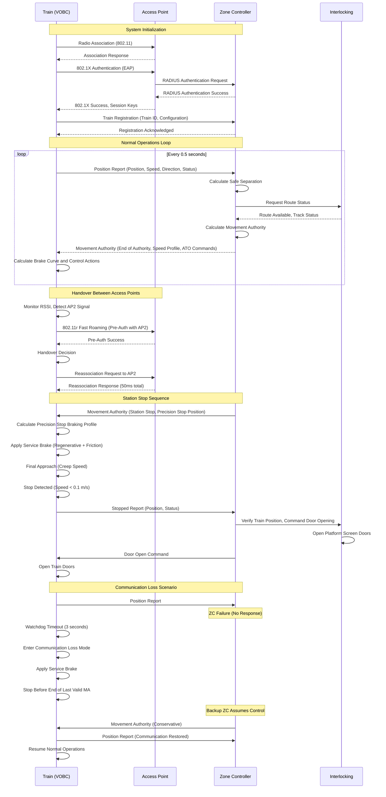

# Communications-Based Train Control (CBTC) Protocol Specification

## Protocol Overview and Purpose

Communications-Based Train Control (CBTC) represents a continuous automatic train control system that uses bidirectional train-to-wayside telecommunications to enable high-capacity railway operations with minimal headways. Unlike traditional fixed-block signaling that divides track into discrete sections, CBTC implements moving-block train separation where the safe braking distance travels with each train, dramatically increasing line capacity.

CBTC systems continuously exchange high-resolution train position, speed, and direction data with wayside controllers, enabling precise calculation of safe separation distances in real-time. This continuous communication paradigm permits trains to operate at closer spacing while maintaining or improving safety levels compared to conventional signaling systems. The protocol architecture supports automatic train operation (ATO), automatic train protection (ATP), and automatic train supervision (ATS) functionality within an integrated framework.

The primary applications of CBTC include urban metro systems, automated people movers, and high-frequency commuter railways where capacity maximization and operational flexibility are paramount. CBTC enables operational innovations including automated operations, platform screen door synchronization, precise dwell time management, and energy-efficient driving profiles. Modern CBTC deployments serve as the foundation for Grades of Automation (GoA) levels 2-4, from semi-automated to fully unattended train operation.

## Technical Architecture

### System Components

**Onboard Equipment:**
- Vehicle On-Board Controller (VOBC): Main processing unit implementing train control logic
- Bi-directional Radio: Continuous wireless communication with wayside
- Odometry System: High-precision position and speed measurement using multiple sensors
- Balise/Tag Reader: Optional position reference for position validation
- Train Interface Module: Controls traction, braking, and door systems
- Operator Interface: Display and controls for train operator (GoA 2/3) or maintenance staff (GoA 4)
- Passenger Information System: Station announcements and real-time information
- Event Recorder: Safety-critical data logging for incident analysis

**Wayside Equipment:**
- Zone Controllers (ZC): Regional track area controllers managing multiple trains
- Wayside Access Points (AP): Radio base stations providing communication coverage
- Interlocking System: Controls track switches, signals, and platform screen doors
- Central Control System: System-wide supervision, scheduling, and operator interface
- Data Communication Network: High-reliability backbone connecting all wayside elements
- Balise/Tag Encoders: Fixed position references distributed along track

### OSI Layer Operation

**Application Layer (Layer 7):**
CBTC application protocols implement sophisticated train control functions:

- **Position Reporting Protocol:** Trains transmit continuous position updates (typically 0.25-1.0 second intervals)
  - High-resolution position (decimeter accuracy)
  - Instantaneous speed and acceleration
  - Direction of travel
  - Train integrity status (no car separation detected)
  - Confidence intervals for position and speed estimates

- **Movement Authority Protocol:** Zone Controller calculates and transmits safe movement authority
  - End of authority location (moving with preceding train)
  - Speed profile (station stops, temporary restrictions, curves)
  - Track gradient information
  - Switching route assignments
  - Platform screen door control coordination

- **Automatic Train Operation (ATO) Protocol:** Precise speed and stopping control
  - Target speed profiles for energy optimization
  - Precision stopping commands (±25-50 cm accuracy at platform)
  - Acceleration/deceleration jerk limits for passenger comfort
  - Door opening/closing synchronization

- **Supervision and Diagnostics:** Real-time system health monitoring
  - Equipment status reports (onboard and wayside)
  - Communication link quality metrics
  - Position confidence degradation warnings
  - Fault detection and reporting
  - Performance statistics collection

**Network Layer (Layer 3):**
IP-based networking enables flexible routing and quality-of-service management:

- IPv4 or IPv6 addressing schemes
- Redundant routing for high availability
- Quality of Service (QoS) prioritization: Safety-critical messages highest priority
- Multicast support for efficient broadcast of common information
- Network segmentation for security isolation
- Fast handover protocols for train movement between access points

**Data Link Layer (Layer 2):**
Multiple data link technologies deployed depending on system generation:

*IEEE 802.11 (Wi-Fi):*
- Most common CBTC communication technology (2.4 GHz, 5 GHz bands)
- Enhanced with proprietary extensions for railway requirements
- Fast roaming protocols (802.11r, vendor-specific enhancements)
- Redundant access points with hitless handover
- Deterministic latency through careful channel planning

*LTE/5G Cellular:*
- Emerging technology for next-generation CBTC
- Licensed spectrum provides interference immunity
- Native mobility support and handover
- Higher available bandwidth for future features
- Standardized through 3GPP for railway applications

*Leaky Feeder Cable:*
- Legacy CBTC systems use induction loop communication
- Coaxial cable with slots radiates RF energy along track
- Very reliable but expensive installation and maintenance
- Limited bandwidth compared to modern wireless
- Still deployed in tunnels for supplemental coverage

**Physical Layer (Layer 1):**
Radio frequency transmission with railway-specific optimizations:

- Transmit power control for optimal range and interference management
- Diversity antennas (spatial diversity) for multipath mitigation
- Directional antennas focus coverage along track corridor
- Wayside antenna locations optimized for coverage overlap
- Train antenna configurations provide 360-degree coverage

### Message Structure and Types

**Position Report Message (Train → Zone Controller):**
```
Message Header:
- Message ID: POSITION_REPORT (0x0101)
- Message Length: Variable (typically 64-128 bytes)
- Timestamp: High-resolution system time (microsecond precision)
- Train ID: Unique identifier for train consist
- Sequence Number: Monotonically increasing message counter
- CRC: 32-bit cyclic redundancy check

Position Data:
- Position_Front: Front of train position (cm resolution)
- Position_Rear: Rear of train position (calculated from length)
- Position_Confidence: Statistical confidence (95%, 99%, 99.9%)
- Speed: Current speed (mm/s resolution)
- Acceleration: Current acceleration (mm/s² resolution)
- Direction: Forward / Reverse
- Position_Source: Primary odometry / Corrected by balise / GPS-assisted

Train Status:
- Operating_Mode: Manual / Supervised / Automatic / Unattended
- Door_Status: Closed_and_Locked / Open_Left / Open_Right
- Emergency_Brake_Status: Released / Applied
- Train_Integrity: Intact / Integrity_Lost / Not_Monitored
- Passenger_Load: Empty / Normal / Crowded (optional, weight-based)

Equipment Health:
- VOBC_Status: Healthy / Degraded / Failed
- Odometry_Status: All_sensors_healthy / Reduced_accuracy / Failed
- Radio_RSSI: Received signal strength indicator
- Radio_Link_Quality: Packet loss percentage
```

**Movement Authority Message (Zone Controller → Train):**
```
Message Header:
- Message ID: MOVEMENT_AUTHORITY (0x0201)
- Message Length: Variable (200-500 bytes typical)
- Timestamp: Zone Controller time
- Train_ID: Target train unique identifier
- Authority_ID: Unique identifier for this MA (safety cross-reference)
- CRC: 32-bit cyclic redundancy check

Movement Authority:
- End_of_Authority: Position where train must stop (cm resolution)
- Authority_Type: Normal / Conditional / On-Sight / Emergency_Stop
- Danger_Point: Absolute limit beyond which train must not pass
- Overlap_Distance: Additional safety margin beyond danger point
- Time_Validity: Timestamp when authority expires (if time-limited)

Speed Profile (repeated segments):
- Segment_Start_Position: Beginning of speed segment
- Segment_End_Position: End of speed segment
- Maximum_Speed: Speed limit for this segment (mm/s)
- Reason_Code: Station_Stop / Speed_Restriction / Curve / Gradient / Construction

Track Information:
- Gradient_Profile: Array of gradient changes (per-mil slope)
- Switch_Position: Points setting for route assignment
- Platform_Side: Left / Right / Both (for door control)
- Platform_Screen_Door_Present: Yes / No

ATO Commands (if ATO active):
- Target_Dwell_Time: Scheduled station stop duration (seconds)
- Target_Stop_Position: Precise platform stopping point (cm)
- Acceleration_Profile: Energy-optimized acceleration curve
- Coasting_Points: Locations to release traction for energy savings
```

**ATO Control Message (Zone Controller → Train):**
```
Message Header:
- Message ID: ATO_CONTROL (0x0203)
- Train_ID: Target train
- Timestamp: Controller time

ATO Commands:
- Command_Type: Start / Stop / Acceleration_Limit / Speed_Target
- Speed_Target: Target speed for current operation (mm/s)
- Acceleration_Limit: Maximum allowed acceleration (mm/s²)
- Jerk_Limit: Maximum rate of acceleration change (mm/s³) for comfort
- Door_Command: Open_Left / Open_Right / Close_All / Inhibit

Station Stop Control:
- Station_ID: Identifier for current station
- Stopping_Accuracy_Required: Standard (±0.5m) / High_Precision (±0.25m)
- Dwell_Time_Minimum: Minimum time doors remain open (seconds)
- Dwell_Time_Maximum: Maximum time before departure (seconds)
- Departure_Authorization: Automatic / Wait_for_Dispatcher

Energy Optimization:
- Coasting_Zones: Positions to release traction (array)
- Regenerative_Braking_Priority: High / Medium / Low
- Target_Arrival_Time: Scheduled arrival for timetable adherence
```

**Heartbeat Message (Bidirectional):**
```
Message Header:
- Message ID: HEARTBEAT (0x0001)
- Message Length: 32 bytes (minimal)
- Timestamp: Sender time
- Source_ID: Train or Zone Controller identifier
- Sequence_Number: Incremental counter
- CRC: 32-bit checksum

Status:
- Operational_Status: Normal / Degraded / Failed
- Communication_Quality: RSSI, packet loss, latency measurements
- Last_Received_Message_Time: Timestamp of last valid message from peer
```

### Communication Flow

**Normal Operation Sequence:**

```
[Initialization Phase]
1. Train powers up → VOBC self-test and diagnostic routines
2. VOBC searches for wayside access point radio beacons
3. Radio link established → authentication handshake
4. VOBC registers with Zone Controller providing train configuration data:
   - Train length, weight, braking characteristics
   - Maximum speed capability
   - ATO availability and capabilities
5. Zone Controller acknowledges registration → assigns initial Movement Authority
6. Train transitions to operational mode (Manual, Supervised, or Automatic)

[Continuous Operation Loop]
1. VOBC reads odometry sensors → calculates position and speed
2. VOBC transmits Position Report to Zone Controller (every 0.25-1.0 seconds)
3. Zone Controller receives position from all trains in zone
4. Zone Controller calculates safe separation distances using moving-block algorithm
5. Zone Controller updates Movement Authority for each train
6. Zone Controller transmits updated MA to each train
7. VOBC receives Movement Authority → validates against current position
8. VOBC calculates braking curve to respect end of authority
9. If ATO active:
   - VOBC calculates optimal speed profile respecting MA and energy efficiency
   - VOBC controls traction and braking to follow profile
10. If ATP only:
   - Driver controls train speed
   - VOBC monitors speed against MA limits
   - VOBC applies emergency brake if driver exceeds safe speed
11. Repeat loop continuously

[Station Stop Sequence]
1. Zone Controller sends MA with station stop and ATO precision stop command
2. VOBC calculates braking curve for precise platform stopping
3. Train decelerates using regenerative braking (if available) and friction brakes
4. VOBC executes precision stop algorithm (typically ±25-50 cm accuracy)
5. Train stops at target position aligned with platform screen doors
6. VOBC confirms stopped condition to Zone Controller
7. Zone Controller verifies train position → commands platform screen doors open
8. VOBC commands train doors open (synchronized with platform doors)
9. Dwell time countdown begins (minimum time for passenger exchange)
10. Dispatcher or automatic system authorizes departure
11. VOBC commands doors closed → verifies closed and locked status
12. Zone Controller commands platform screen doors closed → verifies closed
13. Zone Controller issues departure Movement Authority
14. VOBC calculates acceleration profile → applies traction
15. Train departs station following ATO speed profile or driver control
```

**Handover Sequence (Train Moving Between Access Points):**

```
1. Train operating in coverage area of Access Point A
2. Train continuously monitors signal strength from all nearby access points
3. Signal strength from Access Point B exceeds threshold (entering overlap zone)
4. VOBC initiates fast handover protocol:
   a. VOBC sends Re-Association Request to Access Point B
   b. Access Point B validates train credentials
   c. Access Point B allocates radio resources
   d. Access Point B sends Re-Association Response
   e. VOBC switches radio to Access Point B frequency/channel
   f. Connection established to Access Point B (total handover time: <50 ms)
5. Buffered messages forwarded from Access Point A to B via wayside network
6. Zone Controller transparent to handover (single IP connection maintained)
7. Normal operations continue without interruption
```

### Timing Requirements

**Safety-Critical Timing:**

- **Position Report Interval:** 250-1000 milliseconds (configurable, typically 500 ms)
  - Shorter intervals enable closer train spacing
  - Longer intervals reduce communication bandwidth
  - Adaptive intervals based on train speed and separation

- **Movement Authority Update:** Within 2 seconds of receiving position update
  - Zone Controller must calculate updated MA quickly
  - Delayed MA could cause unnecessary emergency brake application
  - Redundant Zone Controllers ensure continuous processing

- **Communication Watchdog:** 3-5 seconds maximum communication loss
  - Train applies service brake if no valid messages received within timeout
  - Timeout prevents train from running on stale movement authority
  - Train stops safely before end of last valid MA

- **Emergency Message Propagation:** <500 milliseconds
  - Emergency stop commands highest priority
  - Bypasses normal queuing and transmission delays
  - Redundant transmission on multiple channels if available

**Operational Timing:**

- **Station Stop Accuracy:** Train stopped within ±250-500 mm of target position
  - Achieved through precision odometry and ATO algorithms
  - Enables platform screen door alignment
  - Reduces dwell time (passengers don't need to walk along platform)

- **Door Operation Synchronization:**
  - Train doors and platform screen doors open simultaneously (±1 second)
  - Interlocking ensures both closed before departure authorization
  - Minimum dwell time: 15-20 seconds for safe passenger exchange
  - Maximum dwell time: 45-60 seconds to maintain schedule adherence

- **Headway Performance:**
  - Minimum following distance: 60-90 seconds in degraded mode (absolute safety minimum)
  - Normal operations: 90-120 seconds headway (typical metro service)
  - High-frequency service: 75-90 seconds (achievable with CBTC)
  - Theoretical minimum: 45-60 seconds (demonstration systems, not routine operations)

### Error Handling

**Communication Loss Scenarios:**

*Complete Communication Failure:*
```
1. Train detects no valid messages received within watchdog timeout (3-5 seconds)
2. VOBC enters "Communication Loss" degraded mode
3. Service brake applied at safe deceleration rate (typically 1.0 m/s²)
4. Train continues braking until:
   a. Communication restored (normal operations resume), OR
   b. Train stops before end of last valid Movement Authority
5. If stopped without communication:
   - Train enters "Held" status
   - Driver notified of communication failure
   - Manual intervention required to restore service
   - Restricted Manual mode allows limited movement (crawl speed)
```

*Intermittent Communication:*
```
1. Train experiences periodic message loss (packet loss rate >5%)
2. VOBC maintains operation using last valid Movement Authority
3. Longer message gaps increase safety margins in MA calculation
4. Zone Controller reduces MA grant distance for affected train
5. Train headways automatically increase for affected trains
6. Maintenance alerts generated for radio infrastructure diagnostics
7. If packet loss exceeds threshold (>20%), trigger communication loss procedure
```

**Position Uncertainty Scenarios:**

*Balise Reference Failure:*
```
1. Train expected to encounter balise at known location
2. VOBC doesn't detect balise transmission (missed balise)
3. Position confidence degrades to "Dead Reckoning" mode
4. VOBC increases position uncertainty bounds based on distance traveled
5. Zone Controller applies conservative safety margins in MA calculation
6. Reduced MA distances result in lower maximum speeds
7. Train must encounter next valid balise within distance limit
8. If excessive distance without balise reference:
   - Train stops and enters "Position Lost" mode
   - Manual position confirmation required from driver
   - Restricted operations until confidence restored
```

*Odometry Sensor Failure:*
```
1. VOBC detects discrepancy between redundant odometry sensors
2. VOBC attempts to identify failed sensor through sensor voting
3. If single sensor failed: Continue with remaining sensors (reduced confidence)
4. If multiple sensors failed or disagreement cannot be resolved:
   - Train stops immediately (emergency brake)
   - "Safe State" entered (no movement permitted)
   - Maintenance intervention required
   - Defective train removed from service
```

**Zone Controller Failures:**

*Primary Zone Controller Failure:*
```
1. Backup Zone Controller continuously monitors primary health
2. Primary Zone Controller heartbeat timeout (2 seconds)
3. Backup Zone Controller assumes control (hot standby)
4. All train sessions transferred to backup controller
5. Backup Zone Controller reconstructs train state from last known positions
6. Conservative Movement Authorities issued until confidence restored
7. Normal operations resume within 5-10 seconds
8. No train service interruption (seamless failover)
9. Maintenance alerts dispatched for primary controller repair
```

*Complete Zone Controller Failure (Primary and Backup):*
```
1. All trains in zone lose communication with Zone Controller
2. Trains enter Communication Loss mode (service brake)
3. Trains stop before end of last valid Movement Authority
4. Adjacent Zone Controller extends coverage if possible
5. Trains at zone boundary may be transferred to adjacent zone
6. Trains inside failed zone remain stopped until controller restored
7. Emergency manual operations procedures invoked if extended outage
8. Significant service disruption until controller replacement/repair
```

**Train-Level Failures:**

*VOBC Failure:*
```
1. VOBC internal diagnostics detect critical fault
2. Backup VOBC channel (if equipped) assumes control
3. If no backup or both channels failed:
   - Emergency brake applied immediately
   - Train enters "Safe State" (no release without maintenance)
   - All traction and brake controls inhibited except emergency brake
   - Train must be pushed/towed from mainline
   - Complete VOBC replacement/repair required
```

*Brake System Failure:*
```
1. Train Interface Module detects brake system fault
2. If partial brake failure: VOBC adjusts braking model
   - Increased braking distance calculations
   - Reduced maximum permitted speed
   - Zone Controller notified of degraded braking
   - Train continues in service with restrictions
3. If complete brake failure detected:
   - Emergency brake applied (independent mechanical system)
   - Train stops and enters "Safe State"
   - No movement authorization until brake repair verified
```

## Physical Layer Specifications

### IEEE 802.11 (Wi-Fi) CBTC Implementation

**Frequency Bands:**
- **2.4 GHz ISM Band:** 2.400-2.483 GHz
  - Channels: 14 channels (channel 1-11 in North America, 1-13 Europe, 1-14 Japan)
  - Channel width: 20 MHz (standard), 22 MHz effective with guard bands
  - Advantages: Better propagation, penetrates obstacles well
  - Disadvantages: Crowded spectrum, interference from Wi-Fi, Bluetooth, microwave ovens

- **5 GHz Bands:** 5.150-5.875 GHz (multiple sub-bands)
  - Channels: 24+ non-overlapping 20 MHz channels available
  - Channel width: 20 MHz, 40 MHz, 80 MHz, 160 MHz (CBTC typically uses 20 MHz)
  - Advantages: Less crowded, more channels, higher data rates
  - Disadvantages: Shorter range, less obstacle penetration, higher power requirements

**Modulation and Coding:**
- **802.11n (most deployed CBTC):**
  - Modulation: BPSK, QPSK, 16-QAM, 64-QAM (adaptive based on link quality)
  - Coding: LDPC or BCC forward error correction
  - Spatial streams: 1-4 MIMO streams (CBTC typically 2x2 or 3x3 MIMO)
  - Data rates: 6.5-300 Mbps (theoretical), CBTC uses 20-150 Mbps sustained

- **802.11ac (next-generation CBTC):**
  - Modulation: Up to 256-QAM (higher spectral efficiency)
  - Multi-user MIMO (MU-MIMO): Simultaneous transmission to multiple trains
  - Beamforming: Directional transmission improves range and reliability
  - Data rates: 433-1300 Mbps (CBTC uses small fraction for safety message headroom)

**Power Specifications:**
- **Wayside Access Points:**
  - Transmit power: 20-30 dBm (100 mW - 1000 mW) depending on regulations
  - Antenna gain: 6-12 dBi (directional antennas focused along track)
  - Effective radiated power: 26-42 dBm after antenna gain
  - Typical coverage: 400-800 meters per access point

- **Train Radio Units:**
  - Transmit power: 20-25 dBm (100-316 mW)
  - Antenna gain: 2-5 dBi (omnidirectional or sector antennas)
  - Antenna diversity: 2-4 antennas for spatial diversity and redundancy
  - Typical reliable range: 300-600 meters to access point

**Link Budget Analysis (2.4 GHz):**
```
Wayside Access Point Transmission:
- Transmit power: +27 dBm (500 mW)
- Antenna gain: +9 dBi (directional along track)
- Cable/connector loss: -2 dB
- Effective radiated power: +34 dBm

Path Loss (Free Space + Tunnel/Obstruction):
- Distance: 500 meters
- Free space path loss (2.4 GHz): -98 dB
- Additional tunnel loss: -15 dB
- Total path loss: -113 dB

Train Reception:
- Receive antenna gain: +3 dBi
- Cable/connector loss: -1 dB
- Received signal strength: 34 - 113 + 3 - 1 = -77 dBm

Receiver Sensitivity:
- Required SNR for 64-QAM: 20 dB
- Noise floor (-174 dBm/Hz + 10*log10(20 MHz BW)): -101 dBm
- Receiver sensitivity: -101 + 20 = -81 dBm

Link Margin:
- -77 dBm received - (-81 dBm sensitivity) = 4 dB margin
- Additional margin provided by: Lower modulation fallback, FEC coding, retransmissions
- Effective link margin with adaptive modulation: 15-20 dB
```

**Handover Performance:**
- **Access Point Spacing:** 300-500 meters typical
  - Overlap coverage: 100-200 meters between adjacent APs
  - Handover triggered at RSSI threshold (typically -70 to -75 dBm)
  - Train maintains connection until new AP fully established

- **Fast Roaming Protocols:**
  - 802.11r (Fast BSS Transition): Reduces handover to <50 ms
  - Pre-authentication: Train authenticates with next AP before leaving current
  - Opportunistic Key Caching: Reuses security credentials for faster handover
  - Vendor-specific enhancements: Some systems achieve <20 ms handover

- **Seamless Handover:**
  - Make-before-break: Connection to new AP established before releasing old AP
  - Buffered packet forwarding: Packets sent to old AP forwarded via backbone
  - Zero packet loss during handover (with proper implementation)
  - Train control messages duplicated during handover for redundancy

### Leaky Feeder Cable Systems (Legacy CBTC)

**Physical Characteristics:**
- **Cable Type:** Radiating coaxial cable (7/8" or 1-5/8" diameter)
- **Operating Frequency:** 400-500 MHz or 850-950 MHz (regional variations)
- **Coupling Loss:** 60-80 dB (depending on cable design and installation)
- **Attenuation:** 5-15 dB per 100 meters (frequency dependent)

**Deployment:**
- Cable mounted along tunnel wall or ceiling
- Slots or gaps in cable shield radiate RF energy
- Bidirectional communication through near-field coupling
- Train antennas couple to cable within 3-5 meters distance

**Advantages:**
- Very reliable, not susceptible to external interference
- Excellent coverage in tunnels and underground sections
- No handover required (continuous cable)
- Proven technology with decades of operational history

**Disadvantages:**
- Expensive installation and maintenance
- Limited bandwidth (typically <1 Mbps)
- Difficult to upgrade or modify
- Physical damage disrupts communication
- Being phased out in favor of Wi-Fi and LTE

### LTE/5G Cellular CBTC (Emerging Technology)

**Frequency Bands:**
- Licensed spectrum: 700 MHz, 800 MHz, 2.6 GHz, 3.5 GHz (region dependent)
- Private network deployment: Dedicated spectrum for railway operations
- Advantages: Interference immunity, guaranteed quality of service

**Performance Characteristics:**
- **Latency:** <20 ms (LTE), <10 ms (5G) for safety-critical messages
- **Reliability:** 99.999% availability through network redundancy
- **Handover:** <50 ms with optimized parameters
- **Coverage:** Larger cell radius (1-3 km) reduces infrastructure density

**3GPP Railway Standards:**
- FRMCS (Future Railway Mobile Communication System): Successor to GSM-R
- Mission-critical push-to-talk (MCPTT): Voice communication for operations
- Network slicing: Dedicated virtual network for CBTC traffic isolation
- QoS guarantees: Differentiated services for safety-critical vs. non-critical data

## Data Link Layer Details

### IEEE 802.11 MAC Protocol Adaptations

**Channel Access:**
Standard Wi-Fi uses CSMA/CA (Carrier Sense Multiple Access with Collision Avoidance):
```
1. Station wants to transmit
2. Check if medium is idle (no other transmission detected)
3. Wait for DIFS (Distributed Inter-Frame Space) idle period
4. If medium still idle, transmit frame
5. If collision detected, enter exponential backoff:
   - Random backoff timer selected
   - Wait for timer expiration
   - Retry transmission
```

CBTC modifications to standard 802.11 MAC:
- **Deterministic Scheduling:** Some CBTC systems use proprietary MAC protocols
  - Time slots assigned to each train (TDMA approach)
  - Eliminates random backoff and collision scenarios
  - Guarantees message delivery within bounded time

- **Priority Queuing:**
  - Safety-critical messages use highest priority access category
  - Emergency messages bypass normal queuing
  - Background data (diagnostics, logs) uses lowest priority
  - 802.11e QoS mechanisms (EDCA) for priority differentiation

**Frame Structure:**
```
IEEE 802.11 MAC Frame (used by CBTC):

Frame Control (2 bytes):
- Protocol version, frame type, flags
- To/From DS bits indicate infrastructure mode

Duration/ID (2 bytes):
- NAV (Network Allocation Vector) for virtual carrier sense

Address Fields (6 bytes each):
- Address 1: Receiver address (Access Point or Train)
- Address 2: Transmitter address
- Address 3: BSSID (Basic Service Set Identifier)
- Address 4: Optional (used in mesh networks)

Sequence Control (2 bytes):
- Fragment number and sequence number for reassembly

Frame Body (0-2304 bytes):
- CBTC application protocol messages (position reports, MAs)
- Encapsulated in UDP/IP packets

FCS (4 bytes):
- Frame Check Sequence (CRC-32) for error detection
```

**Acknowledgment and Retransmission:**
- **Immediate ACK:** Receiver sends ACK frame within SIFS (Short Inter-Frame Space)
- **Retransmission:** If ACK not received, sender retransmits after timeout
- **Block ACK:** Efficient acknowledgment of multiple frames (802.11n/ac)
- **CBTC Reliability:** Application-layer acknowledgments supplement MAC-layer ACKs
  - Critical messages acknowledged at both MAC and application layers
  - End-to-end reliability despite intermediate node failures

### Security at Data Link Layer

**WPA2-Enterprise (802.11i):**
CBTC systems use enterprise-grade Wi-Fi security:

- **Authentication:** 802.1X with EAP (Extensible Authentication Protocol)
  - Train presents credentials to RADIUS authentication server
  - Mutual authentication (train and infrastructure verify identities)
  - Certificates or pre-shared keys depending on implementation

- **Encryption:** AES-CCMP (Counter Mode with Cipher Block Chaining Message Authentication Code Protocol)
  - 128-bit AES encryption of all data frames
  - Per-frame integrity check prevents message modification
  - Replay protection through packet numbering

- **Key Management:**
  - 4-way handshake establishes session keys
  - Dynamic keys unique per train and session
  - Periodic key rotation (typically every few hours)
  - Fast transition keys for seamless handover

## Application Layer Protocols

### Moving-Block Train Separation Algorithm

The core safety function of CBTC is calculating safe separation between trains using moving-block principles:

**Traditional Fixed-Block Signaling:**
```
Track divided into fixed sections (blocks)
Each block protected by signal
Only one train permitted per block
Block length = Maximum train length + Braking distance of fastest train + Safety margin

Example: 2 km block length
→ Minimum headway = Time for train to traverse entire block
→ Typical headway: 3-5 minutes
```

**CBTC Moving-Block Algorithm:**
```
No fixed blocks, separation distance moves with each train
Safe separation = Leading train rear position - Following train front position
Safe separation must exceed following train braking distance + safety margin

Algorithm (executed every 0.5-1.0 seconds):
1. Receive position report from Leading Train (Train A)
   - Rear position: 10,525.3 meters
   - Speed: 25.8 m/s
   - Direction: Forward

2. Receive position report from Following Train (Train B)
   - Front position: 9,875.1 meters
   - Speed: 27.2 m/s
   - Direction: Forward
   - Braking rate: 1.2 m/s² (service brake)

3. Calculate Following Train braking distance:
   Braking distance = (Speed²) / (2 × Braking rate) + Safety margin
   Braking distance = (27.2²) / (2 × 1.2) + 50 = 370.4 / 2.4 + 50 = 204.3 meters

4. Calculate current separation:
   Separation = Leading train rear - Following train front
   Separation = 10,525.3 - 9,875.1 = 650.2 meters

5. Compare separation to required braking distance:
   650.2 meters > 204.3 meters → Separation adequate ✓

6. Calculate End of Movement Authority for Following Train:
   End of Authority = Leading train rear - Required braking distance - Safety margin
   End of Authority = 10,525.3 - 204.3 - 50 = 10,271.0 meters

7. Transmit Movement Authority to Following Train B:
   "You may proceed forward to position 10,271.0 meters at maximum speed"

8. Following Train VOBC calculates brake curve:
   - Current position: 9,875.1 m
   - End of authority: 10,271.0 m
   - Available distance: 395.9 m
   - Can maintain current speed (27.2 m/s) safely

Repeat calculation every 0.5-1.0 seconds as trains move
Movement Authority continuously updated based on real-time positions
```

**Benefits of Moving-Block:**
- Separation distance optimized for each specific train pair
- Faster trains can safely approach slower trains more closely
- Headways reduced from 3-5 minutes to 1.5-2.5 minutes (40-60% capacity increase)
- Smooth speed profiles (no abrupt braking for block boundaries)
- Theoretical minimum headway = Train length + Braking distance + Safety margin (~60-90 seconds)

### Automatic Train Operation (ATO) Algorithms

**Energy-Efficient Speed Profile Calculation:**

ATO optimizes train speed profile to minimize energy consumption while meeting schedule:

```
Input Parameters:
- Current position and speed
- Target station and scheduled arrival time
- Movement Authority (safe end of authority and speed restrictions)
- Track gradient profile
- Train performance characteristics (acceleration, braking, coasting deceleration)

Optimization Objective:
Minimize: Total_Energy = Traction_Energy - Regenerative_Braking_Energy

Subject to Constraints:
- Arrival time = Scheduled time (±15 seconds tolerance)
- Speed ≤ Movement Authority speed limit
- Speed ≤ Track speed restrictions
- Speed profile respects comfort limits (acceleration, jerk)

Algorithm:
1. Calculate baseline speed profile:
   - Maximum acceleration to line speed
   - Constant speed at line speed
   - Maximum braking to station stop
   - Check arrival time

2. If early arrival predicted:
   - Introduce coasting zones (zero traction)
   - Coasting locations optimized:
     * Before downgrades (gravity assists acceleration)
     * Before station approaches (coast into braking)
   - Reduce maximum speed in middle of journey

3. If late arrival predicted:
   - Increase acceleration and maximum speed (within limits)
   - Reduce coasting zones
   - Alert dispatcher if schedule cannot be met

4. Optimize for energy:
   - Maximize regenerative braking usage (brake before station, not coast to stop)
   - Match speed profile to gradient (accelerate downgrade, coast upgrade)
   - Smooth speed transitions (reduces traction energy spikes)

5. Calculate control outputs every 100 milliseconds:
   - Traction power command (0-100%)
   - Braking effort command (0-100%)
   - Smooth control transitions for passenger comfort

Example Energy Savings:
- Baseline (maximum speed throughout): 100 kWh per journey
- ATO optimized (coasting zones): 65 kWh per journey
- 35% energy reduction with same journey time
```

**Precision Station Stopping:**

High accuracy stopping essential for platform screen door alignment:

```
Stopping Algorithm (executed 10-20 times per second during approach):

1. Initialize:
   - Target stop position: 10,250.00 meters
   - Stopping tolerance: ±0.25 meters
   - Current position: 9,980.5 meters
   - Current speed: 15.3 m/s

2. Calculate distance to target:
   Distance remaining = Target - Current position
   Distance remaining = 10,250.00 - 9,980.5 = 269.5 meters

3. Calculate required deceleration:
   Required deceleration = (Speed²) / (2 × Distance remaining)
   Required deceleration = (15.3²) / (2 × 269.5) = 0.43 m/s²

4. Calculate jerk-limited deceleration:
   - Jerk limit: 0.75 m/s³ (passenger comfort constraint)
   - Gradual brake application avoiding sudden deceleration
   - Brake effort ramped at 0.75 m/s³ until target deceleration reached

5. Apply braking:
   - Service brake initially (comfortable deceleration)
   - Regenerative braking maximized (energy recovery + smooth control)
   - Friction brakes supplement if needed

6. Approaching target (final 50 meters):
   - Switch to high-precision control mode
   - Increase update rate to 20 Hz (50 ms intervals)
   - Reduce braking force to fine control (creep speed)

7. Final approach (last 10 meters):
   - Speed target: 0.5 m/s creep speed
   - Precise odometry (average multiple sensors)
   - Anticipatory control (compensate for brake lag)

8. Stop detection:
   - Speed < 0.1 m/s for 1.0 seconds
   - Position: 10,250.12 meters
   - Error: +0.12 meters (within ±0.25 m tolerance) ✓

9. Final actions:
   - Apply parking brake (holding brake)
   - Report stopped status to Zone Controller
   - Zone Controller verifies position → commands doors open
```

### Degraded Mode Operations

CBTC systems include fallback modes for equipment failures or adverse conditions:

**Level of Automation Degradation:**
```
Grade of Automation 4 (GoA4): Unattended Train Operation
→ No staff on train, completely automated including emergency handling
↓ (Communication failure or equipment fault)

Grade of Automation 3 (GoA3): Driverless Train Operation
→ Automatic operation, attendant on train for emergencies
↓ (ATO failure)

Grade of Automation 2 (GoA2): Semi-Automatic Train Operation
→ Driver controls doors and start, ATO controls speed
↓ (VOBC partial failure)

Grade of Automation 1 (GoA1): Non-Automated Train Operation
→ Driver manually controls train, ATP provides overspeed protection
↓ (Complete CBTC failure)

Manual Line-of-Sight Operation:
→ Conventional railway operations with visual signals (ultimate fallback)
```

**Communication Loss Fallback:**
```
Normal CBTC Operation: Continuous bidirectional radio communication

Scenario: Radio link disrupted (interference, equipment failure)

1. Train detects communication loss (no messages for 3 seconds)
2. Enter "Communication Loss Mode"
   - Continue under last valid Movement Authority
   - Service brake applied if approaching end of authority
   - Train stops before end of authority (safe state)
3. Attempt communication restoration:
   - Radio automatically searches for access points
   - Try alternate frequencies/channels
   - Switch to backup radio unit if available
4. If communication restored within 30 seconds:
   - Normal operations resume
   - No significant service impact
5. If extended communication loss:
   - Train remains stopped at safe location
   - Driver contacted via emergency voice radio
   - Options:
     a. Wait for communication restoration
     b. Manual mode authorization from control center
     c. Operating under line-of-sight rules (extreme degradation)
```

## Security Features

### Authentication and Authorization

**Train Authentication:**
- **Certificate-Based Authentication:**
  - Each train equipped with unique X.509 digital certificate
  - Certificate contains: Train ID, serial number, operating authority, expiration date
  - Signed by railway Certificate Authority (CA)
  - Validates train identity during initial registration with Zone Controller

- **Mutual Authentication:**
  - Train authenticates Zone Controller (prevents rogue controller attacks)
  - Zone Controller authenticates train (prevents unauthorized trains)
  - Based on PKI (Public Key Infrastructure) with trusted CA hierarchy

- **Session Key Exchange:**
  - After authentication, symmetric session key established (AES-256)
  - Session key used for all subsequent message encryption and authentication
  - Key rotation every 4-8 hours or after 1 million messages

**Operator Authentication:**
- Driver login with PIN, biometric, or smartcard
- Multi-factor authentication for critical functions (manual mode, emergency overrides)
- Authorization levels: Operator, Maintenance, Supervisor, Administrator
- Audit logging of all operator actions with timestamps

### Encryption and Integrity

**Message-Level Security:**
```
Secure Message Structure:

Plaintext Application Message:
- Position report, Movement Authority, ATO commands
- Message type, parameters, timestamp

Encryption:
- AES-256 encryption in GCM (Galois/Counter Mode)
- Provides both confidentiality and authenticity
- Nonce (unique per message) prevents replay attacks

Authentication Tag:
- 128-bit authentication tag (part of GCM output)
- Verifies message integrity and authenticity
- Detects any message modification or injection

Secure Message:
[Nonce | Encrypted Message | Authentication Tag | Timestamp | Sequence Number]

Receiver Validation:
1. Check timestamp (reject messages >5 seconds old)
2. Check sequence number (reject out-of-window messages)
3. Decrypt message using session key
4. Verify authentication tag
5. If validation passes: Process message
   If validation fails: Discard message, log security event
```

**Physical Layer Security:**
- WPA2-Enterprise encryption (802.11i) for radio link
- Prevents wireless eavesdropping and injection attacks
- Radio frame encryption separate from application message encryption (defense in depth)

### Intrusion Detection and Prevention

**Anomaly Detection:**
- **Message Rate Monitoring:** Detect unusual message patterns
  - Baseline: Position reports every 0.5 seconds
  - Alert: Position report rate >2× baseline (possible replay attack)

- **Position Plausibility Checking:**
  - Validate reported position against last known position and maximum speed
  - Reject impossible position jumps (teleportation detection)
  - Example: Train at position 10,000 m, next report 10,500 m (0.5 seconds)
    → Maximum possible: 10,000 + (MAX_SPEED × 0.5) = 10,000 + (30 m/s × 0.5) = 10,150 m
    → Position 10,500 m impossible → Reject message as spoofed

- **Command Validation:**
  - Zone Controller validates all train commands before execution
  - Emergency stop commands verified through independent safety channel
  - Rate limiting on configuration changes (prevents rapid malicious reconfiguration)

**Security Monitoring:**
- Centralized Security Information and Event Management (SIEM)
- Real-time correlation of security events across all system components
- Automated alerts for: Authentication failures, message validation failures, anomalous patterns
- Integration with railway operational security center

**Incident Response:**
- Automated response to detected attacks:
  - Block malicious traffic sources
  - Isolate compromised trains or wayside equipment
  - Maintain safe operations during security incidents
- Manual investigation and forensics for serious events
- Coordinated disclosure for discovered vulnerabilities

## Known Vulnerabilities and CVEs

### Wireless Communication Vulnerabilities

**Wi-Fi Jamming (CVE-2019-15126, related):**
CBTC systems using 2.4 GHz or 5 GHz Wi-Fi susceptible to radio frequency jamming:
- Attacker transmits high-power noise in CBTC frequency band
- Overwhelms legitimate signals, prevents communication
- Causes trains to enter communication loss mode (stop)

Mitigation:
- Spectrum monitoring detects jamming attempts
- Frequency hopping or channel switching to avoid jamming
- Redundant communication paths (multiple frequency bands)
- Physical security prevents attacker proximity to infrastructure
- Fallback to degraded mode operations maintains safety

**Deauthentication Attacks:**
Attacker sends spoofed 802.11 deauthentication frames:
- Forces train to disconnect from access point
- Triggers handover or communication loss mode
- Causes service disruption but not safety hazard (trains stop safely)

Mitigation:
- 802.11w (Management Frame Protection) prevents frame spoofing
- Mandatory in modern CBTC Wi-Fi implementations
- Fast re-authentication minimizes disruption duration

**Rogue Access Point:**
Attacker deploys fake access point with same SSID as legitimate infrastructure:
- Train may connect to rogue AP
- Attacker intercepts messages, injects false commands

Mitigation:
- WPA2-Enterprise mutual authentication (train verifies AP certificate)
- Rogue AP cannot obtain valid certificate from railway CA
- Connection attempt fails authentication, train ignores rogue AP
- RF fingerprinting detects anomalous access points

### Protocol-Level Vulnerabilities

**Position Spoofing:**
If attacker compromises onboard VOBC and can generate valid authenticated messages:
- False position reports sent to Zone Controller
- Zone Controller grants Movement Authority based on false position
- Could cause collision if position reported further back than actual

Mitigation:
- Tamper-resistant hardware for VOBC (difficult to compromise)
- Plausibility checking: Validate position against odometry models
- Redundant position references (balise readings must match reported position)
- Anomaly detection identifies impossible position changes
- Physical security prevents unauthorized access to trains

**Movement Authority Injection:**
If attacker compromises Zone Controller or communication path:
- False Movement Authority commands sent to trains
- Could authorize unsafe train movements

Mitigation:
- Strong authentication prevents unauthorized Zone Controller access
- Message authentication (AES-GCM) prevents message injection or modification
- Zone Controller redundancy (backup controller validates primary commands)
- Interlocking provides independent safety check (won't grant conflicting routes)
- Trains validate Movement Authority against safety rules (reject unsafe MAs)

**Replay Attacks:**
Attacker records valid messages and retransmits later:
- Position reports replayed to confuse Zone Controller
- Movement Authority replayed to extend expired authority

Mitigation:
- Timestamp in each message (reject messages >5 seconds old)
- Sequence numbers prevent message reordering or replay
- Nonces in encrypted messages ensure uniqueness
- Session keys rotated regularly (old messages invalid with new keys)

### Implementation Vulnerabilities

**Software Defects:**
CBTC software is complex, potential for bugs:
- Buffer overflows in message parsing
- Race conditions in multithreaded VOBC software
- Logic errors in movement authority calculation

Mitigation:
- EN 50128 software development standards (formal methods, verification)
- Extensive testing (unit tests, integration tests, field tests)
- Independent safety validation (third-party review)
- Defense in depth (multiple safety layers)
- Incident reporting database shared across industry

**Configuration Errors:**
Incorrect system configuration causes operational problems:
- Train parameters (length, braking rate) incorrectly configured
- Track database errors (incorrect speed limits, gradients)
- Security credential misconfiguration

Mitigation:
- Automated configuration validation tools
- Two-person verification for critical configurations
- Pilot testing before full deployment
- Configuration version control and audit trails

**Supply Chain Risks:**
Components sourced from multiple vendors, potential for compromise:
- Malicious code inserted in VOBC firmware
- Backdoors in wayside equipment software
- Counterfeit components with unknown provenance

Mitigation:
- Vendor security assessments and audits
- Code signing and verification (only signed firmware runs)
- Secure development environments
- Component authenticity verification
- Diversity (multiple vendors reduces single point of compromise)

### Emerging Threats

**Coordinated Cyber-Physical Attacks:**
Simultaneous attacks on multiple system components:
- Cyberattack disables control center while physical sabotage damages infrastructure
- Overwhelms operators and incident response capabilities

Mitigation:
- Security operations center monitors for coordinated activity
- Incident response plans address combined scenarios
- Redundancy and defense in depth limit attack effectiveness
- Coordination with law enforcement and intelligence agencies

**Insider Threats:**
Malicious or negligent employees with system access:
- Maintenance staff with physical access to equipment
- Operators with legitimate credentials abusing privileges
- Disgruntled employees sabotaging systems

Mitigation:
- Personnel security screening and background checks
- Least-privilege access control (only needed permissions)
- Audit logging and anomaly detection for insider activity
- Security awareness training
- Separation of duties for critical operations

**AI-Powered Attacks:**
Advanced persistent threats using machine learning:
- Adaptive attacks that learn system behavior
- Evasion of anomaly detection through gradual changes
- Automated vulnerability discovery

Mitigation:
- AI-powered defense systems (fight AI with AI)
- Continuous security monitoring and threat intelligence
- Regular security assessments and red team exercises
- Rapid patching and vulnerability remediation

## Implementation Considerations

### System Design Trade-offs

**Capacity vs. Reliability:**
- Shorter headways increase capacity but reduce recovery time margins
- More aggressive moving-block algorithms increase capacity but require more precise position tracking
- Redundancy decreases capacity (backup systems consume resources) but increases reliability
- Typical balance: 90-120 second headways with 99.9%+ reliability

**Automation vs. Flexibility:**
- Full automation (GoA 4) maximizes efficiency but less adaptable to unusual situations
- Human operators provide flexibility but increase operating costs
- Hybrid approach: GoA 4 normal operations with remote human monitoring and intervention capability
- Gradual automation increase as operational experience builds confidence

**Cost vs. Performance:**
- High-performance CBTC (60 second headways) requires denser wayside infrastructure (more access points, more zone controllers)
- Moderate performance (120 second headways) reduces infrastructure costs
- Legacy system integration increases costs vs. greenfield deployment
- Long-term operational savings (energy, labor) justify higher capital costs

### Deployment Strategies

**Greenfield Deployment:**
New railway lines implementing CBTC from start:
- Optimal infrastructure placement (access points, zone controller locations)
- Unified operations from beginning (no legacy system integration)
- Higher initial GoA levels feasible (GoA 3 or 4)
- Example: Dubai Metro (GoA 4 from opening)

**Brownfield Migration:**
Existing railways upgrading to CBTC:
- Phased deployment (one line or section at a time)
- Dual system operation period (CBTC and legacy signaling coexist)
- Fleet upgrade complexity (trains require CBTC equipment installation)
- Operational disruptions during cutover
- Example: London Underground Northern Line (incremental deployment)

**Overlay Approach:**
CBTC added while retaining legacy signaling:
- Both systems operational indefinitely
- CBTC-equipped trains benefit from closer headways
- Non-equipped trains operate with legacy signaling
- Gradual fleet transition
- Higher long-term costs maintaining two systems

### Performance Optimization

**Radio Coverage Optimization:**
- Access point locations surveyed with RF propagation modeling
- Overlap coverage in critical areas (stations, junctions, handover zones)
- Directional antennas focus coverage along track
- Tunnel and underground sections require denser AP deployment
- Regular RF surveys verify design assumptions

**Position Reporting Interval Tuning:**
- Shorter intervals (250-500 ms) enable tighter train separation
- Longer intervals (500-1000 ms) reduce radio bandwidth consumption
- Adaptive intervals: Higher frequency in dense traffic areas, lower in open track
- Balance capacity gains against communication infrastructure load

**Zone Controller Sizing:**
- Each ZC manages a geographical area (zone)
- Zone size balances: Number of trains managed, processor capacity, communication latency
- Typical zone: 5-10 km of track, 8-15 trains simultaneously
- Redundant ZCs (1+1 or N+1 configurations) provide high availability
- Load balancing across multiple ZCs during peak operations

**Movement Authority Strategy:**
- Longer MA grant distances (farther end of authority) improve efficiency and operator confidence
- Shorter MA requires more conservative train operation (frequent speed reductions)
- Conditional MA: Authority granted beyond next train, conditional on that train moving
- Look-ahead distance optimization: Balance safety margins with operational efficiency

## Vendor Support and Interoperability

### Major CBTC Suppliers

**Integrated System Vendors:**
- Alstom: Urbalis CBTC (100+ installations worldwide)
- Siemens Mobility: Trainguard MT CBTC (deployed on major metro systems)
- Hitachi Rail STS: SelTrac CBTC (original CBTC pioneer, Toronto, New York, Singapore)
- Thales: SelTrac (now part of Hitachi Rail STS portfolio)
- CRRC: Chinese CBTC systems (extensive domestic deployment)
- Bombardier Transportation (now Alstom): Cityflo CBTC

**Component Suppliers:**
- Onboard equipment: Alstom, Siemens, Hitachi, Thales, Bombardier, CRRC, CAF
- Wayside radio: Cisco, Aruba (HP), Ruckus Wireless, Motorola
- Interlocking: Alstom, Siemens, Hitachi, Thales, Bombardier
- Control center: Vendor-specific or third-party SCADA systems

### Interoperability Challenges

**Proprietary Extensions:**
Most CBTC systems include vendor-specific extensions beyond IEEE 1474.1 standard:
- Proprietary safety layers and message authentication
- Vendor-specific ATO algorithms and performance tuning
- Custom radio protocols and handover mechanisms
- Incompatible between different vendors

**Limited Cross-Vendor Compatibility:**
- Trains from Vendor A typically cannot operate on Vendor B infrastructure
- Complete CBTC system sourcing from single vendor common
- Multi-vendor integration requires extensive customization and testing
- No plug-and-play interoperability like ETCS in railway industry

**Migration Difficulties:**
- Upgrading from one vendor's CBTC to another vendor requires complete system replacement
- No incremental migration path (unlike ETCS baselines)
- Long vendor lock-in (20-30 year system lifetimes)
- Standardization efforts ongoing but challenging

### Standards Compliance

**IEEE 1474.1 - Standard for Communications-Based Train Control (CBTC) Performance and Functional Requirements:**
- Defines minimum CBTC functional requirements
- Does not specify protocols or message formats in detail
- Allows vendor-specific implementations meeting performance criteria
- Focus on safety requirements and interoperability goals

**IEC 62290 - Railway Applications - Urban Guided Transport Management and Command/Control Systems:**
- International standard harmonizing CBTC requirements
- Part 1: System principles and fundamental concepts
- Part 2: Functional requirements
- Part 3: Application to radio data communication system requirements
- Part 4: System interfaces

**EN 50126/50128/50129 (CENELEC Standards):**
- Safety lifecycle management (EN 50126)
- Software development for safety-critical systems (EN 50128)
- Electronic signaling system safety (EN 50129)
- Mandatory compliance for CBTC systems deployed in Europe

**Grade of Automation (GoA) Definitions:**
Defined by IEC 62267 and adopted internationally:
- GoA 0: On-sight train operation (no automation)
- GoA 1: Non-automated train operation (driver controls with ATP protection)
- GoA 2: Semi-automated train operation (ATO controls speed, driver supervises)
- GoA 3: Driverless train operation (ATO full control, attendant for emergencies)
- GoA 4: Unattended train operation (completely automated, no staff)

## Protocol Communication Sequence Diagram



## References

1. **IEEE 1474.1-2004 - Standard for Communications-Based Train Control (CBTC) Performance and Functional Requirements**
   https://standards.ieee.org/standard/1474_1-2004.html
   Primary standard defining CBTC system requirements and performance criteria.

2. **IEC 62290 Series - Railway Applications - Urban Guided Transport Management and Command/Control Systems**
   https://webstore.iec.ch/publication/6760
   International standard series covering CBTC functional requirements, system principles, and radio communication.

3. **Hitachi Rail STS - SelTrac CBTC Technical Overview**
   https://www.hitachirail.com/products/signalling-solutions/communications-based-train-control-cbtc/
   Technical documentation and case studies from SelTrac CBTC pioneer and major supplier.

4. **Siemens Mobility - Trainguard MT Communications-Based Train Control**
   https://www.mobility.siemens.com/global/en/portfolio/rail/automation/train-control-systems/trainguard-mt.html
   Trainguard MT system architecture, deployment examples, and technical specifications.

5. **Transportation Research Board - TCRP Report 105: Communications-Based Train Control (CBTC) System Implementation**
   http://www.trb.org/Publications/Blurbs/157443.aspx
   Comprehensive guide for transit agencies implementing CBTC, including technical and operational considerations.

6. **IEEE 802.11 Standards for Wireless LAN (Wi-Fi)**
   https://standards.ieee.org/standard/802_11-2020.html
   Physical and data link layer specifications for Wi-Fi technology used in modern CBTC systems.
