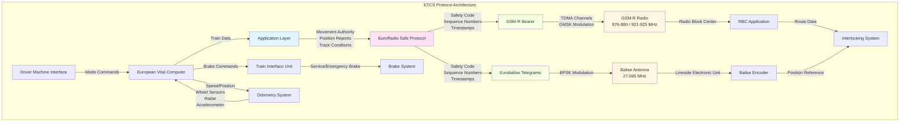
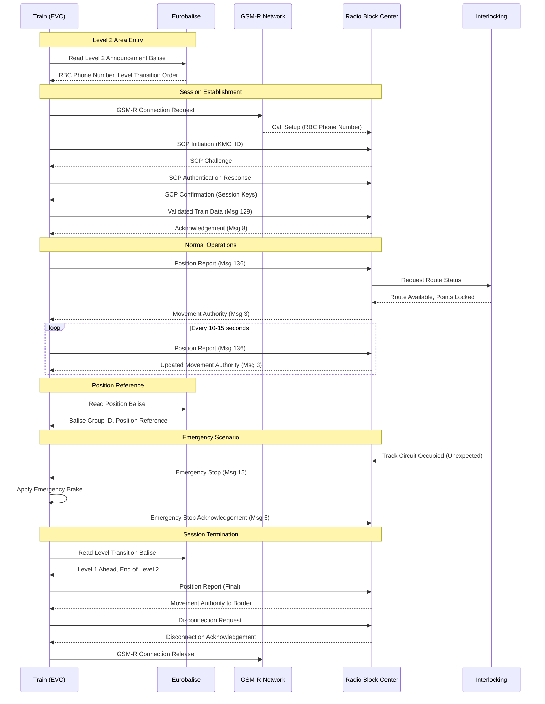

# European Train Control System (ETCS) Protocol Specification

## Protocol Overview and Purpose

The European Train Control System (ETCS) is the signaling and train control component of the European Rail Traffic Management System (ERTMS), designed to replace diverse national train control systems across Europe with a unified standard. ETCS provides continuous automatic train protection by supervising train speed and ensuring safe train separation through sophisticated cab signaling technology.

ETCS operates at three application levels, with Level 2 being the most widely deployed for high-speed and main line operations. The protocol implements a sophisticated communication architecture that enables bidirectional data exchange between trackside equipment (Radio Block Centers) and onboard train systems through GSM-R radio communication, supplemented by Eurobalise transponders for location-specific information.

The primary purpose of ETCS is to eliminate national boundaries for railway operations, enhance safety through continuous speed supervision and automatic brake intervention, increase line capacity through reduced headways, and enable higher operating speeds while maintaining or improving safety margins. The system represents a fundamental shift from fixed-block signaling to moving-block principles at higher application levels.

## Technical Architecture

### System Components

**Onboard Equipment:**
- European Vital Computer (EVC): Core processing unit implementing ETCS logic
- Juridical Recording Unit (JRU): Legal data recorder for accident investigation
- Driver Machine Interface (DMI): Display and control interface for train operators
- Odometry system: Precise position and speed measurement
- Balise Transmission Module (BTM): Receives Eurobalise telegrams
- GSM-R radio: Bidirectional communication with Radio Block Center
- Train Interface Unit (TIU): Interfaces with train brake and traction systems

**Trackside Equipment:**
- Radio Block Center (RBC): Central control system managing movement authority
- Eurobalise: Passive transponders providing location-specific data
- Lineside Electronic Units (LEU): Control and encode Eurobalises
- GSM-R Base Transceiver Stations: Provide continuous radio coverage
- Interlocking: Controls trackside objects (points, signals) based on RBC commands

### OSI Layer Operation

**Application Layer (Layer 7):**
ETCS implements specialized application protocols for movement authority management, mode transitions, and train data exchange. The primary application-layer messages include:

- Movement Authority (MA): Defines the safe end of authority for train movement
- MA Request: Train requests permission to proceed
- Track Condition Messages: Temporary speed restrictions, gradients, tunnels
- Level Transition Orders: Commands for switching between ETCS levels
- Session Management: Connection establishment, keep-alive, termination
- Emergency Messages: Immediate stop commands and emergency situations

**Network Layer (Layer 3):**
The Euroradio protocol (SUBSET-037) operates at the network layer, providing secure packet routing between train and RBC. Euroradio implements:

- Connection-oriented communication with redundant channels
- Message integrity through cryptographic checksums
- Sequence numbering for message ordering
- Retransmission logic for lost packets
- Safe connection establishment and termination procedures

**Data Link Layer (Layer 2):**
Two distinct data link implementations exist:

*GSM-R Communication:* Standard GSM circuit-switched data or GPRS packet data services provide the bearer for Euroradio packets. The GSM-R protocol stack handles framing, error detection, and retransmission at this layer.

*Eurobalise Communication:* Contactless data transmission using inductive coupling operates at 27.095 MHz. The balise telegram structure includes:

```
Preamble (10 bits) | User Data (1023 bits) | Checksum (10 bits)
```

The Eurobalise data link uses bit-level encoding with Manchester encoding for clock recovery and implements strong error detection through both bit-level parity and telegram-level checksums.

### Message Structure and Types

**Eurobalise Telegram Format:**
Balise telegrams contain packets conforming to SUBSET-026 specifications. Each telegram can carry multiple packets:

```
Telegram Header:
- N_PIG: Balise group identifier (14 bits)
- N_TOTAL: Total number of balises in group (3 bits)
- M_DUP: Duplicate detection information (2 bits)
- M_MCOUNT: Message counter (8 bits)
- NID_C: Country identifier (10 bits)
- NID_BG: Balise group identifier (14 bits)
- Q_LINK: Linking information (1 bit)

Packet Structure:
- NID_PACKET: Packet identifier (8 bits)
- Q_DIR: Direction validity (2 bits)
- L_PACKET: Packet length (13 bits)
- Packet-specific data fields (variable length)
```

Key packet types include:
- Packet 3: National values (braking parameters, train categories)
- Packet 12: Level 1 Movement Authority
- Packet 15: Level 2/3 Movement Authority
- Packet 21: Gradient profile
- Packet 27: International Static Speed Profile
- Packet 41: Level Transition Order
- Packet 44: Data used by applications outside ERTMS/ETCS

**Euroradio Message Format:**
Euroradio messages between train and RBC follow SUBSET-037 specifications:

```
Safety Layer:
- Safety Code (64 bits): HMAC-based message authentication
- Timestamp (32 bits): Prevents replay attacks
- Sequence Number (32 bits): Message ordering

Application Layer:
- NID_MESSAGE: Message identifier (8 bits)
- L_MESSAGE: Message length (10 bits)
- T_TRAIN: Train timestamp (32 bits)
- Message-specific variables (structured according to SUBSET-026)
```

Critical message types include:
- Message 2: SR Authorization (Staff Responsible mode)
- Message 3: Movement Authority
- Message 6: Recognition of Emergency Stop
- Message 8: Acknowledgement of Emergency Stop
- Message 9: Track Condition
- Message 15: Unconditional Emergency Stop
- Message 24: General Message
- Message 129: Validated Train Data
- Message 132: MA Request
- Message 136: Train Position Report
- Message 146: Acknowledgement

### Communication Flow

**Session Establishment:**
1. Train reads Eurobalise announcing Level 2/3 area with RBC contact information
2. EVC establishes GSM-R connection to specified RBC phone number
3. Safe connection protocol (SCP) establishes cryptographic session keys
4. Train sends validated train data (Message 129) including length, maximum speed, brake characteristics
5. RBC acknowledges and assigns train to specific mobile registration
6. Train reports initial position (Message 136)
7. RBC issues initial Movement Authority (Message 3)

**Normal Operation:**
1. Train continuously reports position at configured intervals (typically 10-15 seconds)
2. RBC updates Movement Authority based on train position and interlocking state
3. EVC calculates dynamic speed profile based on MA, track characteristics, and train performance
4. DMI displays target speed, target distance, and permitted speed
5. Automatic brake intervention occurs if train exceeds permitted speed curve

**Session Termination:**
1. Train enters Level 2/3 border balise group
2. EVC sends position report indicating imminent level transition
3. RBC sends Message 3 with MA ending at transition location
4. Train acknowledges final MA
5. Safe connection termination procedure executed
6. GSM-R connection released
7. Train transitions to new ETCS level or national system

### Timing Requirements

ETCS imposes strict real-time requirements for safety-critical operations:

**Balise Reading:**
- Detection window: ±2.5 meters of antenna position at speeds up to 500 km/h
- Processing deadline: Telegram must be processed before train travels 4 meters past balise
- Maximum processing time: Approximately 50 milliseconds at 300 km/h

**Radio Communication:**
- Position report interval: Maximum 15 seconds during movement
- RBC acknowledgement: Within 5 seconds of receiving train message
- Emergency stop propagation: RBC to all trains within 2 seconds
- Connection timeout: 20 seconds without valid message triggers safe reaction
- Handover completion: Must complete before train enters new RBC area

**Onboard Processing:**
- Brake curve calculation: Recalculated every 100 milliseconds
- Speed supervision: Continuous monitoring with 10 millisecond resolution
- DMI update: Information displayed within 1 second of internal state change
- Brake command: Issued within 500 milliseconds of speed violation detection

### Error Handling

**Communication Errors:**

*Radio Connection Loss:*
When radio connection is lost or corrupted messages exceed threshold:
1. Train continues under last valid Movement Authority
2. If MA endpoint approached, service brake applied at safe deceleration
3. Train stops before end of authority
4. Driver intervention required to re-establish connection or transition to Staff Responsible mode

*Balise Reading Errors:*
- Single balise failure: Continue using adjacent balises in group (redundancy)
- Balise group failure: Use dead reckoning to next valid position reference
- Position confidence degrades over distance without valid balise reading
- Maximum coasting distance defined in national values before safe stop required

**Onboard System Errors:**

*EVC Failure:*
Dual-channel EVC architecture with continuous cross-checking. Upon discrepancy:
1. Both channels enter safe state
2. Emergency brake applied
3. System transitions to most restrictive safe mode
4. Maintenance intervention required for reset

*Odometry Errors:*
Multiple independent sensors (wheel encoders, radar, accelerometer). Discrepancies trigger:
1. Reduced confidence in position calculation
2. More conservative brake curve application
3. Shorter maximum MA granted by RBC
4. Potential speed restriction until confidence restored

**RBC Errors:**

*RBC System Failure:*
Backup RBC seamlessly takes over operations:
1. Secondary RBC monitors primary RBC health
2. All train session states synchronized to backup
3. Automatic failover within 2 seconds
4. Trains experience no interruption in service

*Interlocking Interface Failure:*
Loss of communication between RBC and interlocking triggers:
1. All Movement Authorities withdrawn
2. Emergency stop messages broadcast to affected trains
3. Manual fallback to trackside signals if available
4. Service suspension until interface restored

## Physical Layer Specifications

### Eurobalise Physical Layer

**Operating Frequency:** 27.095 MHz (ISM band)

**Modulation:** Binary Phase Shift Keying (BPSK)
- Phase transition represents bit value changes
- Robust against interference and Doppler effects
- Maintains signal integrity at speeds up to 500 km/h

**Power Requirements:**
- Passive balise: No external power, energized by passing train antenna
- Train antenna transmits 10-40 watts continuous wave carrier
- Balise modulates reflected signal with data using load modulation
- Effective read range: 0.5-1.5 meters depending on antenna height and balise mounting

**Data Rate:** 564.48 kbps (fixed by standard)

**Telegram Timing:**
- Telegram duration: Approximately 1.8 milliseconds
- Multiple telegram transmissions during antenna pass: Typically 3-5 complete telegrams
- Bit synchronization: Manchester encoding provides self-clocking

**Environmental Specifications:**
- Operating temperature: -40°C to +70°C
- Humidity: 0-100% RH with condensation
- Mechanical shock: Survives wheel impacts and track vibrations
- EMC requirements: Immunity to railway electrical noise (25 kV AC overhead, traction currents)

### GSM-R Physical Layer

**Frequency Allocation:**
- Uplink (train to base station): 876-880 MHz (4 MHz bandwidth)
- Downlink (base station to train): 921-925 MHz (4 MHz bandwidth)
- Channel spacing: 200 kHz
- Total channels: 19 voice channels available

**Modulation:** Gaussian Minimum Shift Keying (GMSK)
- Modulation index: 0.5
- BT product: 0.3 (bandwidth-time product for Gaussian filter)
- Constant envelope for power amplifier efficiency
- Bit rate: 270.833 kbps (GSM standard)

**Multiple Access:** Time Division Multiple Access (TDMA)
- Frame structure: 8 timeslots per 4.615 ms frame
- Each train typically assigned one or two timeslots for full-duplex communication
- Dynamic channel allocation based on traffic load

**Power Control:**
- Mobile station: 2-8 watts maximum transmit power
- Base station: 10-40 watts typical per carrier
- Automatic power control to minimize interference while maintaining link quality
- 19 power control levels with 2 dB steps

**Handover Performance:**
- Cell radius: Typically 5-7 km for railway environment
- Handover decision time: Less than 1 second
- Handover execution: Seamless with < 100 ms interruption
- Border cell overlap: 500-1000 meters for reliable handover zones

**Link Budget Analysis:**
- Base station transmit power: +43 dBm (typical)
- Base station antenna gain: +12 dBi (directional along track)
- Path loss at 7 km (Okumura-Hata model): Approximately 130 dB
- Mobile antenna gain: +2 dBi (roof-mounted omnidirectional)
- Receiver sensitivity: -104 dBm (for 8% Frame Erasure Rate)
- Link margin: Typically 15-20 dB for reliable operation

## Data Link Layer Details

### Euroradio Protocol (SUBSET-037)

Euroradio provides a safe communication layer between train and RBC, operating above the GSM-R bearer service. The protocol ensures message integrity, authenticity, ordering, and timeliness despite potentially unreliable underlying transport.

**Connection Establishment:**
```
Train                                    RBC
  |                                        |
  |--- SCP Initiation (KMC_ID) ----------->|
  |<-- SCP Response (Challenge) -----------|
  |--- SCP Auth Response (KMAC_Auth) ----->|
  |<-- SCP Confirmation (Session Keys) ----|
  |                                        |
  |--- System Version Check -------------->|
  |<-- System Version Compatible ----------|
  |                                        |
  |--- Train Data (Message 129) ---------->|
  |<-- Acknowledgement (Message 8) --------|
  |                                        |
```

**Safety Code Calculation:**
The 64-bit safety code uses HMAC-SHA256 truncated to 64 bits:
```
Safety_Code = HMAC-SHA256(K_MAC, Message || Timestamp || Sequence)
```
Where:
- K_MAC: Session-specific message authentication key (derived during SCP)
- Message: Complete application message including all variables
- Timestamp: 32-bit Unix timestamp with 10 ms resolution
- Sequence: 32-bit monotonically increasing sequence number

**Sequence Number Management:**
- Independent sequence spaces for train→RBC and RBC→train
- Initial sequence numbers exchanged during SCP
- Receiver maintains acceptance window of ±10 for out-of-order delivery
- Sequence numbers outside window trigger safe disconnection
- Wraparound handling at 2^32 boundary

**Retransmission Strategy:**
- Timeout-based retransmission after 5 seconds without acknowledgement
- Maximum 3 retransmission attempts before declaring connection failure
- Exponential backoff not used due to real-time requirements
- Selective acknowledgement allows efficient error recovery

**Disconnection Procedure:**
```
Orderly Disconnection:
1. Initiating party sends Disconnection Request with reason code
2. Receiving party acknowledges Disconnection Request
3. Both parties close communication channels
4. Session keys discarded

Abnormal Disconnection:
1. Timeout expires (20 seconds without valid message)
2. Invalid safety code received (potential security attack)
3. Sequence number violation
4. Both parties enter safe state
5. Train applies service brake if necessary
```

### Balise Telegram Processing

**Duplicate Detection:**
The M_DUP field and message counter enable detection of already-processed telegrams:
```
if (N_PIG == last_N_PIG) and (M_MCOUNT == last_M_MCOUNT) then
    Discard telegram as duplicate
else
    Process telegram as new information
    Update last_N_PIG and last_M_MCOUNT
end if
```

**Linking Mechanism:**
Q_LINK enables chaining of telegrams when information exceeds single telegram capacity:
```
if Q_LINK == "Linked" then
    Buffer current telegram packets
    Expect continuation in next balise
else
    Process all buffered packets as complete message
    Clear link buffer
end if
```

**Error Detection:**
- Bit-level: Parity bits enable single-bit error detection
- Telegram-level: 10-bit CRC detects burst errors
- Invalid packet identifiers rejected
- Length field validation prevents buffer overflows
- Bit stuffing removed before packet processing

## Application Layer Protocols

### Movement Authority Management

The Movement Authority (MA) defines where a train is permitted to travel. The RBC calculates and transmits the MA based on:

- Route reserved through interlocking
- Positions of other trains
- Temporary speed restrictions
- End of track authority (station stop, end of line, border)
- Safety margins and overlap sections

**MA Structure (Message 3):**
```
- NID_MESSAGE = 3 (Movement Authority)
- L_MESSAGE: Total message length
- T_TRAIN: RBC timestamp
- M_ACK: Acknowledgement required flag
- NID_LRBG: Last Relevant Balise Group seen by train

Section List (repeated for each MA section):
- Q_SCALE: Distance scale (1m, 10m, 100m resolution)
- L_SECTION: Length of current section
- Q_SECTIONTIMER: Section timer information
- T_SECTIONTIMER: Section timeout value (if applicable)
- D_SECTIONTIMERSTOPLOC: Stop location for timer

End of Authority:
- L_ENDSECTION: Distance to end of MA
- Q_ENDTIMER: End section timer information
- T_ENDTIMER: Timer value
- D_ENDTIMERSTARTLOC: Timer start location
- Q_DANGERPOINT: Danger point information
- D_DP: Distance to danger point
- V_RELEASEDP: Release speed for danger point
- Q_OVERLAP: Overlap information
- D_STARTOL: Start of overlap
- T_OL: Overlap timeout
- D_OL: Overlap length
- V_RELEASEOL: Release speed for overlap
```

**Dynamic Speed Profile Calculation:**
The onboard EVC calculates multiple supervision curves:

1. **Most Restrictive Speed Profile (MRSP):** Combines all speed restrictions
   - Static speed profile from trackside
   - Temporary speed restrictions
   - Mode-dependent speed limits
   - Axle load category restrictions

2. **Supervised Location and Speed:**
   - Warning curve: Triggers visual/audible warning
   - Permitted speed curve: Maximum permitted speed
   - Service brake intervention curve: Automatic service brake
   - Emergency brake intervention curve: Emergency brake application

3. **Braking Curves:** Calculated based on:
   - Train braking characteristics (Message 129 train data)
   - Gradient profile (Packet 21)
   - Adhesion conditions
   - Safety margins defined in national values
   - Conversion model (gamma/lambda models for brake effectiveness)

### Mode Management

ETCS defines multiple operational modes with different supervision characteristics:

**Full Supervision (FS):**
- Normal operational mode with complete ETCS supervision
- Movement Authority received from RBC
- Continuous speed supervision and position reporting
- Automatic brake intervention for speed violations

**On Sight (OS):**
- Driver responsible for maintaining safe separation from obstacles
- Maximum speed: 40 km/h (configurable in national values)
- Used when approaching occupied track section or uncertain conditions
- Mode transition from FS based on specific MA indication

**Staff Responsible (SR):**
- Limited ETCS supervision, driver controls movement
- Maximum speed: 40 km/h
- No Movement Authority required
- Used for shunting, maintenance, or degraded conditions
- Requires explicit authorization from RBC (Message 2)

**Shunting (SH):**
- Minimal supervision for low-speed shunting operations
- Maximum speed: 30 km/h
- No continuous position reporting
- Driver responsible for safe movement

**Non-Leading (NL):**
- Slave vehicle in multiple-unit configuration
- ETCS not responsible for driving
- Maintains balise reading for position reporting

**Unfitted (UN):**
- Train not equipped with ETCS or operating on non-ETCS line
- ETCS inactive, national systems control movement

**Mode Transition Logic:**
```
Example: FS → OS transition
Condition: MA includes Q_OVERLAP = "No Overlap" and D_DP < 3000m
Action:
1. EVC calculates OS mode start position (typically at MA end section)
2. Service brake applied if necessary to achieve ≤ 40 km/h at transition
3. Mode changes to OS when train position reaches transition location
4. DMI displays "OS" mode indication
5. Driver acknowledges mode change
6. ETCS monitors speed ≤ 40 km/h constraint
7. Driver controls stopping distance based on visible conditions
```

### Level Transition Management

Transitions between ETCS levels (Level 0, Level NTC, Level 1, Level 2, Level 3) occur at defined transition locations with specific procedures:

**Level 2 → Level 1 Transition:**
```
1. Train reads balise announcing Level 1 area ahead
2. RBC sends Message 3 with MA ending at Level 1 border
3. EVC prepares for level transition (Packet 41 in border balise)
4. Train position report before transition point
5. At transition location:
   - RBC session terminated
   - Radio connection released
   - Mode changes to Staff Responsible (SR)
   - Driver acknowledges level change
6. Train operates in Level 1 reading balises for MA information
```

**Level 1 → Level 2 Transition:**
```
1. Balise announces Level 2 area with RBC phone number
2. Driver acknowledges level transition order
3. EVC establishes radio connection with RBC
4. Safe connection protocol executed
5. Validated train data transmitted
6. RBC issues initial Movement Authority
7. Mode transitions to Full Supervision
8. Driver acknowledges mode change
9. Normal Level 2 operations begin
```

## Security Features

### Cryptographic Protection

**Session Key Establishment:**
ETCS uses a variant of the Needham-Schroeder protocol for secure key exchange:

1. **Key Management Center (KMC):** Centralized authority stores master keys for all trains and RBCs
2. **SCP Initiation:** Train sends identity (KMC_ID) to RBC
3. **Challenge-Response:** RBC generates challenge, encrypts with shared KMC master key
4. **Authentication:** Train decrypts challenge, generates response proving identity
5. **Session Key Derivation:** Both parties derive session keys (K_MAC for authentication, K_ENC for encryption if used)
6. **Key Freshness:** Timestamp included to prevent replay of old session establishment

**Message Authentication:**
Every Euroradio message includes 64-bit HMAC ensuring:
- Message integrity: Any bit modification detected
- Source authentication: Only entity with K_MAC can generate valid HMAC
- Replay protection: Timestamp included in HMAC calculation
- Non-repudiation: JRU records all messages with valid MACs

**Key Management:**
- Session keys valid for single connection only
- Keys erased immediately upon disconnection
- Master keys stored in tamper-resistant hardware modules
- Periodic master key rotation (typically annually)
- Emergency key revocation capability for compromised keys

### Attack Mitigation

**Spoofing Prevention:**
- Balise authentication through cryptographic signing (optional extension)
- Radio authentication through HMAC prevents message injection
- RBC authentication prevents rogue base station attacks
- Phone number validation before GSM-R connection establishment

**Replay Attack Prevention:**
- 32-bit timestamp with 10 ms resolution provides 497-day window
- Sequence numbers prevent reordering of messages
- Combined timestamp+sequence creates unique message identifier
- Receiver rejects messages outside temporal acceptance window

**Denial of Service Protection:**
- Rate limiting on message processing
- Emergency message prioritization
- Redundant communication channels (dual GSM-R, balise backup)
- Fallback to balise-based operation if radio communication disrupted
- RBC redundancy prevents single point of failure

**Eavesdropping Protection:**
- Optional message encryption using K_ENC (not widely deployed)
- Confidentiality less critical than integrity for safety systems
- Security by obscurity through protocol complexity (not primary defense)
- Protected right-of-way limits physical access to communication infrastructure

### Safety-Security Integration

ETCS follows EN 50159 principles integrating safety and security:

**Fail-Safe Design:**
- All security failures result in safe state (train stop or speed restriction)
- Invalid authentication → connection refused → service brake
- HMAC failure → message rejected → timeout → safe state
- Cryptographic processing errors → safe shutdown

**Defense in Depth:**
- Multiple protection layers (encryption, authentication, sequence numbers, timestamps)
- Balise backup for radio communication failure
- Driver awareness through DMI indications
- Operational procedures for degraded conditions

**Audit and Forensics:**
- Juridical Recording Unit logs all messages with timestamps
- Tamper-evident seals on recording unit
- Downloadable after incidents for investigation
- 24-hour minimum recording capacity
- Synchronized timestamps with GPS time reference

## Known Vulnerabilities and CVEs

### Protocol-Level Vulnerabilities

**GSM-R Weaknesses (CVE-2019-14341):**
The underlying GSM-R radio system inherits legacy GSM security vulnerabilities:
- A5/1 encryption algorithm has known weaknesses, breakable with modern hardware
- One-way authentication: Network authenticates train, but train does not authenticate network
- IMSI catching: Passive eavesdropping can identify train identities
- Downgrade attacks: Force connection to unencrypted mode

Mitigation:
- Euroradio layer provides additional authentication above GSM-R
- ETCS Baseline 3 mandates stronger encryption
- Migration to LTE-R eliminates many GSM-R vulnerabilities
- Security monitoring for anomalous base station behavior

**Balise Replay Vulnerability:**
Passive balises transmit fixed data, allowing potential replay attacks:
- Attacker records balise transmission using software-defined radio
- Replay signal at incorrect location using high-power transmitter
- Train receives incorrect position information

Mitigation:
- Cryptographically signed balises (SUBSET-137, not yet widely deployed)
- Plausibility checks: Position must match odometry and previous references
- Linking information enables detection of balise sequence anomalies
- Physical security of railway right-of-way

**Session Hijacking Risk:**
If session keys compromised, attacker could inject malicious messages:
- Emergency stop commands cause service disruption
- False Movement Authorities could cause safety hazard
- Position report modification affects RBC route planning

Mitigation:
- Tamper-resistant key storage in onboard equipment
- Key rotation limits exposure window
- Physical security of RBC and KMC facilities
- Intrusion detection systems monitor for anomalous message patterns

### Implementation Vulnerabilities

**Software Defects:**
ETCS onboard and trackside equipment runs complex software with potential bugs:
- Several safety incidents attributed to software errors in specific vendor implementations
- Timing errors in concurrent processing can cause race conditions
- Buffer overflow vulnerabilities in message parsing (historically discovered in early implementations)

Mitigation:
- CENELEC EN 50128 software development standards mandatory
- Extensive verification and validation testing
- Common criteria certification for security-critical components
- Field experience database shares vulnerabilities across vendors

**Interoperability Issues:**
Different vendors' implementations may interpret specifications differently:
- Inconsistent handling of optional parameters
- Timing tolerance edge cases
- National value configuration errors

Mitigation:
- ERTMS/ETCS Baseline consolidations harmonize specifications
- Mandatory interoperability testing before deployment
- Cross-acceptance testing between vendors
- Centralized change management for specification updates

**Configuration Errors:**
Incorrect trackside data encoding causes operational problems:
- Balise encoding errors can cause false speed restrictions or emergency brakes
- National values configuration affects brake curve calculations
- RBC route data must precisely match interlocking logic

Mitigation:
- Automated engineering tools with built-in validation
- Two-stage verification process (independent checking)
- Simulation testing with representative train data
- Incremental deployment with pilot operations

### Emerging Threats

**Cyber-Physical Attacks:**
Coordinated attacks targeting both cyber and physical domains:
- Simultaneous communication jamming and physical infrastructure sabotage
- Coordinated attacks on multiple RBCs to overwhelm operators
- Social engineering to gain insider access

Mitigation:
- Security operations centers monitor for coordinated activity
- Physical security enhanced at critical facilities
- Personnel security screening and awareness training
- Incident response plans exercise cyber-physical scenarios

**Supply Chain Risks:**
Compromise during equipment manufacturing or installation:
- Malicious code inserted in vendor software
- Counterfeit components with backdoors
- Tampering during shipping or installation

Mitigation:
- Secure software supply chain (code signing, secure build environments)
- Component authenticity verification
- Secure installation procedures with witnessing
- Regular security audits of vendor facilities

**Quantum Computing Threat:**
Future quantum computers threaten current cryptographic algorithms:
- HMAC-SHA256 has reduced security margin
- Session key establishment vulnerable to Shor's algorithm

Mitigation:
- ETCS Baseline 4 considering post-quantum cryptography
- Crypto-agility in system design enables algorithm updates
- Long-term planning for quantum-resistant migration

## Implementation Considerations

### Deployment Models

**Greenfield Deployment:**
New railway lines implement complete ETCS Level 2 from inception:
- Optimal infrastructure placement for radio coverage
- No legacy system integration complexity
- Unified operational procedures from start
- Example: High-speed lines (Spanish AVE, Italian TAV)

**Overlay Deployment:**
ETCS added to existing lines with conventional signaling retained:
- Dual-equipped trains can use either system
- Gradual transition as vehicle fleet upgrades
- Higher infrastructure costs maintaining two systems
- Complexity of coordinating two signaling systems
- Example: European main lines transitioning to ETCS

**Migration Deployment:**
Phased replacement of legacy systems with ETCS:
- Conventional signals eventually removed
- Transition period with dual operations
- Stranded assets as legacy system equipment retired
- Requires complete train fleet equipment for full benefits
- Example: German railway network migration program

### Performance Tuning

**Radio Coverage Optimization:**
- Cell planning balances coverage overlap with handover complexity
- Directional antennas focus coverage along track
- Power control reduces interference between cells
- Handover zones sized for worst-case train speed
- Redundant coverage in tunnels and critical areas

**Position Reporting Intervals:**
- Shorter intervals (5-10 seconds) enable tighter train separation
- Longer intervals (10-15 seconds) reduce radio bandwidth consumption
- Dynamic adjustment based on line capacity requirements
- Increased frequency approaching stations or junctions

**Brake Curve Calibration:**
- Conservative initial values ensure safety during commissioning
- Operational data refines brake performance models
- Seasonal adjustments for adhesion conditions (leaf fall, ice)
- Degraded mode operation with reduced braking assumptions
- Train-specific tuning for heterogeneous fleets

**Movement Authority Optimization:**
- Longer MAs reduce driver workload and improve comfort
- Shorter MAs increase theoretical line capacity
- Look-ahead distance balances efficiency and safety margins
- Conditional MAs enable advanced route reservation strategies

### Operational Procedures

**Driver Training:**
- ETCS operational theory and procedures (typically 40 hours)
- DMI interface operation and interpretation
- Normal mode operation workflows
- Degraded mode and failure recovery procedures
- Hands-on simulator training (20-40 hours)
- Supervised operational experience before solo operation

**Dispatcher Training:**
- RBC interface operation and monitoring
- Movement authority management strategies
- Emergency procedures (coordinated emergency stop)
- Communication with drivers during incidents
- System failure recognition and response
- Integration with traffic management centers

**Maintenance Procedures:**
- Balise inspection and testing (annual or after track work)
- GSM-R infrastructure monitoring (continuous)
- RBC software updates during maintenance windows
- Onboard equipment testing during scheduled maintenance
- Fault diagnosis and repair procedures
- Spare parts management for rapid restoration

**Incident Management:**
- ETCS-related incident investigation protocols
- JRU data download and analysis procedures
- Coordination with accident investigation authorities
- Temporary operating procedures during equipment failures
- Service restoration prioritization and coordination

## Vendor Support and Interoperability

### Major Suppliers

**Onboard Equipment:**
- Alstom: Atlas ETCS platform
- Siemens Mobility: Trainguard ETCS
- Bombardier (now Alstom): EBI Gate onboard
- Thales: Optiflo ETCS onboard
- Stadler: Guardia ETCS (primarily for Stadler rolling stock)

**Trackside Equipment:**
- Alstom: Smartlock interlocking, Atlas RBC
- Siemens Mobility: Trackguard ETCS, Westrace RBC
- Thales: RBC Center
- Bombardier Transportation: EBI Lock interlocking, EBI Track RBC
- Hitachi Rail STS: ERTMS/ETCS Level 2 solutions

**Balise Suppliers:**
- Thales: Fixed and controlled balises
- Siemens Mobility: Eurobalise family
- Alstom: Infill and standard balises
- CAF Signalling: Balise systems for Iberian market

### Cross-Acceptance Testing

ETCS mandates interoperability between vendors' implementations:

**Test Specifications:**
- Test sequences defined in SUBSET-076 (formal test specifications)
- Laboratory testing: Functional tests in controlled environment
- Integration testing: Onboard and trackside from different vendors
- Field testing: Real-world operational scenarios

**Certification Process:**
1. Vendor self-testing against specifications
2. Notified Body assessment (independent testing authority)
3. Cross-vendor interoperability testing
4. National safety authority authorization
5. Continuous monitoring of field performance

**Interoperability Database:**
- Central registry of compatible equipment combinations
- Documents known interoperability issues and workarounds
- Maintained by ERA (European Union Agency for Railways)
- Public access for infrastructure managers and operators

### Standards Compliance

**ETCS Baselines:**
- Baseline 2: Widely deployed, mature standard
- Baseline 3: Current specification with enhanced security and features
- Baseline 4: Under development, includes LTE-R and quantum-resistant cryptography
- Migration path: Backward compatibility maintained between baselines

**Mandatory Specifications (SRS - System Requirements Specification):**
- SUBSET-026: System Requirements (core specification, 1,000+ pages)
- SUBSET-027: FIS for Eurobalise
- SUBSET-034: Train Interface FIS
- SUBSET-035: Track to Train FIS
- SUBSET-036: FFFIS for Euroloop
- SUBSET-037: EuroRadio FIS
- SUBSET-040: Dimensioning and Engineering Rules
- SUBSET-041: Performance Requirements
- SUBSET-044: FFFIS for Train Interface
- SUBSET-091: Safety Requirements
- SUBSET-108: Interoperability-related consolidation

## Standards References

### Primary ETCS Specifications

**SUBSET-026 (System Requirements Specification):**
Version 4.0.0, document reference 16E042, published by European Union Agency for Railways. Defines complete ETCS application-layer requirements including packet structures, message definitions, mode logic, and supervision algorithms.

**SUBSET-037 (EuroRadio FIS):**
Functional Interface Specification defining the EuroRadio safe communication protocol. Covers connection management, safety code calculation, sequence numbering, and retransmission logic for train-RBC communication.

**SUBSET-108 (Interoperability Requirements):**
Consolidates interoperability-related requirements from various ETCS specifications. Used as primary reference for cross-acceptance testing and certification.

**EN 50159 (Railway Applications - Communication, Signalling and Processing Systems - Safety-Related Communication in Transmission Systems):**
European standard defining safety principles for communication systems. ETCS safety layer design follows EN 50159 defensive programming and error detection requirements.

### Related Standards

**EN 50126 (Railway Applications - Specification and Demonstration of Reliability, Availability, Maintainability and Safety):**
RAMS lifecycle standard applied to ETCS development and operations.

**EN 50128 (Railway Applications - Software for Railway Control and Protection Systems):**
Software development standard mandating structured development processes, verification, and validation for ETCS software.

**EN 50129 (Railway Applications - Safety-Related Electronic Systems for Signalling):**
Electronic system safety standard covering hardware design, common-cause failures, and safety integrity levels (SIL 4 for ETCS).

**EIRENE FRS (GSM-R Functional Requirements Specification):**
Defines functional requirements for GSM-R railway radio system used as bearer for ETCS Level 2/3 communication.

## Protocol Stack Diagram



## Communication Flow Diagram



## References

1. **ERA Technical Documents - ETCS System Requirements Specification (SUBSET-026)**
   https://www.era.europa.eu/domains/infrastructure/european-rail-traffic-management-system-ertms_en
   Official ETCS specifications maintained by European Union Agency for Railways.

2. **International Union of Railways (UIC) - ERTMS Users Group**
   https://uic.org/rail-system/ertms/
   Industry coordination for ETCS deployment, implementation guidelines, and operational experience sharing.

3. **CENELEC EN 50159 - Safety-Related Communication in Transmission Systems**
   https://standards.cencenelec.eu/
   European standard defining safety principles for railway communication systems including ETCS.

4. **SUBSET-037 - EuroRadio FIS (Functional Interface Specification)**
   https://www.era.europa.eu/content/set-specifications-3-etcs-b3r2-gsm-r-b1_en
   Detailed specification of the EuroRadio safe communication protocol between train and RBC.

5. **EIRENE Functional Requirements Specification - GSM-R System**
   https://www.era.europa.eu/domains/infrastructure/radio-system-eirene_en
   GSM-R radio system specifications used as bearer for ETCS Level 2/3 communication.

6. **Research Paper: Security Analysis of ETCS Train Control System**
   IEEE Transactions on Intelligent Transportation Systems, DOI 10.1109/TITS.2020.2991234
   Academic analysis of ETCS security architecture and vulnerability assessment.
