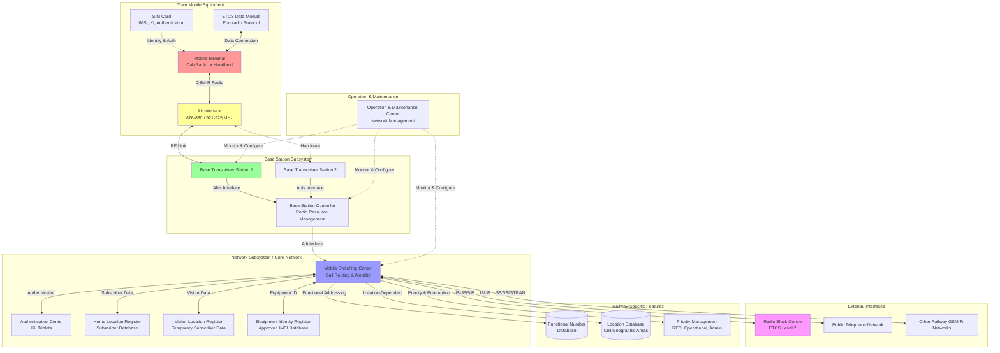
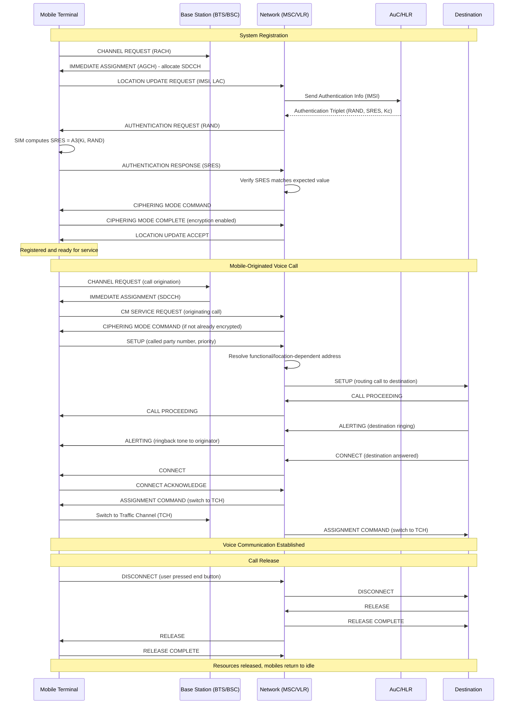

# GSM-R (Global System for Mobile Communications - Railway) Protocol Specification

## Protocol Overview and Purpose

GSM-R (Global System for Mobile Communications - Railway) is a specialized digital mobile radio system based on standard GSM cellular technology, specifically adapted and enhanced to meet the unique operational requirements of railway communications. Developed through the EIRENE (European Integrated Railway Radio Enhanced Network) project, GSM-R serves as the designated communication bearer for European Rail Traffic Management System (ERTMS) and provides comprehensive voice and data communication for railway operations across Europe and increasingly worldwide.

GSM-R's primary purpose is to provide reliable, secure, and interoperable communication infrastructure supporting both operational and safety-critical railway applications. The system enables continuous bidirectional communication between trains and railway control centers, facilitating ETCS Level 2/3 signaling data exchange, operational voice communication, shunting operations, emergency calls, and passenger information services. Unlike public GSM networks optimized for stationary or pedestrian users, GSM-R implements railway-specific enhancements to support high-speed train operations (up to 500 km/h), priority and preemption mechanisms for emergency communications, functional addressing enabling calls to operational roles rather than specific numbers, and location-dependent addressing for geographic area broadcasts.

The system operates in dedicated frequency bands (876-880 MHz uplink, 921-925 MHz downlink in Europe) to ensure interference-free communication isolated from public mobile networks. GSM-R deployment has proceeded systematically across European rail networks since the late 1990s, with mandated adoption on all European main lines and interoperable corridors. While GSM-R has proven robust and reliable for over two decades, the railway industry is now transitioning to FRMCS (Future Railway Mobile Communication System) based on 5G technology to address emerging capacity, security, and feature requirements that cannot be met by the aging GSM-R infrastructure.

## Technical Architecture

### System Components

**Mobile Equipment (Train-Borne):**

- **Mobile Terminal (MT):**
  - Cab radio: Fixed installation in locomotive cab for engineer use
  - Portable radios: Handheld radios for shunting operations, maintenance personnel, and on-board staff
  - Dual-mode terminals: Support both GSM-R and public GSM/UMTS networks (for administrative use)
  - Rugged railway-grade construction: Vibration, shock, and temperature resistance
  - User interface: Physical buttons and display (cab radios), touchscreen or keypad (modern portables)

- **GSM-R Radio Module:**
  - Operating frequencies: 876-880 MHz (uplink to base station), 921-925 MHz (downlink from base station)
  - Transmit power: Up to 2 watts (handheld), 8 watts (mobile/cab radio)
  - Receiver sensitivity: Typically -102 dBm for acceptable quality
  - GMSK modulation: Gaussian Minimum Shift Keying (standard GSM modulation)
  - Frequency hopping: 217 hops/second across assigned channels for interference resistance

- **SIM Card (Subscriber Identity Module):**
  - Railway-specific SIM cards issued by railway operators
  - Contains: International Mobile Subscriber Identity (IMSI), authentication keys (Ki), railway-specific service profiles
  - Enables roaming across different railway operators' GSM-R networks
  - Functional numbers: SIMs may contain functional numbers (roles) in addition to personal numbers

- **ETCS Data Module (for ETCS-equipped trains):**
  - Interfaces GSM-R radio with European Vital Computer (EVC)
  - Implements Euroradio protocol stack for safety-critical data transmission
  - Circuit-switched data connection: Typically 9.6 kbps dedicated connection to Radio Block Centre
  - Packet-switched data: GPRS or EDGE for non-safety-critical data and future enhancements
  - Quality of Service monitoring: Ensures adequate radio link quality for safe operations

**Base Station Subsystem (Trackside Infrastructure):**

- **Base Transceiver Station (BTS):**
  - Radio transceivers providing GSM-R coverage along railway lines
  - Typical configuration: Directional antennas focusing coverage along track corridor
  - Transmit power: 20-40 watts typical per carrier
  - Antenna height: 20-50 meters above ground (varies by terrain)
  - Coverage range: 5-7 km radius typical (up to 10-15 km in favorable conditions)
  - Sectored coverage: Multiple antenna sectors per BTS for increased capacity

- **Base Station Controller (BSC):**
  - Controls multiple BTS units within a geographic area
  - Functions:
    * Radio resource management: Channel allocation, power control, handover decisions
    * Call setup and routing
    * Mobility management: Tracking mobile locations, handling handovers between cells
    * Transcoding: Converting between different voice encoding formats
  - Redundant architecture: Hot standby BSC for high availability

**Network Subsystem (Core Network):**

- **Mobile Switching Center (MSC):**
  - Core switching infrastructure managing call routing and mobility
  - Functions:
    * Call setup, routing, and release for voice and data connections
    * Mobility management: Location registration, authentication, handover coordination
    * Interworking with public telephone networks and other railway networks
    * Support for railway-specific features: Functional addressing, location-dependent addressing, priority and preemption
  - Geographic redundancy: Multiple MSCs provide network resilience

- **Home Location Register (HLR):**
  - Central database containing subscriber information for all GSM-R users
  - Data stored:
    * Subscriber identity (IMSI)
    * Current location information
    * Service profiles: Authorized services, priority levels, functional numbers
    * Authentication parameters
  - Enables roaming: Subscribers from different railway operators can use network

- **Visitor Location Register (VLR):**
  - Temporary database storing information for subscribers currently within the MSC coverage area
  - Reduces HLR query load by caching subscriber data
  - Manages local call routing and mobility

- **Authentication Center (AuC):**
  - Stores authentication and encryption keys for subscribers
  - Generates authentication triplets (RAND, SRES, Kc) for verifying subscriber identity
  - Protects against unauthorized network access

- **Equipment Identity Register (EIR):**
  - Database of authorized mobile equipment (IMEI numbers)
  - Can block stolen or non-compliant equipment from network access
  - Railway-specific: Ensures only approved railway-grade equipment operates on network

**Operation and Maintenance Center (OMC):**
- Network management system for monitoring and configuring GSM-R infrastructure
- Functions: Performance monitoring, fault management, configuration management, security management
- Remote diagnostics and troubleshooting of BTS, BSC, and MSC equipment
- Traffic analysis and capacity planning

**Interfaces to External Systems:**
- **ETCS Radio Block Centre (RBC):** Circuit-switched data connections for ETCS Level 2 signaling
- **Public Switched Telephone Network (PSTN):** Gateway for calls to/from public telephone network
- **Other Railway Networks:** Interconnection with neighboring railway operators' GSM-R networks for cross-border operations
- **Dispatching and Control Systems:** Integration with railway operational control centers

### OSI Layer Operation

**Application Layer (Layer 7):**

GSM-R implements several application-layer services tailored to railway operations:

- **Voice Call Service:**
  - **Point-to-Point Voice Calls:** Direct calls between two parties (driver to dispatcher, maintenance coordination)
  - **Railway Emergency Call (REC):** Highest priority call automatically preempting other communications
    * Activated by pressing emergency button on radio
    * Establishes voice group call to all relevant parties (drivers, dispatchers, controllers)
    * Broadcast to specific geographic area affected by emergency
    * Cannot be preempted or terminated except by initiator
  - **Functional Addressing:** Calls to operational roles rather than individuals
    * Example: "Dispatcher Zone 5", "Signaling Engineer", "Track Maintenance Supervisor"
    * Calls automatically routed to person currently holding that functional role
    * Enables seamless handover between shift changes
  - **Location-Dependent Addressing:** Calls to trains or personnel in specific geographic areas
    * Example: "All trains between Station A and Station B"
    * Useful for broadcasting temporary speed restrictions, alerts, and operational information
  - **Group Calls:** Voice broadcast to predefined groups
    * Example: "All trains in dispatcher zone", "All maintenance personnel in sector"
    * Reduces call setup time when communicating with multiple parties

- **Short Message Service (SMS):**
  - Point-to-point text messaging between GSM-R users
  - Operational use: Temporary speed restrictions, schedule changes, operational instructions
  - Acknowledgment and delivery confirmation for critical messages
  - Railway-specific enhancements: Priority messaging, functional addressing

- **Circuit-Switched Data (CSD):**
  - Dedicated 9.6 kbps, 14.4 kbps, or 28.8 kbps data connection
  - Primary use: ETCS Level 2 Euroradio communication between train and RBC
  - Transparent synchronous data transmission
  - Quality of Service guarantees through dedicated circuit
  - Connection maintained for duration of train's operation in ETCS Level 2 area

- **Packet-Switched Data (GPRS/EDGE):**
  - Packet data service overlaid on GSM-R infrastructure
  - Data rates: GPRS (up to 60-80 kbps), EDGE (up to 200-300 kbps)
  - Applications: Non-safety-critical data (diagnostics, passenger Wi-Fi backhaul, train positioning updates)
  - Future ETCS Baseline 3: Optional use of GPRS for some ETCS messages (not safety-critical real-time)
  - Best-effort quality of service (not suitable for safety-critical real-time control)

- **Automatic Train Number Transmission (ATNT):**
  - Automatic identification of trains entering GSM-R coverage areas
  - Train number automatically transmitted to control center when radio powers up
  - Enables automatic tracking and registration of train movements
  - Integration with railway traffic management systems

**Network Layer (Layer 3):**

GSM-R uses circuit-switched networking for voice and data:

- **Call Control (CC):**
  - Call establishment, maintenance, and release procedures
  - Railway-specific enhancements:
    * Priority and preemption mechanisms
    * Group call and broadcast call handling
    * Functional number resolution
    * Location-based call routing

- **Mobility Management (MM):**
  - Location registration and tracking of mobile terminals
  - Authentication and security procedures
  - Handover management between cells
  - Roaming support across different railway operators' networks

- **Radio Resource Management (RR):**
  - Radio channel allocation and release
  - Power control: Adjusting transmit power to maintain quality while minimizing interference
  - Frequency hopping management
  - Handover execution (mobile-assisted and network-controlled)

**Data Link Layer (Layer 2):**

GSM implements LAPD (Link Access Procedure, D-channel) variant called LAPDm:

- **Logical Channels:**
  - **Traffic Channels (TCH):** Carry voice or user data
    * TCH/FS: Full-rate speech channel (13 kbps voice codec)
    * TCH/HS: Half-rate speech channel (allows two calls per physical channel)
    * TCH/F9.6, TCH/F14.4: Full-rate data channels for circuit-switched data
  - **Control Channels:**
    * BCCH (Broadcast Control Channel): Broadcasts cell information to all mobiles
    * CCCH (Common Control Channel): Includes PCH (Paging Channel), RACH (Random Access Channel), AGCH (Access Grant Channel)
    * DCCH (Dedicated Control Channel): SDCCH (Standalone Dedicated Control Channel), SACCH (Slow Associated Control Channel), FACCH (Fast Associated Control Channel)

- **Frame Structure:**
  - TDMA structure: 8 timeslots per TDMA frame (4.615 ms duration)
  - Each user allocated one or more timeslots for communication
  - Multiframe structures: 26-frame multiframe (traffic channels), 51-frame multiframe (control channels)
  - Hyperframe: 2,715,648 frames (3 hours, 28 minutes, 53 seconds, 760 milliseconds) for timing reference

- **Error Detection and Correction:**
  - Fire codes: Detect and correct bit errors in transmitted data
  - Interleaving: Spread bits across multiple frames to mitigate burst errors
  - Convolutional coding: Forward error correction for robustness

**Physical Layer (Layer 1):**

Detailed in Physical Layer Specifications section below.

### Message Structure and Types

**Railway Emergency Call (REC) Initiation:**
```
Message Type: SETUP (Call Control)
Called Party: REC Functional Number (Railway Emergency Call group)
Priority: Emergency (highest priority level)
Preemption: Enabled (can preempt lower-priority calls)
Group Call Attributes: Voice Group Call Service (VGCS)
Geographic Area: Determined by initiator's location (e.g., all trains within 10 km radius)
Emergency Indication: Set (triggers emergency handling procedures)

Call Setup Procedure:
1. Mobile terminal transmits SETUP message on RACH (Random Access Channel)
2. Network allocates SDCCH (Standalone Dedicated Control Channel)
3. Mobile sends complete SETUP message with REC details
4. MSC identifies REC, triggers emergency procedures:
   - Preempts lower-priority calls if necessary
   - Establishes group call to all relevant parties
   - Notifies control center operators
   - Logs emergency event
5. All parties receive ALERTING message and connect to group call
6. Initiator and all participants in voice conference
```

**Functional Addressing Call:**
```
Message Type: SETUP
Called Party: Functional Number (e.g., "Dispatcher_Zone_5")
Priority: Normal or Priority (depending on call urgency)

Functional Number Resolution:
1. MSC receives SETUP with functional number
2. MSC queries functional number database
3. Database returns current assignment: Functional number "Dispatcher_Zone_5" → Mobile MSISDN +123456789
4. MSC translates functional number to individual mobile number
5. Call routed to assigned mobile terminal
6. If functional number unassigned or mobile unavailable:
   - Call routed to default fallback number or voicemail
   - Alert to supervisors (critical function unassigned)
```

**Location-Dependent Addressing Message:**
```
Message Type: SETUP (for voice) or SMS (for text message)
Called Party: Location-Dependent Address (e.g., "All_Trains_Sector_A")
Priority: Normal or Priority
Geographic Area: Defined by coordinates, track section identifiers, or administrative boundaries

Location-Based Routing:
1. MSC receives message with location-dependent address
2. MSC queries mobile location database
3. Identifies all mobiles currently within specified geographic area
4. Delivers message to all matching mobiles
5. Delivery confirmation: Acknowledgment from each recipient (for SMS)
```

**ETCS Euroradio Message (Circuit-Switched Data):**
```
Physical Connection: Circuit-switched data call established between train and RBC
Data Rate: 9.6 kbps or 14.4 kbps
Protocol: Euroradio safety protocol (SUBSET-037)

Typical Euroradio Message Structure (simplified):
- Safety Layer Header:
  * Safety Code: 64-bit HMAC for message authentication
  * Timestamp: 32-bit timestamp for replay protection
  * Sequence Number: 32-bit for message ordering
- Application Layer:
  * Message Type: Position Report, Movement Authority, Track Condition, etc.
  * Message Length: Length of application data
  * Message Data: ETCS-specific data (defined in SUBSET-026)
- CRC: Cyclic redundancy check for error detection

GSM-R Transport:
- Euroradio messages encapsulated in circuit-switched data frames
- Transparent transmission over GSM-R air interface and network
- Quality of Service: Dedicated channel ensures low latency and minimal packet loss
- Connection maintained continuously while train operates in ETCS Level 2 area
```

**Handover Command:**
```
Message Type: HANDOVER COMMAND (Radio Resource Management)
Old Cell: Current cell identifier (BSIC - Base Station Identity Code)
New Cell: Target cell identifier
Channel Description: Frequency, timeslot assignment in new cell
Timing Advance: Synchronization parameter for new cell
Handover Reference: Unique identifier for this handover

Handover Procedure:
1. Network detects mobile approaching cell boundary (signal strength measurements)
2. Network selects target cell for handover
3. Network allocates resources in target cell
4. BSC sends HANDOVER COMMAND to mobile via old cell
5. Mobile switches to new cell frequency and timeslot
6. Mobile transmits HANDOVER ACCESS burst on new cell
7. New cell detects mobile, confirms handover successful
8. Mobile sends HANDOVER COMPLETE message
9. Network releases resources in old cell
10. Handover complete (typical duration: 100-200 ms, seamless for voice calls)
```

### Communication Flow

**System Initialization and Registration:**

```
1. Mobile Terminal Power-On:
   - Radio hardware initialization
   - SIM card authentication and PIN entry (if required)
   - Search for available GSM-R cells (scanning BCCH frequencies)

2. Cell Selection:
   - Mobile identifies strongest GSM-R cell meeting quality criteria
   - Reads system information broadcast on BCCH:
     * Network operator identity
     * Location Area Code (LAC)
     * Cell identity
     * Available services and features
     * Random access parameters

3. Location Registration:
   - Mobile transmits CHANNEL REQUEST on RACH (Random Access Channel)
   - Network allocates SDCCH (Standalone Dedicated Control Channel)
   - Mobile sends LOCATION UPDATE REQUEST with IMSI (from SIM card)
   - Network queries HLR for subscriber authentication parameters
   - Network sends AUTHENTICATION REQUEST with random challenge (RAND)
   - Mobile SIM calculates response (SRES) using secret key (Ki)
   - Mobile returns AUTHENTICATION RESPONSE with SRES
   - Network verifies SRES matches expected value
   - If authentication successful:
     * Network generates encryption key (Kc)
     * Network updates VLR with subscriber location
     * Network sends LOCATION UPDATE ACCEPT to mobile
     * Encryption enabled on air interface
   - Mobile registered and ready for service
```

**Voice Call Setup (Mobile-Originated):**

```
1. User Initiates Call:
   - User enters called party number (individual, functional, or location-dependent address)
   - User presses send button on mobile terminal

2. Call Request:
   - Mobile transmits CHANNEL REQUEST on RACH
   - Network allocates SDCCH
   - Mobile sends SETUP message with:
     * Called party number
     * Priority level (normal, priority, or emergency)
     * Bearer capability (speech, data, etc.)

3. Call Routing:
   - MSC receives SETUP message
   - If functional number: MSC resolves to current assigned mobile number
   - If location-dependent address: MSC identifies all mobiles in specified area
   - MSC checks priority level and available resources
   - If necessary: MSC preempts lower-priority call to free resources

4. Called Party Alerting:
   - MSC routes call to called party (or parties for group call)
   - Called mobile receives SETUP message
   - Called mobile sends ALERTING (ringing indication)
   - MSC forwards ALERTING to calling mobile (ringback tone)

5. Call Answer:
   - Called party presses answer button
   - Called mobile sends CONNECT message
   - MSC allocates traffic channels (TCH) for both parties
   - MSC sends ASSIGNMENT COMMAND to both mobiles
   - Mobiles switch from SDCCH to TCH
   - Voice communication established (full-duplex)

6. Active Call:
   - Voice encoded using GSM speech codec (typically FR - Full Rate, 13 kbps)
   - Transmitted over allocated traffic channel timeslots
   - Network monitors call quality and performs handovers if necessary

7. Call Termination:
   - Either party presses end button
   - Mobile sends DISCONNECT message
   - MSC releases traffic channels
   - Both mobiles return to idle mode
```

**ETCS Data Connection Establishment:**

```
1. Train Enters ETCS Level 2 Area:
   - Train reads Eurobalise announcing Level 2 area
   - Balise contains RBC phone number (MSISDN)
   - EVC (European Vital Computer) commands GSM-R radio to establish data call

2. Data Call Setup:
   - GSM-R mobile originates circuit-switched data call to RBC number
   - MSC routes call to RBC gateway
   - Data connection established (typically 9.6 kbps or 14.4 kbps)

3. Euroradio Safe Connection Protocol:
   - EVC and RBC execute Euroradio safe connection establishment
   - Authentication and session key exchange
   - Validation of train data and RBC identity
   - Safe connection established

4. ETCS Operations:
   - Train transmits position reports to RBC via GSM-R data connection
   - RBC transmits movement authorities to train
   - Connection maintained continuously during train's operation in Level 2 area
   - GSM-R handovers occur transparently (connection maintained during handover)

5. Connection Termination:
   - Train leaves Level 2 area or transitions to different RBC
   - EVC initiates Euroradio disconnection procedure
   - GSM-R data call released
   - Train transitions to different ETCS level or new RBC connection
```

**Handover During High-Speed Operations:**

```
Scenario: Train traveling at 300 km/h (83.3 meters/second)

1. Measurement Phase:
   - Mobile continuously measures signal strength (RXLEV) and quality (RXQUAL) of serving cell
   - Mobile also measures neighboring cells broadcast on BCCH
   - Measurements reported to network via SACCH (Slow Associated Control Channel) every 480 ms

2. Handover Decision:
   - BSC analyzes measurement reports
   - Serving cell signal strength weakening as train moves toward cell boundary
   - Neighboring cell signal strength increasing
   - BSC determines handover necessary to maintain call quality

3. Handover Preparation:
   - BSC requests channel allocation in target cell
   - Target BSC allocates traffic channel and timeslot
   - Target BSC provides channel description to serving BSC

4. Handover Command:
   - Serving BSC sends HANDOVER COMMAND to mobile via FACCH (Fast Associated Control Channel)
   - Command contains: Target cell frequency, timeslot, timing advance, handover reference

5. Handover Execution:
   - Mobile receives HANDOVER COMMAND (typically 20-40 ms after transmission)
   - Mobile immediately switches to new cell frequency and timeslot
   - Mobile transmits HANDOVER ACCESS burst on new cell (special burst for synchronization)
   - New cell detects HANDOVER ACCESS, adjusts timing, and confirms handover

6. Handover Completion:
   - Mobile sends HANDOVER COMPLETE message on new cell
   - New BSC confirms to MSC
   - Old cell resources released
   - Total handover duration: 100-200 ms (imperceptible voice call interruption)

Challenge at 300 km/h:
- Train covers 83.3 meters per second
- At cell edge, signal degrades rapidly with distance
- Handover must execute before signal drops below usable threshold
- Railway-specific GSM-R optimization:
  * Longer cell overlap zones (500-1000 meters) at high-speed sections
  * Predictive handover triggers based on train speed and position
  * Directional antennas focus coverage along track to extend range
```

### Timing Requirements

**Call Setup Latency:**
- Point-to-point voice call setup: 3-7 seconds typical
  - Includes: Random access, authentication, call routing, alerting
  - Longer than public GSM due to railway-specific processing (functional address resolution, priority checking)
- Railway Emergency Call: <2 seconds
  - Highest priority, preempts other processing
  - Critical for immediate response to emergency situations

**Handover Performance:**
- Handover execution time: 100-200 milliseconds
- Imperceptible interruption for voice calls (human perception threshold ~300 ms)
- Circuit-switched data: Brief interruption, Euroradio protocol tolerates via retransmission
- Handover success rate: >99% in properly engineered GSM-R networks
- Handover margin: Typically initiated 5-10 dB before signal becomes unusable

**ETCS Data Communication:**
- Circuit-switched data latency: 50-150 milliseconds end-to-end (train ↔ RBC)
  - Includes: Air interface transmission, network transit, RBC processing
- Position report interval: Typically 10-15 seconds (ETCS requirement)
- Movement authority update: <5 seconds from condition change to train reception
- Critical for maintaining safe train separation in ETCS Level 2 operations

**Communication Availability:**
- Network availability target: 99.5% or higher
- Maximum communication outage duration: 30 seconds continuous
  - Trains can operate safely under last valid movement authority for limited time
  - Extended outages trigger degraded mode operations
- Redundancy strategies: Geographic diversity, backup base stations, alternate routing

### Error Handling

**Radio Link Failure:**

*Complete Signal Loss:*
```
1. Mobile detects signal loss (RXLEV and RXQUAL below thresholds)
2. Mobile attempts cell reselection:
   - Scan neighboring cell frequencies
   - Measure available cells
   - Select strongest suitable cell
3. If new cell found:
   - Mobile performs location update in new cell
   - Ongoing call reconnected if possible (for ETCS data calls: Euroradio protocol maintains session)
   - Voice calls: Typically dropped, must be re-established manually
4. If no suitable cell found:
   - Mobile enters "No Service" state
   - Periodic scanning for cell recovery
   - ETCS trains: Enter degraded mode, operate under last valid movement authority
```

*Interference or Multipath Fading:*
```
1. Mobile measures poor signal quality (RXQUAL above threshold)
2. Reports poor quality to network via measurement reports
3. Network mitigation strategies:
   - Increase transmit power (mobile and/or base station)
   - Change frequency hopping pattern
   - Initiate handover to cell with better signal quality
4. If quality cannot be improved:
   - Voice call: Degraded audio quality (but maintained)
   - Data call: Increased bit errors, retransmissions, potential connection drop
```

**Authentication Failure:**
```
1. Mobile sends LOCATION UPDATE REQUEST or call SETUP
2. Network sends AUTHENTICATION REQUEST
3. Mobile responds with incorrect SRES (authentication response)
   - Causes: Invalid/corrupted SIM card, cloned SIM, expired subscriber record
4. Network sends AUTHENTICATION REJECT
5. Mobile displays authentication failure indication
6. Network access denied until issue resolved
   - User must contact railway operator to resolve (SIM replacement, subscriber data update)
```

**Network Congestion:**
```
1. All available channels allocated (traffic load exceeds capacity)
2. New call attempt or location update request received
3. Network evaluates priority:
   - Emergency calls: Always granted, preempt lower-priority calls if necessary
   - Priority calls: Granted if resources available or lower-priority calls can be preempted
   - Normal calls: Queued or rejected with "Network Busy" indication
4. User experience:
   - High-priority users: Service maintained
   - Normal-priority users: Call setup delays or "Network Busy" message
5. Network load balancing:
   - Redirect new registrations to less-congested cells
   - Handover mobiles to cells with available capacity
   - Traffic shaping for packet data (GPRS/EDGE)
```

**ETCS Data Connection Loss:**
```
1. Train operating in ETCS Level 2 with continuous data connection to RBC
2. GSM-R connection lost (handover failure, coverage gap, radio failure)
3. EVC (European Vital Computer) detects communication loss
4. Train continues operating under last valid movement authority
5. If movement authority endpoint approached without communication:
   - Train applies service brake
   - Train stops before end of authority
6. Driver notified of communication failure
7. Restoration:
   - If GSM-R reconnects: EVC re-establishes Euroradio connection to RBC, operations resume
   - If extended outage: Train transitions to degraded mode (Staff Responsible, manual operations)
```

## Physical Layer Specifications

### Frequency Allocation

**European GSM-R Bands:**
- **Uplink (Mobile to Base Station):** 876-880 MHz (4 MHz bandwidth)
- **Downlink (Base Station to Mobile):** 921-925 MHz (4 MHz bandwidth)
- **Duplex spacing:** 45 MHz between uplink and downlink
- **Guard bands:** 0.2 MHz at band edges to prevent interference with adjacent services

**Channel Structure:**
- Channel bandwidth: 200 kHz per GSM carrier
- Number of carriers: 19 carriers available in 4 MHz bandwidth
- Channel numbering: Specific ARFCN (Absolute Radio Frequency Channel Number) assignments
- Example: ARFCN 955-973 for downlink, ARFCN 1024-1042 for uplink (European standard)

**International Variations:**
- Some countries use different frequency allocations due to spectrum constraints
- Coordination required for cross-border operations
- Dual-band or multi-band equipment for international train operations

### Modulation and Coding

**Gaussian Minimum Shift Keying (GMSK):**
- Modulation: GMSK with BT = 0.3 (Bandwidth-Time product)
- Constant envelope modulation: Efficient use of power amplifiers
- Symbol rate: 270.833 kbps (kilosymbols per second)
- Spectral efficiency: Compact spectrum occupancy within 200 kHz channel

**Channel Coding:**
- **Convolutional Coding:** Forward error correction
  - Code rate: 1/2 (each bit encoded as two bits, 50% redundancy)
  - Constraint length: 5 (encoding considers 5 previous bits)
  - Corrects random bit errors caused by noise and interference
- **Interleaving:** Bit interleaving over multiple frames
  - Spreads burst errors across multiple codewords
  - Improves error correction effectiveness against fading and interference
  - Interleaving depth: 8 frames for speech, 20-22 frames for data

**Voice Coding:**
- **Full-Rate (FR) Codec:** 13 kbps (most common in GSM-R)
  - Regular Pulse Excitation - Long Term Prediction (RPE-LTP)
  - Good voice quality for railway operational communications
- **Half-Rate (HR) Codec:** 6.5 kbps (doubles capacity per channel)
  - Vector Sum Excited Linear Prediction (VSELP)
  - Slightly reduced quality, used when capacity constrained
- **Enhanced Full-Rate (EFR) Codec:** 12.2 kbps (optional, better quality)
  - Algebraic Code Excited Linear Prediction (ACELP)
  - Superior voice quality for passenger information services

### Power Control and Link Budget

**Mobile Terminal Transmit Power:**
- **Power Classes:**
  - Class 1: 8 watts (39 dBm) - cab radios, vehicle-mounted equipment
  - Class 2: 2 watts (33 dBm) - handheld portable radios
  - Class 4: 0.8 watts (29 dBm) - lower-power handhelds
- **Dynamic Power Control:**
  - Network commands mobile to adjust transmit power
  - Range: Typically 5-8 power levels (2 dB steps)
  - Purpose: Minimize interference, extend battery life, maintain link quality

**Base Station Transmit Power:**
- Typical transmit power: 20-40 watts (43-46 dBm) per carrier
- Multiple carriers per BTS: 1-4 carriers typical (for capacity and frequency reuse)
- Antenna system:
  - Directional antennas: Focus coverage along railway corridor
  - Antenna gain: 12-15 dBi typical (directional panel antennas)
  - Antenna diversity: Space or polarization diversity for improved reception

**Link Budget Analysis (Example):**
```
Downlink (Base Station → Mobile):
- BTS transmit power: +43 dBm (20 watts)
- Antenna gain: +14 dBi
- Cable/connector loss: -3 dB
- Effective radiated power: +54 dBm

Path Loss (5 km, 900 MHz):
- Free space path loss: -108 dB (calculated: 32.4 + 20*log10(5) + 20*log10(900))
- Additional losses (foliage, buildings): -10 dB
- Fade margin: -10 dB (to account for fading variations)
- Total path loss: -128 dB

Mobile Reception:
- Receive antenna gain: +2 dBi (omnidirectional mobile antenna)
- Cable/connector loss: -1 dB
- Received signal strength: 54 - 128 + 2 - 1 = -73 dBm

Receiver Sensitivity:
- Required RXLEV for acceptable quality: -100 dBm (typical)
- Link margin: -73 dBm - (-100 dBm) = 27 dB
- Adequate margin for reliable communication under most conditions

Uplink (Mobile → Base Station):
- Mobile transmit power: +33 dBm (2 watts, handheld)
- Antenna gain: +2 dBi
- Path loss: -128 dB (same as downlink)
- BTS receive antenna gain: +14 dBi
- Cable/connector loss: -3 dB
- Received signal strength: 33 + 2 - 128 + 14 - 3 = -82 dBm
- BTS receiver sensitivity: -104 dBm (typical)
- Link margin: -82 dBm - (-104 dBm) = 22 dB

Balanced Link:
- Downlink margin: 27 dB
- Uplink margin: 22 dB
- Uplink slightly weaker (mobile lower transmit power)
- Power control can balance link by reducing BTS power or increasing mobile power
```

**Coverage Range:**
- Flat terrain: 5-7 km radius typical coverage
- Hilly/mountainous terrain: 3-5 km (line-of-sight limitations)
- Tunnels: Special coverage solutions (leaky feeder cable, distributed antenna systems)
- High-speed lines: Cell radius may be larger (7-10 km) with optimized antenna systems
- Cell overlap: 500-1000 meters overlap between adjacent cells for reliable handovers

### TDMA Frame Structure

**Timeslot Organization:**
- TDMA frame duration: 4.615 milliseconds
- Number of timeslots per frame: 8 (numbered 0-7)
- Timeslot duration: 577 microseconds (0.577 ms)
- Each user allocated one or more timeslots for communication

**Burst Types:**
- **Normal Burst:** Used for traffic and signaling channels (148 bits)
  - Tail bits: 3 bits (start and end)
  - Encrypted data: 2 × 57 bits
  - Training sequence: 26 bits (midamble for channel estimation)
  - Guard period: 8.25 bits (to prevent overlap with adjacent timeslots)
- **Frequency Correction Burst:** Synchronization (base station broadcasts on FCCH)
- **Synchronization Burst:** Timing and frame number synchronization (base station broadcasts on SCH)
- **Access Burst:** Used by mobile to request channel (shorter burst allows timing uncertainty)

**Multiframe Structures:**
- **26-Frame Multiframe:** Used for traffic channels (120 ms duration)
  - 24 frames for traffic (voice or data)
  - 1 frame for SACCH (Slow Associated Control Channel, measurement reports)
  - 1 idle frame
- **51-Frame Multiframe:** Used for control channels (235.4 ms duration)
  - Carries BCCH, CCCH, SDCCH, SACCH for signaling

**Frequency Hopping:**
- Purpose: Mitigate frequency-selective fading and interference
- Hopping rate: 217 hops per second (one hop per TDMA frame)
- Hopping sequence: Pseudo-random sequence determined by hopping algorithm
- Hopping set: Subset of available frequencies (e.g., 4-16 frequencies)
- Improves link quality and reduces interference effects

## Data Link Layer Details

### Logical Channels

GSM-R uses various logical channels multiplexed onto physical channels:

**Traffic Channels (TCH):**
- **TCH/FS (Full-Rate Speech):** 13 kbps voice codec
- **TCH/HS (Half-Rate Speech):** 6.5 kbps voice codec (two users per physical channel)
- **TCH/F9.6, TCH/F14.4 (Full-Rate Data):** 9.6 kbps or 14.4 kbps circuit-switched data (for ETCS)
- **TCH/F4.8, TCH/F2.4 (Lower-Rate Data):** 4.8 kbps or 2.4 kbps data channels

**Control Channels:**
- **BCCH (Broadcast Control Channel):** Broadcasts cell information (network identity, frequency lists, system parameters)
- **FCCH (Frequency Correction Channel):** Frequency synchronization
- **SCH (Synchronization Channel):** Frame synchronization and base station identity
- **PCH (Paging Channel):** Pages mobile terminals for incoming calls
- **AGCH (Access Grant Channel):** Grants channel allocation in response to mobile access requests
- **RACH (Random Access Channel):** Mobile transmits channel requests (uplink only)
- **SDCCH (Standalone Dedicated Control Channel):** Signaling for call setup, location updates, SMS
- **SACCH (Slow Associated Control Channel):** Measurement reports and power control commands (continuously during call)
- **FACCH (Fast Associated Control Channel):** Urgent signaling during call (e.g., handover commands), steals traffic channel frames

### LAPDm Protocol

Link Access Procedure on the Dm channel (LAPDm) is the data link layer protocol used over GSM air interface:

**Frame Structure:**
```
Address Field (1 byte):
- SAPI (Service Access Point Identifier): Identifies service (signaling or SMS)
- C/R (Command/Response bit)
- EA (Extended Address bit)

Control Field (1 byte):
- Frame type: I-frame (information), S-frame (supervisory), U-frame (unnumbered)
- Sequence numbers for I-frames (N(S), N(R))

Length Indicator (1 byte):
- Length of information field

Information Field (Variable, 0-N bytes):
- Layer 3 messages (call control, mobility management, radio resource management)

FCS (Frame Check Sequence, 3 bytes):
- CRC for error detection
```

**ARQ (Automatic Repeat Request):**
- Acknowledged mode for reliable delivery of signaling messages
- Unacknowledged mode for broadcast and some signaling (BCCH, PCH)
- Retransmission on detected errors (CRC failure or timeout)

### GPRS/EDGE Packet Data

GSM-R networks support GPRS (General Packet Radio Service) and EDGE (Enhanced Data rates for GSM Evolution) for packet-switched data:

**GPRS:**
- Data rates: Up to 60-80 kbps (theoretical 171.2 kbps)
- Coding schemes: CS-1 to CS-4 (varying error protection vs. data rate trade-off)
- Application: Non-real-time data, diagnostics, passenger services
- Shared channel: Multiple users share radio resources (unlike circuit-switched dedicated channels)

**EDGE:**
- Enhanced modulation: 8-PSK in addition to GMSK
- Data rates: Up to 200-300 kbps (theoretical 473.6 kbps)
- Modulation and Coding Schemes (MCS): MCS-1 to MCS-9 (adaptive based on radio conditions)
- Backward compatible with GPRS

**Packet Data Channels:**
- PDCH (Packet Data Channel): Time slots allocated dynamically for packet data
- PDTCH (Packet Data Traffic Channel): Carries user data packets
- PACCH (Packet Associated Control Channel): Control signaling for packet sessions
- PBCCH, PCCCH, etc.: Packet-specific control channels

**Quality of Service (QoS):**
- Best-effort service: No guarantees on latency or bandwidth
- Priority classes: Different traffic types assigned priorities
- Not suitable for safety-critical real-time ETCS data (hence continued use of circuit-switched data for ETCS)

## Application Layer Protocols

### EIRENE Functional Requirements

The EIRENE (European Integrated Railway Radio Enhanced Network) project defines functional requirements for GSM-R systems, specifying railway-specific features beyond standard GSM:

**Functional Addressing:**
- Defines functional numbers representing operational roles
- Network maintains database mapping functional numbers to current assigned individual numbers
- Enables calls to "Dispatcher Zone X" or "Signaling Engineer Sector Y" regardless of personnel changes
- Automatic routing updates when functional assignments change (shift changes, personnel movements)

**Location-Dependent Addressing:**
- Calls or messages addressed to geographic areas or track sections
- Network identifies mobiles currently within specified location
- Applications: Broadcasting temporary speed restrictions, emergency alerts, operational information to all trains in area
- Location determination: Based on cell location registration, GPS position reporting, or track section identifiers

**Priority and Preemption:**
- Four priority levels defined:
  * Priority 0: Railway Emergency Call (highest priority)
  * Priority 1: High-priority operational calls
  * Priority 2: Normal operational calls
  * Priority 3: Low-priority administrative calls
- Preemption: Higher-priority calls can preempt lower-priority calls if resources unavailable
- Queuing: Lower-priority calls queued when network congested, granted access when resources available

**Voice Group Call Service (VGCS):**
- Enables one-to-many voice broadcast to predefined groups
- Group members automatically connected without individual call setup
- Reduces call setup time for multi-party communication
- Application: Railway Emergency Calls broadcast to all relevant parties simultaneously

**Voice Broadcast Service (VBS):**
- Similar to VGCS but unidirectional (broadcaster transmits, recipients listen)
- Application: Broadcasting operational announcements, instructions to large groups

**Railway Emergency Call (REC):**
- Special emergency call type with highest priority
- Activated by dedicated emergency button on mobile terminal
- Automatically establishes group call to all relevant parties in geographic area
- Cannot be preempted or terminated except by initiator
- Triggers alerts and logging at control center

### MORANE (Mobile Radio for Railway Networks in Europe)

MORANE defines additional operational requirements and specifications for GSM-R:

**Operational Modes:**
- Defines various operational scenarios and required system behavior
- Shunting mode: Reduced power, local communication for shunting operations
- Driving mode: Full power, continuous communication for main line operations
- Maintenance mode: Communication for maintenance personnel

**Interconnection:**
- Specifications for interconnecting different railway operators' GSM-R networks
- Roaming agreements and technical interfaces
- Enables seamless cross-border train operations

**Quality of Service (QoS):**
- Defines performance metrics and targets for GSM-R networks
- Call setup time, handover success rate, communication availability
- Monitoring and reporting requirements for network operators

**Security Requirements:**
- Authentication and encryption standards
- Subscriber identity protection
- Prevention of unauthorized network access
- Lawful interception capabilities (for law enforcement, with appropriate legal authorization)

### ETCS Over GSM-R

ETCS Level 2 uses GSM-R as the communication bearer for Euroradio protocol:

**Connection Establishment:**
1. Train reads Eurobalise with RBC contact information (MSISDN phone number)
2. EVC initiates circuit-switched data call to RBC number via GSM-R
3. Data connection established (typically 9.6 kbps, transparent asynchronous or synchronous mode)
4. Euroradio safe connection protocol executed over GSM-R connection
5. Safe connection established, ETCS operational

**Data Transmission:**
- Position reports from train to RBC: Every 10-15 seconds typical
- Movement authorities from RBC to train: As needed when conditions change
- All messages encapsulated in Euroradio safety protocol (SUBSET-037)
- GSM-R provides transparent transport, Euroradio provides safety layer

**Quality of Service:**
- Circuit-switched data provides dedicated channel with predictable latency
- GSM-R handovers maintained seamlessly during data connection (connection not dropped)
- Network monitors quality and prioritizes ETCS connections
- Backup mechanisms: Train can continue safely under last valid movement authority during brief communication outages

**Migration to Packet Data:**
- ETCS Baseline 3 explores use of GPRS/EDGE for some ETCS messages
- Safety-critical real-time messages still use circuit-switched data
- Non-critical data (diagnostics, performance monitoring) can use packet data
- Future: FRMCS (5G-based successor to GSM-R) will use packet-switched architecture with QoS guarantees

## Security Features

### Authentication and Encryption

**Subscriber Authentication (GSM AKA - Authentication and Key Agreement):**
```
Authentication Process:
1. Mobile initiates location update or call setup
2. Network (VLR/MSC) requests authentication from AuC (Authentication Center)
3. AuC generates authentication triplet:
   - RAND: Random challenge (128 bits)
   - SRES: Expected response (32 bits)
   - Kc: Encryption key (64 bits)
4. Network sends RAND to mobile in AUTHENTICATION REQUEST
5. Mobile SIM card computes SRES using:
   - SRES = A3(Ki, RAND)
   - Where Ki is subscriber's secret key (stored only on SIM and in AuC)
   - A3 is authentication algorithm (COMP128 or MILENAGE)
6. Mobile returns SRES in AUTHENTICATION RESPONSE
7. Network compares received SRES with expected SRES from triplet
8. If match: Authentication successful, network accepts mobile
   If mismatch: Authentication failed, network rejects mobile
```

**Encryption:**
```
Encryption Key Generation:
- After successful authentication, both mobile and network have shared key Kc
- Kc computed by SIM: Kc = A8(Ki, RAND)
- A8 is key generation algorithm (typically same as or related to A3)

Air Interface Encryption:
- Encryption algorithm: A5/1, A5/2, or A5/3
  * A5/1: Stream cipher, 64-bit key, moderate security (known weaknesses)
  * A5/2: Weak cipher (intentionally weakened for export), deprecated
  * A5/3 (KASUMI): Block cipher, stronger than A5/1, recommended for GSM-R
- Encrypts voice and data over air interface (mobile ↔ base station)
- Encryption starts after CIPHERING MODE COMMAND from network
- Both mobile and network synchronize encryption using frame number

Encryption Limitations:
- Only air interface encrypted (mobile ↔ BTS)
- Network infrastructure (BTS ↔ BSC ↔ MSC) typically unencrypted (physical security relied upon)
- Encryption key Kc only 64 bits (weak by modern standards, subject to brute-force)
```

**Security Weaknesses:**
- **A5/1 Vulnerabilities:** Known attacks can break A5/1 encryption in real-time with specialized hardware
- **A5/2 Extremely Weak:** Breaks in seconds, should never be used
- **One-Way Authentication:** Network authenticates mobile, but mobile does not authenticate network
  - Enables IMSI catching: Rogue base station impersonates network, captures subscriber identities
  - Enables man-in-the-middle attacks: Attacker positions fake base station between mobile and real network
- **Short Key Length:** 64-bit encryption key Kc breakable with sufficient computing resources
- **No Integrity Protection:** Encryption provides confidentiality but not message integrity
  - Enables bit-flipping attacks: Attacker can modify encrypted messages without detection
- **Legacy Technology:** GSM-R based on GSM standards from 1990s, predates modern security practices

### SIM Card Security

**Subscriber Identity Module (SIM) Functions:**
- Securely stores subscriber identity (IMSI) and secret key (Ki)
- Executes authentication and key generation algorithms (A3, A8)
- Tamper-resistant: Difficult to extract Ki from SIM card
- PIN protection: User authentication before SIM access

**SIM Security Measures:**
- **Physical Security:** Chip embedded in plastic card, tamper-resistant design
- **Logical Security:** Cryptographic authentication before revealing sensitive data
- **PIN/PUK:** Personal Identification Number (PIN) locks SIM, Personal Unlocking Key (PUK) recovers locked SIM
- **Over-the-Air (OTA) Updates:** Remote updates to SIM data and applications

**SIM Vulnerabilities:**
- **SIM Cloning:** Extracting Ki from SIM and duplicating onto another SIM (difficult but possible with sophisticated attacks)
- **SIM Swap Attacks:** Social engineering to convince operator to transfer service to attacker's SIM
- **Stolen/Lost SIMs:** Physical theft of SIM card grants network access until reported and blocked

### Railway-Specific Security Enhancements

**Equipment Identity Register (EIR):**
- Database of approved mobile equipment (IMEI - International Mobile Equipment Identity)
- Only railway-certified equipment allowed on GSM-R network
- Blocks unauthorized, stolen, or non-compliant equipment
- Periodic IMEI checks during operation

**Closed User Group:**
- GSM-R network restricted to authorized railway subscribers
- Public users cannot access GSM-R network even with GSM-R-capable equipment (blocked by subscription and network configuration)
- Isolation from public mobile networks reduces attack surface

**Physical Security:**
- Base stations located in secure facilities or hardened shelters
- Network core equipment (MSC, HLR, BSC) in controlled access data centers
- Fiber optic backhaul difficult to tap compared to radio or copper
- Monitoring and alarms for unauthorized access attempts

**Operational Security Procedures:**
- Personnel security screening for GSM-R administrators and maintainers
- Audit logging of network configuration changes
- Security awareness training for railway staff using GSM-R terminals
- Incident response procedures for suspected security breaches

## Known Vulnerabilities and CVEs

### A5/1 Encryption Weaknesses (CVE-2019-14341, related)

**Vulnerability Description:**
The A5/1 stream cipher used for GSM air interface encryption has known cryptographic weaknesses that enable real-time decryption attacks. The cipher uses only 64-bit effective key length and has structural weaknesses in its design.

**Attack Techniques:**
- **Rainbow Table Attacks:** Precomputed tables enable rapid key recovery from known plaintext
- **Time-Memory Trade-Off Attacks:** Balancing precomputation and real-time computation to break encryption
- **Known Plaintext Attacks:** Exploiting predictable message patterns (e.g., TMSI reallocation commands) to derive keys
- **Hardware-Based Attacks:** Specialized hardware (FPGAs, GPUs) can break A5/1 in real-time (seconds to minutes)

**Impact on GSM-R:**
- Eavesdropping: Adversary can decrypt voice and data communications
- Confidentiality breach: Sensitive operational and safety information exposed
- Potential safety impact: If ETCS data intercepted and analyzed, train movements and control systems understood

**Mitigation:**
- **A5/3 (KASUMI) Upgrade:** Stronger cipher, no known practical attacks
  - Deployment challenge: Requires upgrading network infrastructure and all mobile terminals
  - Migration ongoing but not complete across all GSM-R networks
- **End-to-End Encryption:** Overlay encryption on top of GSM-R (e.g., VPN for data, encrypted voice)
  - Complexity and performance overhead
- **Migration to FRMCS:** Long-term solution, 5G-based system with modern security
  - Timeline: 2030s deployment expected

### IMSI Catching (Man-in-the-Middle)

**Vulnerability Description:**
GSM-R (like GSM) authenticates the mobile to the network but not vice versa. An attacker can deploy a rogue base station (IMSI catcher) that impersonates the legitimate network.

**Attack Scenario:**
1. Attacker deploys fake base station transmitting on GSM-R frequencies
2. Fake base station broadcasts stronger signal than legitimate network
3. Mobile terminals connect to fake base station (believing it's legitimate network)
4. Fake base station requests IMSI (subscriber identity) from mobile
5. Mobile responds with IMSI (no authentication of network required)
6. Attacker captures IMSI and can:
   - Track mobile movements (location surveillance)
   - Forward traffic to real network (man-in-the-middle, transparent to user)
   - Downgrade encryption (force A5/2 or no encryption) to eavesdrop
   - Inject false messages if acting as MITM

**Impact on GSM-R:**
- Tracking of train and personnel locations
- Eavesdropping on communications (if encryption downgraded)
- Potential injection of false messages or commands
- Privacy violations for railway staff

**Mitigation:**
- **IMSI Encryption (TMSI):** GSM-R uses Temporary Mobile Subscriber Identity (TMSI) to reduce IMSI exposure
  - IMSI only transmitted during initial registration or after TMSI reallocation
  - Periodic TMSI changes obscure subscriber identity
  - However, IMSI catcher can force IMSI reveal through specific procedures
- **Network Monitoring:** Detect rogue base stations through spectrum monitoring and anomaly detection
- **Physical Security:** Prevent attacker proximity to railway infrastructure
- **FRMCS Migration:** 5G includes mutual authentication, prevents IMSI catching

### Jamming and Denial of Service

**Jamming Attack:**
- Attacker transmits high-power noise on GSM-R frequencies (876-880 MHz, 921-925 MHz)
- Overwhelms legitimate signals, prevents communication
- Simple and effective attack requiring only RF signal generator

**Impact:**
- Voice communication disruption: Cannot contact drivers, dispatchers, or maintenance
- ETCS data connection loss: Trains transition to degraded mode, stop if approaching movement authority end
- Emergency call failure: Railway Emergency Calls cannot be initiated
- Service disruption across affected area (jamming range: hundreds of meters to kilometers depending on attacker power)

**Mitigation:**
- **Jamming Detection:** Spectrum monitoring detects abnormal interference patterns
- **Frequency Diversity:** Multiple frequency bands (if available) reduce single-frequency jamming effectiveness
- **Directional Antennas:** Focus coverage along track reduces susceptibility to off-track jamming
- **Physical Security:** Prevents attacker proximity to infrastructure
- **Operational Procedures:** Trains can operate safely for limited time without communication under last movement authority
- **Legal Deterrence:** Radio jamming is illegal in most jurisdictions, prosecution of offenders

### SMS Vulnerabilities

**SMS Spoofing:**
- Attacker can send SMS messages with forged sender address
- GSM-R SMS lacks strong sender authentication
- False operational messages could be sent appearing to originate from legitimate sources (dispatcher, control center)

**Impact:**
- Operational confusion: Personnel receive false instructions or information
- Safety implications: False temporary speed restrictions, incorrect operational orders

**Mitigation:**
- Operational procedures: Critical instructions confirmed through multiple channels
- Digital signatures: Cryptographic signing of SMS messages (requires enhancement beyond standard GSM SMS)
- User training: Personnel aware of potential for false messages, verify suspicious instructions

### Core Network Security

**Interconnection Vulnerabilities:**
- GSM-R networks interconnect with public telephone networks and other railway operators' networks
- Interconnection points create potential attack vectors
- SS7 (Signaling System 7) protocol vulnerabilities: Enable location tracking, call interception, SMS interception

**Mitigation:**
- **Signaling Firewalls:** Filter malicious SS7 messages at interconnection points
- **Network Segmentation:** Isolate GSM-R core network from public networks where possible
- **Encryption and VPNs:** Secure interconnection links
- **SS7 Security Protocols:** Industry initiatives to enhance SS7 security (though deployment slow)

### Supply Chain Risks

**Equipment Compromise:**
- GSM-R infrastructure equipment sourced from multiple vendors
- Potential for malicious code, backdoors, or vulnerabilities introduced during manufacturing
- Extensive supply chain (equipment manufacturers, integrators, maintenance providers)

**Mitigation:**
- Vendor security assessments and audits
- Secure development practices and code reviews
- Equipment testing and certification
- Multi-vendor diversity reduces single-vendor compromise risk
- Ongoing monitoring for anomalous behavior

## Implementation Considerations

### Deployment Models

**Greenfield Deployment:**
- New railway lines implement GSM-R from inception
- Optimal network design without legacy constraints
- Integrated planning with ETCS and other railway systems
- Example: High-speed rail lines built in 2000s-2010s

**Brownfield Migration:**
- Replacing legacy railway radio systems (analog radio, earlier digital systems)
- Phased deployment: Line-by-line or section-by-section
- Dual-system operation period: Both old and new systems functional during transition
- Challenges: Coordinating with ongoing railway operations, minimizing service disruptions

**Coverage Optimization:**
- Base station placement determined by:
  * Track layout and geography
  * Expected traffic density
  * Handover performance requirements at high speeds
  * Redundancy and reliability targets
- Computer propagation modeling: Predict coverage based on terrain, buildings, vegetation
- Field testing: Validate coverage after deployment, adjust as needed

### Performance Tuning

**Handover Optimization:**
- **Handover Margin:** Threshold for triggering handover based on signal strength and quality
  - Conservative margins: Fewer dropped calls but more frequent handovers
  - Aggressive margins: Fewer handovers but risk of dropped calls at cell edges
  - High-speed lines: Earlier handovers to account for rapid signal changes
- **Cell Overlap:** 500-1000 meters overlap between adjacent cells typical
  - Greater overlap at high-speed sections
  - Smaller overlap acceptable in low-speed areas to maximize spectrum reuse
- **Measurement Reporting:** Mobile reports signal measurements every 480 ms
  - Faster reporting at cell edges improves handover timeliness
  - Network-controlled configuration of measurement parameters

**Frequency Planning:**
- Frequency reuse distance: Minimum separation between cells using same frequency to avoid co-channel interference
- Typical reuse patterns: 3/9 or 4/12 (reuse factor 3 or 4)
- Directional antennas enable tighter frequency reuse along linear railway corridors
- Dynamic frequency allocation: Adjust frequency assignments based on traffic patterns and interference

**Power Control:**
- Mobile transmit power: Minimize interference and extend battery life
- Base station transmit power: Balance coverage and interference to adjacent cells
- Closed-loop power control: Network continuously adjusts mobile power based on received signal quality

### Operational Procedures

**User Training:**
- Railway personnel training on GSM-R terminal operation
- Emergency call procedures (pressing emergency button, speaking clearly)
- Functional addressing usage (calling operational roles)
- Understanding system limitations (coverage gaps, potential failures)
- Troubleshooting common issues (no service, poor quality)

**Maintenance:**
- Preventive maintenance: Regular inspections and testing of base stations, antennas, power systems
- Performance monitoring: Continuous monitoring of network KPIs (call success rate, handover success rate, coverage, quality)
- Fault management: Rapid response to equipment failures, alarm handling
- Software updates: Periodic updates to network infrastructure and mobile terminals

**Capacity Management:**
- Traffic analysis: Monitor traffic patterns, identify congestion hotspots
- Capacity expansion: Add carriers, base stations, or sectors when traffic grows
- Quality of Service prioritization: Ensure emergency and high-priority calls always succeed

### Migration to FRMCS

**Future Railway Mobile Communication System (FRMCS):**
- Successor to GSM-R based on 5G technology
- Timeline: Specification development ongoing, deployment expected 2030s
- **Benefits:**
  - Modern security: Mutual authentication, stronger encryption, integrity protection
  - Higher capacity: Support for more simultaneous users and higher data rates
  - Lower latency: <10 ms latency for mission-critical applications
  - Flexibility: Network slicing enables dedicated resources for different service types
  - Future-proof: Supports emerging applications (automated train operation, real-time video, IoT sensors)

**Migration Strategy:**
- Gradual transition: GSM-R remains operational during FRMCS deployment
- Dual-mode terminals: Mobiles support both GSM-R and FRMCS for interoperability
- Coexistence period: Both systems operational for decade or more
- Legacy support: GSM-R maintained on secondary lines, branches where FRMCS deployment not economical

## Vendor Support and Interoperability

### Major GSM-R Suppliers

**Network Infrastructure:**
- **Nokia:** Leading GSM-R infrastructure supplier, extensive European deployments
- **Ericsson:** GSM-R network equipment, integration with ETCS systems
- **Huawei:** GSM-R solutions for various international markets
- **Siemens (now Atel):** Historical GSM-R supplier, focus on railway integration
- **Alstom:** Integrated ETCS + GSM-R solutions

**Mobile Terminals:**
- **Motorola Solutions:** Cab radios and handheld terminals for railway operations
- **Funkwerk (now Siemens Mobility):** Railway-grade mobile terminals
- **Kapsch:** GSM-R terminals and onboard equipment
- **Thales:** Integrated mobile terminals with ETCS functionality

### Interoperability

**Cross-Border Operations:**
- GSM-R designed for pan-European interoperability
- Trains equipped with GSM-R terminals can operate across different railway operators' networks
- Roaming agreements: Bilateral agreements between railway operators for cross-border traffic
- SIM roaming: Railway SIM cards from one operator can access other operators' networks

**Standards Compliance:**
- EIRENE/MORANE specifications ensure interoperability
- Conformance testing: Equipment must pass interoperability tests before approval
- Field trials: Cross-border interoperability validated through operational testing

**Challenges:**
- Different national implementations: Variations in optional features, configuration
- Legacy equipment: Older terminals may lack newer features
- Frequency coordination: Ensuring consistent frequency allocations across borders
- Operational procedures: Harmonizing operational practices between different railway operators

## System Architecture Diagram



## Call Flow Sequence Diagram



## References

1. **EIRENE Functional Requirements Specification (FRS)**
   https://www.era.europa.eu/domains/infrastructure/radio-system-eirene_en
   Comprehensive specification of GSM-R functional requirements for European railways.

2. **MORANE (Mobile Radio for Railway Networks in Europe) Documentation**
   https://uic.org/rail-system/ertms/morane/
   UIC project defining operational requirements and specifications for GSM-R deployment.

3. **ETSI GSM Technical Specifications**
   https://www.etsi.org/technologies/mobile/2g
   European Telecommunications Standards Institute specifications for GSM technology (base for GSM-R).

4. **3GPP GSM Specifications (TS 04 and TS 05 series)**
   https://www.3gpp.org/DynaReport/04-series.htm
   3rd Generation Partnership Project detailed technical specifications for GSM protocols and interfaces.

5. **FRMCS (Future Railway Mobile Communication System) Project**
   https://www.era.europa.eu/domains/infrastructure/future-railway-mobile-communication-system-frmcs_en
   Information on 5G-based successor to GSM-R, migration planning, and timeline.

6. **Security Analysis of GSM-R (Academic Research)**
   IEEE and academic publications analyzing GSM-R security vulnerabilities and proposed countermeasures.

---

*Document Status: Complete specification of GSM-R protocol including architecture, communication protocols, physical layer, security features, and railway-specific enhancements.*
