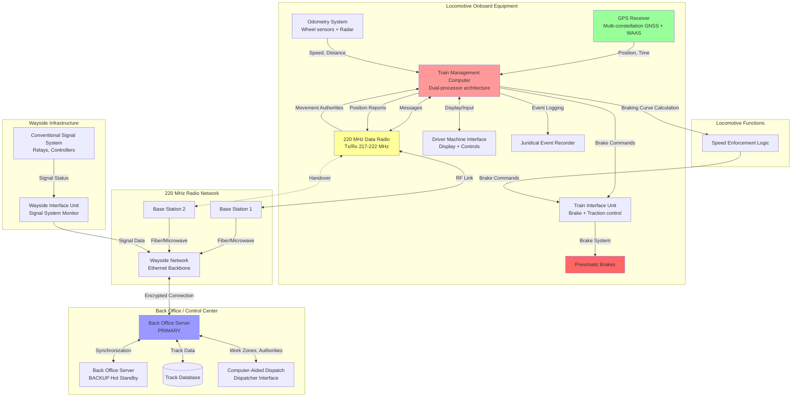
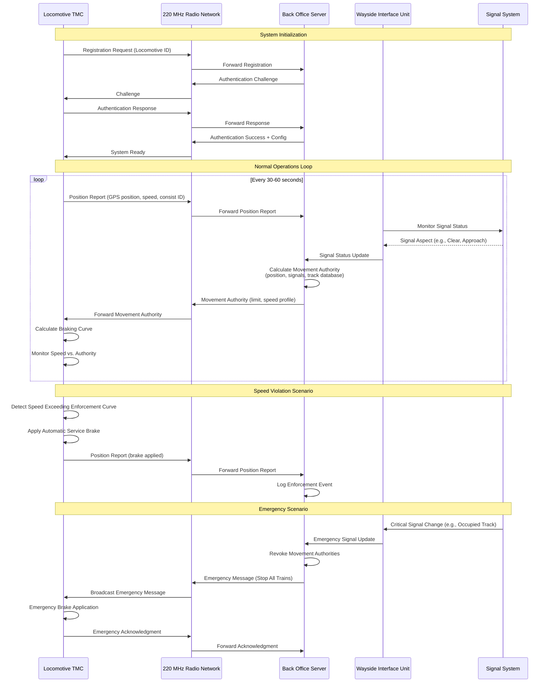

# Positive Train Control (PTC) - I-ETMS Protocol Specification

## Protocol Overview and Purpose

Positive Train Control (PTC) is a communication and train control technology mandated by the U.S. Congress through the Rail Safety Improvement Act of 2008, enacted in response to several catastrophic train accidents that could have been prevented through automated intervention. PTC represents a fundamental safety overlay system designed to prevent four primary types of railroad accidents: train-to-train collisions, derailments caused by excessive speed, unauthorized incursions into established work zones, and train movements through misaligned switches.

The Interoperable Electronic Train Management System (I-ETMS) is the predominant PTC implementation in North America, developed collaboratively by major Class I freight railroads and adopted by passenger and commuter railroads for interoperability. I-ETMS implements a distributed architecture where onboard computers continuously calculate safe operating envelopes based on GPS position, track database information, and movement authorities received from back office servers via 220 MHz data radio communication.

Unlike European ETCS or urban CBTC systems designed for greenfield deployment, PTC was engineered as an overlay to existing conventional signaling infrastructure across approximately 60,000 miles of U.S. mainline track. This constraint shaped the I-ETMS architecture to integrate with legacy relay-based, solid-state, and microprocessor-based signal systems while providing automated enforcement of speed restrictions and movement authorities. The system operates in a non-vital mode (from traditional signaling perspective) but implements safety-critical functions equivalent to SIL-4 requirements through defense-in-depth strategies and fail-safe design principles.

## Technical Architecture

### System Components

**Onboard Locomotive Equipment (Locomotive Segment):**

- **Train Management Computer (TMC):**
  - Dual-redundant processor architecture: Train Control Processor (TCP) for vital logic, Business Application Processor (BAP) for non-vital functions
  - Operating system: Typically VxWorks real-time OS or Linux-based platforms
  - Memory: 4-8 GB RAM, 32-128 GB solid-state storage for track database and software
  - Processing capability: Real-time braking curve calculation at 1-10 Hz update rate
  - Environmental rating: Railway-grade equipment (-40°C to +74°C operating temperature)
  - Vibration and shock resistance: Meeting AAR M-1003 locomotive environmental specifications

- **GPS Receiver with WAAS Augmentation:**
  - Multi-constellation GNSS support: GPS (primary), GLONASS, Galileo (supplementary)
  - Wide Area Augmentation System (WAAS) corrections: Improves accuracy from ±10m to ±3m (95%)
  - Update rate: 1-10 Hz position and velocity updates
  - Differential GPS capability: Local or network-based corrections
  - Multi-path mitigation: Advanced signal processing for urban canyon environments
  - Integrated inertial measurement unit: Accelerometer and gyroscope for dead reckoning during GPS outages

- **220 MHz Data Radio:**
  - Frequency allocation: Railroad-specific licensed spectrum in 217-222 MHz band
  - Transmit power: Typically 5-50 watts (depending on locomotive/wayside configuration)
  - Modulation: FSK (Frequency Shift Keying) or PSK (Phase Shift Keying) depending on vendor
  - Data rate: 9.6-19.2 kbps (varies by implementation)
  - Redundant radio units: Dual radios with automatic failover
  - Antenna configuration: Roof-mounted omnidirectional antennas with diversity reception

- **Cellular Modem (Optional/Supplementary):**
  - Technology: 3G/4G LTE multi-carrier capable
  - Purpose: Non-real-time data transfer (software updates, diagnostics, maintenance data)
  - Not used for safety-critical real-time train control messages
  - Provides administrative communication path

- **Odometry System:**
  - Wheel tachometers: Magnetic or optical sensors on multiple axles
  - Radar-based ground speed sensor: Doppler radar measuring actual ground speed
  - Fusion algorithm: Combines GPS, wheel sensors, and radar for optimal position accuracy
  - Wheel slip/slide detection: Identifies wheel locking or spinning conditions
  - Calibration: Automatic calibration using GPS and track database known locations

- **Driver Machine Interface (DMI):**
  - Display: 10-15 inch color touchscreen or physical button interface
  - Resolution: High-contrast daylight-readable display
  - Information presented:
    * Current speed (analog and digital)
    * Maximum authorized speed
    * Distance to next speed restriction
    * PTC system status and mode
    * Movement authority end location
    * Alert and alarm messages
  - Input methods: Touchscreen, physical buttons, acknowledgment switches
  - Audible alerts: Multi-tone warning system for speed violations and alerts

- **Train Interface Unit (TIU):**
  - Brake interface: Connects to locomotive pneumatic brake system (26C, ABD, EPIC brakes)
  - Traction interface: Reads throttle position and can inhibit traction if needed
  - Safety loops: Vital relay circuits for brake application
  - Locomotive data bus: Integration with existing locomotive control systems (AAR S-9152 APMS, etc.)
  - Emergency brake enforcement: Direct pneumatic valve control for fail-safe braking

- **Juridical Event Recorder:**
  - Storage: Solid-state memory with 72-hour minimum data retention (typical: 30+ days)
  - Data recorded: GPS position, speed, PTC status, braking events, driver actions, radio messages
  - Tamper-evident design: Secure enclosure with physical seals
  - Download capability: Wireless or wired connection for post-incident analysis
  - Time synchronization: GPS-disciplined clock ensuring accurate timestamps

**Wayside Infrastructure (Wayside Segment):**

- **Wayside Interface Units (WIU):**
  - Function: Monitors signal aspects, switch positions, and track occupancy from conventional signal system
  - Two configurations:
    * Integrated: WIU function added to existing signal bungalow equipment
    * Standalone: Separate WIU cabinet at signal locations
  - Input types: Relay contacts, solid-state outputs, digital communication from signal controllers
  - Processing: Safety-grade logic controllers (typically Programmable Logic Controllers rated for railway applications)
  - Communication: Connects to wayside messaging system via Ethernet (fiber or copper)
  - Power: AC powered with battery backup for continued operation during power failures
  - Environmental protection: NEMA-rated enclosures for outdoor railway environments

- **Wayside Messaging System:**
  - Architecture: Distributed servers communicating with WIUs and back office
  - Protocol: Ethernet-based proprietary protocols (varying by railroad and vendor)
  - Data flow: Aggregates signal system status and forwards to back office servers
  - Redundancy: Dual-path communication for high availability
  - Latency: Typically <1 second from signal event to back office notification

- **220 MHz Base Stations:**
  - Tower locations: Approximately every 10-40 miles depending on terrain
  - Transmit power: 50-100 watts typical (higher power than locomotive units)
  - Antenna height: 100-300 feet above ground level for extended coverage
  - Antenna type: Omnidirectional or sector antennas depending on coverage requirements
  - Coverage area: 15-50 mile radius depending on terrain, antenna height, and power
  - Overlap zones: Adjacent towers provide redundant coverage for seamless handover
  - Backhaul: Fiber optic or microwave links connecting to railroad communication network

**Back Office Infrastructure (Office Segment):**

- **Back Office Server (BOS):**
  - Function: Central intelligence managing movement authorities and track database
  - Server architecture: Redundant hot-standby servers with automatic failover
  - Database: Comprehensive track database including:
    * Track geometry (curves, gradients, superelevation)
    * Signal locations and logic
    * Switch locations and possible routes
    * Speed restrictions (permanent and temporary)
    * Work zone limits and authorities
    * Geographic coordinates of all track features
  - Processing capability: Manages hundreds to thousands of simultaneous locomotive connections
  - Real-time processing: Movement authority calculations updated continuously based on train positions
  - Audit logging: Complete audit trail of all system actions and decisions

- **PTC Dispatch Integration:**
  - Interface with railroad Computer-Aided Dispatch (CAD) systems
  - Train consist data exchange: Train identification, length, tonnage, braking characteristics
  - Track warrant integration: Work zones and temporary speed restrictions
  - Real-time train tracking: PTC positions supplement dispatcher train tracking tools
  - Alert escalation: PTC violations or system issues presented to dispatchers

- **Maintenance and Administration Servers:**
  - Configuration management: Track database version control and distribution
  - Software distribution: Over-the-air updates to locomotive onboard systems
  - Diagnostics and monitoring: System health monitoring and fault detection
  - Reporting: Compliance reporting to Federal Railroad Administration (FRA)
  - Performance analytics: System performance metrics and trend analysis

### OSI Layer Operation

**Application Layer (Layer 7):**

I-ETMS implements several application-layer protocols for train control and system management:

- **Movement Authority Protocol:**
  - Back Office Server issues movement authority messages to locomotives
  - Message contains: Authority limit (end point), speed restrictions, route information
  - Update frequency: Transmitted when train position changes or track conditions change
  - Expiration: Movement authorities have time-based or location-based expiration
  - Revocation: BOS can revoke or modify authorities if conditions change (e.g., work zone established)

- **Train Location Report Protocol:**
  - Locomotive transmits position reports to Back Office Server
  - Message contents: GPS coordinates, speed, direction, heading, consist identification
  - Frequency: Typically every 30-60 seconds during normal operations
  - Event-triggered: Additional reports when crossing specific locations or on-demand requests
  - Validation: BOS validates reported position against expected train movement

- **System Status Protocol:**
  - Bidirectional health monitoring between locomotive and back office
  - Locomotive reports: GPS status, radio link quality, onboard equipment status
  - Back Office reports: Server status, track database version, system alerts
  - Heartbeat mechanism: Regular keep-alive messages detect communication failures

- **Work Zone Authorization Protocol:**
  - Dispatchers or maintenance personnel establish work zone limits via CAD interface
  - BOS translates work zones into movement authority restrictions
  - Locomotives prevented from entering without specific authorization
  - Multiple protection layers: Movement authority restriction + work zone database entries

**Network Layer (Layer 3):**

IP-based networking with railway-specific adaptations:

- **IPv4 Addressing:**
  - Private IP address space for PTC network (typically RFC 1918 addresses)
  - Static IP addressing for back office and wayside infrastructure
  - Dynamic addressing or static pools for locomotives
  - Network Address Translation (NAT) at boundaries if interfacing with railroad enterprise networks

- **Routing Protocols:**
  - Static routing: Pre-configured routes for deterministic path selection
  - Dynamic routing: OSPF or BGP in some implementations for redundancy and load balancing
  - Quality of Service (QoS): Priority routing for safety-critical messages
  - Traffic engineering: Redundant paths with fast failover mechanisms

- **Fragmentation Handling:**
  - MTU considerations: Efficient packet sizing to avoid fragmentation over radio links
  - Segmentation at application layer: Large messages (track database updates) segmented appropriately

**Data Link Layer (Layer 2):**

Multiple data link technologies depending on communication medium:

*220 MHz Radio Data Link:*
- Proprietary protocols specific to radio vendor and railroad implementation
- ITCR (Interoperable Train Control Radio) specifications define interoperability requirements
- Frame structure: Typical packet-based protocol with header, payload, error detection
- Error detection: Cyclic Redundancy Check (CRC-16 or CRC-32)
- Retransmission: Automatic Repeat Request (ARQ) for corrupted packets
- Medium access: Time Division Multiple Access (TDMA) or Carrier Sense Multiple Access (CSMA)
- Handover: Seamless transition between base stations as locomotive moves

*Ethernet (Wayside Backbone):*
- IEEE 802.3 Ethernet standard (1 Gbps fiber optic typical)
- VLAN segmentation: Separation of PTC traffic from other railroad network traffic
- Redundant paths: Spanning Tree Protocol (STP) or Rapid STP for loop prevention and redundancy
- Managed switches: Configurable for QoS, monitoring, and security features

*Cellular Data Link (if used):*
- Standard 3GPP protocols for LTE data bearers
- VPN tunneling: Encrypted tunnels over public cellular networks
- Carrier diversity: Multi-carrier SIM cards for increased availability

**Physical Layer (Layer 1):**

*220 MHz Radio Physical Layer:*
- Frequency: 217-222 MHz band (specific channels assigned per railroad/region)
- Channel bandwidth: 12.5 kHz or 25 kHz depending on implementation
- Modulation: 4-FSK (Four-level Frequency Shift Keying) or QPSK (Quadrature Phase Shift Keying)
- Transmit power: 5-50 watts locomotive, 50-100 watts base station
- Antenna characteristics: Omnidirectional vertical polarization
- Propagation: VHF propagation characteristics (line-of-sight dominant, some diffraction)

*Fiber Optic (Wayside Backbone):*
- Single-mode or multi-mode fiber depending on distance
- Wavelengths: 1310 nm or 1550 nm (single-mode), 850 nm (multi-mode)
- Connectors: SC, LC, or MPO connectors for railway-grade durability
- Distance: Up to 80 km (single-mode) without repeaters

*Cellular Physical Layer:*
- Standard 3GPP cellular physical layer specifications
- Frequency bands: 700 MHz (Band 12/13), 850 MHz (Band 5), 1900 MHz (Band 2), AWS (Band 4), etc.

### Message Structure and Types

**Movement Authority Message:**
```
Message Header:
- Message Type: MOVEMENT_AUTHORITY (0x30)
- Message ID: Unique identifier for this authority
- Timestamp: Unix timestamp (seconds since epoch)
- Train ID: Consist identifier
- Sequence Number: Monotonically increasing sequence
- CRC-32: Cyclic redundancy check for error detection

Authority Data:
- Authority Limit: Position (latitude, longitude) or track segment identifier + offset
- Authority Type: Normal / Restricted / Work_Zone / On_Call
- Speed Restrictions (array of segments):
  - Segment Start Position: Latitude, longitude
  - Segment End Position: Latitude, longitude
  - Maximum Speed: mph (integer)
  - Restriction Reason Code: Curve / Grade / Temporary / Work_Zone / Signal
- Route Information:
  - Switch Positions: Array of switches with required position for route
  - Interlocking Routes: Signal system route identifiers
- Time Validity: Expiration timestamp (for time-limited authorities)
- Special Conditions: Flags for special operating conditions
```

**Train Location Report Message:**
```
Message Header:
- Message Type: LOCATION_REPORT (0x10)
- Message ID: Unique identifier
- Timestamp: GPS time (high precision)
- Train ID: Consist identifier
- Sequence Number: Incremental counter
- CRC-32: Error detection code

Position Data:
- GPS Position: Latitude, longitude (decimal degrees, 7-8 decimal places)
- Altitude: Meters above sea level
- GPS Quality: Fix type (No fix / 2D / 3D / DGPS / RTK)
- Horizontal Dilution of Precision (HDOP): GPS accuracy metric
- Number of Satellites: Count of satellites used in fix
- Speed: Velocity in mph (from GPS)
- Heading: Compass heading in degrees
- Track Segment: Identifier of track segment from onboard database
- Track Offset: Distance along segment (meters)

Train Status:
- Odometer Speed: Speed from wheel sensors (mph)
- Throttle Position: Notch position (0-8 or percentage)
- Brake Status: Released / Service / Emergency
- Direction: Forward / Reverse
- Consist Length: Total length in feet
- Consist Tonnage: Total weight in tons
- PTC Mode: Enforcing / Monitoring / Cut-Out / Failed

GPS Health:
- GPS Receiver Status: Operational / Degraded / Failed
- WAAS Status: Available / Unavailable
- Position Confidence: Statistical confidence in position accuracy
```

**Emergency Message:**
```
Message Header:
- Message Type: EMERGENCY (0xFF)
- Priority: Highest (bypasses normal message queuing)
- Message ID: Unique identifier
- Timestamp: System time
- Source ID: Originating entity (locomotive, dispatcher, BOS)
- CRC-32: Error detection

Emergency Data:
- Emergency Type: Derailment / Collision / Unauthorized_Movement / Equipment_Failure / Other
- Position: Location of emergency (if applicable)
- Train ID: Affected train identifier
- Description: Free-text description (limited length)
- Actions Required: Stop_All_Trains / Restrict_Movement / Notify_Only
- Affected Area: Geographic boundary or track segments impacted
```

**Track Database Update Message:**
```
Message Header:
- Message Type: TRACK_DATABASE_UPDATE (0x40)
- Message ID: Unique identifier
- Timestamp: Update creation time
- Database Version: New version number
- Incremental: Boolean (full or incremental update)
- CRC-32: Error detection

Update Data (incremental):
- Update Type: Add / Modify / Delete
- Record Type: Track_Segment / Speed_Restriction / Signal / Switch / Work_Zone
- Record Identifier: Unique ID of database record
- Record Data: Complete or modified record content
  * Track segment: Start/end coordinates, curvature, gradient, speed limits
  * Speed restriction: Location, new speed, effective date/time, reason
  * Signal: Location, type, logic, associated track segments
  * Switch: Location, possible positions, associated routes
  * Work zone: Boundary coordinates, authorization requirements, effective period

Validation:
- Digital Signature: Cryptographic signature of entire update (RSA or ECDSA)
- Certificate: Public key certificate chain for signature verification
```

**Acknowledgment Message:**
```
Message Header:
- Message Type: ACKNOWLEDGMENT (0x01)
- Message ID: Unique identifier
- Timestamp: Acknowledgment time
- Original Message ID: ID of message being acknowledged
- CRC-32: Error detection

Acknowledgment Data:
- Status: Received / Accepted / Rejected / Failed
- Reason Code: (if rejected) Invalid_Data / CRC_Error / Out_of_Sequence / Unauthorized
- Additional Info: Textual description of rejection reason
```

### Communication Flow

**System Initialization Sequence:**

```
1. Locomotive Power-Up:
   - Onboard PTC equipment performs self-test diagnostics
   - GPS receiver acquires satellite lock (typically 30-60 seconds cold start)
   - Track database loaded from non-volatile storage into RAM
   - 220 MHz radio initializes and searches for base station

2. Radio Network Registration:
   - TMC scans for strongest 220 MHz base station signal
   - TMC transmits registration request with locomotive identifier
   - Base station acknowledges and provides network parameters
   - TMC establishes connection to regional back office server

3. Authentication and Authorization:
   - TMC sends authentication credentials to BOS (typically certificate-based)
   - BOS validates locomotive identity and authorization
   - BOS verifies track database version on locomotive
   - If mismatch: BOS initiates track database update process
   - BOS sends initial system status and configuration

4. Consist Information Exchange:
   - Engineer enters consist data via DMI (train ID, length, tonnage, braking characteristics)
   - Alternative: Automatic consist data from railroad consist management system
   - TMC transmits consist data to BOS
   - BOS acknowledges and records consist information

5. Initial Movement Authority:
   - BOS calculates initial movement authority based on:
     * Current locomotive position (from GPS)
     * Signal system status (from WIUs)
     * Dispatcher route authorization (from CAD system)
   - BOS transmits initial movement authority to locomotive
   - TMC acknowledges receipt and displays authority to engineer

6. PTC System Activation:
   - Engineer acknowledges PTC initialization complete
   - System enters "Enforcing" mode (active protection)
   - DMI displays system status: "PTC ACTIVE - ENFORCING"
   - Locomotive ready for revenue operations
```

**Normal Operations Loop:**

```
1. Position Reporting (Every 30-60 seconds):
   - TMC reads GPS position and odometry data
   - TMC performs position validation (GPS vs. track database correlation)
   - TMC transmits location report to BOS via 220 MHz radio
   - BOS receives and validates position report

2. Movement Authority Update:
   - BOS monitors locomotive position relative to existing movement authority
   - BOS checks for track condition changes:
     * Signal aspects changes reported by WIUs
     * New temporary speed restrictions
     * Work zones established or cleared
     * Switch positions for route alignment
   - If conditions changed: BOS recalculates movement authority
   - BOS transmits updated movement authority to locomotive
   - TMC acknowledges receipt and updates onboard enforcement logic

3. Onboard Speed Enforcement:
   - TMC continuously calculates braking curves based on:
     * Current position and speed
     * Movement authority limit
     * Track gradient profile (from database)
     * Consist braking characteristics
     * Speed restrictions along route
   - TMC determines maximum permitted speed at current location
   - TMC monitors actual train speed from GPS and odometry
   - Enforcement logic:
     * Speed within limits: No action
     * Speed approaching warning threshold: Visual and audible alert to engineer
     * Speed exceeds enforcement threshold: Automatic brake application

4. Signal System Monitoring:
   - WIUs continuously monitor signal aspects from conventional signal system
   - Signal aspect changes transmitted to BOS via wayside messaging system
   - BOS incorporates signal status into movement authority calculations
   - PTC enforces most restrictive of: Signal indication, movement authority, speed restrictions

5. Work Zone Protection:
   - Dispatcher establishes work zone via CAD system interface
   - CAD system transmits work zone information to BOS
   - BOS updates movement authorities for all trains approaching work zone
   - Locomotives prevented from entering work zone without explicit authority
   - Maintenance personnel receives positive confirmation of protection

6. Continuous Monitoring:
   - TMC performs continuous self-diagnostics
   - GPS health monitoring (satellite count, HDOP, position jumps)
   - Radio link quality monitoring (RSSI, packet loss rate)
   - Equipment status monitoring (all subsystems)
   - If critical failure detected: Automatic transition to degraded mode
```

**Handover Between Base Stations:**

```
1. Locomotive Moving Through Territory:
   - TMC continuously monitors signal strength from current base station
   - TMC also monitors signals from adjacent base stations (pre-scanning)

2. Handover Decision:
   - Signal strength from current base station degrades
   - Signal strength from adjacent base station exceeds threshold
   - TMC initiates handover procedure

3. Handover Execution:
   - TMC maintains connection with current base station (make-before-break)
   - TMC transmits handover request to new base station
   - New base station allocates resources and confirms ready
   - TMC switches radio to new base station frequency/channel
   - Connection established to new base station (typical handover time: <5 seconds)
   - TMC releases connection with old base station

4. Session Continuity:
   - Wayside messaging system maintains session state during handover
   - BOS connection seamless from application layer perspective
   - Buffered messages forwarded to new base station
   - No loss of movement authority or protection during handover
```

**Emergency Scenario:**

```
1. Emergency Condition Detected:
   - Source examples:
     * Engineer activates emergency brake
     * Derailment detected by onboard sensors
     * Dispatcher observes unsafe condition
     * BOS detects unauthorized train movement

2. Emergency Message Broadcast:
   - Source entity transmits emergency message (highest priority)
   - Message bypasses normal queuing and transmission protocols
   - 220 MHz base stations broadcast emergency to all locomotives in area
   - BOS simultaneously sends directed messages to specific trains

3. Locomotive Response:
   - All locomotives in affected area receive emergency message
   - TMC evaluates applicability (location, train ID, conditions)
   - If applicable: Immediate automatic emergency brake application
   - DMI displays emergency indication to engineer
   - TMC acknowledges emergency message to BOS

4. System-Wide Coordination:
   - Dispatchers notified via CAD system integration
   - Movement authorities for all trains in area revoked or restricted
   - Additional trains prevented from entering affected area
   - Emergency services notified through dispatcher protocols

5. Recovery:
   - After emergency resolved and investigated
   - Dispatcher clears emergency condition via CAD system
   - BOS issues new movement authorities resuming operations
   - Affected locomotives reset PTC systems and resume service
```

### Timing Requirements

**Safety-Critical Timing:**

- **Position Report Interval:** 30-60 seconds typical
  - Ensures BOS maintains current awareness of all train locations
  - Shorter intervals in high-traffic areas or approach to authorities
  - Missed reports trigger alerts and potential movement authority restrictions

- **Movement Authority Transmission:** <5 seconds from condition change
  - Signal aspect change to movement authority update: <5 seconds total
  - Includes: WIU detection, wayside messaging, BOS processing, radio transmission
  - Critical for maintaining safe separation from conflicting movements

- **Brake Application Response:** <2 seconds from speed violation
  - TMC detects speed exceeding enforcement curve
  - Brake command issued to TIU within 1 second
  - Pneumatic brake response begins within 2 seconds total
  - Full brake application achieved within 5-8 seconds (pneumatic system propagation)

- **Emergency Message Propagation:** <1 second
  - Emergency messages broadcast immediately with highest priority
  - All trains within affected area receive message within 1 second
  - Automatic brake response initiated immediately upon receipt

**Communication Timing:**

- **Radio Transmission Latency:** 0.5-2 seconds typical
  - Includes: Queuing, medium access delay, transmission time, acknowledgment
  - 220 MHz radio data rate: 9.6-19.2 kbps limits large message transmission time
  - Prioritization ensures safety-critical messages minimize queuing delay

- **End-to-End Latency (Locomotive ↔ BOS):** 2-5 seconds typical
  - Includes: Radio transmission, wayside backbone transit, BOS processing
  - Acceptable for position reporting and movement authority updates
  - Not suitable for real-time closed-loop control (hence onboard enforcement logic)

- **Handover Time:** <5 seconds
  - Locomotive transitions between base stations
  - Make-before-break strategy minimizes interruption
  - Buffering at network layer prevents message loss during handover

**Operational Timing:**

- **GPS Update Rate:** 1-10 Hz (1-10 position updates per second)
  - Higher rates improve position accuracy through filtering and averaging
  - Lower rates acceptable for freight operations (slow speed changes)

- **Braking Curve Calculation:** 1-10 Hz
  - Continuously updated as train moves and speed changes
  - Compute-intensive: Gradient profile lookup, physics calculations
  - Modern TMC processors handle real-time calculation comfortably

- **DMI Update Rate:** 1-5 Hz
  - Display updates provide engineer with real-time system status
  - Speed, distance to restrictions, system status refreshed continuously

- **Track Database Update:** Asynchronous, on-demand
  - Major updates: Locomotive in maintenance facility via Wi-Fi (minutes to hours)
  - Minor updates: Over 220 MHz radio during revenue service (minutes, low priority)
  - Critical updates: Expedited transmission with higher priority

### Error Handling

**GPS Failure Scenarios:**

*Complete GPS Loss:*
```
1. TMC detects GPS receiver failure or complete satellite loss
2. System transitions to "Dead Reckoning" mode:
   - Position calculated using last known GPS position
   - Odometry (wheel sensors and radar) provides distance traveled
   - Heading maintained from inertial measurement unit
3. Position confidence degrades with distance traveled
4. BOS notified of GPS failure condition
5. Enforcement continues with conservative safety margins:
   - Reduced maximum permitted speeds
   - Shorter movement authorities
   - More restrictive brake curve calculations
6. If dead reckoning exceeds confidence limits (typically 5-10 miles):
   - System enters "Cut-Out" mode (PTC non-functional)
   - Dispatcher notified, train operates under conventional signals only
   - Maintenance intervention required to restore GPS

Mitigation: Multi-constellation GNSS, WAAS augmentation, quality monitoring
```

*GPS Spoofing Detection:*
```
1. TMC compares GPS position with multiple validation sources:
   - Odometry distance traveled vs. GPS distance
   - Track database correlation (position must match known track)
   - Speed comparison: GPS velocity vs. wheel sensors
   - Acceleration limits: Position changes must be physically possible
2. If discrepancies exceed thresholds:
   - GPS marked as unreliable
   - System transitions to dead reckoning or cut-out mode
   - Alert generated to maintenance and security personnel
3. Suspected spoofing incidents logged and reported to FRA

Mitigation: Multi-sensor fusion, plausibility checking, track database correlation
```

**Radio Communication Failures:**

*Complete Communication Loss:*
```
1. TMC detects no valid messages from BOS for timeout period (typically 5 minutes)
2. System continues enforcement under last valid movement authority
3. Movement authority remains valid until:
   - Authority expiration time reached (if time-limited), OR
   - Authority location limit approached
4. If approaching end of movement authority without communication:
   - Automatic service brake application
   - Train stops before end of authority limit
   - Engineer must contact dispatcher for further instructions
5. Communication restoration:
   - TMC re-registers with radio network
   - Position report transmitted immediately
   - BOS issues updated movement authority
   - Normal operations resume

Mitigation: Overlapping base station coverage, cellular backup (if available), dispatcher radio contact
```

*Intermittent Communication:*
```
1. Sporadic message loss detected (packet loss >20%)
2. TMC and BOS implement retransmission strategies:
   - Automatic repeat request for critical messages
   - Duplicate message detection and suppression
3. Position reporting interval may be adjusted (shorter for better tracking)
4. Movement authorities issued with conservative margins
5. If communication quality does not improve:
   - Alert to maintenance personnel
   - Radio diagnostics and potentially manual intervention

Mitigation: Error correction coding, retransmission protocols, base station redundancy
```

**Onboard Equipment Failures:**

*TMC Processor Failure:*
```
1. Dual-redundant processor architecture:
   - Primary processor continuously monitored by secondary
   - Secondary processor in hot standby, synchronized state
2. Primary processor failure detected:
   - Watchdog timer expiration, self-test failure, or output comparison mismatch
3. Automatic failover to secondary processor:
   - Secondary assumes control within <1 second
   - Seamless from operational perspective (no brake application)
   - Alert generated to engineer and maintenance
4. If both processors fail:
   - Immediate automatic emergency brake application
   - PTC system enters "Failed" state
   - Train must operate under conventional signals (if available) or stop

Mitigation: Redundant processors, continuous self-diagnostics, fail-safe design
```

*Brake Interface Failure:*
```
1. TIU unable to apply brake or detect brake status
2. TMC detects interface failure through diagnostics
3. Immediate fail-safe response:
   - If brake application needed but interface failed: Emergency brake command via backup method
   - Alert to engineer (DMI and audible alarm)
4. System enters degraded mode:
   - PTC monitoring only (cannot enforce)
   - Engineer responsible for manual compliance
   - Dispatcher notified, train may be restricted or taken out of service

Mitigation: Redundant brake interfaces, multiple brake command methods (pneumatic, electrical)
```

**Back Office Server Failures:**

*Primary BOS Failure:*
```
1. Redundant hot-standby BOS architecture:
   - Secondary BOS continuously synchronized with primary
   - Health monitoring between primary and secondary
2. Primary BOS failure detected (heartbeat timeout, health check failure)
3. Automatic failover to secondary BOS:
   - Secondary assumes primary role within 5-10 seconds
   - All locomotive connections transferred to secondary
   - Locomotive session state reconstructed from last known data
4. Locomotives may experience brief communication interruption:
   - Continue enforcement under last movement authority
   - Re-establish connection with new primary BOS
   - Resume normal operations with minimal impact

Mitigation: Redundant servers, continuous synchronization, automatic failover
```

*Complete BOS Failure (Primary and Secondary):*
```
1. Catastrophic scenario: Both primary and secondary BOS offline
2. All locomotives lose connection to central control
3. Locomotives continue enforcement under last valid movement authorities
4. As movement authorities expire or limits approached:
   - Trains stop and cannot receive new authorities
   - Service disruption across entire territory
5. Emergency procedures:
   - Dispatchers authorize movements via voice radio (non-PTC)
   - Locomotives operate in "Cut-Out" mode under dispatcher control
   - Conventional signaling (if still functional) governs movements
6. Service restoration:
   - BOS systems restored from backup
   - Locomotives reconnect and resume PTC operations
   - Full service gradually restored

Mitigation: Geographic BOS redundancy, disaster recovery procedures, conventional signaling backup
```

## Physical Layer Specifications

### 220 MHz Radio System

**Frequency Allocation:**
- Primary band: 217-222 MHz (5 MHz total bandwidth)
- Channel allocation: Railroad-specific assignments coordinated through industry forum
- Channel bandwidth: 12.5 kHz or 25 kHz depending on implementation
- FCC licensing: Part 90 Private Land Mobile Radio Service licenses

**Railroad-Specific Allocations (Examples):**
- BNSF Railway: 220.1-220.5 MHz in western regions
- Union Pacific: 219.5-220.0 MHz in central regions
- CSX Transportation: 218.5-219.0 MHz in eastern regions
- Norfolk Southern: 218.0-218.5 MHz in southeastern regions
- Amtrak/Commuter Railroads: Shared frequencies with host freight railroads

**Modulation and Coding:**
- **Modulation:** 4-FSK (Four-level Frequency Shift Keying) typical
  - Four frequency tones represent two bits per symbol
  - Spectral efficiency: 2 bits/second/Hz
  - Robust against noise and multipath fading
- **Data Rate:** 9.6 kbps or 19.2 kbps depending on channel bandwidth and modulation
- **Forward Error Correction:** Convolutional coding or Reed-Solomon coding
  - Corrects bit errors without retransmission
  - Typically rate 1/2 or 3/4 coding (adds 50-100% redundancy)
- **Interleaving:** Bit interleaving spreads burst errors across multiple codewords

**Transmit Power and Coverage:**
- **Locomotive Radio:**
  - Transmit power: 5-25 watts typical
  - Antenna: Roof-mounted, vertically polarized, omnidirectional
  - Antenna gain: 0-3 dBi (nearly omnidirectional pattern)
  - Effective radiated power: 5-25 watts (37-44 dBm)
- **Base Station Radio:**
  - Transmit power: 50-100 watts typical
  - Antenna: Tower-mounted at 100-300 feet above ground
  - Antenna gain: 3-6 dBi (omnidirectional or low-gain directional)
  - Effective radiated power: 150-600 watts (52-58 dBm)
- **Coverage Range:**
  - Flat terrain: 25-50 miles radius from base station
  - Mountainous terrain: 10-20 miles (limited by line-of-sight)
  - Urban/industrial areas: 15-30 miles (interference and obstruction)

**Link Budget Analysis (220 MHz):**
```
Base Station to Locomotive:
- Transmit power: +50 dBm (100 watts)
- Antenna gain: +6 dBi
- Cable/connector loss: -3 dB
- Effective radiated power: +53 dBm

Path Loss (30 miles, 220 MHz):
- Free space path loss: -120 dB (calculated: 20*log10(48km) + 20*log10(220MHz) + 32.44)
- Additional losses (foliage, diffraction): -10 dB
- Total path loss: -130 dB

Locomotive Reception:
- Receive antenna gain: +2 dBi
- Cable/connector loss: -2 dB
- Received signal strength: 53 - 130 + 2 - 2 = -77 dBm

Receiver Sensitivity:
- Required SNR for 4-FSK with FEC: 10 dB (approx)
- Noise floor (-174 dBm/Hz + 10*log10(12.5 kHz BW)): -133 dBm
- Receiver sensitivity: -133 + 10 = -123 dBm

Link Margin:
- -77 dBm received - (-123 dBm sensitivity) = 46 dB margin
- Provides substantial fade margin for multipath, obstruction, interference
```

**Propagation Characteristics:**
- VHF band (220 MHz) propagation:
  - Primarily line-of-sight propagation
  - Some diffraction over terrain obstacles
  - Reflection and multipath in urban/industrial environments
  - Atmospheric conditions have minimal effect (not HF ionospheric propagation)
- Railroad-specific considerations:
  - Terrain following: Track routes often follow valleys, mountains, cuts
  - Foliage attenuation: Seasonal variations in rural areas
  - Infrastructure interference: Bridges, tunnels, overpasses affect coverage
  - Base station placement: Towers positioned for optimal track coverage

**Interference Management:**
- Frequency coordination: Railroads coordinate frequencies to avoid mutual interference
- Power control: Adjust transmit power to minimize coverage overlap
- Directional antennas: Sectorized coverage in high-density areas
- Filtering: Bandpass filters reject out-of-band interference
- Monitoring: Spectrum monitoring detects and locates interference sources

### GPS/GNSS Physical Layer

**GPS L1 Signal:**
- Frequency: 1575.42 MHz (L1 band)
- Modulation: BPSK (Binary Phase Shift Keying)
- Spreading code: C/A code (Coarse/Acquisition), 1.023 MHz chip rate
- Navigation message: 50 bits/second broadcast
- Signal power: Approximately -130 dBm at earth surface (very weak)

**WAAS Augmentation:**
- Purpose: Improves GPS accuracy from ±10m to ±3m (95% confidence)
- Geostationary satellites: Broadcast differential corrections on GPS L1 frequency
- Coverage: North America (including continental U.S., Alaska, Canada, Mexico)
- Correction data: Atmospheric errors, satellite clock errors, ephemeris corrections
- Update rate: Corrections updated every 5 seconds

**Multi-Constellation GNSS:**
- **GPS (U.S.):** Primary constellation, 24+ satellites
- **GLONASS (Russia):** L1 band (1602 MHz), provides redundancy and improves availability
- **Galileo (EU):** E1 band (1575.42 MHz, same as GPS L1), increased accuracy
- **BeiDou (China):** B1 band (1561.098 MHz), regional and global coverage
- Advantage: Using multiple constellations increases visible satellite count, improves positioning accuracy and availability

**Receiver Characteristics:**
- **Sensitivity:** Typically -160 dBm (capable of tracking very weak signals)
- **Acquisition time:** Cold start 30-60 seconds, warm start 10-30 seconds, hot start <5 seconds
- **Position accuracy:**
  - GPS only: ±5-10 meters (95% confidence)
  - GPS with WAAS: ±2-3 meters (95% confidence)
  - Differential GPS: ±1 meter or better (with ground reference stations)
- **Update rate:** 1-10 Hz (1-10 position updates per second)

**Railroad Environment Challenges:**
- **Urban canyons:** Tall buildings block satellites, reduce visible count, cause multipath
- **Tunnels:** Complete GPS loss, requires dead reckoning
- **Foliage:** Tree canopy attenuates GPS signals (seasonal variation)
- **Bridges and overpasses:** Momentary satellite obstruction
- **Multipath:** Reflections from steel structures cause position errors

**Mitigation Strategies:**
- Multi-constellation receivers increase satellite availability
- WAAS augmentation improves accuracy
- Inertial measurement unit (IMU) provides dead reckoning during GPS outages
- Track database correlation validates GPS position against known track geometry
- Kalman filtering combines multiple sensor inputs for optimal position estimate

### Cellular Physical Layer (Supplementary Communication)

**Frequency Bands (North America):**
- 700 MHz Band 12/13 (LTE): Lower frequency, better propagation and building penetration
- 850 MHz Band 5: Good balance of coverage and capacity
- 1900 MHz Band 2: Higher capacity, more common in urban areas
- AWS Band 4 (1700/2100 MHz): Additional capacity in many markets
- 2.6 GHz Band 7: High-capacity urban deployments

**LTE Physical Layer:**
- Modulation: QPSK, 16-QAM, 64-QAM (adaptive based on signal quality)
- Multiple access: OFDMA (Orthogonal Frequency Division Multiple Access)
- Channel bandwidth: 5 MHz, 10 MHz, 15 MHz, 20 MHz
- Data rates: 5-50 Mbps typical (locomotive applications use fraction of capacity)

**Coverage:**
- 700/850 MHz: Rural coverage, cell radius 5-20 miles
- 1900 MHz: Suburban/urban coverage, cell radius 1-5 miles
- Railroad considerations: Coverage along tracks varies, rural areas may have gaps

**Usage in PTC:**
- Non-real-time data: Software updates, diagnostics, maintenance data
- Typically not used for safety-critical train control messages
- Provides backup communication path for administrative functions

## Data Link Layer Details

### 220 MHz Proprietary Protocols

The 220 MHz radio system uses vendor-specific protocols that vary between implementations. The Interoperable Train Control Radio (ITCR) standard defines minimum interoperability requirements but allows vendor variations.

**Frame Structure (Generalized):**
```
Preamble (16-32 bits):
- Synchronization pattern for receiver clock recovery
- Bit pattern: Alternating 1010... or specific sync sequence

Frame Header (32-64 bits):
- Frame type: Data, acknowledgment, control
- Source address: Locomotive or base station identifier (16-32 bits)
- Destination address: Target recipient (broadcast or specific)
- Sequence number: Frame ordering and duplicate detection (8-16 bits)
- Length: Payload length in bytes (8 bits)
- Priority: Message priority level (2-4 bits)

Payload (Variable, 0-256 bytes typical):
- Application layer messages (position reports, movement authorities, etc.)
- Fragmentation for large messages exceeding single frame capacity

Frame Trailer (16-32 bits):
- CRC (Cyclic Redundancy Check): CRC-16 or CRC-32 for error detection
- End-of-frame marker: Optional delimiter
```

**Medium Access Control:**
- **TDMA (Time Division Multiple Access):** Some implementations assign time slots to locomotives
  - Base station coordinates slot assignments
  - Deterministic access, bounded latency
  - Requires tight time synchronization (GPS-disciplined clocks)
- **CSMA (Carrier Sense Multiple Access):** Other implementations use listen-before-transmit
  - Locomotive monitors channel before transmitting
  - Random backoff if collision detected
  - Simpler than TDMA, but non-deterministic latency

**Acknowledgment and Retransmission:**
- **Automatic Repeat Request (ARQ):**
  - Receiver sends acknowledgment frame upon successful reception
  - Transmitter retransmits if acknowledgment not received within timeout (typically 1-5 seconds)
  - Maximum retransmission attempts: 3-5 before declaring failure
- **Selective Repeat:** Some systems use selective repeat ARQ
  - Only failed frames retransmitted (not entire sequence)
  - Improves efficiency over Go-Back-N ARQ

**Quality of Service (QoS):**
- **Priority Queuing:** Multiple message priority levels
  - Emergency messages: Highest priority (transmitted immediately)
  - Movement authorities: High priority
  - Position reports: Medium priority
  - Diagnostics and maintenance: Low priority
- **Preemption:** High-priority messages may preempt lower-priority transmissions

### ITCR (Interoperable Train Control Radio) Standard

The ITCR standard addresses interoperability challenges when locomotives from one railroad operate on another railroad's PTC system.

**Purpose:**
- Enable locomotives equipped with different vendor radios to communicate with different railroad base stations
- Define minimum air interface requirements for 220 MHz PTC radios
- Facilitate cross-railroad operations without locomotive modifications

**Key Requirements:**
- Frequency agility: Radios must support all 220 MHz channels within their assigned band
- Protocol compatibility: Common message formats and error handling procedures
- Performance specifications: Minimum sensitivity, transmit power, data rate
- Registration procedures: Standard handshake for locomotives entering new territory

**Implementation Status:**
- ITCR adopted by major Class I freight railroads
- Ensures freight railroad interoperability
- Some commuter and passenger railroads use different frequencies/protocols (coordination required)

## Application Layer Protocols

### Movement Authority Calculation Algorithm

The Back Office Server calculates movement authorities using a complex algorithm considering multiple factors:

**Inputs:**
1. Train position and characteristics (from position report)
2. Signal system status (from WIUs monitoring signal aspects)
3. Track database (permanent speed limits, curvature, gradients, switches)
4. Temporary speed restrictions (from dispatcher or maintenance systems)
5. Work zones (from dispatcher authorizations)
6. Other train positions (to maintain safe separation)

**Algorithm:**
```
1. Determine train's current track segment and position
2. Identify route ahead based on:
   - Switch positions (from signal system)
   - Dispatcher route authorization
   - Track occupancy (from signal system track circuits)
3. Project route ahead to next conflict point:
   - Occupied track section (other train, end of authority, work zone)
   - Stop signal aspect
   - End of dispatcher authority
   - Limit of PTC-equipped territory
4. Calculate speed profile along route:
   - Start with track speed limits (from database)
   - Apply temporary speed restrictions
   - Apply signal-based speed restrictions (approach medium, approach, etc.)
   - Apply curve speed limits based on curvature and superelevation
   - Apply gradient-based restrictions (descending grades)
5. Determine authority limit location:
   - Position of conflict point (stop point)
   - Safety margin (typically 0-500 feet) before actual conflict
6. Construct movement authority message:
   - Authority limit position (end point)
   - Speed profile segments (position, speed for each segment)
   - Time validity (if time-limited)
7. Transmit movement authority to locomotive
8. Log movement authority in audit trail

Continuous Updates:
- Recalculate whenever train moves significantly (position report received)
- Recalculate whenever track conditions change (signal aspect, new restriction)
- Transmit updated authority if changes affect this train
```

**Safety Margins:**
- Authority limit typically set before actual conflict point (e.g., 300-500 feet before stop signal)
- Allows for:
  - Brake application latency and response time
  - Position uncertainty (GPS and track database correlation errors)
  - Communication latency (message transmission and processing time)
  - Additional safety buffer against potential errors

### Onboard Braking Curve Calculation

The Train Management Computer continuously calculates braking curves to enforce movement authorities:

**Physics Model:**
```
Basic braking equation:
Stopping distance = (Initial speed²) / (2 × Deceleration rate)

Detailed model accounting for:
1. Train dynamics:
   - Consist weight and length (from consist data)
   - Locomotive and car brake characteristics
   - Brake system type (ABD, 26-C, EPIC, ECP)
   - Brake pipe pressure and propagation time
2. Track conditions:
   - Gradient (uphill braking vs. downhill)
   - Curvature (additional resistance)
3. Environmental factors:
   - Weather conditions (if available): rain, snow affect adhesion
   - Default conservative assumptions if weather unknown
4. Safety margins:
   - Positioning uncertainty (GPS accuracy, track database correlation)
   - Brake system response variation
   - Regulatory safety factors

Braking curve calculation (simplified):
For each point along route from current position to authority limit:
1. Calculate maximum speed permissible at that point considering:
   - Movement authority limit (must stop before end)
   - All speed restrictions between current position and that point
2. Work backwards from authority limit:
   - At authority limit: Speed = 0 (must stop)
   - Calculate speed at previous point: Speed = sqrt(2 × deceleration × distance + final_speed²)
   - Account for gradient: Adjust deceleration for uphill/downhill slope
   - Repeat for all points back to current position
3. Result: Speed profile defining maximum permitted speed at each position

Enforcement logic:
- Warning curve: Typically 5-10 mph above enforcement curve (alert engineer)
- Enforcement curve: If exceeded, automatic brake application
- Calculate distance to next speed restriction
- Display to engineer: Current speed, target speed, distance to restriction
```

**Brake Application Strategy:**
- **Service Brake Application:** Initial enforcement uses graduated service brake
  - Calculated brake rate typically 1-2 mph/second
  - Smooth, comfortable stopping for passengers and freight
  - Minimizes equipment wear and load shifting
- **Emergency Brake Application:** If service brake insufficient or critical situation
  - Maximum braking effort immediately
  - Full air brake application (rapid venting of brake pipe)
  - Dynamic braking (if equipped) at maximum
  - Stopping rate 2-3 mph/second typical
- **Progressive Enforcement:** Some systems use graduated enforcement
  - Initial penalty: Service brake at moderate rate
  - If speed still excessive: Increase brake application
  - Final resort: Emergency brake if continued violation

### Track Database Management

The track database is critical to PTC operations, containing all geographic and operational data:

**Database Contents:**
- **Track Segments:** Each segment represents a portion of track with consistent characteristics
  - Start position: Latitude, longitude, altitude
  - End position: Latitude, longitude, altitude
  - Track identifier: Subdivision, track number, milepost range
  - Speed limits: Maximum speed for various train types and conditions
  - Curvature: Degree of curvature (affects speed limits)
  - Gradient: Percent grade (affects braking calculations)
  - Superelevation: Track banking on curves
- **Signals:** All signal locations and logic
  - Position: Latitude, longitude
  - Signal type: Automatic block, interlocking, absolute permissive block
  - Aspects: Possible signal indications and associated speeds
  - Logic: How signal aspects determined (track circuits, interlocking routes)
- **Switches:** All track switches and crossovers
  - Position: Latitude, longitude
  - Switch type: Spring, power-operated, hand-throw
  - Possible positions: Normal, reverse
  - Associated routes: Which tracks connected in each position
- **Boundaries:** System boundaries and interfaces
  - PTC territory limits
  - Railroad boundaries (interchange points)
  - Dispatcher territory boundaries
- **Temporary Restrictions:** Dynamic data (updated regularly)
  - Temporary speed restrictions (TSRs): Location, speed, effective dates
  - Work zones: Boundaries, authorization requirements, effective periods
  - Out-of-service tracks: Tracks not available for operations

**Database Format:**
- Proprietary formats specific to PTC vendor and railroad
- XML, database files, or binary formats
- Typically 10s to 100s of megabytes for large railroad territories
- Version control: Database version numbers and checksums ensure consistency

**Database Distribution:**
- **Initial Loading:** Complete database loaded in maintenance facility via Wi-Fi or wired connection
- **Updates:** Incremental updates distributed via 220 MHz radio or cellular (if available)
  - Minor changes: Individual record updates (signals, temporary restrictions)
  - Major changes: Complete database replacement
- **Version Management:** Locomotives and BOS must have matching database versions
  - Version mismatch detected during initialization
  - Update process initiated automatically or manually

**Data Quality:**
- **Surveying:** Track geometry surveyed using high-accuracy GPS equipment
- **Verification:** Field validation comparing database to actual track conditions
- **Updates:** Changes (new track, signal relocations, permanent speed changes) incorporated promptly
- **Audit:** Regular audits ensure database accuracy matches physical infrastructure
- **Quality Issues:** Database errors have caused operational problems and near-misses
  - Incorrect speed limits
  - Missing or wrong signal locations
  - Inaccurate track geometry
  - Industry focus on improving database quality and validation processes

## Security Features

### Authentication and Authorization

**Locomotive Authentication:**
- **Certificate-Based Authentication:**
  - Each locomotive equipped with unique digital certificate
  - Certificate issued by railroad Certificate Authority (CA)
  - Contains: Locomotive identifier, railroad, validity period, public key
  - Private key securely stored in tamper-resistant hardware module on TMC
- **Authentication Process:**
  - Locomotive presents certificate to BOS during registration
  - BOS validates certificate signature against trusted CA public key
  - BOS verifies certificate not expired and not revoked
  - Mutual authentication: BOS also presents certificate to locomotive
  - Prevents unauthorized locomotives and rogue back office servers

**Message Authentication:**
- **Message Authentication Codes (MAC):**
  - Each message includes MAC computed using shared secret key
  - Receiver verifies MAC before processing message
  - Ensures message integrity and authenticates sender
  - HMAC-SHA256 typical algorithm (keyed hash function)
- **Sequence Numbers:**
  - Messages include monotonically increasing sequence numbers
  - Receiver rejects out-of-sequence or duplicate messages
  - Prevents replay attacks (retransmitting old valid messages)

**Authorization:**
- Locomotives authorized for specific railroad territories
- BOS checks locomotive authorization during registration
- Work zone entry requires explicit dispatcher authorization
- Role-based access control for system administrators and maintenance personnel

### Encryption

**Radio Communication Encryption:**
- **Symmetric Encryption:** AES (Advanced Encryption Standard) typical
  - 128-bit or 256-bit keys
  - Encrypts all message payloads on 220 MHz radio
  - Fast encryption/decryption suitable for real-time communication
- **Key Management:**
  - Session keys established during authentication
  - Keys rotated periodically (hourly or daily)
  - Key distribution using public key cryptography (RSA or ECC)
- **Cellular Communication:** VPN (Virtual Private Network) tunnels
  - IPsec or SSL/TLS protocols
  - Encrypts traffic over public cellular networks
  - Mutual authentication between locomotive and railroad VPN gateway

**Encryption Implementation Challenges:**
- Legacy systems may lack encryption (deployed before cybersecurity awareness)
- Performance concerns: Encryption processing overhead on older hardware
- Interoperability: Standardized encryption algorithms required for multi-railroad operations
- Gradual migration: Retrofitting encryption to existing systems complex and expensive

### Intrusion Detection and Monitoring

**Anomaly Detection:**
- **Position Validation:**
  - BOS validates reported locomotive position against expected movement
  - Implausible position jumps flagged as potential GPS spoofing
  - Comparison with signal system track occupancy detection
- **Message Rate Monitoring:**
  - Baseline message rates established for each message type
  - Excessive message rates (potential flooding attack) trigger alerts
  - Missing expected messages (potential denial of service) also detected
- **Authentication Failure Monitoring:**
  - Failed authentication attempts logged and analyzed
  - Multiple failures from same source indicate potential attack
  - Automatic blocking of sources with excessive failures

**Security Information and Event Management (SIEM):**
- Centralized logging and correlation of security events
- Integration with railroad security operations center
- Automated alerts for suspicious patterns
- Forensic analysis capabilities for incident investigation

**Physical Security:**
- Wayside Interface Units: Secured in locked cabinets, tamper alarms
- 220 MHz base station sites: Fenced, monitored, access controlled
- Back Office Server facilities: Physical security equivalent to data center (badge access, surveillance, 24/7 monitoring)

## Known Vulnerabilities and CVEs

### GPS Spoofing (No Specific CVE)

**Vulnerability Description:**
GPS signals are weak (approximately -130 dBm) and unauthenticated, making them relatively easy to spoof using commercially available software-defined radios and GPS simulator equipment. An attacker can generate false GPS signals stronger than authentic satellite signals, causing the receiver to compute incorrect positions.

**Attack Scenario:**
- Attacker positions near railroad tracks with GPS spoofing equipment
- Spoofing device transmits false GPS signals indicating train is at different location
- Locomotive TMC receives spoofed signals, believes false position
- If spoofed position is further back along track than actual position:
  - BOS grants movement authority beyond actual train location
  - Train could potentially overrun authority into occupied territory or past stop signals
  - Collision risk if multiple trains affected

**Impact:**
- High severity: Could cause train-to-train collision or derailment
- Likelihood: Low to moderate (requires proximity, technical knowledge, but equipment available)
- Detection difficulty: Sophisticated spoofing difficult to distinguish from authentic signals

**Mitigation:**
- Multi-sensor fusion: Compare GPS with odometry (wheel sensors, radar)
- Track database correlation: Validate GPS position matches known track geometry
- Plausibility checking: Reject position changes exceeding physical acceleration/deceleration limits
- Anomaly detection: BOS flags implausible position reports
- Encrypted GPS (future): Military GPS signals encrypted but not available for civilian use
- Multi-constellation GNSS: Using GPS + GLONASS + Galileo makes spoofing more complex
- Anti-spoofing receivers: Specialized receivers detect spoofing through signal analysis

**Real-World Incidents:**
- No publicly known GPS spoofing attacks on PTC systems to date
- Academic research demonstrated feasibility in laboratory environments
- GPS spoofing attacks documented in maritime and aviation domains

### 220 MHz Radio Vulnerabilities

**Radio Eavesdropping:**
- **Vulnerability:** Radio communications can be intercepted by anyone with appropriate receiver
- **Impact:** Confidentiality breach, adversary gains operational intelligence (train positions, schedules, movements)
- **Likelihood:** High (receivers readily available)
- **Mitigation:** Encryption of radio communications (but not universally deployed)

**Radio Jamming:**
- **Vulnerability:** Intentional interference can disrupt 220 MHz communication
- **Attack Scenario:**
  - Attacker transmits high-power noise on PTC radio frequencies
  - Locomotives and base stations unable to communicate
  - Trains operate under last valid movement authority until expired or limited
  - Service disruption, trains forced to stop without communication
- **Impact:** Service disruption, potential safety concern if multiple trains affected
- **Likelihood:** Low to moderate (jamming equipment available, but illegal and detectable)
- **Mitigation:**
  - Jamming detection: Monitoring for abnormal interference levels
  - Frequency diversity: Switching to alternate frequencies if available
  - Cellular backup: Using cellular communication path if primary radio jammed
  - Physical security: Prevents attacker proximity to infrastructure

**Message Injection/Spoofing:**
- **Vulnerability:** If radio protocols lack strong authentication, attacker could inject false messages
- **Attack Scenario:**
  - Attacker transmits false movement authority messages to locomotives
  - Attacker transmits false position reports appearing to come from legitimate trains
  - Could cause movement authority calculation errors or safety violations
- **Impact:** High severity, potential collision or derailment
- **Likelihood:** Low (requires protocol knowledge, but mitigated by authentication if properly implemented)
- **Mitigation:** Strong message authentication (HMAC), encryption, sequence numbers prevent injection

**Replay Attacks:**
- **Vulnerability:** Valid messages recorded and retransmitted later
- **Attack Scenario:** Attacker records movement authority message and replays it after conditions changed
- **Impact:** Locomotive receives stale movement authority, potential safety violation
- **Likelihood:** Low (mitigated by message timestamps and sequence numbers)
- **Mitigation:** Timestamps, sequence numbers, message expiration times reject replayed messages

### Back Office Server Vulnerabilities

**Network-Based Attacks:**
- **Vulnerability:** BOS systems connected to railroad network, potential remote attack vectors
- **Attack Types:**
  - Malware/ransomware: Encrypts BOS data, disrupts operations
  - Denial of Service (DoS): Overwhelms BOS with traffic, prevents legitimate communication
  - Data breach: Exfiltration of track database, operational data, security credentials
- **Impact:** Service disruption (trains cannot receive movement authorities), potential safety implications
- **Likelihood:** Low to moderate (high-value target, but typically well-defended)
- **Mitigation:**
  - Network segmentation: Isolate PTC network from general railroad IT network
  - Firewalls and intrusion prevention systems
  - Regular security patching and updates
  - Endpoint protection (antivirus, anti-malware)
  - Backup and disaster recovery procedures

**Insider Threats:**
- **Vulnerability:** Employees with legitimate access could abuse privileges
- **Attack Scenario:** Malicious or negligent employee modifies track database, issues false authorities, disables safety features
- **Impact:** Potential safety incidents, service disruption
- **Likelihood:** Low (but difficult to prevent completely)
- **Mitigation:**
  - Access control: Principle of least privilege
  - Audit logging: All actions logged and reviewed
  - Two-person rule: Critical operations require dual authorization
  - Personnel security: Background checks, security awareness training

**Software Vulnerabilities:**
- **Vulnerability:** Bugs in BOS software could be exploited
- **Examples:** Buffer overflows, SQL injection, authentication bypasses
- **Impact:** Varies (code execution, privilege escalation, denial of service)
- **Likelihood:** Low to moderate (complex software inevitably contains vulnerabilities)
- **Mitigation:**
  - Secure software development practices
  - Regular security assessments and penetration testing
  - Timely patching of discovered vulnerabilities
  - Defense-in-depth: Multiple security layers reduce single vulnerability impact

### Wayside Interface Unit (WIU) Vulnerabilities

**Physical Access:**
- **Vulnerability:** WIUs distributed along railroad right-of-way, may be accessible to unauthorized individuals
- **Attack Scenario:** Attacker gains physical access to WIU, tampers with equipment or network connections
- **Impact:** False signal status reported to BOS, potential movement authority calculation errors
- **Likelihood:** Low (but depends on physical security implementation)
- **Mitigation:**
  - Physical security: Locked cabinets, tamper alarms, surveillance cameras
  - Tamper detection: Equipment detects physical intrusion, reports to BOS
  - Regular inspections: Maintenance personnel check for signs of tampering

**Network Attacks:**
- **Vulnerability:** WIUs connected to wayside network, potential network-based attacks
- **Attack Scenario:** Attacker compromises wayside network, sends false data to BOS or disrupts communication
- **Impact:** Inaccurate signal status, movement authority calculation errors
- **Likelihood:** Low (network typically isolated, but potential if not properly secured)
- **Mitigation:**
  - Network segmentation: WIUs on isolated VLAN separate from other systems
  - Encryption: Secure communication between WIUs and BOS
  - Authentication: WIUs authenticate to network infrastructure

### Supply Chain Risks

**Hardware/Software Compromise:**
- **Vulnerability:** Malicious code or hardware backdoors introduced during manufacturing or distribution
- **Attack Scenario:** Compromised equipment installed on locomotives or in back office, provides attacker access or disrupts operations
- **Impact:** Persistent compromise, difficult to detect and remediate
- **Likelihood:** Very low (but high impact if occurs)
- **Mitigation:**
  - Vendor security assessments and audits
  - Secure supply chain practices (controlled distribution, tamper-evident packaging)
  - Code signing: Software digitally signed by vendor, verified before installation
  - Hardware security: Tamper-resistant modules for critical components

## Implementation Considerations

### Deployment Models

**Overlay Implementation:**
- PTC implemented as overlay on existing conventional signal systems
- Conventional signals remain functional, provide fallback if PTC fails
- WIUs interface with legacy relay-based, solid-state, or microprocessor-based signals
- Advantages:
  - Preserves existing infrastructure investment
  - Provides redundancy and defense-in-depth
  - Gradual transition to PTC without complete signal system replacement
- Disadvantages:
  - Complexity of interfacing with diverse legacy systems
  - Maintenance of two parallel systems (PTC and conventional signals)
  - Potential conflicts or inconsistencies between systems

**Greenfield Deployment:**
- New railroad lines or major rebuilds can implement PTC without legacy constraints
- Simplified architecture without need for WIUs and conventional signals
- Advantages:
  - Optimal system design without legacy compatibility requirements
  - Lower long-term maintenance costs (single system)
  - Potential for more advanced features (e.g., virtual blocks, higher capacity)
- Disadvantages:
  - No fallback if PTC fails (unless redundancy built in)
  - Limited deployment in U.S. (most railways have existing infrastructure)

### Performance Optimization

**Position Reporting Optimization:**
- **Adaptive Reporting:** Adjust reporting interval based on operational context
  - Higher frequency (15-30 seconds) approaching authorities, in high-density areas
  - Lower frequency (60-90 seconds) in open territory with distant authorities
  - Reduces radio bandwidth consumption and back office processing load
- **Event-Triggered Reporting:** Additional reports when significant events occur
  - Crossing specific locations (interlocking boundaries, mileposts)
  - Speed changes exceeding threshold
  - On-demand requests from BOS

**Movement Authority Optimization:**
- **Look-Ahead Distance:** BOS grants authorities as far ahead as safely possible
  - Reduces frequency of authority updates
  - Improves operational efficiency (train maintains speed without uncertainty)
  - Balances safety (shorter authorities respond faster to changing conditions)
- **Conditional Authorities:** Some systems support conditional movement authorities
  - Authority granted beyond current safe point, conditional on future events
  - Example: "Authority to milepost 150 if preceding train clears by 10:00 AM"
  - Improves efficiency by reducing unnecessary speed reductions

**Radio Network Optimization:**
- **Coverage Planning:** Base station locations optimized for track coverage
  - Computer modeling of terrain and propagation characteristics
  - Field testing validates coverage predictions
  - Additional base stations in challenging areas (tunnels, deep cuts, mountainous terrain)
- **Frequency Planning:** Channel assignments minimize interference
  - Adjacent railroads coordinate to avoid mutual interference
  - Directional antennas focus coverage on railroad right-of-way

### Operational Procedures

**Engineer Training:**
- Comprehensive training on PTC operation and human-machine interface
- Understanding system capabilities and limitations
- Procedures for normal operations, degraded modes, and system failures
- Simulator training for rare scenarios (GPS loss, communication failure, etc.)
- Typically 8-16 hours initial training plus periodic refresher training

**Dispatcher Training:**
- PTC system monitoring and intervention procedures
- Understanding movement authority calculations and limitations
- Procedures for establishing work zones and temporary speed restrictions
- Troubleshooting and assisting engineers with PTC issues
- Coordination with maintenance forces for system issues

**Maintenance Procedures:**
- **Preventive Maintenance:** Regular inspections and testing
  - Locomotive PTC equipment: Typically inspected every 92 days (FRA requirement)
  - Wayside equipment: Periodic testing and visual inspections
  - Radio system: Coverage testing and interference monitoring
- **Corrective Maintenance:** Fault diagnosis and repair
  - Diagnostic tools for troubleshooting onboard and wayside equipment
  - Spare parts inventory management
  - Vendor support and escalation procedures
- **Software Updates:** Over-the-air or facility-based updates
  - Track database updates: Frequent (weekly or more often)
  - Software bug fixes and feature enhancements: Less frequent (quarterly or as needed)
  - Testing and validation before deployment

**Incident Response:**
- Procedures for PTC-related incidents and near-misses
- Downloading and analyzing event recorder data
- Root cause analysis and corrective actions
- Reporting to FRA as required by regulations

## Vendor Support and Interoperability

### Major PTC Suppliers

**Wabtec (formerly GE Transportation):**
- I-ETMS system: Deployed on Union Pacific, CSX Transportation, Norfolk Southern
- Integrated with Wabtec locomotive control systems
- Onboard and wayside equipment

**Hitachi Rail (formerly Ansaldo STS):**
- I-ETMS variant: Deployed on BNSF Railway
- Integrated with Positive Train Stop (PTS) systems for enhanced safety
- Extensive PTC experience including international deployments

**Alstom (formerly Bombardier Transportation):**
- I-ETMS compatible systems
- Also provides ACSES (Advanced Civil Speed Enforcement System) for Amtrak Northeast Corridor
- Meteorcomm 220 MHz radios (now part of Alstom portfolio)

**Siemens Mobility:**
- Provides PTC equipment for various commuter and passenger railroads
- Integrated with Siemens signaling and train control systems

**Interoperability Requirements:**
- Freight railroad locomotives frequently operate across multiple railroad territories
- Onboard equipment must work with different railroads' back office servers and radio systems
- ITCR (Interoperable Train Control Radio) standard ensures radio interoperability
- Common message formats and protocols enable cross-railroad operations
- Interoperability testing before locomotives approved for cross-railroad service

### Standards Compliance

**49 CFR Part 236, Subpart I:**
- Federal Railroad Administration (FRA) regulations governing PTC systems
- Defines mandatory PTC functions (prevent train-to-train collisions, overspeed derailments, unauthorized work zone incursions, movements through misaligned switches)
- Establishes performance requirements and safety standards
- Requires FRA Type Approval before system deployment
- Mandates ongoing reporting and monitoring

**FRA Type Approval Process:**
1. **PTC Safety Plan (PTCSP):** Railroad submits comprehensive plan describing PTC implementation
2. **Product Safety Plan (PSP):** Vendor submits safety case for PTC equipment and software
3. **Laboratory Testing:** Equipment testing in controlled laboratory environment
4. **Field Testing:** Extensive revenue service testing demonstrating system performance
5. **FRA Review:** Multi-stage review process by FRA engineers and safety specialists
6. **Type Approval:** FRA issues type approval confirming system meets regulatory requirements
7. **Ongoing Monitoring:** Continuous reporting of system performance and incidents to FRA

**I-ETMS Status:**
- I-ETMS received FRA Type Approval enabling widespread deployment
- Continuous improvements and updates undergo supplemental approval processes
- Extensive operational experience across multiple Class I freight railroads

## System Architecture Diagram



## Message Flow Sequence Diagram



## References

1. **49 CFR Part 236, Subpart I - Positive Train Control Systems**
   https://www.ecfr.gov/current/title-49/subtitle-B/chapter-II/part-236/subpart-I
   Federal Railroad Administration regulations governing PTC systems in the United States.

2. **FRA Positive Train Control (PTC) Information**
   https://railroads.dot.gov/train-control/ptc/positive-train-control-ptc
   Official FRA website with PTC regulations, guidance documents, implementation status, and type approval information.

3. **ITCR (Interoperable Train Control Radio) System Architecture Specification Version 1.1**
   https://railroads.dot.gov/elibrary/itcr-interoperable-train-control-radio-system-architecture-specification-version-11
   Standard defining 220 MHz radio interoperability requirements for PTC systems.

4. **I-ETMS Technical Overview (Wabtec)**
   https://www.wabteccorp.com/products-and-services/digital-intelligence/positive-train-control
   Vendor documentation on I-ETMS architecture and capabilities.

5. **PTC Implementation and Operational Lessons Learned (Transportation Research Board)**
   http://www.trb.org/Publications/Blurbs/179502.aspx
   Industry report documenting PTC deployment challenges, solutions, and best practices.

6. **GPS Vulnerability Analysis for Positive Train Control Systems (academic research)**
   IEEE Transactions on Intelligent Transportation Systems
   Research papers analyzing GPS spoofing risks and countermeasures for railway applications.

---

*Document Status: Complete specification of Positive Train Control (I-ETMS) protocol including architecture, communication protocols, physical layer specifications, security features, and operational considerations.*
