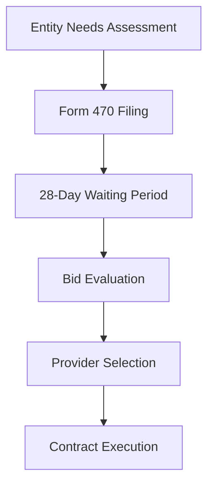
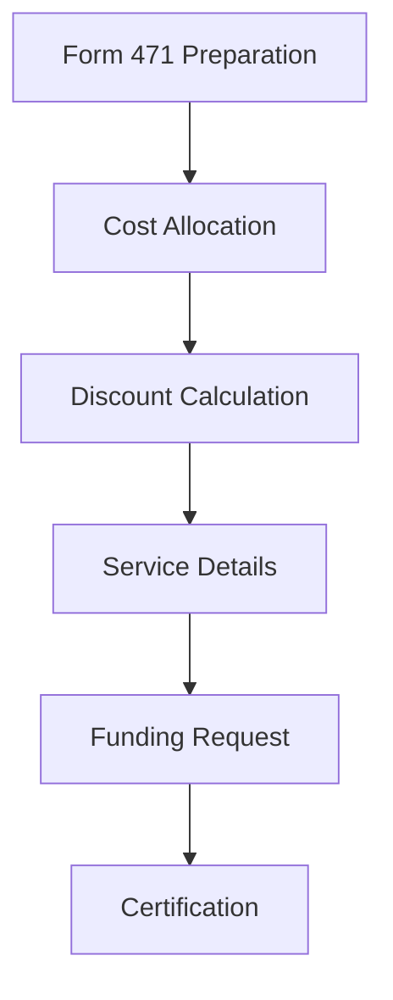
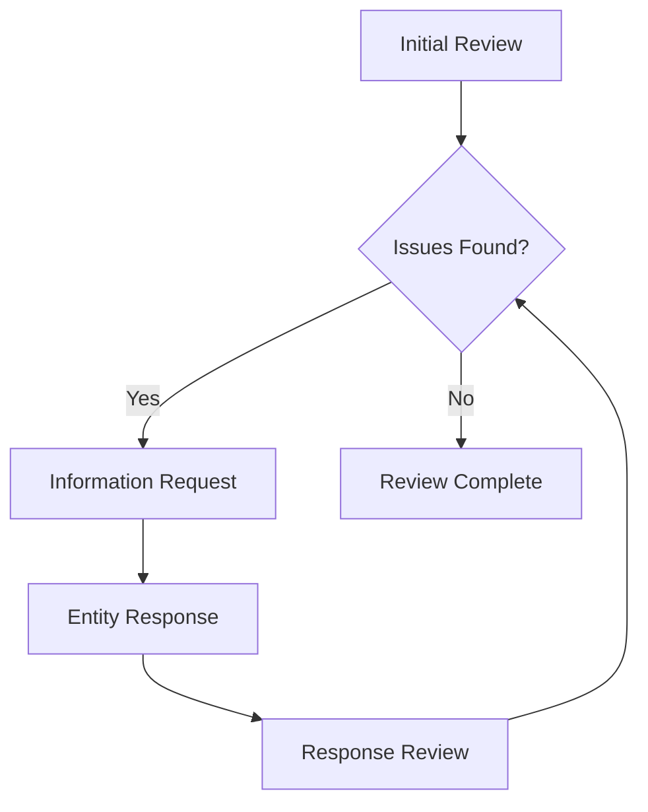
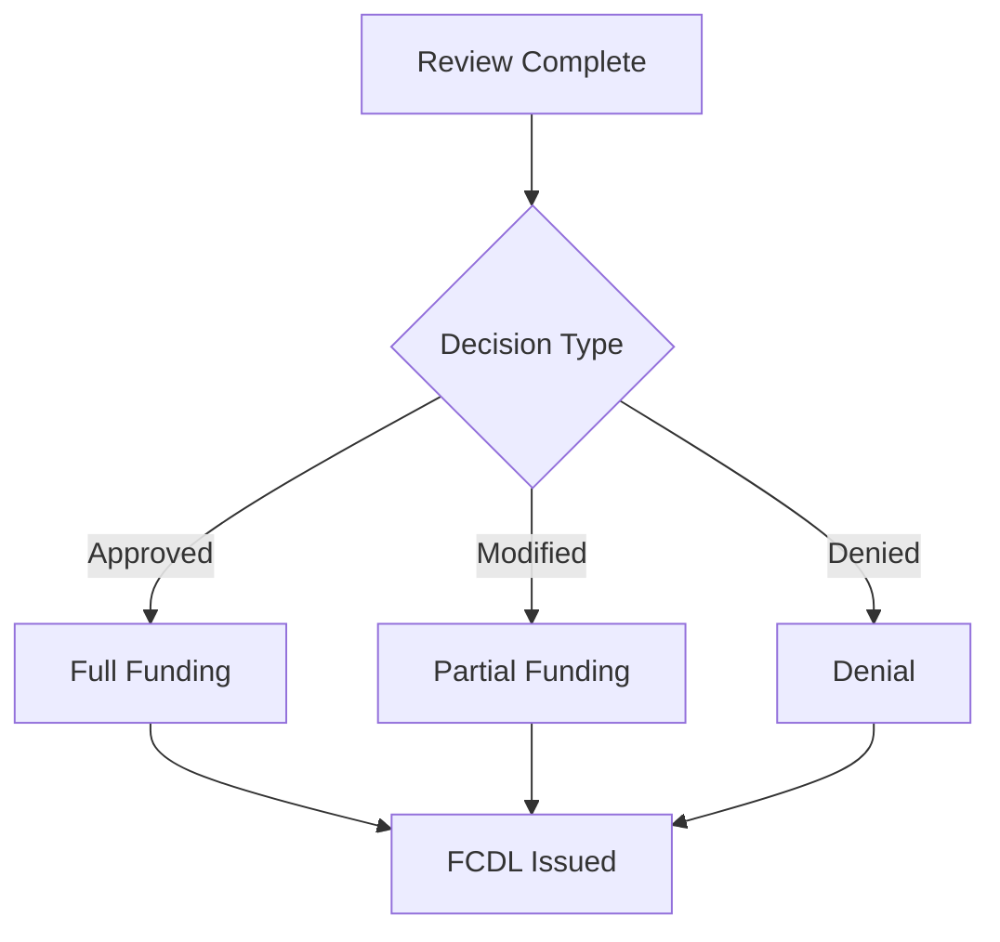
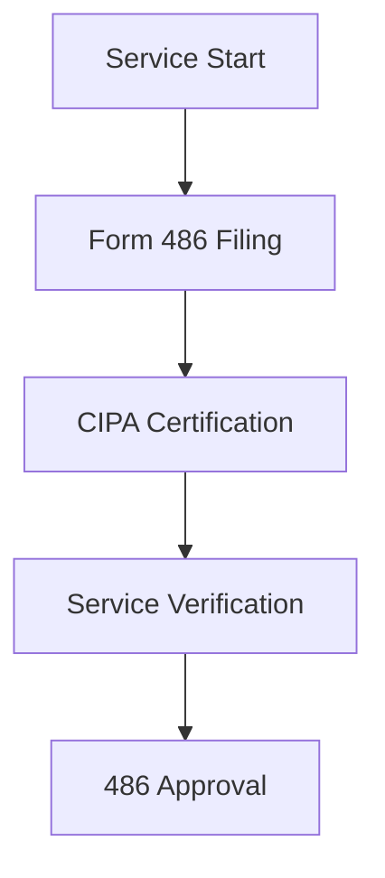
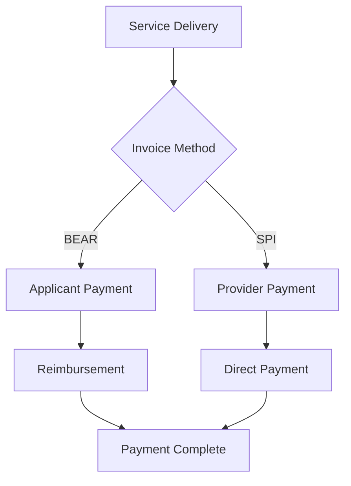

# E-Rate Program Process Flow Analysis

## I. Application Process Flow

### A. Form 470 Filing Phase


#### 1. Timeline Requirements
| Stage | Duration | Requirements | Validation |
|-------|----------|--------------|------------|
| Needs Assessment | 30-60 days | Technology plan | Documentation |
| Form 470 Filing | 1-7 days | Service details | Completeness |
| Waiting Period | 28 days minimum | Competitive bids | Fair competition |
| Bid Evaluation | 14-30 days | Selection criteria | Price matrix |
| Contract | 7-14 days | Terms finalization | Legal review |

#### 2. Data Points Generated
```sql
-- Form 470 metrics
SELECT 
    funding_year,
    COUNT(DISTINCT application_number) as form_470_count,
    COUNT(DISTINCT billed_entity_number) as entity_count,
    COUNT(DISTINCT service_type) as service_types
FROM staging.form_470
GROUP BY funding_year
ORDER BY funding_year DESC;
```

### B. Form 471 Application Phase


#### 1. Required Elements
| Component | Data Source | Validation | Example |
|-----------|-------------|------------|---------|
| Entity Info | EPC Portal | BEN check | "123456" |
| Services | Form 470 | Category match | "Data Trans" |
| Costs | Contracts | Market rates | "$100,000" |
| Discounts | NSLP data | Rate check | "85%" |

#### 2. Validation Points
```sql
-- Application validation
SELECT 
    funding_year,
    COUNT(*) as total_applications,
    COUNT(*) FILTER (WHERE status = 'Certified') as certified,
    COUNT(*) FILTER (WHERE status = 'In Review') as in_review
FROM staging.form_471_basic
GROUP BY funding_year
ORDER BY funding_year DESC;
```

## II. Review Process Flow

### A. Program Integrity Assurance (PIA)


#### 1. Review Metrics
| Review Type | Timeline | Success Rate | Common Issues |
|------------|----------|--------------|---------------|
| Initial | 30 days | 75% | Documentation |
| Detailed | 60 days | 60% | Cost allocation |
| Special | 90 days | 40% | Competitive bidding |

#### 2. Issue Resolution
```sql
-- PIA resolution tracking
SELECT 
    funding_year,
    COUNT(*) as total_requests,
    COUNT(*) FILTER (WHERE status = 'Funded') as approved,
    COUNT(*) FILTER (WHERE status = 'Denied') as denied
FROM staging.frn_status
GROUP BY funding_year
ORDER BY funding_year DESC;
```

### B. Funding Commitment Decision


#### 1. Decision Statistics
```sql
-- Funding decisions
SELECT 
    funding_year,
    funding_request_status,
    COUNT(*) as request_count,
    ROUND(AVG(frn_total_pre_discount_costs::numeric), 2) as avg_amount
FROM staging.frn_status
WHERE funding_year = '2024'
GROUP BY funding_year, funding_request_status
ORDER BY request_count DESC;
```

## III. Post-Commitment Process

### A. Form 486 Filing


#### 1. Service Activation
| Requirement | Validation | Timeline | Documentation |
|------------|------------|----------|---------------|
| Start Date | Contract | 120 days | Service records |
| CIPA | Certification | Annual | Compliance doc |
| Service Match | FRN details | Immediate | Installation |

#### 2. Tracking Metrics
```sql
-- Service activation
SELECT 
    funding_year,
    COUNT(*) as total_frns,
    COUNT(*) FILTER (WHERE service_start_date IS NOT NULL) as started,
    COUNT(*) FILTER (WHERE invoicing_ready = 'Y') as ready
FROM staging.frn_status
GROUP BY funding_year
ORDER BY funding_year DESC;
```

### B. Invoicing Process


#### 1. Payment Methods
| Method | Timeline | Requirements | Validation |
|--------|----------|--------------|------------|
| BEAR | 120 days | Proof of payment | Receipts |
| SPI | 120 days | Service delivery | Documentation |

#### 2. Payment Tracking
```sql
-- Invoice tracking
SELECT 
    funding_year,
    COUNT(*) as total_requests,
    SUM(total_disbursement_amount::numeric) as total_paid,
    COUNT(*) FILTER (WHERE invoicing_mode = 'BEAR') as bear_count
FROM staging.frn_status
GROUP BY funding_year
ORDER BY funding_year DESC;
```

## IV. Stakeholder Interactions

### A. Entity Responsibilities
1. Application Filing
   - Needs assessment
   - Form submission
   - Documentation
   - Response to inquiries

2. Compliance
   - CIPA requirements
   - Record keeping
   - Service verification
   - Payment processing

### B. Service Provider Role
1. Service Delivery
   - Contract fulfillment
   - Installation
   - Ongoing support
   - Billing accuracy

2. Program Compliance
   - SPIN requirements
   - Rate documentation
   - Service certification
   - Invoice processing

### C. Consultant Activities
1. Application Support
   - Form preparation
   - Documentation
   - PIA response
   - Appeal assistance

2. Compliance Management
   - Process oversight
   - Documentation review
   - Deadline tracking
   - Issue resolution

## V. Normal Operating Parameters

### A. Timeline Metrics
| Process | Standard | Warning | Critical |
|---------|----------|---------|----------|
| 470 to 471 | 28-60 days | < 28 days | < 20 days |
| PIA Review | 30-60 days | > 90 days | > 120 days |
| 486 Filing | < 120 days | > 120 days | > 150 days |
| Invoicing | < 120 days | > 120 days | > 150 days |

### B. Success Metrics
```sql
-- Program success metrics
SELECT 
    funding_year,
    COUNT(*) as total_requests,
    COUNT(*) FILTER (WHERE status = 'Funded') as funded_count,
    ROUND(AVG(CASE WHEN status = 'Funded' 
        THEN frn_total_pre_discount_costs::numeric END), 2) as avg_funded_amount
FROM staging.frn_status
GROUP BY funding_year
ORDER BY funding_year DESC;
```

This process flow document provides a comprehensive overview of the E-Rate program's operational workflow, including key stakeholders, decision points, and normal operating parameters.

