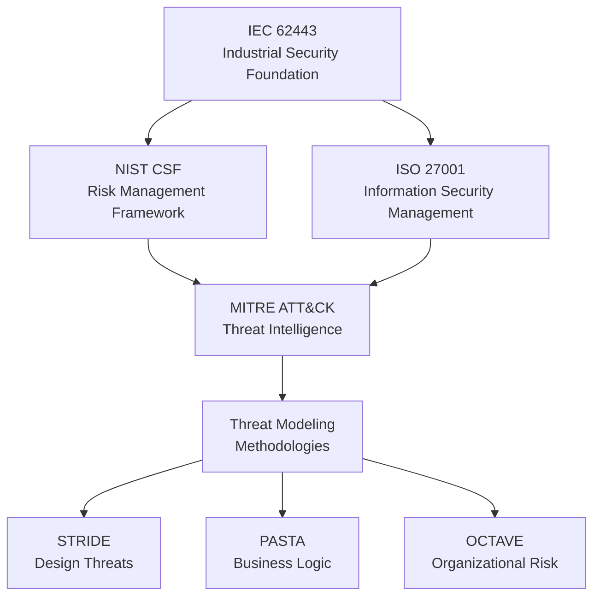

# Cybersecurity Frameworks Integration

**Comprehensive Mapping and Integration Guide for Enterprise Security Programs**

**Version:** 1.0 - October 2025
**Frameworks Covered:** IEC 62443, NIST CSF, ISO 27001, MITRE ATT&CK, Threat Modeling Methodologies
**Purpose:** Unified approach to cybersecurity framework implementation and integration
**Scope:** Framework relationships, mapping tables, and integration strategies

## 📋 Executive Summary

This document provides a comprehensive integration guide for major cybersecurity frameworks, focusing on how they complement and reinforce each other in enterprise security programs. It includes detailed mapping between IEC 62443 (industrial control systems), NIST Cybersecurity Framework, ISO 27001, MITRE ATT&CK, and various threat modeling methodologies.

**Key Integration Areas:**
- Framework alignment and gap analysis
- Cross-framework control mapping
- Threat modeling integration strategies
- Compliance automation approaches
- Risk management unification

## 🏗️ Framework Overview and Relationships

### Primary Frameworks Matrix

| Framework | Focus Area | Scope | Integration Points |
|-----------|------------|-------|-------------------|
| **IEC 62443** | Industrial Control Systems | OT/ICS Security | Foundation for industrial security |
| **NIST CSF** | Enterprise Cybersecurity | IT/OT Convergence | Risk management framework |
| **ISO 27001** | Information Security Management | Governance & Compliance | Management system standard |
| **MITRE ATT&CK** | Threat Intelligence | Adversary Behavior | Threat detection & response |
| **STRIDE** | Threat Modeling | Application Security | Design-time threat analysis |
| **PASTA** | Threat Modeling | Risk-Based Analysis | Business logic threats |
| **OCTAVE** | Threat Modeling | Organizational Risk | Enterprise threat modeling |

### Framework Dependencies and Flow



## 🔗 IEC 62443 Integration Points

### IEC 62443 to NIST CSF Mapping

IEC 62443 provides the technical foundation for industrial systems, while NIST CSF offers the risk management framework. The integration focuses on:

**Security Level to NIST Function Mapping:**

| IEC 62443 SL | NIST CSF Functions | Primary Controls |
|--------------|-------------------|------------------|
| **SL 1** | Identify, Protect | Basic access controls, patch management |
| **SL 2** | Identify, Protect, Detect | Authentication, monitoring, incident response |
| **SL 3** | All Functions | Comprehensive security controls, continuous monitoring |
| **SL 4** | All Functions + Advanced | Zero-trust architecture, advanced threat detection |

**Detailed Control Mapping:**

```javascript
// IEC 62443 to NIST CSF Control Mapping
const frameworkMapping = {
  // Identification & Authentication Control (IAC)
  'IEC-IAC-1': {
    nistControls: ['AC-2', 'AC-3', 'IA-2'],
    description: 'User identification and authentication'
  },
  'IEC-IAC-2': {
    nistControls: ['AC-2', 'AC-5', 'AC-6'],
    description: 'Device identification and authentication'
  },

  // Use Control (UC)
  'IEC-UC-1': {
    nistControls: ['AC-3', 'AC-5', 'AC-6'],
    description: 'Authorization enforcement'
  },

  // System Integrity (SI)
  'IEC-SI-1': {
    nistControls: ['SI-2', 'SI-3', 'SI-7'],
    description: 'Malicious code protection'
  },
  'IEC-SI-2': {
    nistControls: ['SI-2', 'SI-4', 'SI-5'],
    description: 'Malicious code detection'
  },

  // Data Confidentiality (DC)
  'IEC-DC-1': {
    nistControls: ['SC-8', 'SC-13', 'SC-28'],
    description: 'Information confidentiality'
  },

  // Restricted Data Flow (RDF)
  'IEC-RDF-1': {
    nistControls: ['AC-4', 'SC-7', 'SC-15'],
    description: 'Network segmentation'
  },

  // Timely Response to Events (TRE)
  'IEC-TRE-1': {
    nistControls: ['IR-4', 'IR-5', 'SI-4'],
    description: 'Incident response'
  },

  // Resource Availability (RA)
  'IEC-RA-1': {
    nistControls: ['RE-2', 'RE-3', 'RC-2'],
    description: 'Backup and recovery'
  }
};
```

### IEC 62443 to ISO 27001 Alignment

IEC 62443 technical requirements map to ISO 27001 management controls:

**Annex A Controls Mapping:**

| IEC 62443 FR | ISO 27001 Annex A | Control Category |
|--------------|-------------------|------------------|
| **IAC** | A.9 (Access Control) | Access management |
| **UC** | A.9 (Access Control) | User access management |
| **SI** | A.12 (Operations Security) | Protection against malware |
| **DC** | A.13 (Communications Security) | Information transfer |
| **RDF** | A.13 (Communications Security) | Network security |
| **TRE** | A.16 (Information Security Incident Management) | Incident response |
| **RA** | A.17 (Information Security Aspects of BCP) | Business continuity |

## 🎯 Threat Modeling Integration

### Threat Modeling Framework Selection Matrix

| Scenario | Recommended Methodology | Rationale |
|----------|------------------------|-----------|
| **Web Applications** | STRIDE + DREAD | Comprehensive threat categories + risk assessment |
| **API Security** | PASTA + LINDDUN | Business logic focus + privacy threats |
| **Enterprise Systems** | OCTAVE + Attack Trees | Organizational risk + detailed attack modeling |
| **Industrial Control Systems** | IEC 62443 + STRIDE | Domain-specific + general threats |
| **Cloud Infrastructure** | VAST + CVSS | Agile development + quantitative scoring |

### Integrated Threat Modeling Workflow

```javascript
// Integrated Threat Modeling Workflow
class IntegratedThreatModeler {
  constructor() {
    this.frameworks = {
      stride: new STRIDEModeler(),
      pasta: new PASTAModeler(),
      octave: new OCTAVEModeler(),
      iec62443: new IEC62443Modeler(),
      attackTrees: new AttackTreeModeler()
    };
  }

  async executeIntegratedAnalysis(systemContext) {
    const results = {};

    // Phase 1: System Decomposition (IEC 62443 + OCTAVE)
    results.systemAssets = await this.frameworks.iec62443.identifyAssets(systemContext);
    results.businessObjectives = await this.frameworks.octave.analyzeBusinessImpact(systemContext);

    // Phase 2: Threat Identification (STRIDE + PASTA)
    results.strideThreats = await this.frameworks.stride.identifyThreats(results.systemAssets);
    results.pastaThreats = await this.frameworks.pasta.analyzeBusinessLogic(results.businessObjectives);

    // Phase 3: Attack Modeling (Attack Trees)
    results.attackScenarios = await this.frameworks.attackTrees.modelAttacks(
      results.strideThreats.concat(results.pastaThreats)
    );

    // Phase 4: Risk Assessment (DREAD + CVSS)
    results.riskAssessment = await this.assessIntegratedRisk(results.attackScenarios);

    return results;
  }

  async assessIntegratedRisk(attackScenarios) {
    const riskScores = [];

    for (const scenario of attackScenarios) {
      const dreadScore = await this.calculateDREADScore(scenario);
      const cvssScore = await this.calculateCVSSScore(scenario);

      riskScores.push({
        scenario: scenario.name,
        dreadScore,
        cvssScore,
        integratedRisk: this.combineRiskScores(dreadScore, cvssScore)
      });
    }

    return riskScores;
  }
}
```

## 🔍 MITRE ATT&CK Integration

### ATT&CK to IEC 62443 Mapping

MITRE ATT&CK provides the threat intelligence layer that informs IEC 62443 implementations:

**Tactic to Foundational Requirement Mapping:**

| MITRE Tactic | IEC 62443 FR | Security Level Focus |
|--------------|--------------|---------------------|
| **Initial Access** | IAC, RDF | SL 2+ (authentication, network segmentation) |
| **Execution** | UC, SI | SL 3+ (access controls, integrity protection) |
| **Persistence** | SI, TRE | SL 3+ (integrity monitoring, incident response) |
| **Privilege Escalation** | UC, IAC | SL 2+ (authorization, authentication) |
| **Defense Evasion** | SI, TRE | SL 3+ (integrity protection, detection) |
| **Credential Access** | IAC, DC | SL 2+ (authentication, confidentiality) |
| **Discovery** | TRE, RDF | SL 2+ (monitoring, network controls) |
| **Lateral Movement** | RDF, UC | SL 3+ (network segmentation, access controls) |
| **Collection** | DC, TRE | SL 2+ (data protection, monitoring) |
| **Command and Control** | RDF, TRE | SL 3+ (network controls, detection) |
| **Exfiltration** | DC, TRE | SL 2+ (data protection, monitoring) |
| **Impact** | RA, TRE | SL 2+ (availability, incident response) |

### ATT&CK Integration Workflow

```javascript
// MITRE ATT&CK Integration with IEC 62443
class ATTCKIntegrator {
  constructor() {
    this.attck = new ATTCKFramework();
    this.iec62443 = new IEC62443Framework();
  }

  async mapThreatsToControls(threatActors, industry) {
    const mappings = {};

    for (const actor of threatActors) {
      const techniques = await this.attck.getActorTechniques(actor);
      const iecControls = await this.mapTechniquesToIEC(techniques);

      mappings[actor] = {
        techniques,
        iecControls,
        securityLevel: this.determineRequiredSL(iecControls),
        mitigationPriority: this.calculatePriority(techniques, industry)
      };
    }

    return mappings;
  }

  async mapTechniquesToIEC(techniques) {
    const controlMappings = {};

    for (const technique of techniques) {
      const iecRequirements = await this.findIECRequirements(technique);

      for (const req of iecRequirements) {
        if (!controlMappings[req.fr]) {
          controlMappings[req.fr] = [];
        }
        controlMappings[req.fr].push({
          technique: technique.id,
          requirement: req.id,
          rationale: req.rationale
        });
      }
    }

    return controlMappings;
  }
}
```

## 📊 Risk Management Unification

### Unified Risk Scoring Framework

Combining quantitative approaches from different frameworks:

```javascript
// Unified Risk Scoring Framework
class UnifiedRiskScorer {
  constructor() {
    this.scoringMethods = {
      cvss: new CVSSScorer(),
      dread: new DREADScorer(),
      octave: new OCTAVEScorer(),
      iec62443: new IEC62443Scorer()
    };
  }

  async calculateUnifiedRiskScore(threat, vulnerability, impact) {
    // Calculate individual framework scores
    const scores = {
      cvss: await this.scoringMethods.cvss.calculate(threat, vulnerability),
      dread: await this.scoringMethods.dread.calculate(threat, vulnerability, impact),
      octave: await this.scoringMethods.octave.calculate(threat, impact),
      iec62443: await this.scoringMethods.iec62443.calculate(threat, vulnerability)
    };

    // Apply framework weights based on context
    const weights = this.determineWeights(threat.type, vulnerability.severity);

    // Calculate weighted unified score
    const unifiedScore = this.computeWeightedScore(scores, weights);

    return {
      individualScores: scores,
      weights,
      unifiedScore,
      riskLevel: this.mapToRiskLevel(unifiedScore),
      recommendations: this.generateRecommendations(scores, unifiedScore)
    };
  }

  determineWeights(threatType, severity) {
    // Weight determination logic based on threat characteristics
    const baseWeights = {
      cvss: 0.3,      // Technical vulnerability scoring
      dread: 0.25,    // Business impact assessment
      octave: 0.25,   // Organizational risk
      iec62443: 0.2   // Industrial control systems context
    };

    // Adjust weights based on threat type
    if (threatType === 'industrial') {
      baseWeights.iec62443 += 0.1;
      baseWeights.cvss -= 0.05;
      baseWeights.dread -= 0.05;
    }

    return baseWeights;
  }
}
```

## 🔄 Compliance Automation Integration

### Multi-Framework Compliance Dashboard

```javascript
// Multi-Framework Compliance Automation
class ComplianceIntegrator {
  constructor() {
    this.frameworks = {
      nist: new NISTCSF(),
      iso27001: new ISO27001(),
      iec62443: new IEC62443(),
      pci: new PCIDSS(),
      hipaa: new HIPAA()
    };
  }

  async generateUnifiedComplianceReport(assessmentResults) {
    const unifiedReport = {
      overallCompliance: 0,
      frameworkScores: {},
      gapAnalysis: {},
      remediationRoadmap: []
    };

    // Calculate compliance scores for each framework
    for (const [framework, assessor] of Object.entries(this.frameworks)) {
      const score = await assessor.calculateCompliance(assessmentResults);
      unifiedReport.frameworkScores[framework] = score;

      // Identify gaps
      unifiedReport.gapAnalysis[framework] = await assessor.identifyGaps(score);
    }

    // Calculate overall compliance
    unifiedReport.overallCompliance = this.calculateOverallCompliance(
      unifiedReport.frameworkScores
    );

    // Generate remediation roadmap
    unifiedReport.remediationRoadmap = await this.generateRemediationRoadmap(
      unifiedReport.gapAnalysis
    );

    return unifiedReport;
  }

  calculateOverallCompliance(frameworkScores) {
    // Weighted average based on organizational priorities
    const weights = {
      nist: 0.3,
      iso27001: 0.25,
      iec62443: 0.2,
      pci: 0.15,
      hipaa: 0.1
    };

    let totalScore = 0;
    let totalWeight = 0;

    for (const [framework, score] of Object.entries(frameworkScores)) {
      totalScore += score * weights[framework];
      totalWeight += weights[framework];
    }

    return totalScore / totalWeight;
  }
}
```

## 📈 Implementation Roadmap

### Phase 1: Foundation Establishment (Months 1-3)
- [ ] Framework selection and prioritization
- [ ] Gap analysis between current state and frameworks
- [ ] Initial control mapping establishment
- [ ] Governance structure definition

### Phase 2: Integration Development (Months 4-8)
- [ ] Unified risk scoring implementation
- [ ] Cross-framework control mapping
- [ ] Threat modeling integration workflows
- [ ] Compliance automation development

### Phase 3: Operational Integration (Months 9-12)
- [ ] Multi-framework compliance dashboards
- [ ] Automated assessment workflows
- [ ] Continuous monitoring integration
- [ ] Training and awareness programs

### Phase 4: Optimization and Scaling (Months 13+)
- [ ] Advanced analytics and reporting
- [ ] Machine learning integration
- [ ] Predictive risk assessment
- [ ] Framework evolution management

## 📚 References and Resources

### Primary Standards
- IEC 62443 Series: Industrial Automation and Control Systems Security
- NIST Cybersecurity Framework (CSF) v2.0
- ISO/IEC 27001: Information Security Management Systems
- MITRE ATT&CK Framework v14

### Integration Guides
- NIST SP 800-82: Guide to ICS Security
- ISA/IEC 62443 Standards Companion
- ISO/IEC 27001 Implementation Guide

### Tools and Platforms
- MITRE ATT&CK Navigator
- NIST Cybersecurity Framework Tools
- IEC 62443 Assessment Tools

---

**Document Control:**
- **Author:** Cybersecurity Frameworks Integration Team
- **Review Date:** October 2025
- **Next Review:** October 2026
- **Approval:** Security Governance Board

**Cross-References:**
- [[IEC 62443 Part 3-3]] - System security requirements
- [[Advanced Threat Modeling Methodologies]] - Specialized threat modeling techniques
- [[MITRE ATT&CK Framework]] - Adversary behavior modeling
- [[Compliance]] - Regulatory compliance frameworks