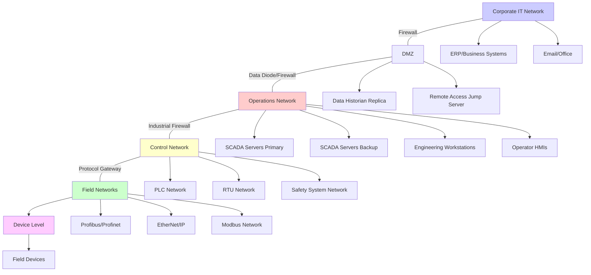

# Critical Infrastructure Sector Research - Hourly Cycle

## Session Initialization
Current timestamp: [INSERT CURRENT UNIX TIMESTAMP]
Hour ID: [TIMESTAMP / 3600]

## Sector/Subsector Rotation

### Primary Sector (Hour ID % 13)
0. **Energy Sector**: Power generation, transmission, distribution systems
1. **Chemical Sector**: Refineries, processing plants, petrochemical facilities
2. **Transportation - Rail**: Signaling systems, train control, station operations
3. **Transportation - Aviation**: Air traffic control, airport operations, navigation
4. **Transportation - Maritime**: Port operations, vessel traffic, navigation systems
5. **Manufacturing - Automotive**: Assembly lines, robotics, paint shops, quality control
6. **Manufacturing - Semiconductor**: Fab operations, clean rooms, process control
7. **Manufacturing - Food Processing**: Processing lines, packaging, cold chain, quality
8. **Healthcare**: Hospital facilities, medical devices, building systems, patient monitoring
9. **IT/Telecom**: Data centers, carrier networks, 5G infrastructure, NOCs
10. **Financial Services**: Trading floors, data centers, ATM networks, payment processing
11. **Water/Wastewater**: Treatment plants, distribution systems, pump stations
12. **Dams**: Hydroelectric generation, spillway control, structural monitoring

### Subsector Detail (Hour ID % 7)
0. **Generation/Production Facilities**: Core production operations and equipment
1. **Distribution/Delivery Networks**: Distribution infrastructure and control
2. **Control Systems Architecture**: SCADA, DCS, PLC systems and networks
3. **Network Infrastructure**: Industrial networks, protocols, segmentation
4. **Safety and Security Systems**: SIS, physical security, cybersecurity
5. **Support Systems**: HVAC, power, fire protection, communications
6. **Equipment and Vendors**: Specific manufacturers, models, supply chain

### Facility Type Rotation (Hour ID % 5)
0. Small-scale facility (local, distributed)
1. Medium-scale facility (regional)
2. Large-scale facility (national/enterprise)
3. Specialized/Advanced facility (cutting-edge technology)
4. Legacy facility (older technology, brownfield)

## Research Focus for This Hour

**Sector**: [SECTOR_NAME from rotation]
**Subsector**: [SUBSECTOR from rotation]
**Facility Scale**: [FACILITY_TYPE from rotation]
**Report Types**: Facility Architecture + Control System Architecture OR Network Pattern + Facility Type

## Research Execution

### Phase 1: Technical Research (25 minutes)

#### Standards and Regulations Research
Query public sources for:
````bash
curl -L "https://www.nist.gov/publications/search?keywords=[SECTOR]+control+systems"
curl -L "https://csrc.nist.gov/publications/search?topics=[SECTOR]+infrastructure"
curl -L "https://www.isa.org/standards-and-publications/isa-standards/search?sector=[SECTOR]"
````

Research focus:
- Industry-specific standards (IEC, ISA, NIST, NERC, FDA, etc.)
- Regulatory requirements
- Best practice guidelines
- Security frameworks

#### Vendor and Equipment Research
Query for major vendors:
````bash
curl -L "https://www.google.com/search?q=[SECTOR]+[SUBSECTOR]+equipment+vendors+specifications"
curl -L "https://www.google.com/search?q=[SECTOR]+SCADA+system+vendors"
curl -L "https://www.google.com/search?q=[SECTOR]+PLC+manufacturers+models"
````

Document:
- 5-7 major equipment vendors with specific product lines
- 3-5 control system platform vendors
- Specific model numbers and specifications
- Communication protocols supported
- Typical pricing ranges (order of magnitude)

#### Architecture Patterns Research
Query for design patterns:
````bash
curl -L "https://www.google.com/search?q=[SECTOR]+facility+design+architecture"
curl -L "https://www.google.com/search?q=[SECTOR]+network+architecture+diagram"
curl -L "https://www.google.com/search?q=[SECTOR]+control+system+hierarchy"
````

Research:
- Typical facility layouts and sizes
- Control system hierarchies (3-5 layers)
- Network topologies and segmentation
- Redundancy and failover patterns
- Integration approaches

### Phase 2: Comprehensive Report Generation (30 minutes)

Generate **TWO** detailed architectural reports:

---

## REPORT 1: Facility Architecture Report

**Filename**: `kb/sectors/[SECTOR]/architectures/facility-[SPECIFIC_TYPE]-[YYYYMMDD-HH].md`

**Template** (Minimum 2000 words):
````markdown
---
title: [SECTOR] [Specific Facility Type] Architecture
date: [YYYY-MM-DD HH:MM:SS]
category: sectors
subcategory: [sector-slug]
sector: [sector-name]
tags: [sector, facility-type, architecture, design, infrastructure, subsector]
sources: [list of URLs and documents consulted]
confidence: high
---

## Summary
[3-4 comprehensive paragraphs describing:
- What this facility type is and its purpose in the sector
- Scale and operational characteristics
- Key technical challenges and requirements
- Regulatory and safety considerations]

## Key Information
- **Facility Type**: [Specific classification]
- **Typical Capacity**: [Production/service metrics with units]
- **Facility Size**: [Physical dimensions, area in sq ft/m]
- **Capital Cost**: [Order of magnitude for construction]
- **Staffing**: [Operational staff counts by shift]
- **Operational Model**: [24/7/365, business hours, seasonal, etc.]
- **Regulatory Framework**: [Key regulations: CFR parts, state codes, industry standards]
- **Typical Lifespan**: [Design life in years]

## Facility Overview

### Purpose and Function
[Detailed 3-4 paragraph explanation of:
- Primary mission and objectives
- Role within the larger sector ecosystem
- Products/services delivered
- Critical dependencies and interdependencies]

### Typical Scale and Variants
**Small-Scale Facilities** (e.g., [capacity range])
- Physical footprint: [dimensions]
- Production capacity: [metrics]
- Staffing: [counts]
- Automation level: [percentage or description]
- Typical locations: [geographic/market contexts]

**Medium-Scale Facilities** (e.g., [capacity range])
- [Similar breakdown]

**Large-Scale Facilities** (e.g., [capacity range])
- [Similar breakdown]

**Technology Variants:**
- Legacy designs (pre-2005): [characteristics]
- Modern designs (2005-2020): [characteristics]
- Contemporary designs (2020+): [characteristics]
- Future trends: [emerging technologies]

## Physical Architecture

### Site Layout
[Detailed description with spatial relationships]

**Overall Site Organization:**
- Total site area: [acreage/hectares]
- Building footprints: [percentages or areas]
- Outdoor process areas: [description]
- Perimeter and buffer zones: [dimensions]
- Access roads and logistics: [layout]

**Major Zones:**
1. **[Zone 1 Name]** (e.g., Production Zone)
   - Purpose: [function]
   - Area: [size]
   - Key structures: [buildings/equipment]
   - Access restrictions: [security level]

2. **[Zone 2 Name]** (e.g., Utilities Zone)
   - [Similar detail for 4-6 major zones]

**Security Perimeters:**
- Outer perimeter: [fencing, gates, surveillance]
- Inner perimeter: [additional controls]
- Critical asset protection: [special measures]

### Building/Structure Design

**Primary Structures:**
[For each major building type - 3-5 buildings:]

**[Building Type 1]** (e.g., Main Processing Building)
- **Dimensions**: [length x width x height]
- **Construction**: [materials - steel frame, concrete, etc.]
- **Foundation**: [type required for equipment loads]
- **Environmental Systems**: [HVAC requirements, temp/humidity specs]
- **Fire Rating**: [fire resistance requirements]
- **Seismic Design**: [seismic zone considerations]
- **Special Features**: [clean rooms, reinforced areas, blast resistance]

[Repeat for each major structure]

### Major System Components

[Detail 5-7 major systems in facility:]

#### System 1: [Name] (e.g., Primary Production Equipment)
**Function**: [What this system does]

**Components**:
- [Component 1]: [Description, capacity, specifications]
- [Component 2]: [Description, capacity, specifications]
- [Component 3-5]: [Continue...]

**Vendors and Models**:
- **Primary Vendor**: [Company Name]
  - Model/Series: [Specific product line]
  - Capacity: [Specifications]
  - Typical Cost: [$X-Y range]
  - Market Share: [Approximate percentage]
  - Key Features: [What makes it preferred]
  
- **Alternative Vendor 1**: [Company Name]
  - [Similar detail]
  
- **Alternative Vendor 2**: [Company Name]
  - [Similar detail]

**Technical Specifications**:
- Operating parameters: [pressure, temperature, flow rates, etc.]
- Communication protocols: [Modbus, Profinet, EtherNet/IP, etc.]
- Control interfaces: [4-20mA, digital I/O, fieldbuses]
- Power requirements: [voltage, phase, kW]
- Environmental ratings: [IP rating, hazardous area classification]

**Interconnections**:
- Interfaces with: [List of connected systems]
- Data exchange: [Types of data shared]
- Physical connections: [Piping, wiring, networks]
- Control relationships: [Master/slave, peer-to-peer]

#### System 2: [Name] (e.g., Material Handling System)
[Repeat full structure for each major system]

#### Systems 3-7: [Continue with same detail level]

## Operational Systems

### Control and Monitoring

**Control Room Layout**:
- Physical location: [Central vs distributed]
- Size and configuration: [dimensions, workstation count]
- Environmental controls: [HVAC, lighting, acoustics]
- Ergonomic design: [Operator comfort considerations]
- Redundancy: [Backup control room provisions]

**Monitoring Systems**:
- HMI workstations: [Count, specifications, vendors]
- Display walls: [Video wall configuration if applicable]
- Alarm management: [Prioritization scheme, escalation]
- Historical trending: [Data retention, visualization tools]
- Remote monitoring: [Capabilities and security]

**Operator Interfaces**:
- Primary SCADA platform: [Vendor, version, capabilities]
- HMI design philosophy: [Screen layout standards, color coding]
- Alarm handling: [Average alarm rates, management approach]
- Reporting systems: [Production reports, compliance reports]
- Mobile access: [Tablets, smartphones for rounds]

**Data Collection and Logging**:
- Data historian: [Platform, storage capacity, retention]
- Sample rates: [Typical data collection frequencies]
- Data types: [Process, alarm, event, audit]
- Database systems: [SQL, time-series, document stores]
- Analytics platforms: [If advanced analytics deployed]

### Automation Systems

**Level of Automation**:
- Fully automated processes: [Percentage or list]
- Semi-automated processes: [Percentage or list]
- Manual processes: [What still requires human intervention]
- Automation philosophy: [Islands of automation vs integrated]

**Automated Sequences**:
- Startup sequences: [Major automated procedures]
- Shutdown sequences: [Normal and emergency]
- Product changeover: [Automated recipe management]
- Cleaning-in-place: [CIP automation if applicable]
- Quality checks: [Automated inspection/testing]

**Interlock Logic**:
- Safety interlocks: [Critical safety chains]
- Process interlocks: [Permissive logic for operations]
- Equipment protection: [Overload, overtemp, etc.]
- Alarm inhibits: [Nuisance alarm management]
- Override capabilities: [When and how operators can override]

**Manual Override Capabilities**:
- Emergency control stations: [Local control panels]
- Hand/Off/Auto switches: [Field device control]
- Emergency stops: [E-stop deployment and coverage]
- Manual valves: [Bypass and isolation capabilities]

**Failsafe Mechanisms**:
- Fail-safe valve positions: [Air-to-open vs air-to-close]
- Loss of control action: [What happens on PLC failure]
- Loss of power action: [System behavior on power loss]
- Watchdog timers: [System health monitoring]

### Support Systems

#### Electrical Power System
**Primary Power Supply**:
- Service voltage: [kV, phase, frequency]
- Service capacity: [MVA or kW]
- Utility provider: [Typical arrangements]
- Redundant feeds: [If dual utility feeds available]
- Power quality: [Voltage regulation requirements]

**Backup Power Systems**:
- UPS systems: [Capacity, runtime, topology]
  - Critical loads: [What UPS protects]
  - Battery type: [VRLA, Li-ion, etc.]
  - Maintenance: [Battery replacement cycles]
  
- Emergency generators: [Capacity, fuel type, quantity]
  - Generator capacity: [kW rating]
  - Fuel storage: [Hours/days of runtime]
  - Transfer switches: [Automatic vs manual]
  - Generator vendors: [Typical suppliers: Caterpillar, Cummins, Kohler]

**Power Distribution**:
- Main distribution voltage: [480V, 4160V, etc.]
- Sub-distribution: [208V, 120V loads]
- Motor control centers: [MCC quantity and size]
- Variable frequency drives: [VFD deployment]
- Power factor correction: [Capacitor banks if used]

**Electrical Protection**:
- Overcurrent protection: [Breaker/fuse coordination]
- Ground fault protection: [GFCI, ground fault relays]
- Arc flash mitigation: [Incident energy levels, PPE requirements]
- Lightning protection: [Surge protection devices]

#### HVAC and Environmental Control
**Climate Control Requirements**:
- Temperature ranges: [Operational and storage]
- Humidity control: [If critical - percentage ranges]
- Air changes per hour: [ACH requirements]
- Filtration levels: [MERV ratings, HEPA if needed]
- Differential pressures: [For clean rooms or contamination control]

**HVAC Systems**:
- Cooling capacity: [Tons or kW]
- Heating capacity: [BTU or kW]
- HVAC vendors: [Typical suppliers]
- Control integration: [BMS/BAS platforms]
- Energy recovery: [Heat recovery, economizers]

**Air Quality Monitoring**:
- Monitored parameters: [Temp, humidity, CO2, VOCs, particulates]
- Sensor deployment: [Quantity and locations]
- Alarm thresholds: [When action required]
- Environmental compliance: [Air permits, reporting]

**Specialized Environmental Systems** (if applicable):
- Clean room systems: [ISO class, flow patterns]
- Fume extraction: [Capacity, treatment]
- Dust collection: [Baghouse, cyclone systems]
- Humidity control: [Humidification, dehumidification]

#### Fire Protection System
**Detection Systems**:
- Detector types: [Smoke, heat, flame, gas, beam]
- Coverage areas: [Detector spacing per NFPA]
- Monitoring: [Fire alarm control panel, integration to BMS]
- Addressable vs conventional: [System architecture]

**Suppression Systems**:
- Sprinkler systems: [Wet pipe, dry pipe, deluge, pre-action]
  - Sprinkler density: [GPM per sq ft]
  - Water supply: [Tank capacity, pump capacity]
  - Fire pump: [Electric, diesel, specifications]
  
- Special suppression: [Clean agent, foam, CO2 if used]
  - Application areas: [Where specialized systems needed]
  - Agent type: [FM-200, Novec, Inergen, etc.]
  - Discharge time: [Seconds to achieve concentration]

**Fire Protection Integration**:
- Building evacuation: [EVAC system, PA integration]
- Emergency shutdown: [Automated ESD on fire detection]
- Smoke control: [Pressurization, exhaust]
- Fire-rated barriers: [Fire walls, fire doors]

**Compliance**:
- NFPA standards: [NFPA 13, 72, 101, etc.]
- Local fire codes: [AHJ requirements]
- Insurance requirements: [FM Global, IRI]
- Testing and maintenance: [Schedules and procedures]

#### Communications Systems
**Internal Communications**:
- Voice systems: [PBX, IP telephony, paging]
- Two-way radio: [VHF/UHF, trunked radio, coverage]
- Intercom systems: [Point-to-point, party-line]
- Emergency notifications: [Mass notification systems]
- Public address: [PA zones, intelligibility]

**External Connectivity**:
- Internet connectivity: [Bandwidth, redundant ISPs]
- WAN connections: [MPLS, dedicated circuits to corporate]
- Cellular: [On-site coverage, DAS if needed]
- Satellite: [Backup communications if remote]

**Network Infrastructure**:
- Structured cabling: [Cat6, fiber distribution]
- Network closets: [IDF/MDF locations]
- Fiber backbone: [Single-mode, multi-mode]
- Wireless: [Wi-Fi coverage for admin areas]

**Emergency Communications**:
- Dedicated emergency lines: [Direct dial to emergency services]
- Emergency radios: [Failsafe communications]
- Weather alerting: [NOAA weather radio]
- Satellite phones: [If remote or critical location]

## Engineering Design Patterns

### Standard Configurations
**Industry Design Standards**:
- [Standard 1]: [How it influences design - e.g., API 650 for tanks]
- [Standard 2]: [Application - e.g., ISA-88 for batch control]
- [Standard 3]: [Requirements - e.g., NFPA for fire protection]
- [Standards 4-6]: [Continue...]

**Capacity Planning Rules**:
- Design capacity vs operating capacity: [Typical ratio]
- Future expansion: [Percentage over-sizing]
- Peak load design: [1.2x, 1.5x normal, etc.]
- Bottleneck identification: [How to avoid choke points]

**Layout Optimization**:
- Process flow optimization: [Minimize material transport]
- Operator access: [Maintenance access requirements]
- Safety distances: [Separation requirements]
- Future expansion: [Space reserved for growth]

### Redundancy Strategies

**N+1 Redundancy**:
- Application areas: [Where N+1 is used]
- Typical systems: [Pumps, compressors, control systems]
- Switchover: [Manual vs automatic]
- Maintenance strategy: [Rotating equipment through maint]

**2N Redundancy** (Dual Systems):
- Critical systems: [Where complete redundancy needed]
- Active-active vs active-standby: [Configuration choice]
- Load sharing: [How dual systems share load]
- Failure scenarios: [Behavior on single failure]

**Geographic Redundancy**:
- Distributed vs centralized: [When to distribute]
- Communication requirements: [WAN links between sites]
- Coordination: [How sites coordinate operations]
- Failure isolation: [Preventing cascade failures]

**Single Points of Failure**:
- Identification: [Known SPOFs in design]
- Mitigation strategies: [Compensating controls]
- Risk acceptance: [Where redundancy not justified]
- Monitoring: [Extra monitoring on SPOFs]

### Network Architecture

**IT/OT Network Topology**:


**Network Segmentation**:
[Describe VLAN design, subnets, security zones]

**Protocol Architecture**:
[Map of which protocols are used at each network level]

**Industrial Protocols Used**:
- [Protocol 1]: [Where used, why chosen]
- [Protocol 2]: [Similar detail]
- [Protocols 3-5]: [Continue...]

## Equipment and Vendors

### Primary Equipment Categories
[For 5-7 major equipment categories:]

#### Category 1: [Equipment Type] (e.g., Primary Drivers/Motors)
**Major Vendors**:
1. **[Vendor 1 Name]** (e.g., ABB)
   - **Product Series**: [Specific model lines]
   - **Size Range**: [kW, HP, capacity ranges]
   - **Market Position**: [Market leader, specialist, etc.]
   - **Typical Applications**: [Where used in this facility type]
   - **Key Technologies**: [Proprietary features]
   - **Price Range**: [Order of magnitude - $X-Y per unit]
   - **Support**: [Service network, parts availability]

2. **[Vendor 2 Name]** (e.g., Siemens)
   - [Similar comprehensive detail]

3. **[Vendor 3 Name]**
   - [Similar comprehensive detail]

**Specifications**:
- **Capacity Ranges**: [Min to max, typical sizing]
- **Communication Protocols**: [Profibus, EtherNet/IP, Modbus, etc.]
- **Control Interfaces**: [Analog, digital, fieldbus options]
- **Environmental Ratings**: [NEMA, IP, hazardous area certifications]
- **Standards Compliance**: [UL, CE, CSA, FM, etc.]
- **Typical Lifecycle**: [Years of service, MTBF]
- **Maintenance Requirements**: [Intervals, parts, labor]

**Technology Comparison**:
[Table or comparison of technology choices, pros/cons]

**Integration Considerations**:
- Control system compatibility: [Which SCADA/PLC vendors integrate well]
- Retrofit challenges: [Issues with brownfield installations]
- Training requirements: [Operator and maintenance training needed]

#### Categories 2-7: [Repeat structure for each major equipment category]
[Continue with same detail level for all major equipment types]

### Control System Vendors

#### SCADA/DCS Platforms
1. **[Platform 1]** by [Vendor] (e.g., PlantPAx by Rockwell)
   - **Architecture**: [Distributed, centralized, hybrid]
   - **Scalability**: [Point counts, geographic distribution]
   - **Typical Cost**: [Order of magnitude for this facility size]
   - **Market Share**: [Percentage in this sector]
   - **Integration**: [Native protocols, OPC, APIs]
   - **Deployment**: [Typical deployment model]

2-3. [Additional platforms with same detail]

#### PLC/Controller Vendors
[Similar structure for 3-4 major PLC vendors]

### Supply Chain Ecosystem

**Original Equipment Manufacturers (OEMs)**:
- [List 8-10 major OEMs relevant to facility type]
- [Note their specializations and market positions]

**System Integrators**:
- **Major National Integrators**: [Companies like...]
- **Regional Integrators**: [Typical relationships]
- **Specialist Integrators**: [Niche expertise areas]
- **Typical Services**: [Engineering, commissioning, programming, support]

**Distributors and Channel Partners**:
- **Industrial distributors**: [Major supply houses]
- **Control system distributors**: [Automation specific]
- **MRO suppliers**: [Maintenance, repair, operations]
- **Online channels**: [E-commerce options growing]

**Service Providers**:
- **OEM Direct Service**: [Factory service capabilities]
- **Third-Party Service**: [Independent service providers]
- **Predictive Maintenance**: [Condition monitoring services]
- **Cybersecurity Services**: [OT security specialists]

## Operational Procedures

### Normal Operations

**Operational Workflow**:
[Step-by-step description of normal daily operations]
1. Pre-shift check: [What operators verify]
2. Shift turnover: [Handoff procedures]
3. Production monitoring: [Key parameters watched]
4. Quality checks: [Frequency and methods]
5. Equipment rounds: [Physical inspection routines]
6. Data logging: [Manual logs and automated data]
7. Shift reporting: [End of shift documentation]

**Shift Patterns**:
- Typical schedule: [12-hour, 8-hour, rotation]
- Staffing levels: [Per shift by role]
- Skill requirements: [Certifications, training]
- Supervisor coverage: [Management availability]

**Performance Optimization**:
- Efficiency monitoring: [KPIs tracked]
- Waste minimization: [Strategies]
- Energy management: [Power optimization]
- Throughput maximization: [Bottleneck management]

### Startup Procedures

**Pre-Startup Phase**:
[Detailed checklist approach]
1. Safety system verification: [Interlocks, E-stops, alarms]
2. Equipment inspection: [Pre-start checks]
3. Utility systems: [Power, water, air, steam ready]
4. Instrumentation check: [Calibration, communication verified]
5. Permit-to-start: [Authorization process]

**Startup Sequence**:
[Step-by-step with timing]
1. Initialize control systems: [Bring PLCs/SCADA online]
2. Start support systems: [HVAC, utilities, auxiliary equipment]
3. Warm-up phase: [Equipment pre-conditioning if needed]
4. Sequential equipment start: [Order and timing]
5. Ramp to production: [Transition to normal operation]
6. Quality verification: [First-article checks]

**Critical Steps and Hold Points**:
[Where operator verification required]
[Automated interlocks that must clear]

**Typical Duration**: [Hours or days from cold start]

### Shutdown Procedures

**Normal Shutdown**:
[Orderly shutdown sequence]
1. Production wind-down: [Controlled reduction]
2. Equipment sequencing: [Reverse of startup generally]
3. Cleaning procedures: [If applicable]
4. Securing equipment: [Lock-out/tag-out preparation]
5. Documentation: [Shutdown report]

**Emergency Shutdown (ESD)**:
[Rapid shutdown procedure]
1. ESD initiation: [Manual or automated triggers]
2. Automatic sequences: [What happens immediately]
3. Operator actions: [Manual steps during ESD]
4. Verification: [Confirming safe state]
5. Post-ESD procedures: [Investigation, restart readiness]

**Cool-down Requirements**:
[Time needed for equipment to cool]
[Monitoring during cool-down]
[When safe to enter or work on equipment]

### Maintenance Protocols

**Preventive Maintenance (PM)**:
- **Daily PM**: [Quick checks, lubrication, inspections]
- **Weekly PM**: [More detailed inspections]
- **Monthly PM**: [Calibrations, filter changes, etc.]
- **Quarterly PM**: [Major inspections]
- **Annual PM**: [Major overhauls, statutory inspections]

**Maintenance Management System**:
- CMMS platform: [Common systems: SAP, Maximo, MP2]
- Work order process: [Request to completion]
- Spare parts inventory: [Critical spares on hand]
- Vendor support: [OEM service contracts]

**Predictive Maintenance**:
- **Condition Monitoring**: [Vibration, oil analysis, thermography]
- **Sensors/Monitoring**: [Permanently installed monitoring]
- **Analysis Tools**: [Software for prediction]
- **Maintenance Triggers**: [When to intervene based on data]

**Outage Planning**:
- Planned outages: [Frequency - annual, biennial]
- Outage duration: [Typical days or weeks]
- Outage scope: [Major work accomplished]
- Contractor mobilization: [Outside services needed]

## Design Variations

### Regional Differences

**Climate Adaptations**:
- **Cold Climate**: [Heating, freeze protection, insulation]
- **Hot Climate**: [Cooling, solar shading, HVAC sizing]
- **Humid Climate**: [Dehumidification, corrosion protection]
- **Seismic Zones**: [Structural reinforcement, flexible piping]
- **Coastal**: [Corrosion resistance, hurricane/typhoon protection]

**Regulatory Variations**:
- North America: [NFPA, OSHA, EPA, state codes]
- Europe: [CE marking, ATEX, IEC standards]
- Asia-Pacific: [Varied by country]
- Emerging markets: [Often follow IEC]

**Local Code Requirements**:
[Examples of how local building codes affect design]
[Permitting and approval processes]

### Technology Generations

**Legacy Facilities (Pre-2005)**:
- Control systems: [Relay logic, early PLCs, pneumatic controls]
- Instrumentation: [Analog, 4-20mA predominant]
- Communication: [Serial, limited networking]
- Obsolescence challenges: [Parts availability, support]
- Upgrade paths: [Migration strategies]

**Modern Facilities (2005-2020)**:
- Control systems: [Modern PLCs, SCADA, DCS platforms]
- Instrumentation: [Digital, HART, Foundation Fieldbus]
- Communication: [Ethernet-based, industrial protocols]
- Integration: [Better IT/OT integration]
- Cybersecurity: [Growing awareness, some defenses]

**Contemporary Facilities (2020+)**:
- Control systems: [Advanced automation, analytics integration]
- Instrumentation: [IIoT sensors, wireless]
- Communication: [OPC UA, MQTT, TSN]
- Edge computing: [Local processing and ML]
- Cybersecurity: [Defense-in-depth, zero trust emerging]

**Future Trends**:
- Digital twins: [Virtual facility models]
- AI/ML: [Predictive analytics, optimization]
- 5G/Private LTE: [Industrial wireless]
- Cloud integration: [Hybrid architectures]
- Sustainability: [Carbon neutral operations]

### Capacity Variants

**Small Facilities**:
- Capacity: [Specific range]
- Footprint: [Acres/hectares]
- Staff: [People per shift]
- Automation: [Percentage]
- Cost: [CapEx order of magnitude]
- Market: [Where deployed]

**Medium Facilities**:
[Similar structure]

**Large Facilities**:
[Similar structure]

## Integration with Other Facilities

**Sector Network Integration**:
[How this facility connects to others in the sector]
[Examples: Power plant to grid, water plant to distribution, manufacturing to supply chain]

**Data Exchange**:
- Data shared: [Types of data sent to other facilities/networks]
- Protocols used: [Inter-facility communication standards]
- Frequency: [Real-time, periodic, on-demand]
- Security: [Encryption, authentication for external data]

**Coordination Mechanisms**:
- Centralized coordination: [Regional or corporate control centers]
- Peer-to-peer: [Direct facility-to-facility]
- Market mechanisms: [Responding to price signals, etc.]
- Emergency coordination: [Mutual aid, backup capabilities]

**Grid/Network Integration** (if applicable):
[Electric grid, water distribution network, transportation network, telecom network]
- Connection points: [Where and how connected]
- Operational constraints: [Must adhere to network rules]
- Control authority: [Who controls what]
- Reliability requirements: [Uptime, redundancy needed]

## Security Considerations

### Physical Security

**Perimeter Security**:
- Fencing: [Height, type, anti-climb features]
- Gates: [Vehicle and pedestrian, access control]
- Lighting: [Perimeter and area lighting]
- Signage: [Warning signs, restricted area markings]
- Barriers: [Bollards, vehicle barriers]

**Access Control Systems**:
- Badge readers: [Card types, reader locations]
- Biometrics: [Where used - fingerprint, iris, facial]
- Visitor management: [Check-in process, escort requirements]
- Vehicle access: [Gate controls, vehicle screening]
- Audit trail: [Logging all access events]

**Surveillance Systems**:
- CCTV coverage: [Camera count, coverage areas]
- Camera types: [Fixed, PTZ, thermal, LPR]
- Recording: [Retention period, resolution]
- Monitoring: [Live monitoring, analytics]
- Integration: [With access control and alarms]

**Security Staffing**:
- Guard posts: [Manned positions]
- Patrol routes: [Frequency and coverage]
- Screening: [Personnel and vehicle inspection]
- Response procedures: [Incident response protocols]

**Intrusion Detection**:
- Sensors: [Motion, glass break, door/window contacts]
- Alarms: [Local and remote monitoring]
- Response: [Guard response, law enforcement notification]

### Cybersecurity

**Network Segmentation**:
- IT/OT separation: [Strict boundaries, limited connections]
- DMZ implementation: [Data historian, application servers]
- Firewalls: [Industrial firewalls, rules management]
- Unidirectional gateways: [Data diodes for critical isolation]

**Access Controls**:
- Authentication: [Multi-factor for remote access]
- Authorization: [Role-based access control]
- Privileged access: [Jump servers, session monitoring]
- Account management: [Provisioning, deprovisioning]

**Monitoring and Detection**:
- IDS/IPS: [Industrial protocol-aware systems]
- SIEM: [Log aggregation and correlation]
- Network monitoring: [Traffic analysis, anomaly detection]
- Security operations: [SOC coverage, incident response]

**Defense-in-Depth**:
[Layered security controls from perimeter to endpoint]
[Compensating controls where patching not feasible]

**Compliance**:
- Standards: [IEC 62443, NIST 800-82, NERC CIP if applicable]
- Assessments: [Regular security assessments, penetration testing]
- Audit: [Configuration audits, access reviews]

### Safety Systems

**Emergency Shutdown Systems (ESD)**:
- Initiating conditions: [What triggers ESD]
- Automatic actions: [Valves close, equipment stops]
- Manual actuation: [E-stop buttons, pull stations]
- Testing: [Proof testing frequency and procedures]

**Process Safety**:
- Overpressure protection: [Relief valves, rupture discs]
- High/low level interlocks: [Tank protection]
- Temperature limits: [Overtemp protection]
- Gas/flame detection: [Hazardous gas monitoring]

**Personnel Safety**:
- Confined space: [Entry procedures, monitoring]
- Lockout/tagout: [Energy isolation procedures]
- PPE requirements: [Required personal protective equipment]
- Safety training: [Frequency and topics]

**Emergency Response**:
- Evacuation procedures: [Assembly points, accountability]
- Emergency communications: [PA system, alerting]
- First aid: [Facilities and trained personnel]
- Fire brigade: [Internal response team if applicable]

**Incident Management**:
- Reporting: [Incident classification and reporting]
- Investigation: [Root cause analysis procedures]
- Corrective actions: [Tracking and verification]
- Regulatory reporting: [OSHA, EPA, state agencies]

## Related Topics
- [Link to Control System Architecture report for this facility type]
- [Link to Network Architecture report]
- [Links to 5-8 related equipment, vendor, protocol, or subsystem pages]

## References
- [Industry Standard 1]: [URL] - [Description]
- [Industry Standard 2]: [URL] - [Description]
- [Engineering Reference 1]: [URL] - [Description]
- [Vendor Documentation 1]: [URL] - [Description]
- [Vendor Documentation 2]: [URL] - [Description]
- [Technical Paper/Article 1]: [URL] - [Description]
- [Regulatory Guidance 1]: [URL] - [Description]
- [Trade Association Resource]: [URL] - [Description]
[Minimum 10-15 authoritative references]

## Metadata
- Last Updated: [TIMESTAMP]
- Research Session: [HOUR_ID]
- Completeness: [75-95%]
- Word Count: [Approximate word count]
- Next Actions: [Specific vendors, subsystems, or details needing deeper research]
````

---

## REPORT 2: Control System Architecture OR Network Pattern Report

**Filename Option A**: `kb/sectors/[SECTOR]/control-systems/[SECTOR]-control-system-[YYYYMMDD-HH].md`
**Filename Option B**: `kb/sectors/[SECTOR]/network/network-pattern-[PATTERN_TYPE]-[YYYYMMDD-HH].md`

[Choose format based on subsector focus - if Subsector = "Control Systems Architecture" use Control format, if Subsector = "Network Infrastructure" use Network format]

**Use the Control System Architecture template from your previous uploaded document (dam-control-system-20250102-05.md) OR the Network Pattern template from (network-pattern-industrial-iot-20250102-06.md)**

Apply the same level of detail and structure with:
- Minimum 2000 words
- 3+ Mermaid diagrams
- 5-7 vendor/manufacturer details with specific models
- 4-6 protocol descriptions with technical specs
- Hierarchical architecture (3-5 layers)
- Network topology diagrams
- Security architecture section (500+ words)
- 10-15 authoritative references

---

### Phase 3: Cross-Referencing and Tracking (5 minutes)

#### Cross-References
Ensure both reports reference each other:
````markdown
## Related Topics
- [Companion Report]: [Link to the other report generated this session]
- [Equipment Page 1]: [Link]
- [Vendor Page 1]: [Link]
- [Protocol Page 1]: [Link]
[5-10 total cross-references]
````

#### Session Tracking
Create: `kb/tracking/session-[HOUR_ID].json`
````json
{
  "session_id": [HOUR_ID],
  "timestamp": "[ISO8601]",
  "sector": "[SECTOR_NAME]",
  "subsector": "[SUBSECTOR]",
  "facility_type": "[FACILITY_SCALE]",
  "reports_generated": {
    "report_1": {
      "filename": "[full path]",
      "type": "facility-architecture",
      "word_count": [count],
      "diagram_count": [count],
      "vendor_count": [count],
      "reference_count": [count]
    },
    "report_2": {
      "filename": "[full path]",
      "type": "control-system|network-pattern",
      "word_count": [count],
      "diagram_count": [count],
      "vendor_count": [count],
      "reference_count": [count]
    }
  },
  "vendors_documented": ["Vendor1", "Vendor2", ...],
  "protocols_detailed": ["Protocol1", "Protocol2", ...],
  "standards_referenced": ["Standard1", "Standard2", ...],
  "next_cycle": {
    "sector": "[NEXT_SECTOR]",
    "subsector": "[NEXT_SUBSECTOR]",
    "facility_type": "[NEXT_TYPE]"
  }
}
````

## Quality Validation Checklist

### Report 1 (Facility Architecture):
- [ ] 2000+ words (excluding code/diagrams)
- [ ] 2-3 Mermaid diagrams (site layout, system integration, etc.)
- [ ] 10-15 authoritative references
- [ ] 5-7 major equipment vendors with specific model numbers
- [ ] Detailed specifications for all major systems
- [ ] Physical dimensions and capacities specified
- [ ] HVAC, electrical, fire protection, communications detailed
- [ ] Operational procedures comprehensive
- [ ] Security (physical and cyber) section substantial
- [ ] Regional and technology variations described

### Report 2 (Control System/Network):
- [ ] 2000+ words (excluding code/diagrams)
- [ ] 3+ Mermaid diagrams (network topology, OSI layers, security zones)
- [ ] 10-15 authoritative references
- [ ] 3-5 layer hierarchical architecture clearly defined
- [ ] 4-6 communication protocols with technical details
- [ ] 4-6 major control system vendors with specific platforms/models
- [ ] Network segmentation and security zones detailed
- [ ] Redundancy and failover mechanisms explained
- [ ] IEC 62443 or NIST 800-82 alignment discussed
- [ ] Integration patterns documented

### Cross-Cutting Requirements:
- [ ] Both reports reference each other
- [ ] Consistent terminology used across both reports
- [ ] No contradictory information between reports
- [ ] All vendor names mentioned have product specifics
- [ ] All protocols mentioned have technical specifications
- [ ] Real-world examples and typical deployments described
- [ ] Compliance and standards properly cited with URLs
- [ ] Metadata complete and accurate
- [ ] Session tracking file created

## Output Summary
- **Total Reports**: 2 comprehensive architectural documents
- **Total Words**: 4000+ combined
- **Vendors Documented**: 8-12 with specific product details
- **Protocols Detailed**: 6-10 with specifications
- **Diagrams**: 5-6 Mermaid diagrams
- **References**: 20-30 authoritative sources
- **Storage Location**: `kb/sectors/[SECTOR]/[subdirectory]/`

---

## Next Hour Preview
Based on rotation:
- **Next Sector**: [(Hour ID + 1) % 13]
- **Next Subsector**: [(Hour ID + 1) % 7]
- **Next Facility Type**: [(Hour ID + 1) % 5]

**Suggested Focus**: [Based on gaps in coverage, recommend specific facility types or control approaches to prioritize]

---
END OF HOURLY RESEARCH CYCLE